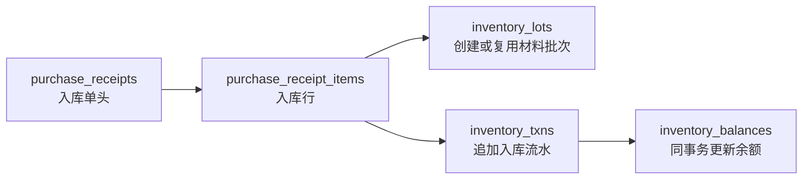

# Phase 2C 采购入库最小闭环评审

## 结论摘要

Phase 2C 只解决“材料采购到货后如何入库并进入库存事实”的最小闭环，不扩展完整采购、应付、发票、付款、生产、委外、品质或财务。

推荐采用方案 B：新增 `purchase_receipts / purchase_receipt_items` 作为采购入库专表真源，`business_records / business_record_items` 继续保留为通用单据快照和兼容层。采购入库专表负责驱动 `inventory_lots -> inventory_txns -> inventory_balances`，库存历史事实仍以 `inventory_txns` 为唯一真源。

## Phase 2C 边界

| 范围 | 本轮口径 |
| --- | --- |
| 做 | 采购入库草稿、入库行、过账入库、批次创建 / 复用、库存流水、库存余额、取消冲正、幂等。 |
| 不做 | 完整采购订单、采购合同审批、应付账款、发票、付款、财务核销、生产领料、委外发料、品质检验完整模块。 |
| 不新增 | `product_styles`、`warehouse_locations`、`stock_reservations`、供应商主数据、财务表、生产表、委外表、品质表。 |
| 不改 | 前端页面、帮助中心、旧 `business_records` 数据迁移、真实分区 migration。 |

Phase 2C 是 Phase 2A / 2B 的业务来源接入层，不推翻已有库存模型：

- `inventory_txns` 继续是库存历史事实真源。
- `inventory_balances` 继续是当前余额 / 查询加速表。
- `inventory_lots` 继续是批次身份和追溯真源。
- `business_records / business_record_items` 继续是通用单据快照和兼容层。

## 是否新增采购入库专表

| 方案 | 做法 | 优点 | 缺点 | 结论 |
| --- | --- | --- | --- | --- |
| 方案 A | 继续只用 `business_records / business_record_items`，入库时从通用快照行直接写库存流水。 | 改动最小，不增加专表；兼容现有通用页面。 | 通用表数量 / 金额仍是 float，材料 / 仓库 / 单位 / 批次没有强外键；难以承接取消冲正、重复入库防护、未来应付或采购追溯；库存来源行不够稳定。 | 不推荐作为 Phase 2C 主路径，可作为历史快照兼容层继续保留。 |
| 方案 B | 新增 `purchase_receipts / purchase_receipt_items`，通用单据只保存快照，专表作为采购入库来源真源。 | 入库来源行有稳定 ID，可直接作为 `inventory_txns.source_id/source_line_id`；数量和金额可用 decimal；能自然承接批次、过账、取消冲正和未来采购 / 应付扩展。 | 新增两张表和 usecase，复杂度高于方案 A；需要保持和通用快照的边界清楚。 | 推荐。复杂度仍可控，且与库存事实闭环、批次追溯、未来采购和应付更一致。 |

推荐方案 B，但本轮只落采购入库最小事实，不向采购订单、应付或供应商主数据扩展。

## 与 business_records 的关系

| 关系 | 口径 |
| --- | --- |
| `business_records` | 继续保存通用单据快照、打印 / 调试 / 兼容字段和旧入口数据，不替代采购入库专表。 |
| `purchase_receipts` | 采购入库专表头，作为入库过账、取消冲正和库存来源追溯的业务真源。 |
| 关联方式 | `purchase_receipts.business_record_id` nullable，指向可选通用快照；没有快照时也允许独立创建采购入库专表记录。 |
| 库存来源 | `inventory_txns.source_type/source_id/source_line_id` 指向采购入库专表，不指向通用快照。 |
| 历史数据 | 本轮不迁移旧 `business_records`；旧记录后续如需补录采购入库，必须按明确规则新建采购入库专表记录。 |

## 采购入库如何驱动库存

过账规则：

1. 只有 `DRAFT` 状态的采购入库单允许过账。
2. 每条入库行校验材料、仓库、单位和数量。
3. 如果行提供 `lot_id`，校验批次主体必须是同一材料。
4. 如果行提供 `lot_no` 且未指定 `lot_id`，按 `MATERIAL + material_id + lot_no` 创建或复用 `inventory_lots`。
5. 如果未提供 `lot_no / lot_id`，本轮允许非批次材料入库，写入 `lot_id = NULL` 的库存维度；这不会与批次库存互相抵扣。
6. 对每条行写入 `inventory_txns`，再同事务更新 `inventory_balances`。
7. 所有行成功后，采购入库单更新为 `POSTED` 并写 `posted_at`。

## source 与 idempotency 设计

| 字段 | Phase 2C 规则 |
| --- | --- |
| `inventory_txns.source_type` | 固定为 `PURCHASE_RECEIPT`。 |
| `inventory_txns.source_id` | `purchase_receipts.id`。 |
| `inventory_txns.source_line_id` | `purchase_receipt_items.id`。 |
| 入库幂等键 | `PURCHASE_RECEIPT:{receipt_id}:{item_id}:IN`。 |
| 取消冲正幂等键 | `PURCHASE_RECEIPT:{receipt_id}:{item_id}:REVERSAL`。 |

幂等要求：

- 相同入库单重复 `PostPurchaseReceipt` 不得重复增加库存。
- 如果库存流水已存在，库存写入应返回幂等重放或在单据已 `POSTED` 时直接返回当前单据。
- 取消已过账入库单时，每条原入库流水只能被冲正一次。
- 重复取消已取消单据不得重复冲正。

## 批次策略

| 场景 | 规则 |
| --- | --- |
| 提供 `lot_id` | 校验 `inventory_lots.subject_type = MATERIAL` 且 `subject_id = material_id`，通过后使用该批次。 |
| 提供 `lot_no` | 按 `MATERIAL + material_id + lot_no` 查找批次；存在则复用，不存在则创建 ACTIVE 批次。 |
| 未提供批次 | 本轮允许非批次入库，库存维度为 `lot_id = NULL`。 |
| 是否自动生成系统批次号 | 本轮不默认自动生成。自动批次号会成为追溯事实，需后续结合供应商批次、缸号、IQC 和仓库规则单独评审。 |
| 批次隔离 | 批次库存和非批次库存分别写余额，不能互相抵扣。 |

## 状态与冲正

| 状态 | 语义 | 是否影响库存 |
| --- | --- | --- |
| `DRAFT` | 草稿，可添加入库行。 | 不影响库存。 |
| `POSTED` | 已过账，已写入库存流水和余额。 | 已影响库存。 |
| `CANCELLED` | 已取消，针对已过账入库写入 REVERSAL 流水后关闭。 | 通过冲正流水回退库存。 |

冲正规则：

- 已 `POSTED` 的入库不能物理删除。
- 取消已过账单据必须写 `txn_type = REVERSAL` 的库存流水。
- REVERSAL 必须继承原流水 `lot_id`，不能把批次流水冲成非批次流水。
- 原入库流水和冲正流水都保留，余额由两条流水自然抵消。

## 字段建议

### purchase_receipts

| 字段 | 类型建议 | 说明 |
| --- | --- | --- |
| `id` | bigint | 主键。 |
| `receipt_no` | varchar(64) | 入库单号，唯一。 |
| `business_record_id` | bigint nullable | 可选关联通用快照。 |
| `supplier_name` | varchar(255) | 最小闭环先保存供应商名称快照，不强制供应商主表。 |
| `status` | varchar(32) | `DRAFT / POSTED / CANCELLED`。 |
| `received_at` | timestamptz | 到货 / 入库业务日期。 |
| `posted_at` | timestamptz nullable | 过账时间。 |
| `note` | varchar(255) nullable | 备注。 |
| `created_at / updated_at` | timestamptz | 审计时间。 |

### purchase_receipt_items

| 字段 | 类型建议 | 说明 |
| --- | --- | --- |
| `id` | bigint | 主键。 |
| `receipt_id` | bigint | 关联 `purchase_receipts.id`。 |
| `material_id` | bigint | 关联 `materials.id`。 |
| `warehouse_id` | bigint | 关联 `warehouses.id`。 |
| `unit_id` | bigint | 关联 `units.id`。 |
| `lot_id` | bigint nullable | 关联 `inventory_lots.id`；可由过账时创建 / 复用后回写。 |
| `lot_no` | varchar(64) nullable | 供应商 / 仓库录入批号，用于创建或复用材料批次。 |
| `quantity` | numeric(20,6) | 入库数量，必须 `> 0`。 |
| `unit_price` | numeric(20,6) nullable | 单价，非空时必须 `>= 0`；本轮不作为财务真源。 |
| `amount` | numeric(20,6) nullable | 金额，非空时必须 `>= 0`；本轮不作为应付真源。 |
| `source_line_no` | varchar(64) nullable | 外部行号 / 通用快照行号，可用于导入幂等辅助。 |
| `note` | varchar(255) nullable | 行备注。 |
| `created_at / updated_at` | timestamptz | 审计时间。 |

## 索引与约束建议

| 表 | 约束 / 索引 |
| --- | --- |
| `purchase_receipts` | `receipt_no` unique；`business_record_id` index；`supplier_name` index；`status` index；`received_at` index。 |
| `purchase_receipt_items` | `receipt_id` index；`material_id` index；`warehouse_id` index；`lot_id` index；`receipt_id + source_line_no` 在 `source_line_no IS NOT NULL AND source_line_no <> ''` 范围内唯一。 |
| `purchase_receipt_items` DB check | `quantity > 0`；`unit_price IS NULL OR unit_price >= 0`；`amount IS NULL OR amount >= 0`。 |

`inventory_txns.idempotency_key` 已有唯一约束，继续承担库存写入防重复职责。

## 是否需要 suppliers 表

本轮不新增 `suppliers`。理由：

- 最小采购入库闭环只需要供应商名称快照，不需要供应商额度、税务、账期、付款或对账信息。
- 供应商主数据会牵动采购、委外、应付和对账口径，应单独评审。
- `supplier_name` 作为快照字段足够支撑本轮入库单查询和追溯。

后续如果供应商编码、税务信息、账期、对账和付款进入范围，再设计 `suppliers` 主表。

## PostgreSQL 测试策略

| 验证 | 要求 |
| --- | --- |
| 本地库 | 使用 `127.0.0.1:55432/plush_erp_phase2c_test`。 |
| 防呆 | host 只允许本机 / 本机 Docker 名称，数据库名必须包含 `phase2c` 或 `test`。 |
| migration | 从空库 apply 全量 migration，最终 status 必须 OK。 |
| 结构 | 验证专表存在、numeric 字段、check constraint、unique index、FK 和库存既有 partial unique index。 |
| 行为 | 覆盖草稿、添加行、过账入库、重复过账、批次创建 / 复用、不同批次余额、非批次隔离、取消冲正、重复取消。 |

## 推荐落地方案

推荐落地方案 B：新增 `purchase_receipts / purchase_receipt_items`，`business_records` 继续作为快照和兼容层。

原因：

- 采购入库是库存事实的直接来源，需要稳定的单据头 ID 和行 ID 承接 `source_id/source_line_id`。
- 通用快照表的 float 数量和弱结构字段不适合继续扩展强库存事实。
- 未来采购订单、应付、生产领料和批次追溯都需要从“入库单行”回查库存流水和批次，专表能避免后续再迁一次来源语义。
- 本轮只新增两张窄表，不引入供应商、采购订单、应付或品质，复杂度仍在 Phase 2C 范围内。
