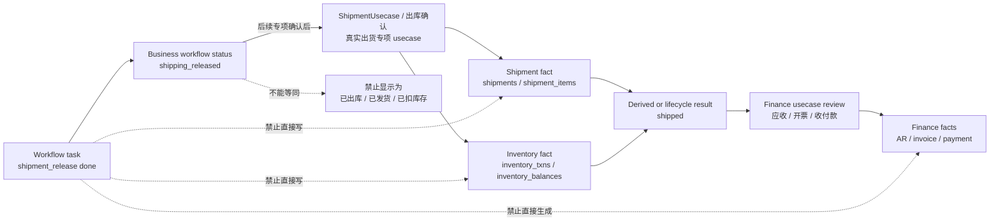

# 状态 / Workflow / Fact 边界 / Status, Workflow And Fact Boundary

## 核心口诀

```text
流程管协同，单据管阶段，事实管落账，结果靠计算，系统状态别混业务。
```

## 五层状态

| 层 | 负责什么 | 例子 |
| --- | --- | --- |
| Workflow 协同层 | 节点有没有处理、通过、拒绝、阻断 | pending / done / blocked |
| 单据生命周期层 | 订单、采购、出货等业务阶段 | draft / submitted / shipping_released / shipped |
| 业务事实层 | 真实动作有没有发生和过账 | inventory_txns / shipments / invoices / payments |
| 业务结果 / 派生状态 | 从事实汇总出来的结果 | partial_shipped / fully_paid / settled |
| 系统横切状态 | 幂等、同步、导入、通知等系统过程 | processing / synced / failed |

## 状态词拆分规则

外部规划稿、客户表格或旧入口里可能把审批、工程、采购、生产、出货和财务阶段都写进一个订单状态。正式实现必须拆层处理：

| 状态词 | 正确归属 | 不能做什么 |
| --- | --- | --- |
| boss_reviewing / approved | Workflow 或订单审批阶段 | 不能表示采购、生产、出货或财务完成 |
| engineering / purchasing / production | 业务阶段或协同进度 | 不能替代采购入库、生产领料、成品入库事实 |
| shipping_releasing / shipping_released | 出货放行阶段 | 不能表示已出库、已扣库存或已生成应收 |
| partially_shipped / shipped | 由 shipment fact 和库存事实推导 | 不能由 workflow task done 直接写入 |
| receivable / invoice / paid | Finance fact 或派生结果 | 不能从 `shipping_released`、旧快照或 workflow payload 直接生成 |

## 出货放行边界

- `workflow done != 已出库 / 已入库 / 已开票 / 已收款`。
- `shipping_released = 已放行 / 可发货 / 待出库`。
- `shipping_released != 已出库 / 已发货 / 已扣库存`。
- 只有真实 `ShipmentUsecase`、出库确认和库存事实写入后，才能进入 `shipped`。

`shipment_release done` 禁止直接触发：

- `inventory_txns`
- `shipments`
- `reservations`
- AR / invoice

### 出货放行边界图 / Shipment Release Boundary Diagram



上图只把既有边界可视化：`shipment_release done` 当前只能推进协同状态到 `shipping_released`。真实出货、库存扣减、应收、开票和收付款必须分别由对应事实 usecase 承接，不能由 Workflow 任务完成或旧 payload 伪造。

## 动作、事实、结果

正确链路：

```text
动作产生事实，事实推导结果。
```

示例：

```text
确认出库
-> 创建 / 确认 shipment
-> 写 inventory_txns posted
-> 根据事实计算 fulfillment_status
-> 必要时推进 order.status
```

错误链路：

```text
workflow done
-> 直接 order.status = shipped
-> 不写 shipment
-> 不写 inventory_txns
```

## 派生状态

- 派生状态可以缓存。
- 派生状态必须能从事实重算。
- 派生状态不能伪造事实。

## Canonical status 与中文文案

- DB 和业务逻辑只认 canonical status。
- UI 显示中文文案。
- UI 不能用中文文案做业务判断。
- 客户可以调整低风险显示文案，但不能改变状态语义。

`shipping_released` 可显示为：

- 已放行。
- 可发货。
- 待出库。
- 出货已放行。

不能显示为：

- 已出库。
- 已发货。
- 已扣库存。

## 当前状态词典树 / Current Status Dictionary Tree

本节列出当前已实现状态词典，并区分协同层、业务对象生命周期、事实层对象状态、事实流水类型和派生结果状态。未来候选单独列出，不作为当前 runtime、schema、API 或 UI 真源。

### 总览树 / Overview Tree

```text
状态词典树 / Status Dictionary Tree
├─ Workflow 协同任务状态 / Workflow Task Status
│  ├─ 待开始 / Pending / pending
│  ├─ 可执行 / Ready / ready
│  ├─ 处理中 / Processing / processing
│  ├─ 阻塞 / Blocked / blocked
│  ├─ 已完成 / Done / done
│  ├─ 已退回 / Rejected / rejected
│  ├─ 已取消 / Cancelled / cancelled
│  └─ 已关闭 / Closed / closed
│
├─ 业务协同状态 / Business Workflow Status
│  ├─ 立项待确认 / Project Pending / project_pending
│  ├─ 立项已放行 / Project Approved / project_approved
│  ├─ 资料准备中 / Engineering Preparing / engineering_preparing
│  ├─ 齐套准备中 / Material Preparing / material_preparing
│  ├─ 待排产 / Production Ready / production_ready
│  ├─ 生产中 / Production Processing / production_processing
│  ├─ 待检验 / QC Pending / qc_pending
│  ├─ IQC 待检 / IQC Pending / iqc_pending
│  ├─ 质检不合格 / QC Failed / qc_failed
│  ├─ 待入库或待出货 / Warehouse Processing / warehouse_processing
│  ├─ 待确认入库 / Warehouse Inbound Pending / warehouse_inbound_pending
│  ├─ 已入库 / Inbound Done / inbound_done
│  ├─ 待出货 / Shipment Pending / shipment_pending
│  ├─ 已放行待出库 / Shipping Released / shipping_released
│  ├─ 已出货 / Shipped / shipped
│  ├─ 对账中 / Reconciling / reconciling
│  ├─ 已结算 / Settled / settled
│  ├─ 业务阻塞 / Business Blocked / blocked
│  ├─ 业务取消 / Business Cancelled / cancelled
│  └─ 业务归档 / Business Closed / closed
│
├─ 业务对象生命周期状态 / Business Object Lifecycle Status
│  ├─ 销售订单生命周期 / Sales Order Lifecycle
│  │  ├─ 草稿 / Draft / draft
│  │  ├─ 已提交 / Submitted / submitted
│  │  ├─ 已生效 / Active / active
│  │  ├─ 已关闭 / Closed / closed
│  │  └─ 已取消 / Canceled / canceled
│  ├─ 销售订单行状态 / Sales Order Item Line Status
│  │  ├─ 未关闭 / Open / open
│  │  ├─ 已关闭 / Closed / closed
│  │  └─ 已取消 / Canceled / canceled
│  └─ BOM 状态 / BOM Status
│     ├─ 草稿 / Draft / DRAFT
│     ├─ 生效 / Active / ACTIVE
│     └─ 停用 / Disabled / DISABLED
│
├─ 事实层对象状态 / Fact Object Status
│  ├─ 采购入库单状态 / Purchase Receipt Status / DRAFT, POSTED, CANCELLED
│  ├─ 采购退货单状态 / Purchase Return Status / DRAFT, POSTED, CANCELLED
│  ├─ 采购入库调整单状态 / Purchase Receipt Adjustment Status / DRAFT, POSTED, CANCELLED
│  ├─ 质检单状态 / Quality Inspection Status / DRAFT, SUBMITTED, PASSED, REJECTED, CANCELLED
│  ├─ 质检结果 / Quality Inspection Result / PASS, REJECT, CONCESSION
│  └─ 库存批次状态 / Inventory Lot Status / ACTIVE, HOLD, REJECTED, DISABLED
│
├─ 事实流水类型 / Fact Transaction Type
│  └─ 库存流水类型 / Inventory Transaction Type
│     ├─ 入库 / In / IN
│     ├─ 出库 / Out / OUT
│     ├─ 调增 / Adjust In / ADJUST_IN
│     ├─ 调减 / Adjust Out / ADJUST_OUT
│     ├─ 调拨入 / Transfer In / TRANSFER_IN
│     ├─ 调拨出 / Transfer Out / TRANSFER_OUT
│     └─ 冲正 / Reversal / REVERSAL
│
└─ 派生结果状态 / Derived Result Status
   ├─ 库存当前余额 / Inventory Current Balance / inventory_balances.quantity
   └─ 已结算协同结果 / Settled Coordination Result / settled
```

### 当前已实现：协同层任务状态 / Implemented Workflow Task Status

写入 usecase：`WorkflowUsecase.CreateTask`、`WorkflowUsecase.UpdateTaskStatus`。这些状态不是事实。终态保护：`done / cancelled / closed` 后不能继续处理或催办。

| canonical key | 中文显示 | 所属对象 / 字段 | 写入 usecase | 是否已实现 | 是否事实 | 允许流转 | 终态保护 |
| --- | --- | --- | --- | --- | --- | --- | --- |
| `pending` | 待开始 | `workflow_tasks.task_status_key` | `WorkflowUsecase.CreateTask / UpdateTaskStatus` | 是 | 否 | 非终态任务可更新到合法 task status；特殊规则按 `task_group` 再约束 | 否 |
| `ready` | 可执行 | `workflow_tasks.task_status_key` | 同上 | 是 | 否 | 同上 | 否 |
| `processing` | 处理中 | `workflow_tasks.task_status_key` | 同上 | 是 | 否 | 同上 | 否 |
| `blocked` | 阻塞 | `workflow_tasks.task_status_key` | `WorkflowUsecase.UpdateTaskStatus` | 是 | 否 | 需要 reason；特殊规则可写业务 `blocked` 或派生异常任务 | 否 |
| `done` | 已完成 | `workflow_tasks.task_status_key` | `WorkflowUsecase.UpdateTaskStatus` | 是 | 否 | 当前任务完成；特殊规则可推进协同状态或派生下游任务 | 是 |
| `rejected` | 已退回 | `workflow_tasks.task_status_key` | `WorkflowUsecase.UpdateTaskStatus` | 是 | 否 | 需要 reason；审批、检验或确认未通过 | 否 |
| `cancelled` | 已取消 | `workflow_tasks.task_status_key` | `WorkflowUsecase.UpdateTaskStatus` | 是 | 否 | 取消任务 | 是 |
| `closed` | 已关闭 | `workflow_tasks.task_status_key` | `WorkflowUsecase.UpdateTaskStatus` | 是 | 否 | 归档关闭 | 是 |

### 当前已实现：协同业务状态 / Implemented Business Workflow Status

写入 usecase：`WorkflowUsecase.UpdateTaskStatus`、`WorkflowUsecase.UpsertBusinessState`、`BusinessRecordUsecase.CreateRecord / UpdateRecord`。这些状态不是事实。`shipped / reconciling / settled` 当前只是协同业务 key，不代表真实出货、应收、开票、付款或结算事实已经落地。

| canonical key | 中文显示 | 所属对象 / 字段 | 写入 usecase | 是否已实现 | 是否事实 | 允许流转 | 终态保护 |
| --- | --- | --- | --- | --- | --- | --- | --- |
| `project_pending` | 立项待确认 | `workflow_business_states.business_status_key` / `business_records.business_status_key` | `WorkflowUsecase` / `BusinessRecordUsecase` | 是 | 否 | -> `project_approved / blocked / cancelled` | 否 |
| `project_approved` | 立项已放行 | 同上 | 同上 | 是 | 否 | -> `engineering_preparing / material_preparing / blocked / cancelled` | 否 |
| `engineering_preparing` | 资料准备中 | 同上 | 同上 | 是 | 否 | -> `material_preparing / blocked / cancelled` | 否 |
| `material_preparing` | 齐套准备中 | 同上 | 同上 | 是 | 否 | -> `iqc_pending / production_ready / blocked / cancelled` | 否 |
| `production_ready` | 待排产 | 同上 | 同上 | 是 | 否 | -> `production_processing / blocked / cancelled` | 否 |
| `production_processing` | 生产中 | 同上 | 同上 | 是 | 否 | -> `qc_pending / warehouse_processing / blocked / cancelled` | 否 |
| `qc_pending` | 待检验 | 同上 | 同上 | 是 | 否 | -> `warehouse_processing / production_processing / blocked / cancelled` | 否 |
| `iqc_pending` | IQC 待检 | 同上 | 同上 | 是 | 否 | -> `warehouse_inbound_pending / qc_failed / blocked / cancelled` | 否 |
| `qc_failed` | 质检不合格 | 同上 | 同上 | 是 | 否 | -> `material_preparing / iqc_pending / blocked / cancelled` | 否 |
| `warehouse_processing` | 待入库 / 待出货 | 同上 | 同上 | 是 | 否 | -> `shipping_released / shipped / blocked / cancelled` | 否 |
| `warehouse_inbound_pending` | 待确认入库 | 同上 | 同上 | 是 | 否 | -> `inbound_done / blocked / cancelled` | 否 |
| `inbound_done` | 已入库 | 同上 | 同上 | 是 | 否 | -> `material_preparing / production_ready / shipment_pending / closed` | 对部分 workflow 特殊规则不再重复触发 |
| `shipment_pending` | 待出货 | 同上 | 同上 | 是 | 否 | -> `shipped / blocked / cancelled` | 否 |
| `shipping_released` | 已放行待出库 | 同上 | `WorkflowUsecase.UpdateTaskStatus` / `BusinessRecordUsecase` | 是 | 否 | -> `shipped / blocked / cancelled` | 对 `shipment_release` 特殊规则不再触发 |
| `shipped` | 已出货 | 同上 | `BusinessRecordUsecase` / 前端协同状态流转 | 是，仅协同 key | 否，真实 fact 未实现 | -> `reconciling / closed` | 对 `shipment_release` 特殊规则不再触发 |
| `reconciling` | 对账中 | 同上 | `BusinessRecordUsecase` / 前端协同状态流转 | 是，仅协同 key | 否，真实 finance fact 未实现 | -> `settled / blocked / closed` | 否 |
| `settled` | 已结算 | 同上 | `BusinessRecordUsecase` / 前端协同状态流转 | 是，仅协同 key | 否，真实结算 fact 未实现 | -> `closed` | 否 |
| `blocked` | 业务阻塞 | 同上 | `WorkflowUsecase` / `BusinessRecordUsecase` | 是 | 否 | -> `material_preparing / production_ready / production_processing / qc_pending / warehouse_processing / shipment_pending / reconciling / cancelled` | 否；原因必填 |
| `cancelled` | 业务取消 | 同上 | `BusinessRecordUsecase` / 前端协同状态流转 | 是 | 否 | -> `closed` | 原因必填 |
| `closed` | 业务归档 | 同上 | `BusinessRecordUsecase` / 前端协同状态流转 | 是 | 否 | 无后续 | 业务层归档态 |

### 当前已实现：业务对象生命周期状态 / Implemented Business Object Lifecycle

| canonical key | 中文显示 | 所属对象 / 字段 | 写入 usecase | 是否已实现 | 是否事实 | 允许流转 | 终态保护 |
| --- | --- | --- | --- | --- | --- | --- | --- |
| `draft` | 草稿 | `sales_orders.lifecycle_status` | `SalesOrderUsecase.CreateSalesOrder / SubmitSalesOrder / CancelSalesOrder` | 是 | 否 | -> `submitted / canceled` | 否 |
| `submitted` | 已提交 | `sales_orders.lifecycle_status` | `SalesOrderUsecase.SubmitSalesOrder / ActivateSalesOrder / CancelSalesOrder` | 是 | 否 | -> `active / canceled` | 否 |
| `active` | 已生效 | `sales_orders.lifecycle_status` | `SalesOrderUsecase.ActivateSalesOrder / CloseSalesOrder / CancelSalesOrder` | 是 | 否 | -> `closed / canceled` | 否 |
| `closed` | 已关闭 | `sales_orders.lifecycle_status` | `SalesOrderUsecase.CloseSalesOrder` | 是 | 否 | 无后续 | 是；订单不可再改 |
| `canceled` | 已取消 | `sales_orders.lifecycle_status` | `SalesOrderUsecase.CancelSalesOrder` | 是 | 否 | 无后续 | 是；订单不可再改 |
| `open` | 未关闭 | `sales_order_items.line_status` | `SalesOrderUsecase.AddSalesOrderItem / UpdateSalesOrderItem / RemoveSalesOrderItem` | 是 | 否 | 当前公开 usecase 主要支持 -> `canceled`；`closed` 是合法状态但无独立关闭 usecase | 否 |
| `closed` | 已关闭 | `sales_order_items.line_status` | repo/usecase 校验支持 | 是 | 否 | 无后续 | 是；行不可再改 |
| `canceled` | 已取消 | `sales_order_items.line_status` | `SalesOrderUsecase.RemoveSalesOrderItem` | 是 | 否 | 无后续 | 是；重复取消幂等 |
| `DRAFT` | 草稿 | `bom_headers.status` | `InventoryUsecase.CreateBOMHeader` | 是 | 否，主数据状态 | 当前仅创建时写入，无独立流转 usecase | 无明确终态 |
| `ACTIVE` | 生效 | `bom_headers.status` | `InventoryUsecase.CreateBOMHeader` | 是 | 否，主数据状态 | 当前仅创建时写入；同一产品最多一个 `ACTIVE` BOM | 唯一活跃约束 |
| `DISABLED` | 停用 | `bom_headers.status` | `InventoryUsecase.CreateBOMHeader` | 是 | 否，主数据状态 | 当前仅创建时写入，无独立流转 usecase | 无明确终态 |

### 当前已实现：事实层对象状态 / Implemented Fact Object Status

| canonical key | 中文显示 | 所属对象 / 字段 | 写入 usecase | 是否已实现 | 是否事实 | 允许流转 | 终态保护 |
| --- | --- | --- | --- | --- | --- | --- | --- |
| `DRAFT` | 草稿 | `purchase_receipts.status` | `InventoryUsecase.CreatePurchaseReceiptDraft` | 是 | 是 | -> `POSTED` | 否 |
| `POSTED` | 已过账 | `purchase_receipts.status` | `InventoryUsecase.PostPurchaseReceipt` | 是 | 是 | -> `CANCELLED`；通过 `REVERSAL` 回退库存 | 关键字段不可直接改 |
| `CANCELLED` | 已取消 | `purchase_receipts.status` | `InventoryUsecase.CancelPostedPurchaseReceipt` | 是 | 是 | 无后续；重复取消幂等 | 是；禁止删除 |
| `DRAFT` | 草稿 | `purchase_returns.status` | `InventoryUsecase.CreatePurchaseReturnDraft` | 是 | 是 | -> `POSTED` | 否 |
| `POSTED` | 已过账 | `purchase_returns.status` | `InventoryUsecase.PostPurchaseReturn` | 是 | 是 | -> `CANCELLED`；通过 `REVERSAL` 回补库存 | 关键字段不可直接改 |
| `CANCELLED` | 已取消 | `purchase_returns.status` | `InventoryUsecase.CancelPostedPurchaseReturn` | 是 | 是 | 无后续；重复取消幂等 | 是；禁止删除 |
| `DRAFT` | 草稿 | `purchase_receipt_adjustments.status` | `InventoryUsecase.CreatePurchaseReceiptAdjustmentDraft` | 是 | 是 | -> `POSTED` | 否 |
| `POSTED` | 已过账 | `purchase_receipt_adjustments.status` | `InventoryUsecase.PostPurchaseReceiptAdjustment` | 是 | 是 | -> `CANCELLED`；通过 `REVERSAL` 冲正调整流水 | 关键字段不可直接改 |
| `CANCELLED` | 已取消 | `purchase_receipt_adjustments.status` | `InventoryUsecase.CancelPostedPurchaseReceiptAdjustment` | 是 | 是 | 无后续；重复取消幂等 | 是；禁止删除 |
| `DRAFT` | 草稿 | `quality_inspections.status` | `InventoryUsecase.CreateQualityInspectionDraft` | 是 | 是 | -> `SUBMITTED / CANCELLED` | 否 |
| `SUBMITTED` | 已提交 | `quality_inspections.status` | `InventoryUsecase.SubmitQualityInspection` | 是 | 是 | -> `PASSED / REJECTED / CANCELLED`；提交会把批次置 `HOLD` | 同批次只允许一个 submitted |
| `PASSED` | 已通过 | `quality_inspections.status` | `InventoryUsecase.PassQualityInspection` | 是 | 是 | 无后续；批次置 `ACTIVE`，结果 `PASS / CONCESSION` | 是 |
| `REJECTED` | 已拒收 | `quality_inspections.status` | `InventoryUsecase.RejectQualityInspection` | 是 | 是 | 无后续；批次置 `REJECTED`，结果 `REJECT` | 是 |
| `CANCELLED` | 已取消 | `quality_inspections.status` | `InventoryUsecase.CancelQualityInspection` | 是 | 是 | 无后续；仅 `DRAFT / SUBMITTED` 可取消 | 是 |
| `PASS` | 通过 | `quality_inspections.result` | `InventoryUsecase.PassQualityInspection` | 是 | 是 | 随 `PASSED` 写入 | 随质检终态保护 |
| `REJECT` | 拒收 | `quality_inspections.result` | `InventoryUsecase.RejectQualityInspection` | 是 | 是 | 随 `REJECTED` 写入 | 随质检终态保护 |
| `CONCESSION` | 让步接收 | `quality_inspections.result` | `InventoryUsecase.PassQualityInspection` | 是 | 是 | 随 `PASSED` 写入 | 随质检终态保护 |
| `ACTIVE` | 可用 | `inventory_lots.status` | `InventoryUsecase.ChangeInventoryLotStatus`；质检通过也会写 | 是 | 是，批次状态真源 | -> `HOLD`；退货可从 `ACTIVE / HOLD / REJECTED` 扣减 | 否 |
| `HOLD` | 冻结 | `inventory_lots.status` | `InventoryUsecase.ChangeInventoryLotStatus`；质检提交也会写 | 是 | 是 | -> `ACTIVE / REJECTED` | 否 |
| `REJECTED` | 不合格 | `inventory_lots.status` | `InventoryUsecase.ChangeInventoryLotStatus`；质检拒收也会写 | 是 | 是 | -> `ACTIVE / HOLD`；采购退货允许扣减 | 否 |
| `DISABLED` | 停用 | `inventory_lots.status` | `InventoryUsecase.ChangeInventoryLotStatus` | 是 | 是 | 无后续；只有无正余额才可进入 | 是 |

### 当前已实现：事实流水类型 / Implemented Fact Transaction Type

所属对象 / 字段：`inventory_txns.txn_type`。写入 usecase：`InventoryUsecase.CreateInventoryTxn`、`InventoryUsecase.ApplyInventoryTxnAndUpdateBalance`，以及采购入库、采购退货、采购入库调整过账或取消时内部写入。允许流转：无状态流转，append-only。终态保护：`inventory_txns` 不允许 update/delete，错误只能追加 `REVERSAL`。

| canonical key | 中文显示 | 当前写入来源 | 方向 | 是否已实现 | 是否事实 |
| --- | --- | --- | --- | --- | --- |
| `IN` | 入库 | `InventoryUsecase.PostPurchaseReceipt` | `+1` | 是 | 是 |
| `OUT` | 出库 | `InventoryUsecase.PostPurchaseReturn`；未来出货扣减也应走事实 usecase | `-1` | 是 | 是 |
| `ADJUST_IN` | 调增 | `InventoryUsecase.PostPurchaseReceiptAdjustment` | `+1` | 是 | 是 |
| `ADJUST_OUT` | 调减 | `InventoryUsecase.PostPurchaseReceiptAdjustment` | `-1` | 是 | 是 |
| `TRANSFER_IN` | 调拨入 | 类型已实现校验，当前无专项调拨 usecase | `+1` | 是，类型校验已实现 | 是 |
| `TRANSFER_OUT` | 调拨出 | 类型已实现校验，当前无专项调拨 usecase | `-1` | 是，类型校验已实现 | 是 |
| `REVERSAL` | 冲正 | 取消采购入库、采购退货、采购入库调整时写入 | `+1` 或 `-1`，必须关联 `reversal_of_txn_id` | 是 | 是 |

### 当前已实现：派生结果状态 / Implemented Derived Result Status

| canonical key | 中文显示 | 所属对象 / 字段 | 写入 usecase | 是否已实现 | 是否事实 | 允许流转 | 终态保护 |
| --- | --- | --- | --- | --- | --- | --- | --- |
| 无独立 status key | 库存当前余额 | `inventory_balances.quantity` | `InventoryUsecase.ApplyInventoryTxnAndUpdateBalance` | 是，作为查询加速值 | 否；结果来自 `inventory_txns` 汇总 | 不适用 | 不适用 |
| `settled` | 已结算 | `business_status_key` | 协同 / 业务记录层 | 是，仅协同 key | 否；真实结算 fact 未实现 | -> `closed` | 非 fact 终态 |

### 未来候选状态 / Future Candidate Statuses

以下状态只能作为候选或边界提醒，不能作为当前可写状态、schema 真源、API 真源或 UI 判断真源。

| 候选 key / 名称 | 中文显示 | 预期归属 | 当前状态 |
| --- | --- | --- | --- |
| `shipment_execution` / `shipment.status` | 出货执行 / 出货单状态 | 未来 `ShipmentUsecase` / 出货事实层 | 未实现；不能由 `shipment_release done` 伪造 |
| `shipped` 作为真实事实结果 | 已出货 | 未来出货事实 + 库存扣减后的派生结果 | 当前只有协同 key，真实 fact 未实现 |
| `receivable_pending` | 待应收登记 | 未来财务协同 / 应收 fact | 当前未进正式词典，只作为后续状态边界出现 |
| `invoice_pending` | 待开票登记 | 未来财务协同 / 发票 fact | 当前未进正式词典，只作为后续状态边界出现 |
| `partial_shipped` | 部分出货 | 未来从 shipment facts 派生 | 未实现 |
| `fully_paid` | 已全额收款 | 未来从 payment facts 派生 | 未实现 |
| `synced / failed / processing` | 已同步 / 失败 / 处理中 | 未来系统横切过程状态 | 当前无统一对象状态表 |

### 禁止混用 / Forbidden Misuse

| 禁止混用 | 正确口径 |
| --- | --- |
| `workflow task done` = fact posted | 错。`done` 只表示协同任务完成，事实必须由对应 fact usecase 写入。 |
| `shipment_release done` = `shipped` | 错。它只写 `shipping_released`，不扣库存、不生成 shipment、不生成应收 / 开票。 |
| `shipping_released` 显示为“已出库 / 已发货 / 已扣库存” | 禁止。只能显示为“已放行 / 可发货 / 待出库 / 出货已放行”。 |
| `business_records.business_status_key` = 所有事实真源 | 错。它是通用单据快照 / 兼容层，不替代库存、采购、质检等专表事实。 |
| `inventory_balances` = 事实流水 | 错。余额是查询加速 / 当前结果，事实真源是 `inventory_txns`。 |
| 取消已过账单据 = 改回草稿或删除 | 禁止。已过账采购 / 退货 / 调整必须追加 `REVERSAL` 并保留历史。 |
| `sales_orders.lifecycle_status = shipped` | 禁止。销售订单生命周期只允许 `draft / submitted / active / closed / canceled`。 |
| 前端隐藏菜单 / 按钮 = 权限边界 | 错。权限仍由后端 RBAC + workflow ownership/status 校验。 |

## 最小测试要求

- blocked / rejected 必须要求 reason。
- 空字符串 / 全空格 reason 无效。
- 重复提交幂等。
- 同名但非目标任务不触发。
- settled 后不触发特殊 rule。
- 中文文案变更不影响业务逻辑。
