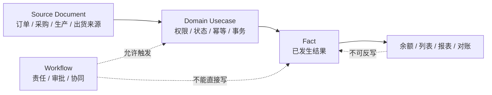

# 业务事实边界 / Operational Fact Boundary

本文维护库存、采购、质检、生产、委外、出货、预留和财务事实的共同合同。表字段、状态值和已实现动作以当前 schema、repository、usecase、API 与测试为准。

## 当前结论

- Fact 只记录已经发生、需要审计和对账的业务结果；计划、申请、审批和任务完成不是事实。
- 每类事实只有一个写入 owner，正式写入必须经过对应 Go usecase，不能由 Workflow、前端或临时脚本双写。
- 生效事实通常不可直接编辑或删除；更正使用取消、冲正、调整或新事实，并保留来源和操作证据。
- 库存余额、业务汇总和页面统计是事实投影，不是独立可写真源。

## 当前事实 owner

| 领域 | 主要真源 | 关键边界 |
| --- | --- | --- |
| 库存 | `inventory_txns`、`inventory_balances`、`inventory_lots` | 流水负责变化证据，余额为受控投影，批次保持来源可追溯 |
| 采购收货 | `purchase_receipts/items`、returns、adjustments | 收货、退货和调整分别留痕；采购单批准不等于入库 |
| 质检 | `quality_inspections` | 质检任务完成不等于质量事实；判定、来源和被替代关系可审计 |
| 生产 | `production_facts` | 发料、成品入库、返工按正式动作过账；生产任务完成不自动写事实 |
| 委外 | `outsourcing_facts` | 发料和回货按委外事实记录；协同节点不替代数量事实 |
| 销售预留 | `stock_reservations` | 预留、释放、消耗、取消由正式状态机控制；不等于实际出库 |
| 出货 | `shipments/items` | `SHIPPED` 才表示真实出货；`shipping_released` 只是 Workflow 放行 |
| 财务 | `finance_facts` | 应收、应付、发票和对账按正式来源及状态产生；销售或采购源单不自动成为财务事实 |

## 分层触发

Workflow 可在规则满足后触发某个正式事实动作，但仍必须经过同一 usecase、服务端 RBAC、来源匹配、状态、幂等和事务检查。任务 `done`、ProcessRuntime `completed` 或客户配置 `approved` 都不能替代 Fact posted。

## 通用生命周期

1. 草稿只表示尚未生效的输入，是否允许修改由对象合同决定。
2. 过账 / 生效必须绑定来源、操作人、时间、幂等键和完整业务字段。
3. 重复请求必须返回同一结果或明确拒绝，不能重复记账。
4. 已生效事实禁止直接改删；取消、冲正和调整必须保留原事实关系、原因和审计信息。
5. 事务失败不能留下半条事实、余额漂移或来源状态先行变化。
6. 查询表、余额和统计必须能够由事实链解释，并有一致性检查或重建边界。

## 来源、数量与快照

- 来源 ID / 行 ID 用于追溯，来源类型必须受枚举或共享合同约束。
- 数量、单位、仓库、批次、产品 / 物料与 SKU 的组合必须在 usecase 中校验，不能只依赖页面必填。
- 名称、编码、单价或对方信息需要历史可读时保存受控快照；主数据后续变化不静默改写事实。
- 来源切换或取消时必须处理残值、预留、余额和下游投影，不能只修改一个页面状态。

## 权限与客户配置

- 服务端权限码保护事实查看、创建、过账、取消、冲正和敏感金额动作。
- owner / assignee / role / status 等对象条件仍在服务端判断。
- 菜单、客户字段配置和 Workflow 包只能收窄或提供入口，不能提升权限、增加事实类型或改变写入 owner。

## 变更检查

事实能力变更至少验证：happy path、非法状态、重复提交、权限拒绝、来源不匹配、数量边界、事务失败、取消 / 冲正、不可改删、余额与查询一致性，以及关联页面的默认、交互、恢复和错误态。

更细的状态合同见[状态字典与生命周期索引](状态字典与生命周期索引.md)和[状态、Workflow 与 Fact 边界](状态工作流事实边界.md)；业务字段流向见[业务主链路数据流向与字段来源规则](../product/业务主链路数据流向与字段来源规则.md)。
