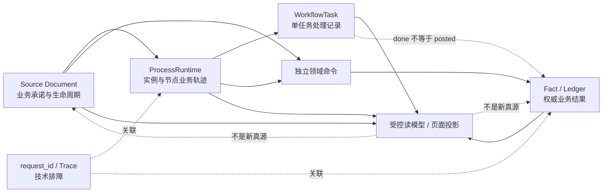

# 业务链与运行轨迹边界 / Business Chain And Runtime Trajectory Boundary

## 结论与读者路径

本项目把“业务链设计”和“业务链运行轨迹”明确分开：业务链设计是完整业务过程的主骨架；每个链路步骤只引用正式责任、前置状态、允许动作、结果状态、ProcessRuntime 节点和 Fact，不在链目录复制维护这些真源。运行轨迹则是把一次真实运行中已经持久化的对象和事件按明确范围排序、串联或投影后的只读结果。设计允许怎样走，不等于某笔业务已经这样走过；当前状态、页面聚合和设计地图也都不是运行历史或新的业务真源。

本项目当前可以直接查询两条任务相关读链：

- `workflow.get_task_process_context`：按任务锚点读取来源单据的 ProcessRuntime **业务轨迹**。
- `workflow.list_task_events`：读取一条任务自身的 **本任务处理记录**。

两条真实读链必须分层展示。单任务记录不能冒充跨节点审批链，业务轨迹也不能证明库存、质检、出货、生产、核销或财务 Fact 已过账。完整跨域运行业务链、完整审批处理链、通用状态历史链、通用运行时数据血缘和独立通知链当前都没有统一查询合同；页面遇到证据缺口必须失败关闭或明确标为局部投影。

本地开发“业务链与运行观察台”默认展示完整的 **Product Core 业务链设计总图**：总图只放 11 个链级节点，按主链、供给支撑、异常返工和纠正冲正分区，并使用目录登记的明确关系表达链间衔接；点击任一节点后，才进入该条业务链的来源单据、Workflow、ProcessRuntime、Fact 和状态规则明细。11 条主链、支撑链、异常链、返工链和冲正链登记 67 个链路步骤和 66 个合法回归场景，覆盖 27 个业务状态对象、6 个 process key / 7 个 variant 和 19 个 Fact / Ledger 定义；另外 6 个横切控制面对象保留在状态目录中，不硬塞进线性业务链。总图不是伪造的第 12 条业务链，也不会把所有链的内部节点挤成一张巨型图。页面可用真实 `task_id` 最多高亮其所属的一条业务链；进入单链后才定位对应的 ProcessRuntime 链段。这张地图回答“正式设计允许怎样衔接”，不是跨域运行历史 API；高亮一个任务也不证明前后 Source Document 或 Fact 已经发生。

## 业务链步骤与回归投影

业务链不按“链 × 角色 × 状态 × 动作”任意相乘。目录先选择一条业务链，再按链路拓扑展开步骤；每一步绑定已登记的责任池或权限、前置状态、允许动作、结果状态、流程节点和 Fact。角色视图、状态视图、运行视图、Fact 视图、甲方校对稿和人工验收计划都从这些步骤分类投影，不能分别维护平行清单。

| 内容           | 正式真源                                                           | 业务链目录负责什么                                             |
| -------------- | ------------------------------------------------------------------ | -------------------------------------------------------------- |
| 责任岗位与权限 | RBAC、客户角色矩阵、ProcessRuntime 责任池                          | 引用责任池或能力，不复制岗位权限表                             |
| 前置与结果状态 | 各领域状态合同和 canonical transition                              | 引用状态与合法转换，不新造第二套状态机                         |
| 允许动作       | 领域 usecase、ProcessRuntime 白名单命令、权限合同                  | 把正式动作编排进一个明确步骤                                   |
| 已生效结果     | Fact / Ledger 目录与领域事实表                                     | 引用结果类型和边界，不用任务完成冒充过账                       |
| 造数与回归     | 现有 `manual-acceptance-dataset` 串行 runner、合同测试和浏览器验收 | 为每条链登记正常、阻塞与恢复、无权限、错误状态、纠正和幂等场景 |

造数和回归的固定顺序是：**选择业务链 → 展开链路步骤 → 读取每一步绑定 → 只执行已登记场景**。正常路径以及需要业务数据前置的纠正或浏览器负向场景复用现有 `role / source / task / facts / readiness` 阶段；不能合法持久化的无权限、错误状态和重复提交边界由合同测试或真实浏览器动作证明，禁止为了“覆盖”而在数据库里保存非法状态。

造数计划同时保存业务链数据摘要和验证摘要。旧数据的处理规则只有三种：数据摘要和验证摘要都相同则仍可用；数据摘要相同但验证摘要变化则保留数据并重新核验；责任、状态、动作、Fact、步骤归属或数据场景变化导致数据摘要变化时，必须在专用验收库用现有 runner 重新造数。历史回执缺少数据摘要时失败关闭，不能靠 Codex 定时抄一份清单来宣称同步。

状态同步门禁先从 Ent schema 机械发现持久化的状态所有者字段，再与状态目录通过 canonical contract 和显式 `schemaStatusRefs` 登记的集合做全等校验；同一字段不得归属两个观察项。业务侧先新增或改名会产生“未登记所有者”，观察台先登记不存在的字段或重复归属也会失败。事件的 `from / to`、原值快照和原因字段不是当前状态所有者，不纳入这条门禁。该门禁只守状态所有者，以及现有 ProcessRuntime、Fact / Ledger 和业务链目录之间的合同覆盖，不把普通业务字段纳入观察台，也不让观察台反向定义 schema、合法状态或领域动作。

当前通用真实读取只包括 `workflow.list_tasks`、`workflow.list_task_events` 和 task-scoped `workflow.get_task_process_context`。后端没有通用 ProcessRuntime 实例 ID 直查，也没有跨领域事实凭证 ID 查询；观察台因此只展示已核实的事实定义，并明确标注“未提供运行凭证查询”，不得用 mock 或目录命中冒充真实落账凭证。

继续阅读：

1. 流的设计边界见 [各类流程建模边界评审](各类流程建模边界评审.md)。
2. 六条正式 ProcessRuntime 及领域副作用见 [业务与协同流程地图](../workflow/业务与协同流程地图.md)。
3. 状态分层见 [状态字典与生命周期索引](状态字典与生命周期索引.md)。
4. 字段和事实来源见 [业务主链路数据流向与字段来源规则](../product/业务主链路数据流向与字段来源规则.md)。
5. 审计与 Trace 分层见 [日志链路追踪审计第一版](../observability/日志链路追踪审计第一版.md)。

## 链和流的区别

| 维度       | 流 / Flow                                                              | 链 / Chain                                                                                                  |
| ---------- | ---------------------------------------------------------------------- | ----------------------------------------------------------------------------------------------------------- |
| 回答的问题 | 系统允许怎样推进，节点、规则、状态转换和异常分支是什么                 | 某次真实运行已经发生了什么，按什么对象和顺序可以复核                                                        |
| 主要真源   | Product Core 流程合同、状态机、ProcessRuntime 定义、领域 usecase、RBAC | 已持久化的 Source Document、ProcessInstance / Node、WorkflowTask / Event、Fact / Ledger、领域审计和受控快照 |
| 时间语义   | 设计时与允许路径；可能含尚未选择的未来分支                             | 运行时与已发生事实；不得把 `waiting` 分支排成确定未来                                                       |
| 页面边界   | 展示当前可执行路径和失败原因，不在前端造规则                           | 只投影已有证据，不从标题、payload、fixture、preview 或当前状态猜历史                                        |
| 完整性     | 由合同、状态机和测试证明允许路径                                       | 由对象范围、排序键、权限、缺失证据和分页边界共同决定                                                        |

流至少分为业务流、单据流、状态流、工作流、审批流、任务流、异常流、通知流和自动流转。单据流描述一张 Source Document 自身的生命周期和受控上下游关系，不是第二套流程引擎；审批流只是工作流中处理审核、同意、拒绝、退回等决定的部分，审批决定不等于业务事实已经发生。

### 链不是可编排对象

流程合同可以选择允许路径，链只能读取已经发生的证据。任何甲方配置、页面筛选或管理权限都不得：

- 增加、删除、改写或重新排序已持久化事件。
- 把当前状态、标题、payload、fixture、preview 配置或缺失记录补成历史。
- 把一条任务、一个 ProcessRuntime 实例或一次 request / Trace 扩写成完整业务链。

客户差异只能在服务端完成 RBAC、enabled 模块、active revision entitlement、role revoke、owner / assignee / pool 和 data scope 校验后，收窄链的对象可见性、筛选条件和展示字段。异常发生后，其真实证据分别进入对应的单据生命周期、ProcessRuntime 节点、任务事件、领域 Fact / Ledger 和审计记录；在没有统一根对象与查询合同前，不另造一条“万能异常链”。

## 链的类型与适用场景

| 链类型                  | 对象范围与适用场景                                                                                     | 当前能力                                                                                                                                     | 不得推断                                                                                      |
| ----------------------- | ------------------------------------------------------------------------------------------------------ | -------------------------------------------------------------------------------------------------------------------------------------------- | --------------------------------------------------------------------------------------------- |
| 业务链                  | 跨 Source Document、Workflow / ProcessRuntime 与 Fact 的业务关联；用于回答一笔业务从承诺到事实走到哪里 | **设计地图完整、运行投影局部**：开发观察台登记正式链路设计；各领域已有来源 ID、ProcessRuntime 锚点和部分 Fact 关联，但没有通用跨域业务链 API | 不把设计地图或单个任务高亮当成已发生历史；不从标题、payload、业务单号文本或页面拼接完整运行链 |
| ProcessRuntime 业务轨迹 | 单个 ProcessInstance 内已持久化节点、当前节点、完成节点和任务锚点；用于解释来源流程走到哪里            | **可直接查询**：`get_task_process_context`，但入口是当前可见任务，范围是该任务锚定的来源流程                                                 | 不把未选 `waiting` 分支排成未来步骤；不等于任务处理记录或 Fact                                |
| 单任务处理记录          | 单个 WorkflowTask 的创建、状态、转交、阻塞、恢复、完成、退回、催办等事件                               | **可直接查询**：`list_task_events`，按事件 ID 最新在前，最多返回最近 100 条并明确 `truncated`                                                | `truncated=true` 时只是局部投影；不跨任务拼成完整审批链，不表示来源对象已批准或已过账         |
| 审批处理链              | 跨审批节点、处理人、角色、决定、原因和顺序的完整审批历史                                               | **尚未实现统一链**；只能分别看到 ProcessRuntime 节点和单任务事件的局部证据                                                                   | 后端没有完整跨节点持久化和查询合同时，不得称为“完整审批链”                                    |
| 状态变化链              | 同一对象每次合法状态转换及操作者、原因、版本和时间                                                     | **按领域不一**：WorkflowTask 有事件；部分 Source / Fact 有审计字段或领域事件；没有通用状态历史 API                                           | 当前状态不是状态历史；不得从 `updated_at` 或现值倒推中间状态                                  |
| 数据来源链              | 选择值、来源带值、快照、Fact、派生读模型和打印 / 导出字段之间的 lineage                                | **合同明确、运行证据局部**：字段来源规则和领域关联可复核；没有通用运行时 lineage store                                                       | 不从相同文案或相同数值推断来源；页面聚合不是新真源                                            |
| 审计链                  | 操作者、角色、对象、动作、前后状态、结果和 request_id；用于问责与业务证据                              | **分层且部分覆盖**：领域事实 / 事件、Workflow 事件和控制面 `runtime_audit_events` 各守其责                                                   | 不能用一个万能审计表替代 Fact / Ledger；不能依赖 Trace 完整性                                 |
| 请求 / Trace 链         | HTTP / JSON-RPC、日志和 span 的技术调用关系；用于排障                                                  | **局部可用**：request_id 进入结构化日志，Trace 按采样和运行配置产生                                                                          | 请求 / Trace 链不替代业务审计，也不能证明事务业务结果                                         |
| 通知链                  | 提醒生成、触达渠道、接收人、送达 / 失败 / 重试 / 确认历史                                              | **尚未实现独立持久化链**；当前只有任务催办、超期和看板投影                                                                                   | 任务事件或 payload 快照不是通知送达历史，也不替代任务链                                       |

## 六个 ProcessRuntime key / 七个 variant 的轨迹边界

Product Core 当前登记 6 个 process key、7 个 variant；销售受理有两个明确 variant，其余 key 各一个。节点图和领域副作用以代码、schema、migration 和测试为准：

| ProcessRuntime                  | 业务轨迹终点                                                                                               | 轨迹之外的领域事实                                                                     |
| ------------------------------- | ---------------------------------------------------------------------------------------------------------- | -------------------------------------------------------------------------------------- |
| `sales_order_acceptance`        | 销售订单提交后，审批同意才激活并进入所选工程 / 复核任务；审批拒绝到 `sales_order_rejected_end`，不执行激活 | 拒绝不自动修改 / 取消仍为 `SUBMITTED` 的源单；库存、生产、出货和财务 Fact 均在轨迹之外 |
| `material_supply`               | 采购订单提交后，审批同意才批准并到 `end`；审批拒绝到 `purchase_order_rejected_end`，不执行批准             | 拒绝不自动修改 / 取消仍为 `SUBMITTED` 的源单；不创建收货、IQC、入库或应付              |
| `finished_goods_delivery`       | 同意分支写 `APPROVED` 并到 `end`；拒绝分支以命名领域命令写 `REJECTED` 并到 `shipment_finance_rejected_end` | 两种 end 都不等于真实出货；库存 `OUT`、应收和发票走独立领域命令                        |
| `finance_payment_approval`      | 审批决定后，批准分支经财务任务和显式 post 到 `end`；拒绝分支到 `rejected_end`                              | 审批只改 Source；显式 post 才写分配和结清结果；reverse 是独立动作                      |
| `inventory_adjustment_approval` | 提交、审批决定后，批准分支经仓库任务和显式 post 到 `end`；拒绝分支到 `rejected_end`                        | submit / approval 不写库存；post 才写库存交易和余额                                    |
| `production_exception_approval` | 报废 / 在制让步经生产任务和显式执行到 `end`；超领批准到 `over_issue_end`；拒绝到 `rejected_end`            | 审批只写决定或额度；报废 / 让步显式执行，超领由正常领料消费                            |

`production_exception_decisions` 是一张 Source Document：`status` 保存批准、拒绝或取消决定，`execution_status` 保存报废 / 在制让步的待执行、已执行、已冲正状态，或超领额度仍有效、已撤销的状态。它们都不是独立 Fact。报废 / 让步执行时实际变化的在制批次与在制事件属于 Fact / Ledger；超领批准只扩大后续正常领料的允许数量，后续另行创建并过账的 `MATERIAL_ISSUE` 才是生产事实。

Workflow task done 不等于 Fact posted。ProcessRuntime 的业务轨迹可以显示一个领域命令节点已结算，但其业务效果仍须回到该命令所属 Source Document 或 Fact / Ledger 权威读回；页面不能只凭节点名称或 outcome 推导库存、出货、生产、核销或财务结果。

Workflow task 终态与关联 ProcessRuntime 节点结算是两个持久步骤。当前后台对账只修复一类可证明断点：active ProcessInstance 中，linked task 已 `done / rejected` 且原处理人已保存，但对应 `human_task / approval` 节点仍 `active`。它使用原处理人重放同一幂等结算，不创建新任务、不重放 `domain_command` 或 Fact；其它 durable result、补偿、逾期与非线性恢复仍按各自边界处理。

管理员补偿恢复的上下文读取与写入使用同一个范围校验，只接受收付款、库存人工调整和生产异常三类已登记 process key 的冻结线性快照；节点必须全部是 `attempt=1`，且不能带 branch、fan-out、join 或 returnTo policy。当前非线性分支图失败关闭并要求人工核对，不能因为页面找到一条补偿记录就把整张图解释为可安全自动终止。

## 业务轨迹与本任务处理记录

### ProcessRuntime 业务轨迹

`get_task_process_context` 的对象范围是“当前账号可见任务所锚定的一个来源流程实例”。服务端必须先校验 `workflow.task.read` 和任务可见性，再核对：

- 任务的 `source_type / source_id`。
- `process_instance_id / process_node_instance_id`。
- 节点确实属于该实例，linked task 确实锚定该节点。
- ProcessInstance 和 ProcessNode 的 canonical 状态、attempt 与 version。

响应按持久化节点返回全部节点、当前节点和已完成节点；前端只展示已执行、当前或受阻的轨迹，保留本任务锚点和 attempt。无锚点、对象不一致、未知状态、未知 process key 或节点关联不完整时失败关闭，不从 task group、名称或 payload 猜测。

### 本任务处理记录

`list_task_events` 的对象范围始终是一条任务。它在独立 RBAC 和任务可见性检查后按事件 ID 最新在前查询，公开 `limit` 最大为 100；服务端多读一条判断是否存在更早事件，只返回请求数量，并用 `truncated` 明确当前是否为局部投影。桌面 Drawer 和移动任务详情在截断时必须提示“仅显示最近记录”，不能把这 100 条宣传为完整任务历史。记录可以表达任务版本、动作 / 事件类型、前后状态、操作者、角色、原因和责任流转，但只证明这条任务发生过什么；继续翻页的 cursor 合同尚未实现。

桌面 Drawer 与移动任务详情必须保留两个独立 loading / error 状态：一条读链失败不得隐藏另一条，也不得用另一条补造缺失内容。

## 排序键、对象范围和权限过滤

任何链式查询在进入正式实现前必须登记以下合同：

| 合同项   | 最低要求                                                                                                          |
| -------- | ----------------------------------------------------------------------------------------------------------------- |
| 链标识   | 明确 chain type、root object type / ID 和查询版本；不能只靠业务标题                                               |
| 对象范围 | 明确允许跨哪些 Source、ProcessInstance、WorkflowTask、Fact / Ledger；同号不同对象不能自动合并                     |
| 稳定排序 | 优先使用领域 sequence / event ID，再使用持久化时间和唯一 ID 打破并列；不能只按前端数组顺序                        |
| 粒度     | 明确一行代表对象、节点 attempt、任务事件、状态转换还是 Fact transaction                                           |
| 权限     | 后端 RBAC、enabled 模块、active revision entitlement、role revoke、owner / assignee / pool 和 data scope 共同过滤 |
| 分页     | 明确方向、游标或 offset、稳定 sort 和截断信号；有界结果不得宣传为全链                                             |
| 证据缺失 | 返回局部 / 缺失标识或失败关闭；不能用当前值、空 payload 或“未知步骤”填补                                          |
| 敏感数据 | 不输出密码、token、完整客户 payload、无必要 PII 或原始私密文件内容                                                |

实际动作仍遵守：

```text
实际动作 = 后端 RBAC ∩ enabled 模块 ∩ active revision entitlement - 当前角色 revoke
```

这里是动作集合运算，不是数值公式；符号、多角色并集、示例和“有效动作权限不等于当前可执行动作”的完整说明见 [多甲方角色能力与流程编排：角色、能力和责任池](../product/多甲方角色能力与流程编排.md#角色能力和责任池)。

链的读取还要叠加对象可见性、owner / assignee / 责任池和领域 data scope。前端隐藏不是安全边界，super admin 的管理权限也不自动产生业务岗位身份。

## 缺失证据与 fail-closed 规则

出现以下任一情况时，不得展示“完整链”或推断下一步：

1. 根对象、来源 ID、流程 / 节点锚点或 Fact 关联缺失。
2. 状态、node key、event type 或版本不在后端 canonical registry。
3. 事件分页被截断，却没有明确 `truncated / has_more`、cursor 或局部范围说明。
4. 审批只记录当前任务，没有跨节点处理人和结果的持久证据。
5. 只有当前状态、`updated_at`、页面标签、payload、fixture、preview 配置或标题。
6. request_id / trace_id 缺失、采样中断或跨服务无法完整关联。
7. 权限不能证明、来源对象不可读或 active revision 解析失败。
8. 附件只证明文件存在，不能证明业务动作、状态转换或审批结论。

失败关闭可以是拒绝查询、隐藏不可证明的段落，或明确展示“仅当前任务”“仅当前流程实例”“局部投影 / 证据缺失”。不得用“暂无记录”把权限拒绝、数据损坏和真实空数据混成同一结果。

## Workflow、Source Document、Fact 与页面投影边界



- Source Document 保存业务承诺、审批决定和自身生命周期；approval 只能推进相应 Source 或审批结果。
- WorkflowTask 保存协同责任、状态和事件；任务完成不能直接补造 Fact。
- ProcessRuntime 保存具体实例、节点、路由、重试和 durable result；它不是通用 BPMN，也不允许页面注入规则。
- Fact / Ledger 保存库存、质检、出货、生产、核销和财务结果；取消、冲正、调整或恢复必须使用各领域动作。
- RBAC 与客户 active revision 负责读取和动作上界；页面不能拼接另一个角色的权限与 owner 身份。
- 业务附件只提供对象证据，必须按 owner type / ID 和业务对象权限读取；附件存在不改变对象状态。
- 页面投影只负责解释和导航。当前状态、聚合展示、打印快照和导出结果都不能反向成为业务真源。

## 当前实现层级与后续门禁

| 能力                                    | 当前实现层级                                                                                                                                                                                                              | 后续进入实现前必须确认                                                                                     |
| --------------------------------------- | ------------------------------------------------------------------------------------------------------------------------------------------------------------------------------------------------------------------------- | ---------------------------------------------------------------------------------------------------------- |
| Product Core 业务链设计地图             | DEV-only 观察台登记 11 条链、67 个步骤和 66 个合法回归场景，覆盖 27 个业务状态对象、7 个 ProcessRuntime variant 和 19 个 Fact / Ledger 定义；目录新增未覆盖对象、未知引用、重复 key、不可达节点或未登记场景时 fail closed | 只证明当前代码合同的设计覆盖，不证明任一真实业务实例已走完，不替代目标环境 smoke 或客户 UAT                |
| Fact / Ledger 定义与凭证                | 19 个定义可查；当前没有通用跨领域运行凭证查询                                                                                                                                                                             | 目录、代码引用和本地测试不等于真实凭证；凭证仍须由各领域权威真源和目标环境读回证明                         |
| ProcessRuntime 业务轨迹                 | Product Core 可查询；桌面 / 移动已消费                                                                                                                                                                                    | 目标 active revision、真实岗位 smoke 和客户 UAT 另验                                                       |
| Workflow 终态到 ProcessRuntime 节点对账 | 服务启动立即执行并周期扫描收窄候选；单条失败不阻断同批                                                                                                                                                                    | 只覆盖 terminal task → active human / approval node；不代表 durable outbox、领域命令对账或目标环境运行证据 |
| 单任务处理记录                          | Product Core 可查询；桌面 / 移动已消费；最多最近 100 条并返回 / 展示 `truncated`                                                                                                                                          | 继续翻页的 cursor 尚未实现；扩展时须保持事件 ID 稳定排序和同一任务范围                                     |
| 跨域业务链                              | 尚无统一 API，仅领域局部关联                                                                                                                                                                                              | 根对象、跨域关系、排序、data scope、缺失证据和读模型 grain                                                 |
| 完整审批处理链                          | 尚未实现统一链                                                                                                                                                                                                            | 跨节点 actor / role / decision / reason 的持久化和权限合同                                                 |
| 通用状态历史链                          | 尚未实现                                                                                                                                                                                                                  | 各对象 transition registry、历史存储和迁移；禁止万能 `business_status`                                     |
| 通用数据 lineage                        | 尚未实现运行时存储                                                                                                                                                                                                        | 字段来源类型、快照版本、派生版本、打印 / 导出一致性                                                        |
| 控制面审计与 request_id                 | 已有控制面审计；request_id 作为非敏感关联进入 payload                                                                                                                                                                     | 不把其扩成领域 Fact；trace_id 是否持久化需独立评审                                                         |
| 通知链                                  | 尚未实现独立持久化                                                                                                                                                                                                        | 渠道、接收人、送达 / 失败 / 重试、退订和敏感信息边界                                                       |

本文只定义 Product Core 设计与当前查询边界，不证明目标 migration 已 apply、目标版本已发布、真实岗位 smoke 已执行或客户已经 UAT / 签收。
