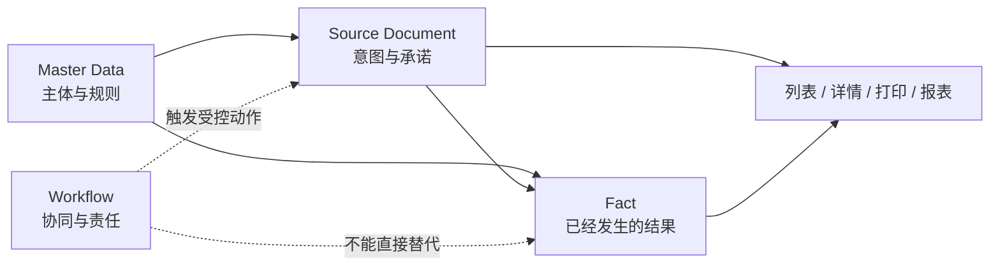

# 主数据、源单据与事实边界 / Master Data, Source Document and Fact Boundary

本文维护 ERP 核心对象的稳定分层合同。具体字段、状态、表结构和已实现范围必须回到当前 schema、repository、usecase、API 与测试；本文不保存阶段计划和实现进度。

## 当前结论

- Master Data 描述可以被多个业务过程引用的主体和规则。
- Source Document 记录业务意图、承诺和过程输入；关闭或审批不自动产生业务事实。
- Fact 记录已经发生且需要审计、对账或派生余额的业务结果。
- Workflow 负责协同、责任和流转，不拥有库存、质检、出货、生产或财务事实。
- 页面、搜索、打印、导出和报表只能读取上述真源或受控投影，不能建立第二套可写状态。

## 分层与当前对象

| 层级 | 当前典型对象 | 主要职责 | 生命周期语义 |
| --- | --- | --- | --- |
| Master Data | customers、suppliers、contacts、units、materials、products、product_skus、warehouses、BOM、processes | 身份、分类、引用关系与可复用规则 | 启用 / 停用、版本化或受控修改 |
| Source Document | sales_orders、purchase_orders、production_orders、outsourcing_orders，以及出货等业务源单 | 记录来源、需求、承诺、计划与审批输入 | 草稿、提交、批准、关闭、取消；按对象合同为准 |
| Fact | inventory_txns / balances / lots、purchase receipts / returns / adjustments、quality_inspections、production_facts、outsourcing_facts、stock_reservations、shipments、finance_facts | 记录实际数量、质量、库存、出货和财务结果 | 草稿、过账、生效、结算、取消、冲正或调整 |
| Workflow | workflow tasks、process runtimes、events | 协同任务、责任人、状态流转与异常处理 | done / blocked / rejected 只表示协同结果 |

`shipments` 同时承载出货源单和出货事实生命周期，其“已出货”事实仍只由正式 Shipment usecase 在合法状态下产生；不能由 Workflow 的 `shipping_released` 或页面勾选替代。

## 权威关系

## 字段、快照与派生规则

1. 主数据 ID 是关联真源；源单据可保存必要的名称、地址、联系人或单价快照，以保证历史可读。
2. 编辑主数据不能静默改写已生效源单据和事实快照。确需回补时，必须定义范围、审计和幂等规则。
3. 来源切换、关联删除或条件失效时必须清理残值；真源有值但投影缺失时必须修复同步链路，不能在单页补造。
4. 汇总状态、余额、完成率和金额等派生值必须由共享查询或确定性 helper 计算，不由多个页面分别写入。
5. Workflow payload 只保存展示和协同所需快照，不能成为业务金额、库存、出货或财务真源。

## 写入与权限边界

- 正式写入必须经过对应 Go repository / usecase，并受服务端 RBAC、状态、幂等和事务约束。
- 前端菜单隐藏、按钮禁用和客户配置只能收窄入口，不能扩大后端权限。
- 已生效或被引用对象不使用通用物理删除：主数据停用，源单据取消 / 关闭，事实取消 / 冲正 / 调整。
- 新增相近表或字段前，先确认是否已有 owner、是否只是别名，以及列表、详情、打印、导入和历史数据是否会形成双轨。

## 变更检查

涉及本边界时至少核对：

1. schema / migration 与唯一 owner。
2. 新建、编辑、来源切换、清空和历史回补。
3. usecase 状态、幂等、事务失败、取消 / 冲正与服务端权限。
4. 列表、详情、搜索、打印、导出和报表投影。
5. Workflow 与 Fact 的触发边界，以及自动化和真实浏览器验证。

当前对象清单与状态细节见[状态字典与生命周期索引](状态字典与生命周期索引.md)、[状态、Workflow 与 Fact 边界](状态工作流事实边界.md)、[业务事实边界](业务事实扩展总评审.md)和当前代码测试。
