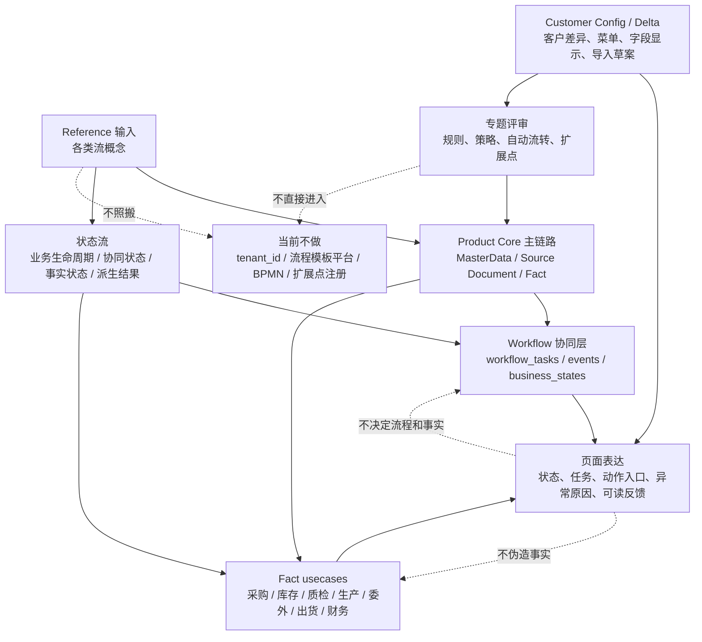

# 各类流程建模边界评审 / Flow Modeling Boundary Review

## 结论

`docs/reference/第四次20260627/erp各类“流”的边界与实现参考.md` 可以作为概念输入，但 plush-toy-erp 的正式建模必须按当前 Product Core、Workflow / Fact、RBAC、页面和客户配置边界落地。

当前要做的是“按项目实际做流程建模”，不是照搬通用 ERP 流程平台：

```text
业务流 = Product Core 主链路和来源关系
状态流 = 业务对象生命周期、协同状态和事实状态
工作流 / 任务流 / 审批流 = workflow_tasks / workflow_task_events / workflow_business_states
异常流 = 阻塞、退回、取消、冲正、返工、归档等模块内闭环
通知流 = 任务提醒、催办、超期和看板风险提示
自动流转 = 已评审的后端 WorkflowUsecase 或领域 usecase 规则
规则 / 策略 / 扩展点 = 先进入配置、客户差异和专题评审，不直接变 runtime 平台
```

本文件是架构评审，不代表新增 schema、migration、API、RBAC、菜单、页面、WorkflowUsecase 或 Fact usecase。当前 runtime 仍以代码、Ent schema、Atlas migration、测试和 [当前真源与交接顺序](../当前真源与交接顺序.md) 为准。

## 参考输入与正式真源

| 类型 | 文件 | 本文怎么使用 |
| --- | --- | --- |
| 外部参考 | [ERP 各类“流”的边界与实现参考](../reference/第四次20260627/erp各类“流”的边界与实现参考.md) | 只吸收“各类流不要混淆”的概念，不照搬表结构、tenant、流程模板或扩展点平台 |
| 当前真源索引 | [当前真源与交接顺序](../当前真源与交接顺序.md) | 判断当前实现、禁区和阅读顺序 |
| 状态边界 | [状态 / Workflow / Fact 边界](状态工作流事实边界.md) | 定义协同状态、单据生命周期、事实和派生结果的拆层 |
| Workflow 主路径 | [业务与协同流程地图](../workflow/业务与协同流程地图.md) | 按业务名称定义协同交接和事实落账边界 |
| Workflow runtime | [状态 / Workflow / Fact 边界](状态工作流事实边界.md)、[业务与协同流程地图](../workflow/业务与协同流程地图.md) | 判断 Process Runtime、任务动作与领域事实的当前边界，再核对代码和测试 |
| 数据流向 | [业务主链路数据流向与字段来源规则](../product/业务主链路数据流向与字段来源规则.md) | 定义 MasterData -> Source Document -> Domain Usecase -> Fact -> Derived 的字段和来源主路径 |
| 实施门禁 | [模块实施治理](../product/模块实施治理.md) | 决定某类流进入 schema / usecase / API / UI 前的拆分和停止条件 |

## Plush 建模总图

这张图回答：各类“流”在本项目里如何归属，哪些可以进入页面表达，哪些必须回到后端或正式评审。



页面只能展示和触发已存在或已评审的能力。页面不能决定流程路径，不能把任务完成写成事实完成，也不能用客户差异、静态参考或 mock 数据补造后端事实。

## 各类流的项目落点

| 流类型 | 在 plush 的正式归属 | 当前已有落点 | 页面可以表达 | 当前不做 |
| --- | --- | --- | --- | --- |
| 业务流 / Business Flow | Product Core 主链路、来源关系和模块边界 | `customers / suppliers / contacts / sales_orders / purchase_orders / purchase_receipts / quality_inspections / inventory / shipments / operational_fact` 等能力按台账进入不同成熟层级 | 当前模块处于主链路哪里、来源单据、剩余量、下一步动作 | 不做一张万能流程表，不恢复 `business_records` |
| 状态流 / State Flow | 业务对象生命周期、Workflow 协同状态、Fact 对象状态、派生结果状态 | `状态工作流事实边界.md` 的五层状态和状态词典树 | 状态标签、禁用原因、终态只读、可执行动作 | 不把每个审批节点都做成业务状态 |
| 工作流 / Workflow | 协同任务、事件、业务状态投影和必要下游协同任务派生 | `workflow_tasks / workflow_task_events / workflow_business_states`、WorkflowUsecase 七条最小规则 | 待办、任务详情、处理动作、催办、阻塞 / 退回原因 | 不新增通用 `workflow_templates / workflow_nodes / workflow_instances` 平台 |
| 审批流 / Approval Flow | Workflow 的子能力，按任务组和后端规则表达 | 老板审批、IQC、委外回货检验、成品抽检等规则已部分后端化 | 审批任务、通过 / 阻塞 / 退回、原因必填 | 不把审批流等同整个业务流 |
| 任务流 / Task Flow | 岗位任务端、桌面协同入口和角色责任池 | `/m/<role>/tasks`、桌面 Workflow V1 页面、owner_role_key / assignee_id | 我的任务、角色任务池、当前任务可处理动作 | 不让任务端直接过账库存、出货或财务事实 |
| 异常流 / Exception Flow | 各模块状态机、Workflow blocked / rejected、Fact 取消 / 冲正 / 调整 | 阻塞 / 退回 reason、采购 / 库存 / 出货 / 财务事实的取消或冲正边界 | 异常原因、不可操作原因、替代动作、重新处理入口 | 不只设计正常流程，不放开通用删除 / 回收站 |
| 通知流 / Notification Flow | 任务 payload、催办、超期、看板风险和后续通知专项 | [通知预警催办与升级第一版](../workflow/通知预警催办与升级第一版.md)、任务看板和 Dashboard 聚合 | 催办状态、超期、风险、最近动作 | 当前不新增独立 notifications 表或消息平台 |
| 自动流转 / Auto Flow | 已评审的后端 WorkflowUsecase 或领域 usecase 规则 | 老板审批后工程任务、IQC 后仓库 / 异常任务、部分成品 / 委外 / 出货放行规则 | 可展示“系统已生成 / 已关联”的结果 | 不从页面本地自动生成事实，不从 Workflow done 自动生成库存 / 财务 |
| 规则 / 策略 | 模块实施治理、客户差异策略、RBAC、后端 usecase 专题评审 | 角色权限、任务 owner / assignee、来源生成规则、字段来源规则 | 可读的禁用原因、不可生成原因、角色可见性 | 当前不做通用规则引擎或业务人员可编辑流程规则 |
| 扩展点 / Extension | Customer Config / Customer Extension 评审后再定 | yoyoosun 客户配置草案、客户差异台账、多客户私有化复制包 | 客户菜单、字段显示、品牌等低风险投影 | 不新增 `tenant_id`、runtime plugin、客户代码 hook、扩展点注册 |

## 页面设计口径

页面设计只吸收这些建模结果，不直接实现流程平台。

| 页面元素 | 应该回答的问题 | 必须校验 |
| --- | --- | --- |
| 状态标签 | 这个对象当前处于哪个层级的状态 | 标签是否把协同状态误写成事实状态 |
| 主操作按钮 | 用户点击后真实发生什么 | 是否有后端 API / RBAC / usecase 支撑 |
| 任务抽屉 / 任务详情 | 谁负责处理、当前能做什么、为什么不能做 | owner_role_key、assignee_id、终态、原因必填 |
| 来源选择 / 生成入口 | 从哪个 Source Document 或 Fact 行生成 | 来源 ID 是否隐藏、用户只看业务单号 / 行号 / 余额 |
| 异常和禁用提示 | 为什么不能继续、替代动作是什么 | 是否暴露可执行下一步，而不是只给技术错误 |
| 看板和统计 | 反映事实、协同还是派生结果 | 是否可从后端返回或正式 read model 解释 |

页面不得出现以下暗示：

- `shipment_release done` 等于已出库、已扣库存、已生成应收。
- 任务完成等于采购、质检、库存、出货、财务事实已落账。
- 客户配置包等于 SaaS tenant。
- Reference 文档里的流程模板、扩展点或 tenant 字段已经进入当前 runtime。

## 当前实施顺序

本项目按可验证闭环推进流程建模，不按 reference 文档一次性建设流程平台。

1. 先确认业务对象和事实真源：MasterData、Source Document、Fact 和 Derived 各自归属。
2. 再确认状态流：生命周期状态、协同状态、事实状态和派生结果不要混用。
3. 再落 Workflow 最小规则：只有需要强一致、幂等、权限和审计的任务规则迁入后端。
4. 再接页面：页面只展示可解释的状态、任务、动作、来源和异常，不补造事实。
5. 最后评审客户差异、规则策略、通知和自动流转：只有多客户或真实使用反馈证明需要时，才进入 Customer Config、Industry Template 或后端 usecase。

## 明确暂不进入实现

以下内容来自通用 ERP 参考，但不进入当前 plush runtime：

- `tenant_id`、SaaS 多租户、license server、套餐计费。
- 通用流程模板表、流程节点表、流程实例平台、BPMN 或拖拽流程设计器。
- 规则引擎、流程模板导入、策略绑定导入、扩展点注册。
- 允许客户代码直接改核心状态、库存、出货或财务事实。
- 为每个客户复制一套业务代码或用 `if customer == xxx` 分散客户差异。

如果后续确实需要上述任一能力，必须先按 [模块实施治理](../product/模块实施治理.md) 做 docs-only review，写清真源、禁止项、schema 是否必要、RBAC、测试和退出条件，再拆下一轮实现任务。
