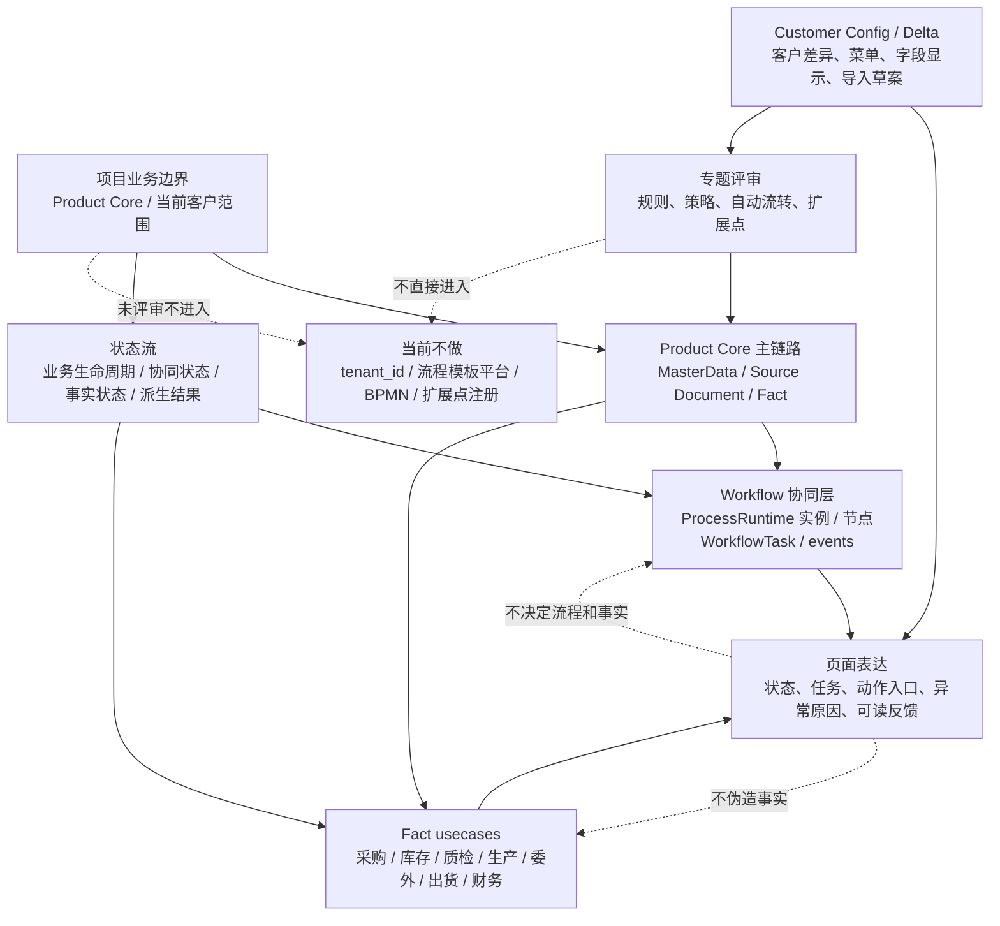

# 各类流程建模边界评审 / Flow Modeling Boundary Review

## 结论

plush-toy-erp 的流程建模直接由当前 Product Core、Workflow / Fact、RBAC、页面和客户配置边界定义。

当前要做的是“按项目实际做流程建模”，不是照搬通用 ERP 流程平台。“流”描述允许怎样运转；一次真实运行按对象和顺序形成的“链”另见 [业务链与运行轨迹边界](业务链与运行轨迹边界.md)。

```text
业务流 = Product Core 主链路和来源关系
单据流 = 同一 Source Document 的合法生命周期，以及受控的来源单据 / 下游对象关系
状态流 = 业务对象生命周期、协同状态和事实状态
工作流 = ProcessRuntime 具体实例 / 节点 + WorkflowTask 协同责任
审批流 = 工作流中处理审核、同意、拒绝、退回等决定的部分
任务流 = 单条任务的创建、办理、阻塞、恢复、转交、完成、退回和催办
异常流 = 驳回、退回、阻塞、恢复、取消、冲正、返工和补偿等不同动作
通知流 = 任务提醒、催办、超期和看板风险提示
自动流转 = 已评审的 ProcessRuntime 路由、绑定领域命令或领域 usecase 规则
规则 / 策略 / 扩展点 = 先进入配置、客户差异和专题评审，不直接变 runtime 平台
```

本文件是架构评审，不代表新增 schema、migration、API、RBAC、菜单、页面、ProcessRuntime、WorkflowUsecase 或 Fact usecase。当前 runtime 仍以代码、Ent schema、Atlas migration、测试和 [当前真源与交接顺序](../当前真源与交接顺序.md) 为准。

## 正式真源

| 类型             | 文件                                                                                                          | 本文怎么使用                                                                               |
| ---------------- | ------------------------------------------------------------------------------------------------------------- | ------------------------------------------------------------------------------------------ |
| 当前真源索引     | [当前真源与交接顺序](../当前真源与交接顺序.md)                                                                | 判断当前实现、禁区和阅读顺序                                                               |
| 状态边界         | [状态 / Workflow / Fact 边界](状态工作流事实边界.md)                                                          | 定义协同状态、单据生命周期、事实和派生结果的拆层                                           |
| Workflow 主路径  | [业务与协同流程地图](../workflow/业务与协同流程地图.md)                                                       | 按业务名称定义协同交接和事实落账边界                                                       |
| Workflow runtime | [状态 / Workflow / Fact 边界](状态工作流事实边界.md)、[业务与协同流程地图](../workflow/业务与协同流程地图.md) | 判断 Process Runtime、任务动作与领域事实的当前边界，再核对代码和测试                       |
| 运行链查询       | [业务链与运行轨迹边界](业务链与运行轨迹边界.md)                                                               | 区分 ProcessRuntime 业务轨迹、单任务记录、完整审批链、状态历史、审计和 Trace               |
| 数据流向         | [业务主链路数据流向与字段来源规则](../product/业务主链路数据流向与字段来源规则.md)                            | 定义 MasterData -> Source Document -> Domain Usecase -> Fact -> Derived 的字段和来源主路径 |
| 实施门禁         | [模块实施治理](../product/模块实施治理.md)                                                                    | 决定某类流进入 schema / usecase / API / UI 前的拆分和停止条件                              |

## Plush 建模总图

这张图回答：各类“流”在本项目里如何归属，哪些可以进入页面表达，哪些必须回到后端或正式评审。


```mermaid
flowchart TD
  scope["项目业务边界<br/>Product Core / 当前客户范围"]
  productCore["Product Core 主链路<br/>MasterData / Source Document / Fact"]
  stateBoundary["状态流<br/>业务生命周期 / 协同状态 / 事实状态 / 派生结果"]
  workflow["Workflow 协同层<br/>ProcessRuntime 实例 / 节点<br/>WorkflowTask / events"]
  facts["Fact usecases<br/>采购 / 库存 / 质检 / 生产 / 委外 / 出货 / 财务"]
  page["页面表达<br/>状态、任务、动作入口、异常原因、可读反馈"]
  customer["Customer Config / Delta<br/>客户差异、菜单、字段显示、导入草案"]
  review["专题评审<br/>规则、策略、自动流转、扩展点"]
  forbidden["当前不做<br/>tenant_id / 流程模板平台 / BPMN / 扩展点注册"]

  scope --> productCore
  scope --> stateBoundary
  productCore --> workflow
  productCore --> facts
  stateBoundary --> workflow
  stateBoundary --> facts
  workflow --> page
  facts --> page
  customer --> page
  customer --> review
  review --> productCore
  review -. 不直接进入 .-> forbidden
  scope -. 未评审不进入 .-> forbidden
  page -. 不决定流程和事实 .-> workflow
  page -. 不伪造事实 .-> facts
```

页面只能展示和触发已存在或已评审的能力。页面不能决定流程路径，不能把任务完成写成事实完成，也不能用客户差异或 mock 数据补造后端事实。

## 各类流的项目落点

| 流类型                     | 在 plush 的正式归属                                                                        | 当前已有落点                                                                                                                                                                          | 页面可以表达                                           | 当前不做                                                                             |
| -------------------------- | ------------------------------------------------------------------------------------------ | ------------------------------------------------------------------------------------------------------------------------------------------------------------------------------------- | ------------------------------------------------------ | ------------------------------------------------------------------------------------ |
| 业务流 / Business Flow     | Product Core 主链路、来源关系和模块边界                                                    | `customers / suppliers / contacts / sales_orders / purchase_orders / purchase_receipts / quality_inspections / inventory / shipments / operational_fact` 等能力按台账进入不同成熟层级 | 当前模块处于主链路哪里、来源单据、剩余量、下一步动作   | 不做一张万能流程表，不恢复 `business_records`                                        |
| 单据流 / Document Flow     | 一个 Source Document 自身的合法状态转换，以及通过登记领域动作建立的来源单据 / 下游对象关系 | 销售、采购、Shipment、收付款、库存人工调整等各自状态机；来源创建、取消、冲正和读回合同                                                                                                | 当前单据状态、来源单号、允许动作、为何不能生成下游对象 | 不建立第二套“单据流引擎”，不从页面按钮、标题或关联文本猜上下游                       |
| 状态流 / State Flow        | 业务对象生命周期、Workflow 协同状态、Fact 对象状态、派生结果状态                           | `状态工作流事实边界.md` 的五层状态和状态词典树                                                                                                                                        | 状态标签、禁用原因、终态只读、可执行动作               | 不把每个审批节点都做成业务状态                                                       |
| 工作流 / Workflow          | 具体 ProcessRuntime 的实例 / 节点运行，以及 WorkflowTask 的协同责任、事件和投影            | 六条正式 ProcessRuntime；`process_instances / process_node_instances / workflow_tasks / workflow_task_events / workflow_business_states`                                              | 业务轨迹、待办、任务详情、处理动作和失败原因           | 不新增第二套通用模板 / BPMN / 低代码引擎，不把具体运行时误写成不存在                 |
| 审批流 / Approval Flow     | Workflow 的决定子集；由 approval 节点、责任池、能力与领域审批命令表达                      | 销售、采购、Shipment 财务放行三项可配置责任；退货、收付款、库存调整、生产异常四项固定责任合同                                                                                         | 同意 / 退回、原因、审批责任和决定结果                  | 不把审批决定等同 Source 已执行、Fact 已过账或完整业务流                              |
| 任务流 / Task Flow         | 单条 WorkflowTask 的创建、办理、阻塞、恢复、转交、完成、退回和催办                         | `/m/<role>/tasks`、桌面任务抽屉、owner / assignee / pool、`workflow_task_events`                                                                                                      | 我的任务、角色任务池、本任务处理记录和当前可执行动作   | 不把一条任务事件拼成跨节点完整审批链，不让任务端直接过账 Fact                        |
| 异常流 / Exception Flow    | 各对象状态机、ProcessRuntime / Workflow 异常与领域取消 / 冲正 / 返工 / 补偿                | `blocked / rejected / resume`、领域取消 / 冲正、生产返工与 durable result compensation                                                                                                | 原因、影响、恢复或替代动作、需人工核对证据             | 驳回、退回、阻塞、恢复、取消、冲正、返工和补偿不是同一动作，不能共用万能状态         |
| 通知流 / Notification Flow | 任务 payload、催办、超期、看板风险和后续通知专项                                           | [通知预警催办与升级第一版](../workflow/通知预警催办与升级第一版.md)、任务看板和 Dashboard 聚合                                                                                        | 催办状态、超期、风险、最近动作                         | 当前不新增独立 notifications 表或消息平台                                            |
| 自动流转 / Auto Flow       | 已评审的 ProcessRuntime 路由、绑定白名单领域命令或领域 usecase 规则                        | 七条正式图的节点推进、分支和 durable result；领域事务产生的必要来源协同                                                                                                               | 可展示“系统已生成 / 已关联”的权威读回                  | 不从页面本地生成事实，不从 approval / Workflow done 补造库存、出货、生产、核销或财务 |
| 规则 / 策略                | 模块实施治理、客户差异策略、RBAC、后端 usecase 专题评审                                    | 角色权限、任务 owner / assignee、来源生成规则、字段来源规则                                                                                                                           | 可读的禁用原因、不可生成原因、角色可见性               | 当前不做通用规则引擎或业务人员可编辑流程规则                                         |
| 扩展点 / Extension         | Customer Config / Customer Extension 评审后再定                                            | yoyoosun 客户配置草案、客户交付矩阵中的差异决策、多客户私有化复制包                                                                                                                   | 客户菜单、字段显示、品牌等低风险投影                   | 不新增 `tenant_id`、runtime plugin、客户代码 hook、扩展点注册                        |

## 单据流与异常流怎么进入业务

单据流需要包含，但它不是第八套 runtime。它把“这张单据自己如何变化”和“哪一个登记动作可以从它建立下游对象”说清楚：

| 维度           | 正式真源                                                 | 例子                                                                                                   | 禁止推断                                                         |
| -------------- | -------------------------------------------------------- | ------------------------------------------------------------------------------------------------------ | ---------------------------------------------------------------- |
| 单据内生命周期 | Source Document 状态机、版本 / CAS、领域 usecase         | 销售订单 `DRAFT → SUBMITTED → ACTIVE`；人工库存调整 `DRAFT → SUBMITTED → APPROVED / REJECTED → POSTED` | 不用 Workflow task 状态或页面标签替代 Source 状态                |
| 跨单据来源关系 | 服务端来源候选、显式创建命令、来源 ID / 行 ID 和受控快照 | 已批准采购订单显式创建收货草稿                                                                         | 不因页面上“已关联”或单号相似就认为下游对象已经生成               |
| Source 到 Fact | 独立领域命令和 Fact / Ledger 权威读回                    | Shipment 经财务放行后仍须仓库显式 `ship_shipment` 才写 `SHIPPED + inventory OUT`                       | approval、任务 done 或 ProcessRuntime 节点名称不等于 Fact posted |

异常流是业务流、单据流、状态流和工作流的共同组成部分，也必须包含；但不同动作必须保留不同语义：

| 动作        | 发生层                                      | 语义                                                                                                                                      |
| ----------- | ------------------------------------------- | ----------------------------------------------------------------------------------------------------------------------------------------- |
| 驳回 / 拒绝 | approval 决定或领域 Source                  | 当前决定不通过；正式拒绝分支必须明确结束或退回到哪一节点，只有命名领域拒绝命令才能改变 Source / 门禁，不能由 Workflow `rejected` 猜测写入 |
| 退回任务    | WorkflowTask                                | 当前任务进入 `rejected` 终态；不自动取消 Source，也不冲正 Fact                                                                            |
| 阻塞 / 恢复 | WorkflowTask、ProcessRuntime                | 暂停与继续同一运行证据；恢复清理旧阻塞原因，不重写历史                                                                                    |
| 取消        | Source Document                             | 终止尚可取消的业务承诺；必须检查在途流程和下游依赖                                                                                        |
| 冲正        | Fact / Ledger                               | 保留原事实并追加反向效果；不是删除或把原状态改回草稿                                                                                      |
| 返工        | 领域 WIP / 新 attempt                       | 形成新的受控处理轮次；不复用旧 completed 节点冒充未发生                                                                                   |
| 补偿        | ProcessRuntime durable result / 领域 effect | 标记已完成效果被正式撤销或替代；不等于删除运行历史                                                                                        |

“有的东西不通过，业务事实就不能进入下一步”是正常的硬门禁，而不是审批直接写事实。例如：

- 销售 / 采购 approval 拒绝后分别进入命名拒绝终点，不执行激活 / 批准命令；已提交源单保持自身状态，需按源单生命周期取消后重新建单，Workflow 不自动修改或取消它。
- Shipment 财务审批退回后，命名领域命令把版本化放行门禁写为 `REJECTED`；仓库 `ship_shipment` 仍只接受 `APPROVED`，因此不会写 `SHIPPED` 或库存 `OUT`。
- 采购收货的 IQC 为 `REJECTED` 且未完成正式退厂 / 补换或让步处置时，入库 post 必须拒绝，因此不会增加库存余额。
- WIP 质检拒绝且没有批准、执行让步时，后续移交 / 完工必须失败关闭；只完成 Workflow 任务不能越过品质事实。
- 人工库存调整审批拒绝后走 `rejected_end`，不会创建仓库执行任务，也不会写 `inventory_txns`。

## 页面设计口径

页面设计只吸收这些建模结果，不直接实现流程平台。

| 页面元素            | 应该回答的问题                                 | 必须校验                                                 |
| ------------------- | ---------------------------------------------- | -------------------------------------------------------- |
| 状态标签            | 这个对象当前处于哪个层级的状态                 | 标签是否把协同状态误写成事实状态                         |
| 主操作按钮          | 用户点击后真实发生什么                         | 是否有后端 API / RBAC / usecase 支撑                     |
| 任务抽屉 / 任务详情 | 谁负责处理、当前能做什么、为什么不能做         | owner_role_key、assignee_id、终态、原因必填              |
| 业务轨迹            | 来源 ProcessRuntime 已经执行、当前或受阻到哪里 | 持久化实例 / 节点、attempt、任务锚点；不排列未选未来分支 |
| 本任务处理记录      | 当前任务自身发生过什么                         | 任务事件、版本、操作者、角色和原因；不称完整审批链       |
| 来源选择 / 生成入口 | 从哪个 Source Document 或 Fact 行生成          | 来源 ID 是否隐藏、用户只看业务单号 / 行号 / 余额         |
| 异常和禁用提示      | 为什么不能继续、替代动作是什么                 | 是否暴露可执行下一步，而不是只给技术错误                 |
| 看板和统计          | 反映事实、协同还是派生结果                     | 是否可从后端返回或正式 read model 解释                   |

页面不得出现以下暗示：

- `shipment_release done` 等于已出库、已扣库存、已生成应收。
- 任务完成等于采购、质检、库存、出货、财务事实已落账。
- 客户配置包等于 SaaS tenant。
- 未经本项目正式评审的流程模板、扩展点或 tenant 字段已经进入当前 runtime。

## 当前实施顺序

本项目按可验证闭环推进流程建模，不一次性建设通用流程平台。

1. 先确认业务对象和事实真源：MasterData、Source Document、Fact 和 Derived 各自归属。
2. 再确认状态流：生命周期状态、协同状态、事实状态和派生结果不要混用。
3. 再落具体 ProcessRuntime 与 Workflow 规则：节点、责任、路由、版本、幂等、权限、异常和领域命令必须由后端合同承接。
4. 再接页面：页面只展示可解释的状态、任务、动作、来源和异常，不补造事实。
5. 最后评审客户差异、规则策略、通知和自动流转：只有多客户或真实使用反馈证明需要时，才进入 Customer Config、Industry Template 或后端 usecase。

## 每个甲方可以编排到哪一层

链和流的集中治理会让多甲方复制更可控，但不等于开放任意拖拽编排：

- 客户可以在 Product Core 已登记合同内选择六条正式 ProcessRuntime、销售受控变体、模块 / 页面 / 动作 entitlement、角色 revoke，以及前三类审批责任成员。
- 收付款、库存人工调整和生产异常的图与责任池由 Product Core 固定；`businessFlows / stateMachines / processPolicies` 当前仍是 preview-only。
- 客户不能增加、删除或重排节点，不能改 capability、领域命令、Source 状态机或 Fact 规则，也不能借 super admin 身份冒充业务岗位。
- 链是持久化历史的查询结果，不可编排、编辑、补写或重新排序。客户配置只能在后端授权之后收窄可见对象、筛选和展示字段，不能改写链中发生过的事件。
- 已启动实例继续使用其冻结 revision；新 revision 只影响后续新实例。目标环境仍须分别验证 migration、active revision / effective session、真实岗位 smoke 和客户 UAT。

## 明确暂不进入实现

以下能力不进入当前 plush runtime：

- `tenant_id`、SaaS 多租户、license server、套餐计费。
- 第二套通用流程模板平台、任意动态节点 / 状态机、BPMN 或拖拽流程设计器；当前具体 `process_instances / process_node_instances` 继续作为七条正式图的运行真源。
- 规则引擎、流程模板导入、策略绑定导入、扩展点注册。
- 允许客户代码直接改核心状态、库存、出货或财务事实。
- 为每个客户复制一套业务代码或用 `if customer == xxx` 分散客户差异。

如果后续确实需要上述任一能力，必须先按 [模块实施治理](../product/模块实施治理.md) 做 docs-only review，写清真源、禁止项、schema 是否必要、RBAC、测试和退出条件，再拆下一轮实现任务。
