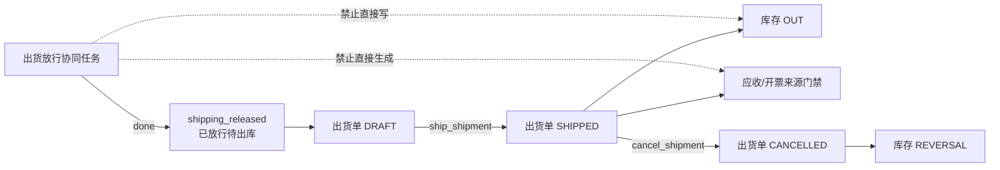

# 状态、Workflow 与 Fact 边界 / Status, Workflow And Fact Boundary

本文是状态分层和 Workflow / Fact 边界的活跃架构入口。它只说明各层职责、当前主路径和状态真源位置，不复制完整状态字典、迁移过程或每条历史规则。

## 结论

```text
流程管协同，源单管承诺，事实单管发生，余额和完成度由事实计算。
```

- `workflow task done` 只表示协同动作完成，不等于库存、质检、出货或财务已经过账。
- `shipment_release done -> shipping_released` 只表示已放行待出库。
- 真实出货由 `OperationalFactUsecase.ShipShipment` 把出货单推进到 `SHIPPED`，并在同一事实链写库存 `OUT`；取消已出货单写 `REVERSAL`。
- `RECEIVABLE / INVOICE` 必须引用真实 `SHIPMENT`，且来源出货单已经 `SHIPPED`。
- 客户配置、角色责任池和流程变体可以收窄入口或改变协同分工，不能改写上述事实语义。

## 状态分层

| 层 | 负责什么 | 当前真源 | 不能替代 |
| --- | --- | --- | --- |
| Source Document 生命周期 | 销售订单、采购订单、加工合同的草稿、提交、确认、关闭、取消 | `server/internal/core/status/`、对应 usecase 与 Ent check | 库存、质检、出货、财务事实 |
| Workflow task | 某个责任人或责任池的任务处理结果 | `workflow_tasks`、`WorkflowUsecase` | 业务对象生命周期和事实过账 |
| Process runtime | 流程实例、节点、分支、并行、退回、等待事件和领域命令 | `process_instances`、`process_node_instances`、`ProcessRuntimeUsecase` | 通用 BPMN、任意脚本执行器 |
| Business workflow projection | 跨岗位协同进度的可读投影 | `workflow_business_states` | 事实表、余额表、应收应付台账 |
| Fact / Ledger | 实际入库、退货、调整、质检、库存、出货和业务财务记录 | 各领域事实表与 usecase | Workflow payload 或页面本地状态 |
| Derived result | 可用量、履约进度、对账结果等计算结果 | 从事实查询或受守卫的查询加速表 | 新的重复事实真源 |

`workflow_business_states` 中的 `shipped / reconciling / settled` 仍是协同投影 key；它们的中文文案已明确为“协同已完成”。判断真实出货、对账或结算必须回到对应事实表，不能只读该投影。

## Workflow 当前主路径

### 任务状态

任务状态唯一登记在 `server/internal/biz/workflow_metadata.go`。当前 key 为：

```text
pending / ready / processing / blocked / done / rejected / cancelled / closed
```

当前终态是 `done / rejected / cancelled / closed`。终态任务不会被再次处理或催办；同一终态、同一原因的重试只返回既有结果，不重放下游副作用。`blocked` 不是终态，可在问题解决后继续处理。

`blocked` 和 `rejected` 必须提供非空原因。`rejected` 后需要返工或重开时，应创建新的任务或新的流程节点 attempt，不能把原终态任务改回处理中。

### 流程运行时

Process Runtime 只支持五类节点：

```text
human_task / approval / domain_command / wait_event / end
```

- 人工任务和审批节点通过责任池、能力 key 与当前客户 active revision 解析到可处理角色。
- `domain_command` 只能执行已登记白名单 handler，并由对应领域 usecase 写事实；运行时先执行无副作用只读预检，再以单条条件 `UPDATE ... RETURNING` 原子 claim `command_key + idempotency_key + JSON payload` 的 SHA-256 fingerprint。protocol v1 写 handler 在领域事务内同时记录 durable result / effect ref；两个无领域写入门禁在锁定对象的短事务内评估并记录 `effect_state=none`。同 intent 重放持久结果，不同 intent 明确冲突。
- `wait_event` 只响应定义中登记的事件。
- 领域副作用不与整个流程推进共享大事务；领域事务先原子落业务结果和 durable result，随后节点结算、linked ref 和下游激活可独立重放。销售取消、入库冲正、出货冲正和财务取消会在领域事务内标记 compensation；active 节点重试读到补偿结果时阻塞，已完成节点补偿后重放返回 `40921` 且不再推进，也都不会重做领域副作用。已激活下游不自动回滚，必须由明确恢复流程处理。
- 分支、fan-out、join、return-to 与结束节点由后端运行时推进；重试会核对已完成节点和已创建下游，避免重复任务或重复事实命令。同 fingerprint 并发完成 / 阻塞时，失败方只接受 `expected_version + 1`、相同 status / outcome 的已落终态，否则明确冲突。领域命令产出的 `linked_business_refs` 使用 `updated_at` CAS 重读合并，同一 ref identity 的 ref no / source node / source command 漂移会拒绝。`20260710150000` 只写 active 空 fingerprint sentinel；`20260710150001` 新增 durable result / effect / compensation schema 并把旧 fingerprint 标为 protocol 0。legacy 无法精确证明的结果仍 fail closed；当前原子回滚、恢复和并发证据只在本地 PostgreSQL 成立，尚未发布目标环境。
- 客户流程 manifest 不是可执行脚本，不能注入 SQL、任意函数或前端回调。

### 公共 API 边界

- 正式任务动作使用 `complete_task_action / block_task_action / reject_task_action / urge_task`；后端同时校验 RBAC、owner role、assignee、责任池、模块状态和任务终态。
- `actor_role_key`、`business_status_key` 和系统动作字段由服务端推导，客户端不能借 payload 覆盖。
- 公共 `create_task` 只用于独立协同任务；它拒绝 `config_revision / process_instance_id / process_node_instance_id`，流程锚点只能由 Process Runtime 内部创建。
- 公共 `upsert_business_state` 已移除。业务状态只能由受控任务动作、Process Runtime 或领域 usecase 的内部副作用推进；客户端只可读取 `list_business_states`。

## Source Document 与 Fact

销售订单、采购订单和加工合同表达业务承诺。当前只有 `draft` 可编辑；提交、批准或确认后的更正必须走对应生命周期动作，不能继续覆盖表头或明细快照。

事实写入遵守以下共同边界：

1. 后端 usecase 校验状态、引用、数量、权限和幂等键。
2. repo 在数据库事务内写事实头、事实行、流水和查询加速表。
3. 已过账记录不物理删除、不改回草稿；纠错走取消、冲正或调整。
4. 页面、打印和 Workflow payload 只展示正式数据或冻结快照，不补造事实字段。

### 出货主链



这里的事实主路径当前由 `OperationalFactUsecase` 承接，不存在单独的 `ShipmentUsecase`。只有当装箱、物流、签收、退货或出货规则复杂到需要独立聚合边界时，才评审拆分；不能为了目录整齐先造一层转发 usecase。

### 采购、质检与库存

- 采购入库、退货、入库调整使用 `DRAFT -> POSTED -> CANCELLED`；取消已过账记录通过 `REVERSAL` 恢复库存。
- 质检单与库存批次状态是事实，Workflow 的 IQC / 成品检验任务只负责交接；领域命令必须调用质检 usecase。
- `inventory_txns` 是追加式库存事实，`inventory_balances` 是查询加速结果；防负库存、批次和幂等在库存事务内守住。
- 仓库入库任务完成不自动等于采购入库单 `POSTED`，成品入库任务完成也不自动补造库存。

## 状态真源索引

状态 key 不再复制成多份 Markdown“字典树”。新增或判断状态时按下表找唯一登记处：

| 对象 | 代码 / Schema 真源 | 代表性测试 |
| --- | --- | --- |
| Workflow task / business projection | `server/internal/biz/workflow_metadata.go`、`workflow.go`、`workflow_repo.go` | `workflow_test.go`、`workflow_repo_test.go`、Workflow JSON-RPC tests |
| Process instance / node | `server/internal/biz/process_runtime.go`、process Ent schema | `process_runtime_test.go`、process repo tests |
| 销售 / 采购源单 | `server/internal/core/status/sales_order.go`、`purchase_order.go`、对应 schema/usecase | core status、biz、data tests |
| 加工合同 | outsourcing order schema、usecase 与 repo | outsourcing order biz/data/service tests |
| 采购入库 / 退货 / 调整 | `server/internal/core/status/posting_document.go`、对应 schema | inventory / purchase receipt tests |
| 质检 / 库存批次 | `quality_inspection.go`、`inventory_lot.go`、对应 schema | quality / inventory tests |
| 出货 / 业务财务 | shipment / finance fact schema、`OperationalFactUsecase` | operational fact biz/data/service tests |
| 用户可见中文文案 | 前端状态映射和页面配置 | 前端 unit tests 与浏览器回归 |

UI 文案不是状态判断真源。客户可以调整低风险显示标签，但不能改变 canonical key、允许流转、权限或事实含义。

## 客户配置与角色边界

- 客户 module state、角色 capability、责任池、页面/动作投影和批准的流程变体只决定“谁能看到、谁来处理、走哪条已批准协同路线”。
- 客户配置只能与后端 RBAC 取交集，不能给账号增加未授予的权限。
- `read_only` 模块可保留读取页面和只读字段投影，但不能产生写动作、责任池任务或领域命令。
- 任何客户都不能配置允许负库存、跳过质检、把放行当出货、无来源生成应收/开票或绕过审计。
- 完整角色、菜单、字段合同和流程变体见 `docs/product/多甲方角色能力与流程编排.md`；字段 runtime surface 范围以该文档和客户配置测试为准。

## 新增状态或流程的门禁

新增状态、节点或自动流转时必须同时回答：

1. 它属于源单生命周期、Workflow、Process、Fact 还是派生结果？
2. canonical key 的唯一代码或 schema 真源在哪里？
3. 谁能触发，后端校验哪项 RBAC、owner/assignee 和模块状态？
4. 是否写事实；若写，调用哪个白名单领域 usecase，事务和幂等键是什么？
5. 阻塞、退回、取消、冲正、重复提交和并发竞争如何处理？
6. 页面只展示什么，不能在前端补造什么？
7. 哪些 unit / repo / service / PostgreSQL concurrency / browser tests 锁住边界？

状态或流程变化后，按影响面同步 `docs/当前真源与交接顺序.md`、产品能力台账、客户交付矩阵和测试策略；不再新建“第 N 条规则落地评审”长期文档。

## 最小验证

- Workflow：正常完成、阻塞、退回、原因残值清理、终态重试、权限、owner/assignee、流程分支与并发终态竞争。
- Source Document：仅草稿可改、提交与保存竞争、快照由服务端生成、失败整体回滚。
- Fact：happy path、非法状态、重复提交、取消/冲正、事务失败、并发、防负数和来源追溯。
- Customer config：模块状态、RBAC 交集、角色增减、责任池、流程 manifest、active revision 和 customer key 隔离。
- UI：默认态、可处理态、只读/无权限态、失败恢复、中文业务文案和真实页面截图。

具体测试选择以 `docs/product/自动化测试策略.md` 和 `scripts/qa/README.md` 为准。
