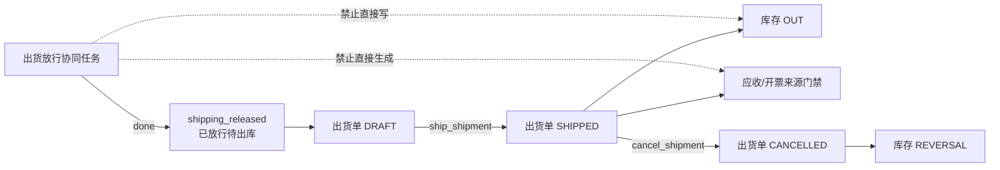

# 状态、Workflow 与 Fact 边界 / Status, Workflow And Fact Boundary

本文定义状态分层与 Workflow / Fact 的目标合同。系统按新系统设计收口：运行时只接受正式目标集合，不保留旧 AI 方案的读取、映射、退出或别名路径。

## 结论

```text
流程管协同，源单管承诺，事实单管发生，余额和完成度由事实计算。
```

- `workflow task done` 只表示协同动作完成，不等于库存、质检、出货或财务已经过账。
- `shipment_release done → shipping_released` 只表示已放行待出库。
- 真实出货由 `OperationalFactUsecase.ShipShipment` 把出货单推进到 `SHIPPED`，并在同一事实链写库存 `OUT`；取消已出货单写 `REVERSAL`。
- `RECEIVABLE / INVOICE` 必须引用真实 `SHIPMENT`，且来源出货单已经 `SHIPPED`。
- 客户配置、责任池和流程变体可以收窄入口或改变协同分工，不能改写事实语义。

## 状态分层

| 层 | 负责什么 | 唯一真源 | 不能替代 |
| --- | --- | --- | --- |
| Source Document 生命周期 | 销售订单、采购订单、加工合同等业务承诺的草稿、提交、生效、关闭、取消 | `server/internal/core/status/`、对应 usecase 与 Schema CHECK | 库存、质检、出货、财务事实 |
| Workflow task | 某个责任人或责任池的任务处理状态 | `workflow_tasks`、`workflow_metadata.go`、`WorkflowUsecase` | 业务对象生命周期和事实过账 |
| Process Runtime | 流程实例、节点、分支、等待事件和白名单领域命令 | `process_instances`、`process_node_instances`、`ProcessRuntimeUsecase` | 任意脚本执行器或通用单据状态机 |
| Business workflow projection | 跨岗位协同进度的只读投影 | `workflow_business_states` 与受控生产者 | 事实表、余额表、应收应付台账 |
| Fact / Ledger | 实际入库、退货、调整、质检、库存、出货和业务财务记录 | 各领域事实表与 usecase | Workflow payload 或页面本地状态 |
| Derived result | 可用量、履约进度、对账结果等计算结果 | 事实查询或受守卫的查询加速表 | 新的重复事实真源 |

`workflow_business_states` 中的 `shipped / reconciling / settled` 是协同投影 key。真实出货、对账或结算必须回到对应事实表，不能只读该投影。

Business Projection 是跨来源共用的阶段词汇表，不是所有 `source_type` 必须经历的统一状态机。只有受控任务动作、Process Runtime 或领域 usecase 可以生产投影；前端选项、任务快照、seed 和 fixture 不能生产正式业务状态。

## Workflow 目标合同

### 任务状态

任务状态唯一登记在 `server/internal/biz/workflow_metadata.go`，完整集合为：

```text
ready / blocked / done / rejected
```

公共创建固定得到 `ready`。允许的状态迁移只有：

| 起点 | 终点 | 业务动作 |
| --- | --- | --- |
| `ready` | `blocked` | 提交非空阻塞原因 |
| `ready` | `done` | 完成当前协同任务 |
| `ready` | `rejected` | 提交非空退回原因 |
| `blocked` | `ready` | 提交非空解除说明并恢复 |

集合外 key、同状态写入、`blocked → done / rejected` 以及任何终态出边都必须明确拒绝。请求重试走 receipt replay，不能靠状态自环伪装幂等。

`done / rejected` 是仅有的终态。终态任务不会被新 intent 再次处理或催办；需要返工或重新协同时创建新任务或新节点 attempt，不修改原终态。

`blocked` 不是终态。正式 `resume` 固定执行 `blocked → ready`，清理任务及 payload 的旧阻塞原因；任务的 `business_status_key` 与 `workflow_business_states` 投影继续保持 `blocked`。当前没有“阻塞前业务阶段”的可审计真源，因此恢复动作不得携带新业务状态或业务副作用，后续阶段只能由来源 usecase 的受控动作显式推进。

任务看板是运营投影，不是第二套生命周期。查询只接受：

```text
all / ready / blocked / rejected / done / overdue / dueSoon
```

`overdue / dueSoon` 由截止时间派生，不是 canonical 状态。看板不提供“待处理”等聚合状态别名；响应中的 `task_status_key` 必须始终是任务真实 key。

普通任务以 `workflow_tasks.version` 做乐观并发控制，以 `workflow_task_events` receipt 做网络重放真源。正式动作提交 `expected_version + idempotency_key`；repo 以 ID、旧状态和 version 做条件更新，赢家在同一事务写状态、version、事件 receipt 与受控业务投影。相同 intent 精确重放首次结果，不同 intent 明确冲突。

客户端把一次业务意图冻结为同一 attempt。超时、网络中断、5xx 或结构不合法的成功响应都保留同一个 `idempotency_key`；同一 task 的动作还需使用 task 级 in-flight lease，避免完成、阻塞、退回、恢复和催办并发双发。

### 流程运行时

Process Runtime 的目标集合为：

| 对象 | 状态集合 | 普通初始状态 |
| --- | --- | --- |
| Process Instance | `active / completed / blocked` | `active` |
| Process Node | `waiting / active / completed / blocked` | `waiting` |

运行时只支持 `human_task / approval / domain_command / wait_event / end` 五类节点：

- 人工任务和审批节点通过责任池、能力 key 与当前客户 active revision 解析责任人。
- `domain_command` 只执行登记在白名单中的 handler，并由领域 usecase 写事实；同 intent 重放持久结果，不同 intent 冲突。
- `wait_event` 只响应流程定义中登记的事件。
- 领域事务先原子落业务结果和 durable result，节点结算与下游激活可安全重放；已发生补偿的结果 fail closed，不重做领域副作用。
- 分支、fan-out、join、return-to 与结束节点由后端推进；重试核对 version、fingerprint、已完成节点和已创建下游，避免重复任务或重复事实。
- 客户流程 manifest 不是可执行脚本，不能注入 SQL、任意函数或前端回调。

### 公共 API 边界

- 正式任务动作使用 `complete_task_action / block_task_action / reject_task_action / resume_task_action / urge_task`；没有公开 start、cancel 或 close 动作。
- `complete / block / reject` 只接受 `ready`；`resume` 只接受 `blocked`、要求非空解除说明并回到 `ready`；`urge` 只接受 `ready / blocked` 且不改变状态。
- 正式动作同时校验 RBAC、owner role、assignee、责任池、模块状态、`expected_version` 和 `idempotency_key`。
- break-glass 只能在受审计前提下绕过 owner / assignee 人员范围，不能绕过状态、版本、幂等、事务、Process Runtime 结算或 Fact 边界。
- `actor_role_key`、`business_status_key` 和系统动作字段由服务端推导，客户端不能借 payload 覆盖。
- 公共 `create_task` 只用于独立协同任务，并且只创建 `ready`；流程锚点只能由 Process Runtime 内部创建。
- `get_task_board` 先按当前管理员可见性和精确筛选统计全量结果，再返回互斥泳道的有界分页；前端不得循环拉取所有任务自行拼计数。
- 公共 `upsert_business_state` 不存在。客户端只能读取投影，不能直接写业务阶段。

## Source Document 与 Fact

销售订单、采购订单和加工合同表达业务承诺。只有 `draft` 可编辑；提交、批准或确认后的更正必须走对应生命周期动作，不能继续覆盖表头或明细快照。

事实写入遵守以下共同边界：

1. 后端 usecase 校验状态、引用、数量、权限和幂等键。
2. repo 在数据库事务内写事实头、事实行、流水和查询加速表。
3. 已过账记录不物理删除、不改回草稿；纠错走取消、冲正或调整。
4. 页面、打印和 Workflow payload 只展示正式数据或冻结快照，不补造事实字段。

### 出货主链



事实主路径由 `OperationalFactUsecase` 承接。只有装箱、物流、签收、退货或出货规则复杂到需要独立聚合边界时，才评审拆分；不能为了目录整齐增加转发 usecase。

### 采购、质检与库存

- 采购入库、退货和入库调整使用各自正式 Fact 生命周期；取消已过账记录通过 `REVERSAL` 恢复库存。
- 质检单与库存批次状态是事实，Workflow 的 IQC / 成品检验任务只负责交接；领域命令必须调用质检 usecase。
- `inventory_txns` 是追加式库存事实，`inventory_balances` 是查询加速结果；防负库存、批次和幂等在库存事务内守住。
- 仓库入库任务完成不自动等于采购入库单 `POSTED`，成品入库任务完成也不自动补造库存。

## 数据、迁移与发布边界

- 当前只确认中央 registry / transition 合同已收口；跨层调用方、Ent generated 与 versioned migration 尚未收口，不能据此宣称 Workflow 全链已经完成。
- 运行时只接受目标状态集合；集合外 key 读写均失败，不建立别名、动态映射、双读或永久 fallback。
- 上线前必须先审计现存数据。非生产数据重置或重新 seed；必须保留的正式业务记录走单独评审的一次性转换，要求明确映射、人工确认、审计记录、回滚点和失败条件。
- 一次性转换只服务迁移窗口，完成后不留在 usecase、repo、API、UI 或查询筛选中。
- 当前手写 Schema 与生成代码不能证明 versioned migration 已存在；在正式 Atlas migration 完成前，结论是 **未迁移**。
- 本地代码和测试不能证明目标环境已经加载对应制品、执行 migration 或完成业务验收；在发布证据形成前，结论是 **未发布**。

## 状态真源入口

查询某个对象的 canonical key、合法流转、数据库约束、显示映射和代表性测试，统一进入 [`状态字典与生命周期索引.md`](状态字典与生命周期索引.md)。

UI 文案不是状态判断真源；客户可以调整低风险显示标签，但不能改变 canonical key、允许流转、权限或事实含义。

## 客户配置与角色边界

- 客户 module state、角色 capability、责任池、页面/动作投影和批准的流程变体只决定“谁能看到、谁来处理、走哪条已批准协同路线”。
- 客户配置只能与后端 RBAC 取交集，不能给账号增加未授予的权限。
- `read_only` 模块可保留读取页面和只读字段投影，但不能产生写动作、责任池任务或领域命令。
- 任何客户都不能配置允许负库存、跳过质检、把放行当出货、无来源生成应收/开票或绕过审计。

## 新增状态或流程的门禁

新增状态、节点或自动流转时必须同时回答：

1. 它属于 Source Document、Workflow、Process、Fact 还是派生结果？
2. canonical key 的唯一代码或 Schema 真源在哪里？
3. 谁能触发，后端校验哪些 RBAC、owner / assignee 和模块状态？
4. 是否写事实；若写，调用哪个白名单领域 usecase，事务和幂等键是什么？
5. 阻塞、退回、取消、冲正、重复提交和并发竞争如何处理？
6. 页面只展示什么，不能在前端补造什么？
7. 哪些 unit / repo / service / PostgreSQL concurrency / browser tests 锁住边界？

## 最小验证

- Workflow：状态集合精确等于四个 key；创建默认值、四条合法转换、集合外 key、同状态、终态、原因清理、resume 投影、权限、owner / assignee、幂等和并发竞争。
- Process Runtime：instance / node 的精确集合、初始状态、完成 / 阻塞路径、节点 outcome 和领域副作用重放。
- Source Document：仅草稿可改、提交与保存竞争、快照由服务端生成、失败整体回滚。
- Fact：正常路径、非法状态、重复提交、取消 / 冲正、事务失败、并发、防负数和来源追溯。
- Customer config：模块状态、RBAC 交集、责任池、流程 manifest、active revision 和 customer key 隔离。
- UI：默认态、可处理态、只读 / 无权限态、失败恢复、中文业务文案和真实页面证据。
