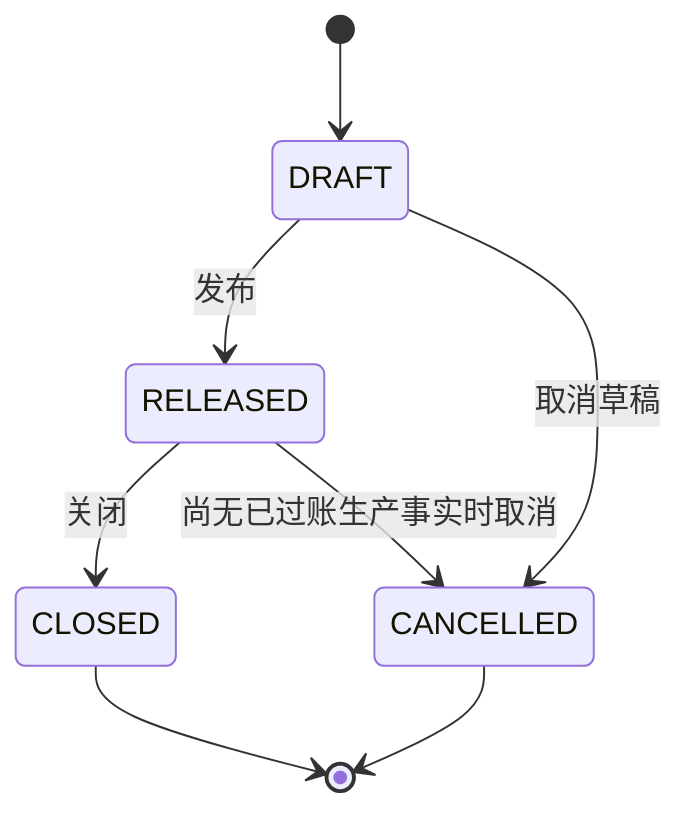

# 生产订单源单边界评审 / Production Order Source Document Review

- 文档类型：架构评审 / Architecture Review
- 状态：领域边界、schema / migration、repo / usecase、成品入库 fact linkage、API/RBAC runtime、分页 readable option API、销售来源 eligibility 同事务复核，以及 Product Core UI / 通用菜单已完成本地实现；永绅客户菜单投影、seed 与部署尚未接入
- 作用域：生产订单的 Product Core 真源、生命周期、与销售/BOM/生产事实的边界，以及进入实现的门禁
- 不代表：永绅客户环境部署、客户签收、生产领料或返工联动已经实现

## 1. 结论

生产订单应作为新的 Source Document 建模，首版聚合候选为 `production_orders + production_order_items`，并使用 `production_order_events` 保存生命周期审计和命令 receipt。它表达“生产什么、计划多少、来源和计划时间”，不表达实际领料、返工、完工入库或成本。

现有 `production_facts` 不能复用为生产订单：它是不可变事实，过账会写 `inventory_txns`，取消使用 `REVERSAL`；生产订单则是可编辑草稿和发布后的计划承诺。Workflow 的生产排程 / 异常任务也不能充当订单真源。

当前已按本评审落下 Ent schema、Atlas migration、repo/usecase、成品入库事实联动、API/RBAC runtime，以及 Product Core UI / 通用菜单：支持 DRAFT 聚合新建 / 整单编辑、发布、按完成量正常关闭或填写原因短关闭、DRAFT 或无有效已过账生产事实时取消 RELEASED 订单、expected_version CAS、V1 receipt 精确重放、同 key 改 intent 冲突和引用真源复核。`FINISHED_GOODS_RECEIPT` 创建与过账会在事实事务内锁定订单，复核订单行的产品、SKU、单位和计划量；有效已过账量按未取消事实聚合。CLOSED 停止新增和过账事实，但不封死既有事实的取消 / 冲正。正式服务已注册独立 `production_order` JSON-RPC 域和 PMC 权限 / production 模块门禁，五类分页 readable option API 与销售来源 eligibility 同事务复核也已完成本地实现；Product Core 页面已通过真实后端浏览器回归。永绅客户菜单投影、seed 和客户环境部署仍未接入，也不顺带实现完整 MES、工艺路线、工时、成本、报工、排程优化或自动 MRP。

## 2. 当前真源和缺口

| 对象 | 当前职责 | 不能承担的职责 |
| --- | --- | --- |
| `sales_orders / sales_order_items` | 客户需求与销售承诺 | 生产执行计划、领料、完工事实 |
| `bom_headers / bom_items` | 产品结构和材料用量版本 | 生产批次、计划数量、实际耗用 |
| `workflow_tasks` | 排程、异常和岗位协同 | 生产订单、库存或完工事实 |
| `production_facts` | `MATERIAL_ISSUE / FINISHED_GOODS_RECEIPT / REWORK`，过账写库存，取消写冲正 | 可编辑计划单、订单生命周期、计划剩余量 |
| `inventory_txns / balances / lots` | 库存流水、余额和批次 | 生产计划或订单承诺 |

当前缺口是销售需求 / 人工批准计划到生产事实之间没有正式 Source Document。继续让页面、Workflow payload 或模拟脚本携带生产计划，会形成重复真源并使剩余量、取消和追溯无法可靠判断。

## 3. 首版聚合边界

### 3.1 `production_orders` 候选字段

| 字段 | 语义 |
| --- | --- |
| `order_no` | 稳定生产单号，唯一 |
| `status` | `DRAFT / RELEASED / CLOSED / CANCELLED` |
| `planned_start_at / planned_end_at` | 可选计划时间；结束不得早于开始 |
| `note` | 可选业务备注 |
| `close_reason / cancel_reason` | 短关闭或取消原因；仅在对应动作写入 |
| `version` | 从 1 开始的乐观锁版本 |
| `created_by / released_by / closed_by / cancelled_by` | 生命周期操作者；只在对应动作写入 |
| `released_at / closed_at / cancelled_at` | 生命周期时间；只在对应动作写入 |
| `created_at / updated_at` | 审计时间 |

首版不在 header 保存客户、产品、BOM 或数量快照；这些属于行项目。订单也不保存“实际完成数量”“实际耗料”“在制成本”等事实派生值。

### 3.2 `production_order_items` 候选字段

| 字段 | 语义与约束 |
| --- | --- |
| `production_order_id` | 所属生产订单 |
| `line_no` | 单内稳定行号，和订单组成唯一键 |
| `product_id` | 必填产出产品 |
| `product_sku_id` | 可选；有值时必须属于 `product_id` |
| `unit_id` | 必填计划单位 |
| `planned_quantity` | 必须大于 0 |
| `sales_order_item_id` | 可选需求来源；有值时产品、SKU、单位必须与来源行一致 |
| `bom_header_id` | 可选已激活 BOM 版本；必须属于当前产品，SKU 粒度只有在 BOM 正式支持后才校验 |
| `product_code_snapshot / product_name_snapshot / sku_code_snapshot / unit_name_snapshot / bom_version_snapshot` | 发布时冻结的可读快照；草稿随当前真源更新，发布后不可改 |
| `note` | 可选行备注 |

同一订单至少一行。首版不复制 BOM 材料明细到生产订单行，也不自动生成采购需求；物料需求展示后续只能由已发布订单 + BOM 版本 + 库存 / 在途真源派生。

### 3.3 `production_order_events` 候选字段

该表只保存订单生命周期审计和网络重放 receipt，不充当订单或生产事实真源：

| 字段 | 语义 |
| --- | --- |
| `production_order_id / actor_id` | 成功结果关联的订单与认证操作者；两者均必填，订单使用 FK `NO ACTION` |
| `command_key` | `CREATE / SAVE / RELEASE / CLOSE / CANCEL` |
| `from_status / to_status / order_version` | 状态与成功后的订单版本 |
| `idempotency_key / intent_hash` | 命令重放键与服务端业务意图 hash；唯一域按 CREATE / 非 CREATE 分开 |
| `result_contract / mutation_result` | 稳定 V1 结果 envelope；reader 必须 fail closed 校验 |
| `reason / created_at` | 业务原因和事件时间 |

该表只记录成功命令，因此 `actor_id / command_key / idempotency_key / intent_hash / result_contract / mutation_result / to_status / order_version / production_order_id` 均为 `NOT NULL`，不允许半条 receipt。`from_status` 仅 CREATE 为 `NULL`，其他命令必须非空；CREATE 必须得到 `to_status=DRAFT / order_version=1`。关闭和取消按生命周期规则约束非空 reason。

CREATE 与其他命令使用不同唯一域：

- CREATE：唯一索引为 `actor_id + command_key + idempotency_key`，查询和竞争都不依赖尚未生成的订单 ID。
- SAVE / RELEASE / CLOSE / CANCEL：唯一索引为 `production_order_id + actor_id + command_key + idempotency_key`。

CREATE 在同一事务内先构造订单聚合，再写关联该结果订单 ID 的成功 receipt；并发请求若竞争 CREATE 唯一索引，失败事务必须整体回滚其订单和行，随后读取赢家 receipt。网络未知结果重试只凭 actor、CREATE、key 定位首次结果并校验 intent hash。`order_no` 是业务编号，不是客户端幂等替代，也不能用于 receipt 查找。

## 4. 生命周期和编辑边界



规则：

1. 只有 `DRAFT` 可编辑 header 和 items；聚合保存使用单事务并按 `expected_version` CAS。
2. 发布必须至少一行、编号有效、计划数量为正，并重新校验产品 / SKU / 单位 / 销售来源 / BOM 引用；成功后冻结行快照。
3. `RELEASED` 后不得直接改计划行。计划变化需取消无事实订单后重建；已有事实时必须关闭旧单并创建新单，不覆盖历史。
4. `CANCELLED` 只表示计划取消，不产生库存冲正。DRAFT 取消原因必填；RELEASED 取消会在订单 CAS 的同一事务与锁域内确认不存在任何有效 `POSTED` production fact。它与事实过账按同一订单行锁串行化，不能用事务外先查后写替代。
5. `CLOSED` 表示不再接受新增或过账生产事实。所有行的有效成品入库量等于计划量时可正常关闭；存在未完成数量时必须填写短关闭原因。关闭只记录当时的计划停止决定，不把既有事实变成不可纠错：后续发现错误成品入库时仍可按 Fact 真源取消并写库存 `REVERSAL`，订单保持 CLOSED，不自动补写关闭原因或回退状态。首版不保存重复的 `IN_PROGRESS / COMPLETED` 状态。
6. 订单和行项目不提供物理删除或通用回收站；未发布误建草稿的删除是否需要，留到 usecase 评审，默认先用取消。

## 5. 与生产事实的合同

生产事实仍由现有 `OperationalFactUsecase` 拥有。后续接入时必须满足：

- `source_type = PRODUCTION_ORDER`。
- `source_id = production_orders.id`。
- `source_line_id = production_order_items.id`。
- 只有 `RELEASED` 订单可创建对应事实；`CLOSED / CANCELLED` 拒绝新增事实。
- 事实过账时订单仍必须是 `RELEASED`；既有 POSTED 事实的取消 / 冲正不要求订单仍为 RELEASED，但必须继续复核订单、订单行、产品、SKU 和单位来源结构。
- `FINISHED_GOODS_RECEIPT` 的产品、SKU、单位必须来自生产订单行；调用方不能自报另一产品。
- 同一订单行未冲正的 `FINISHED_GOODS_RECEIPT` 累计量不得超过计划量；并发过账必须锁定订单行或使用等价原子校验。
- `MATERIAL_ISSUE / REWORK` 的材料、仓库、批次和数量仍由事实命令显式提供，并按 BOM / 订单来源规则单独评审；不能由 Workflow payload 推导。
- 已过账事实使用现有 `REVERSAL` 取消，不回写或删除订单；订单页面的完成量、领料量和剩余量只能从有效事实聚合。

首版不自动把订单发布变成领料，不把 Workflow task done 变成完工入库，也不因关闭订单自动生成财务或成本事实。

## 6. 幂等、并发和事务门禁

- 创建、聚合保存、发布、关闭、取消都必须有服务端命令边界；公开 API 不接受前端派生状态或内部审计字段。
- 编辑和生命周期动作使用 `expected_version`，更新条件必须包含订单 ID、当前状态和版本。
- 同一动作的网络重试需要稳定 `idempotency_key + intent hash`，精确重放返回首次结果；同 key 改业务 intent 必须冲突。CREATE receipt 按 actor + CREATE + key 查找，不能要求客户端先知道订单 ID。
- header、items、版本、生命周期审计必须在一个短事务内落库；生产事实过账保持在事实 usecase 自己的事务，不与生产订单发布组成大事务。
- 发布 / 关闭 / 取消和事实创建的并发必须由 PostgreSQL 行锁或 CAS 保证：旧版本请求零副作用，取消与事实创建只能有一个合法赢家。Close 与事实过账 / 冲正统一按 `production_orders -> production_facts` 锁序串行化；冲正先获得订单锁时，无原因 Close 因完成量不足失败，Close 先完成时后续冲正仍允许并保持订单 CLOSED。
- PostgreSQL 测试必须覆盖两个并发 CREATE 使用同 actor / key / intent 最终只保留一个订单聚合和一条 receipt；首次提交后 transport 结果未知时重试返回同一订单；同 key 改 intent 冲突且零新增订单。测试不得用 `order_no` 唯一冲突代替 receipt 断言。

## 7. API 与 RBAC 合同评审

### 7.1 结论与复用边界

合同已按独立 JSON-RPC 域 `production_order` 实现，只接受下表 snake_case 方法；这是新项目，不提供 camelCase、通用 `save_with_items`、`id` 别名或旧接口兼容。

权限继续复用现有 `pmc.plan.read / pmc.plan.create / pmc.plan.update`，不新增重复的 `production.order.*` 权限体系。模块写门禁复用当前 `production` 模块；它是现有 PMC action entitlement 和生产运行入口的模块真源，本切片不再并行新增 `production_orders` 模块 key。Source Document 与 Workflow / Fact 的数据边界仍由 usecase、表和状态机保证，不能因为共用产品模块 gate 就互相代写。

当前错误码可直接复用 `InvalidParam / AuthRequired / AdminRequired / AdminDisabled / PermissionDenied / IdempotencyConflict / Internal`。`ErrProductionOrderConflict` 是“版本已变化”的独立语义，不能冒充 `40920` 同 key 改 intent；正式实现需在统一 `errcode/catalog.go` 新增一个 `ResourceVersionConflict` 定义，建议码位 `40922`、文案“记录已被其他操作更新，请刷新后重试”，并走现有服务端真源到前端生成码表的同步门禁，业务代码不得直接写魔法数字。

### 7.2 方法、权限与模块状态

| 方法 | 用途 | 后端权限 | 模块要求 |
| --- | --- | --- | --- |
| `create_production_order` | 新建 DRAFT 聚合 | `pmc.plan.create` | `production=enabled` |
| `save_production_order` | 保存既有 DRAFT 聚合 | `pmc.plan.update` | `production=enabled` |
| `release_production_order` | DRAFT 发布为 RELEASED | `pmc.plan.update` | `production=enabled` |
| `close_production_order` | RELEASED 关闭 | `pmc.plan.update` | `production=enabled`，且先满足 7.8 的关闭语义门禁 |
| `cancel_production_order` | DRAFT 或无有效 POSTED 事实的 RELEASED 订单取消 | `pmc.plan.update` | `production=enabled` |
| `get_production_order` | 读取单个订单聚合 | `pmc.plan.read` | active revision 必须仍投出 read entitlement；`read_only` 可读 |
| `list_production_orders` | 分页查询订单 header | `pmc.plan.read` | active revision 必须仍投出 read entitlement；`read_only` 可读 |
| `list_production_order_reference_options` | 分页查询表单可读引用或批量恢复历史引用 | `pmc.plan.read` | active revision 必须仍投出 read entitlement；`read_only` 可读 |

当前角色矩阵不为按钮数量新增权限：PMC 具有 read/create/update，可执行全部方法；生产角色具有 read/update，可读取、保存和执行生命周期动作，但不能创建；老板 / 管理层只有 read；其他普通角色默认无权。若真实客户职责证明关闭或取消必须与普通更新分离，再单独评审权限，不在没有样本时提前拆分。

模块状态使用统一语义：`enabled` 按权限开放读写；`read_only` 只允许 list/get；`disabled` 在固定客户运行态通过 effective entitlement 和模块 gate 拒绝全部正式入口。handler 不能因为“历史可查”绕过 active revision；如后续需要受控历史审计，使用系统审计权限和独立控制面，不给普通业务 API 增加 disabled fallback。

所有方法先走统一登录和管理员校验，再走 `CurrentEffectiveAdminPermissions`。未登录分别返回当前 `AuthRequired / AuthExpired / AuthInvalid`；非管理员返回 `AdminRequired`；数据库中的管理员已停用返回 `AdminDisabled`；无有效权限、固定客户缺 active revision 或配置收窄后不再授权均返回 `PermissionDenied`。`super_admin` 在固定非 demo 客户运行态仍受 active revision 和模块门禁收窄，不能绕过业务状态机；只有未固定客户的本地 / demo 审阅环境沿用现有全权限投影。

### 7.3 身份、客户和幂等边界

- `actor_id` 只取经过 `requireAdmin` 校验、且 token uid / username 与当前数据库管理员一致的 claims；请求不得携带 `actor_id / created_by / released_by / closed_by / cancelled_by`。
- 请求不得携带 `customer_key`。模块 gate 只用服务端部署上下文 `ERP_CUSTOMER_KEY`，避免调用方切换客户配置。
- create/save/release/close/cancel 都必须接收非空、最长 128 字符的 `idempotency_key`；服务端只接收 key，自行按 canonical command 和业务字段计算 SHA-256 intent hash，拒绝 caller 提供 `intent_hash / command_key / mutation_result / result_contract`。
- `idempotency_key` 由调用端为一次用户 intent 生成并在网络未知结果重试时原样复用；服务端不替调用方临时补 key。CREATE 的 receipt 唯一域仍是 actor + CREATE + key，其他动作仍是 order + actor + command + key。
- save/release/close/cancel 必须接收正的 JSON 安全整数 `expected_version`；create 不接收该字段。返回聚合始终包含当前 `version`，调用端不能根据请求版本猜测 replay 结果版本。
- HTTP 408、网络断开、HTTP 5xx 或 JSON-RPC `Internal` 都不能证明未提交；调用端必须保留完全相同的请求和 key 重放。确定性的参数、权限、状态、版本和 changed-intent 冲突不应换 key 自动重试。

### 7.4 精确请求合同

所有方法使用顶层 allowlist；字段一旦出现必须类型正确，未知字段、空格别名、camelCase、`id`、`action`、客户端状态、审计字段和系统 receipt 字段一律 `InvalidParam`。整数必须是正的 JSON 安全整数；数量使用十进制定点字符串；时间使用 Unix 秒安全整数或 `null`。

| 方法 | 唯一允许的顶层字段 |
| --- | --- |
| `create_production_order` | `order_no, planned_start_at, planned_end_at, note, items, idempotency_key` |
| `save_production_order` | `production_order_id, expected_version, order_no, planned_start_at, planned_end_at, note, items, idempotency_key` |
| `release_production_order` | `production_order_id, expected_version, idempotency_key` |
| `close_production_order` | `production_order_id, expected_version, reason, idempotency_key`；`reason` 可省略，仅当有效入库量未完成时必须非空 |
| `cancel_production_order` | `production_order_id, expected_version, reason, idempotency_key`；`reason` 必须是 1 至 255 字符业务文本 |
| `get_production_order` | `production_order_id` |
| `list_production_orders` | `keyword, status, date_field, date_from, date_to, sort_by, sort_direction, limit, offset` |
| `list_production_order_reference_options` | `reference_type, keyword, product_id, product_sku_id, unit_id, selected_ids, limit, offset`；搜索与历史回显是互斥模式 |

`items` 必须是至少一项的数组；每项只允许 `line_no, product_id, product_sku_id, unit_id, planned_quantity, sales_order_item_id, bom_header_id, note`。客户端不提交行 ID、快照字段、订单 ID、创建 / 更新时间或实际完成量；整单保存由 line_no 表达草稿行身份，服务端重新校验并生成发布快照。

create/save 的 `order_no / items / idempotency_key` 必须出现；save 和三个生命周期动作的 `production_order_id / expected_version / idempotency_key` 必须出现；cancel 的 `reason` 必须出现且非空。optional 时间、note、SKU、销售行和 BOM 可以省略或显式为 `null`，但不得用 `0 / "" / false` 代替缺值。

列表筛选约束：`status` 只允许空值或 `DRAFT / RELEASED / CLOSED / CANCELLED`；`date_field` 只允许空值、`planned_start_at / planned_end_at / created_at / updated_at`，提供日期范围但省略字段时默认 `planned_start_at`；`date_from <= date_to`。`sort_by` 默认 `updated_at`，只允许 `order_no / planned_start_at / planned_end_at / created_at / updated_at`；方向只允许 `asc / desc`，默认 `desc`。`limit` 省略时为 50，显式值必须在 1 至 200；`offset` 省略时为 0，显式值必须大于等于 0。提供非法类型或越界值应拒绝，不能静默取整、字符串化或改回默认值。

### 7.5 返回合同

create/save/release/close/cancel/get 都返回：

```json
{
  "production_order": {
    "id": 1,
    "order_no": "MO-20260712-001",
    "status": "RELEASED",
    "version": 2,
    "planned_start_at": 1783785600,
    "planned_end_at": null,
    "note": null,
    "close_reason": null,
    "cancel_reason": null,
    "created_by": 10,
    "released_by": 10,
    "closed_by": null,
    "cancelled_by": null,
    "released_at": 1783785600,
    "closed_at": null,
    "cancelled_at": null,
    "created_at": 1783785600,
    "updated_at": 1783785600
  },
  "production_order_items": []
}
```

订单行返回 `id, production_order_id, line_no, product_id, product_sku_id, unit_id, planned_quantity, sales_order_item_id, bom_header_id, product_code_snapshot, product_name_snapshot, sku_code_snapshot, unit_name_snapshot, bom_version_snapshot, note, created_at, updated_at`。decimal 一律字符串；optional ID / 时间 / 文本一律 `null`，不用 `0` 或空字符串冒充缺值。API 不返回 `idempotency_key / intent_hash / command_key / mutation_result / result_contract`。

列表只返回 header，不内嵌行：`{production_orders: [...], total, limit, offset}`。详情必须由 repo/usecase 在一个短只读事务的一致快照内读取 header + 按 `line_no` 排序的 items，不能由 handler 分别读取后拼出可能跨版本的聚合。响应结构不合法时调用端不得清除未知结果 attempt。

### 7.6 错误映射与可观测性

| 领域错误 / 场景 | JSON-RPC 结果 |
| --- | --- |
| 请求字段、类型、范围、reason、状态筛选非法；`ErrBadParam` | `InvalidParam(40010)` |
| 订单不存在 | `InvalidParam(40010)`，业务文案“生产订单不存在” |
| 产品 / SKU / 单位 / 销售行 / BOM 归属或 active 复核失败 | `InvalidParam(40010)`，业务文案“生产订单引用的产品、规格、单位、销售明细或 BOM 已失效，请刷新后检查” |
| 非法生命周期 | `InvalidParam(40010)`，业务文案按动作说明“当前状态不能发布 / 保存 / 关闭 / 取消” |
| RELEASED 取消时仍有有效 POSTED 事实 | `InvalidParam(40010)`，“该生产订单已有生效的生产入库记录，不能取消；请先按业务规则冲正或关闭” |
| 同 receipt key 改 intent | `IdempotencyConflict(40920)` |
| `expected_version` 已变化 | 新统一 `ResourceVersionConflict(40922)` |
| receipt envelope 损坏或数据库 / commit 结果无法确认且未找到 receipt | `Internal(50000)`；日志记录 method、order_id、actor_id、request_id 和脱敏错误分类 |

JSON-RPC 传输日志已有 `idempotency_key / intent_hash` 脱敏，正式 handler 不额外打印完整请求、订单备注或明细。成功审计以 `production_order_events` 为真源，记录 actor、command、from/to status、order version、receipt 和原因；读取不新增审计事件。结构化日志只记录稳定 domain ID、actor ID、method、错误分类和 request/trace 标识，不记录 receipt payload 或客户业务文本。

### 7.7 Provider 与 runtime 已实现范围

当前 runtime 已完成：

1. 在 data ProviderSet 注册 `NewProductionOrderRepo` 并绑定 `ProductionOrderRepo`；在 biz ProviderSet 注册 `NewProductionOrderUsecase`。
2. repo/usecase 已增加一致快照 `GetProductionOrderAggregate` 与受控 `ListProductionOrders`；不新增表或 read-model 快照。
3. 将 `ProductionOrderUsecase` 注入 dispatcher / `JsonrpcService`，更新 Wire 生成结果，并把 `production_order` URL 接入现有 dispatch。
4. 已新增独立 handler / params / mapper / contract tests；所有方法 canonical-only、allowlist fail closed。
5. 统一 error catalog 已新增 `ResourceVersionConflict(40922)`，并由生成脚本同步前端码表和消费层中文提示。
6. 复用 `production` 模块 gate 和 `pmc.plan.*` 权限；不改菜单、页面或客户 seed。

不在 dispatcher 注册 ProcessRuntime handler，不创建 Workflow task，不自动写 production fact，也不接 `MATERIAL_ISSUE / REWORK`。

### 7.8 已关闭的领域阻断与测试门禁

`Close` 领域阻断已在本地 repo/usecase 主路径关闭：同一订单行锁和事实事务内逐行聚合有效 POSTED `FINISHED_GOODS_RECEIPT`；所有行恰好达到计划量时允许无 reason 正常关闭，任一行未完成时 reason 必填，越量或来源结构错误 fail closed。精确 receipt 重放先于当前状态 / CAS，失败不写 receipt 或部分状态。

事实纠错不从属于 Source Document 当前状态。过账仍要求 RELEASED；取消 / 冲正允许在 CLOSED 后执行，并在同一锁序内写事实 CANCELLED 与库存 REVERSAL。PostgreSQL 已覆盖冲正先行使无原因 Close 失败，以及 Close 先行后冲正仍成功且订单状态、关闭原因和单条 Close receipt 保持不变。该本地证据只解除 API runtime 前的领域阻断，不代表 API 已接入。

API/RBAC 实现至少通过以下门禁：

- handler contract：七个 canonical 方法、顶层 / items allowlist、JSON 安全整数、decimal string、Unix 秒、分页 / 排序白名单、unknown method / alias / `customer_key / actor_id / intent_hash / id / status` 注入拒绝。
- auth/RBAC：未登录、过期 / 无效登录、非管理员、disabled、普通无权限、PMC、生产、老板、固定客户缺 active revision、read_only / disabled module、super_admin 在 demo 与固定客户的差异。
- actor/audit：请求 actor 字段零接受，receipt actor 必须等于认证管理员；CREATE / 非 CREATE receipt 唯一域和返回聚合一致。
- lifecycle：create/save/release/close/cancel happy path、reason 空白、非法状态、stale version、同 key exact replay、同 key changed intent、50000 未知结果同 key重放。
- read contract：详情聚合一致、items 按 line_no、列表总数 / limit / offset、空结果、筛选 / 排序 / 时间边界、读取不产生 event。
- PostgreSQL：关闭完成量与 reason、close vs fact posting/cancellation、cancel vs fact posting、并发相同 / 不同 key、失败零 receipt / 零部分聚合。
- error sync：`errcode` catalog、生成前端码表、消费层和魔法数字扫描全部通过。
- provider：Wire 生成零漂移，production order 依赖非 nil，服务启动和 JSON-RPC dispatch contract 通过。

### 7.9 UI / 菜单边界评审

#### 页面归属与主任务

生产订单需要独立 Source Document 页面，建议使用稳定 page key `production-orders`、路由 `/erp/production/orders`，放在“生产管理”下并排在“生产排程”之前。页面主任务是：PMC 或生产岗位维护生产计划单，确认产品、规格、销售来源、BOM、计划数量和计划日期后发布；发布后只处理关闭或取消，不在本页登记生产事实。

现有两个页面不能复用或改名承接生产订单：

| 页面 | 当前真源 | 保持的职责 |
| --- | --- | --- |
| `production-scheduling` / 生产排程 | `workflow_tasks` | 排程协同、责任岗位、到期跟进、完成 / 阻塞 / 催办 |
| `production-progress` / 生产进度 | `production_facts + inventory_txns` | 生产发料、成品入库、返工及取消 / 冲正事实 |
| `production-orders` / 生产订单 | `production_orders + production_order_items` | 生产计划源单的草稿、发布、关闭、取消和聚合详情 |

因此不能把 Workflow 或 Fact 列表换标题后当成生产订单，也不在一个页面里混成“订单 + 协同 + 事实”的万能工作台。业务看板可继续把生产 / 委外作为导航分组，但生产订单页面本身必须保持独立真源。

首版复用现有 `BusinessPageLayout + BusinessDataTable + BusinessFormModal` 标准骨架，不另造整页框架或详情 Drawer。新建、编辑、查看使用同一个宽 Modal；列表单击选中，双击打开可编辑或只读聚合。当前没有生产订单专属原型，使用 `business-module-page-standard-v1` 与 `business-form-page-standard-v1` 两个 To Implement 样板即可，不为本切片新增静态原型，也不把样板晋级为 Current。

#### 菜单、模块与角色投影

- 模块开关继续复用后端 `production`，不新增 `production_order` 模块状态或客户专属 feature key。
- 后端权限继续复用 `pmc.plan.read / create / update`；菜单显隐、effective session 和按钮投影只能收窄入口，不能替代 API/RBAC。
- PMC：可查看、新建、编辑 DRAFT、发布、关闭、取消。
- 生产：可查看、编辑已有 DRAFT、发布、关闭、取消，但没有新建权限；这是现有 `pmc.plan.read + update` 的真实后端合同，不在前端扩大为 create。
- 老板 / 管理层：后端内置角色有 `pmc.plan.read`，只读查看；客户配置若未投影该页则不显示菜单，不能由前端自行补回。
- 其他普通角色：只有同时具备 `pmc.plan.read` 且 active page 投影包含 `production-orders` 才能进入；无权限直达路由应 fail closed。
- `super_admin` 仍受固定客户 active revision、模块状态和 effective page / action 上限约束；不能以“管理员看全”绕过客户配置。
- 岗位任务端 `/m/<role>/tasks` 继续只承接 Workflow 任务，不增加生产订单编辑入口；PMC / 生产移动端 smoke 只验证既有任务入口未被桌面页接入破坏。

本轮只确认目标合同，不修改后端内置菜单、`businessModules / dashboardModules`、router、客户 menu / role projection 或 seed。下一实现切片必须一次同步 page key、route、内置菜单、产品菜单 registry 和相关测试；客户配置是否启用该页属于后续单独授权范围，不能在通用 UI 实现中顺带修改 yoyoosun。

#### 列表、筛选与详情合同

列表 API 当前只返回订单头，首版页面必须按该合同展示，不允许逐行请求详情、从 Workflow / Fact 拼接完成量，或在前端补造产品 / 数量摘要。

| 区域 | 首版可见内容 |
| --- | --- |
| 列表列 | 生产单号、状态、计划开始、计划结束、备注、更新时间 |
| 筛选 | 关键字、状态、日期字段与范围、排序 |
| 分页 | 使用后端 `total / limit / offset`，默认每页 20，筛选变化回第一页 |
| 聚合详情 | 订单头、按 `line_no` 排序的明细、产品编码 / 名称、规格编码、单位、计划数量、销售来源、BOM 版本、关闭 / 取消原因和生命周期时间 |

列表关键字只按当前 API 真源搜索生产单号 / 备注；不得在 UI 文案里声称可按产品或销售单搜索。若后续需要产品、数量、完成量或销售来源列表摘要，应先独立评审后端受控 read model，不能用 N+1 或隐藏本地索引补齐。

筛选、页码、每页数量和排序写入 URL query，显式“刷新当前页”按当前 query 重读；重复点击已激活菜单不触发刷新。路由切换、筛选和刷新使用 abort / latest-request guard，旧响应不得覆盖新页面、弹错误或重置 loading。详情路由可以使用隐藏 `production_order_id` query 作为恢复选择依据，但页面、导出和表单不得显示 raw ID。

#### 新建 / 编辑与字段真源

表单上半区维护生产单号、计划开始、计划结束和备注；下半区维护至少一条明细。每条明细显示序号、产品、规格、单位、计划数量、可选销售订单行、可选 BOM 版本和备注。

- 产品、SKU、销售订单行、BOM 和单位都必须通过现有正式 API 提供可读选项，显示业务编号、名称、规格、销售单号 / 行号和 BOM 版本；禁止 raw `*_id` 输入或 `#123` fallback。
- 选择 SKU 后应按现有主数据关系带出产品与单位；切换 / 清空 SKU、销售来源或 BOM 时，必须清除不再匹配的依赖值，避免残值。缺少可验证来源时保持空值，不伪造默认关联。
- 销售订单行和 BOM 只能选择与当前产品 / SKU / 单位归属一致且仍有效的记录；前端用于减少误选，最终归属、active 状态和数量仍由生产订单 usecase 在事务内复核。
- 当前 API 已能返回产品 / SKU / 单位 / BOM 快照，但销售来源只返回 `sales_order_item_id`。若现有销售行列表不能稳定提供“销售单号 + 行号 + 产品 / SKU / 单位”的可读映射，UI 实现必须先停在前置合同缺口，不得显示 raw ID 或在前端猜单号。
- create/save 返回成功聚合后，以服务端返回值替换当前详情；不能继续保留客户端临时快照或自行增加 version。

`idempotency_key` 和 `expected_version` 永远隐藏携带。一次用户 intent 在请求结果未知时冻结同一 key 和完整 payload；网络中断、HTTP 408、5xx 或成功响应结构异常不得清除 attempt。明确业务失败可结束该 attempt；改变订单内容或动作原因必须生成新 key。`ResourceVersionConflict(40922)` 应提示“记录已被其他人更新，请刷新后再操作”，保留用户可恢复的草稿输入，但不自动用新版本重放旧保存。

#### 状态与动作

| 当前状态 | 页面动作 | 页面约束 |
| --- | --- | --- |
| `DRAFT` | 编辑 / 保存、发布、取消 | 保存与发布携带当前 version；取消原因必填 |
| `RELEASED` | 查看、关闭、取消 | 不再编辑头和明细；取消可能因已有有效事实被后端拒绝 |
| `CLOSED` | 只读查看 | 显示正常关闭或短关闭原因；不得新增 / 过账事实 |
| `CANCELLED` | 只读查看 | 显示取消原因；不提供恢复、删除或重新发布 |

关闭弹窗允许原因为空，并提示“若生产数量尚未全部完成，请填写短关闭原因”；页面不自行计算是否已完成。后端确认全部完成时允许无原因正常关闭，未完成则返回短关闭原因必填。不能用 production facts 前端汇总决定是否关闭。

CLOSED 只表示停止新增 / 过账生产事实，不禁止既有事实纠错。订单页不提供“冲正事实”或本地回退订单状态；事实取消 / 库存冲正继续在生产进度的正式 Fact 主路径办理。若后续增加关联入口，只能跳转到按可读生产单号定位的事实页，不能在订单页伪造事实按钮。

#### 页面状态与用户可见语言

- loading：表格和详情分别有明确加载态，不保留上一记录的可操作按钮。
- empty：显示“暂无生产订单，可按权限新建生产计划单”；无 create 权限时只提示当前没有可查看记录。
- no permission / module disabled / read_only：按 effective session 隐藏或禁用动作，直达路由仍由后端拒绝；不显示权限码、模块 key 或 API 名。
- error：使用统一中文错误 helper 和场景 fallback；请求失败保留筛选和可恢复输入，不透传原始 `err.message`。
- long / boundary：生产单号、备注、产品名、规格、BOM 版本和原因需要换行 / tooltip；超长连续字符串、超大 decimal、20+ 明细和窄视口不得覆盖相邻操作区。
- accessibility：Modal 打开聚焦第一个可操作字段，Tab 顺序稳定，关闭 / Escape 后焦点回触发按钮；只读态不留下可提交控件，图标按钮有 accessible name。

### 7.10 option API 完成后的 UI 实现切片

允许修改路径：

- `web/src/erp/api/productionOrderApi.mjs` 及合同测试。
- `web/src/erp/pages/V1ProductionOrdersPage.jsx` 和 `web/src/erp/components/production-orders/**`。
- 通用页面注册所需的 `web/src/erp/router.jsx`、`businessModules.mjs`、`dashboardModules.mjs`、`ERPLayout.jsx` 图标、后端内置菜单与对应同步测试。
- 生产订单定向前端测试、style:l1 场景和浏览器回归脚本。

明确禁止顺带修改：生产订单 schema / migration / repo / usecase / JSON-RPC / RBAC 语义、`production_facts`、Workflow、岗位任务端业务语义、seed、yoyoosun 客户配置、部署、目标环境、`MATERIAL_ISSUE / REWORK`。

本评审已确认现有参考数据 API 不能完整提供生产订单所需的分页可读投影。必须先完成 7.11 的后端 option API 切片；在该切片通过前不进入 UI 实现，也不允许在页面暴露 raw ID、全量拉取或本地拼接。

实现门禁：

1. unit / contract：七个 canonical API wrapper、严格返回 shape、hidden CAS / attempt、字段映射、来源切换清值、状态动作、40922 与未知结果重试。
2. L1：独立 `production-orders` 场景覆盖列表、筛选、分页、选择、聚合 Modal、新建 / 编辑 / 发布 / 关闭 / 取消、只读终态、空 / 错误 / 无权限、长文本 / 大数字 / 多明细、浅色 / 暗色和横向溢出。
3. L2：真实浏览器连接本地 API，证明创建草稿、保存、发布、正常关闭 / 短关闭、取消、stale version、刷新恢复和失败不丢草稿；不使用 mock 证明领域写入。
4. 角色 smoke：PMC 全动作、生产无新建但可更新、老板只读、无权限角色菜单隐藏且直达失败、super_admin 固定客户 fail closed；PMC / 生产移动岗位任务端保持原行为。
5. 页面接入后再按影响面运行前端 lint / css / test / style:l1、production order API/RBAC 定向合同、`full.sh` 与 `strict.sh`。这些是下一实现切片门禁，不是本次 docs-only 评审的已通过证据。

### 7.11 可读选项真源评审 / Readable Option Source Review

#### 结论

现有公开 API 不能直接作为生产订单表单的完整选项源。生产订单域已完成独立 canonical option API 的本地实现：只增加最小只读投影和查询，并在 create / save / release 事务内复核销售父单 active、来源行 open 及产品 / SKU / 单位一致性；未新增表、字段、migration 或权限体系。PostgreSQL 锁序测试已纳入并通过 critical gate；Product Core UI runtime 与通用菜单已接入，永绅客户菜单投影、seed 和部署仍未接入。

| 引用 | 可复用能力 | 当前缺口 |
| --- | --- | --- |
| 产品 | `list_products` 已支持 keyword、active_only、limit/offset，并返回编码、名称、款号和默认单位 ID | 返回值没有可读单位；接口不是 production 域严格合同，读取不经过 production module gate |
| SKU | `list_product_skus` 已支持 product_id、keyword、active_only、limit/offset，并返回规格编码、名称、颜色、尺寸和默认单位 ID | 需要和产品、单位组合才可读；不能让页面全量拉取后本地 join |
| 单位 | `list_units` 已支持 keyword、active_only、limit/offset，返回编码、名称和精度 | 权限复用 `material.read`，没有按已选历史引用解析的正式合同 |
| 销售订单行 | 现有列表按 sales_order_id + line_status 分页，返回行号、产品快照、产品/SKU/单位 ID 和数量 | 不支持跨订单关键字搜索，不返回销售单号、SKU/单位可读值，不联查订单生命周期；PMC 无 `sales_order_item.read`，生产岗位无销售行读取权限 |
| Active BOM | `list_bom_versions` 已支持 product_id、status、keyword、limit/offset，能筛选 ACTIVE 并返回版本 | 生产岗位无 `bom.read`；返回产品 ID 而非可读产品，读取不经过 production module gate |

直接给生产岗位增加完整 `sales_order_item.read / bom.read` 会扩大其页面和数据访问面；要求前端分别拉取产品、SKU、单位、销售订单、销售行和 BOM 再 join，会形成全量加载、N+1、权限漂移和旧数据缺值。因此不得直接复用这些公开端点拼装表单。

#### 后端 option API 合同

在现有 `production_order` JSON-RPC 域增加一个 canonical-only 方法 `list_production_order_reference_options`。请求顶层只允许：

```text
reference_type, keyword, product_id, product_sku_id, unit_id,
selected_ids, limit, offset
```

- `reference_type` 必填且只允许 `product / product_sku / unit / sales_order_item / active_bom`。
- `keyword` 是 trim 后的可选业务文本；不得接受 raw SQL、排序字段或客户 key。
- `product_id / product_sku_id / unit_id` 只作为级联查询的隐藏稳定引用；按 reference_type 使用，不相关字段出现即拒绝。
- `selected_ids` 只用于批量恢复当前生产订单已经保存的引用，最多 50 个正安全整数；不能和 keyword 搜索混用，也不能作为用户输入框。
- `limit` 默认 20、最大 50；`offset` 非负。所有搜索必须服务端分页并使用稳定排序，页面不得用 `limit=200/500` 模拟全量加载。
- 拒绝 `customer_key / actor_id / id / *_ids` 别名、camelCase 和任意未知字段。

响应统一返回 `{options, total, limit, offset}`。每个 option 使用内部稳定 `value` 与业务可读 `label`，并按类型附带表单级联所需的最小字段；页面只显示 label 和业务 metadata，不显示、复制、导出或要求用户填写内部 value。保存时由系统把已选 value 隐藏映射回 canonical production order 请求字段，不能让用户手工传 `product_id / product_sku_id / unit_id / sales_order_item_id / bom_header_id`。

选项最小可读字段：

- product：编码、名称、款号、客户款号、active 状态、可读默认单位。
- product_sku：规格编码 / 名称、颜色、色号、尺寸、包装版本、所属产品可读摘要、可读默认单位。
- unit：编码、名称、精度。
- sales_order_item：销售单号、行号、产品 / SKU / 单位可读摘要、订单数量、计划交期、订单生命周期和行状态。
- active_bom：所属产品可读摘要、BOM 版本、有效期和 ACTIVE 状态。

不得返回客户资料、价格、金额、付款条件、内部事件、receipt 或不参与生产计划选择的整张源单内容。

#### 权限、模块与客户 scope

- 方法复用 `pmc.plan.read`，并使用服务端部署上下文执行 `production` readable module gate；不信任请求携带 customer key。
- 不要求调用者额外拥有完整 `sales_order_item.read / bom.read`，因为该 endpoint 只暴露生产计划所需的最小只读投影；这不授予销售订单页或 BOM 管理页访问权。
- fixed customer 缺 active revision、production disabled 时 fail closed；read_only 仍允许读取选项，但生产订单写动作继续由既有 enabled gate 拒绝。
- 当前私有化形态是一客户一数据库 / 部署上下文，表中没有 `tenant_id/customer_key`。option 查询只能使用当前连接的业务库，不新增租户字段或客户端切换 scope。
- 产品、SKU、单位搜索只返回 active 记录；BOM 搜索只返回 ACTIVE。销售来源搜索只返回 lifecycle=`active` 且 line_status=`open` 的订单行。

销售来源的 eligibility 必须同时进入生产订单 repo/usecase 的同事务保存 / 发布复核。当前实现只核对销售行的产品、SKU、单位，没有核对父订单 lifecycle 和行状态；仅在 option API 隐藏无效来源会形成 TOCTOU 和绕过，因此后端切片必须补为 active 销售订单 + open 行。失败仍映射既有生产订单引用失效错误，不新增第二套状态真源。

#### 表单级联与残值 / 缺值

1. 选择产品：加载该产品的 active SKU 与唯一 Active BOM；单位建议取 SKU 默认单位，否则取产品默认单位。没有可验证默认单位时保持空，不取全局第一个单位。
2. 选择 SKU：必须属于当前产品；更新为 SKU 默认单位，若 SKU 无默认单位才使用产品默认单位。已选销售来源若产品 / SKU / 单位不再完全一致，立即清空销售来源。
3. 选择销售订单行：以服务端 option 返回的产品、SKU、单位一次性替换当前行对应字段，再重新加载该产品的 Active BOM；不保留上一来源的 SKU、单位或 BOM。
4. 切换 / 清空产品：清空 SKU、单位、销售来源和 BOM。切换 / 清空销售来源时清除由该来源带出的产品、SKU、单位和 BOM，再由用户重新选择，避免来源已变但快照残留。
5. 切换单位：保留产品 / SKU，但若销售来源的单位不再一致则清空销售来源。切换产品但产品不变时可以保留仍属于该产品的 Active BOM；任何无法证明一致的 BOM 都必须清空。
6. 清空 BOM：只清空 BOM，不反向修改产品 / SKU / 单位；BOM 是可选计划依据，不是这些字段的真源。

前端联动只减少误选，最终产品 active、SKU 归属 / active、单位 active、销售订单 active + 行 open + 产品/SKU/单位一致、BOM ACTIVE + 产品归属必须在生产订单事务内重新校验。

旧订单详情优先显示生产订单行已经冻结的产品、SKU、单位和 BOM 快照。销售来源没有冻结销售单号 / 行号，因此 `selected_ids` 模式需要按一批 ID 返回历史可读 projection；inactive / closed / canceled 引用标记 `selectable=false` 并说明“历史关联，仅供查看”，不能混入新建搜索结果。真实引用已不存在时显示“原关联记录已不可用”，不得显示 raw ID、猜编号或用 mock 值补齐。

#### 后端独立实现结果与测试门禁

本切片修改范围保持在 production order biz/repo/service、定向测试和正式文档；没有修改 UI、菜单、seed、客户配置、Workflow、production facts、schema/migration、部署或目标环境。下一独立切片才进入 UI runtime 与通用菜单实现。

至少覆盖：

- strict params、canonical method、五种 reference_type、分页上限、稳定排序、unknown field / alias / customer_key 拒绝。
- 未登录、disabled、无 `pmc.plan.read`、production disabled / read_only、PMC、生产、老板和 fixed-customer super_admin 边界。
- 产品 / SKU / 单位 active 搜索、SKU 产品归属、默认单位优先级、Active BOM 唯一产品归属。
- 销售单号 / 行号可读搜索，只返回 active 订单 + open 行；closed/canceled/非 open 不可用于新选择。
- selected_ids 批量历史回显、不可选择标记、缺失引用不泄漏 raw ID，查询次数有固定上界且无逐项 N+1。
- PostgreSQL 证明 option 查询和保存 / 发布复核口径一致；订单或行在选择后失效时保存零部分状态、零 receipt。
- 现有 production order API/RBAC、race、critical PostgreSQL、full / strict 在实现完成后重跑。浏览器 L1/L2 留到后续 UI 切片，不能由 option API 单测代替。

## 8. Schema gate 与后续拆分

本评审确认需要新的持久化 Source Document，现有真源不能安全复用。后续仍按独立任务拆分：

1. `schema / migration`：已完成本地独立切片，落下订单、行、生命周期事件 / receipt、索引、检查约束、FK、Ent 不可变保护和 migration；已被后续 API runtime 消费，但未部署目标环境。
2. `repo / usecase`：已完成本地独立切片，支持聚合保存、发布、关闭、DRAFT 取消、CAS、幂等、引用归属复核和 PostgreSQL 并发测试；已注入正式 server provider 并由 `production_order` API 调用。
3. `production fact linkage`：已完成本地独立切片。当前只接 `FINISHED_GOODS_RECEIPT`；事实创建和过账校验 RELEASED 订单、订单行、产品/SKU/单位，累计有效成品入库不得超过计划量；取消事实按现有 REVERSAL 与 CANCELLED 真源释放有效量。订单取消与事实过账共享订单锁域；不改 Workflow。`MATERIAL_ISSUE / REWORK` 仍需按 BOM / 材料来源另行评审。
4. `API / RBAC`：runtime 已完成独立切片，使用 canonical JSON-RPC、现有 PMC 权限、production module gate 和统一错误码；分页 readable option API 已实现。
5. `UI / browser`：Product Core 独立 Source Document 页面和通用菜单注册已完成本地实现，列表、聚合表单、发布 / 关闭 / 取消、stale version 草稿保留与刷新恢复已通过真实后端浏览器 E2E；浏览器用本机隔离 customer key 绑定通用构建，不注入菜单、权限、数据或 API 响应。永绅客户菜单投影、seed、部署和目标环境证据仍未接入。

任一步发现需要工艺路线、WIP、工时、成本、自动 MRP 或客户专属字段时必须停止并另行评审，不能扩大本切片。

## 9. 验收标准

边界评审完成标准：

- 明确生产订单是 Source Document，不重复 `production_facts`。
- 明确首版聚合、字段、状态、来源、快照和事实引用。
- 明确取消 / 关闭、CAS、幂等和并发赢家。
- 明确 Workflow / Fact、RBAC、UI 和客户差异禁区。
- 路线图、能力台账和当前真源索引同步为“schema / migration / repo / usecase、fact linkage、API/RBAC runtime、分页 readable option API、销售来源 eligibility 同事务复核，以及 Product Core UI / 通用菜单已完成本地实现；永绅客户菜单、seed 与部署未接入”。

schema / migration 切片已通过 Ent + Atlas 零漂移、SQLite 跨方言 CHECK、fresh PostgreSQL 57 项 migration / pending 0、约束坏行、两类 partial unique、receipt 必填与状态 CHECK、FK 和删除保护测试。repo/usecase 已在同一事务内复核 active 产品 / SKU / 单位、销售行产品-SKU-单位和 Active BOM 产品归属，并通过聚合回滚、DRAFT 生命周期、精确重放、同 key 改 intent、相同 CREATE / RELEASE key 并发重放、不同 key CAS 单赢家和失败零 receipt 的真实 PostgreSQL 测试。fact linkage 已通过错行 / 错产品 / SKU / 单位 / 类型、冲正后数量复用、越量零副作用、同 key 并发重放、并发过账数量单赢家，以及 RELEASED 取消与事实过账八轮竞争只有一个合法赢家的 PostgreSQL 与 race 证据。Close 已通过逐行完成量、正常 / 短关闭、冲正后完成量、来源异常、越量、精确重放、失败零 receipt，以及过账 / 冲正两种锁序的 PostgreSQL 与 race 证据；CLOSED 后事实纠错会写 CANCELLED + 库存 REVERSAL，但不改订单状态和 Close receipt。API/RBAC 已通过 canonical method / strict params、认证 actor、PMC 角色矩阵、super_admin 固定客户 fail closed、enabled / read_only / disabled 模块、幂等重放 / CAS、get/list 聚合、错误码同步和 provider/Wire 合同测试。Product Core 页面 / 通用菜单已完成本地实现；真实后端浏览器 E2E 覆盖 PMC 创建 / 保存 / 发布 / 短关闭 / 取消、40922 草稿保留与刷新恢复，以及生产可更新、老板只读、无权限直达无数据和 super admin 边界；最终 full / strict 已通过。永绅客户菜单投影、seed、部署与客户签收仍不在本切片。
