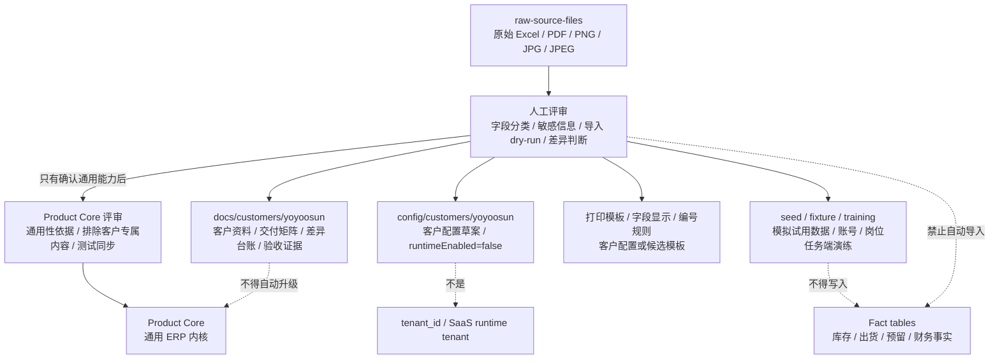

# 永绅 yoyoosun 客户资料 / Yoyoosun Customer Materials

`yoyoosun` 是永绅客户的稳定客户 key。本目录保存该客户专属原始资料、导入准备、客户差异、客户配置草案、试用说明和历史 evidence 索引；它不是 Product Core，也不是 SaaS tenant。

## 先读哪几份 / Reader Paths

| 任务 | 先读 | 再核对 |
| --- | --- | --- |
| 判断客户交付状态 | `客户交付矩阵.md` | `docs/当前真源与交接顺序.md`、部署 evidence、当前代码和测试 |
| 判断客户差异归属 | `客户差异台账.md` | `docs/product/客户差异策略.md`、Product Core 评审 |
| 判断 Excel 字段是否进 Product Core | `Excel字段产品核心映射评审.md` | `source-manifest.json`、当前代码、migration 和测试 |
| 做导入 dry-run / freeze | `导入策略.md`、`导入试跑工具说明.md` | `source-manifest.json`、`来源快照冻结.md`、`真实试跑证据.md`、导入脚本测试 |
| 准备试用或培训 | `试用培训说明.md`、`试用账号角色菜单核对清单.md`、`试用环境执行手册.md` | 真实环境账号、RBAC、菜单、岗位任务端回归 |
| 查原始资料来源 | `原始客户文件归档评审.md`、`raw-source-files/README.md` | `source-manifest.json`、checksum 和用途分类 |

## 客户投影边界图 / Customer Projection Boundary

这张图回答：客户资料可以流向哪些客户侧文档、配置、模拟和模板候选，什么时候才可能进入 Product Core。

## 文档分组 / Document Groups

| 分组 | 文档 |
| --- | --- |
| 资料入口与线索 | `来源材料.md`、`需求线索.md`、`Excel字段产品核心映射评审.md`、`问题待办.md`、`假设登记.md`、`决策日志.md`、`变更请求流程.md` |
| 客户交付与差异 | `客户交付矩阵.md`、`客户差异台账.md`、`差异登记.md`、`客户配置草案.md` |
| 导入准备 | `导入来源清单.md`、`导入字段分类.md`、`导入待确认队列.md`、`导入验收清单.md`、`导入策略.md`、`导入风险登记.md`、`导入试跑工具说明.md` |
| freeze / dry-run evidence | `source-manifest.json`、`来源快照冻结.md`、`来源快照人工复查清单.md`、`真实试跑证据.md` |
| 试用和培训 | `试用培训说明.md`、`试用账号角色菜单核对清单.md`、`试用环境执行手册.md` |
| 字段和编号确认 | `字段编号确认清单.md`、`字段编号确认结果模板.md` |
| 原始资料 | `raw-source-files/`、`原始客户文件归档评审.md` |
| 历史 evidence | `docs/archive/customer-evidence/yoyoosun/` |

## 真源边界 / Source Boundary

客户资料可以进入客户文档、客户配置草案、模拟 seed、培训验收或模板候选。进入 Product Core 前必须有通用性依据、对应实现评审和测试同步。当前 yoyoosun 没有可直接执行的客户真实数据；真实导入、库存、出货、预留、财务事实、`tenant_id` 或 SaaS runtime tenant 都不能由本目录材料自动生成。

`docs/archive/customer-evidence/yoyoosun/` 只保存历史 evidence：它可以证明当时的发布、模拟或验收记录，不替代当前客户签收、真实导入批准、当前目标环境状态或最新代码验证。

## 更新规则 / Maintenance

新增、删除、重命名本目录长期维护文档，或改变客户交付状态、客户差异分类、导入结论、试用口径时，必须同步检查：

- 本 README。
- `docs/customers/README.md`。
- `docs/文档清单.md`。
- `docs/当前真源与交接顺序.md`。
- 对应 `config/customers/yoyoosun/`、`deployments/yoyoosun/`、导入脚本和测试断言。
