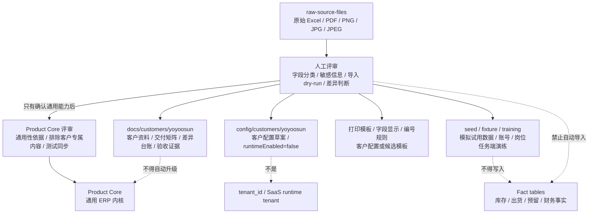

# 永绅 yoyoosun 客户资料 / Yoyoosun Customer Materials

`yoyoosun` 是永绅客户的稳定客户 key，用于保存该客户专属原始资料、归档评审、后续配置草案和交付线索。

## 客户投影边界图 / Customer Projection Boundary

上图只描述 yoyoosun 资料的归属和禁区。客户资料可以进入客户文档、客户配置草案、模拟 seed、培训验收或模板候选；不能因为存在原始资料、原型、截图或 dry-run evidence，就自动进入 Product Core、SaaS tenant、真实导入、库存、出货、预留或财务事实。

## 文件 / Files

| 路径 | 作用 |
| --- | --- |
| `source-materials.md` | 记录永绅 yoyoosun 样本资料类型和用途 |
| `requirement-clues.md` | 按业务域记录需求线索 |
| `assumption-register.md` | 记录尚不能开发成规则的假设 |
| `question-backlog.md` | 用业务人员能看懂的话列待确认问题 |
| `decision-log.md` | 只记录已经确认的决策 |
| `customer-config-draft.md` | 记录永绅 yoyoosun 未来可能的配置项 |
| `delivery-matrix.md` | 记录永绅 yoyoosun 客户交付矩阵 |
| `delta-ledger.md` | 记录永绅 yoyoosun 客户差异台账 |
| `delta-register.md` | 记录客户差异项 |
| `change-request-process.md` | 记录后续需求分类和评审流程 |
| `import-source-inventory.md` | 记录永绅 yoyoosun 导入来源清单和用途分类 |
| `import-field-classification.md` | 记录永绅 yoyoosun 字段分类、可导入候选和禁止自动迁移项 |
| `import-dry-run-plan.md` | 记录永绅 yoyoosun 数据导入 dry-run 阶段设计 |
| `import-unresolved-queue.md` | 记录导入未决队列类型、阻断规则和处理方式 |
| `import-acceptance-checklist.md` | 记录 future import execution 前的验收清单 |
| `import-dry-run-tooling.md` | 记录 dry-run CLI 与 freeze evidence tooling 的用法和边界 |
| `source-snapshot-freeze.md` | 记录 source snapshot freeze metadata、checksum、风险统计和重跑方式 |
| `real-dry-run-evidence.md` | 记录 real dry-run evidence package 摘要和 no-real-import 结论 |
| `source-snapshot-manual-review-checklist.md` | 记录 freeze / dry-run evidence 的人工 review checklist 和 import-not-approved 结论 |
| `import-strategy.md` | 记录永绅 yoyoosun 导入策略和真实导入前置要求 |
| `import-risk-register.md` | 记录永绅 yoyoosun 导入风险登记 |
| `trial-training-note.md` | 记录永绅 yoyoosun 试用培训说明、正式入口和旧入口退出边界 |
| `trial-account-role-menu-checklist.md` | 记录永绅 yoyoosun 试用账号、角色、菜单和岗位任务端核对清单 |
| `trial-environment-runbook.md` | 记录永绅 yoyoosun 目标试用环境账号、RBAC、菜单和岗位任务端核对执行步骤 |
| `phase7-simulated-trial-acceptance.md` | 记录试用模拟数据验收结果、验证命令和不导入真实数据边界 |
| `phase8-target-release-acceptance.md` | 记录业务事实目标环境发布、migration、事实闭环页面验收、内部模拟事实写入验收和 evidence 模板 |
| `phase8-target-release-evidence-2026-06-08.md` | 记录 2026-06-08 业务事实目标环境发布 smoke、migration、试用账号 RBAC、登录态只读 API smoke、内部模拟事实写入闭环和剩余交付确认项 |
| `phase9-target-release-evidence-2026-06-09.md` | 记录 2026-06-09 岗位任务端发布、目标环境 smoke、岗位路由回归和内部模拟 workflow 闭环 |
| `phase10-target-release-evidence-2026-06-09.md` | 记录 2026-06-09 行业模板沉淀、本地模拟验收、目标环境发布和内部工程入口退出客户菜单的证据 |
| `phase11-target-release-evidence-2026-06-09.md` | 记录 2026-06-09 私有化客户包模板、本地模拟验收和目标环境发布证据 |
| `field-numbering-confirmation-checklist.md` | 记录永绅 yoyoosun 字段显示、字段必填和编号规则的客户确认清单 |
| `field-numbering-confirmation-result-template.md` | 记录永绅 yoyoosun 字段编号客户确认结果的回写模板和边界 |
| `raw-source-files/` | 保存永绅 yoyoosun 原始 Excel / PDF / PNG / JPG / JPEG，用于字段、模板、导入、页面和验收溯源 |
| `raw-source-file-archive-review.md` | 记录永绅 yoyoosun 原始客户文件归档评审、用途分类、checksum 和边界 |

## 边界 / Boundary

- 本目录资料只代表永绅 yoyoosun 客户材料，不自动成为 Product Core。
- 不代表 SaaS runtime tenant，不新增 `tenant_id`。
- 不代表真实 import / backfill 已批准。
- 当前没有可直接执行的客户真实数据；试用目标只能一次性使用 `scripts/qa/trial-simulated-data.mjs`、seed、fixture 或手工构造的模拟数据做环境、账号、菜单、V1 页面和岗位任务端演练。
- `phase7-simulated-trial-acceptance.md` 记录本地模拟数据试用已通过；不代表目标客户环境已正式验收，也不代表业务事实层能力已实现。
- `phase8-target-release-acceptance.md` 定义业务事实目标环境发布和内部模拟事实验收闭环；它不代表客户已签收或真实客户数据已导入。
- `phase8-target-release-evidence-2026-06-08.md` 记录业务事实已发布到当前目标环境，并通过发布 smoke、目标试用账号 RBAC 核对、登录态只读 API smoke 和 `SIM-YOYOOSUN-OPFACT` 内部模拟事实写入闭环；客户使用确认属于交付后的业务确认，不作为业务事实完成阻塞。
- `phase9-target-release-evidence-2026-06-09.md` 记录岗位任务端已发布到当前目标环境，并通过目标健康检查、仓库岗位任务端路由 smoke、试用账号 RBAC 核对和 `SIM-YOYOOSUN-MOBILE-WORKFLOW` 内部模拟 workflow 闭环；它不代表客户已签收、真实导入已批准、拍照上传 / 附件服务已交付或出货 / 库存 / 财务事实已自动过账。
- `phase10-target-release-evidence-2026-06-09.md` 记录行业模板沉淀和目标环境发布；`config/industry-templates/plush/templateConfig.mjs` 仍是 `candidate`，不是 runtime loader，不代表 yoyoosun 单客户样本已成为行业默认。
- `phase11-target-release-evidence-2026-06-09.md` 记录私有化客户包模板和目标环境发布；`SIM-PRIVATE-DEPLOYMENT` 只用于本地模拟 evidence，不创建正式客户目录，不代表真实第二客户、多客户 runtime、SaaS、tenant、license 或 billing。
- 模拟数据不代表客户字段已经确认，也不能转写成真实导入、出货、库存或财务事实。
- 不直接写 `business_records`，也不生成库存、出货、财务、委外或采购事实。
- 后续若多个客户进入项目，应继续按 `docs/customers/<customer-key>/` 隔离原始资料和客户差异。
