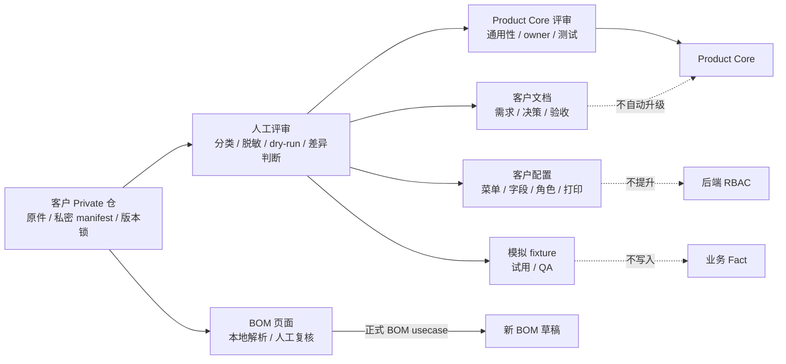

# 永绅 yoyoosun 客户文档 / Yoyoosun Customer Docs

`yoyoosun` 是永绅客户的稳定 customer key，代表单客户私有化实例，不是 SaaS runtime tenant。本目录只保存可以进入 Product Core 的脱敏需求、决策、配置、导入准备、试用和验收说明；真实 Excel、PDF、图片、姓名、签字、私密 manifest 和当前来源 inventory 由客户专属 Private 仓库管理。

## 按任务阅读

| 要做什么 | 先读 | 再核对 |
| --- | --- | --- |
| 与甲方确认岗位、审批、交接、异常和范围 | [甲方角色职责与业务流转确认表](甲方角色职责与业务流转确认表.md) | [决策日志](决策日志.md)、[问题待办](问题待办.md)、[假设登记](假设登记.md) |
| 理解九岗位当前职责和协作 | [角色能力与流程矩阵](角色能力与流程矩阵.md) | `config/customers/yoyoosun/roleFlowMatrix.mjs`、`/__dev/permission-relationships`、当前 RBAC |
| 核对每条运行流程和 Fact 边界 | [流程编排闭环矩阵](流程编排闭环矩阵.md) | 当前代码、schema、migration 和测试 |
| 判断客户能力、差异和交付状态 | [客户交付矩阵](客户交付矩阵.md) | [客户闭环交付验收清单](客户闭环交付验收清单.md)、目标环境 evidence |
| 追溯客户来源线索和已确认生产主线 | [需求线索](需求线索.md)、[决策日志](决策日志.md) D-006 | Private 仓受控来源、角色 / 流程矩阵 |
| 判断 Excel 字段是否进入 Product Core | [Excel 字段产品核心映射评审](Excel字段产品核心映射评审.md) | [导入字段分类](导入字段分类.md)、当前 schema 和测试 |
| 做来源校验、freeze、dry-run 或 BOM Excel 辅助录入 | [导入策略](导入策略.md) | [导入试跑工具说明](导入试跑工具说明.md)、客户 Private 仓、BOM 页面与导入测试 |
| 确认字段显示和编号规则 | [字段编号确认清单](字段编号确认清单.md) | [客户配置草案](客户配置草案.md)、`fieldNumberingConfig.mjs` |
| 准备试用、培训或人工验收 | [试用培训说明](试用培训说明.md)、[试用环境执行手册](试用环境执行手册.md) | [账号角色菜单核对清单](试用账号角色菜单核对清单.md)、[全页面验收清单](试用人员全页面手工验收清单.md) |

## 文档职责

| 分组 | 当前文档 | 权威边界 |
| --- | --- | --- |
| 客户输入与决策 | `需求线索.md`、`决策日志.md`、`问题待办.md`、`假设登记.md`、`变更请求流程.md` | 已确认、未决和推断分开；客户原件不在产品仓 |
| 岗位与流程 | `甲方角色职责与业务流转确认表.md`、`角色能力与流程矩阵.md`、`流程编排闭环矩阵.md` | 甲方确认、业务导航和运行合同分开 |
| 客户差异与交付 | `客户配置草案.md`、`客户交付矩阵.md`、`客户闭环交付验收清单.md` | 配置、产品能力、目标发布和 UAT 分层 |
| 导入准备与 BOM 辅助录入 | `导入策略.md`、`导入试跑工具说明.md`、`导入字段分类.md`、`Excel字段产品核心映射评审.md` | 通用数据仅校验 / extract / freeze / dry-run；BOM `.xlsx` 可经页面复核后新建草稿 |
| 字段与编号 | `字段编号确认清单.md` | 客户确认结果回写配置或问题待办，不直接改变 schema |
| 试用与培训 | `试用培训说明.md`、`试用环境执行手册.md`、`试用账号角色菜单核对清单.md`、`试用人员全页面手工验收清单.md` | 模拟试用和人工检查不等于发布或客户签收 |

历史发布、模拟和验收 evidence 位于 `docs/archive/customer-evidence/yoyoosun/`，只证明当时的固定版本和执行范围。

## 客户资料与产品投影边界

```mermaid
flowchart LR
  private["客户 Private 仓\n原件 / 私密 manifest / 版本锁"] --> review["人工评审\n分类 / 脱敏 / dry-run / 差异判断"]
  review --> docs["客户文档\n需求 / 决策 / 验收"]
  review --> config["客户配置\n菜单 / 字段 / 角色 / 打印"]
  review --> fixture["模拟 fixture\n试用 / QA"]
  review --> gate["Product Core 评审\n通用性 / owner / 测试"]
  private --> bom["BOM 页面\n本地解析 / 人工复核"]
  bom -->|正式 BOM usecase| draft["新 BOM 草稿"]
  gate --> core["Product Core"]
  docs -. 不自动升级 .-> core
  config -. 不提升 .-> rbac["后端 RBAC"]
  fixture -. 不写入 .-> fact["业务 Fact"]
```

客户资料只有在完成通用性和领域边界评审后，才能成为 Product Core 能力。当前没有通用永绅客户数据批量导入；唯一写入窄入口是 BOM 版本页把结构匹配的 `.xlsx` 在本地解析、人工补齐现有主数据后新建 BOM `DRAFT`。它不自动上传原件、创建主数据 / SKU、覆盖或激活 BOM，也不生成库存、质检、生产、出货、预留或财务事实。

Product Core 当前树不保存客户原件和真实 manifest；这不代表既有 Git 历史已经清理，也不代表客户仓远端完整性、产品版本锁、目标发布或客户签收已经完成。当前私有来源和 `product.lock.json` 状态只从客户 Private 仓正式验证记录读取，不在本目录缓存易漂移的提交号、hash 或数量。

## 维护规则

新增、删除、重命名或重新分类本目录长期文档时，同步本 README、`docs/customers/README.md`、`docs/文档清单.md`、引用和相关自动化。客户能力、配置、发布和 UAT 状态发生实质变化时，分别更新对应矩阵，不能用一层 evidence 替代另一层。

真实文件、私密字段、hash、凭据、数据库地址和客户签字不得复制到 Product Core 文档、日志或普通 CI artifact。
