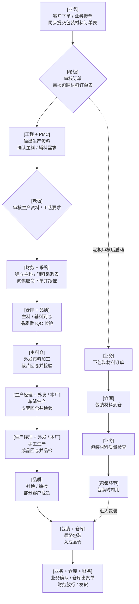

# 甲方正式汇报 V3 逐页解读与现行映射 / Client Formal Report V3 Page-by-page Interpretation

本文集中转写甲方原文件 `plush_factory_formal_report_v3_mobile.pdf` 的 8 页内容，并说明每项内容在当前文档、客户决策、Product Core 和交付证据中的去向。这里的“翻译”是把 PDF 中的流程图、界面示意和实施建议转成可检索的业务描述与现行映射，不是中外文语言翻译。

## 结论先行

1. 本文是该 PDF 在 Product Core 文档中的集中入口；以后不用再从多份 Markdown 反查原稿每一页说了什么。
2. 原稿第 4 页的“老板视角总览流程”已在下文按原图忠实转写；其中只有生产主线及车缝、手工分别决定本厂 / 外发已经进入甲方确认基线，见[决策日志 D-006](决策日志.md)。
3. 原稿的岗位入口、手机任务、高层风险视角已部分进入当前产品；“订单创建后自动生成整棵任务树”“所有模块都有手机端”“扫码已可用”“三期路线照原稿执行”等表述不能作为当前事实。
4. 当前角色、权限与协作以[角色能力与流程矩阵](角色能力与流程矩阵.md)为准；当前运行编排以[流程编排闭环矩阵](流程编排闭环矩阵.md)、代码和测试为准；当前客户交付状态以[客户交付矩阵](客户交付矩阵.md)为准。
5. 本文不复制 PDF 图片、客户私有 manifest 的 hash、访问路径或其他私密字段，也不把原稿中的示意订单、数量、金额和统计值当作客户真实数据。

## 1. 来源身份与权威边界

| 项目 | 记录 |
| --- | --- |
| 原文件 | `plush_factory_formal_report_v3_mobile.pdf` |
| 原稿标题 | 毛绒玩具工厂任务驱动型系统——正式汇报版 V3 手机端增强版 |
| 页数 | 8 页 |
| 私有来源 ID | `yoyoosun-raw-formal-mobile-report-v3` |
| 当前存放 | 客户专属 Private 仓库；Product Core 不保存原件副本 |
| 私有 manifest 用途 | 客户汇报、移动端观感和交付线索；不作为产品实现真源 |
| 结构化处理 | 不生成结构化导入行；本文只做人审后的脱敏转写 |

本文只回答“原稿表达了什么、后来被放到哪里、当前如何理解”。不同结论必须回到各自真源：

| 要回答的问题 | 当前真源 |
| --- | --- |
| PDF 原来画了什么、写了什么 | 本文 |
| 哪些事项已由甲方确认 | [决策日志](决策日志.md)、[甲方角色职责与业务流转确认表](甲方角色职责与业务流转确认表.md)及客户专属 Private 受控确认记录 |
| 九岗位当前能看什么、做什么 | [角色能力与流程矩阵](角色能力与流程矩阵.md) |
| 当前 ProcessRuntime 和领域事实如何衔接 | [流程编排闭环矩阵](流程编排闭环矩阵.md)、当前代码与测试 |
| 手机端当前实际工作流 | [移动端岗位任务页改版](../../product/移动端岗位任务页改版.md) |
| 当前路线与里程碑 | [产品完成路线图](../../product/产品完成路线图.md) |
| yoyoosun 当前可演示、可试用、未发布或待 UAT 状态 | [客户交付矩阵](客户交付矩阵.md) |

## 2. 此前已经分散转写到哪里

在本文建立前，PDF 内容不是完全缺失，而是按不同权威职责分散在以下文档中：

| 已有文档 | 已承接的 PDF 内容 | 当前职责 |
| --- | --- | --- |
| [需求线索](需求线索.md) | 第 4 页生产与外发主线摘要 | 只保留来源线索和已确认业务基线 |
| [决策日志](决策日志.md) | 第 4 页经甲方复核后的生产顺序及内外发决定 | 记录已确认决策，不记录全部原稿画法 |
| [角色能力与流程矩阵](角色能力与流程矩阵.md) | 第 3—7 页岗位入口、角色职责、老板 / PMC / 生产经理视角，以及原图与当前系统差异 | 九岗位当前能力、权限、协作和缺口的主手册 |
| [流程编排闭环矩阵](流程编排闭环矩阵.md) | 第 4 页订单、工程、PMC、采购、生产、质检、出货在当前运行时的真实承接 | ProcessRuntime、Source Document 与 Fact 分层真源 |
| [移动端岗位任务页改版](../../product/移动端岗位任务页改版.md) | 第 3、5、6、7、8 页的手机高频任务方向 | 当前移动岗位任务的列表、详情、处理、回执和权限边界 |
| [产品完成路线图](../../product/产品完成路线图.md) | 第 8 页的实施阶段和长期能力方向 | 当前正式产品路线；不沿用原稿三期作为执行阶段 |
| [客户交付矩阵](客户交付矩阵.md) | 第 3—8 页能力在 yoyoosun 的可试用、部分、延期和 UAT 状态 | 客户能力、交付状态和差异分类 |
| [毛绒玩具 ERP 从 0 到 1 重构方案](../../reference/第一次20260519/毛绒玩具ERP从0到1重构方案.md)、[ERP 产品化架构重构方案](../../reference/第一次20260519/ERP产品化架构重构方案.md) | 早期任务驱动、岗位入口、手机端和阶段规划讨论 | `Reference Only`；不能覆盖现行产品、代码或交付真源 |

## 3. 逐页解读与当前映射

### 第 1 页：封面与使用场景

原稿把项目定位为“毛绒玩具工厂任务驱动型系统”，版本为“正式汇报版 V3 手机端增强版”，目标用途是老板汇报、部门沟通和需求评审。

当前理解：

- “任务驱动”已经成为产品交互方向，但必须由真实 Source Document、领域动作和注册 ProcessRuntime 产生可追溯任务，不能由页面或任意订单创建动作补造任务树。
- “正式汇报版”描述的是这份 PDF 的汇报用途，不表示当前系统已经正式发布、交付或通过甲方 UAT。
- “手机端增强版”是设计输入；当前实际手机能力只以移动岗位任务文档、当前代码、测试和目标环境证据为准。

当前落点：[零到一产品架构](../../product/零到一产品架构.md)、[移动端岗位任务页改版](../../product/移动端岗位任务页改版.md)、[客户交付矩阵](客户交付矩阵.md)。

### 第 2 页：目录

原稿分为四部分：

1. 项目定位与多端策略。
2. 老板视角总览流程。
3. 岗位入口与手机端示意。
4. 管理价值与实施建议。

这四部分在当前文档体系中分别由产品架构、角色 / 流程矩阵、移动岗位任务规范和产品路线图承接，不再由一份汇报 PDF 同时充当需求、实现和交付真源。

### 第 3 页：项目定位与多端策略

#### 3.1 原稿文字

| 原稿原则 | 原稿说明 | 当前处理 |
| --- | --- | --- |
| 岗位入口 | 每个职能有自己的入口，系统不靠复杂菜单驱动 | 已吸收为岗位入口、RBAC、客户配置和常用 / 更多功能投影；具体入口以 effective session 和当前角色矩阵为准 |
| 任务驱动 | 订单创建后系统自动生成任务树 | 已收窄：只有正式来源动作和注册流程会生成受控任务；不是所有订单创建都自动生成整棵任务树 |
| 桌面端 + 手机端 | 所有模块都有手机端方案，手机端负责移动场景下的高频任务 | 已收窄：桌面承接完整业务页面，手机端优先承接高频 Workflow 协同任务；不复制所有模块 |
| 安全排版 | 图完整展示，表格跨页展示，不断层、不溢出 | 属于汇报材料排版目标；不构成 ERP 运行时业务能力 |

#### 3.2 原稿画面

第 3 页把桌面端场景概括为业务、工程、PMC、财务 / 采购、仓库、品质等职能入口，把手机端场景概括为业务、老板、PMC、仓库、品质和生产经理的高频工作。它表达的是“岗位各看各的工作、移动端处理现场高频事项”，不是当前页面清单或权限合同。

当前落点：

- 岗位、页面、权限和交接：[角色能力与流程矩阵](角色能力与流程矩阵.md)。
- 手机任务列表、详情、处理和可信回执：[移动端岗位任务页改版](../../product/移动端岗位任务页改版.md)。
- 客户菜单、岗位和动作投影：当前客户配置、RBAC、effective session、代码与测试。

### 第 4 页：老板视角总览流程

第 4 页用于让管理层快速理解审核、采购、外发、品质、包装和出货。下图是对原稿的忠实转写，不代表每条边已经确认或进入当前运行时。

原稿另列出三类贯穿职责：

| 岗位 | 原稿职责 |
| --- | --- |
| PMC | 全流程跟单、齐套跟进、交期跟进 |
| 生产经理 | 决定车缝 / 手工内外发，决定返工方向 |
| 品质 | IQC、外发 QC、成品检验，控制批量异常 |

#### 3.4.1 已确认的业务基线

甲方当前确认的是生产核心顺序：

`布料加工 → 裁片检验 → 车缝 → 皮套检验 → 手工 → 成品检验 → 针检 → 抽检 → 条件性客户验货 → 包装 → 成品入库`

同时确认：

- 车缝在手工之前，两者不是二选一。
- 车缝和手工分别由生产经理决定本厂或外发。

确认来源与影响见[决策日志 D-006、D-007](决策日志.md)。

#### 3.4.2 仍不能按原图直接宣称已实现的内容

- 原图中的 PMC 前置跟进和老板生产资料二次审核，目前不是 `sales_order_acceptance` 的独立运行节点。
- 原图未画出审核退回、阻塞、重提、版本和幂等语义，不能从直线箭头推断。
- “财务 + 采购”是永绅同一人员可能持有多岗位能力的客户投影，不表示 Product Core 合并两个领域职责。
- 包装材料“业务质量检查”仍需区分业务对版 / 外观确认与品质正式 IQC。
- 包装材料专用采购、领用、耗用、装箱和成品入库事实链只有部分能力，不能用虚线支线冒充闭环。
- 生产经理决定返工方向不等于返工事实已执行；品质任务完成也不等于 Quality Fact 已写入。
- 财务放行只形成 Shipment 版本化门禁；仓库仍须显式执行真实出货，Workflow task done 不等于库存 OUT、应收或发票事实。

当前落点：

- 原图与当前订单节点差异、包材并行线：[角色能力与流程矩阵](角色能力与流程矩阵.md)第 7.2 节。
- 当前生产固定路线、WIP、内外发与质量关口：[流程编排闭环矩阵](流程编排闭环矩阵.md)和[客户交付矩阵](客户交付矩阵.md)。
- 已确认高层顺序：[需求线索](需求线索.md)、[决策日志](决策日志.md)。

### 第 5 页：业务岗位桌面 / 手机示意

原稿画面以旧版业务工作台和手机页面表达以下方向：

- 桌面端查看业务概览、待办和关联订单进度。
- 手机端查看提醒、任务和快捷动作。
- 业务岗位从自己的入口处理事项，不先进入复杂模块树。

当前解释：

- 画面中的卡片、指标、订单号、数量和布局都是示意，不是当前 UI 规格或真实数据。
- 当前销售 / 业务岗位的页面、动作与交接以角色矩阵、客户配置和 RBAC 为准。
- 当前手机端只处理服务端授权的岗位任务，并区分只读、催办和可办理动作；不因旧图出现快捷按钮就授予权限。

当前落点：[角色能力与流程矩阵](角色能力与流程矩阵.md)的业务岗位章节、[移动端岗位任务页改版](../../product/移动端岗位任务页改版.md)。

### 第 6 页：老板桌面 / 手机示意

原稿画面以旧版老板工作台和手机页面表达：

- 查看待审批事项。
- 查看订单总体进度和高风险订单。
- 在手机端快速掌握摘要并处理高频审批。

当前解释：

- 老板的监督视角和可操作权限必须分开。能查看跨岗风险不等于能代替业务、仓库、品质、财务或生产写领域事实。
- 当前审批必须命中登录态、账号状态、RBAC、冻结 revision、责任池、owner / assignee、任务状态 / version、幂等和审计门禁。
- 原稿中的统计数字和风险订单只是视觉示例；当前没有由此 PDF 定义的老板 KPI 真源。

当前落点：[角色能力与流程矩阵](角色能力与流程矩阵.md)的老板章节、[通知预警催办与升级第一版](../../workflow/通知预警催办与升级第一版.md)、当前任务与审批代码 / 测试。

### 第 7 页：PMC 与生产经理桌面 / 手机示意

原稿画面表达两组岗位视角：

| 岗位 | 原稿画面方向 | 当前解释 |
| --- | --- | --- |
| PMC | 订单阶段分布、关键预警、卡点订单、手机摘要和催办 | 当前可由岗位任务、风险 / 超时筛选、流程上下文和通知催办承接；旧图中的专用统计看板不是已交付 KPI |
| 生产经理 | 生产任务、车缝 / 手工负荷、返工异常、手机处理 | 当前生产订单、固定路线、WIP、内外发和生产异常有正式分层；任务决定不替代生产、库存或返工 Fact |

原稿中的负荷数、异常数、订单编号和图表均为示意值。当前岗位能力、页面和流程状态仍分别回到角色矩阵、流程矩阵、Product Core 代码和测试核对。

### 第 8 页：管理价值与实施建议

#### 3.8.1 管理价值

| 原稿对象 | 原稿价值表述 | 当前状态与边界 |
| --- | --- | --- |
| 老板 | 审批更快，风险更早暴露 | 已有审批任务、风险 / 超时和通知催办方向；是否真正提速需运行数据和客户使用验证，不能由功能存在推断 |
| PMC | 可随时用手机看卡点和催办，不必守在电脑前 | 移动岗位任务支持风险、超时、催办等高频协同；并非原稿专用 PMC 看板全部实现 |
| 生产经理 | 可在车间或外部直接处理决策和返工 | 已有移动任务与生产异常分层；具体生产 / 返工事实仍由领域 usecase 显式执行 |
| 仓库 / 品质 | 扫码、拍照、录入不良在现场完成，减少回填 | 附件和现场留痕已有部分能力，不良录入有正式质量路径；扫码尚未交付，拍照直传、设备和断网恢复仍需单独评审 |

#### 3.8.2 原稿三期建议与当前去向

| 原稿阶段 | 原稿重点 | 当前处理 |
| --- | --- | --- |
| 第一期 | 打通订单到出货主链路，同步建设手机端任务处理 | 方向已被拆入 Source Document、ProcessRuntime、Fact、RBAC、移动岗位任务和分层验收，不把整条链一次性写成“已完成” |
| 第二期 | 异常中心、返工中心、管理看板 | 异常和返工已按正式领域边界分切实现；不存在由原稿直接定义的单一万能异常中心，管理看板状态按当前路线图和能力台账核对 |
| 第三期 | 成本、供应商绩效、外发工厂绩效 | 仍属后续候选 / 延期范围，不能作为当前交付能力 |

当前正式路线使用[产品完成路线图](../../product/产品完成路线图.md)及产品能力台账，不继续以原稿“第一期 / 第二期 / 第三期”作为当前代码、测试或交付编号。

## 4. 原稿表达与现行结论对照

| 原稿表达 | 现行结论 | 状态 | 主要落点 |
| --- | --- | --- | --- |
| 每个职能有自己的入口 | 岗位入口由客户配置、RBAC、effective session 和角色投影共同决定 | 已吸收，仍需逐环境验证 | 角色矩阵、客户交付矩阵 |
| 订单创建后自动生成任务树 | 只有正式来源动作和注册 ProcessRuntime 生成受控任务 | 原稿表述已收窄 | 流程矩阵、代码和测试 |
| 所有模块都有手机端方案 | 手机优先承接高频岗位协同任务，不复制桌面全部模块 | 原稿表述已收窄 | 移动岗位任务文档 |
| 老板看审批、进度和风险 | 监督可见性与领域写权限分离 | 部分承接 | 角色矩阵、通知催办 |
| PMC 看卡点并催办 | 当前岗位任务、流程上下文、风险 / 超时和催办承接 | 部分承接 | 移动岗位任务、通知催办 |
| 生产经理决定车缝 / 手工本厂或外发 | 两道工序分别决定内外发，且车缝先于手工 | 甲方已确认，Product Core 已有固定路线映射 | 决策日志、流程矩阵 |
| 包材下单、到仓、检查、包装领用 | 必须拆分业务确认、采购 / 收货、Quality Fact、领用 / 耗用和包装事实 | 部分能力，专用链未闭环 | 角色矩阵、客户交付矩阵 |
| 财务放行后发货 | 财务只写 Shipment 门禁，仓库显式发货才形成 SHIPPED 和库存 OUT | 已按领域边界重述 | 决策日志、流程矩阵 |
| 仓库 / 品质现场扫码拍照 | 附件 / 留痕部分承接；扫码未交付 | 部分 / 延期 | 客户交付矩阵、产品路线图 |
| 成本、供应商和外发厂绩效 | 需要正式指标口径、数据真源和验收后另行建设 | 延期 | 产品路线图、后续 KPI 评审 |

## 5. 明确缺口与不采纳项

以下内容继续保留为可追溯差异，不能因建立本文而改写为已完成：

1. PMC 前置评审和老板生产资料二次审核尚未成为当前订单流程的独立节点。
2. 包材专用采购、业务对版、正式 IQC、领用 / 耗用、装箱和入库还没有形成一条客户专用完整事实链。
3. “所有模块手机化”不采纳；当前只建设适合移动场景的高频任务和必要业务入口。
4. “订单一创建就生成整棵任务树”不采纳；正式任务必须绑定来源动作、注册流程、责任、权限、状态、版本和幂等。
5. 第 5—7 页旧界面只作视觉与岗位方向线索，不作为现行 UI、字段、指标、数量或权限真源。
6. 扫码尚未交付；拍照 / 附件、设备适配、弱网和断网恢复不能从原稿推定已完成。
7. 成本、供应商绩效和外发厂绩效尚无由本 PDF 确认的正式指标、数据口径和交付证据。
8. 原稿流程图没有表达全部异常、退回、取消、冲正和 Fact 边界；当前实现不得为了“还原箭头”绕过领域 usecase。

## 6. 维护规则

1. 原 PDF 页面内容不变时，只在本文更新“当前映射”，不要在多份文档重复转写整页内容。
2. 甲方新确认事项进入[决策日志](决策日志.md)；未决事项进入[问题待办](问题待办.md)；推断进入[假设登记](假设登记.md)。
3. 角色、权限或岗位交接变化更新[角色能力与流程矩阵](角色能力与流程矩阵.md)；运行节点或 Fact 边界变化更新[流程编排闭环矩阵](流程编排闭环矩阵.md)及代码 / 测试。
4. 客户可试用、已发布、被阻塞或 UAT 状态变化更新[客户交付矩阵](客户交付矩阵.md)，不能只改本文。
5. 若 Private 仓库出现替代 V3 的新正式版本，应先核对 manifest 和替代关系，再新增或重命名对应集中解读；不得静默把新页内容覆盖到 V3 名下。
6. Product Core 文档不得复制客户私有 hash、访问凭据、真实姓名、签字、客户真实订单或其他敏感原件内容。
