# 永绅角色、权限与协作流程手册 / Yoyoosun Role, Permission and Collaboration Handbook

> 内部技术手册：按 Private manifest、代码、migration、配置和测试核对岗位、页面、责任池与差异；不作为甲方签认或发布证明。Private 版本只以 `product.lock.json` 和校验为准，不缓存提交号。

| 我想先看 | 入口 | 适合谁 |
| --- | --- | --- |
| 与甲方当面确认职责、审批、交接和本期范围 | [甲方角色职责与业务流转确认表](甲方角色职责与业务流转确认表.md) | 甲方岗位代表、项目负责人 |
| 每个岗位的全部权限、页面、协作与流程索引 | [第 5 章：九个业务岗位](#role-guide) | 岗位负责人、实施、培训 |
| 全链图、内外发、返工、出货与事实边界 | [第 7 章：端到端协作流程](#flow-guide) | 业务负责人、研发、测试 |
| F01–F22 每条流程的状态与本地验证 | [第 8 章：逐流程状态与本地验证](#flow-catalog) | 测试、交付、审查 |
| 当前不能宣称完成的事项 | [第 11 章：当前缺口](#known-gaps) | 项目经理、甲方 |
| 验证层级、证据登记与停止条件 | [第 13 章：验证矩阵](#verification) | QA、发布负责人 |

## 1. 一页结论 / Executive Summary

### 1.1 现在可以确认什么

| 问题 | 当前结论 | 证据等级 |
| --- | --- | --- |
| 永绅有哪些业务岗位？ | 跟踪配置有 9 个：销售、老板、工程、PMC、采购、仓库、品质、财务、生产 / 委外。 | 配置真源 |
| 永绅岗位权限是否已经在线生效？ | **必须按版本回答**。本地 fresh 环境已读回 9 岗位；133 `customer-trial-133` 有较早固定 V5 的配置激活和岗位 / 页面技术 smoke，但当前仓库后来合入的审批与异常流尚未整体重发，不能用旧目标证据证明当前 HEAD。 | 本地 runtime readback + 固定目标版本证据 |
| 每个岗位的所有权限是否列全？ | 是。第 5 章逐岗位列出 `roleFlowMatrix.mjs` 中全部精确 permission key、页面、责任池和协作交接，不使用 `sales_order.*` 之类通配缩写。 | 配置真源 + 同步测试 |
| 甲方流程图是否纳入？ | 是。订单、资料、采购、包材并行、裁片、车缝 / 手工内外发、分段质检、返工、客户验货、包装、成品入库、出货和财务放行均在第 7 章展开。 | 客户原件人工复核 |
| Product Core 是否全部实现？ | 否。销售、采购、库存、生产 WIP、质检、异常处置、委外、出货、来源财务、首次 IQC 精确行部分退厂 / 补换、真实收付款及多单核销已有本地能力；包材专用领用 / 耗用、强制出货财务门禁、付款申请审批、银行直连、总账和税控仍有缺口。 | 代码 / 测试真源 |
| 本地绿色是否等于永绅交付？ | 否。还要分别核对永绅角色 / 菜单配置、固定目标版本的 migration 与 readback、真实岗位 smoke、打印实物和客户 UAT。当前财务岗位尚未获得收付款页面 / 权限，甲方 UAT 未签收。 | 交付边界 |

### 1.2 最重要的六条边界

| # | 必须记住 |
| ---: | --- |
| 1 | **Workflow task done ≠ Fact posted**：任务完成不能代写库存、质检、出货、应收、应付、发票或付款事实。 |
| 2 | **`shipping_released` ≠ `SHIPPED`**：放行任务完成后，仓库仍要执行正式出货 usecase，才扣减库存。 |
| 3 | **WIP Accepted ≠ 成品入库**：包装批次完成后仍要显式创建并过账 `PRODUCTION_COMPLETION`。 |
| 4 | **采购批准 ≠ 到货入库 / 应付**：到货草稿、逐行 IQC、全部合格或让步接收、正式 POSTED 是独立链路。 |
| 5 | **客户图 ≠ runtime**：甲方原图用于确定业务职责；是否可执行仍以代码、active revision、数据库和测试为准。 |
| 6 | **菜单可见 ≠ 有权办理**：后端权限、客户 entitlement、模块、责任池、assignee、状态和版本必须同时通过。 |

### 1.3 状态图例

| 标记 | 含义 | 可以写成 |
| --- | --- | --- |
| `客户原件` | 甲方原始流程图、报告或表单明确出现；不自动等于逐项签收 | “客户原件直读 / 多源线索” |
| `本地已实现` | 当前 Product Core 代码有正式 usecase / repository / API，并有对应自动化 | “Product Core 本地能力已实现” |
| `本地部分` | 只有部分节点、后端入口或本地路线，页面 / 目标证据不完整 | “部分实现”，不得简称“已上线” |
| `backend-only` | 后端命令 / usecase 已有，但正式业务页面或岗位入口不完整 | “后端已有，页面未闭环” |
| `runtime_enabled_partial` | ProcessRuntime 只有部分节点或入口可运行 | “局部 runtime”，不得省略 `partial` |
| `跟踪预览` | 永绅客户包中已声明，但 `preview_only` 或 `runtimeEnabled=false` | “配置草案 / 预览” |
| `缺口` | 当前没有完整正式链路 | “待设计 / 待实现 / 待确认” |
| `目标未核验` | 当前所述能力没有绑定同一固定 release、migration、active revision、真实账号和读回证据；较早版本绿色不能替代 | “当前版本未核验”，不得写“已交付” |
| `UAT 未签收` | 没有甲方按验收清单执行并签收 | “待客户验收” |

### 1.4 十个高频术语

| 术语 | 本文含义 |
| --- | --- |
| Source Document | 销售、采购、生产、委外、出货等来源单据；表达业务意图，不等于已过账事实。 |
| Workflow task | 人与人的待办、审批、退回、催办和交接；完成任务不自动写 Fact。 |
| ProcessRuntime | 按注册流程执行节点；只有白名单 `domain_command` 才能调用同一个领域 usecase。 |
| Fact | 质检、库存、生产、出货、应收 / 应付 / 发票等已由领域 usecase 校验和记录的事实。 |
| entitlement | 客户 revision 对角色 permission key 的允许上限；只能收窄数据库权限，不能提权。 |
| active revision | 目标环境当前激活且不可变的客户配置版本；本文的 `draft` 不是 active revision。 |
| readback | 从目标 API / 数据库 / effective session 重新读回实际生效结果，不接受只看配置文件。 |
| smoke | 用真实岗位账号走最小可执行路径，确认菜单、权限、责任池和动作确实可用。 |
| backend-only | 后端能力存在，但正式岗位 Web 入口或端到端交接尚未闭环。 |
| UAT | 甲方按约定数据、角色、流程和实物输出执行并签收；本地自动化不能替代。 |

## 2. 真源、阅读顺序与证据边界

### 2.1 证据如何汇合

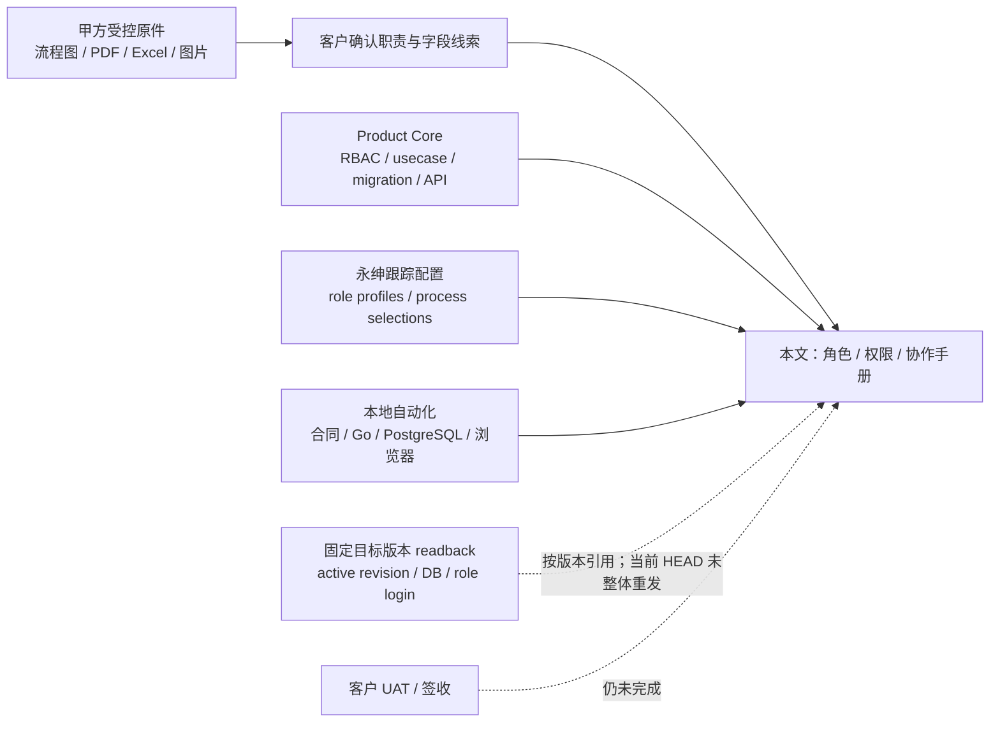

### 2.2 真源优先级

| 优先级 | 真源 | 本文用法 | 不能替代 |
| ---: | --- | --- | --- |
| 1 | `server/internal/biz/rbac.go`、领域 usecase、repository、migration、API | Product Core 权限、状态、Fact 与可执行动作 | 目标环境实际角色组合 |
| 2 | `config/customers/yoyoosun/roleFlowMatrix.mjs` | 永绅 9 岗位精确 entitlement、菜单和职责标签 | 已 publish / activate 的 runtime |
| 3 | `config/customers/yoyoosun/customerPackage.mjs`、`flowOrchestrationCoverage.mjs` | 预览工作流、已选 ProcessRuntime、覆盖层级 | 目标 active revision |
| 4 | `docs/workflow/业务与协同流程地图.md`、架构 / 产品正式文档 | 跨域主链、Workflow / Fact 边界 | 比代码更新的状态 |
| 5 | 客户专属 Private 仓库 17 份受控原件及 manifest | 客户称谓、节点、箭头、表单字段和现场责任 | 自动导入、runtime 或事实数据 |
| 6 | 当前自动化测试及执行日志 | 当前工作树对应层级的可重复证据 | 部署、真实账号、客户 UAT |

### 2.3 客户证据等级与系统状态必须分列

| 客户证据等级 | 可以表达什么 | 不可越界 |
| --- | --- | --- |
| 甲方已确认 | 高层生产顺序；车缝完成并检验后进入手工；车缝、手工分别由生产经理决定本厂 / 外发；按来源单据记录粗略不良率。 | 不自动扩成每个箭头都已签收。 |
| 客户原件直读 | 角色流程图节点 / 箭头、合同字段 / 条款、Excel 字段 / 工艺 / 品质 / 包装说明、移动汇总字段。 | 不自动证明 Product Core 已实现。 |
| 多源交叉线索 | 销售负责包材和出货确认、仓库收发、品质逐关检验、采购跟催、财务放行。 | 仍需客户确认具体系统节点和责任。 |
| Product Core 映射 | 九个内部角色、精确权限、固定 WIP 路线、ProcessRuntime、Workflow / Fact 边界。 | 系统设计不能倒写成甲方原话。 |
| 推断 / 待确认 | 包装部 / 外发部是否独立登录；板房归属；审核签字人；外部门户；哪些退回箭头必须系统化。 | 保持待确认，不擅自造角色或 runtime。 |

每个流程还要单独写系统状态：`本地已实现 / 本地部分 / backend-only / preview_only / 缺口 / 目标未核验 / UAT 未签收`。客户说过与系统做到是两条独立证据轴。

### 2.4 当前版本仍不能宣称的事

| 未完成 | 原因 / 后续证据 |
| --- | --- |
| 把 133 较早 V5 证据当成当前 HEAD 全能力 | 133 技术试用已有固定版本证据；当前审批、异常处置和收付款切片仍需按新 release / migration 重新发布与读回。 |
| 把 Product Core 能力自动授予永绅岗位 | 当前永绅财务角色没有 `finance.payment.*` 或 `finance-payments`；必须先评审并同步角色配置。 |
| 写入真实客户数据或业务 Fact | Private 原件只读；当前没有获批的真实导入。 |
| 把技术试用写成甲方验收 | 固定版本 smoke、打印实物和客户岗位 UAT / 签收是独立证据。 |

## 3. 甲方称谓与系统岗位映射

甲方原图比系统 RBAC 更接近现场组织。下表避免把“部门、仓库、外部参与者”误造为新角色。

| 甲方称谓 | 当前系统落点 | 是否独立 RBAC 角色 | 处理原则 |
| --- | --- | --- | --- |
| 业务 | 销售 `sales` | 是 | Product Core 内置名称曾使用“业务”，永绅对外统一写“销售（业务）”。 |
| 老板 | 老板 `boss` | 是 | 审批 / 退回，不直接代写领域事实。 |
| 工程 | 工程 `engineering` | 是 | 产品、SKU、工序、BOM 与作业资料。 |
| 板房 | 倾向工程 `engineering` 的子职责 | 否 / 待确认 | 原件出现该称谓，但没有独立 Product Core 角色；正式归属待甲方确认。 |
| PMC | PMC `pmc` | 是 | 交期、齐套、排程、进度、风险。 |
| 财务制作采购合同 | 同账号叠加 `finance + purchase` | 组合角色 | 使用 `finance_purchase_contract_operator`，不把采购权限塞进核心财务角色。 |
| 采购 | 采购 `purchase` | 是 | 供应商、采购源单、合同、跟催。 |
| 主料仓 / 成品仓 / 其他仓 | 仓库 `warehouse` + 仓库主数据 | 否 | 仓库名称是业务对象，不等于数据权限角色；库存与仓库列表已由 `role_data_scopes` 的 `ALL / ASSIGNED / NONE` 在服务端限制。 |
| 生产经理 | 生产 `production`；计划边界归 PMC | 是（映射后） | 生产负责 WIP 内外发、移交、返工；PMC 负责计划和风险。 |
| 外发部 | 生产 / 委外 `production` | 否 | 当前由同一角色处理委外订单和 WIP 外发，不另造“外发部”角色。 |
| 包装部 | 销售 + 生产 + 品质 + 仓库的协作切片 | 否 | 销售确认包材版本、生产执行包装、品质守关、仓库入库 / 出货。 |
| 驻厂 / 供应商 QC | 外部协作参与者 | 否 | 当前没有供应商门户或外部账号；系统事实由内部品质岗位办理。 |
| 客户验货员 | 外部协作参与者 | 否 | 只在条件性客户验货质量关口表达结果；当前没有客户门户角色。 |
| 系统管理员 / 调试员 | `admin` / `debug_operator` | 控制角色 | 与 9 个业务岗位分区，不参与普通业务事实流。 |

原件还出现下列外部或身份待定参与者。它们必须先映射到已有角色或业务对象，不能仅凭称谓新建 RBAC 角色。

| 原件称谓 | 当前落点 | 系统办理边界 |
| --- | --- | --- |
| 审核人 / 签字人 | 按具体单据映射 boss、来源岗位或具名 actor；最终归属待甲方确认 | 不能用一个通用“审核人”绕过来源单据权限和状态。 |
| 供应商 / 供货方 | Supplier 主数据 + 外部参与者 | 当前无供应商登录门户；采购下单，内部品质记录 IQC。 |
| 加工方 / 加工厂 | OutsourcingOrder 的供应商 / 加工方 | 当前无外协登录角色；production 办理委外源单、发料与回货。 |
| 公司对接人 / 联系人 | Contact 主数据，归属客户或供应商 | 联系人不是系统账号，也不天然拥有流程权限。 |
| 本厂 | WIP 执行模式 `IN_HOUSE` | 表示加工地点 / 模式，不是新角色；production 在系统内办理。 |

## 4. 权限如何真正生效

### 4.1 权限交集

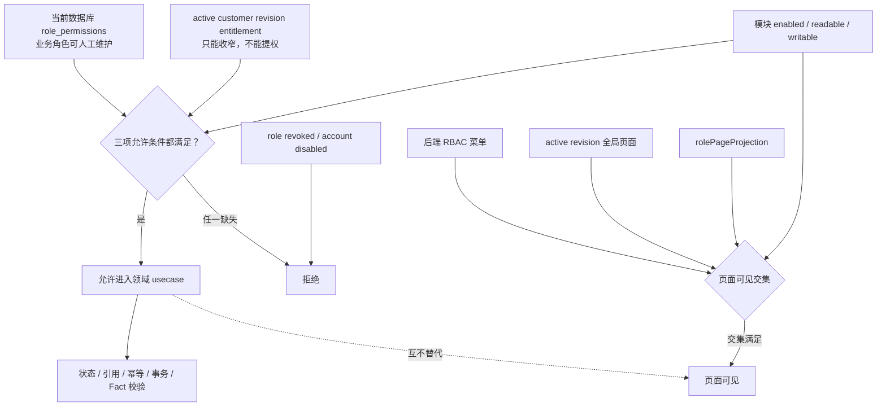

实际业务动作可简写为：

```text
当前数据库角色权限
∩ active customer revision entitlement
∩ 模块状态
且账号启用、角色未撤销
```

Workflow 办理还要继续满足：责任池 / `owner_role_key`、`assignee_id`、任务状态、动作 permission、任务绑定的 active immutable revision 和并发版本。

### 4.2 三套“权限”不要混用

| 层级 | 当前数量 / 状态 | 本文展示方式 |
| --- | --- | --- |
| Product Core 权限注册表 | 161 个 permission key、11 个内置角色默认组合、31 个后端菜单 | 作为上限和代码默认，不冒充当前数据库值；新增库存作业、客户退货、收付款 / 红冲、品质异常与流程恢复权限按角色最小投影。 |
| 永绅跟踪岗位投影 | 9 个业务岗位、281 条岗位权限分配、119 个去重 permission key | 第 5 章逐项列全；全部应为对应 Product Core 默认角色的子集。 |
| 永绅本地有效权限 | 已在独立 fresh 数据库完成 active revision、9 岗位 JSON-RPC allow / deny、50 个页面和直接路由 smoke | 仅证明当前工作树的本地闭环；不冒充发布环境或客户 UAT。 |
| 永绅目标环境有效权限 | 较早 V5 已读回；当前版未重发 | 仍须另做 effective session + 角色 smoke。 |

> 业务默认 / 自定义角色的数据库选择会保留，启动 seed 不会覆盖；只有 `admin`、`debug_operator` 两个系统角色按代码精确同步。因此“代码默认”“跟踪 entitlement”“目标有效权限”必须分栏。

### 4.3 工作台、任务看板与业务看板

| 入口 | 后端权限 | 永绅岗位投影 | 协作边界 |
| --- | --- | --- | --- |
| 岗位工作台 `global-dashboard` | `erp.workbench.read` + 任务读取 | 9 个业务岗位全部开放 | 我的待办、风险、阻塞、来源单据入口；不自动拥有任务处理动作。 |
| 任务看板 `task-board` | `workflow.task.read` | 9 个业务岗位全部开放 | 仍受责任池、owner、assignee、状态和 active revision 约束。 |
| 业务看板 `business-dashboard` | `erp.business_dashboard.read` + 任务读取 | 老板、PMC | 跨部门汇总；统计读取不授予来源单据编辑权。 |

老板、PMC 额外具备 `workflow.task.supervise`，只扩展 `list_tasks` 与任务看板的跨责任池只读范围，用于查看、跟进和识别卡点。它不授予 `assign / update / complete / approve / reject`，也不绕过任务 owner、assignee、状态、active revision 或任何领域事实 usecase。

原 `erp.dashboard.read` 同时控制岗位工作台与业务看板，已经拆除。升级 migration 只把旧权限持有者迁到 `erp.workbench.read`，并仅为原本持有旧权限的 `boss` / `pmc` 迁入 `erp.business_dashboard.read`；没有旧绑定的自定义选择不会被 seed 擅自恢复。

永绅桌面导航采用 `role_guided` 展示：“看板中心”固定在最前，并按工作台、任务看板、业务看板的顺序仅显示当前已授权看板；“常用工作”最多放 3 个岗位高频业务入口；“岗位使用帮助”和其余已授权低频页面进入可折叠的“更多功能”。这只是视觉分层，不删除 `menuSurfaces`、不改变直接路由权限，也不把参考查询页升级为可办理动作。多岗位账号在 3 个常用业务位内按岗位轮流选取，避免单一岗位占满；完整有效页面权限仍取各岗位的合并，并在帮助页显式切换当前办理岗位。

### 4.4 协作可见不等于数据范围或敏感字段授权

| 能力层 | 当前状态 | 本轮处理 |
| --- | --- | --- |
| 上下游协作页面 | 只给已有后端只读权限支撑的岗位增加入口 | 已进入永绅跟踪投影；详见各岗位页面表。 |
| 仓库 Data Scope | 角色级 `warehouse` 范围支持 `ALL / ASSIGNED / NONE`；缺策略与空 `ASSIGNED` 均按 `NONE` | 库存余额、批次、流水、仓库列表及库存写入在后端强制；本轮不虚构本人、部门或客户集合范围。 |
| 敏感字段 | `field.party_private.read`、`field.sales_commercial.read`、`field.procurement_commercial.read`、`field.finance_settlement.read` | 服务端响应、嵌套来源快照及打印取数前脱敏；页面 read 权限不再自动等于敏感字段权限。 |
| 本人 / 部门 / 客户集合 Data Scope | 当前没有稳定的订单 owner、部门关系或授权客户集合真源 | 明确保留缺口；不做 UI-only 配置，不把自由文本负责人冒充安全边界。 |
| 权限中心最终有效解释 | 后端 `admin.effective_role_access` 统一解释 RBAC、active revision、模块与岗位页面投影；缺 active revision 时 fail-closed | “页面与导航”分开页面可进入与页面内操作，并用同一导航规则预览已保存的看板、常用工作和更多功能位置；未保存勾选不冒充实际导航，也不能替代目标账号实登验收。 |

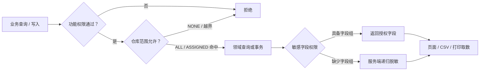

品质 `quality`、生产 `production` 的永绅 entitlement 当前与各自 Product Core 默认角色完全相同；其余 7 个业务岗位被客户层继续收窄。这个比较仍是“代码默认 vs 跟踪预览”，不是目标数据库 readback。

<a id="role-guide"></a>

## 5. 九个业务岗位：全部权限、页面与协作

### 5.0 快速总览

| 岗位 | 权限数 | 责任池 | 主要接收 | 主要交出 | 参与流程索引 | 跟踪预览页面数 |
| --- | ---: | --- | --- | --- | --- | ---: |
| 销售 `sales` | 30 | sales | 客户订单、包装要求 | 审批源单、包材确认、出货确认线索 | F01、F02、F09、F14、F16、F21 | 9 |
| 老板 `boss` | 37 | boss | 销售 / 采购审批；付款仅候选预览 | 通过或退回到下一岗位 | F02、F05、F21；F20 仅 `preview_only` 付款审批需求 | 19 |
| 工程 `engineering` | 23 | engineering | 已审订单 | 产品 / SKU / 材料 / 工序 / BOM 齐套资料 | F02–F05、F21 | 7 |
| PMC `pmc` | 21 | pmc | 订单与工程资料 | 排期、齐套、生产评审、风险 | F02–F05、F09–F14、F21 | 11 |
| 采购 `purchase` | 37 | purchase | 物料需求、审批意见 | 采购源单、合同、到货来源 | F05–F09、F21 | 12 |
| 仓库 `warehouse` | 31 | warehouse | 到货、完工品、放行请求 | 入库、出货、库存事实 | F06–F10、F14–F19、F21；F10 仅实物交接 / 只读 | 9 |
| 品质 `quality` | 27 | quality | 到货、WIP、成品、出货前待检 | 判定、异常、返工 / 放行结果 | F06–F13、F15、F17、F21 | 12 |
| 财务 `finance` | 35 | finance | 合格来源、出货放行申请 | 应收 / 应付 / 发票 / 对账与放行线索 | F15、F17–F21；F05 仅组合账号 | 15 |
| 生产 / 委外 `production` | 39 | production | 排程、物料、品质结果 | WIP 内外发、移交、返工、完工来源 | F04、F09–F15、F17、F21 | 13 |

> “跟踪预览页面 / 职责”来自未激活的永绅配置；流程索引表示本岗位在客户协作链中直接办理、提供前置来源、接收交接或负责进度监督，不代表目标环境已生效。Fxx 的精确交接角色、状态与验证见第 8 章。

### 5.1 销售（sales）

<!-- role-profile:sales:start -->

| 项目 | 内容 |
| --- | --- |
| 跟踪岗位名称 | 销售 |
| 岗位使命 | 维护客户和销售订单；提交订单；只读跟进生产；确认包材版面 / 版本；向仓库提供出货确认线索。 |
| 上游 → 销售 | 客户订单、包装要求、交期要求；财务 / 仓库反馈出货状态。 |
| 销售 → 下游 | 老板审批 → 工程资料 → PMC 评审；包材确认 → 生产包装；销售来源 → 仓库出货。 |
| Product Core 角色 / owner pool | `sales` / `sales` |
| 跟踪预览页面（非 runtime 证明） | `global-dashboard`、`customers`、`sales-orders`、`products`、`production-orders`、`inventory`、`shipments`、`task-board`、`print-center` |
| 跟踪预览职责标签（非 runtime 证明） | `sales_order_approval.sales_submit`、`sales_to_production.source_review`、`production_to_inventory.packaging_material_confirmation` |
| 参与流程 | `F01`、`F02`、`F09`、`F14`、`F16`、`F21` |
| 配置护栏 | 销售可只读核对生产路线并确认包材版面 / 包装版本；不能安排、执行或返工 WIP，库存、质检、出货、应收和发票事实仍由对应领域 usecase 处理。 |

| 权限分组 | 全部精确 permission key（30） |
| --- | --- |
| 看板 / 打印 / 移动 | `erp.workbench.read`<br>`erp.print_template.read`<br>`mobile.sales.access` |
| 客户 / 联系人 | `customer.read`<br>`customer.create`<br>`customer.update`<br>`contact.read`<br>`contact.create`<br>`contact.update`<br>`contact.disable`<br>`contact.set_primary` |
| 敏感字段 | `field.party_private.read`<br>`field.sales_commercial.read` |
| 产品资料只读 | `material.read`<br>`product.read`<br>`product_sku.read` |
| 销售订单 | `sales_order.read`<br>`sales_order.create`<br>`sales_order.update`<br>`sales_order.submit`<br>`sales_order.cancel`<br>`sales_order_item.read` |
| 生产 / 库存 / 出货协作 | `production.wip.read`<br>`production.packaging_material.confirm`<br>`warehouse.inventory.read`<br>`stock.reservation.create`<br>`shipment.read` |
| Workflow | `workflow.task.read`<br>`workflow.task.update`<br>`workflow.task.complete` |

<!-- role-profile:sales:end -->

### 5.2 老板 / 管理审批（boss）

<!-- role-profile:boss:start -->

| 项目 | 内容 |
| --- | --- |
| 跟踪岗位名称 | 老板 / 管理审批 |
| 岗位使命 | 查看经营信息，审批 / 退回销售订单、采购订单及付款候选协同。 |
| 上游 → 老板 | 销售提交订单；采购提交采购单；财务付款放行仅是 `preview_only` 候选结构。 |
| 老板 → 下游 | 订单通过后交工程 / PMC；采购通过后交采购、仓库、品质；退回原岗位修正。 |
| Product Core 角色 / owner pool | `boss` / `boss` |
| 跟踪预览页面（非 runtime 证明） | `global-dashboard`、`business-dashboard`、`task-board`、`sales-orders`、`accessories-purchase`、`processing-contracts`、`inbound`、`quality-inspections`、`inventory`、`production-orders`、`production-scheduling`、`production-progress`、`production-exceptions`、`shipments`、`reconciliation`、`payables`、`receivables`、`invoices`、`print-center` |
| 跟踪预览职责标签（非 runtime 证明） | `sales_order_approval.boss_approval`、`purchase_order_approval.boss_review`、`payment_approval.boss_approval` |
| 参与流程 | `F02`、`F05`、`F21`；`F20` 的付款审批只覆盖协同预览，不会代替独立 PAYMENT 事实动作。 |
| 配置护栏 | 老板角色只做审批 / 退回协同判断，不绕过具体业务 usecase 的状态、引用、幂等和事实写入校验。跨岗位监督仅扩展只读列表 / 看板，不绕过任务归属。 |

| 权限分组 | 全部精确 permission key（37） |
| --- | --- |
| 看板 / 打印 / 移动 | `erp.workbench.read`<br>`erp.business_dashboard.read`<br>`erp.print_template.read`<br>`mobile.boss.access` |
| 业务只读 | `customer.read`<br>`supplier.read`<br>`contact.read`<br>`material.read`<br>`process.read`<br>`product.read`<br>`product_sku.read`<br>`sales_order.read`<br>`sales_order_item.read`<br>`outsourcing.order.read`<br>`outsourcing.fact.read`<br>`production.fact.read`<br>`warehouse.inventory.read`<br>`purchase.order.read`<br>`purchase.receipt.read`<br>`quality.inspection.read`<br>`pmc.plan.read`<br>`pmc.risk.read`<br>`shipment.read`<br>`finance.reconciliation.read`<br>`finance.payable.read`<br>`finance.receivable.read`<br>`finance.invoice.read` |
| 敏感字段 | `field.party_private.read`<br>`field.sales_commercial.read`<br>`field.procurement_commercial.read`<br>`field.finance_settlement.read` |
| 采购审批 | `purchase.order.approve` |
| Workflow | `workflow.task.read`<br>`workflow.task.supervise`<br>`workflow.task.update`<br>`workflow.task.approve`<br>`workflow.task.reject` |

<!-- role-profile:boss:end -->

### 5.3 工程（engineering）

<!-- role-profile:engineering:start -->

| 项目 | 内容 |
| --- | --- |
| 跟踪岗位名称 | 工程 |
| 岗位使命 | 维护产品、SKU、工序、BOM 和工程资料，形成可供 PMC / 采购 / 生产使用的技术真源。 |
| 上游 → 工程 | 老板已审订单、客户规格、工程指导图 / 作业要求。 |
| 工程 → 下游 | 激活 BOM、工序与产品资料交 PMC 齐套评审；采购 / 生产读取，不复制派生。 |
| Product Core 角色 / owner pool | `engineering` / `engineering` |
| 跟踪预览页面（非 runtime 证明） | `global-dashboard`、`products`、`materials`、`processes`、`material-bom`、`task-board`、`print-center` |
| 跟踪预览职责标签（非 runtime 证明） | `sales_order_approval.engineering_data`、`sales_to_production.engineering_data_ready` |
| 参与流程 | `F02`、`F03`、`F04`、`F05`、`F21` |
| 配置护栏 | 工程补齐产品、SKU、材料、工序、BOM 等资料，不直接生成生产、库存、采购、质检、出货或财务事实。 |

| 权限分组 | 全部精确 permission key（23） |
| --- | --- |
| 看板 / 打印 / 移动 | `erp.workbench.read`<br>`erp.print_template.read`<br>`mobile.engineering.access` |
| 材料 / 工序 | `material.read`<br>`material.create`<br>`material.update`<br>`material.disable`<br>`process.read`<br>`process.create`<br>`process.update` |
| 产品 / SKU | `product.read`<br>`product.create`<br>`product.update`<br>`product_sku.read`<br>`product_sku.create`<br>`product_sku.update` |
| BOM | `bom.read`<br>`bom.create`<br>`bom.update`<br>`bom.activate` |
| Workflow | `workflow.task.read`<br>`workflow.task.update`<br>`workflow.task.complete` |

<!-- role-profile:engineering:end -->

### 5.4 PMC（pmc）

<!-- role-profile:pmc:start -->

| 项目 | 内容 |
| --- | --- |
| 跟踪岗位名称 | PMC |
| 岗位使命 | 订单评审、交期 / 齐套、生产排程、WIP 进度和风险管理。 |
| 上游 → PMC | 销售订单、工程 BOM / 工序资料、生产进度、库存和品质异常。 |
| PMC → 下游 | 生产排程任务、生产评审、风险处置；缺料信息回采购，异常回生产 / 品质。 |
| Product Core 角色 / owner pool | `pmc` / `pmc` |
| 跟踪预览页面（非 runtime 证明） | `global-dashboard`、`business-dashboard`、`products`、`materials`、`processes`、`material-bom`、`production-orders`、`production-scheduling`、`production-progress`、`production-exceptions`、`task-board` |
| 跟踪预览职责标签（非 runtime 证明） | `sales_order_approval.pmc_review`、`sales_to_production.production_review`、`production_to_inventory.wip_progress_review` |
| 参与流程 | `F02`、`F03`、`F04`、`F05`、`F09`、`F10`、`F11`、`F12`、`F13`、`F14`、`F21` |
| 配置护栏 | PMC 负责排期、风险和生产评审，不把计划状态直接写成生产完工、成品入库或出货事实。跨岗位监督仅扩展只读列表 / 看板，不能代其他责任池完成任务。 |

| 权限分组 | 全部精确 permission key（21） |
| --- | --- |
| 看板 / 移动 | `erp.workbench.read`<br>`erp.business_dashboard.read`<br>`mobile.pmc.access` |
| 工程资料只读 | `material.read`<br>`process.read`<br>`product.read`<br>`product_sku.read`<br>`bom.read` |
| 生产只读 | `production.fact.read`<br>`production.wip.read` |
| 计划 / 风险 | `pmc.plan.read`<br>`pmc.plan.create`<br>`pmc.plan.update`<br>`pmc.risk.read`<br>`pmc.risk.handle` |
| Workflow | `workflow.task.read`<br>`workflow.task.supervise`<br>`workflow.task.create`<br>`workflow.task.update`<br>`workflow.task.complete`<br>`workflow.task.reject` |

<!-- role-profile:pmc:end -->

### 5.5 采购（purchase）

<!-- role-profile:purchase:start -->

| 项目 | 内容 |
| --- | --- |
| 跟踪岗位名称 | 采购 |
| 岗位使命 | 维护供应商、采购订单和采购合同，跟催到货并建立采购入库来源草稿。 |
| 上游 → 采购 | 工程 / PMC 物料需求、老板审批意见、品质退货 / 补料反馈。 |
| 采购 → 下游 | 采购源单 / 合同交供应商；到货来源交仓库 / 品质；合格入库来源交财务。 |
| Product Core 角色 / owner pool | `purchase` / `purchase` |
| 跟踪预览页面（非 runtime 证明） | `global-dashboard`、`suppliers`、`materials`、`products`、`processes`、`material-bom`、`inventory`、`accessories-purchase`、`processing-contracts`、`inbound`、`task-board`、`print-center` |
| 跟踪预览职责标签（非 runtime 证明） | `purchase_order_approval.purchase_submit`、`purchase_to_inventory.purchase_source_ready` |
| 参与流程 | `F05`、`F06`、`F07`、`F08`、`F09`、`F21` |
| 打印模板 | `material-purchase-contract` |
| 配置护栏 | 采购可维护采购承诺、供应商和采购合同打印草稿；采购退货与入库调整必须走对应 usecase 的创建、确认、取消生命周期，不能通过任务完成动作直接改库存。 |

| 权限分组 | 全部精确 permission key（37） |
| --- | --- |
| 看板 / 打印 / 移动 | `erp.workbench.read`<br>`erp.print_template.read`<br>`mobile.purchase.access` |
| 供应商 / 联系人 / 工程来源 | `supplier.read`<br>`supplier.create`<br>`supplier.update`<br>`contact.read`<br>`contact.create`<br>`contact.update`<br>`contact.disable`<br>`contact.set_primary`<br>`material.read`<br>`product.read`<br>`product_sku.read`<br>`process.read`<br>`bom.read`<br>`outsourcing.order.read`<br>`outsourcing.fact.read` |
| 敏感字段 | `field.party_private.read`<br>`field.procurement_commercial.read` |
| 采购 | `purchase.order.read`<br>`purchase.order.create`<br>`purchase.order.update`<br>`purchase.receipt.read`<br>`purchase.receipt.create`<br>`purchase.receipt.adjustment.read`<br>`purchase.receipt.adjustment.create`<br>`purchase.receipt.adjustment.post`<br>`purchase.receipt.adjustment.cancel`<br>`purchase.return.read`<br>`purchase.return.create`<br>`purchase.return.post`<br>`purchase.return.cancel` |
| 库存只读 | `warehouse.inventory.read` |
| Workflow | `workflow.task.read`<br>`workflow.task.update`<br>`workflow.task.complete` |

<!-- role-profile:purchase:end -->

### 5.6 仓库（warehouse）

<!-- role-profile:warehouse:start -->

| 项目 | 内容 |
| --- | --- |
| 跟踪岗位名称 | 仓库 |
| 岗位使命 | 收货、入库、出库、出货和库存办理；保管原料、裁片 / 套件和成品。 |
| 上游 → 仓库 | 采购到货、委外回货实物、生产完工、品质判定、财务 / Workflow 出货放行。裁片 / 委外回货的系统登记由 production 办理，warehouse 当前只做实物交接 / 来源只读。 |
| 仓库 → 下游 | 收货来源交品质；正式入库交库存 / 财务；实际出货交财务应收 / 发票。 |
| Product Core 角色 / owner pool | `warehouse` / `warehouse` |
| 跟踪预览页面（非 runtime 证明） | `global-dashboard`、`materials`、`products`、`inventory`、`inbound`、`shipping-release`、`outbound`、`shipments`、`task-board` |
| 跟踪预览职责标签（非 runtime 证明） | `purchase_order_approval.warehouse_prepare`、`finished_goods_delivery.shipment_execution`、`purchase_to_inventory.warehouse_inbound` |
| 参与流程 | `F06`、`F07`、`F08`、`F09`、`F10`（实物交接 / 只读）、`F14`、`F15`、`F16`、`F17`、`F18`、`F19`、`F21` |
| 配置护栏 | 仓库执行入库、退货、入库调整与出货时必须走对应业务 usecase，不通过任务完成动作直接增减库存。当前 entitlement 仍不能办理 WIP / 委外回货登记。 |

| 权限分组 | 全部精确 permission key（31） |
| --- | --- |
| 看板 / 移动 | `erp.workbench.read`<br>`mobile.warehouse.access` |
| 业务来源只读 | `customer.read`<br>`supplier.read`<br>`material.read`<br>`product.read`<br>`product_sku.read`<br>`sales_order.read`<br>`sales_order_item.read` |
| 采购收货异常 | `purchase.receipt.read`<br>`purchase.return.read`<br>`purchase.return.create`<br>`purchase.return.post`<br>`purchase.return.cancel`<br>`purchase.receipt.adjustment.read`<br>`purchase.receipt.adjustment.create`<br>`purchase.receipt.adjustment.post`<br>`purchase.receipt.adjustment.cancel` |
| 仓库 | `warehouse.inventory.read`<br>`warehouse.inbound.read`<br>`warehouse.inbound.confirm`<br>`warehouse.outbound.read`<br>`warehouse.outbound.confirm` |
| 出货 | `shipment.read`<br>`shipment.create`<br>`shipment.ship`<br>`shipment.cancel` |
| Workflow | `workflow.task.read`<br>`workflow.task.update`<br>`workflow.task.complete`<br>`workflow.task.reject` |

<!-- role-profile:warehouse:end -->

### 5.7 品质（quality）

<!-- role-profile:quality:start -->

| 项目 | 内容 |
| --- | --- |
| 跟踪岗位名称 | 品质 |
| 岗位使命 | 来料、裁片、皮套、成品、针检、抽检、条件性客户验货及出货前质量判定；处理异常。 |
| 上游 → 品质 | 到货 / 回货、WIP 待检批次、成品和出货前待检。 |
| 品质 → 下游 | 合格 / 让步 / 不合格结果交仓库、生产、采购、财务；不合格触发显式返工 / 退货处置。 |
| Product Core 角色 / owner pool | `quality` / `quality` |
| 跟踪预览页面（非 runtime 证明） | `global-dashboard`、`materials`、`products`、`processes`、`quality-inspections`、`production-orders`、`production-exceptions`、`inventory`、`shipments`、`inbound`、`processing-contracts`、`task-board` |
| 跟踪预览职责标签（非 runtime 证明） | `purchase_order_approval.quality_prepare`、`finished_goods_delivery.finished_goods_qc`、`purchase_to_inventory.incoming_qc`、`production_to_inventory.stage_quality_gate` |
| 参与流程 | `F06`、`F07`、`F08`、`F09`、`F10`、`F11`、`F12`、`F13`、`F15`、`F17`、`F21` |
| 配置护栏 | 品质可查看 WIP 来源并分别办理生产分段质检；不能安排或执行 WIP，也不能把质检任务完成自动写成库存、出货或财务事实。 |

| 权限分组 | 全部精确 permission key（27） |
| --- | --- |
| 看板 / 移动 | `erp.workbench.read`<br>`mobile.quality.access` |
| 来源只读 | `customer.read`<br>`supplier.read`<br>`contact.read`<br>`material.read`<br>`product.read`<br>`product_sku.read`<br>`process.read`<br>`sales_order.read`<br>`sales_order_item.read`<br>`outsourcing.order.read`<br>`outsourcing.fact.read`<br>`purchase.receipt.read`<br>`purchase.return.read`<br>`warehouse.inventory.read`<br>`shipment.read`<br>`production.wip.read` |
| 质检 / 异常 | `quality.inspection.read`<br>`quality.inspection.create`<br>`quality.inspection.update`<br>`quality.exception.handle` |
| 退货线索 | `purchase.return.create` |
| Workflow | `workflow.task.read`<br>`workflow.task.update`<br>`workflow.task.complete`<br>`workflow.task.reject` |

<!-- role-profile:quality:end -->

### 5.8 财务（finance）

<!-- role-profile:finance:start -->

| 项目 | 内容 |
| --- | --- |
| 跟踪岗位名称 | 财务 |
| 岗位使命 | 基于正式来源核对应收、应付、发票、对账和报表；办理 `finished_goods_delivery` 出货财务审批并形成 Shipment 版本化门禁。 |
| 上游 → 财务 | 已过账采购收货、合格委外回货、已出货单、品质判定；成品质检通过后进入财务审批。 |
| 财务 → 下游 | 应收 / 应付 / 发票 / 对账事实；出货财务批准写入 Shipment 门禁后交仓库继续正式出货校验，异常回来源岗位。 |
| Product Core 角色 / owner pool | `finance` / `finance` |
| 跟踪预览页面（非 runtime 证明） | `global-dashboard`、`customers`、`suppliers`、`reconciliation`、`payables`、`receivables`、`invoices`、`processing-contracts`、`sales-orders`、`quality-inspections`、`inventory`、`inbound`、`shipments`、`task-board`、`print-center` |
| 跟踪预览职责标签（非 runtime 证明） | `payment_approval.finance_submit`、`finished_goods_delivery.finance_release`、`finished_goods_delivery.receivable_lead`、`delivery_to_settlement.receivable_review` |
| 参与流程 | `F15`、`F17`、`F18`、`F19`、`F20`、`F21`；`F05` 仅指定组合账号。 |
| 配置护栏 | 入库页只用于核对采购入库来源，财务不能创建、调整、确认入库或办理采购退货；财务放行、应收 / 应付草稿和对账线索不等于收付款事实，也不等于银行直连、税控、总账或完整财务系统。收付款及多单核销必须走独立 PAYMENT 动作。 |
| 来源页面边界 | 客户、供应商、销售、质检、入库、库存、委外和出货页面用于财务追溯来源，页面可进入不授予新建、修改、判定、过账、确认出货或委外维护动作。 |

| 权限分组 | 全部精确 permission key（36） |
| --- | --- |
| 看板 / 打印 / 移动 | `erp.workbench.read`<br>`erp.print_template.read`<br>`mobile.finance.access` |
| 来源只读 | `customer.read`<br>`supplier.read`<br>`contact.read`<br>`material.read`<br>`product.read`<br>`product_sku.read`<br>`process.read`<br>`outsourcing.order.read`<br>`outsourcing.fact.read`<br>`purchase.receipt.read`<br>`quality.inspection.read`<br>`sales_order.read`<br>`sales_order_item.read`<br>`warehouse.inventory.read`<br>`shipment.read` |
| 敏感字段 | `field.party_private.read`<br>`field.sales_commercial.read`<br>`field.procurement_commercial.read`<br>`field.finance_settlement.read` |
| 财务 Fact | `finance.payable.read`<br>`finance.payable.confirm`<br>`finance.receivable.read`<br>`finance.receivable.confirm`<br>`finance.invoice.read`<br>`finance.invoice.confirm`<br>`finance.reconciliation.read`<br>`finance.reconciliation.confirm`<br>`finance.report.read` |
| Workflow | `workflow.task.read`<br>`workflow.task.update`<br>`workflow.task.complete`<br>`workflow.task.reject`<br>`workflow.task.approve` |

> 永绅现场由财务人员制作采购合同 / 采购源单时，只给该账号叠加 `purchase` 角色；采购任务仍归 purchase 池，采购审批仍归 boss。

> Product Core 当前已有收付款、多来源分配、冲正和红冲的独立页面与权限，但本节必须严格镜像永绅 `roleFlowMatrix`：当前永绅 finance profile 尚未获得这些菜单和权限，不能为了描述 Core 能力把它们写进本岗位清单。

<!-- role-profile:finance:end -->

### 5.9 生产 / 委外（production）

<!-- role-profile:production:start -->

| 项目 | 内容 |
| --- | --- |
| 跟踪岗位名称 | 生产 / 委外 |
| 岗位使命 | 生产与委外源单、WIP 拆批 / 分配 / 执行 / 移交 / 回货 / 返工、生产领料和完工来源。 |
| 上游 → 生产 | PMC 排程、工程路线 / BOM、仓库物料、销售包材确认、品质判定。 |
| 生产 → 下游 | WIP 待检交品质；外发 / 回货交供应商和仓库；完工来源交仓库；委外合格来源交财务。 |
| Product Core 角色 / owner pool | `production` / `production` |
| 跟踪预览页面（非 runtime 证明） | `global-dashboard`、`suppliers`、`materials`、`products`、`processes`、`production-orders`、`production-scheduling`、`inventory`、`processing-contracts`、`production-exceptions`、`production-progress`、`task-board`、`print-center` |
| 跟踪预览职责标签（非 runtime 证明） | `production_to_inventory.production_progress`、`production_to_inventory.wip_execution`、`outsourcing_return.receipt_review` |
| 参与流程 | `F04`、`F09`、`F10`、`F11`、`F12`、`F13`、`F14`、`F15`、`F17`、`F21` |
| 打印模板 | `processing-contract` |
| 配置护栏 | 生产 / 委外负责加工合同源单和 WIP 安排、执行、移交及返工；不能代替品质判定、包材业务确认、成品入库、结算或付款事实。 |

| 权限分组 | 全部精确 permission key（39） |
| --- | --- |
| 看板 / 打印 / 移动 | `erp.workbench.read`<br>`erp.print_template.read`<br>`mobile.production.access` |
| 来源只读 | `supplier.read`<br>`contact.read`<br>`material.read`<br>`process.read`<br>`product.read`<br>`product_sku.read`<br>`warehouse.inventory.read` |
| 敏感字段 | `field.party_private.read`<br>`field.procurement_commercial.read` |
| 委外 | `outsourcing.order.read`<br>`outsourcing.order.create`<br>`outsourcing.order.update`<br>`outsourcing.order.confirm`<br>`outsourcing.fact.read`<br>`outsourcing.material_issue.create`<br>`outsourcing.return_receipt.create`<br>`outsourcing.fact.post`<br>`outsourcing.fact.cancel` |
| WIP / 生产 Fact | `production.fact.read`<br>`production.wip.read`<br>`production.wip.assign`<br>`production.wip.execute`<br>`production.wip.rework`<br>`production.completion.create`<br>`production.material_issue.create`<br>`production.rework.create`<br>`production.fact.post`<br>`production.fact.cancel` |
| 计划 / 风险 | `pmc.plan.read`<br>`pmc.plan.update`<br>`pmc.risk.read`<br>`pmc.risk.handle` |
| Workflow | `workflow.task.read`<br>`workflow.task.update`<br>`workflow.task.complete`<br>`workflow.task.reject` |

<!-- role-profile:production:end -->

## 6. 控制角色、组合账号与责任池

### 6.1 控制角色不是第十个业务岗位

| 身份 | 全部权限 / 边界 | 业务流程地位 / 流程索引 |
| --- | --- | --- |
| `admin` | `system.user.read`、`system.user.create`、`system.user.update`、`system.user.role.assign`、`system.user.disable`、`system.user.revoke`、`system.role.read`、`system.role.permission.manage`、`system.permission.read`、`system.audit.read`、`customer_config.read`、`customer_config.publish`、`customer_config.activate`、`customer_config.rollback` | 14 个控制面权限；主办 `F22`。普通 admin 不天然拥有业务 Fact 权限。 |
| `debug_operator` | `erp.business_chain_debug.read`、`debug.business_chain.read`、`debug.business_chain.run`、`debug.seed`、`debug.cleanup`、`debug.business.clear` | 6 个调试权限；仅显式 local / dev 环境；不是永绅日常业务流程。 |
| `is_super_admin=true` | 账号标志，不是角色；后端可通过全部 161 个权限检查。 | `F22` break-glass；不自动取代 owner / assignee，必须显式、有期限、审计，仍不能绕过状态、版本、幂等和领域 usecase。 |

### 6.2 永绅组合账号

| profile key | 角色组合 | 使用场景 | 护栏 |
| --- | --- | --- | --- |
| `finance_purchase_contract_operator` | `finance + purchase` | 财务人员依据已确认工程资料制作采购合同并维护采购源单。 | 只对指定账号叠加；不修改核心 finance 角色；采购任务归 purchase，审批归 boss。 |

### 6.3 责任池

| 类型 | 责任池 | 归属 | 当前证据状态 |
| --- | --- | --- | --- |
| 基础岗位池 | `sales`、`boss`、`engineering`、`pmc`、`purchase`、`warehouse`、`quality`、`finance`、`production` | 对应 9 个业务岗位 | 永绅 role profile 为跟踪预览；同名 Product Core 角色本地存在 |
| ProcessRuntime 节点池 | `boss` approval pool | boss | 销售 / 采购 approval 共用 `workflow.task.approve` 通用能力；永绅 active revision 未读回 |
| ProcessRuntime 节点池 | `engineering_data` | engineering | Product Core 本地 `runtime_enabled_partial`；永绅 active revision 未读回 |
| ProcessRuntime 节点池 | `order_review` | pmc | Product Core 本地 `runtime_enabled_partial`；永绅 active revision 未读回 |
| ProcessRuntime 节点池 | `purchase_receipt_source` | purchase | Product Core 本地 `runtime_enabled_partial`；正式 Web 端到端未闭环 |
| ProcessRuntime 节点池 | `incoming_qc` | quality | Product Core 本地 `runtime_enabled_partial`；正式 Web 端到端未闭环 |
| ProcessRuntime 节点池 | `warehouse_inbound` | warehouse | Product Core 本地 `runtime_enabled_partial`；正式 Web 端到端未闭环 |
| ProcessRuntime 节点池 | `finished_goods_quality` | quality | Product Core 本地部分；永绅目标未核验 |
| ProcessRuntime 节点池 | `finance` approval pool + `shipment_finance_release` | finance | 本地强制门禁；批准写 Shipment 版本、actor、时间和流程锚点，目标未核验 |
| ProcessRuntime 节点池 | `shipment_execution` | warehouse | Product Core 本地部分；`shipping_released` 后仍须正式 ship |
| ProcessRuntime 节点池 | `receivable_lead` | finance | 只产生应收线索；不等于收款 |

> `payment_approval` 的 finance / boss owner pool 只存在于第 9.2 节的 `preview_only` workflow，不在上表冒充已激活责任池。

<a id="flow-guide"></a>

## 7. 端到端协作流程

### 7.1 全链总览

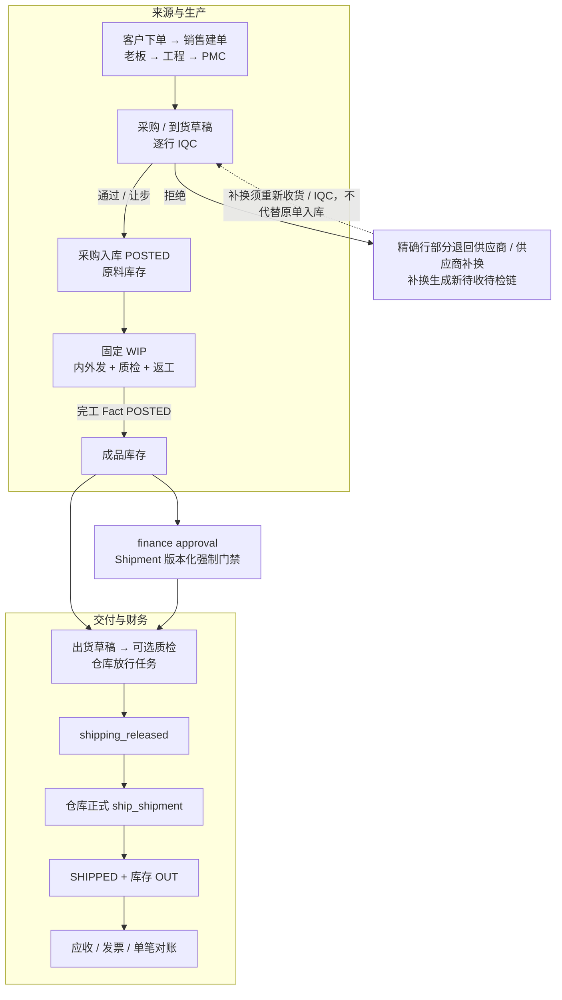

### 7.2 订单、工程、采购与包材并行线

#### 7.2.1 客户现场顺序与当前 Product Core 不同

甲方原图含“PMC 前置跟进”和“老板生产资料二次审核”；当前注册 ProcessRuntime 没有这两个独立节点。上下两条线分别保留，不能合成一条看似已实现的流程。

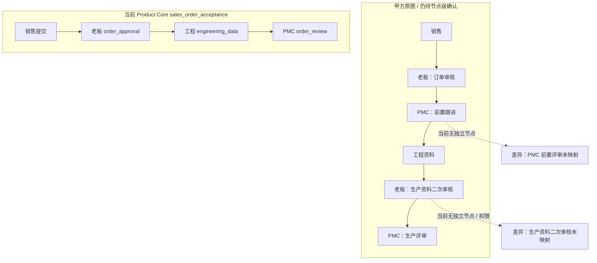

#### 7.2.2 主料与包材并行线

实线表示当前通用主路径；虚线表示客户要求已有线索、但专用来源或事实链没有闭环。销售确认包材版本，品质办理物料 IQC，两者不是同一个动作。

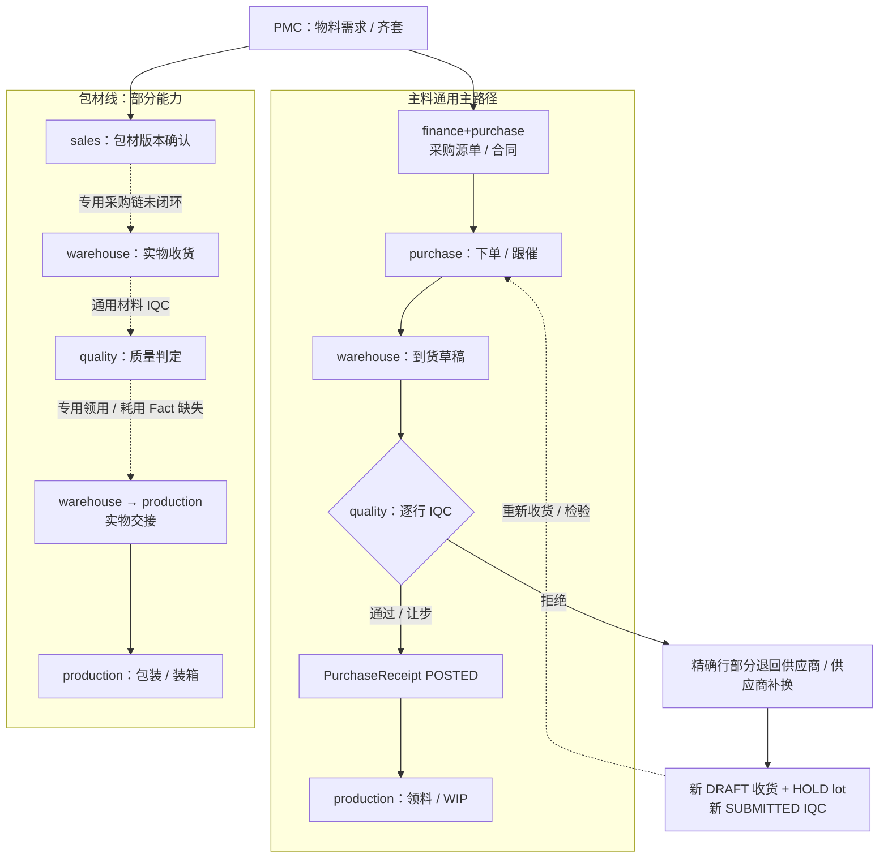

### 7.3 固定毛绒 WIP、内外发与返工

#### 7.3.1 布料加工、裁片、车缝与皮套

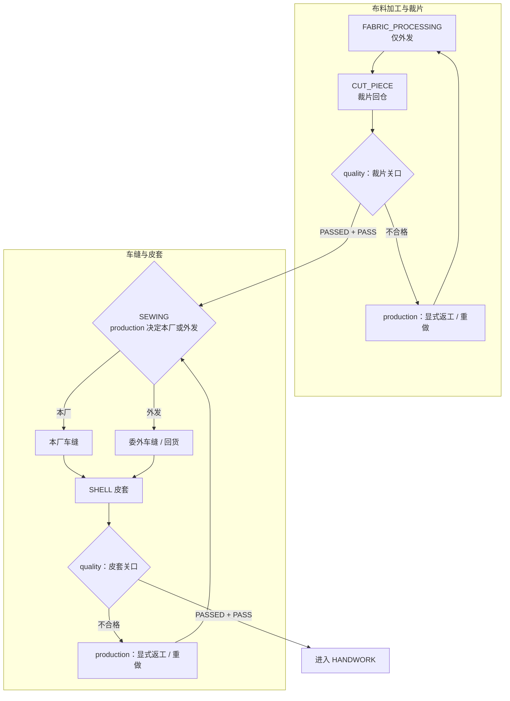

#### 7.3.2 手工与成品多关检验

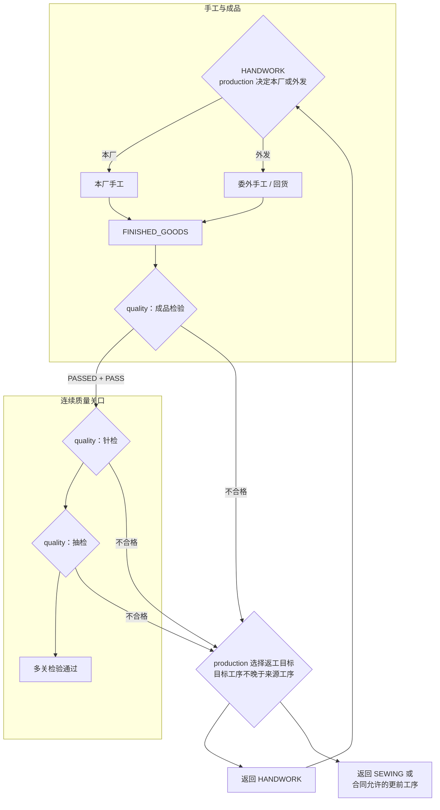

#### 7.3.3 客户验货、包装与显式完工

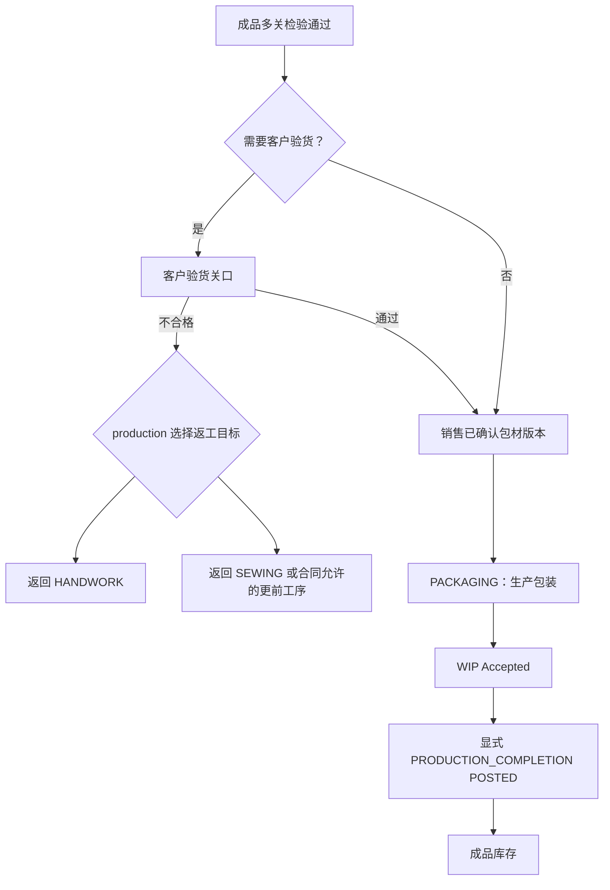

| 工序 | 执行模式 | 输出 | 质量关口 | 交接 |
| --- | --- | --- | --- | --- |
| `FABRIC_PROCESSING` | 仅外发 | `CUT_PIECE` | `CUT_PIECE` | production → quality |
| `SEWING` | 本厂或外发 | `SHELL` | `SHELL` | production → quality |
| `HANDWORK` | 本厂或外发 | `FINISHED_GOODS` | 成品 → 针检 → 抽检 → 条件性客户验货 | production → quality |
| `PACKAGING` | 本厂 | `PACKED_GOODS` | 要求销售确认包材版本 | sales → production |

当前本地实现支持拆批、分配、开始、完成、外发回货、移交、返工、取消和包材确认。`PASSED + PASS` 直接推进；被拒绝批次的 WIP 让步必须先批准、再由生产异常动作独立执行，未批准或只完成 Workflow 时 fail closed。

### 7.4 出货、放行与财务

#### 7.4.1 当前直连主路径：准备并提交仓库放行

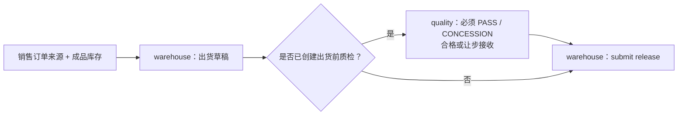

#### 7.4.2 当前直连主路径：仓库任务完成后再正式出货


#### 7.4.3 甲方财务确认要求 / 部分 ProcessRuntime

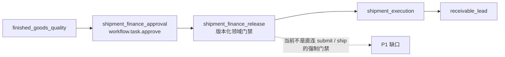

> 公开 `submit_shipment_release` 已退出；正式页面从 active revision 启动 `finished_goods_delivery`。内部仓库放行协同仍要求已创建的出货前质检必须为 `PASS` / `CONCESSION`（合格或让步接收），真实 `ship_shipment` 另外要求财务 approval 已写入 Shipment 版本化门禁；协同任务完成和财务批准都不等于 `SHIPPED` 或库存 `OUT`。

#### 7.4.4 只有正式来源和独立收付款动作才进入财务事实

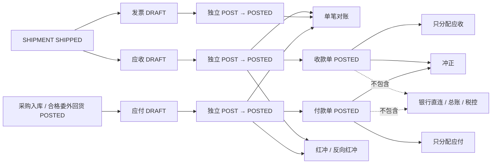

> 发票可单独核对，但不是收付款分配来源；`RECEIPT` 只分配应收，`DISBURSEMENT` 只分配应付。永绅尚无收付款页面 / 权限，133 较早版本也不含该切片。

### 7.5 Workflow / ProcessRuntime / Fact 分界

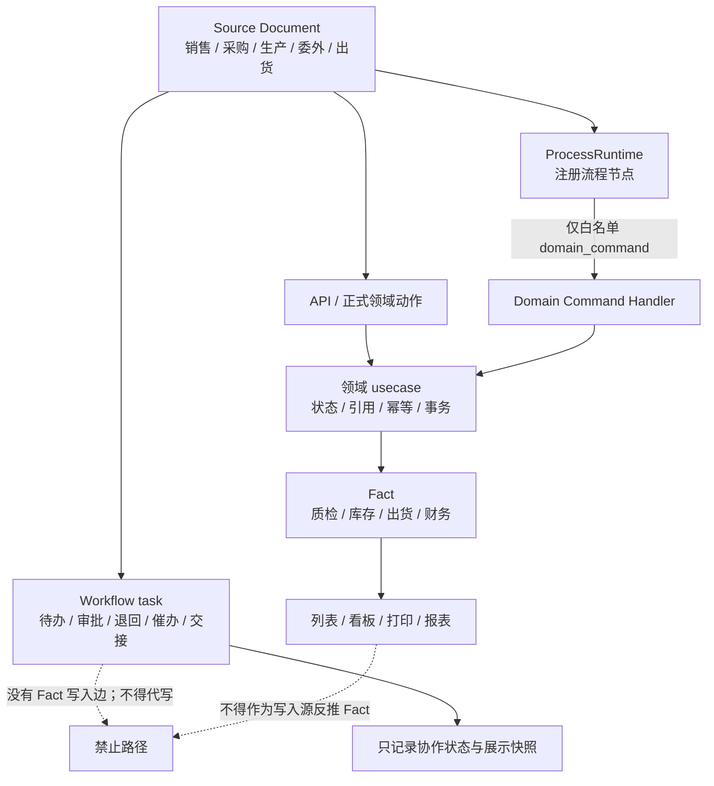

| 协同动作 | Workflow / ProcessRuntime 结果 | 必须独立执行的 Fact 动作 |
| --- | --- | --- |
| 销售提交 | 启动 / 推进销售受理 | SalesOrder usecase 执行 `DRAFT → SUBMITTED` |
| IQC 通过 | 节点可以继续 | QualityInspection 形成判定；不自动写库存 |
| 仓库入库任务完成 | 协同交接结束 | PurchaseReceipt `POSTED` 才写库存 |
| 排程任务完成 | PMC 交接完成 | 不创建领料或完工 |
| WIP 批次完成 | 进入待检或 Accepted | 不自动生成生产完工 Fact |
| 返工异常任务完成 | 处理结论已记录 | 不自动过账 / 冲销 REWORK |
| 出货放行完成 | `shipping_released` | `ship_shipment` 才形成 `SHIPPED` 和库存 OUT |
| 财务放行 | 成品质检后由 finance 责任池审批；批准写 Shipment 版本化领域门禁 | 不生成 PAYMENT、应收、发票或总账；未批准不能出货 |
| 应收线索 | FinanceFact DRAFT | 还须独立 POST；不等于收款 |
| 单笔核对完成 | FinanceFact Reconciliation | 不证明已经收付；真实收付款和多来源分配必须另走 FinancePayment 生命周期 |

<a id="flow-catalog"></a>

## 8. 流程目录、逐流程状态与本地验证

### 8.1 F01–F22 逐条结论

| ID | 流程 | 交出 → 接入 | 权威源 / 结果 | 当前层级 | 本地证据包 / 未闭环结论 |
| --- | --- | --- | --- | --- | --- |
| F01 | 客户建档、联系人、销售建单 | 客户 → sales | Customer / Contact / SalesOrder | 本地已实现 | E-RBAC + E-DOMAIN |
| F02 | 销售订单受理 | sales → boss → engineering → pmc | `sales_order_acceptance` | 本地审批主链已闭环：流程提交、通用审批、原子激活；甲方 PMC 前置评审、老板生产资料二审仍未映射 | E-RBAC + E-DOMAIN；客户节点差异保持 open |
| F03 | 产品、SKU、工序、BOM 齐套 | engineering → pmc / purchase / production | MasterData + active BOM | 本地已实现 | E-DOMAIN |
| F04 | 排程、风险、生产评审 | pmc → production | ProductionOrder + `production_scheduling` | 本地已实现 | E-DOMAIN + E-PG |
| F05 | 采购订单与合同 | engineering / pmc → finance+purchase → boss | PurchaseOrder + `material_supply` approval | 本地审批主链已接统一审批箱，唯一领域命令批准；BOM 不自动生成 PO | E-RBAC + E-DOMAIN + E-PRINT |
| F06 | 到货、逐行 IQC、正式入库 | purchase / warehouse → quality → warehouse | Receipt DRAFT + HOLD lot + IQC → POSTED | 本地已实现 | E-DOMAIN + E-PG |
| F07 | 首次 IQC 拒绝退回供应商 / 供应商补换 | quality → purchase / warehouse | PurchaseRejectionDisposition；补换生成 Receipt DRAFT + HOLD lot + IQC | 本地已实现；目标未发布 | E-DOMAIN + E-RBAC + E-WEB；精确行、部分累计、幂等、CAS、取消已覆盖，目标 apply / readback、真实岗位 smoke 与 UAT 未完成 |
| F08 | 已入库后的退货 / 调整 | quality / warehouse → purchase / finance | PurchaseReturn / ReceiptAdjustment | 本地已实现；purchase / warehouse entitlement 已配 | E-DOMAIN + E-PG + E-RBAC；目标当前版本与岗位 UAT 按交付矩阵另验 |
| F09 | 包材并行采购、收货、检验、发料 | sales → purchase / warehouse / quality → production | 包材版本 + 通用材料 / 采购链 | 本地部分 | E-RBAC + E-DOMAIN；专用采购 / IQC / 领用耗用 Fact 缺失 |
| F10 | 布料加工、裁片回仓与检验 | production → 外协 → quality；warehouse 实物交接 / 只读 | WIP + outsource allocation + CUT_PIECE gate | 本地部分；系统回货登记归 production，warehouse entitlement 不办理 | E-RBAC + E-DOMAIN + E-PG |
| F11 | 车缝本厂 / 外发 | production → quality | SEWING → SHELL | 本地已实现 | E-DOMAIN + E-PG |
| F12 | 手工本厂 / 外发 | production → quality | HANDWORK → FINISHED_GOODS | 本地已实现 | E-DOMAIN + E-PG |
| F13 | 成品、针检、抽检、客户验货、返工 | production ↔ quality；客户条件参与 | sequential quality gates / rework | 本地已实现；外部门户未实现 | E-DOMAIN + E-PG；外部账号仍 open |
| F14 | 包装与显式完工入库 | sales → production → warehouse | PACKAGING + PRODUCTION_COMPLETION POSTED | 本地已实现 | E-RBAC + E-DOMAIN + E-PG |
| F15 | 委外合同、发料、回货、质检、应付 | production → supplier → quality → finance | OutsourcingOrder / Facts / QC / AP | 本地已实现 | E-DOMAIN + E-PG + E-PRINT |
| F16 | 销售来源、库存预留、出货草稿 | sales → warehouse | Reservation + Shipment DRAFT | 本地已实现 | E-DOMAIN + E-PG |
| F17 | 成品质检、仓库放行；甲方财务确认要求 | quality → finance → warehouse | shipment_release + `finished_goods_delivery` + Shipment finance gate | 本地强制门禁已接：财务审批后写版本化审计锚点，普通 / 流程出货均不可绕过；目标环境与岗位 UAT 未执行 | E-RBAC + E-DOMAIN + E-PG；E-TARGET open |
| F18 | 实际出货、库存扣减 | warehouse → finance | `SHIPMENT SHIPPED` + inventory OUT | 本地已实现 | E-DOMAIN + E-PG |
| F19 | 应收、应付、发票、单笔对账 | warehouse / production → finance | source-driven FinanceFact | 本地已实现（有限财务） | E-DOMAIN + E-PG |
| F20 | 付款、银行流水、多单核销、总账 / 税控 | finance | FinancePayment / Allocation / CreditNote；无 PAYMENT approval contract | Product Core 本地部分；永绅未授权 | 真实收付款、多单核销、冲正和红冲 V1 已实现；永绅无收付款页面 / 权限，且没有付款申请 / 审批 ProcessRuntime；Workflow 不得冒充付款完成，银行直连、总账和税控仍缺 |
| F21 | 任务附件、催办、审批 / 退回 | 全部业务岗位 | Workflow task + attachment | 本地已实现；办理仍受 owner / assignee | E-RBAC + E-DOMAIN + E-WEB |
| F22 | 账号、角色、客户配置、审计 | admin / super admin | RBAC / customer revision / audit | 本地已实现；固定目标版本部分验证 | E-RBAC + E-WEB；133 较早 V5 有配置激活 / 账号 smoke，当前 HEAD 与客户 UAT 另验 |

### 8.2 证据包及适用范围

| 代码 | 证据入口 | 能证明 | 不能证明 |
| --- | --- | --- | --- |
| E-RBAC | 手册同步、客户配置、closure / readiness / acceptance Node 合同 | 9 岗位、281 分配、菜单 / 职责 / 预览对象与当前配置同步 | 目标有效权限或账号可登录 |
| E-DOMAIN | biz / data / service 定向测试及当前整树门禁 | 当前领域状态、来源、权限 guard、Workflow / Fact 代码合同 | 目标库已有 migration / 数据 |
| E-PG | 当前 migration 的 disposable PostgreSQL 关键事务套件 | 对应固定代码树的采购、WIP、委外、出货、财务事务与并发路径 | 客户真实数据或目标环境 |
| E-WEB | Web tests、production build、当前工作树 Chromium smoke | 当前页面合同、构建和浏览器路径 | 目标岗位写入 smoke / UAT |
| E-PRINT | Chromium PDF 安全集成、模板合同和固定目标 PDF evidence | 生成链、安全边界和指定版本模板输出 | 甲方纸面逐字段签收 |
| E-PRIVATE | Private manifest、结构化提取、`product.lock.json` 和正式校验 | 受控原件完整性、版本锁与禁止真实导入边界 | Product Core / 目标 runtime |
| E-MERMAID | 角色手册与甲方确认表 Mermaid 块使用仓库锁定 Mermaid 解析 | 图语法可渲染 | 图中业务语义正确；语义仍靠真源审查 |
| E-TARGET | 133 `customer-trial-133` 较早固定 V5 技术试用 evidence | 该固定 release 的 migration、active revision、账号 / 页面 / PDF 技术 smoke | 当前 HEAD 后续审批 / 异常 / 收付款能力、永绅新 entitlement 或客户 UAT |

## 9. 三条 ProcessRuntime 与四条预览工作流

### 9.1 Product Core 注册流程（客户只能选变体，不能改图）

> **先分对象：**本节是 Product Core `ProcessRuntime`。其中 `finished_goods_delivery` 与第 9.2 节一个客户 `preview_only` workflow 同名，但不是同一个对象、也不是同一份运行证据。


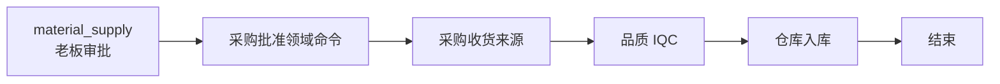

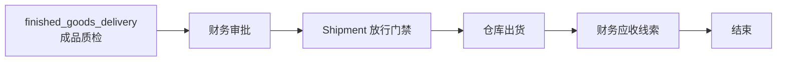

| process key | version | variant | 业务引用 | 当前覆盖 |
| --- | --- | --- | --- | --- |
| `sales_order_acceptance` | `v1` | `approval_engineering_pmc` | `sales_order` | `runtime_enabled_local`；销售页启动流程，审批后唯一领域命令激活，永绅 active revision 未读回。 |
| `material_supply` | `v1` | `purchase_receipt_iqc_inbound` | `purchase_order` | `runtime_enabled_local`；采购先审批并由唯一领域命令批准，再进入收货 / IQC / 入库，目标证据待补。 |
| `finished_goods_delivery` | `v1` | `quality_finance_ship_receivable` | `shipment` | `runtime_enabled_local_target_evidence_required`；财务审批和版本化 Shipment 门禁已接，目标 migration / 账号 smoke / UAT 未完成。 |

### 9.2 永绅客户包中的四条 workflow 均是 `preview_only`

> **同名不同层：**这里的 `finished_goods_delivery` 是客户配置预览，不是上节的 ProcessRuntime。`payment_approval` 中出现 `release_payment` 也只代表候选协同命令，不会创建或过账 FinancePayment。Product Core 的真实收付款、多来源分配、冲正和红冲走独立领域合同；永绅 finance 尚未获得对应页面 / 权限，付款审批、银行直连、总账和税控仍未实现。

| workflow key | 来源模块 | 节点顺序（type；责任池；command） | Fact 边界 | 当前状态 |
| --- | --- | --- | --- | --- |
| `sales_order_approval` | `sales_orders` | `sales_submit` (`human_task`; `sales`; `submit_sales_order`) → `boss_approval` (`approval`; `boss`; `approve_sales_order`) → `engineering_data` (`human_task`; `engineering`) → `pmc_review` (`human_task`; `pmc`) → `end` (`end`; `pmc`) | `workflow_only` | `preview_only` |
| `purchase_order_approval` | `purchase_orders` | `purchase_submit` (`human_task`; `purchase`; `review_purchase_order`) → `boss_review` (`approval`; `boss`) → `warehouse_prepare` (`human_task`; `warehouse`) → `quality_prepare` (`human_task`; `quality`) → `end` (`end`; `purchase`) | `workflow_only` | `preview_only` |
| `payment_approval` | `finance` | `finance_submit` (`human_task`; `finance`; `release_payment`) → `boss_approval` (`approval`; `boss`) → `end` (`end`; `finance`) | `workflow_only` | `preview_only` |
| `finished_goods_delivery` | `quality_inspections`、`shipments`、`finance` | `finished_goods_qc` (`human_task`; `quality`; `finished_goods_quality_decide`) → `finance_release` (`approval`; `finance`; `release_shipment_finance`) → `shipment_execution` (`human_task`; `warehouse`; `ship_shipment`) → `receivable_lead` (`human_task`; `finance`; `create_receivable_lead`) → `end` (`end`; `finance`) | `workflow_only` | `preview_only` |

### 9.3 预览业务流与覆盖层

| business flow | 模块 | 状态 | 配置护栏 |
| --- | --- | --- | --- |
| `sales_to_production` | `sales_orders`、`products`、`workflow_tasks` | `preview_only` | 销售订单提交后只形成生产评审线索；真实生产事实仍由 OperationalFactUsecase 承接。 |
| `purchase_to_inventory` | `purchase_orders`、`purchase_receipts`、`quality_inspections`、`inventory` | `preview_only` | 采购订单批准只形成采购承诺；到货后先形成采购入库草稿和逐行待检，再由正式 IQC 判定；只有全部行合格或让步接收才允许 POSTED 入库。当前流程预览不替代采购、质检或库存 usecase。 |
| `production_to_inventory` | `production_orders`、`outsourcing_orders`、`workflow_tasks`、`quality_inspections`、`inventory` | `preview_only` | 甲方已确认车缝完成并检验后再进入手工，车缝和手工分别由生产经理决定本厂或外发；正式 WIP 执行按生产订单冻结路线快照，以显式子批承接本厂车间移交或外发回仓，并为裁片、皮套、成品、针检、抽检和条件性客户验货保留独立质量关口。这里仍是客户流程预览，不替代生产、委外、质检或库存 usecase；包装完成和生产协同完成都不等于成品已经入库。 |
| `delivery_to_settlement` | `shipments`、`finance` | `preview_only` | 出货单 SHIPPED 后才可评审应收 / 开票线索；出货放行不等于 shipped。 |

| coverage layer | 当前状态 | 配置中的全部 evidence |
| --- | --- | --- |
| `workflow_task` | `runtime_enabled` | `official_task_actions`、`owner_pool_scope`、`mobile_role_tasks` |
| `process_runtime` | `runtime_enabled_local_target_evidence_required` | `sales_order_acceptance`、`material_supply`、`finished_goods_delivery` |
| `production_wip` | `runtime_enabled_local` | `production_order_route_snapshot`、`explicit_wip_batches`、`inhouse_transfer_or_outsource_return`、`stage_quality_gates`、`conditional_customer_inspection` |
| `business_flows` | `preview_only` | `sales_to_production`、`purchase_to_inventory`、`production_to_inventory`、`delivery_to_settlement` |
| `state_machines` | `preview_only` | `sales_order_lifecycle`、`production_order_lifecycle`、`purchase_order_lifecycle` |
| `process_policies` | `preview_only` | `skip_policy`、`auto_generate_policy`、`close_policy` |

| 预览对象 | key | 状态 / 内容 | 护栏 |
| --- | --- | --- | --- |
| state machine | `sales_order_lifecycle` | `draft` → `submitted` → `approved` → `pmc_review` → `closed`；`preview_only` | 不覆盖销售订单 usecase 的正式状态规则。 |
| state machine | `production_order_lifecycle` | `planned` → `released` → `processing` → `qc_pending` → `closed`；`preview_only` | 不生成库存、质检或出货 Fact。 |
| state machine | `purchase_order_lifecycle` | `draft` → `submitted` → `approved` → `receiving` → `closed`；`preview_only` | 不替代采购入库、退货、调整或库存状态。 |
| policy | `skip_policy` / `skip_optional_review_when_unconfigured` | `manual_review_required`；`preview_only` | 只能转人工，不绕过权限 / 状态 / Fact。 |
| policy | `auto_generate_policy` / `generate_downstream_task_preview` | `preview_only` | 不自动生成事实单据或库存流水。 |
| policy | `close_policy` / `close_after_required_nodes_done` | `requires_usecase_review`；`preview_only` | task done 不能写成 fact posted。 |

| runtime process | 状态 | node types |
| --- | --- | --- |
| `sales_order_acceptance` | `runtime_enabled_local` | `domain_command`、`approval`、`human_task`、`end` |
| `material_supply` | `runtime_enabled_local` | `approval`、`domain_command`、`end` |
| `finished_goods_delivery` | `runtime_enabled_local_target_evidence_required` | `domain_command`、`approval`、`end` |

| UI entrypoint | 当前解释 |
| --- | --- |
| `desktop_task_board` | 桌面任务看板 |
| `desktop_approval_inbox` | 服务端按 `workflow.task.approve` 筛选的统一待我审批入口 |
| `workflow_v1_page` | Workflow v1 页面 |
| `business_collaboration_drawer` | 业务协同抽屉 |
| `mobile_role_tasks` | 移动岗位任务 |
| `customer_config_preview` | 客户配置预览，不是激活 |
| `purchase_contract_print` | 材料采购合同打印能力 |
| `processing_contract_print` | 加工合同打印能力 |
| `production_order_wip_execution` | 生产订单 WIP 执行入口 |

| sign-off gate | 本文状态 |
| --- | --- |
| `customer_package_preview_boundary_passed` | 本地预览边界合同通过；仍是 `runtimeEnabled=false` 的预览包 |
| `yoyoosun_customer_closure_passed` | 客户闭环静态合同通过；不替代目标角色读回 |
| `yoyoosun_release_readiness_passed` | 本地 readiness 合同通过；不等于发布或客户验收 |
| `target_effective_session_readback_required` | 133 较早固定 V5 已执行；当前 HEAD 新增能力未整体重发，必须重新绑定版本读回 |
| `role_smoke_required` | 133 较早固定 V5 已执行技术 smoke；不能替代当前 HEAD 或甲方岗位 UAT |
| `purchase_and_processing_pdf_evidence_required` | 较早 V5 有目标技术 PDF 证据；甲方纸面逐字段签收未完成 |

> `roleFlowMatrix.flowResponsibilities` 是职责覆盖标签，不自动证明 runtime；例如 `outsourcing_return.receipt_review` 必须由委外回货的后端链和测试举证。

## 10. 跨角色协作速查

H01–H22 甲方交接确认见[甲方角色职责与业务流转确认表](甲方角色职责与业务流转确认表.md)，系统逐节点办理合同见[流程编排闭环矩阵](流程编排闭环矩阵.md)。本文只保留技术索引，避免维护第三份节点真源。

| 流程族 | 主要交接 | 当前系统摘要 | 详细入口 |
| --- | --- | --- | --- |
| 订单与资料 | sales → boss → engineering → pmc | 销售提交、通用审批和唯一领域激活已闭环；甲方 PMC 前置和老板二审仍未映射 | F02；流程矩阵 4.1 |
| 采购、IQC、入库 | pmc / purchase / warehouse → quality → purchase / warehouse | 入库主链和首次 IQC 精确行部分退厂 / 补换已在 Product Core 本地实现；永绅目标发布、真实岗位 smoke 与 UAT 仍 open | F05–F08；流程矩阵 4.2 |
| 生产、委外、质量 | pmc → production ↔ quality → warehouse / finance | 固定 WIP、分段质检和正式完工已有；当前异常切片目标未重发 | F10–F15；流程矩阵第 5 章 |
| 出货 | sales / warehouse → quality → finance → warehouse | 仓库协同放行、财务版本化门禁和正式出货分层；本地强制门禁已接，目标证据待补 | F16–F18；流程矩阵 4.3 |
| 财务 | shipment / purchase / outsourcing → finance；finance → boss 候选 | 来源财务和 Core 收付款 V1 已有；永绅未授权收付款，PAYMENT 申请 / 审批仍 preview | F19–F20；流程矩阵第 6、9 章 |
| 控制面 | admin → 全部岗位 | 管账号 / 角色 / 配置，不代办业务事实 | F22；第 6 章 |

<a id="known-gaps"></a>

## 11. 当前缺口与禁止误报

| 优先级 | 缺口 | 影响 | 当前正确口径 |
| --- | --- | --- | --- |
| P1 | 133 较早固定 V5 已有技术试用 readback，但当前 HEAD 的审批 / 异常 / 收付款切片未整体重新发布 | 旧版本证据不能证明当前能力 | 每项绑定 release / migration / active revision；当前新增能力写“目标当前版本未核验” |
| P1 | 甲方订单线含 PMC 前置评审与老板生产资料二审，当前 `sales_order_acceptance` 没有这两个独立节点 | 不能宣称客户原图全部箭头已进入 runtime | F02 保持“本地部分”；先做节点 / 权限 / 退回语义评审 |
| P1 | 首次 IQC 精确行部分退厂 / 补换仅完成本地 Product Core，目标客户库未 apply 且岗位未验收 | 客户现场尚不能据此认定可用 | 保持“内部可用”；需要 migration status / apply / 结构读回、真实岗位 smoke 与客户确认 |
| P1 | 裁片 / 委外回货的系统办理权只在 production；warehouse 没有 WIP / return receipt create entitlement | 仓库现场接货不能写成仓库已可在系统登记 | F10 标本地部分；warehouse 仅实物交接 / 来源只读 |
| P1 | Shipment 财务门禁、销售激活和采购批准已在本地闭环，但目标客户库 migration、active revision、财务 / 老板账号 smoke 与 UAT 未执行 | 本地代码与自动化不能证明目标可运行 | 保持本地已实现；补 E-TARGET 后才升级客户交付口径 |
| P1 | 较早固定 WIP 路线已在 133 V5 技术试用验证，但当前新异常 migration 未发布，甲方岗位 UAT 未签收 | 不同版本证据不能互相替代 | 交付矩阵按能力和固定 release 分列，不再写“全部未 apply”或“全部已交付” |
| P2 | 包材没有独立采购、IQC、领用 / 耗用事实闭环 | 客户图的包材并行线只能部分落地 | 目前是通用材料 / 采购 + 销售版本确认 |
| P2 | BOM / 物料需求不自动生成采购订单 | 财务兼采购仍需手工建源单 | 不宣称自动采购 |
| P2 | 甲方“销售出货确认”没有独立正式动作 | 交接依赖来源候选 / 人工协作 | warehouse 建出货单，sales 只读 |
| P2 | 驻厂 / 供应商 QC、客户验货没有外部门户角色 | 外部参与者不能直接登录闭环 | 由内部 quality 记录判定 |
| P2 | Product Core 已有真实收付款、多来源核销、冲正和红冲 V1，但永绅 finance 未获收付款页面 / 权限，且付款申请 / 付款审批、银行直连、总账、税控仍未实现 | 不能把 Core 本地能力写成永绅已可用，也不能称完整财务审批或会计系统 | 先确认永绅本期范围和审批职责；Workflow 不得冒充付款完成，再同步 entitlement、目标发布和 UAT |
| P2 | 当前只闭环仓库 / 库存 Data Scope；没有可靠的订单 owner、部门主数据或业务客户集合真源 | 不能宣称已支持 SELF、DEPARTMENT、CUSTOMER_SET | 后续必须先补真源和查询层合同，不能靠角色名或前端筛选伪造 |
| P2 | 业务审计尚非所有 Source / Fact 的统一 before / after 审计 | “有审计页”不等于全链审计 | 只描述现有明确审计范围 |
| P2 | 私有仓 `product.lock.json` 未锁定本文 Product Core 基线 | 正式 pin 验证不能代表当前代码 | 只能报告本轮只读完整性 / 提取检查 |

## 12. 甲方 17 份受控原件复核覆盖

所有原件、真实姓名、电话、地址、价格、银行信息、签字和会议附件只在客户专属 Private 仓库受控处理。本文只保留脱敏后的角色、节点、字段类别和边界，不再复制逐文件审查流水。

上次来源审查覆盖 **17** 份原件，其中 5 个工作簿共 20 个 sheet；这些数量只证明当次 manifest 覆盖，不是业务事实、真实导入批准、当前能力或目标验收。

Private manifest、`product.lock.json` 和正式验证记录是版本真源；lock 未同步时，`FORMAL_PRODUCT_PIN=1` 必须 fail closed（exit 1），普通只读绿色不能冒充正式 pin 通过。

<a id="verification"></a>

## 13. 验证矩阵与停止条件

### 13.1 每类流程如何验证

| 验证面 | 当前必须覆盖 | 目标 / UAT 边界 |
| --- | --- | --- |
| 角色 / 配置 / 文档 | 9 岗位、281 分配、菜单、责任池、预览边界、链接、隐私和 Mermaid | effective session、账号 allow / deny 与甲方职责签认另验 |
| Workflow / ProcessRuntime | 来源、节点、审批 / 退回 / 阻塞、revision、version、幂等和失败恢复 | 当前审批切片按固定 release 重发；客户流程 UAT 另验 |
| Quality / Inventory / WIP / Shipment | usecase、repository、PostgreSQL 事务、页面和 Workflow / Fact 分界 | 首次 IQC 处置、委外 / 生产异常及 Shipment 财务门禁仍需目标 apply、真实岗位 smoke 与 UAT |
| Finance | FinanceFact、Payment、Allocation、CreditNote、方向 / 主体 / 币种、余额、冲正和红冲 | 永绅 entitlement、最新 migration、付款审批、目标发布和财务 UAT 未完成 |

### 13.2 执行证据登记规则

本文不缓存整树测试计数。真实命令、退出码、通过 / 失败 / 跳过登记在 `progress.md` 和任务交付记录；历史 `full.sh` / `strict.sh status=complete` 只证明当时固定代码树。

登记时必须列非零测试数、fail、skip 和 Mermaid 解析数；SQLite、PostgreSQL、静态合同、浏览器、`full.sh` / `strict.sh` 分层记录。133 证据绑定 release、image、migration、active revision、账号和 readback；UAT 绑定甲方确认范围与 Private 签认原件。

### 13.3 反复 review 的停止条件

“反复 review”依次核对 Private 来源、9 岗位 / 281 分配、Source / Workflow / Fact / 目标 / UAT 分层、Mermaid 和受影响门禁。发现问题就从受影响层重跑；连续一轮无新缺陷且已承诺门禁为非零测试、零 fail、零 skip 时停止。

## 14. 维护规则与证据入口

### 14.1 维护规则

- 岗位、权限、菜单、责任池或节点变化时，先改代码 / 配置真源，再同步本文；客户要求与当前实现分列，不造 alias、fallback 或双写。
- publish / activate 后补 active revision、effective session 和真实岗位 readback；不得把预览、本地或旧版本直接写成上线。
- 不保存密码、token、验证码、真实员工 / 银行资料、客户文件 hash 或凭据；Workflow / Fact、Private、Core、目标和 UAT 始终分层。

### 14.2 主要证据入口

- 永绅岗位与客户包：`roleFlowMatrix.mjs`、`customerPackage.mjs`、`flowOrchestrationCoverage.mjs`。
- Product Core：`rbac.go`、`customer_process_contracts.go`、`process_runtime*.go`、`workflow*.go`、`production_wip.go`。
- 跨域边界：`docs/workflow/业务与协同流程地图.md`、`docs/architecture/状态工作流事实边界.md`。
- 客户原件：Private manifest、source review、`product.lock.json` 和 `sources/`。
