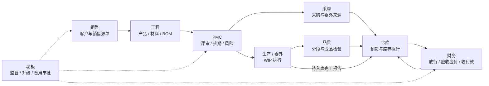

# 永绅岗位职责与业务协作指南 / Yoyoosun Role and Flow Guide

本文帮助实施、研发和测试快速理解永绅九个业务岗位“负责什么、从哪里接手、交给谁、不能做什么”。它不重复数百个权限 key、菜单 key 或流程节点；精确运行合同以 `config/customers/yoyoosun/roleFlowMatrix.mjs`、后端 RBAC、active customer revision、代码和测试为准。

面向甲方逐项确认时使用[甲方角色职责与业务流转确认表](甲方角色职责与业务流转确认表.md)；核对每条运行流程时使用[流程编排闭环矩阵](流程编排闭环矩阵.md)；查看某个角色的最终权限关系时使用开发环境 `/__dev/permission-relationships`。

## 一页结论

- 永绅当前有九个业务角色：销售、老板 / 管理审批、工程、PMC、采购、仓库、品质、财务、生产 / 委外。
- 角色说明是业务导航，不是授权表。最终能否看见页面或执行动作由后端 RBAC、active customer revision、模块状态、对象状态和责任归属共同决定。
- 同一员工可以组合多个内置角色，但不把一个岗位的权限复制进另一个 Product Core 角色。
- Workflow task done ≠ Fact posted；`shipping_released` 不等于 `SHIPPED`，WIP Accepted ≠ 成品入库。
- 客户包中的流程、状态机和策略草案仍保持 `runtimeEnabled=false` / preview-only；当前运行流程及事实链必须回到 Product Core 代码和测试。
- 本地配置、自动化或历史 evidence 不证明目标环境已核验，也不证明 UAT 已签收。

## 权限如何生效

普通账号的有效访问可简化为：

```text
账号已启用
AND Product Core RBAC 允许
AND active customer revision 未收窄
AND 模块 / 页面 / 动作已启用
AND 当前对象状态与来源匹配
AND owner / assignee / 责任池条件满足
```

菜单可见只代表有入口，不代表能执行敏感动作；任务可见只代表可协作，不代表拥有整张业务单据的全部数据权限。字段隐私、商业金额和财务信息仍分别受服务端字段权限保护。

完整权限 key、页面 key 和节点责任不在本文手工复制：

| 要回答的问题                       | 权威入口                                                       |
| ---------------------------------- | -------------------------------------------------------------- |
| 某角色声明了哪些能力、页面和责任池 | `config/customers/yoyoosun/roleFlowMatrix.mjs`                 |
| 某权限是否由后端注册               | `server/internal/biz/rbac.go`                                  |
| 当前客户 revision 实际收窄了什么   | authenticated `customer_config.get_effective_session` readback |
| 角色为何获得最终页面 / 动作        | `/__dev/permission-relationships`                              |
| 某个业务对象现在是否允许操作       | 对应 Go usecase、API、状态合同和测试                           |

## 九个业务岗位

| 角色 key      | 岗位            | 主要责任                                              | 常用业务面                                       | 关键边界                                                |
| ------------- | --------------- | ----------------------------------------------------- | ------------------------------------------------ | ------------------------------------------------------- |
| `sales`       | 销售            | 客户与销售源单、来源复核、包材版面 / 包装版本确认     | 客户、销售订单、出货查询、任务                   | 不安排 WIP；不直接写库存、质检、出货或财务事实          |
| `boss`        | 老板 / 管理审批 | 经营查看、升级 / 备用审批、异常监督与受控转交         | 业务看板、任务、订单、生产、库存、出货、财务只读 | 不是所有日常审批的默认主办；转交不改变业务状态          |
| `engineering` | 工程            | 产品、SKU、材料、工序、BOM 和工程资料                 | 销售来源、产品、材料、工序、BOM、任务            | 工程资料不自动生成采购、生产、库存或质量事实            |
| `pmc`         | PMC             | 生产评审、排期、进度风险和跨岗协调                    | 订单、工程资料、生产计划 / 进度 / 异常、任务     | 计划和风险状态不等于完工、入库或出货                    |
| `purchase`    | 采购            | 供应商、采购源单、采购合同、到货协同                  | 供应商、材料、采购、委外、入库、质检、任务       | 任务完成不能代替采购收货、退货、调整或库存事实          |
| `warehouse`   | 仓库            | 到货登记、采购与成品入库确认、库存执行、退货 / 调整、显式出货 | 入库、生产记录、库存、质检来源、出库、出货、任务 | 只能通过领域 usecase 增减库存；不能用 Workflow 直接过账 |
| `quality`     | 品质            | 来料、生产分段、成品与异常质量判定                    | 质检、生产来源、入库来源、出货来源、任务         | 质检任务完成不自动写库存、出货或财务事实                |
| `finance`     | 财务            | 财务放行、应收 / 应付、发票、收付款和对账             | 财务工作台、来源核对、出货放行、任务             | 放行不等于出货；来源金额不自动成为财务事实              |
| `production`  | 生产 / 委外     | 加工合同、WIP 安排 / 执行 / 移交 / 返工、委外回货协同、提交完工报告 | 生产订单、排期、进度、异常、委外、库存查询、任务 | 完工报告只生成待入库草稿；不代替品质判定、包材确认、仓库成品入库、结算或付款 |

上述职责摘要由 `roleFlowMatrix.mjs` 生成的业务合同支撑。若表格与配置不一致，应先判断是客户职责变化还是文档漂移；任何权限变化必须修改结构化真源并通过测试，不在本文追加临时 key 清单。

## 组合账号、控制角色与责任池

永绅存在“财务兼采购合同经办”组合账号：配置 profile 为 `finance_purchase_contract_operator`，同一账号分配 `finance` 与 `purchase` 两个内置角色。这样可以根据已确认工程资料制作采购合同，同时保持采购源单和财务事实各自的权限边界。

`admin` 和 `debug_operator` 是控制面角色，不是第十、第十一个业务岗位：

- `admin` 管账号、角色、权限、审计和 customer config；普通 admin 不天然拥有业务 Fact 权限。
- `debug_operator` 只用于受控开发诊断、造数和清理，不进入客户正式菜单。
- `is_super_admin` 是账号标志，不是角色；只能用于产品核心控制面，不能用来描述甲方日常岗位。
- 当前没有稳定的订单 owner、部门关系或授权客户集合真源，因此不能把“看见任务”扩张为全量数据范围授权。

任务只有在 active revision、后端 RBAC、精确责任池成员、owner / assignee、状态和版本同时满足时才可办理。老板的升级路径不能绕过主办责任池。

## 端到端协作主链


```mermaid
flowchart LR
  sales["销售\n客户与销售源单"] --> engineering["工程\n产品 / 材料 / BOM"]
  engineering --> pmc["PMC\n评审 / 排期 / 风险"]
  pmc --> purchase["采购\n采购与委外来源"]
  pmc --> production["生产 / 委外\nWIP 执行"]
  purchase --> warehouse["仓库\n到货与库存执行"]
  production --> quality["品质\n分段与成品检验"]
  production -->|"待入库完工报告"| warehouse
  quality --> warehouse
  warehouse --> finance["财务\n放行 / 应收应付 / 收付款"]
  finance --> warehouse
  boss["老板\n监督 / 升级 / 备用审批"] -.-> sales
  boss -.-> pmc
  boss -.-> finance
```

客户已确认的高层生产顺序是：

`布料加工 → 裁片检验 → 车缝 → 皮套检验 → 手工 → 成品检验 → 针检 → 抽检 → 条件性客户验货 → 包装 → 成品入库`

车缝和手工是前后工序，并分别由生产经理决定本厂或外发。Product Core 以固定 `PLUSH_SEW_HAND_V1`、WIP 批次 / 事件和分段 Quality Fact 承接；客户 package 中的 `businessFlows / stateMachines / processPolicies` 仍是 preview-only，不覆盖正式运行图。

## 高频交接与事实边界

| 上游 → 下游        | 交付物                         | 下游开始条件                  | 不能误读为                         |
| ------------------ | ------------------------------ | ----------------------------- | ---------------------------------- |
| 销售 → 工程        | 已提交销售来源、客户与产品线索 | 来源可追溯、必填信息完整      | 已生成生产任务树或库存需求         |
| 工程 → PMC         | 已确认产品、材料、工序和 BOM   | 工程资料可用                  | 已排产或已采购                     |
| PMC → 采购         | 可追溯采购需求                 | 供应商 / 材料 / 数量需确认    | 已到货、已入库或已应付             |
| PMC → 生产         | 正式生产订单与路线             | 订单已合法释放                | 已完工或已入库                     |
| 采购 → 仓库 / 品质 | 到货来源                       | 仓库登记后按来源质检          | 采购任务 done 即库存增加           |
| 生产 → 品质        | WIP 批次与质量关口             | 来源工序、数量和批次匹配      | WIP Accepted 即成品入库            |
| 生产 → 仓库        | 待入库完工报告                 | 生产来源、完工数量和建议批次可核对 | 生产提交完工即库存增加              |
| 品质 → 仓库        | 合格或让步接收的质量事实       | 正式入库动作再次校验          | 质检通过即库存自动变化             |
| 财务 → 仓库        | Shipment 版本化放行门禁        | 门禁仍有效且出货 usecase 合法 | `shipping_released` 即 `SHIPPED`   |
| 仓库 → 财务        | 正式出货 / 收货来源            | 对应事实已生效                | Workflow done 即应收 / 应付 posted |

财务链必须分开表达：应收 DRAFT 需要独立 POST → POSTED；应付 DRAFT 同样需要独立 POST → POSTED。收付款、多来源核销、红冲和对账继续走各自正式 usecase，不能从 Excel、订单金额或 Workflow 自动生成。

## 当前缺口与验收边界

- PMC 前置评审、老板生产资料二次审核和包装材料专用采购 / IQC / 领用事实是否需要独立节点，仍按客户确认与领域评审处理。
- 同批拆量、改派、返工和每个质量关口的事实粒度不能从高层流程图推导。
- 客户资料、角色配置和本地 entitlement 证据不替代目标环境 authenticated readback、真实岗位 smoke 或客户 UAT。
- 历史 133 / V5 技术试用只证明当时版本的局部链路；当前版本必须重新绑定产品提交、配置 revision、migration 和目标环境证据。
- 银行直连、支付凭证、总账和税控不是当前系统承诺。

## 维护与验证

岗位、页面、能力或责任池变化时先改 `roleFlowMatrix.mjs`，运行结构化配置和权限测试，再更新本文的职责摘要。运行节点或 Fact 边界变化更新[流程编排闭环矩阵](流程编排闭环矩阵.md)及代码测试；客户确认变化更新[决策日志](决策日志.md)和面谈确认表。

建议验证入口：

```bash
node --test scripts/qa/yoyoosun-role-flow-handbook.test.mjs
node --test scripts/qa/yoyoosun-role-business-action-projection.test.mjs
node --test scripts/qa/yoyoosun-customer-closure.test.mjs
```

本文不缓存整树测试计数、一次运行结果、客户私有文件数量或易漂移提交号。
