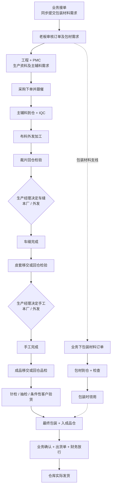

# 需求线索 / Requirement Clues

本文件只保存来源线索和明确标注的客户确认基线；面谈逐项确认使用[甲方角色职责与业务流转确认表](甲方角色职责与业务流转确认表.md)，正式已决事项进入[决策日志](决策日志.md)，未决事项进入[问题待办](问题待办.md)。客户确认仍不自动成为 Product Core、运行时规则、已发布能力或客户系统验收结论。

## 客户 / 订单 / 款式

- 客户主数据、联系人、订单编号、客户订单号、款式编号、产品编号需要分层确认。
- 当前截图和样本可作为字段线索，不能直接决定唯一 schema。

## 产品 / SKU / BOM

- 成品、SKU、材料、BOM 需要区分主数据和采购 / 生产执行快照。
- BOM 是工程真源，采购页是执行快照入口。

## 采购

- 采购订单、采购入库、采购退货、采购入库调整需要区分源单据和事实单据。
- 主料和其他材料合同复用采购订单；材料分类与收货仓库表达差异，不复制合同表。
- “财务根据工程表下合同”表示永绅岗位组合：同一账号持有 `finance + purchase`，采购合同仍由采购权限和采购订单 usecase 负责，工程/BOM只提供可追溯需求来源。
- 已有采购合同打印模板承接通用字段映射；永绅版式、固定条款和抬头仍只属于客户配置 / 打印样本，不直接进入行业模板。
- 合同订单照片可作为采购订单号、产品订单编号、材料品名、厂商料号、规格、单位、单价、采购数量、采购金额、交期和条款线索；不自动生成采购订单、采购入库、库存或应付事实。

## 委外

- 车缝加工、手工加工和布料加工复用同一加工合同；前两者明细主体通常为产品，布料加工主体为材料，工序表达加工方式。
- 委外下单是 Source Document；发料、回货、质检、返工、入库和结算分别进入库存、质检、委外和财务事实链，不能由合同确认或任务完成自动代替。

## 入库 / 质检

- 客户已确认：不良结果按质检来源单据追溯，不逐件登记不良数量；品质岗位只需记录大概比例，常用档位为 `5% / 10% / 20% / >50% / 100%`，并允许自定义百分比。
- 上述确认是 yoyoosun 业务基线；Product Core 已在本地工作树完成 schema、migration、API、页面、导出、幂等和测试闭环。该结论不代表目标环境已执行 migration、能力已发布或已由客户岗位验收。
- “按来源单据”只定义追溯和录入口径，不自动把一张含多明细、多物料或多批次的源单合并成一条质检；粗略比例也不自动推导退货数量、库存变化、质检结论或 AQL 抽检结果。
- 来料质检已有最小事实表；逐项缺陷明细、缺陷字典和正式质检报告仍待后续评审。
- 永绅当前仓库线索为主料仓、成品仓、其他仓；质检待检区可独立保留。这些通过通用仓库类型 / 名称和权限范围表达，不新增客户专属 schema。

## 生产

### 客户已确认的生产与外发主线

根据客户汇报文件 `plush_factory_formal_report_v3_mobile.pdf` 及甲方复核，老板汇报层的高层主流程已确认如下，确认决策见 `决策日志.md`。该确认只证明业务顺序；Product Core 后续是否承接、永绅是否配置、固定目标版本是否发布和甲方是否 UAT 必须分别取证。

- `车缝 → 手工` 是前后工序，不是两者二选一。
- 车缝和手工分别由生产经理决定本厂或外发；后续若允许同批拆量、改派或返工，必须另建数量守恒和审计规则，不能靠任务备注推导。
- 主辅料 IQC、裁片检验、皮套检验、手工后成品品检、针检 / 抽检 / 条件性客户验货是不同关口，不宜合并成一张通用质检单的同义文案。
- 本厂生产使用车间移交 / WIP 语义，外发完成后才使用回仓语义；裁片和皮套究竟落材料、半成品产品还是 WIP，仍需正式领域评审。
- 包装材料检查需要继续区分业务对版 / 外观确认和品质正式检验；包装领用、消耗、装箱及成品入仓仍是独立待评审事实。

Product Core 当前已用固定 `PLUSH_SEW_HAND_V1`、WIP 批次 / 事件和分段 Quality Fact 承接该主线；`processes.sort_order` 仍只控制工序档案列表展示，不能用来表示生产先后关系。133 较早 V5 有固定路线技术试用证据；当前后续异常切片未整体重发，甲方岗位 UAT 未签收。

## 出货

- `shipment_release` 只代表放行；真实出货、库存扣减和 `SHIPPED` 已由独立 Shipment / Inventory 事务承接，仍必须显式执行，不能由任务完成代替。
- 岗位职责流程图中的“出货确认 / 出库单 / 发货出库”是甲方目标语义；是否对应销售确认、财务强制门禁或仓库正式发货仍需逐节点确认，不能直接与任一代码动作画等号。

## 财务

- 应收、应付、发票、收付款、核销和红冲不能从 Workflow done 直接生成。Product Core 当前已有真实收付款与多来源核销 V1；永绅岗位配置、133 当前版本、付款审批职责和客户 UAT 仍待确认。

## 手机端

- 岗位任务端入口由权限控制，客户岗位名不同不应改核心流程。

## 权限

- 流程节点绑定职责 / 权限，不绑定岗位。

## 打印模板

- 合同和报表格式可作为客户样本记录，但数据来源和事实规则必须统一；暂不做通用打印模板内核。

## 部署交付

- yoyoosun 是私有化部署实例，未来配置、env、发布清单和备份恢复进入 `deployments/yoyoosun`。
