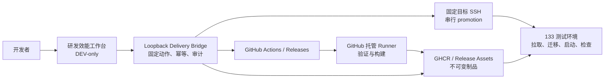

# 研发效能工作台与 CI/CD 设计 / Engineering Workbench And CI/CD Design

## 结论

本项目采用：

**GitHub Actions 托管 Runner + GHCR 不可变镜像 + 本地 loopback 交付 Bridge + 133 测试环境 + DEV-only 研发效能工作台。**

当前仓库是公开 GitHub 仓库，因此不在 133 或局域网安装可被本仓库 workflow 调度的 GitHub self-hosted runner。公开仓库的 pull request 和 workflow 变化会扩大 runner 与局域网的攻击面；首版由 GitHub 托管 Runner 完成验证和构建，本地 Bridge 只接受固定动作，并通过固定目标 SSH 执行 promotion、smoke 和受控回滚。

明确不做：

- 不自建 GitLab。
- 不引入 Kubernetes 或 HA。
- 不让 133 checkout 源码或构建 Server、Web、镜像。
- 不在工作台复制 QA、制品或部署实现。
- 不向浏览器暴露 GitHub token、SSH 私钥、任意 shell、SQL、Docker 命令或目标参数。

## 分层架构



各层职责：

| 层 | 负责 | 不负责 |
| --- | --- | --- |
| `scripts/qa/` | affected、full、strict 及回执 | 发布和目标机变更 |
| `scripts/deploy/` | 制品、manifest、promotion、smoke、rollback | 产品业务实现 |
| GitHub workflow | 触发、权限、缓存、远端状态 | 复制脚本逻辑 |
| GHCR / Release | 保存 digest、manifest、SBOM、checksum | 表示已经部署 |
| 本地 Bridge | Provider 适配、固定动作、幂等、操作恢复 | 任意命令代理 |
| 研发效能工作台 | 选择版本、展示证据、确认操作 | 持有秘密或直接 SSH |
| 133 | 消费制品、migration、启动、检查 | 源码构建和通用 CI |

## 一次验证、一次构建、多次部署

同一候选 SHA 的状态机固定为：

```text
commit
  → affected/full
  → exact-SHA strict terminal
  → immutable artifact manifest
  → zero or more promotions
  → optional rollback to an eligible manifest
```

以下动作不得隐式回到上一步：

- promotion 不触发 strict 或 build。
- smoke 不触发 promotion。
- rollback 不构建新镜像。
- strict 失败不允许 AI 自动修改 fixture、门禁或文案后从头重跑。
- 同一 fingerprint 已有有效终态时直接复用。

## 身份与真源

一个可部署版本至少包含：

| 字段 | 约束 |
| --- | --- |
| `version` | 人可读名称，不作为唯一身份 |
| `git_sha` | 40 位、可从默认分支到达 |
| `gate_fingerprint` | SHA、profile、锁文件和门禁实现身份 |
| `server_image_digest` | Server OCI digest |
| `web_image_digest` | Web OCI digest |
| `manifest_sha256` | provider-neutral manifest 完整性身份 |
| `migration_sequence` | Atlas migration 序列和 head |
| `customer_config_fingerprint` | 配置源指纹，不冒充目标 active/effective readback |
| `sbom` / `checksums` | 依赖与文件完整性 |
| `strict_result` | exact-SHA 最终验证终态 |
| `rehearsal_result` | 同一制品本地演练终态 |
| `deployment_result` | 指定目标 promotion、readback 和 smoke 终态 |

Actions run ID、job ID、可变 tag 和页面显示名称只作辅助信息。

## 门禁分层

| 入口 | 反馈周期 | 原则 |
| --- | --- | --- |
| `affected` | 日常修改 | 显式影响面；未知路径 fail closed 到 full |
| `full` | 集成候选 | 各测试组最多一次，不递归完整执行 fast |
| `strict` | 发布候选 | exact SHA 最多一份有效终态，不递归完整执行 full |

每层先执行便宜的身份、语法、清单和配置 preflight，再进入 Web、Go、数据库、浏览器和制品等高成本阶段。失败写一条精确 blocker 后停止，不自行发起 fresh lifecycle。

## 发布与回滚

133 固定只做：

1. 校验 manifest、SHA、digest、平台和目标。
2. 检查磁盘、容器、端口、数据库身份、当前版本和 rollback point。
3. 创建并验证备份。
4. 拉取或加载已构建镜像，按 digest 读回。
5. 串行执行 `migration status → plan/validate → apply → status/readback`。
6. 切换唯一生产 Compose。
7. 执行 health、ready、release identity、migration、active config、岗位和 PDF smoke。
8. 原子写入脱敏部署回执。

应用回滚只允许选择已有 manifest。数据库默认不自动 down migration；旧应用不能读取新 schema 时禁用普通 rollback，改走 forward-fix 或经验证的备份恢复。

## Bridge 安全合同

首版允许动作：

- `dispatch-release`：只向固定 GitHub 仓库的固定 `release.yml` 发送 exact-SHA 发布请求。
- `prepare-promotion`：下载并校验不可变 Release，执行固定 `test-133` 只读预检，形成待确认 operation。
- `execute-promotion`：只执行上一操作冻结的版本、目标和确认串。
- `prepare-rollback`：比较当前与候选 manifest，只在 migration 序列和客户配置源指纹一致时形成待确认 operation。
- `execute-rollback`：只回滚代码和镜像，不自动 down migration 或恢复数据库。

Bridge 必须：

- 只监听 loopback。
- 校验 Host、Origin、`Sec-Fetch-Site`、content type 和 CSRF。
- 固定仓库、默认分支、目标别名和脚本入口。
- 使用不可猜 operation ID、幂等键、目标串行锁和原子状态文件。
- 页面刷新后可按 operation ID 恢复。
- 日志脱敏，状态文件权限为 `0600`。
- 进程重启后把未知写操作标为 `not_proven`，先读回目标再决定是否续办。

Bridge 不接受任意 workflow、repo、target、路径、SSH 参数、环境变量、shell、SQL 或 Docker 子命令。

浏览器永远不持有 Provider 和 SSH 秘密。GitHub 访问首版复用本机受控凭据或后续最小权限 GitHub App；SSH 只存在于服务端 Bridge 进程边界。

## 工作台交互

第一屏必须回答：

- 本地 HEAD 是否 dirty。
- 远端 CI 和 strict 状态。
- 最新可部署版本。
- 133 当前版本。
- 最严重 blocker。
- 推荐下一步。
- 证据入口和 `not_proven` 状态。

主路径固定为：

```text
选择版本 → 阅读校验结果并确认 → 执行
```

写操作使用确认 Modal，详情与最近事件使用按需加载的 Drawer。operation 状态字典统一为：

- `queued`
- `running`
- `ready`
- `launching`
- `waiting`
- `passed`
- `blocked`
- `failed`
- `not_proven`

同一目标同时只能有一个写操作；无 rollback 资格时按钮禁用并解释原因。

## Provider-neutral 边界

平台中立：

- Git history、tag、完整 SHA。
- OCI 镜像和 digest。
- manifest、SBOM、checksums。
- QA、部署、smoke、rollback 脚本。
- Compose、migration 和目标读回。
- 工作台版本与 operation 模型。

GitHub 专有：

- Actions YAML。
- GitHub Provider adapter。
- GitHub App / token、Environments、Release 和 Packages API。

未来迁移 GitLab 时替换 Provider 与 CI 编排，不重写 Product Core、manifest、OCI 制品或 133 发布执行器。

## 证据分层

以下证据独立记录，不能互相冒充：

1. 本地静态、单元、集成和浏览器验证。
2. 远端 exact-SHA CI。
3. 不可变制品构建与校验。
4. 同制品本地发布演练。
5. 133 技术 promotion、migration 和 smoke。
6. 目标岗位人工 UAT。
7. 客户签收。

## 停止条件

遇到下列情况立即停止目标写入并返回精确 blocker：

- 存在活动 writer 或候选树不是 clean exact SHA。
- 同一版本名指向不同 SHA 或 digest。
- strict、制品、rehearsal 不是同一 SHA。
- 目标磁盘、备份或 rollback point 不足。
- 数据库身份、migration head、active config 无法确认。
- deployment 结果不明确或 operation ID 丢失。
- 新 schema 让旧应用不可读却仍请求普通 rollback。
- Provider、Registry、SSH 或目标身份没有精确读回。

失败必须说明目标是否已改变、恢复入口是什么；不得自动创建新的全量生命周期。
