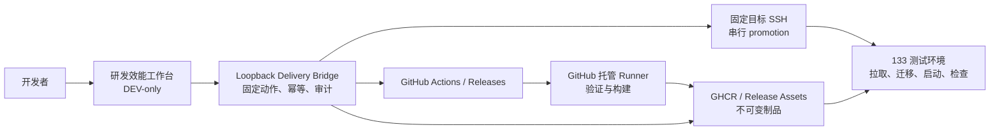

# 研发效能工作台与 CI/CD 设计 / Engineering Workbench And CI/CD Design

## 结论

本项目采用：

**GitHub Actions 托管 Runner + GHCR 不可变镜像 + 本地 loopback 交付 Bridge + 133 测试环境 + DEV-only 研发效能工作台。**

当前仓库是公开 GitHub 仓库，因此不在 133 或局域网安装可被本仓库 workflow 调度的 GitHub self-hosted runner。公开仓库的 pull request 和 workflow 变化会扩大 runner 与局域网的攻击面；首版由 GitHub 托管 Runner 完成验证和构建，本地 Bridge 只接受固定动作，并通过固定目标 SSH 执行 promotion、smoke 和受控回滚。

明确不做：

- 不自建 GitLab。
- 不引入 Kubernetes 或 HA。
- 不让 133 checkout 源码或构建 Server、Web、镜像。
- 不在工作台复制 QA、制品或部署实现。
- 不向浏览器暴露 GitHub token、SSH 私钥、任意 shell、SQL、Docker 命令或目标参数。

## 分层架构



各层职责：

| 层                | 负责                                       | 不负责             |
| ----------------- | ------------------------------------------ | ------------------ |
| `scripts/qa/`     | affected、full、strict 及回执              | 发布和目标机变更   |
| `scripts/deploy/` | 制品、manifest、promotion、smoke、rollback | 产品业务实现       |
| GitHub workflow   | 触发、权限、缓存、远端状态                 | 复制脚本逻辑       |
| GHCR / Release    | 保存 digest、manifest、SBOM、checksum      | 表示已经部署       |
| 本地 Bridge       | Provider 适配、固定动作、幂等、操作恢复    | 任意命令代理       |
| 研发效能工作台    | 选择版本、展示证据、确认操作               | 持有秘密或直接 SSH |
| 133               | 消费制品、migration、启动、检查            | 源码构建和通用 CI  |

## 一次验证、一次构建、多次部署

同一候选 SHA 的状态机固定为：

```text
commit
  → affected/full
  → exact-SHA strict terminal
  → immutable artifact manifest
  → zero or more promotions
  → optional rollback to an eligible manifest
```

以下动作不得隐式回到上一步：

- promotion 不触发 strict 或 build。
- smoke 不触发 promotion。
- rollback 不构建新镜像。
- strict 失败不允许 AI 自动修改 fixture、门禁或文案后从头重跑。
- 同一 fingerprint 已有有效终态时直接复用。

## 身份与真源

一个可部署版本至少包含：

| 字段                          | 约束                                             |
| ----------------------------- | ------------------------------------------------ |
| `version`                     | 人可读名称，不作为唯一身份                       |
| `git_sha`                     | 40 位、可从默认分支到达                          |
| `gate_fingerprint`            | SHA、profile、锁文件和门禁实现身份               |
| `server_image_digest`         | Server OCI digest                                |
| `web_image_digest`            | Web OCI digest                                   |
| `manifest_sha256`             | provider-neutral manifest 完整性身份             |
| `migration_sequence`          | Atlas migration 序列和 head                      |
| `customer_config_fingerprint` | 配置源指纹，不冒充目标 active/effective readback |
| `sbom` / `checksums`          | 依赖与文件完整性                                 |
| `strict_result`               | exact-SHA 最终验证终态                           |
| `rehearsal_result`            | 同一制品本地演练终态                             |
| `deployment_result`           | 指定目标 promotion、readback 和 smoke 终态       |

Actions run ID、job ID、可变 tag 和页面显示名称只作辅助信息。

## 门禁分层

| 入口       | 反馈周期 | 原则                                            |
| ---------- | -------- | ----------------------------------------------- |
| `affected` | 日常修改 | 显式影响面；未知路径 fail closed 到 full        |
| `full`     | 集成候选 | 各测试组最多一次，不递归完整执行 fast           |
| `strict`   | 发布候选 | exact SHA 最多一份有效终态，不递归完整执行 full |

每层先执行便宜的身份、语法、清单和配置 preflight，再进入 Web、Go、数据库、浏览器和制品等高成本阶段。失败写一条精确 blocker 后停止，不自行发起 fresh lifecycle。

普通 CI 先在不执行候选仓库脚本的 `plan` job 中确定可信比较范围，并用默认分支的扫描配置检查候选提交历史。随后才生成 affected 计划，按计划安装 Go、Atlas、Web、Chromium 和 PostgreSQL；文档等轻量变更不启动数据库。PR 触及 Ent schema、generated migration descriptor 或 Atlas 配置时，在 affected 测试前额外运行 `make data` 并要求 committed tree 零漂移。分支保护只绑定稳定的 `CI Gate`，该汇总 job 要求 plan 与实际选中的 quality job 都成功，不能用跳过重型准备换取误绿。

正式 Release workflow 默认只读；只有受 `release` Environment 约束的 publish job 获得 Release / Package 写权限。候选必须同时等于 workflow SHA、checkout HEAD 和最新 `origin/main`。strict 终态复用同时绑定 artifact、workflow、SHA、run ID、run attempt、固定 strict job、门禁 fingerprint 和回执摘要；发布目录固定为六个 public assets，版本名与 SHA 全局一一对应，远端资产的 digest 与 size 必须逐项读回。

## 效能计时与优化边界

耗时证据沿用现有真源，不另建第二套流水线或时序数据库：

- GitHub Provider 只读固定仓库最近的 CI / Release run，并读取对应 attempt 的 job 与 step 时间；Bridge 缓存 60 秒，GitHub 仍是远端时间真源。
- `full` / `strict` 把环境、共享检查、敏感信息、Web、浏览器、服务端与数据库、漏洞扫描等阶段写入同一质量回执；passed 回执缺任一阶段时间即失败关闭。
- promotion / rollback 的目标脚本把每个固定远端阶段及总耗时写入 v2 脱敏终态回执；失败回执保留已通过阶段和失败阶段，不保存原始日志或凭据。
- 工作台首屏展示最近完整运行、同 workflow 样本中位数、观测关键路径、最长环节、BuildKit 缓存命中、制品大小、传输速率、版本和失败原因；全部 job / step 与 operation 阶段按需展开，长列表保持横向滚动与移动端可读。

指标口径固定为：

| 指标 | 真源与计算 | 明确边界 |
| --- | --- | --- |
| run / job / step 耗时 | GitHub Actions 当前 attempt 的原始时间戳 | CI 与 Release 分开计算中位数 |
| 观测关键路径 | 在 run 窗口内按 job 时间区间连接可见覆盖链，并单列调度 / 等待空档 | GitHub API 未返回 workflow `needs` 图，因此不冒充静态依赖关键路径 |
| 失败原因 | 最近完整运行中最早失败的 step；缺 step 时退到失败 job | 不把原始日志或异常正文带入浏览器 |
| BuildKit 缓存命中 | Release Buildx `rawjson` 中去重后的完成构建节点；排除加载、缓存导入导出和镜像导出节点 | 是构建节点命中率，不是字节命中率 |
| 制品大小 | GitHub Release 六项 asset 的公开 size，并分列 Server、Web 与 SBOM | 不以 Docker 展开后大小替代传输字节 |
| 部署传输速率 | promotion 白名单文件总字节 ÷ 实际 rsync 调用耗时 | 是本次有效吞吐，不冒充链路带宽 |
| 版本与 digest | exact SHA Release manifest、GHCR digest 和 promotion operation 回执 | 缺详情时显示“未证明”，不从 tag 猜测 |

当前优化保持一条主路径：

- CI / strict 缓存锁文件绑定的 pnpm store、Playwright Chromium、固定版本 Go 工具和经 SHA-256 复核的 gitleaks archive；缓存缺失或损坏时重新准备，命中从不替代安装合同、checksum 或测试。
- Release 把 Server 与 Web 放入一次 Buildx Bake 共享图并允许并行调度；GitHub 使用按 target 隔离的 GHA BuildKit cache，本机使用 builder cache。两个 target 仍来自同一 committed archive、同一 Dockerfile 和同一 exact SHA。
- Dockerfile 把 pnpm、Go、APT 与固定 Chromium / PDF 依赖保持在易复用的稳定层；易变化的源码、`GIT_SHA` 与 release 标签位于其后。缓存 mount 不进入最终镜像。
- 已发布且六项 asset 完整的相同 SHA 继续通过既有 release identity 回执直接复用，不重建镜像；不同 SHA 即使源码看似相同也不猜测 digest，不跨身份复用发布结果。
- cold / hot 对比使用同一 clean exact SHA、同一工具链和同一命令：先显式隔离本轮 builder cache 取得一次 cold，再连续执行三次 hot；每次均保留完整门禁、构建节点统计和零临时数据库残留读回。

复杂度控制：本轮不新增流水线、数据库、指标服务、后台任务或生产管理入口；只在既有 Release artifact、Provider、operation 和 DEV-only 工作台合同上增加一组可选效能字段。Provider 仅富化最新 Release 的两个小型 JSON asset，旧版本与读取失败统一降为 `null / 未证明`，不会影响版本列表、发布资格或目标写入。关键路径由现有时间戳即时派生，不持久化第二份调度图。

耗时只用于定位瓶颈，不能自动把有共享数据库、浏览器锁、migration、promotion 或同一目标写入的步骤改成并发。优化前先确认等待时间、重复构建、重复安装或真实计算中的哪一类占主导；优化后用同口径多次运行比较，不能用单次偶然值宣布完成。

## 发布与回滚

133 固定只做：

1. 校验 manifest、SHA、digest、平台和目标。
2. 检查磁盘、容器、端口、数据库身份、当前版本和 rollback point。
3. 创建并验证备份。
4. 拉取或加载已构建镜像，按 digest 读回。
5. 串行执行 `migration status → plan/validate → apply → status/readback`。
6. 切换唯一生产 Compose。
7. 执行 health、ready、release identity、migration、active config、岗位和 PDF smoke。
8. 原子写入脱敏部署回执。

应用回滚只允许选择已有 manifest。数据库默认不自动 down migration；旧应用不能读取新 schema 时禁用普通 rollback，改走 forward-fix 或经验证的备份恢复。

## Bridge 安全合同

首版允许动作：

- `dispatch-release`：只向固定 GitHub 仓库的固定 `release.yml` 发送 exact-SHA 发布请求。
- `prepare-promotion`：下载并校验不可变 Release，执行固定 `test-133` 只读预检，形成待确认 operation。
- `execute-promotion`：只执行上一操作冻结的版本、目标和确认串。
- `prepare-rollback`：比较当前与候选 manifest，只在 migration 序列和客户配置源指纹一致时形成待确认 operation。
- `execute-rollback`：只回滚代码和镜像，不自动 down migration 或恢复数据库。

Bridge 必须：

- 只监听 loopback。
- 校验 Host、Origin、`Sec-Fetch-Site`、content type 和 CSRF。
- 固定仓库、默认分支、目标别名和脚本入口。
- 使用不可猜 operation ID、幂等键、目标串行锁和原子状态文件。
- 页面刷新后可按 operation ID 恢复。
- 日志脱敏，状态文件权限为 `0600`。
- 进程重启后把未知写操作标为 `not_proven`，先读回目标再决定是否续办。

Bridge 不接受任意 workflow、repo、target、路径、SSH 参数、环境变量、shell、SQL 或 Docker 子命令。

浏览器永远不持有 Provider 和 SSH 秘密。GitHub 访问首版复用本机受控凭据或后续最小权限 GitHub App；SSH 只存在于服务端 Bridge 进程边界。

## 测试数据 Bridge

测试数据中心复用同一类 DEV-only loopback 安全边界，但与交付 Bridge 分开保存 operation 和执行固定动作。它不是正式 ERP 菜单，也不使用浏览器输入的命令、路径、DSN、后端地址、密码或环境变量。

当前只登记三个 profile：

| Profile           | 目标与内容                                                                                                                                                                                                                                                                                                                                    | 退出 / 清理                                                                                                                                                                                                                                            |
| ----------------- | --------------------------------------------------------------------------------------------------------------------------------------------------------------------------------------------------------------------------------------------------------------------------------------------------------------------------------------------- | ------------------------------------------------------------------------------------------------------------------------------------------------------------------------------------------------------------------------------------------------------ |
| `core-demo`       | 仅允许登记的 `192.168.0.106:5432/plush_erp` 或 `plush_erp_*_dev`，先确认 migration 已到 head，再复用角色演示账号和 Product Core 基础资料 seed；数据使用稳定编码 upsert，不生成客户、订单、Workflow、库存、出货或财务事实                                                                                                                      | 作为共享开发基线长期保留；不提供按 operation 删除按钮，账号、主数据和后续业务记录按正式生命周期退出                                                                                                                                                    |
| `scenario-demo`   | 只允许 `127.0.0.1:8300` 对应的登记 106 长期开发库，固定使用 `yoyoosun-manual-acceptance / 2026.07.16-v5 / 20260716-V5`。先只读核对仓库、目标、migration 和 runtime identity；用户确认后稳定准备本地岗位账号和至少 30 条由真实控制面操作产生的审计样例，并通过正式 `validate → publish → transition check → activate / rollback → effective-session readback` 对齐当前跟踪的 yoyoosun 本地测试配置，再依次准备 Source Document、已登记的 ProcessRuntime、模拟岗位任务和来源驱动 Fact。固定补齐 4 条返工回厂、4 条收付款与 3 条红冲记录；直接业务 SQL、任意批次和任意目标均不开放 | `exact-create-or-readback`、长期保留、只向前补齐；同批半成品、字段漂移或身份变化直接阻断，不提供批次清理或重置。岗位到期时间是固定 V5 快照，不保证长期维持“今天 / 本周”相对语义；查询读回只证明数据前置，页面操作和人工验收仍须独立执行 |
| `full-acceptance` | 只接受 clean exact commit 和服务端已有的 `LOCAL_ACCEPTANCE_DATABASE_BASE_URL`，复用统一 lifecycle 在按 run 隔离的数据库完成 migration、正式 Source / ProcessRuntime / Fact 数据、52 项浏览器验收和异常流                                                                                                                                      | 成功或失败都停服务、删除同批隔离库并读回残留；清理不完整时 operation 不能通过                                                                                                                                                                          |

主路径固定为：

```text
读取预检
  → 选择固定 profile
  → 准备不可变 planHash / runId / 目标摘要
  → scenario-demo 展示固定目标与批次并确认一次
    / 其他 profile 手工输入完整确认串
  → 异步执行
  → 读取 operation 事件与领域 / 清理回执
```

`execute` 只消费已准备 operation 的 ID 和完整确认串；`scenario-demo` 的确认串由页面从当前 operation 内部带入，用户只核对可读的固定目标、V5 批次、数据范围和长期保留边界，不再复制长字符串。其他 profile 继续要求手工输入完整确认串。执行前必须重新核对仓库指纹、数据库目标、migration 和 profile 前置。任一身份变化都使原计划失效。进程中断后的写入结果先标记为 `not_proven`，不会自动重试；只有 `scenario-demo` 可以由用户重新准备一个更晚的同目标计划并再次确认，按同一固定批次的 `exact-create-or-readback` 显式补齐。不同目标、其他 profile 或仍在运行的 operation 继续阻断。

首页读取 `core-demo` 时会执行只读 schema / migration / 数据库对象预检；读取 `scenario-demo` 时还会执行未认证 runtime identity 读回。两者都不得在 plan / summary 阶段登录或写库。`scenario-demo` 只有在用户完成页面确认后，才在后台使用已证明固定本机目标的本地开发账号约定稳定准备岗位账号、认证管理员，并通过客户配置正式 API 对齐当前跟踪 revision；只有 active effective-session 精确读回后才进入 Source / ProcessRuntime / Fact 写入。显式 `MANUAL_ACCEPTANCE_*`、`ERP_ROLE_DEMO_PASSWORD` 或 `REAL_LOGIN_ADMIN_PASSWORD` 覆盖值仍优先，但凭据不会进入浏览器、命令参数或 operation 回执。目标未到 migration head 或守卫失败时直接显示阻断并禁用对应准备 / 生成按钮，不能等到写入阶段再绕过。

日常生成不需要重启：开发服务已运行时，直接进入页面点击“生成业务场景测试数据”并确认即可。只有显式修改 Vite 进程的凭据覆盖环境时，才需要重启一次 `pnpm start` 载入新环境；`make dev_restart` 只负责后端，只有后端代码、配置或 migration 前置变化时才按正式启动流程使用。

`core-demo` 的“稳定 upsert”不等于整批事务或可回滚批次：角色账号和核心资料仍由两个既有固定入口顺序执行，后一步失败时回执必须准确记录部分完成风险。`scenario-demo` 同样不是跨阶段数据库事务；任一阶段失败都保留 `not_proven / failed` 回执，不能清空后重跑。发生进程中断时，同目标显式补齐仍会重新校验仓库、migration、客户配置与每阶段精确读回，任何半批漂移都会停止。只有 `full-acceptance` 具有专用数据库级自动清理。Workflow 展示投影、模拟岗位任务和 task done 都不能冒充 ProcessRuntime、Source Document 或 Fact 数据。

工作台写入口的授权边界是本机开发进程、loopback、same-origin、CSRF 和固定 profile，不是 ERP RBAC。生产构建、远程访问和正式业务工作台均不可达。

## 数据库迁移 Bridge

`/__dev/database-migration` 将本地共享开发库的既有迁移守卫包装成两步交互，
不创建通用数据库控制台。浏览器只能提交 `prepare`、`execute`、`restart`
三种固定意图和幂等键 / operation ID / 当前完整确认串；目标固定为 application
config 登记的 `192.168.0.106:5432/plush_erp`，不接受 DSN、SQL、shell、
脚本路径、凭据或环境变量，也不支持 133、测试或生产数据库。

同一 operation service 也由 `scripts/local-migration-workflow.mjs` 复用：交互终端
使用 `make migrate`，非交互环境显式使用 `make migrate_prepare` 后按同一次 ready
输出运行 `make migrate_execute`。prepare 的 exit 0 只表示 `writes=0 / ready`；裸
`make migrate` 在非交互环境以 exit 2 停止，不得把待确认状态写成迁移成功。

执行顺序固定为：

```text
只读 status
  → 停止本地后端
  → plan 与事务回滚预演
  → 备份恢复演练
  → migration 真源与目标身份复核
  → 用户输入当前完整确认串
  → 再次验证备份文件身份
  → apply 一次
  → 同目标 pending=0 读回
  → 后端重启一次
  → health / ready
```

operation 状态使用 `0600` 原子文件、幂等索引和跨 Vite 进程排他锁。migration /
schema / guard / 备份编排文件组成独立 source fingerprint，避免无关工作区变更
让计划失效；目标 migration 状态仍必须精确一致。相同 source fingerprint 和
目标状态下，只有既有备份恢复报告通过且 dump 的常规文件身份、大小和 SHA-256
再次读回一致时才允许复用；execute 在 apply 前还会再次验证 operation 绑定的
备份文件身份，任何漂移都会阻断旧 operation 并要求重新准备。提交结果不明确时进入
`not_proven`，先读回目标，不自动创建新 operation 或重试 apply。

该入口不执行 affected、fast、full、strict、完整验收 lifecycle 或 CI。数据库
已到 head 时不迁移、不备份、不重建；后端只在确认 apply 后重启一次。正式发布
仍绑定不可变制品、目标备份、migration、health / ready、业务 smoke 和 rollback
point，本地工作台结果不能冒充 133 promotion、岗位 UAT 或客户签收。

## 临时数据库生命周期

临时库只允许使用已登记的 disposable profile 和 run ID，不把长期开发库、133 逻辑库或无法分类的库伪装成可清理对象。日常治理固定为：只读 inventory → 确认零连接、归属和仓库引用 → archive → 临时 restore → migration / schema / table count 指纹读回 → 删除 restore 库并确认零残留 → 生成绑定备份哈希、数据库名和目标指纹的精确确认串 → drop → 再跑 inventory。

archive 与 cleanup 默认只接受 loopback；登记的 `192.168.0.106:5432` 必须显式使用 `--allow-registered-development`。长期库和未分类库即使零连接也拒绝删除。备份、manifest 和 cleanup report 保留在 ignored evidence，源库删除不删除归档；测试 lifecycle 无论成功或失败都必须清理同批 disposable 数据库并读回零残留。

## 工作台交互

第一屏必须回答：

- 本地 HEAD 是否 dirty。
- 远端 CI 和 strict 状态。
- 最新可部署版本。
- 133 当前版本。
- 最严重 blocker。
- 推荐下一步。
- 证据入口和 `not_proven` 状态。
- 当前版本 / exact SHA、不可变制品大小与镜像 digest。
- 最近 CI/CD 分阶段耗时、同类中位数、观测关键路径、失败原因和 BuildKit 缓存命中。
- 最近 promotion 的实际 rsync 耗时、有效传输速率、远端阶段与回滚备份大小。

主路径固定为：

```text
选择版本 → 阅读校验结果并确认 → 执行
```

写操作使用确认 Modal，详情与最近事件使用按需加载的 Drawer。operation 状态字典统一为：

- `queued`
- `running`
- `ready`
- `launching`
- `waiting`
- `passed`
- `blocked`
- `failed`
- `not_proven`

同一目标同时只能有一个写操作；无 rollback 资格时按钮禁用并解释原因。

## Provider-neutral 边界

平台中立：

- Git history、tag、完整 SHA。
- OCI 镜像和 digest。
- manifest、SBOM、checksums。
- QA、部署、smoke、rollback 脚本。
- Compose、migration 和目标读回。
- 工作台版本与 operation 模型。

GitHub 专有：

- Actions YAML。
- GitHub Provider adapter。
- GitHub App / token、Environments、Release 和 Packages API。

未来迁移 GitLab 时替换 Provider 与 CI 编排，不重写 Product Core、manifest、OCI 制品或 133 发布执行器。

## 证据分层

以下证据独立记录，不能互相冒充：

1. 本地静态、单元、集成和浏览器验证。
2. 远端 exact-SHA CI。
3. 不可变制品构建与校验。
4. 同制品本地发布演练。
5. 133 技术 promotion、migration 和 smoke。
6. 目标岗位人工 UAT。
7. 客户签收。

## 停止条件

遇到下列情况立即停止目标写入并返回精确 blocker：

- 存在活动 writer 或候选树不是 clean exact SHA。
- 同一版本名指向不同 SHA 或 digest。
- strict、制品、rehearsal 不是同一 SHA。
- 目标磁盘、备份或 rollback point 不足。
- 数据库身份、migration head、active config 无法确认。
- deployment 结果不明确或 operation ID 丢失。
- 新 schema 让旧应用不可读却仍请求普通 rollback。
- Provider、Registry、SSH 或目标身份没有精确读回。

失败必须说明目标是否已改变、恢复入口是什么；不得自动创建新的全量生命周期。
