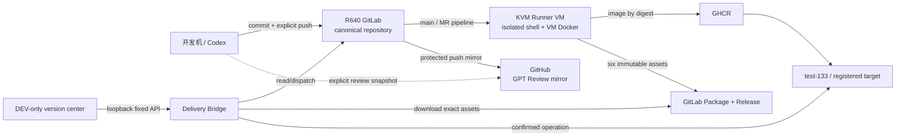

# 研发效能工作台与 CI/CD 设计 / Engineering Workbench And CI/CD Design

## 结论

本项目采用一条主链：

**R640 GitLab 代码真源与 CI/CD + 独立 KVM Runner VM + GitHub 单向 GPT Review 镜像 + GHCR digest 镜像 + GitLab Release 可移植制品 + 本地 loopback Bridge + 固定目标 operation。**

GitLab 和 GitHub 不并列承担 main CI。GitLab 负责 protected main、merge request、`CI Gate`、exact-SHA strict、Generic Package 与 Release；GitHub main 只接收 push mirror，另保留经过独立授权的 `review/gpt/**` 审查快照、审查 CI 和明确应急 release。工作台读取 GitLab 证据，不复制一套 CI 状态机。

仓库内定义不等于目标运行态已经搭建。容器、VM、域名、FRP、Runner、项目设置、变量、mirror、首次 pipeline 和备份定时器仍需分别取得远端写入与部署授权后读回。

## 拓扑与职责

| 层 | 唯一职责 | 明确禁区 |
| --- | --- | --- |
| GitLab repository | main、MR、保护规则、pipeline 与 Release 目录 | 不替代业务字段、schema、migration 或 UAT 真源 |
| Runner VM | 候选验证、一次性数据库、镜像构建与发布 | 不挂宿主 Docker socket，不保存长期业务数据 |
| GitHub mirror | GPT Review、外部只读浏览、显式应急 workflow | 不接受直接 main 写入，不自动重复主链 CI |
| GHCR | 保存按 digest 固定的 Server/Web 镜像 | tag 不能替代 manifest digest |
| Delivery Bridge | 固定 Provider、固定动作、operation 与目标执行器 | 浏览器不能传 repo、host、path、shell、SQL、Docker 或 secret |
| 研发效能工作台 | 展示证据、选择固定版本、显式确认 | 不成为 CI、部署、数据库或凭据真源 |
| test/UAT 目标 | load/pull 制品、migration、运行与 readback | 不从源码构建，不把 smoke 冒充客户 UAT |

## R640 存储与进程隔离

GitLab 的 PostgreSQL、repositories、artifacts、config 与日志放 SSD `/srv/gitlab`。RAID5 `/srv/raid5/gitlab/backups` 只放应用备份、config archive 和 checksum；RAID 能容忍部分磁盘故障，但不能替代异机/离线备份。

Runner 使用独立 KVM VM 和独立 qcow2，不直接跑在 GitLab 容器或现有业务容器旁。VM 内可以使用自己的 Docker daemon 构建镜像和启动一次性 PostgreSQL；R640 宿主 `/var/run/docker.sock` 永不传入 job。Runner cache 可重建，不作为 release、测试结果或业务数据真源。

GitLab HTTP 只绑定 R640 `127.0.0.1:8929`，由 FRP 到阿里云 `18226`，再由 Nginx 为 `gitlab.saurick.me` 终止 TLS。Git over SSH 默认只开放 LAN `192.168.0.133:2224`。详细安装、备份和公网切换见 `server/deploy/gitlab/README.md`。

## CI 主链

### main 与 merge request

`.gitlab-ci.yml` 是唯一 canonical 编排：

1. `plan` 根据 MR base、push before SHA 或手工范围建立可信 diff，先做 diff/log 检查和 gitleaks，再生成 `ci-plan`。
2. `quality` 按 plan 准备 Go、Web、Atlas、Chromium 和一次性 PostgreSQL。MR 通常走 affected；main push 对 exact SHA 建 strict terminal；需要完整门禁时走 full。
3. `CI Gate` 只在 plan 与 quality 都成功时通过，作为 protected main 的稳定 required job。

默认 `origin/main` 推送前，本地 `prepare-push` 只执行并签名 clean HEAD/tree、remote/ref/range、git-log、严格 secrets 与源码完整性短门禁，不重复 Runner 的 affected/full、数据库、浏览器、测试或构建。该回执只允许普通非强制 push，不表示 CI 已成功；Release、Package promotion 和任何受保护部署必须读回同一 40 位 SHA 的不可变终态成功 `CI Gate`。生产目标只加载 CI 构建的不可变制品或镜像并执行正式 migration、health/ready 与 smoke，禁止现场重建。

缓存只缩短依赖和浏览器准备时间，不能跳过 checksum、locked install、门禁、source archive 或 clean-tree 读回。pipeline artifacts 是本次运行证据，不等于不可变发布。

### exact-SHA release

release 只能从受保护 main 的 web/API/trigger pipeline 发起，且满足：

- `RELEASE_SHA == CI_COMMIT_SHA`；
- customer 固定 `yoyoosun`；
- 版本号符合固定合同；
- job 名固定为 `strict`，真实 provenance 为 `gitlab-ci`；
- protected environment `release` 与 masked/protected secrets 可用。

`strict` 对该 SHA 生成 v3 terminal，绑定 repository、source archive、policy、workflow、toolchain、migration、dependency lock、客户配置、分类检查数量以及 pipeline ID/IID/job/source/ref。`publish_release` 读取同一 terminal，只构建一次 Server/Web bundle，把镜像推到 `ghcr.io/saurick/plush-toy-erp-{server,web}` 并取得 digest，再上传固定六件制品：

1. `checksums.sha256`
2. `release-artifact.json`
3. `release-manifest.json`
4. `sbom.cdx.json`
5. `server-image.tar`
6. `web-image.tar`

Generic Package version 与 Release tag 固定为 `artifact-<40sha>`。已存在文件只有 SHA-256 与本地一致时才复用；同名异内容失败关闭。Release、Package、GHCR digest、manifest 和目标 promotion 必须指向同一 SHA。

## 双 Provider 边界

`scripts/deploy/gitlab-delivery-provider.mjs` 是默认 Provider，固定 GitLab base URL、项目、Generic Package、release tag、pipeline API 和本地下载根。它从服务端环境读取 `PLUSH_GITLAB_TOKEN`，限制 JSON 大小、asset 名、文件大小、URL、SHA、版本和符号链接路径，返回值不含 token。

`scripts/deploy/github-delivery-provider.mjs` 仅在服务端显式设置 `PLUSH_DELIVERY_PROVIDER=github` 时作为应急 fallback。两者实现同一 provider-neutral 合同；浏览器不知道 token，也不能选择 Provider。切换 fallback 是运维决定，不是 UI 参数。

GitLab Jobs API 当前只提供 job 级时间时，工作台展示真实 job 窗口和空 steps，不推算或伪造 GitHub 式 step timing。GitHub 历史/应急运行仍可按原合同展示。

## GitHub 单向镜像与 GPT Review

GitLab 项目使用 push mirror 将 protected main 同步到 `github.com/saurick/plush-toy-erp`。GitHub main 禁止人工直接更新；镜像凭据使用专用最小权限 deploy key/token。GitLab CE 不用受保护审查分支换取额外镜像：需要 GPT 行级审查时，由 clean main 经过既有 review receipt 和单独 push 授权，显式推到 GitHub `review/gpt`，审查完成后关闭 Draft PR 而不从 GitHub 合并 main。

`.github/workflows/ci.yml` 只响应 pull request、`review/gpt/**` 和手工运行，不响应 main mirror push，也不签发 canonical main exact-SHA terminal。`.github/workflows/release.yml` 是手工应急 release；只有 GitLab 主链不可用、操作人明确切换 Provider 且确认没有并行发布时才可运行。

GPT Review 的 finding 是审查输入，不是仓库事实。修复仍回到 GitLab main 主链，经正式测试、commit/push 授权和 pipeline 证明。

## 工作台信息架构

`/__dev/version-center` 只在 development serve 存在，继续使用同一 Delivery Bridge 与 operation store：

- 顶部区分本地候选、GitLab 不可变版本、test-133 当前版本和容量/阻塞；
- `版本与部署` 读取 GitLab Release 与 package 完整性；
- `CI/CD 效能` 展示 pipeline/job、完整发布与 exact-SHA 复用、BuildKit、制品大小、传输和目标阶段；
- `操作记录` 展示发布、promotion、rollback 和 database rebuild 的状态、幂等与脱敏事件；
- 人工接管说明明确 GitLab 主链、GitHub 只读镜像和固定操作顺序。

工作台不把本地绿色、GitLab pipeline、GitLab Release、目标 smoke、备份恢复、岗位矩阵或客户 UAT 合成一个“全部完成”。每层单独显示来源与时间；缺失或非法时间显示“未证明”。

## 目标环境与真实数据

`test-133` 仍是当前唯一可执行 target。promotion 只 load/pull 已发布 digest，随后执行固定 preflight、backup、migration、Compose、health/ready、公网 SHA 和资源读回。失败、blocked 或 `not_proven` 不自动重试。

甲方开始使用真实数据时，不清空唯一环境后继续混用。推荐：

| 环境 | 域名建议 | 数据 | 用途 |
| --- | --- | --- | --- |
| 客户 UAT | 保留既有 `admin.yoyoosun.net` 或迁为 `uat.yoyoosun.net` | 甲方受控真实数据 | 岗位试用与 UAT，不自动重置 |
| 模拟演示 | `demo.yoyoosun.net` | seed/fixture/模拟业务事实 | 开发回归、培训和可重置演示 |

两环境部署同一 release digest，但数据库、上传、Compose project、端口、备份、目标 registry、preflight 与 operation 必须独立。第二环境在正式登记前不可从工作台执行。真实资料进入客户 Private 仓或经确认的受控存储，不进入 Product Core、CI artifacts 或公开 GitHub 镜像。

## Secrets、权限与审计

- GitLab root、Runner registration token、project API token、GitHub Packages token、mirror key 和 SSH key 不入仓库、不进浏览器、不写 operation message。
- `GITHUB_PACKAGES_TOKEN` 只给 Packages read/write；`GITLAB_RELEASE_TOKEN` 只给当前项目 Release/Package 所需 API。
- main 禁止 force push；release environment、variables 和 Runner 都设 protected/locked。
- pipeline 日志不打印 token；curl 只通过 header/stdin 使用秘密。
- GitLab、Runner、mirror、Nginx/FRP 和 backup 的远端设置必须单独读回，仓库 YAML 不能替代运行证据。

## 备份、恢复和回滚

每日 GitLab backup 与 `/etc/gitlab` config archive 从 SSD 复制到 RAID5 并生成 checksum；保留策略只删除受管且超期的精确文件。在线 verify 只证明 archive 和当前应用检查；每季度仍需在一次性同版本 VM 完成 restore drill，并读回登录、clone、pipeline artifact、Generic Package 与 Release。

GitLab 升级固定镜像 digest，遵循官方逐版本路径。升级前固定当前 digest、最新验证备份和维护窗口。失败时恢复同版本容器与备份，不删除 `/srv/gitlab`、RAID5、业务数据库或现有容器。

业务发布回滚继续按 release manifest、migration 序列和客户配置源指纹判断；GitLab 回滚、代码 rollback、数据库恢复和客户配置 rollback 是四种不同动作，不能相互冒充。

## 证据分层

| 状态 | 能证明 | 不能证明 |
| --- | --- | --- |
| 仓库定义已实现 | YAML、Provider、脚本、文档和测试合同存在 | GitLab/R640 已部署 |
| 本地定向测试通过 | 受影响代码合同当前可执行 | Runner、mirror、域名、备份运行正常 |
| GitLab pipeline 通过 | 固定 SHA 的远端 QA/strict 与 artifact | 目标环境已发布 |
| Release/Package 完整 | 六件制品、GHCR digest 和 manifest 身份 | migration、health、UAT |
| target operation passed | 目标制品、migration、运行和公开入口读回 | 客户业务结果与签收 |
| 客户 UAT | 指定岗位与数据在固定版本的真实使用结果 | 下一版本或其他环境 |

## 明确不做

- 不让 R640 GitLab 容器兼任 Runner。
- 不给 Runner VM 挂 R640 宿主 Docker socket。
- 不同时运行 GitLab 与 GitHub main CI/release。
- 不在 133 或客户 UAT 目标构建源码。
- 不把 GitLab 改造成业务多租户、license、计费或客户工单系统。
- 不因双环境复制 Product Core 或字段/流程真源。
- 不以 RAID、pipeline 绿色、Release 存在或基础 smoke 替代恢复演练与客户 UAT。
