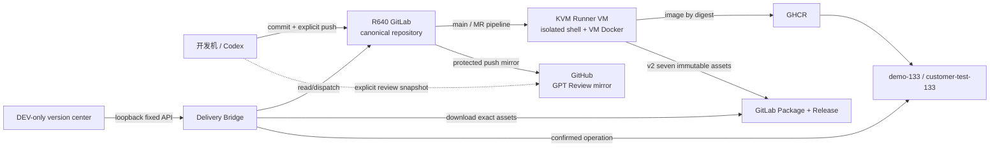

# 研发效能工作台与 CI/CD 设计 / Engineering Workbench And CI/CD Design

## 结论

本项目采用一条主链：

**R640 GitLab 代码真源与 CI/CD + 独立 KVM Runner VM + GitHub 单向 GPT Review 镜像 + GHCR digest 镜像 + GitLab Release 可移植制品 + 本地 loopback Bridge + 固定目标 operation。**

GitLab 和 GitHub 不并列承担 main CI。GitLab 负责 protected main、merge request、七分片 exact-SHA aggregate、`CI Gate`、Generic Package 与 Release；GitHub main 只接收 push mirror，另保留经过独立授权的 `review/gpt/**` 审查快照、审查 CI 和明确应急 release。工作台读取 GitLab 证据，不复制一套 CI 状态机。

R640 GitLab、KVM Runner、公网入口、protected main 和 mirror 已是实际主链，但仓库定义和历史绿灯都不能代替当前读回。每次结论仍分别绑定当前 pipeline/job、CI evidence Package、Release Package、Runner 配置、backup/restore、目标 operation 与 UAT。

## 拓扑与职责

| 层                | 唯一职责                                        | 明确禁区                                                    |
| ----------------- | ----------------------------------------------- | ----------------------------------------------------------- |
| GitLab repository | main、MR、保护规则、pipeline 与 Release 目录    | 不替代业务字段、schema、migration 或 UAT 真源               |
| Runner VM         | 候选验证、一次性数据库、镜像构建与发布          | 不挂宿主 Docker socket，不保存长期业务数据                  |
| GitHub mirror     | GPT Review、外部只读浏览、显式应急 workflow     | 不接受直接 main 写入，不自动重复主链 CI                     |
| GHCR              | 保存按 digest 固定的 Server/Web 镜像            | tag 不能替代 manifest digest                                |
| Delivery Bridge   | 固定 Provider、固定动作、operation 与目标执行器 | 浏览器不能传 repo、host、path、shell、SQL、Docker 或 secret |
| 研发效能工作台    | 展示证据、选择固定版本、显式确认                | 不成为 CI、部署、数据库或凭据真源                           |
| demo / test 目标  | load/pull 制品、migration、运行与 readback      | 不从源码构建，不共用持久数据，不把 smoke 冒充客户验收       |

## R640 存储与进程隔离

GitLab 的 PostgreSQL、repositories、artifacts、config 与日志放 SSD `/srv/gitlab`。RAID5 `/srv/raid5/gitlab/backups` 只放应用备份、config archive 和 checksum；RAID 能容忍部分磁盘故障，但不能替代异机/离线备份。

Runner 使用独立 KVM VM 和独立 qcow2，不直接跑在 GitLab 容器或现有业务容器旁。VM 内可以使用自己的 Docker daemon 构建镜像和启动一次性 PostgreSQL；R640 宿主 `/var/run/docker.sock` 永不传入 job。Runner cache 可重建，不作为 release、测试结果或业务数据真源。

GitLab HTTP 只绑定 R640 `127.0.0.1:8929`，由 FRP 到阿里云 `18226`，再由 Nginx 为 `gitlab.saurick.me` 终止 TLS。Git over SSH 默认只开放 LAN `192.168.0.133:2224`。详细安装、备份和公网切换见 `server/deploy/gitlab/README.md`。

## CI 主链

### main 与 merge request

`.gitlab-ci.yml` 是唯一 canonical 编排：

1. `plan` 根据 MR base、push before SHA 或手工范围建立可信 diff，先做 diff/log 检查和可信基线 gitleaks，再生成带 digest 的 `ci-plan` / range / trust。
2. MR 保留 plan-driven affected/full 单 job。main push 先由唯一 `prepare` cache writer 预热 locked pnpm/Playwright/Go 依赖，再由 Runner 已登记容量调度 static、Node contracts、Web、Server/PostgreSQL、resource-sensitive、browser 和 security 七个固定外部分片。Server 内部把 schema 零漂移、存量升级、普通测试/构建和关键 PostgreSQL 合同拆为四条独立 lane；只有升级与关键合同持有受管 PostgreSQL，只有普通测试/构建消费 Chromium。browser 只等待同 SHA Web build，其他分片不建人工依赖。
3. `quality_aggregate` 要求七个回执、阶段并集、分类执行数、source archive、依赖审计、`make data`、Web build digest、PostgreSQL/Chromium/browser 清理全部同 SHA 且通过，再签发标准 v3 strict terminal。
4. `CI Gate` 只在对应 main aggregate 或 MR quality 成功时通过；main push 还会把 terminal、receipt 和 manifest 固化到 exact pipeline/job/SHA 的 `plush-ci-evidence` Package，作为 protected main 的稳定 required job 和后续 release 唯一可复用证据。

默认 `origin/main` 推送前，本地 `prepare-push` 只执行并签名 clean HEAD/tree、remote/ref/range、git-log、严格 secrets 与源码完整性短门禁，不重复 Runner 的 affected/full、数据库、浏览器、测试或构建。该回执只允许普通非强制 push，不表示 CI 已成功；Release、Package 显式版本提升（Explicit Promotion）和任何受保护部署必须读回同一 40 位 SHA 的不可变终态成功 `CI Gate`。生产目标只加载 CI 构建的不可变制品或镜像并执行正式 migration、health/ready 与 smoke，禁止现场重建。

缓存只缩短依赖和浏览器准备时间，不能跳过 checksum、locked/offline install、门禁、source archive 或 clean-tree 读回。分片只 pull cache，不并发回写同一 key。pipeline artifacts 是本次运行内证据；只有 `CI Gate` 上传且经 release 服务器端重新校验的 exact Package 才能跨 pipeline 复用，仍不等于不可变 Release。

性能结论必须把 R640 宿主与 Runner guest 分开，并同时报告冷/热缓存、各 job 时长、关键路径、CPU / 内存 / IO 峰值、p50、波动和近似 p95。执行 Job 以 90 秒为目标线、120 秒为红线：90–120 秒进入优化复核，超过 120 秒进入拆分候选；但单次慢不自动拆分，必须结合近 20 次有效样本的中位数、近似 P95、覆盖边界与重复成本判断。`plan` / `prepare`、领域 fan-in、`quality_aggregate` 和 `CI Gate` 不套执行 Job 的 90 / 120 秒拆分线；排队超过 30 秒先查 Runner 容量和资源争用，不用拆 Job 掩盖等待。7–9 分钟普通 CI 与 10–15 分钟热缓存提交到部署只是阶段目标；若 guest 和宿主仍有实测余量且没有排队、IO 争用、OOM、flaky 或波动扩大，就继续调整 Runner 并发、DAG shard 和各语言测试并行度，冲刺 6–8 分钟与 8–12 分钟，稳定更快也接受。停止条件是资源饱和或复杂度收益明显失衡，不是达到某个时间；完整覆盖、fail-closed、exact-SHA、数据库/浏览器/端口隔离和清理始终不降级。

### exact-SHA release

release 只能从受保护 main 的 web/API/trigger pipeline 发起，且满足：

- `RELEASE_SHA == CI_COMMIT_SHA`；
- customer 固定 `yoyoosun`；
- 版本号由 Bridge 服务端以 `Asia/Shanghai` 日历日和当前 Release catalog 唯一推导为 `YYYY.MM.DD-N`，浏览器只读且不得手工改写；
- 可回读同 SHA 的 protected-main push pipeline、全部分片、`quality_aggregate`、`CI Gate` 与 exact evidence Package；
- protected environment `release` 与 masked/protected secrets 可用。

`publish_release` 从 `plush-ci-evidence` 恢复普通 push CI 的 v3 terminal，其 provenance job 固定为 `quality_aggregate`，不重跑 strict。`plush-release-candidate/artifact-<sha>/candidate.tar` 不存在时才构建一次 Server/Web bundle；后续重试只恢复同一 archive。同一候选包完成 migration、health/ready、smoke、备份恢复、重启恢复和零残留演练，回执在 `plush-release-rehearsal/artifact-<sha>` 冻结。只有这三层 exact 身份通过后，registry publisher 才把候选包内的同一镜像推到 `ghcr.io/saurick/plush-toy-erp-{server,web}` 取得 digest，并生成带演练 digest 的 `plush.release-manifest/v2` 与固定七资产：

创建 pipeline 时 Bridge 同时传入带时区的版本参考时刻；GitLab 在首次候选构建前重新读取 catalog，只接受与 pipeline 创建时刻相差不超过 10 分钟的同一下一版本。已冻结候选的显式重试保持原版本，不再发号；无候选且 catalog 已前进时必须新建发布，不得占用旧序号。

1. `checksums.sha256`
2. `release-artifact.json`
3. `release-manifest.json`
4. `sbom.cdx.json`
5. `server-image.tar`
6. `web-image.tar`
7. `release-rehearsal.json`

Generic Package version 与 Release tag 固定为 `artifact-<40sha>`。重试时先逐项校验现有 v2 文件的名称、大小和 SHA-256，只续传完全一致子集所缺的资产，并在创建或复用 Release 前读回完整七资产；未知文件、重复文件、同名异内容、同版本异 SHA、同 SHA 异版本或演练不完整均失败关闭。Release、Package、GHCR digest、manifest、`release-rehearsal.json` 和目标显式版本提升（Explicit Promotion）必须指向同一 SHA、同一 artifact/rehearsal digest。旧 v1 六资产只允许精确读取、展示、校验和既有回滚点兼容，`promotionEligible=false`；不得补传、重新封装或作为新版本提升输入。

## 双 Provider 边界

`scripts/deploy/gitlab-delivery-provider.mjs` 是默认 Provider，固定 GitLab base URL、项目、Generic Package、release tag、pipeline API 和本地下载根。它从服务端环境读取 `PLUSH_GITLAB_TOKEN`，限制 JSON 大小、asset 名、文件大小、URL、SHA、版本和符号链接路径，返回值不含 token。

质量门禁与版本中心读取 R640 pipeline / job、不可变版本目录、发布状态和控制制品时使用独立的 `PLUSH_GITLAB_READ_TOKEN`，不复用发布与部署写凭据。macOS 本地 `pnpm start` 可从固定钥匙串项自动加载该令牌；服务端只把它映射给不暴露发布方法的只读 GitLab Provider，浏览器、本机质量门禁进程和部署执行子进程均不得继承。创建新发布仍只使用短期 `PLUSH_GITLAB_TOKEN`；未加载时只停用该动作，不影响已有版本与流水线证据读取。实例强制的最大有效期届满前需要按同一最小权限重新登记，不能以扩大为写权限换取自动轮换。

`scripts/deploy/github-delivery-provider.mjs` 继续读取 GitHub 历史/应急 Release，并把 v1 六资产投影为只读、可回滚但不可用于显式版本提升（Explicit Promotion）。当前 GitHub emergency workflow 在 checkout、registry 登录、构建和上传前固定失败关闭；只有未来完整支持 canonical v2 七资产与同一演练回执后，才能另行恢复写入。浏览器不知道 token，也不能选择 Provider。

GitLab Jobs API 的 job `duration` 和 `queued_duration` 是运行与等待真源。工作台读取当前流水线与最近 20 次普通 push CI 的全部 job，同名重试保留最新 attempt 并单列重试次数；页面只派生中位数、近似 P95、失败与排队趋势，不另存一份 CI 历史库。GitLab 未提供 step timing 时继续返回空 steps，不推算或伪造 GitHub 式 step timing。GitHub 历史/应急运行仍可按原合同展示。

## GitHub 单向镜像与 GPT Review

GitLab 项目使用 push mirror 将 protected main 同步到 `github.com/saurick/plush-toy-erp`。GitHub main 禁止人工直接更新；镜像凭据使用专用最小权限 deploy key/token。GitLab CE 不用受保护审查分支换取额外镜像：需要 GPT 行级审查时，由 clean main 经过既有 review receipt 和单独 push 授权，显式推到 GitHub `review/gpt`，审查完成后关闭 Draft PR 而不从 GitHub 合并 main。

`.github/workflows/ci.yml` 只响应 pull request、`review/gpt/**` 和手工运行，不响应 main mirror push，也不签发 canonical main exact-SHA terminal。`.github/workflows/release.yml` 是手工应急 release；只有 GitLab 主链不可用、操作人明确切换 Provider 且确认没有并行发布时才可运行。

GPT Review 的 finding 是审查输入，不是仓库事实。修复仍回到 GitLab main 主链，经正式测试、commit/push 授权和 pipeline 证明。

## 工作台信息架构

`/__dev/version-center` 只在 development serve 存在，继续使用同一 Delivery Bridge 与 operation store：

- 顶部区分本地候选、GitLab 不可变版本、demo / test 各自当前版本和容量/阻塞；
- `版本与部署` 读取 GitLab Release 与 package 完整性；
- `流水线耗时` 展示 pipeline/job、完整发布与 exact-SHA 复用、BuildKit、制品大小和远端流水线关键路径；
- `操作记录` 展示发布制品、部署指定版本（内部 operation 为 `promote`）、回滚版本和独立数据清空重建的状态、幂等与脱敏事件，并以 URL 恢复结果、动作、目标和版本身份筛选；
- 手动操作指引明确 GitLab 主链、GitHub 只读镜像和固定操作顺序。

工作台不把本地绿色、GitLab pipeline、GitLab Release、目标 smoke、备份恢复、岗位矩阵或客户 UAT 合成一个“全部完成”。每层单独显示来源与时间；缺失或非法时间显示“未证明”。

`/__dev/quality-gates` 另外读取当前 committed SHA 的 R640 普通 push CI，动态展示 GitLab 实际返回的全部 Job，不在前端复制 Job 目录或 DAG。“本次流水线”用同一 exact SHA 的 GitLab CI Lint `needs` 生成有向图，再与实际 Pipeline Job 取交集；依赖不可读或两者不一致时只保留可靠耗时并让 DAG 失败关闭，不画推测连线。服务器门禁内部只保留“本次流水线、Job 性能、CI 历史”三个轻量切换视图，顶部同 SHA 证据摘要始终可见。Job 只按“编排、执行、汇总、终态”和领域分组投影；默认突出异常与最慢执行 Job，其余以可展开明细保留。同一 development-only API 同时返回最近 20 次普通 push CI 的 pipeline 与逐 Job 数据，便于页面和 Codex 直接读取后定位慢 Job、排队、重试和回归；GitLab 仍是唯一历史真源。该服务器证据不覆盖 Local dirty 状态或本地 full/strict 回执；只有当前干净 SHA 的 R640 普通 CI 完整通过，质量工程与版本中心才把 `releaseEligible` 提升为真。本地 strict 即使通过也只保留为 Local 回执，不能替代 protected main 证据；未登记只读 token、API 不可达或 SHA 无 push 记录时只显示不可读/缺失，不制造绿色证据。

## 目标环境与真实数据

当前可执行 target 只有 `demo-133` 与 `customer-test-133`。显式版本提升（Explicit Promotion）只 load/pull 已发布 digest，随后执行固定 preflight、backup、migration、Compose、health/ready、公网 SHA 和资源读回；它必须由使用者明确发起，`main` push 不会自动部署。失败、blocked 或 `not_proven` 不自动重试。

| 环境                       | 公网入口            | 数据与用途                                                   | 重建边界                                                            |
| -------------------------- | ------------------- | ------------------------------------------------------------ | ------------------------------------------------------------------- |
| demo / `demo-133`          | `demo.yoyoosun.net` | 项目方造数、演练、培训和回归；允许 seed/fixture/模拟业务事实 | 只走受控重建，必须保留自己的备份与回滚点                            |
| test / `customer-test-133` | `test.yoyoosun.net` | 甲方测试/验收；普通部署保留数据，新一轮测试前可显式重建      | 清理与 promotion 分开；重建前必须有可恢复备份、恢复验证和精确回滚点 |
| erp                        | `erp.yoyoosun.net`  | 未来正式生产                                                 | 当前未登记、未启用，不能从工作台执行                                |

demo 与 test 必须使用同一 release digest，但数据库、上传目录、Compose project、宿主端口、运行 env、备份、回滚点、target registry、preflight、operation 和 smoke 全部独立。demo 造数不得进入 test；test 普通 promotion 保留现有数据，显式重建不得影响 demo。根域 `yoyoosun.net` 临时 `302` 跳转到 `erp.yoyoosun.net` 只是导航行为，不把未来生产域名加入 target registry。`admin.yoyoosun.net` 退役后绝不进入 CI/CD 环境矩阵、数据清理、健康检查、发布验证或回滚流程。真实资料进入客户 Private 仓或经确认的受控存储，不进入 Product Core、CI artifacts 或公开 GitHub 镜像。

## Secrets、权限与审计

- GitLab root、Runner registration token、project API token、GitHub Packages token、mirror key 和 SSH key 不入仓库、不进浏览器、不写 operation message。
- `GITHUB_PACKAGES_TOKEN` 只给 Packages read/write；`GITLAB_RELEASE_TOKEN` 只给当前项目 Release/Package 所需 API。
- main 禁止 force push；release environment、variables 和 Runner 都设 protected/locked。
- pipeline 日志不打印 token；curl 只通过 header/stdin 使用秘密。
- GitLab、Runner、mirror、Nginx/FRP 和 backup 的远端设置必须单独读回，仓库 YAML 不能替代运行证据。

## 备份、恢复和回滚

每日 GitLab backup 与 `/etc/gitlab` config archive 从 SSD 复制到 RAID5 并生成 checksum；保留策略只删除受管且超期的精确文件。在线 verify 只证明 archive 和当前应用检查；每季度仍需在一次性同版本 VM 完成 restore drill，并读回登录、clone、pipeline artifact、Generic Package 与 Release。

GitLab 升级固定镜像 digest，遵循官方逐版本路径。升级前固定当前 digest、最新验证备份和维护窗口。失败时恢复同版本容器与备份，不删除 `/srv/gitlab`、RAID5、业务数据库或现有容器。

业务发布回滚继续按 release manifest、migration 序列和客户配置源指纹判断；GitLab 回滚、代码 rollback、数据库恢复和客户配置 rollback 是四种不同动作，不能相互冒充。

## 证据分层

| 状态                    | 能证明                                                                                                                       | 不能证明                           |
| ----------------------- | ---------------------------------------------------------------------------------------------------------------------------- | ---------------------------------- |
| 仓库定义已实现          | YAML、Provider、脚本、文档和测试合同存在                                                                                     | GitLab/R640 已部署                 |
| 本地定向测试通过        | 受影响代码合同当前可执行                                                                                                     | Runner、mirror、域名、备份运行正常 |
| GitLab pipeline 通过    | 固定 SHA 的远端 QA/strict 与 artifact                                                                                        | 目标环境已发布                     |
| Release/Package 完整    | v2 七资产、GHCR digest、manifest 与同一演练回执身份；或明确标记不可用于显式版本提升（Explicit Promotion）的 legacy v1 六资产 | migration、health、UAT             |
| target operation passed | 目标制品、migration、运行和公开入口读回                                                                                      | 客户业务结果与签收                 |
| 客户 UAT                | 指定岗位与数据在固定版本的真实使用结果                                                                                       | 下一版本或其他环境                 |

## 明确不做

- 不让 R640 GitLab 容器兼任 Runner。
- 不给 Runner VM 挂 R640 宿主 Docker socket。
- 不同时运行 GitLab 与 GitHub main CI/release。
- 不在 133 或客户 UAT 目标构建源码。
- 不把 GitLab 改造成业务多租户、license、计费或客户工单系统。
- 不因双环境复制 Product Core 或字段/流程真源。
- 不以 RAID、pipeline 绿色、Release 存在或基础 smoke 替代恢复演练与客户 UAT。
