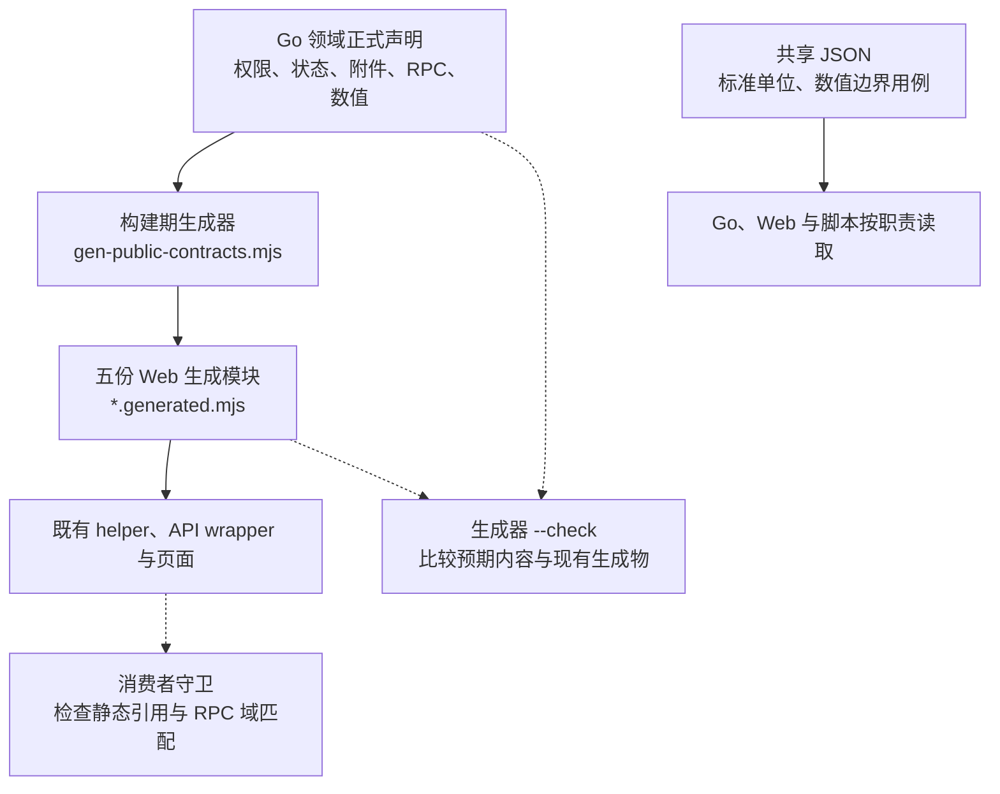
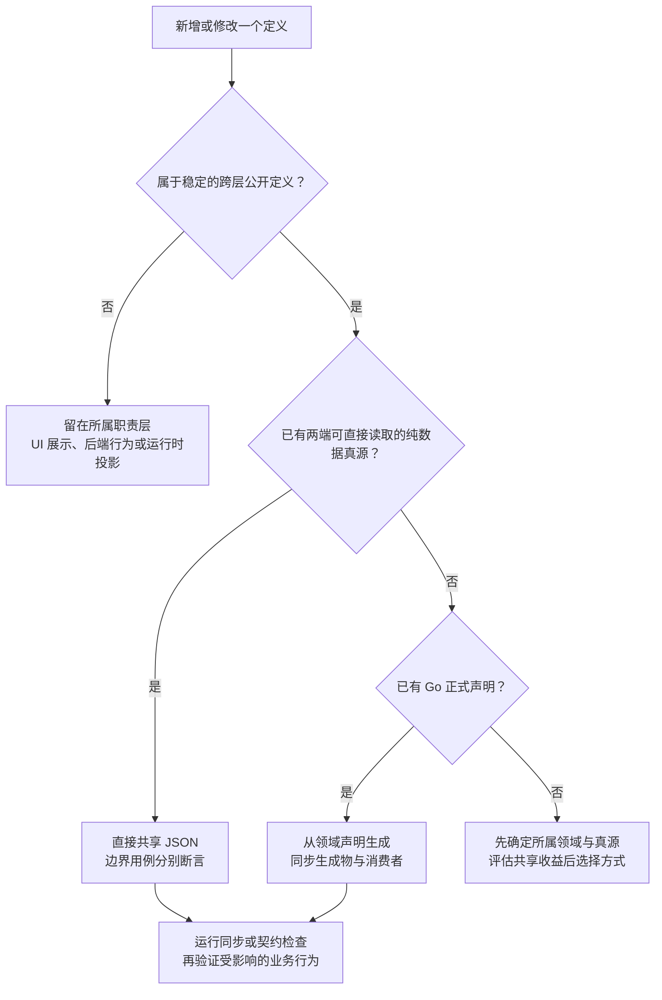

# 跨层公共契约与生成规范 / Public Contracts

本规范采用单一真源（Single Source of Truth，SSOT）与代码生成（Code Generation）。跨 Go、Web 和脚本重复使用的稳定标识、枚举与公开约束称为公共契约，由所属领域的一份真源维护，通过构建期生成或直接共享数据文件供各层使用。新增和修改契约必须同时更新消费者，并通过只读同步检查。本文面向 Codex 会话和项目维护者；实际值以表内代码为准。

优先收口多个消费者必须保持一致的稳定定义，局部常量留在所属模块。新增生成或提取逻辑应有明确的同步收益，并保持修改入口、生成结果和验证链路容易理解。

## 真源与入口 / Sources

| 契约 | 唯一维护入口 | 消费方式 |
| --- | --- | --- |
| 错误码 | `server/internal/errcode/catalog.go` | `scripts/gen-error-codes.mjs` 生成原始码表；前端 `errorCodes.js` 和 `errorMessage.js` 保留分组、岗位文案与处理逻辑 |
| 权限码 | `server/internal/biz/rbac.go` 的常量及正式权限登记 | `PermissionCode`，由 `permissions.generated.mjs` 提供；继续使用既有权限 helper |
| 业务状态 | `server/internal/core/status/**`；业务层 Workflow、OperationalFact、StockReservation、OutsourcingOrder、ProductionOrder 的正式声明 | `statuses.generated.mjs` 按领域分别导出；前端保留显示文案、颜色和场景分组 |
| 附件公开约束 | `server/internal/biz/business_attachment.go` | `AttachmentPolicy` 提供大小限制和扩展名到 MIME 的对应关系；上传选择器和预检派生集合 |
| RPC 域与方法 | `server/internal/service/jsonrpc_dispatch.go` 及域 handler 的实际分发 | `RpcDomain`、`RpcMethod`，由 `rpcMethods.generated.mjs` 提供；前端 API wrapper 继续校验请求和响应 |
| 十进制范围 | `server/internal/core/value/numeric.go` | Go parser、单位校验和生成的 `NumericContract` 共同引用精度、位数及最大值 |
| 数值边界用例 | `server/internal/core/value/testdata/numeric20scale6.json` | Go 服务接口、业务正数校验和前端数值 helper 分别验证同一批输入 |
| 标准单位目录 | `server/internal/unitpolicy/units.json` | Go embed 与 Web 直接读取；业务数量仍使用已保存的单位精度 |
| 账号外观偏好 | `server/internal/biz/admin_erp_appearance.json` | Go embed 与 Web 直接读取允许的明暗模式、主题色、密度、表格线条及默认值；色值与文案由前端消费层维护 |
| 数据库文档 | Ent 生成结构及 `server/docs/database/table-catalog.json` | `server/cmd/schema-doc` 生成数据字典并检查漂移 |

公共契约由 `scripts/gen-public-contracts.mjs` 调用 `server/cmd/public-contracts`，使用 Go AST 读取实际声明，不启动业务服务、不连接数据库。五份生成物位于 `web/src/common/consts/*.generated.mjs`，随源码提交；正式 Web 制品不需要 Go 或生成器。

生产 Web 直接导入的服务端 JSON 同时属于镜像构建输入。新增或调整这类导入时，同步 `server/Dockerfile` 的共享 Web 构建阶段和 `web/Dockerfile`，在构建前按原相对位置复制文件。`release-artifact-bundle.test.mjs` 从生产源码提取这类依赖并校验两处复制合同；实际 Docker 构建仍单独验证，仓库内 Vite 构建通过不能替代镜像构建。

下图展示五类公共契约的生成路径，以及纯数据的直接共享路径。实线表示生成或消费，虚线表示只读检查；错误码与数据库文档使用表中各自的生成入口。



生成器只支持当前明确的声明形态。重复值、名称冲突、缺少目录和不支持的表达式必须失败；RPC 的条件分发还须验证方法谓词与目标 handler 的集合一致。调整源代码结构时一并更新提取器和反例测试，不以忽略错误或正则猜测跳过登记。

## 选择共享方式 / Choosing A Mechanism

新增或修改定义时，先用下图判断共享方式，再按表格核对职责边界。共享的是稳定定义；后端授权、业务执行和运行时配置仍按各自主路径处理。



| 情况 | 做法 |
| --- | --- |
| 现有 Go 代码拥有规则，两端需要相同标识或静态值 | 从正式声明生成前端常量，不再维护手写镜像 |
| 两端都能直接消费的一份纯数据目录 | 共享 JSON，沿用单位目录做法；不为共享而添加运行时查询或缓存 |
| 页面文案、颜色、布局和场景提示 | 留在消费层，以生成 key 建立映射；用覆盖测试检查遗漏 |
| 权限、状态流转、来源归属、事务和真实业务事实 | 留在后端正式 usecase / repository；前端常量和显隐不构成授权或过账依据 |
| 客户配置和当前登录人的有效权限 | 继续读取正式运行时投影，不能用构建期目录替代当前配置和授权 |
| 两端有意不同的输入行为 | 共享边界值和测试向量，分别校验各自职责；不为统一代码而放宽接口 |

不同领域即使使用相同的 `DRAFT`、`CANCELLED` 或 `done`，也保持独立枚举和流转规则。当前生成目录覆盖任务、业务进度、销售订单、采购订单、委外订单、生产订单、采购入库、退货、入库调整、质检、库存批次、出货、业务事实及库存预留。触达相应业务判断时引用所属枚举；不把同名动作、看板分组或页面状态机械替换成业务状态。

附件契约描述服务端可接受的文件。产品图片的前端压缩目标可以更小；本地打印图片处理也有自己的渲染限制。按各自用途保留这些规则，服务端继续检查实际文件内容、归属和权限。

数值用例显式记录 `rpcAccepted`、`positiveAccepted` 和 `uiNormalized`。例如 `1,234.50` 可在页面整理为 `1234.5`，原始带逗号文本不能直接提交接口；负数是否可用由业务操作决定。修改精度涉及数据库时，仍必须执行正式 schema / migration 和存量升级验证流程。

## 命名 / Naming

| 对象 | 约定 |
| --- | --- |
| 技术术语 | 本规范统一使用“公共契约 / Public Contracts”；采购、委外等业务文件继续使用“合同” |
| 文件与入口 | 命令入口沿用 `gen-public-contracts.mjs`、`public-contract-consumers.mjs` 和 `server/cmd/public-contracts`；Web 生成模块按职责命名并保留 `.generated.mjs` 标记 |
| 导出名称 | `PermissionCode`、各领域的 `…Status`、`AttachmentPolicy`、`NumericContract`、`RpcDomain` 和 `RpcMethod` 表达各自职责；测试源码解析工具沿用 `publicContractSource.mjs` |
| 标识成员 | 枚举成员采用大写下划线，RPC 方法按实际域名分组；标识值、大小写及 `CANCELED` / `CANCELLED` 的领域拼写以正式声明为准，改变它们须按接口或数据变更验证 |

## 版本边界 / Version Boundaries

本项目统一构建和发布。页面、组件、helper、执行器、内部目录和配置模块按职责命名，代码修订由 Git commit / release 身份追踪；不为普通模块维护独立版号，也不为假设的未来兼容预置版本字段。共享定义需要唯一真源，不自动需要独立版本体系。

| 对象 | 版本处理 |
| --- | --- |
| 同次构建内的函数、组件、目录与内部数据结构 | 同步修改生产者、消费者和测试；不增加模块版本计数 |
| 跨发布持久化或由独立读写者交换的数据格式 | 只有实际存在不兼容识别或解释问题时才保留格式版本；集中在必要的读写边界，不逐层给内部对象重复编号 |
| 代码新鲜度、配置内容和验收证据身份 | 复用已有 commit、内容摘要、配置 revision、批次身份和逻辑指纹；不新增并行计数器，不因纯文案或代码重构递增数据批次 |
| BOM、包装、工艺路线修订、并发控制与数据库迁移 | 按业务冻结、CAS 和迁移追溯规则管理；业务修订号、`expected_version` 和 migration 序号不属于模块版号 |
| 外部协议、依赖包与独立发布制品 | 遵循外部接口或制品合同，内部模块不复制其版本计数 |

新增或保留格式版本前，在对应设计或变更说明中交代实际生产者 / 消费者、跨发布或独立读写边界、不兼容差异，以及为什么现有结构校验或身份摘要不足。仅改常量名、加 `schemaVersion` 字段，或已经写入过回执，均不能证明版本设计必要；命名门禁通过也不代替这个判断。

客户配置的 `packageKey`、`catalogKey` 是稳定身份，不带人工修订序号。正式、local-test 和 customer-trial manifest 的 revision 由 `customer-config-runtime-manifest.mjs` 的同一函数生成：排除 revision 自身，对完整 manifest 的对象键排序后取 SHA-256 的前 24 位，保留数组顺序，并加客户及用途前缀。预览、权限、流程选择、目录或目标标记改变都会生成新 revision；配置哈希仍由后端规范化发布输入计算，用于不可变校验和切换 CAS，二者职责不同。

启动读取数据库已激活配置，核对客户、用途、目标和 product / dataset 配对，以及明确的运行环境开关；不得用源码里维护的“当前 revision / 上一 revision”白名单决定能否启动。已发布记录和快照保持不变，新发布必须走内容 revision、当前登记数据合同和原有 validate / publish / transition / activate / readback 链路。配置修订不自动推进模拟数据批次，正式数据更新也不自动推进结构格式版本。

回滚、重试激活已发布配置和密码轮换按冻结记录核验，不套用新发布的 revision 命名或内容生成规则。manifest 审阅证据、配置执行器、读回摘要及完成检查须同时覆盖这条路径；保存的 manifest 摘要、后端原记录的客户 / 用途 / 目标、product / dataset 配对、内容哈希、状态与切换 CAS 仍须成立。试用配置切换与轮换仍须符合当前登记数据合同；允许启动读取历史记录不代表允许切换到另一数据批次。不能用重命名旧记录或新增“上一版”列表修复回滚。凭据轮换保留该操作实际读取的配置身份，交付回执必须与同目标 smoke 读回一致，不能与当前源码重新编译的配置身份比较。

同次构建的 DEV 摘要、会话、计划、工具 / 恢复状态、环境合同、操作投影和 CI / 压力报告外层响应使用稳定 `kind` 区分类型，并继续校验结构、目标、CSRF 和操作身份；不单独维护响应版本。远端 CI 报告由本地适配器投影给页面时，外层投影也属于同次构建，不能借用内部报告的持久化理由保留计数。落盘 operation、readback、幂等索引、执行锁、报告、发布 / 回滚回执及数据库 migration 仍按各自读写合同核实，不能与外层 HTTP 响应一起机械删号。现有 `config_hash_version` 和持久化模块快照字段属于单独的存储清理范围，删除前须核对哈希、回放与存量转换，不能只改字段名。

`scripts/qa/phase-label-boundaries.mjs` 在现有 fast 门禁中阻断配置包 / 目录人工计数、试用配置上一版白名单、未登记的 `plush.dev-*` 格式号及 DEV 门禁目录 / 治理投影的编号；不按有限响应名称匹配，新增临时对象也必须受检。该脚本的持久化清单只保留当前跨进程 / 跨构建读取的操作、readback、幂等及锁文件；新增或改变格式必须核对真实读写者，不能自行套用通用例外。移除这些现存格式前须证明未结束操作恢复、重复执行保护及原回执回放不受损。配置回归覆盖内容变化 / 不变、键顺序、用途隔离、跨配置启动、冻结身份回滚与轮换、错误目标 / 标记及回执不一致。新增其他版本字段仍须完成本节的语义判断，不能把正则未命中当成设计获准。

清理存量时，先检查持久化值、哈希输入、幂等重放、审计与回滚消费者。无必要的内部计数直接删除并同步调用方；影响真实存量时通过受控迁移或一次性转换收敛，不静默改写已冻结数据或已执行 migration，不删除有效回执，也不为未采用实验保留 alias、fallback 或多套实现。尚不能安全移除的字段须说明具体数据依赖与后续处置条件，不能把暂时保护存量变成永久保留模块版本的理由。

## 修改步骤 / Maintenance

1. 定位字段或标识的所属领域及现有声明；优先扩展该真源。只有生成器不能读取现有正式声明时，才补有明确范围的提取逻辑。
2. 修改真源与必要的业务实现、权限登记或状态流转测试。新增公共值须保持含义明确、无重复；删除或改名时同步全部实际消费者。
3. 在仓库根目录生成，并检查 diff。生成文件不能手改，不通过测试运行自动改写它们。

   ```bash
   node scripts/gen-error-codes.mjs
   node scripts/gen-public-contracts.mjs
   ```

4. Web 使用 `PermissionCode.SHIPMENT_READ`、`WorkflowTaskStatus.DONE`、`RpcDomain.INVENTORY`、`RpcMethod.inventory.LIST_INVENTORY_LOTS` 等导出值。请求包装、用户提示和业务动作仍沿用现有 helper；不扩展完整 DTO 生成或通用状态机。
5. 运行同步与引用守卫，再按受影响领域运行测试。以下命令不修改生成物、不写数据库：

   ```bash
   node scripts/gen-error-codes.mjs --check
   node scripts/gen-public-contracts.mjs --check
   node scripts/qa/public-contract-consumers.mjs
   node --test scripts/gen-public-contracts.test.mjs
   ```

6. 涉及生成器时在 `server/` 运行 `go test ./cmd/public-contracts`。数值契约变动还要运行 Go 的 `TestJSONRPCNumericSharedVectors`、`TestPositiveNumericSharedVectors` 和 Web `numeric20Scale6.test.mjs`，按业务影响补单位精度、舍入及 API 回归。交付说明真源、消费者、生成结果、实际验证与盲区。
7. 来源、生成、消费或检查路径变化时，同步本文图示并验证 Mermaid 语法与标签。图形选用、层级与复杂度沿用[可视化表达规范](可视化表达规范.md)，具体值由真源和生成物维护。

## 自动守卫 / Gates

`fast.sh` 的仓库检查校验两类生成物，fast Node 组执行公共契约及消费者测试。检查只读；CI 缺少生成物或出现漂移必须失败，不在 CI 自动生成后当作通过。

`phase-label-boundaries.mjs` 在 fast 仓库检查及 affected 文件检查中阻断已知阶段文案、内部目录计数和可明确识别的模块版号命名，覆盖 HTML。它保留格式标识、业务版本、外部协议与历史证据；不凭 `V` 加数字判断所有字符串，也不自动改写文件。新增格式版本是否必要仍按上面的版本边界核实。

消费者守卫用 ESLint 的语法树检查 `web/src` 中非测试、非生成的 JS / JSX / MJS：阻断手写已登记权限值、直接权限调用中的未知值、无效生成常量、已识别 JsonRpc 客户端的手写域／方法，以及方法与客户端域不匹配。测试保留字面量作为独立预期。动态方法分发仍须有对应 wrapper 和行为测试，静态扫描不宣称证明所有运行路径。

状态显示目录的覆盖与业务含义由对应测试检查；所有状态流转、RBAC、响应完整性和附件内容测试继续保留。生成物一致只能证明标识和静态值同步，不替代这些行为验证。
