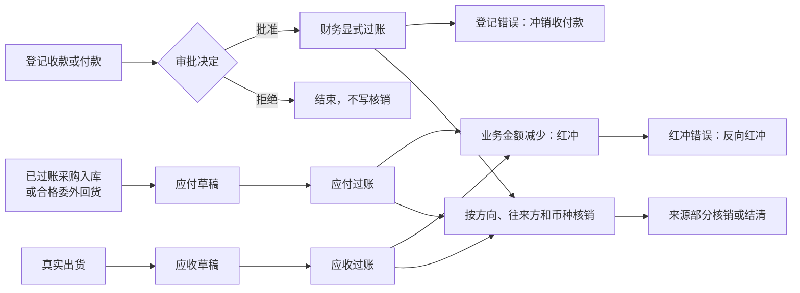

# 财务 v1 / Finance v1

## 当前定位

财务 v1 分成两类正式对象：

- `finance_facts`：保存来源可追溯的应收、应付、发票和单笔核对。
- `finance_payments / finance_allocations / finance_credit_notes`：保存真实收付款、跨多条来源的核销分配、冲正和红冲审计。

Workflow 只负责申请、审批、导航和协同引用；任务完成不能替代应收、应付、发票、收付款、核销或红冲过账。当前 V1 是人工登记业务回单 / 凭据的收窄财务事实链，不是银行、总账、税控或完整会计系统。

本文面向财务办理、产品设计、开发和验收人员。先读第 1～3 节统一业务词义、主流程和设计原因，再用后续章节核对正式对象、状态、权限、页面和验证边界。本文解释财务 V1 的业务语义，不替代[当前真源与交接顺序](../当前真源与交接顺序.md)、[产品能力进度台账](../product/产品能力进度台账.md)、代码、migration、测试或目标环境读回。

## 1. 核心名词

下表解释的是这些词在本系统财务 V1 中的准确含义；会计、税务、银行或其他系统可能使用同名术语，但不能据此扩大本系统能力。

| 名词 | 本系统含义 | 不表示 |
| --- | --- | --- |
| 应收 | 真实出货后，由客户支付的业务金额；客户、币种、金额和账期来自正式出货 / 销售快照 | 销售订单金额已经收款，或财务放行已经产生应收 |
| 应付 | 已过账采购入库，或质量合格 / 让步接收的已过账委外回货所形成的待付金额 | 采购订单、入库协同任务或委外回货草稿已经形成付款义务 |
| 往来方 | 当前财务事实或收付款绑定的客户 / 供应商；核销时必须与来源保持同一主体 | 可临时填写、可跨客户或供应商混用的名称文本 |
| 过账 | 让草稿或已批准对象正式生效并进入业务余额、生命周期和审计计算 | 已生成会计凭证、进入总账或完成银行处理 |
| 对账 / 单笔核对 | 对一条已过账应收、应付或发票留下显式核对记录 | 真实收款、付款、核销或应收 / 应付余额结清 |
| 收款 / 付款 | 财务人工登记的真实收付业务记录，包含方向、往来方、币种、金额、账户摘要、凭据引用和发生时间 | 银行直连流水、支付平台回执或 Workflow 任务本身 |
| 核销 | 把一笔已批准收付款在过账时分配到匹配的应收或应付，减少对应来源的未核销金额 | 删除来源、修改来源原金额或完成对账 |
| 部分核销 | 一条应收 / 应付可以只核销部分金额并保留余额；一张收付款过账时，其自身金额仍必须全部分配到一条或多条来源 | 可以把收付款的一部分长期留在 V1 中作为未分配资金 |
| 未核销金额 / 结清 | 未核销金额按有效核销分配、冲正、红冲和反向红冲计算；归零时该应收 / 应付进入 `SETTLED` | 银行、税控、会计凭证或总账工作全部完成 |
| 冲销收付款 / 收付款冲正 | 两种说法在本系统指同一个反向动作：对错误的已过账收付款追加反向分配，恢复来源未核销金额并保留原收付款和分配记录；正式页面使用“冲销” | 删除或覆盖原收付款 |
| 红冲 / 反向红冲 | 红冲用于调减应收 / 应付业务余额；红冲错误时再追加反向红冲恢复余额 | 税控红字发票、总账红字凭证或物理删除原事实 |
| 审批 | 对收付款来源对象（FinancePayment Source）作批准或拒绝决定；批准后仍由财务执行岗位显式过账 | 批准时已经写入核销分配或结清读模型 |
| 发票 | 基于已出货来源登记的业务发票事实，并记录业务发票类别 | 税控开票、电子发票平台回执或总账凭证已经完成 |

## 2. 财务主流程

财务 V1 有两条先独立、后连接的链：应收 / 应付从正式业务来源生成，收付款从人工业务凭据登记；只有收付款完成审批并由财务显式过账时，核销分配才把两条链连接起来。

一笔收款只能核销同一客户、同一币种的应收；一笔付款只能核销同一供应商、同一币种的应付，不能在同一次分配中混用应收和应付。

1. **应收路径**：仓库确认真实出货后，财务从出货来源生成应收草稿并过账；财务放行或 Workflow task done 都不能替代真实出货和应收过账。
2. **应付路径**：采购入库已过账，或委外回货已过账且质检达到合格 / 让步接收后，财务从该来源生成应付草稿并过账。
3. **收付款路径**：财务登记收款 / 付款并启动审批；拒绝后不写核销，批准后仍须由财务执行岗位显式过账，分配合计必须等于本次收付款金额。
4. **发票与对账旁路**：发票和单笔核对都从正式来源生成，但它们不自动登记收付款，也不代替核销。
5. **纠错路径**：收付款登记或分配错误时冲销收付款（领域规则中也称收付款冲正）；应收 / 应付业务金额需要调减时红冲；错误红冲再走反向红冲。三种动作都保留原记录。

例如：一条应收原金额为 1,000 元，本次登记收款 600 元。收付款过账时必须把这 600 元全部分配到匹配来源；应收仍有 400 元未核销，所以尚未结清。以后再收并核销 400 元才结清。若前一笔 600 元收款登记错误，应冲销该笔收付款；若原应收业务金额应减少 100 元，则对该应收红冲 100 元。

## 3. 为什么这样设计

| 设计选择 | 业务原因 | 主要防止的问题 |
| --- | --- | --- |
| 应收、应付和发票只能从正式来源生成 | 财务金额必须能追溯到真实出货、采购入库或合格委外回货 | 自由填写金额、重复生成、来源不明 |
| Workflow 审批与财务过账分开 | “同意办理”只是决定，财务岗位仍要核对凭据、候选来源和分配金额后执行 | 把任务完成误写成真实收付或结清 |
| 收付款与核销分配分开保存 | 一笔款可能对应多条来源，一条来源也可能被多次部分核销 | 无法表达多单核销、部分核销和剩余余额 |
| 收付款金额必须全部分配，但来源允许部分核销 | V1 不维护独立的未分配资金池，同时允许应收 / 应付分次结清 | 款项去向不明或把“部分核销”误解成部分款未分配 |
| 核销限制同方向、同往来方、同币种 | 收款和付款、不同客户 / 供应商、不同币种不能直接互相抵消 | 跨主体、跨币种或收付方向错误的核销 |
| 收付款冲销（冲正）、红冲和反向红冲都追加记录 | 余额变化必须能还原原因、操作人和前后关系 | 删除或覆盖历史后无法审计 |
| 服务端事务内锁定并复核状态、版本和余额 | 页面看到的候选和余额可能在提交前被其他操作改变 | 并发重复、超额核销和部分成功 |
| 金额统一使用六位小数精确值 | 采购、委外和跨来源分配需要稳定精度，页面提示不能替代服务端计算 | 浮点误差、前后端余额不一致 |
| V1 明确排除银行、总账和税控 | 当前只承接人工业务凭据和收窄财务事实链 | 把业务记录误报成完整会计或外部支付闭环 |

## 4. 对象与正式来源

| 对象 | 正式来源 / 入口 | 当前边界 |
| --- | --- | --- |
| 应收 `RECEIVABLE` | 已出货的出货单 | 客户、币种、金额和账期由出货 / 销售快照派生；同一出货单只能有一笔有效应收 |
| 应付 `PAYABLE` | 已过账采购入库；质量已合格或让步接收的已过账委外回货 | 供应商、币种和金额由正式来源派生；采购退货 / 调整影响应付金额 |
| 发票 `INVOICE` | 已出货的出货单 | 创建时选择业务发票类别；不表示税控开票完成 |
| 单笔核对 `RECONCILIATION` | 已过账应收、应付或发票 | 记录一条来源的显式核对；不代表真实收付 |
| 收款 / 付款 `FinancePayment` | 财务人工登记收付款单、账户摘要和凭据引用 | `RECEIPT` 只分配应收，`DISBURSEMENT` 只分配应付；不从 Workflow 自动生成 |
| 核销分配 `FinanceAllocation` | 收付款过账时选择多条候选来源 | 必须同一往来方、同一币种、方向匹配；允许部分核销，不能超过款项或来源可核销余额 |
| 红冲 `FinanceCreditNote` | 正式页面从已过账 / 已结清应收或应付发起 | 保留原事实并追加红冲；错误红冲用反向红冲纠正，不删除或改写原记录 |

## 5. 来源、金额和唯一性

- 出货来源必须是 `SHIPPED`；财务放行或 Workflow task done 不能生成应收或发票。
- 应收读取销售订单冻结的 `payment_term_days`；未填写账期时拒绝新建，不从付款方式自由文本猜测。
- 采购应付来源必须是 `POSTED` 入库并具有稳定供应商；历史记录无法唯一确定供应商时 fail closed。
- 委外应付必须来自 `POSTED` 回货，并且恰有一张有效质检达到 `PASSED + PASS / CONCESSION`。
- 单笔核对只从已过账且未取消的应收、应付或发票生成；它和真实收付款核销是两个对象。
- 收付款单必须明确方向、往来方、币种、金额、账户摘要、凭据引用、发生时间和稳定幂等意图。
- 收付款过账会锁定付款单和候选财务事实，在同一事务写分配并更新结清余额；方向、往来方、币种、状态、余额或版本任一不匹配就整体失败。
- 收付款冲正追加反向分配，恢复来源可核销余额并保留原收付款 / 分配审计。
- 红冲追加独立 credit note；反向红冲再追加一条关联记录，不物理删除或覆盖原单。
- 应收 / 应付、核销明细和红冲列表统一从正式分配与 credit note 计算当前未核销金额，使用六位小数精确值；页面预校验只用于及时提示，过账 / 红冲写入仍由服务端在事务内重新锁定并核对余额。
- `fact_type + source_type + source_id` 的有效来源事实唯一约束与事务内复核共同阻止重复生成。

## 6. 状态与生命周期

| 对象 | 状态 | 允许主路径 |
| --- | --- | --- |
| FinanceFact | `DRAFT / POSTED / SETTLED / CANCELLED` | 草稿 → 过账 → 结清；应收 / 应付的有效核销或红冲被正式冲销时，余额恢复会使 `SETTLED → POSTED`；符合依赖条件时可取消 |
| FinancePayment | `DRAFT / APPROVED / REJECTED / POSTED / REVERSED / CANCELLED` | 草稿 → 批准 → 过账并核销 → 必要时冲正；审批可拒绝，未过账且符合 ProcessRuntime 依赖时可取消 |
| FinanceAllocation | `POSTED / REVERSED` | 随收付款过账生成；随收付款冲正追加反向审计 |
| FinanceCreditNote | `POSTED / REVERSED` | 红冲 → 反向红冲 |

页面状态只能解释对应对象，不能混写：应收 `SETTLED` 表示业务余额已结清，不表示银行流水、税控、会计凭证或总账已经完成。`SETTLED → POSTED` 不是通用“重开”动作，只能由收付款冲销或反向红冲等正式余额变化触发；单笔核对和发票不能借此改写状态。

## 7. 权限边界

- 应收、应付、发票和单笔核对继续使用各自 read / confirm 权限。
- 收付款使用独立 read / create / approve / post / reverse 权限；老板 approval 与财务执行权限分离，红冲使用独立 create / reverse 权限。
- 页面隐藏按钮不是安全边界；JSON-RPC 和 usecase 必须继续校验模块、精确权限、状态、版本、来源、余额和幂等。
- 客户角色是否可见收付款页，取客户 active revision、客户菜单和 Product Core RBAC 的交集；Core 内置角色拥有能力不等于每个客户自动获得。
- `finance_payment_approval` 已接正式批准 / 拒绝与财务执行节点；老板 approval 只改变 FinancePayment Source，财务完成执行任务后仍须显式 post，才写 FinancePayment、Allocation 和结清读模型。

## 8. 页面显示与办理

| 页面 / 区域 | 主要内容 | 用户动作 |
| --- | --- | --- |
| 应收 | 客户、出货来源、金额、币种、账期、状态 | 从已出货来源创建、过账、核对；不显示供应商字段 |
| 应付 | 供应商、采购入库 / 委外回货来源、金额、币种、状态 | 从正式来源创建、过账、核对 |
| 发票 | 客户、出货来源、金额、发票类别、附件、状态 | 从已出货来源创建和过账；不冒充税控 |
| 单笔核对 | 往来方、被核对记录、金额、币种、差异说明、状态 | 对一条来源做业务核对；不登记收付款 |
| 收付款与核销 | 服务端分页 / 筛选的收付款记录、方向、往来方、币种、金额、账户摘要、凭据、候选来源、来源原金额、当前未核销金额、分配详情、审批和状态 | 登记并启动审批；批准后由财务显式过账和多单分配，错误付款另行冲正 |
| 红冲处理 | 服务端分页 / 筛选的红冲记录、来源财务事实、来源原金额、当前未核销金额、红冲金额、原因、状态和反向记录 | 登记红冲或反向红冲 |

页面展示业务编号与名称，不显示数据库 ID、权限 key、原始 source 字段、API 方法或幂等键。历史空值显示“历史未记录”，未知枚举显示“待核对”。

## 9. 当前已知边界

- 不含银行直连、银行流水导入、自动认领、支付平台凭证、会计凭证、总账、多账簿、成本会计或税控；当前业务凭据只保留受控引用，不冒充外部支付回执。
- 一笔收付款只能在同一往来方和同一币种内分配，不做跨主体、跨币种自动换汇。
- 正式页面和服务端 `CreateFinanceCreditNote` 都只允许应收 / 应付作为红冲来源；发票、付款、核对及其他类型即使已过账也会拒绝，错误红冲通过反向红冲纠正且不改写原记录。
- 收付款账户当前是摘要引用，不是受管理的银行账户主数据；凭据引用也不是支付平台回执。
- 客户配置、目标 migration、目标角色 smoke 和客户财务 UAT 必须逐客户验证，不能由 Product Core 本地绿色替代。

## 10. 验证门槛

| 层级 | 必须覆盖 |
| --- | --- |
| Biz / Repo | 方向、往来方、币种、金额、部分核销、多来源分配、超额、重复来源、幂等、version、冲正、红冲和反向红冲 |
| JSON-RPC / RBAC | 未登录、disabled、无权限、模块禁用、非法 success、并发 / stale、结果未知重试 |
| PostgreSQL | 同事务过账与分配、并发余额、防重复、冲正恢复和不可变审计；SQLite 定向测试不能替代该层 |
| 页面 | 候选只显示方向 / 往来方 / 币种匹配且当前余额大于零的来源；覆盖服务端分页、六位小数金额、参考资料失败不清空业务列表、部分金额、详情、失败恢复、冲正、红冲和内部 ID 隐藏 |
| 客户配置 | 菜单、六项新权限、字段 / 动作投影和 effective session 逐客户读回 |
| 目标环境 / UAT | 固定 release、migration、账号 allow / deny、浏览器办理、业务凭据和客户签收 |
