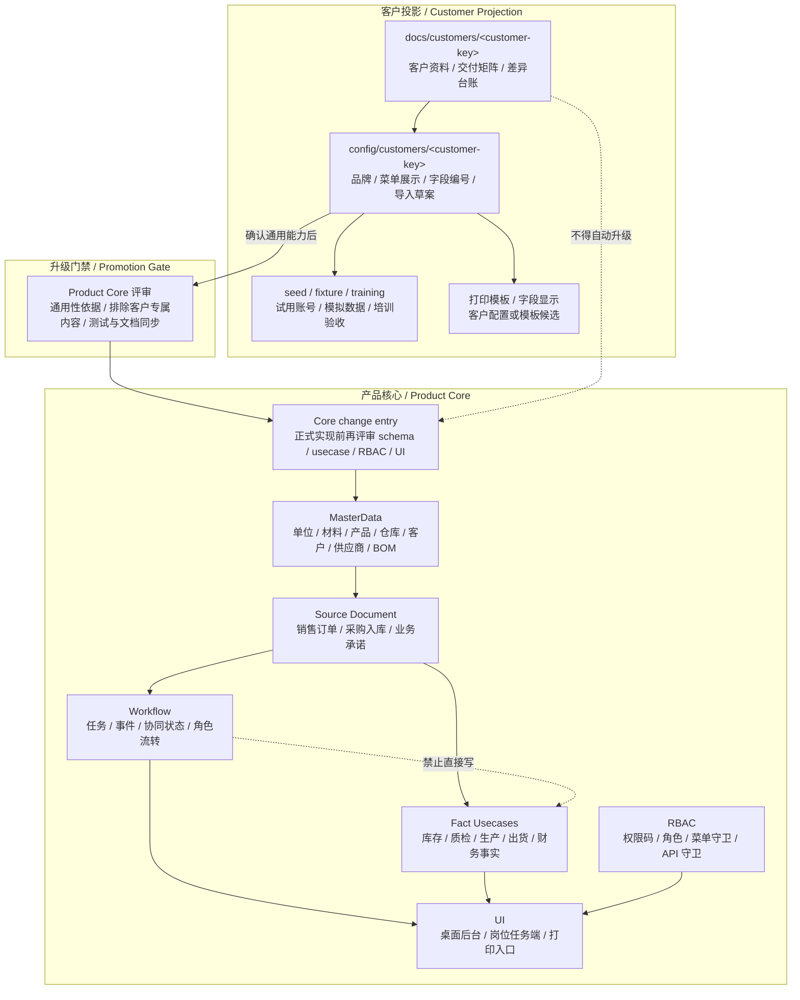

# 模块边界 / Module Boundaries

## 核心边界

| 边界 | 正式口径 |
| --- | --- |
| Workflow task done != Fact posted | 协同任务完成不等于库存、出货、质检、财务事实落账 |
| `shipment_release done -> shipping_released` | 出货放行只表示已放行 / 可发货 / 待出库 |
| `shipping_released != shipped` | 已放行不等于已出库、已发货、已扣库存 |
| Quality task done != quality_inspection passed | 协同任务完成不等于质检事实判定通过 |
| `business_records` 不替代事实表 | 它是通用快照和兼容层，不是库存、出货、财务事实真源 |
| 永绅 yoyoosun 客户资料不等于 Product Core | 只有经过架构评审并通用化的能力才能进入产品内核 |

## 产品核心与客户投影 / Product Core And Customer Projection

上图只描述归属边界，不新增 runtime loader、schema、migration、RBAC 权限码或菜单入口。客户资料要进入产品核心，必须先完成通用性评审；Workflow 到 Fact 的虚线是禁区提示，不是调用关系。

## Workflow 协同层 / Workflow

Workflow 只负责：

- 协同任务。
- 任务事件。
- 业务状态推进。
- 必要的协同任务派生。
- 许可和职责流转。

WorkflowUsecase 禁止直接写：

- `inventory_txns`
- `inventory_balances`
- `shipments`
- `stock_reservations`
- AR / AP
- invoice
- payment

## Fact 事实层 / Fact

Fact 层记录真实业务发生：

- 入库。
- 出库。
- 库存流水。
- 库存预留。
- 质检判定。
- 出货。
- 应收 / 应付。
- 发票。
- 收付款。

事实层必须有状态机、幂等、审计和冲正边界，不能靠 UI 状态或 workflow payload 伪造。
