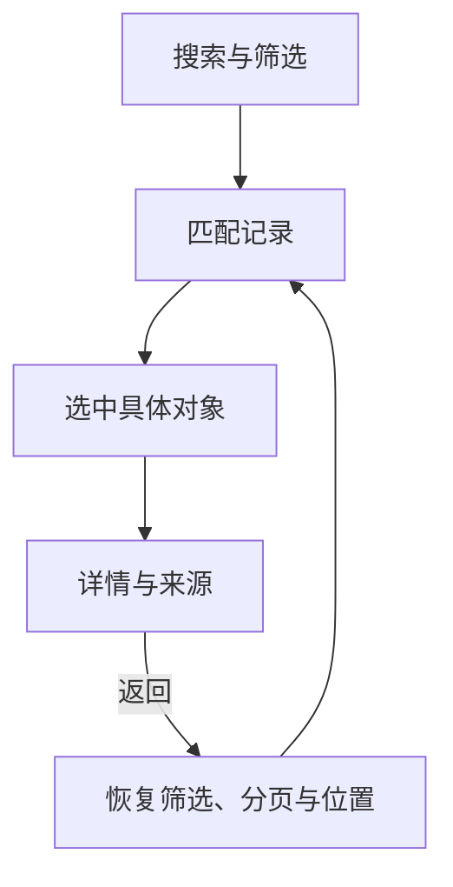
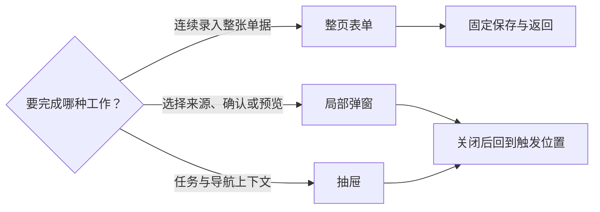
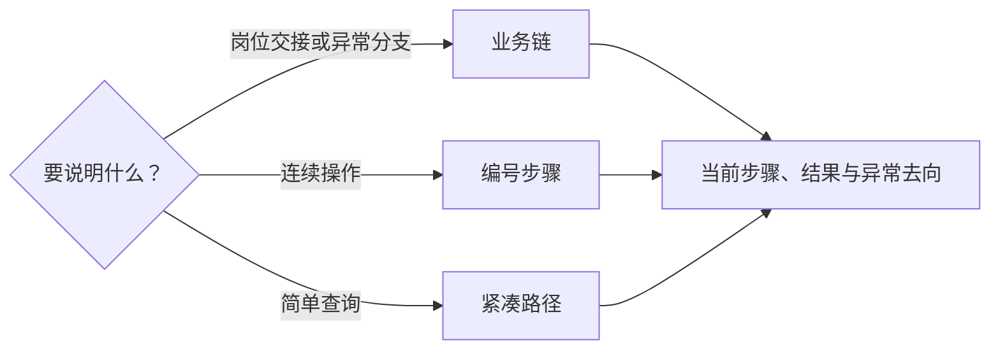
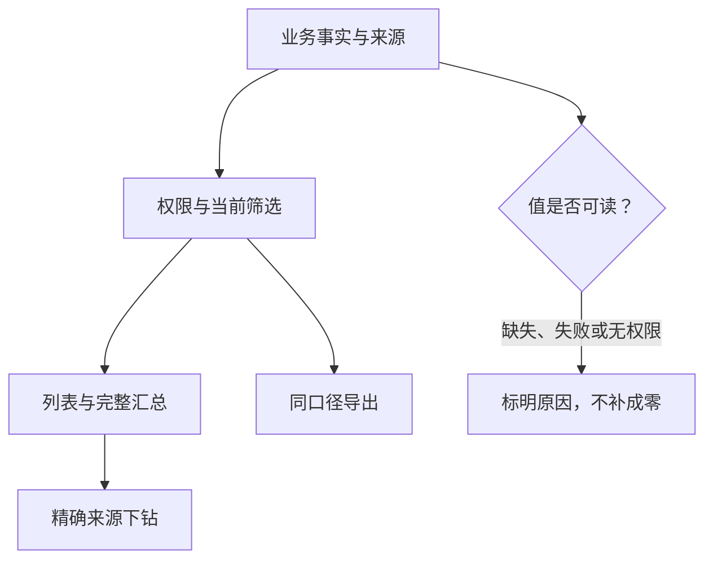
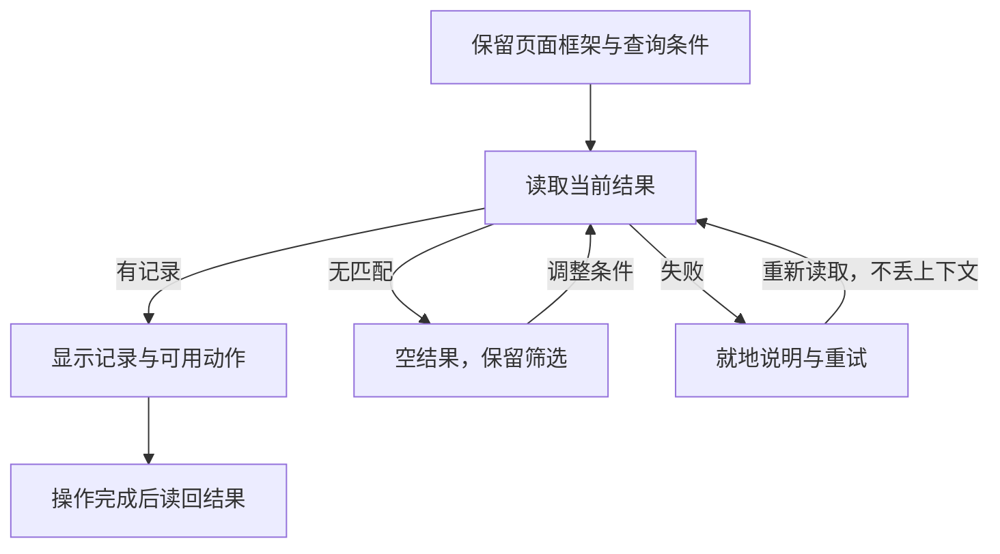
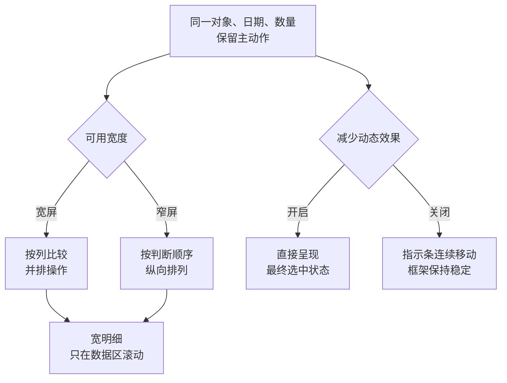
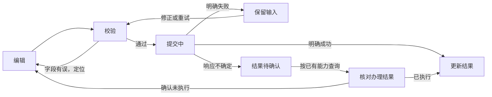
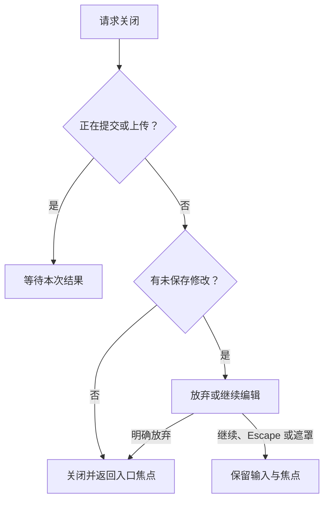

# ERP 交互设计说明 / ERP Interaction Specification

本说明定义统一 UI 的操作合同。读者是实现、测试及产品维护者；页面使用者只看到业务对象、状态和可执行动作。唯一交互参照为 [最新 HTML](index.html)，选择依据见 [设计依据](设计依据.md)。

## 图解阅读 / Illustrated Reading

先用图解理解机制，再按章节查完整规则。所有样例调整只影响讲解，不修改个人外观或正式页面。

1. **找主题**：在目录搜索布局、状态或规则，每次阅读一个主题。
2. **试变化**：点击图中位置或操作样例，观察布局与状态；尺寸对照和视觉分层在“设计依据”中体验。
3. **查规范**：切到“规范原文”，核对当前主题的具体条件。
4. **继续阅读**：主题、章节和搜索词保存在 URL 中，刷新及前进后退可恢复。

| 想弄清楚什么 | 阅读位置 |
| --- | --- |
| 页面由哪些区域组成，尺寸用在哪里 | “页面骨架”图解；“高保真视觉合同”章节 |
| 为什么采用当前边距、密度、颜色和层次 | [设计依据：空间与密度](设计依据.md#spacing-and-density)、[平面与层次](设计依据.md#flat-and-hierarchy) |
| 标题、状态、数量为什么这样排列 | “文字与对齐”图解；[设计依据：排版与阅读路径](设计依据.md#type-and-alignment) |
| 怎样下钻、选容器、恢复失败、核对来源及适配窄屏 | 对应主题的样例与关系图；具体业务见本说明及[可交互稿](index.html) |

| 图解内容 | 唯一来源 |
| --- | --- |
| 下钻、容器、恢复、来源和响应式关系图 | 直接读取本说明对应章节 |
| 206px 侧栏、48px 顶栏、12px 页面边距 | `web/src/erp/styles/app/design-tokens.css` |
| 64px 收起侧栏 | `web/src/erp/styles/app/business-responsive.css` |
| 操作区内边距、页签、表格 | 对应共享布局、导航和表格样式 |

尺寸使用 CSS 像素；截图的物理像素还受浏览器缩放与 DPR 影响。

### 控件设计：在主内容区操作样例

“可交互设计”内的五个入口共用同一条导航：业务界面、效能工作台、登录页、岗位帮助、控件设计。控件设计由 `/__dev/ui-design?page=controls` 直达，在主内容区阅读和操作，不使用总览抽屉承载整套规范。

| 区域 | 内容与行为 |
| --- | --- |
| 左侧目录 | 按用途选择弹窗与反馈、页签与视图、筛选与搜索、按钮与动作、空白与错误；支持搜索 |
| 当前示例 | 只渲染当前分类的共享组件；弹窗、消息、提交和恢复沿用正式组件 |
| 阅读辅助 | 三步核对、场景对照表、图解与设计依据入口；共享实现按需展开 |
| 状态恢复 | `control` 与 `controlq` 分别保存分类和搜索；刷新、前进后退恢复阅读位置 |
| 重置与主题 | 重置当前区域的样例；浅深模式只影响控件预览，不写账号偏好 |
| 页面预览 | 四类 HTML 预览仍可下载和全屏；切入控件设计保留原预览现场 |

目录和正文独立滚动。筛选计数与列表使用同一份虚构记录；示例不执行业务写入或真实上传。

## 高保真视觉合同 / Visual Contract

以最新 HTML 的外观和操作路径为基准，正式页面接入真实数据与权限，并补齐异常、恢复和键盘路径。尺寸调整须核对实际可用空间，不自行恢复旧绿色卡片或扩大留白。

### 1. 先核对布局尺寸

| 部位 | 当前尺寸 | 用途与边界 |
| --- | --- | --- |
| 桌面侧栏 | 展开 206px；收起 64px | 展开读名称，收起给业务内容让出宽度 |
| 顶栏 | 48px | 移动导航、刷新、外观、账号等全局操作 |
| 页面边距 | 12px | 隔开壳层与工作内容 |
| 独立操作区 | 上下 10px、左右 12px；1px 边框、10px 圆角 | 最外层统一承载切换、搜索、筛选和摘要；内部不重复套卡片 |
| 操作区到数据区 | 9px | 保持条件与结果相邻、职责可辨 |
| 桌面输入框与按钮 | 高 34px、圆角 8px | 密度切换不改变命中范围 |
| 业务卡片与表头 | 圆角 10px；表头高 40px | 数据卡片裁切内部内容，圆角外保持页面底色 |
| 表内顶部内容 | 上方 10px、左右 12px | 共享顶部插槽提供；页签和说明不重复叠加 padding |
| 主表与卡片边缘 | 上方 10px、左右 12px | 表头、单元格继续保留各自内边距 |
| 业务分区标题 | 竖条宽 3px、高 15px、圆角 2px | 主题色竖条、完整文字、浅色横线；窄屏不压缩竖条，标题可换行 |

分区标题本身不暗示可点击；只有可折叠区域显示展开箭头。标题动作放在横线右侧。

### 2. 标题与导航各做什么

| 元素 | 应展示 | 应避免 |
| --- | --- | --- |
| 页面主标题 | 对象名称，必要状态、视图或主动作 | 顶栏与内容区重复同名标题 |
| 顶栏当前位置 | 仅在页面没有独立主标题时显示 | 重复解释用途、所属模块及“不办理哪些业务” |
| 风险与说明 | 在对应字段、确认或正文中说明异常、提交后果和证据范围 | 长期占据模块页签旁的说明 |
| 设计稿标记 | 版本与样例范围放在外层查看器或证据上下文 | 在模拟品牌栏、顶栏重复标签 |
| 侧栏顺序 | 工作中心、常用工作优先，其余按业务模块、工具与查询、系统与帮助直接显示 | “更多功能”折叠及同模块重复入口 |
| 侧栏超高 | 在侧栏内滚动，进入页面和刷新后保持选中 | 将整个页面撑高 |
| 收起按钮 | 品牌栏右侧切换展开 / 收起 | 收起后丢失选中态或全部模块入口 |
| 收起状态 | 隐藏品牌文字、业务分组标题；保留图标和完整名称提示 | 将桌面收起状态带到手机文字抽屉 |

同级模块使用稳定的线性图标，绑定模块身份，不随岗位授权或默认页面改变：

| 模块 | 图标 | 模块 | 图标 |
| --- | --- | --- | --- |
| 基础资料 | 资料库 | 销售 | 购物袋 |
| 产品工程 | 结构图 | 采购 | 购物车 |
| 委外 | 双向协作 | 生产 | 工具 |
| 库存 | 收纳箱 | 质检 | 盾牌勾选 |
| 出货 | 货车 | 财务 | 账本 |

工作台、任务、进度、工具和系统入口也各有独立图标。展开、收起和手机抽屉复用相同图标，菜单名称保留为可访问名称。

**“全部模块”的操作顺序：**

1. 从侧栏底部打开，焦点进入搜索。
2. 按功能名称或业务分组查找当前账号可用页面；合并模块内页面也可直达。
3. 选择后关闭目录，跳转沿用未保存保护。
4. 关闭恢复焦点，重新打开清空搜索；状态模拟控件仅用于设计评审。

### 3. 颜色、内容面和浮层

| 层次 | 浅色 | 暗色 |
| --- | --- | --- |
| 默认主题色 | `#0a66c2` | 随所选主题采用浅色强调色 |
| 页面底色 | `#f2f5f3` | `#050607` |
| 侧栏与顶栏 | 共享壳层变量 | `#080a0c` |
| 内容面 | 白色 | `#0d1013` |
| 浮层 | 共享浮层变量 | `#121619` |
| 弱分组 | 共享分组变量 | `#151a1f` |
| 分隔线 / 边界 | `#dce4df` | `#2a3138` |

1. 电脑、手机、效能工作台共用这些层次；卡片间隙沿用页面底色，不用半透明白色叠底。
2. 暗色保持中性黑阶，侧栏、内容、卡片与浮层靠明度和边界区分，不压成同一块黑。
3. 主题色用于选中、悬停、焦点和主动作；状态色保留业务语义，不随换色改变含义。
4. 暗色主按钮用浅色强调底与近黑文字；黄色主按钮也使用深色文字，不残留固定绿 / 蓝底块。
5. 吸顶工具栏和固定操作区使用不透明背景，滚动内容不能穿透；弹窗、抽屉、筛选和列设置同样随主题变化。
6. 打印纸张及模板缩略图的纸面保持白底；外围导航、工具栏和预览容器随主题变化。

### 4. 页签、表格与密度

| 顶部切换部位 | 数值与行为 |
| --- | --- |
| 整组 | 高 38px，外圆角 9px，内边距 3px，中性边框 1px |
| 单个选项 | 高 30px，内圆角 6px，字号 14px，左右内边距 12px |
| 背景顺序 | 页面底色 → 操作区内容面 → 中性浅底轨 → 主题浅色选中块 |
| 选中与未选 | 选中块保留中性细描边；未选项透明 |
| 承载区域 | 独立导航必须有操作区内容面；已在内容面内部的布局才可透明 |
| 共享范围 | 财务、生产、工作台、进度、权限等同类切换；底层只保留路由、键盘和状态语义差异 |
| 暗色与吸顶 | 使用对应深色变量；吸顶保持不透明，不残留白底 |

不保留独立白色页签、白色滑块或通栏底线。切换、选择器、搜索和说明沿同一阅读边缘排列。

| 表格事项 | 规则 |
| --- | --- |
| 字体 | 系统中文字体，正文 13px |
| 标准 / 紧凑密度 | 行高基准 52 / 42px；单元格上下留白 9 / 4px；长内容可撑高 |
| 密度覆盖 | 桌面业务列表、任务、权限矩阵、操作记录和效能工作台数据表 |
| 编辑表 | 单据、BOM、联系人只收紧留白，保留输入与校验空间 |
| 密度不改变 | 表头、按钮、筛选、卡片、手机页面与打印纸面尺寸 |
| 阅读对齐 | 文字从阅读边缘对齐，数量 / 金额右对齐；表头沿对应列对齐 |
| 表头分列 | 浅色标题带与完整竖向分隔，帮助区分每列 |
| 排序与操作 | 排序紧邻列名，当前排序用主题色，焦点清楚；排序、记录选择、明细展开各自命中 |
| 列设置 | 集中在工具栏，保留已有能力，不另加常用列切换 |
| 表格线条 | 默认“简洁”横线；“网格”给数据及合计单元格加 1px 中性淡竖线 |
| 线条偏好 | 与主题色、密度独立保存；保留排序、选择、展开、固定列滚动 |
| 专用版式 | 已有带边框表、编辑明细、手机卡片、打印版式保留自身设计 |

列表从上到下依次是：**页名 / 视图 / 只读摘要 → 状态 / 搜索 / 筛选 / 整表动作 → 当前记录操作 → 表格 → 分页**。

### 5. 宽表怎样滚动

每张宽表使用**顶部两个方向按钮 + 底部一条细拖动条**；横向滚动始终留在数据区。

| 时机或部位 | 行为 |
| --- | --- |
| 显示条件 | 同时存在数据和横向溢出才显示；到边界后禁用对应方向 |
| 顶部按钮 | 主表复用工具栏；无工具栏的明细使用紧凑按钮组 |
| 底部细条 | 不重复放箭头、百分比或说明；表尾留独立空间，避开分页 |
| 纵向滚动中 | 隐藏细条并暂停定位 |
| 纵向停止约 180ms | 按表格当前可视底边重新定位并显示 |
| 横向滚动或拖动中 | 细条保持可见 |
| 翻页加载 | 复用控件并保留表格占位高度；临时隐藏细条、禁用按钮 |
| 数据返回 | 恢复实际高度，在绘制前定位，避免清空数据时页面回跳 |
| 空结果 / 末页 | 空结果取消占位和横向控件；末页按实际行数收缩 |
| 悬停、键盘聚焦、拖动 | 轨道与滑块从 6px 加粗到 10px；外层高度保持 24px |
| 原生滚动条 | 启用细条时隐藏同区原生横向条；表底、最右端也只保留一条 |
| 固定表头与纵向滚动 | 表头和内容滚动边界一致；纵向条继续可用，保留原滚轮、拖动及键盘操作 |

### 6. 日期、弹层与筛选

| 日期操作 | 规则 |
| --- | --- |
| 点击文字、留白、日历图标 | 均打开共享日期面板；禁用时不响应 |
| 选择与清空 | 日期筛选选中或清空后立即更新结果，不另设确定、应用或查询按钮；单日期选中后收起日历 |
| 键盘与日期时间 | 可聚焦操作；日期时间保留直接录入 |
| 日期时间回填 | 选择日期、小时或分钟立即回填；面板保持可继续调整，不等待点击确定或关闭后才写入字段 |
| 快捷选项 | 由业务字段配置，不混用截止时间和发生时间的选项 |
| 日期范围 | 同一组件管理日期类型、开始、结束；三者各自有边界、焦点和错误反馈，用“至”连接 |

| 关闭情形 | 结果 |
| --- | --- |
| 普通弹窗点击遮罩、按 Escape、关闭或取消 | 退出，恢复原页面状态与焦点 |
| 二次确认遮罩 | 等同继续编辑 / 取消，保留输入 |
| 保存、上传、执行中 | 禁止遮罩关闭 |
| 法务确认、断连恢复等必须处理的门禁 | 保持阻断，不能通过遮罩绕过 |

| 手机筛选与刷新 | 规则 |
| --- | --- |
| 条件层级 | 常用状态与搜索直达；低频条件放筛选浮层，当前查询可见 |
| 选择 | 即时生效并保持打开；排序 / 状态、记录范围 / 其他关注共用分段控件 |
| 重置 | 只恢复当前浮层条件，保留主搜索 |
| 点击外部 | 只关闭筛选并恢复触发焦点，保留已选条件；同一次点击不触发底下卡片、搜索或导航 |
| Escape | 先关闭内层选择器，再关闭筛选；键盘可依次操作 |
| 刷新 | 不设常驻刷新按钮；下拉重取当前查询，失败保留同查询已加载结果并提供重试 |

表单与详情继续保留各自的未保存、返回和权限边界。

### 7. 外观偏好怎样保存

| 入口 | 可选内容 |
| --- | --- |
| 桌面、规则页、效能工作台 | 点击外观按钮直接打开同一设置弹窗：蓝 / 绿 / 黄 / 粉 / 橙 / 紫、明暗 / 跟系统、标准 / 紧凑、简洁 / 网格 |
| 手机“我的 → 显示设置” | 只显示明暗模式和主题色；卡片保持统一布局 |
| 登录页“外观设置” | 只显示主题色和明暗模式 |

1. 选择即时生效并自动保存，弹窗底部“关闭”只收起设置。
2. 登录后随账号保存，换设备后恢复；未登录时只保存在当前浏览器，退出后恢复浏览器外观。
3. “跟系统”在每台设备按本机偏好决定明暗；手机修改主题不改写桌面密度和线条。
4. 保存中显示简短状态，失败就地提示重试。提示固定在桌面弹窗底部或手机设置区，不挤动选项、弹窗和相邻卡片。

### 8. 手机、空结果与工作台

| 位置 | 应呈现的内容 |
| --- | --- |
| 手机操作区 | 搜索、页签、筛选外沿用页面底色；圆角控件外不垫白色矩形；吸顶栏不透明 |
| 手机数据区 | 任务、已办、风险、进度、我的及详情 / 办理 / 回执共用页面底色；卡片、输入、浮层、固定导航使用内容面 |
| 手机列表 | 任务管理内常驻待办 / 已办 / 流程跟踪切换，其下显示当前列表的搜索、筛选、状态与任务卡；左右 12px、卡片圆角 16px，不重复大标题或说明区 |
| 手机任务卡 | 任务、状态、来源、产品和时间；详情查完整字段并复制，真实产品图可预览；任务和风险共用红色通知角标 |
| 手机“我的” | 头像、姓名、账号；显示设置、入口与安全、系统信息、退出直接可达；多岗位沿用已有导航 |
| 管理员手机查看 | 默认“全部岗位”，单行“查看岗位”可选有效岗位，保留“管理员视角”标识；只改变读取范围，不冒充员工或改变责任，各环境一致 |
| 效能工作台 | 复用壳层、字体、底色和主题；总览、产品工程、质量验证、交付运行各有职责，技术流程按需查看 |

| 空状态部位 | 标准 |
| --- | --- |
| 电脑、手机待办 / 已办 / 风险 / 超时、效能工作台 | 简洁收纳图标，14px 中性文字、22px 行高，居中 |
| 尺寸 | 图标高 40px，文案间隔 10px；上下留白 24px、左右 16px |
| 下拉候选 | 图标缩为 28px，留白 12px |
| 语义与动作 | 普通空结果不用警示色或虚线框；保留场景文案与筛选，只在可用时显示清除条件或新建 |

版本发布的手动指引按需展示 Git `index.lock` 判定图，保留活动 owner、证据隔离、候选复核及继续收口路径，不在首屏常驻。

### 权限管理

以已确认的高保真骨架、控件和操作路径为 UI 基准，现有能力补入同一布局。真实岗位、权限、账号、审批责任、数据范围和保存结果来自正式 API；样例数量及未实现动作不进入正式页面。

#### 权限页如何分区

| 区域 | 内容 |
| --- | --- |
| 顶部工具栏 | 岗位设置、员工账号、审批责任、岗位导航横排；搜索和当前主动作同一行 |
| 主卡片 | 约 260px 岗位侧栏 + 工作区 |
| 工作区首行 | 岗位信息、保存 |
| 下一行 | 授权摘要、改动摘要、展开 / 收起 |
| 功能区 | “业务对象 × 操作”二维表；业务域可折叠，对象为行，查看 / 新建 / 编辑为固定列 |
| 专有动作 | 工程用料审核、批准采购、激活、确认、取消、红冲等保留完整名称，逐项勾选，不合并泛化 |
| 表头与对象列 | 滚动中保持可辨认；对象和动作来自现有元数据，搜索不重命名对象 |
| 不可操作格 | 无独立权限显示“—”；被筛选隐藏的操作显示“…”并说明，不补造勾选项 |
| 底部设置栏 | “可访问 N 页”、岗位导航、仓库范围；说明通过帮助按钮查看，不另套常驻卡片 |
| 仓库范围 | 仅指定仓库时显示多选；结果保持单行，完整清单在下拉中查看 |
| 保存与短窗口 | 状态在卡片底部；保留权限表可操作高度，辅助设置可滚动到达，保存按钮可见 |
| 敏感字段 | 表内独立成组；头部入口查看当前范围与关联账号 |
| 窄屏 | 同一勾选状态改为对象分组列表；常规操作留列名，专有操作换行，岗位横向选择，底部自然换行 |

边界、底色、焦点和选中态均取系统主题变量。

#### 从勾选到保存

1. 按名称、业务分类或页面搜索，可只看已选、展开或收起；筛选不改变勾选。
2. 分组复选框显示全选 / 部分选中；“全选结果 / 清空结果”只作用于当前结果，保留页面与操作依赖。
3. 与已保存设置比较，标记新增 / 撤销；点击改动摘要核对完整清单。
4. 岗位导航与岗位设置共用一份草稿及“保存岗位设置”，两视图切换不丢修改。
5. 切换岗位、员工账号或离开时执行未保存保护；成功读回后清除改动标记。

系统内置岗位只读；当前不提供新建、复制岗位或自建审批规则。

#### 岗位导航与页面访问

| 视图 | 核对什么 | 保存或恢复 |
| --- | --- | --- |
| 菜单排列 | 每模块一个入口，常用工作 1–5 个，其余按业务模块、工具与查询、系统与帮助分组 | 同区可上移、下移或移到常用 / 其他入口 |
| 多页模块 | 默认页面只列该岗位获准页面 | 再次进入恢复最近访问；系统推荐可恢复布局，仍在同一草稿保存 |
| 固定位置 | 工作中心、历史记录、帮助 | 不随菜单整理改变 |
| 页面访问 | 按正式业务域逐页列最终结果，可按模块和可进入 / 不可进入筛选 | “岗位授权”与“页面访问”分列，后端有效访问结果决定可进入 |
| 受限原因 | 服务端原因码说明核对方向 | 不猜测公司配置具体限制项 |
| 技术依据 | 顶部紧凑来源说明；配置版本按需看，功能 / 操作表默认收起 | 不混用模块数、入口数和页面数 |
| 手机 | 菜单单列、按钮可触达；访问表内部横向滚动 | 筛选与排序保留键盘操作 |

设计稿使用虚构样例，不读写正式岗位配置。

#### 员工账号与审批责任

| 操作 | 位置或规则 |
| --- | --- |
| 员工搜索、状态、创建 | 顶部工具栏 |
| 创建 / 修改资料 | 主内容区整页表单；返回保留列表条件，未保存可继续或放弃 |
| 分配岗位、重置密码、账号状态 | 专项弹窗 |
| 数据范围 | 仅全部仓库、指定仓库、不允许查看 |
| 审批责任 | 三项既有审批的条件与责任，统一“保存并生效”；在途流程使用启动时条件和责任 |

| 审批条件 | 判断方式 |
| --- | --- |
| 销售、采购默认 | 全部审批 |
| 按金额审批 | 选择币种与审批起始金额；等于门槛也需审批 |
| 门槛为 0 | 恢复全部审批 |
| 切回全部审批 | 清空原金额和币种 |
| 销售金额 | 订单总额，含税费及约定运费 |
| 采购金额 | 明细金额合计 |
| 其他币种或金额不全 | 仍需人工审批 |
| 出货财务确认 | 保持全部审批 |

列表显示条件摘要。弹窗确认后仍需页面“保存并生效”；取消弹窗、放弃草稿及保存结果待确认沿用恢复交互。免审提交的回执和轨迹显示“按规则免审”，生效由后端结果确认。

## 登录 / Login

登录页先辨认公司和工作方式，再验证账号；工作方式与验证方法分层展示。

| 部位 | 设计规则 |
| --- | --- |
| 卡片 | 居中单卡，桌面宽度上限 456px，圆角 10px |
| 输入与按钮 | 高 44px，圆角 8px |
| 品牌与外观 | 标题和外观按钮同行；长公司名自然换行 |
| 窄屏与软键盘 | 收紧边距；短屏或键盘占位时允许整页纵向滚动 |
| 主题 | 背景、文字、边框、主按钮使用共享变量 |
| 工作方式 | “电脑版／手机版” |
| 验证方法 | “密码登录／短信登录”；短信能力以服务端为准，未开通只显示密码 |
| 切换条 | 不同控件层级，持续挂载；方向键、选中态、共享滑动动效可用 |
| 品牌和入口开关 | 来自现有配置；实际岗位、可用入口和原页面返回由登录结果及路由合同决定 |

**输入与提交顺序：**

1. 账号、手机号保留自动填充语义；密码显示可用键盘操作，大写锁定只作即时提示。
2. 切换方法清空密码和验证码；修改手机号清空旧验证码及发送提示。
3. 发码前校验手机号；提交中锁定表单、工作方式和验证方法，阻止重复请求。
4. 失败保留可修正的输入；离开后迟到响应不得导航或写会话。
5. 浏览器只沿用工作方式、登录方法及既有短信倒计时偏好，不增加记住密码或岗位自选。

| 核对入口 | 边界 |
| --- | --- |
| `/__dev/ui-design?page=login` | 与业务界面共用同一 HTML；演示登录进入对应电脑 / 手机界面，退出回登录页 |
| 演示账号与验证码 | 只在隔离页面工作，不发送真实短信 |
| 正式登录 | 沿用既有认证接口和两份规则页面 |

## 页面结构 / Page Structure

先确定当前任务，再选择承载容器；下钻与返回必须保留原工作上下文。

### 1. 查找与返回的主线

### 2. 根据任务选择容器

| 完整查看对象 | 容器 | 共同要求 |
| --- | --- | --- |
| 销售、采购、加工、采购入库 | 单据详情弹窗 | 从当前记录进入；明细总数与分页留在完整查看中 |
| 出货、生产订单、BOM | 完整只读页面 | 查看与编辑各有入口；列表不另放明细条数展开列 |
| 返回列表 | 恢复来源页面 | 保留原查询、选择及列表位置 |

| 页面族 | 首要任务 | 必要结构 |
| --- | --- | --- |
| 登录 | 验证账号，选择工作方式 | 客户品牌、电脑 / 手机、密码或已开通短信、校验反馈、登录与规则链接 |
| 工作台 | 找到应先处理的事项 | 待办、逾期、阻塞可进入队列；慢读取不阻塞框架，统计注明范围 |
| 任务与进度 | 核对责任、来源、下一步 | 列表 / 看板共享筛选；核对上下文、选动作、填原因、提交并读回 |
| 业务列表 | 查找、比较、选择对象 | 紧凑筛选、排序、稳定选择、分页、当前记录操作 |
| 新建与编辑 | 连续完成一张单据 | 整页分组字段，明细内横向滚动，固定保存 / 返回；局部来源与确认用弹窗 |
| 详情与来源 | 查信息、追溯依据 | 摘要、真实明细、附件、关联入口、可见状态；返回恢复位置 |
| 库存与财务事实 | 查已发生数量 / 金额 | 来源、单位、币种、余额；写入仅走已支持的确认、取消、冲正、调整或核销 |
| 主数据与权限 | 维护资料和责任 | 复用现有字段 / 权限码；启停、引用、禁用原因明确，不提供假入口 |
| 打印、附件、导入、审计、帮助 | 业务辅助 | 复用现有合同；结果、失败、重试和来源可追溯 |
| 手机岗位任务 | 在有限屏幕交接 | 高频筛选直达，一处搜索；同级视图记忆条件，列表按批追加，失败保留已加载结果 |

### 3. 列设置：选择、保存、恢复

1. 表头只放字段名与适用排序，不在每列重复省略号。
2. 权限允许、适合逐行核对的业务列都进入“列设置”；支持显隐、排列、全部显示、恢复默认，至少保留一列。
3. 点击**完成**才将显隐和顺序一起保存到当前账号的对应列表。
4. 关闭弹窗放弃本次调整；保存失败保留草稿供重试。
5. “全部显示”可保存并跨刷新保持；“恢复默认”恢复页面推荐列及顺序，仍需点击完成。

| 字段或存储 | 规则 |
| --- | --- |
| 默认常显 | 销售订单联系人、客户及供应商简称 |
| 按需显示 | 英文品名、海关编码、税务拆分、收货地址、唛头、BOM 补充信息、质检辅助字段 |
| 共用入口 | 销售、工程材料、委外加工汇总；短表和录入明细直接保留任务必需字段 |
| 权限优先 | 字段权限与策略先于个人偏好；个人隐藏不改变详情、导出、打印 |
| `admin_users.erp_preferences` | 个人列偏好的唯一既有存储 |
| `column_orders` | 完整记录已选列范围与排列 |
| `hidden_columns` | 记录已选范围中的隐藏列；恢复系统默认时两项一起清空 |
| 新增 / 失效列 | 新列使用自身默认显隐，旧列优先沿用个人选择；忽略失效标识 |
| 浏览器缓存 | 不读取未隔离账号的列顺序缓存 |

### 4. 任务标题、卡片和看板

| 区域 | 默认内容 | 点击与恢复 |
| --- | --- | --- |
| 工作台与任务分类列表 | 产品 / 物料名为主，任务名以较弱文字并排；保留图片、编号、关联数量和来源 | 行与标题打开同一详情；无关联内容仍用任务名作入口，并显示关联失效提示 |
| 概览与手机待办 / 已办 / 风险 / 超时卡 | 沿用同一标题层级，长标题换行；保留状态、岗位、风险原因、入岗与截止时间 | 每卡一个详情入口，不再叠加进入处理 / 查看任务 / 查看结果或装饰箭头 |
| 图片与复制 | 图片独立预览，完整字段和复制在详情查看 | 点图、复制不触发行级打开；Enter / Space 打开，Escape 关闭后回原任务 |
| 任务管理概览 / 分类表 | 点击分类或“查看列表”进入完整列表，切回恢复卡片 | 搜索和岗位条件保留；两视图进入同一任务抽屉，权限、原因校验、回执不变；分类列表独立显示负责岗位与承接方式，转交只选择同岗位合格人员 |
| 手机已办 | 整卡查看处理结果 | 返回保留分类、筛选和列表位置 |

任务列表、详情和复制摘要统一显示“进入岗位：岗位名 · 时间”，岗位取任务记录的负责岗位，时间取任务创建时间；管理员跨岗查看也使用同一口径。缺少岗位时仅显示“任务生成”时间，不从当前账号或展示快照推测岗位。

### 5. 经营统计：查询和分页

| 位置 | 内容或状态 |
| --- | --- |
| 进度看板顶部 | 经营统计 / 订单交付 / 生产执行；导航与展示切换持续挂载，复用滑动指示器和减少动效设置 |
| 经营统计操作区 | 统计内容、交期、客户 / 产品搜索、币种、四项概览 |
| 结果区 | 同一区域切换“图表与表格 / 表格 / 图表” |
| 地址恢复 | 日期、关键词、维度、状态、币种、排序、页码、每页条数、来源选择 |
| 条件隔离 | 经营统计与订单 / 生产进度分别保留；汇总与来源分页也分别保存 |
| 分页控件 | 当前记录范围、每页 8 / 20 / 50 条、页码、上一页 / 下一页；窄屏简洁显示 |
| 改条件或条数 | 回到对应首屏；返回汇总恢复页码和条数，完整合计不受分页影响 |

### 6. 经营统计：数据和权限

| 判断项 | 正式口径 | 容易误读的边界 |
| --- | --- | --- |
| 交付范围 | 已生效 / 已关闭销售订单的有效明细 | 按待交明细最早交期筛选；交齐以实际已出货量判断 |
| 关闭或资料缺失 | 单列说明 | 不计作待交或逾期 |
| 客户 / 产品分组 | 客户 ID / 产品 ID；未建档产品按订单行独立 | 不合并同名对象 |
| 订单数 | 产品行内去重，完整合计再次去重 | 同一订单可能出现在多个产品行 |
| 客户金额 | 冻结订单总额 | 不以当前价格补历史值 |
| 产品金额 | 明细货品金额 | 不分摊税费和运费 |
| 已出货金额 | 出货金额快照 | 缺快照显示“—”及缺失项数，不补零 |
| 多单位数量 | 显示“按单位查看” | 原单详情保留逐行数量 |
| 应收账龄余额 | 当前已过账未结余额，扣已过账核销与红冲；冲正反向计入 | 表示当前余额，不重建历史某日 |
| 账龄分桶 | 中国日期：未到期、逾期 1–7 天、8–30 天、31–60 天、60 天以上、未定到期日 | 不跨币种混算 |
| 图表与完整合计 | 图表只画当前页分组；服务端分页前计算完整合计 | 前端不拿当前页算全量 |

**下钻与返回：**

1. 单数、状态数字、账龄金额、柱形分段可打开当前条件的来源。
2. 来源状态与汇总条件取交集，绑定精确对象。
3. 来源订单可开正式进度详情；应收来源按权限进入应收管理。
4. 返回保留汇总筛选、页码、展示方式和滚动位置。

| 数据 | 所需权限 |
| --- | --- |
| 统计入口 | 进度看板权限 |
| 交付 | 另需销售订单及明细读取 |
| 销售金额 | 销售商业字段读取 |
| 应收账龄 | 应收读取与财务结算字段读取 |

后端负责汇总与权限。加载、无结果、失败和缺失分别表达；切换条件或账号后不展示旧结果，失败可重试。HTML 使用固定虚构数据，工作台读取同一资产。

### 7. 订单进度与详情

| 区域 | 内容 | 交互 |
| --- | --- | --- |
| 桌面看板 | 左侧订单列表，右侧当前阶段摘要 | 订单卡整条可选；窄屏将摘要排在列表前，选中后定位摘要 |
| 产品图片 | 列表 56px；摘要及完整详情 64px | 多产品用代表图、`+N` 和“等 N 项”共同说明，不把首图当唯一产品 |
| 图片预览 | 行、摘要、详情、产品明细中的真实图均可放大 | 点图不选订单、不打开详情；点文案、客户、留白或 Enter / Space 更新摘要 |
| 预览工具 | 遮罩、原图读取、放大 / 缩小 / 适应屏幕、滚轮或双指缩放、拖动 | Escape / 关闭回到原图；不再加“查看阶段”按钮 |
| 分页和选择 | 共用工作台 / 任务管理分页，地址保存记录选择和分页条件 | 改查询、范围、条数或页码后选当前首条；空结果或失败清空旧摘要 |
| 桌面完整进度 | 居中详情弹窗 | 产品明细、生产单、批次、领料、关联任务分类及来源下钻 |
| 手机完整进度 | 返回头栏 + 固定操作区的整页详情 | 与桌面摘要和详情共用订单身份、阶段进度、当前关注 |
| 手机分组 | 产品信息 / 生产执行 / 关联任务 | 生产执行连续放生产单、工序批次、领料；空组不占入口 |
| 手机来源 | 生产单进入手机生产进度，任务进入手机任务详情 | 不跳电脑版原单；需要电脑业务页时由“我的”主动切换，岗位列表仍按需追加 |

| 手机进度卡的待办 | 显示与下钻 |
| --- | --- |
| 单项 | 名称、责任岗位 / 经办人，直达该任务详情 |
| 多项 | 数量和首要任务，进入当前单据关联任务组选取 |
| 首要顺序 | 沿用后端阻塞优先、截止时间优先投影，前端不猜测 |
| 无待办 / 无权限 | 无待办用灰色非交互提示；无权限不展示任务信息 |
| 办理与返回 | 详情按权限办理、催办或只读；返回恢复查询与列表位置 |

### 8. 哪些数据可以画进度条

| 阶段 | 分子 / 分母 |
| --- | --- |
| 资料 | 已确认项 / 总项 |
| 领料 | 已领齐项 / 领料总项 |
| 生产 | 生产单有效完工 / 计划数量 |
| 出货 | 实际出货 / 订购数量 |

1. 采购到货和质检完成比例尚无当前进度接口口径；不能把领料改称采购，也不能用待检批次或关闭单据补完成率。
2. 无可靠比例时显示实际状态；多单位、关联待核对、无权限均明确说明。
3. 风险数量沿用接口并允许重叠，任务名称使用共享岗位文案。

### 9. 桌面任务抽屉

| 部位 | 规则 |
| --- | --- |
| 宽度与固定区 | 宽度上限 640px；52px 标题栏、38px 三步导航、底部固定操作 |
| 正文 | 12px 边距、10px 卡片圆角 |
| 字段与选择 | 来源 / 责任、入岗 / 截止两列；处理方式两列卡片，窄屏单列 |
| 强调与状态 | 圆点、选中、焦点和当前任务用主题变量；阻塞、退回、完成保留各自语义色 |
| 只有本任务记录 | 紧凑横排并说明处理链范围；不补造上游或后续岗位 |
| 办理合同 | 详情、选择、确认和结果沿用原权限、原因校验和提交边界 |

## 单据新建跟进任务 / Business Follow-up

在已保存单据旁发起有责任、有截止、有反馈的跟进任务；它不替代单据审批或事实办理。

### 1. 哪些单据可创建

| 来源 | 可创建状态 |
| --- | --- |
| 销售订单 | 草稿 / 已提交 / 已生效 |
| 采购订单 | 草稿 / 已提交 / 已审批 |
| 加工合同 | 草稿 / 已提交 / 已确认 |
| 生产订单 | 草稿 / 已发布 |
| 出货单 | 草稿 |

上述列表的当前记录区使用“新建跟进任务”和“相关任务”。一次只选一张已保存单据；未选、多选不能创建。结束状态保留相关任务查询，主数据、库存台账、质检、财务事实页不铺设该入口。

### 2. 创建与恢复顺序

1. 自动绑定来源类型和 ID，显示服务端单据号，不能改成无来源自由任务。
2. 填写任务事项、责任岗位、指定办理人或由岗位人员处理、未来截止、普通 / 紧急、任务要求；不提供审批、过账等流程类型。
3. 接收人仅取同时具备单据读取、任务读取、更新、完成能力的有效岗位人员；切岗位清空旧办理人，无候选则说明原因并禁提交。
4. 截止快捷项为今天 23:59、明天此时、7 / 15 / 30 天后，不提供立即失效的“此刻”。
5. 有未保存内容时关闭确认放弃，创建中防重复。网络中断或结果不完整保留内容及请求标识，用“重试并确认结果”核对同一次创建。
6. 成功回执进入相关任务；附件在任务创建后使用既有入口，遵循查看和办理权限。

### 3. 跟进到什么程度算完成

| 场景 | 行为或边界 |
| --- | --- |
| 相关任务 | 按来源类型与 ID 精确分页 |
| 创建人 | 可回看、催办，不因创建身份代接收岗位完成 |
| 普通跟进任务 | 在详情办理，关闭回相关任务；接收人也可从任务管理或手机待办进入 |
| 审批等流程任务 | 进入任务管理专用表单 |
| 完成反馈 | 必填处理结果；桌面、手机、复制内容均保留要求与反馈 |
| 业务结果 | 不改变来源生命周期，不写库存、质检、出货或财务事实 |
| 正式实现 | `BusinessTaskActions` 与 `workflow.get_task_create_options / create_followup_task` |
| 交互稿 | 只模拟创建、查询、接收方处理和回执，不证明目标环境已部署；按钮、状态和结果与本合同同步 |

## 岗位帮助 / Role Help

帮助中心先定位“我要办什么”，再解释步骤、结果和异常；选择岗位只改变阅读内容，不改变账号岗位或办理权限。

### 1. 按这个顺序找到说明

1. **选岗位**：从当前账号可用的帮助岗位中选择。
2. **找场景**：浏览目录，或搜索任务、字段、状态、公式、别称及问题。
3. **看当前一步**：在办理概览中点节点，再切换“怎么做／完成后／遇到异常”。
4. **查完整规则**：从图解进入参考章节或词条，核对来源、计算和限制。
5. **去业务页办理**：通过有权限的入口回到实际页面；帮助内只读示意，不执行审批、入库或出货。

### 2. 按场景选择概览形式

| 图中元素 | 表达什么 | 操作规则 |
| --- | --- | --- |
| 数字 1、2、3… | 办理顺序 | 步数由场景决定；不补满五步 |
| 责任岗位 | 谁参与当前步骤 | 按真实场景展示；初始选中本岗位参与的首步 |
| 节点高亮 | 正在阅读哪一步 | 点击后联动说明；不表示单据已完成或正在办理 |
| A、B、C 标注 | 界面中的操作位置 | 点击字母，高亮对应位置与说明 |
| 异常分支 | 起点、接手岗位、恢复去向 | 分支与返回步骤一起说明 |
| 完整办理说明 | 当前一步之外的完整规则 | 按需展开，保留受控更正等步骤 |

### 3. 查找、切换与返回

| 位置 | 排列与交互 | 恢复行为 |
| --- | --- | --- |
| 电脑顶部 | “查看岗位”在前，搜索在后，靠左排列 | 下行是“岗位操作图解 / 操作参考手册”，目录按钮紧邻页签 |
| 手机顶部 | 岗位与搜索上下排列 | 宽度不足时页签和目录换行；目录展开后留在视口内 |
| 目录 | 默认收起，按需展开 | 所选岗位同时限定图解、参考章节、搜索结果和手机选择器 |
| 搜索 | 同时搜索图解、章节和词条 | 结果标明类型和所属业务页；同名词条保留页面上下文 |
| 未命中 | 提供清空搜索和打开目录 | 保留用户当前问题，便于调整 |
| 切换岗位 | 同步重建场景选项与当前内容 | 保留搜索词和手册类型；旧场景、词条回到新岗位有效内容 |
| 刷新、前进、后退 | 从地址恢复阅读选择 | 失效参数回到本账号可阅读内容，不扩大办理权限 |

地址参数分别为：`role` 岗位、`scene` 场景、`view` 内容类型、`ref` 参考词条、`q` 搜索词。章节和词条均有稳定地址。

| 选择器操作 | 结果 |
| --- | --- |
| 打开岗位或场景选择器 | 复用紧凑弹层、主题底色、圆角、选中底色和勾选标记；按内容排列，限定高度滚动，避开视口边缘 |
| 方向键、Home / End | 移动候选位置 |
| Enter | 确认选择 |
| Escape | 关闭并保留原值 |
| 点击外部或 Tab 离开 | 关闭弹层 |

### 4. 这些业务边界要在图中看得见

| 场景 | 概览必须区分 | 异常或结果边界 |
| --- | --- | --- |
| 成品入库 | 生产提交报告 → 仓库核对实收 → 确认入库 → 核对库存结果 | 差异用虚线交生产核对，并标明返回核对步骤 |
| 收付款核销 | 分配 → 按配置审批 → 确认过账 → 核对余额 | 审批通过不等于核销完成；完整说明保留受控更正 |
| BOM | 用料核对 → 启用版本 → 生产读取 | 版本变化不改写旧订单冻结资料 |
| 销售、采购、生产、品质 | 各自的岗位交接 | 保留异常责任和返回位置 |
| 库存查询 | 简单查询短路径 | 同时保留位置与数量口径图解 |
| 工程用料 | 工程、老板、财务和采购共用一条链路 | 初始定位各自参与步骤；提交条件、用量计算、冻结、退回重提和结果不确定时的恢复均可查 |

工程用料的采购规则按以下顺序核对：

1. 采购数量取**冻结总用数量**，库存只供参考，不自动抵扣。
2. 财务批准后，按厂商生成**已批准采购单**。
3. 价格和预计到货日期由采购补充。
4. 收货、库存与应付另行办理，不由批准采购自动形成。

### 5. 图解与参考手册怎样配合

| 阅读任务 | 默认展示 | 按需查看 |
| --- | --- | --- |
| 按步骤办理 | 当前步骤、完成标准、交接岗位 | 完整步骤、受控更正、异常恢复 |
| 查字段或状态 | 可复制、可搜索的真实文本 | 来源、公式、计算示例、变更影响、阻止条件和业务边界 |
| 从图解继续查 | 下方关联完整章节和对应词条 | 词条可返回相关图解；不常驻术语栏 |
| 在业务页求助 | “这页怎么用”显示本页任务、顺序、完成标准和交接 | 名词、公式、来源、限制按需展开；字段问号直达完整词条 |
| 手机阅读 | 场景下拉、章节 / 词条选择、纵向正文 | 搜索结果打开后聚焦正文标题 |

| 显示或操作条件 | 页面行为 |
| --- | --- |
| 桌面关系较长 | 在图内横向滚动，页面不横向溢出 |
| 正文宽度不足 | 从同一定义生成纵向编号步骤，保留异常返回提示和可读字号 |
| 选择步骤 | 使用原生按钮，支持键盘并保留焦点 |
| 切换说明类型 | “怎么做／完成后／遇到异常”持续挂载，只替换正文 |
| 切换内容 Tab | 复用共享 SlidingTabs，导航保持挂载 |
| 图片或操作示意 | 使用标明“示意”的只读样例；实际办理回业务页 |
| 打印与离线阅读 | 尚未实现 |

### 6. 阅读范围与办理权限

| 情况 | 阅读范围 | 办理入口 |
| --- | --- | --- |
| 指定岗位 | 该岗位场景及按岗位关系保留的共享资料、上下游交接章节 | 与当前菜单权限取交集 |
| 页内深链未指定岗位 | 从当前账号的帮助岗位中选关联岗位 | 仍遵循现有业务权限 |
| 显式指定岗位 | 由该岗位决定阅读范围 | 不因链接参数扩大权限 |
| 未知岗位 | 通用指南及当前可见页面的帮助 | 只提供当前可用入口 |

账号可见页面决定入口是否可用，不把全部可见页面加入每个岗位目录。

### 7. 同一份内容从哪里来

| 来源 | 负责内容 |
| --- | --- |
| `HelpCenterPage` | 有效岗位、菜单权限、地址恢复 |
| `HelpScenarioContent` | 按场景内容与排布定义生成概览、当前说明 |
| `helpScenarioPresentation.mjs` | 场景布局 |
| `helpScenarios.mjs`、`roleHelpContent.mjs` | 正式岗位场景与岗位内容 |
| `engineeringMaterialHelp.mjs` | 工程用料专题的计算、审批、状态与恢复 |
| `helpManualCatalog.mjs` | 从同一业务目录派生 24 个业务章节及工程用料专题 |
| `businessUsabilityCatalog.mjs` | 24 个业务页的页内说明；岗位优先事项之外的收付款示例也以它为准 |

1. 工程用料审批、成品入库、收付款核销、BOM、库存保留 A／B／C 教学示例；结果和异常继续读取正式来源。
2. 生产记录按“记录 / 异常”切换页头帮助；工程材料总用数量、当前库存、账期及预留数量等字段复用同一问号说明。
3. 关闭帮助弹窗后焦点回入口；重新打开恢复收起状态，不新增常驻提示卡。
4. 图解、页内提示和参考说明共用代码内容；不新增数据库文案表、编辑器、权限配置或另一套状态真源。
5. `/__dev/business-usability` 只读展示覆盖情况，不表示员工已试用或客户已验收。

### 8. 设计稿怎样核对

| 入口或操作 | 预期结果 |
| --- | --- |
| 正式帮助 | `/erp/help-center` |
| 设计审查 | `/__dev/ui-design?page=help` 读取同一 HTML，支持全屏、重置和下载 |
| 切到设计说明再返回 | 保留预览中的当前场景 |
| 重置或重新打开 | 恢复默认样例 |
| 场景内容变化 | 快照检查提示同步交互稿，再复核概览、交接、结果与异常去向 |

关系图、编号步骤和说明由同一场景定义生成，不另存预绘制流程图。快照一致只证明内容同步，不能自动证明后端业务逻辑与帮助一致。

## 操作记录与历史查询 / Record Centers

操作记录用于核对变化，历史中心用于查回业务对象；两者都保留查询与权限边界。

### 1. 操作记录怎样核对

1. 使用统一筛选工具栏、分页表格和列设置；日期按业务时区的完整自然日选择。
2. 点击“查看变化”或双击记录，打开详情抽屉。
3. 逐字段查看修改前后值；列表摘要可缩短，详情和导出不截断变化条数。
4. 读取失败提供重试，清除上一查询记录。

| 内容 | 当前边界 |
| --- | --- |
| 正式来源 | 系统管理、客户业务设置、系统准备、紧急任务处理 |
| 脱敏 | 手机号脱敏；不展示密码、凭据和原始事件结构 |
| 风险分类 | 只筛选当前服务端分页，标明“本页”；启用后不能冒充完整筛选导出 |
| 登录安全、成功 / 失败、网络地址 | HTML 仅作样例；当前 `audit_logs` 无对应记录和查询合同，正式界面不补造字段 |

### 2. 历史中心怎样返回与导出

| 操作 | 行为 |
| --- | --- |
| 选来源 | 保留现有 11 类来源，入口直接可见；菜单可见性与业务读取权限同时满足 |
| 选状态或记录 | 使用对象正式历史状态；选中后可查看详情或去所属模块 |
| 地址恢复 | 保存来源、关键字、状态、页码，返回继续原查询 |
| 切来源 / 查询失败 | 清除旧选择与详情 |
| 导出 | 逐页读取当前对象全部筛选结果，校验完整分页并沿用列表权限；不合并跨对象总数 |
| 列设置 | 只改列表展示，历史中心保持业务只读 |

## 任务动作与来源 / Task Actions And Sources

服务端决定允许动作；界面只按岗位任务排序，不增加或取消权限。桌面和手机使用同一顺序。

| 当前任务 | 优先动作 | 其余处理 |
| --- | --- | --- |
| 普通协同 | 完成、阻塞 | 其他允许动作按稳定顺序直接展示 |
| 审批 | 通过、退回 | 不再藏进“更多处理方式” |
| 阻塞 | 解除阻塞 | 恢复仅处理当前阻塞 |
| 只有一个动作 | 直接展示摘要 | 不要求重复选择 |
| 已完成 / 已退回 | 查看结果 | 不提供继续办理假入口 |
| 到货、排产等专用来源 | 去所属业务办理 | 通用完成不能替代来源动作 |

| 动作或信息 | 边界 |
| --- | --- |
| 转交 | 同岗位有处理权限的接收人，或交回岗位处理 |
| 催办 | 只记录原因，不改变状态，不承诺站外消息送达 |
| 阻塞判断 | 正常未完成不等于阻塞 |
| 提交 | 必填原因、确认、结果待确认均按原合同执行 |
| 默认详情 | 对象、岗位、时间、当前原因、可追溯来源 |
| 材料汇总 / 来源摘要 | 有实际内容才按需提供，不推造汇总表，不由单号前缀猜能力 |
| 关闭来源详情 | 回到原任务和步骤；交互稿使用明确的样例关联 |

## 业务汇总口径 / Summary Scope

汇总、来源和导出使用同一事实、权限及查询范围；缺失或不可读的值要说明原因。

### 1. 材料汇总怎样读

| 位置 | 内容与操作 |
| --- | --- |
| 入口 | 任务、订单、工作台复用同一正式材料汇总组件，属于业务汇总详情 |
| 电脑容器 | 宽详情弹窗；多产品摘要按可用宽度并排 |
| 产品摘要 | 图片或缺图提示、产品编号、订单行、BOM、生产数量 |
| 明细比较 | 材料、厂商、单位、总用数量、库存、备注；固定材料列 |
| 补充核对 | 部位用量可用键盘展开，长备注可查完整值，不同单位分别合计 |
| 宽表 | 仅表内横向滚动，沿用顶部按钮和底部细拖动条 |
| 手机 | 单列产品摘要，保留逐项查看与整表对照 |

### 2. 采购数量与库存状态

1. 默认一行说明：财务批准后按总用数量生成采购订单，库存仅供参考且不自动抵扣。
2. 计算方法、审批冻结依据、库存读取时间收在“查看用料计算与采购生成依据”。
3. 生成采购单不表示到货或入库。

| 库存读取情况 | 显示 | 后续操作 |
| --- | --- | --- |
| 无权限 | 未开放查看 | 按权限边界处理 |
| 读取失败 | 暂不可用 | 可重新读取 |
| 单位不一致 | 单位待核对 | 核对单位 |
| 以上任一种 | 保留明确缺值 | 不能补成零值 |

### 3. 三类汇总各自表示什么

| 汇总 | 当前内容 | 解释边界 |
| --- | --- | --- |
| 工程用料申请 | 订单、产品、审批状态、提交时间；进入订单或申请核对 | 不推算待采购、可分配库存、到货齐套率 |
| 销售订单产品行 | 承诺、船头版数量、生产数量、未出货数、交期和订单状态 | 船头版是数量；生产数量不是完工；协作进度不替代源单生命周期 |
| 委外合同明细 | 对象、项目、工厂、工序、单位、加工数量、计划回货、状态 | 确认不表示发料、回货、质检或应付 |

| 查询与返回 | 规则 |
| --- | --- |
| 正式入口 | 工作台使用已有工程用料 / 销售汇总；委外沿用委外模块入口，交互稿并列展示供比较 |
| 来源与导出 | 绑定具体记录，搜索后仍打开该行来源；导出使用当前筛选行集 |
| 数值反馈 | 未知显示待核对；正常待采购 / 待交 / 待回货不因大于零就标红 |
| 材料汇总关闭 / Escape | 回原任务、步骤、滚动和触发焦点；从汇总列表进入则保留搜索、分页 |
| 完整执行跟踪 | 采购执行、委外发回货须另行确认业务目标及事实来源，不包含在本界面合同内 |
| 样例 | HTML 演示多产品、部位、长备注、分单位合计、计算依据及返回，不写正式业务 |

### 4. 样例与分页也要保持对应

1. 订单交付和生产执行使用各自样例记录与数量；筛选只选择当前结果，空结果清除旧阶段摘要。
2. 手机普通业务列表保留分页；审计表只在自身区域横向滚动。
3. 专用手机任务流按批追加，不能把第一页或前几条当成全部。

## 模块入口与页签 / Module Navigation

一个业务模块占一个同级入口；单页直达，多页在模块内切换。入口、页签和全部模块目录消费同一份权限过滤结果。

### 1. 入口来自哪里

| 配置或状态 | 作用 |
| --- | --- |
| `businessModules.mjs` | 模块成员、顺序、标准默认页面 |
| 完整侧栏 | 工作中心、业务模块、工具与查询、系统与帮助四区；空区隐藏 |
| 岗位导航 | 工作中心、常用工作、其余业务分组依次显示，入口不折叠 |
| 标准入口 | 第一个获准页面；客户页面数组的排列不隐式改变默认入口 |
| 岗位优先页面 | 优先于标准入口 |
| 再次进入模块 | 恢复最近有权访问的页面 |
| 同模块其他页面 | 从页签或全部模块进入，不在常用和其他区重复占入口 |

### 2. 模块内部怎样分工

| 模块 | 页签或入口 | 业务边界 |
| --- | --- | --- |
| 基础资料 | 客户、供应商与加工厂、产品、材料 | 使用统一模块入口规则 |
| 产品工程 | 物料清单、加工环节 | 同上 |
| 库存 | 采购入库、库存台账 | 采购收货、待检、退货、调整在采购入库；生产成品入库从生产记录办理 |
| 委外 | 委外订单 | 直接进入 |
| 生产 | 生产订单、生产记录 | 排产确认归订单，异常处理归记录 |
| 出货 | 出货单、放行审批、库存预留 | 预留负责占用和释放；放行仅允许发货，真实出货仍由仓库在出货单确认 |
| 财务 | 应收、应付、收付款、对账、发票 | 同级独立，处理账款、核销、对账和发票，不作出货子功能 |

### 3. 生产记录与切换恢复

1. 生产记录内部用“记录明细、生产工序、异常处理、待审批”一组视图，按权限显示；只有一个视图时省略切换。
2. 切换与页名、只读摘要共用同一标题卡，不叠加通栏卡、记录 / 工序切换或局部刷新按钮；工序刷新使用顶栏。
3. 两个路由共用持续挂载的页头，加载、摘要、工具栏变化不移动导航；从任务或关联单据进入直接选中所属页签。
4. 模块页签保持挂载；离开编辑页执行未保存保护。已验证会话内分别记忆各页筛选、分页、视图、查询，切回重新读取业务数据。
5. 重复点当前模块不刷新或重置；刷新走顶栏。账号或权限变化按既有会话边界重建状态。

### 4. 哪些字段提供复制

| 提供入口 | 不提供入口 | 反馈 |
| --- | --- | --- |
| 按实际转交或检索需要的单号、客户单号、来源单号、产品 / 批次编号 | 空值、占位、无权字段；金额、日期、状态和普通说明不批量加复制 | 图标靠近值，只复制实际编号；复用成功 / 失败反馈，可用键盘 |

## 带数量的状态筛选 / Counted Status Filters

状态数量回答“当前查询中各状态有多少记录”，点击后改变查询。

| 适用范围 | 规则 |
| --- | --- |
| 销售、采购、委外、生产、质检、出货、财务单据 | 操作区直接显示“全部 + 各状态”，共用 `BusinessStatusFilter` / `FilterChip` |
| 控件语义 | 按钮与 `aria-pressed`，不作页面导航 Tab |
| 任务管理 | 沿用已有队列统计 |
| 主数据或无稳定分类页面 | 不强行增加状态条 |
| 状态名称 | 取对象正式生命周期；销售为草稿、已提交、已生效、已关闭、已取消 |
| 协作进度 | 工程、生产、阻塞、交付分别展示；到货、回货、部分收付也不新增为源单状态 |

### 数量从哪里来

| 计算步骤 | 口径 |
| --- | --- |
| 请求 | 列表 API 设置 `include_status_counts: true`，读取 `status_counts` |
| 保留条件 | 权限、对象类别、客户 / 供应商、搜索、日期、来源、当前 / 历史范围 |
| 忽略条件 | 本次选中状态、分页 |
| 分组与全部 | 服务端按状态分组，“全部”为分组记录数之和 |
| 财务 | 仍按可读取的应收、应付、发票、对账类别统计，不相加金额 |
| 导出与来源选择 | 不要求附带统计 |

### 点击与恢复

1. 切状态保留其他条件，回第一页；翻页不改变统计范围。
2. 搜索或其他条件变化，重新读取数量；旧响应不能覆盖新查询。
3. 加载 / 失败显示“—”，已知无结果显示 0。
4. 关联入口限定单条记录时，使用已读回该条数量并暂禁切换；清空筛选恢复普通列表。
5. 状态按钮支持键盘，窄屏换行，明暗主题沿用共享样式。

## 数据可视化 / Business Views

### 电脑版菜单数字提醒 / Desktop Navigation Counts

| 事项 | 展示与交互 | 计数范围 |
| --- | --- | --- |
| 任务管理 | 展开时数字右对齐；折叠时附在图标上；点击进入“待我处理” | 当前责任范围内 `ready / blocked` 任务，含到期、阻塞；不额外纳入主管监管或本人创建范围 |
| 任务范围 | “待我处理 / 全部任务 / 待我审批”，审批项按权限显示 | 角标与“待我处理”复用 `get_task_board(todo_only=true)`；取完整 `total`，不叠加岗位或分类数量 |
| 普通数量 / 风险数量 | 待办用低强调颜色，专门的风险入口才用风险色 | 模块总菜单不展示记录总量，也不重复汇总子页提醒 |
| 零 / 大数量 | 确认零项后隐藏；超过 99 显示 `99+`，悬停和读屏可知完整数量 | 未读取、失败不能当作零 |
| 加载 / 失败 | 首次读取显示省略号；失败保留旧数并标记待更新，无旧数显示问号 | 切换账号、岗位权限或客户版本立即丢弃旧范围数量；无权限响应不保留旧数 |

1. 点菜单打开无局部筛选的“待我处理”；浏览不清零，重复点击当前入口不重复读取。
2. 任务办理 / 转交 / 新建跟进的回执确认后重新读取数量，不在前端自行加减。导航返回、恢复可见、联网及页面刷新也会重新读取；不增加后台轮询。
3. 失败时可点击任务菜单或顶部刷新重试；页面失败保留错误和恢复入口。筛选和分页只影响清单，不改变菜单提醒范围。

交互样例位于 `/__dev/ui-design?page=controls&control=counts`，可操作办理、归零、大数量和失败恢复；HTML 设计稿从本地虚构任务派生数字，不能当作运行数据。

列表和图由同一业务查询驱动；切换保持导航挂载，各自保存浏览位置及局部筛选，查看详情不清空列表选择。

| 数字用途 | 控件 |
| --- | --- |
| 用于筛选 | 有选中态的筛选按钮 |
| 只读统计 | 保持只读外观 |

### 1. 各业务视图比较什么

| 视图 | 数据和排序 | 可执行交互 |
| --- | --- | --- |
| 销售交付 | 服务端产品主图、订购、已出货、待交、计划交期；逾期、关闭未交完、近期到期优先；未知量不画 0% | 按交付状态筛选、分页、开销售订单；整行开单，点图独立预览 |
| 采购到货计划 | 供应商确认日期优先；关闭、取消等终态不计逾期；按采购单计数 | 前后 14 天、指定日期、今天、七天内、逾期、未填日期；选日读订单并开原单 |
| 生产总览 | 生产状态、计划开始 / 结束；结束订单不标计划逾期 | 按计划提醒筛选，查看订单及产品工序 |
| 生产工序 | 服务端固定四工序；产品图、WIP 批次、执行方式、品质结果，状态取实际聚合 | 选订单、筛产品 / 异常、预览图片、看工序上下文、开生产单；品质关口与库存入库分开 |
| 财务到期 | 应收 / 应付事实的原额、未结额、币种、到期、来源；逾期 / 近期优先 | 两类账款独立记忆；筛选、分页、查账款及来源，不跨币种加总 |
| 库存分布 | 仓库、物料分类、库存记录分布 | 比例说明单位和口径，不相加不同物料数量；开既有台账 |

真实视图使用分页或批量读取，桌面分页控制渲染量；窄屏只在数据区横向滚动。HTML 的“500 条样例”开关不进入员工页面。

### 2. 产品图片既要可认，也要可操作

| 使用位置 | 尺寸或规则 |
| --- | --- |
| 紧凑列表、选择项 | 48px 缩略图 |
| 普通业务列表、动作摘要 | 56px 图片 |
| 关键产品摘要、任务身份 | 64px 图片 |
| 配套文字 | 名称、编号或规格始终保留 |
| 共用产品身份组件 | 库存预留、销售关联产品、出货来源、出货前质检、委外产品汇总、委外回货与返工进度 |

1. 真实图一旦加载，各尺寸、各位置均可放大。
2. 在选择项内点图，只开预览，不选中或关闭候选。
3. 无图、读取失败、无产品查看权限时保留同尺寸占位和完整文字。
4. 不借用附件、样品、物料或其他产品图；物料行仍显示物料身份。

## 明细编辑 / Line Editing

明细先保证跨行核对、稳定输入和正确读回，再压缩低频资料的占位；每行仍能定位、复制、修正。

### 1. 如何分配空间

| 部位 | 规则 |
| --- | --- |
| 容器 | 中性细边框、浅底色、对称左右留白；联系人沿用轻量表格，不加通长主题装饰边 |
| 稳定宽度列 | 数量、单位、日期、金额、状态、操作；数字要容纳单位后缀、清空按钮和精度，不按样例位数限制输入 |
| 伸展列 | 产品、材料、来源、说明承担余量；BOM 优先给材料名，联系人电话保持稳定宽度 |
| 窗口变宽 | 不按比例放大所有列 |
| 宽度不足 | 明细内部横向滚动或按字段重排；不增加逐列拖拽、列宽保存设置 |
| 重复字段 | 桌面共用表头并横向对齐；窄屏恢复字段标签、两列排列 |
| 序号 | 可逐行添加 / 复制 / 移除 / 填写的明细均显示；桌面窄列 40–44px，窄屏用行首标记 |
| 序号范围 | 卷 / 包在所属材料内连续编号；只表示当前排列，不作主键、业务号或持久身份 |

### 2. 添加、复制和移除

1. 标题行提供“添加订货明细”“添加生产明细”等业务动作；底部保留同名入口，服务连续录入。
2. 两个入口共用新增逻辑、权限、禁用及加载；BOM 部位、到货卷 / 包就在所属分组添加。
3. 新增行使用完整空白初值，滚动到可见处，聚焦首个可编辑字段，短暂浅色提示位置；减少动效时取消可感知动画。
4. 复制所点行的**当前输入**，不携带持久化主键、过账结果或后端派生值；两行可独立修改。
5. 移除和排序使用稳定行身份。删除首行 / 中间行后，其余值、单位、来源和只读快照仍对应，不残留已删数据。

### 3. 哪些字段常显，哪些按需展开

| 明细 | 常显 | 补充区及恢复 |
| --- | --- | --- |
| 生产 | 产品、规格、单位、数量、BOM | 路线、客户验货、选填备注显示一行摘要；错误自动展开定位 |
| 生产展开区 | 桌面路线和客户验货并排，备注另行 | 窄屏换行；未填路线保持展开，冻结和验货含义从标签说明查看 |
| 来料检查项 | 依据、实际情况、结果、检查范围 | 始终可见 |
| 生产 / 打样 / 加工 / 出货图片 | 产品选择旁 48px 缩略图及大图预览 | 补充区不重复占行 |
| 盘点 / 调拨 / 手工调整 | 来源摘要、数量 / 目标仓库、原因 | 单条不套编号卡；选填备注按需展开 |
| 采购退货 / 入库调整 | 共享列头；目标随调整方式变化 | 备注保留独立字段含义与校验 |
| 核销 | 来源、未核销余额、本次金额分列 | 不混淆未结余额与本次核销 |
| 工程 / 打样 | 产品、规格、BOM、设计师、进度横排；返单沿用确认常显 | 打样说明收起后保留真实摘要 |
| 销售 / BOM / 采购 / 委外空明细 | 一行提示 + 添加入口 | 不添加无内容占位卡 |

单字段展开区由折叠标题标识，不重复一行标签；保留可访问名称和校验，适用于打样说明、库存、退货及入库调整备注。

### 4. 整页表单与分区定位

| 区域 | 排列或样式 |
| --- | --- |
| 标题栏、底部操作栏 | 固定在正文两端，正文独立滚动 |
| 标题栏背景 | 不透明同色系浅渐变：顶部 14% 主题色向正文侧 8% 收淡 |
| 操作栏背景 | 正文侧 12% 向屏幕底部 20% 加深；上沿加浅阴影 |
| 分隔线 | 标题栏下沿、操作栏上沿均为主题色与强边界混合的 1px 线；不另加左侧色条 |
| 正文与目录 | 正文保持内容面，目录使用轻底色，均随明暗主题取色 |
| 固定标题内容 | 单行表单标题和已有状态徽标；介绍、边界及规则放对应字段、提示或警告 |
| 底部状态 | 未修改 / 只读使用次要文字；未保存用语义色圆点和加重文字；背景只表达主题，保存仍为最强主动作 |
| 窄屏 | 状态、返回、保存持续可达 |

**长表单的阅读顺序：**

1. 关键基本资料。
2. 明细。
3. 交付、结算、制表等补充资料。
4. 备注与附件。

| 分区规则 | 适用范围与行为 |
| --- | --- |
| 显示目录 | 三个及以上分区；宽屏左侧窄目录，窄屏顶部跳转框 |
| 同步当前位置 | 点击、手动滚动、校验定位共用当前分区；跳到收起的制表资料先展开 |
| 字段和保存 | 分区切换不卸载字段，不拆保存语义 |
| 适用表单 | BOM、采购、销售、加工合同、生产订单、出货；客户、供应商、物料、产品、规格、工序、待入库完工报告也复用 |
| 联系人与媒体 | 联系人紧随客户 / 供应商基本资料；产品图和规格附件独立定位 |
| 短表单 | 质检、收付款、员工、领料、返工保持紧凑，不为目录强行拆组 |
| 分区内部 | 按宽度四列 / 两列 / 一列，地址和备注跨列；BOM 材料和业务明细只在明细区横向滚动 |
| 附件默认 | BOM、采购、销售、加工、出货、规格编辑显示真实数量和管理入口，展开复用共享面板 |
| 附件保护 | 待处理文件或读取失败时保持展开；新草稿保存业务记录后才上传绑定 |

校验失败保留输入并定位错误；离开可继续编辑或放弃，保存中禁止重复提交及离开。视觉变化复用现有状态，不增加额外确认步骤。

### 5. 业务行中的补充资料

销售、采购、加工合同和出货共用表头及行内主字段。补充区只影响当前行，有值时显示真实摘要；展开不卸载字段，复制、排序、清空、保存仍沿用原字段与权限。

| 行类型 | 主行或补充字段 |
| --- | --- |
| 销售 | 客户款号与订货名称同列常显；类别、船头版、规格按需编辑；关联产品与规格同组 |
| 销售说明 | 工艺与备注宽屏并排、窄屏上下排列；已导入行的原表核对入口始终可见，原表图在同一核对浮层查看 |
| 采购 | 主行保留材料、单位、单价、数量、金额、预计到货；产品来源、下单材料资料、备注进补充区 |
| 出货 | 来源、箱号、包装与备注保留摘要；仓库和批次常显，包装说明与备注并排 |
| 加工合同 | 加工对象与工序常显；规格和行备注并排，备注收起时显示摘要 |
| 到货清点 | 按材料共用表头，每卷 / 包一行；实点、送货标示、仓库、批次、差异常显，补充说明显示摘要 |
| 库存多行 | 共用来源库存、作业数量、目标仓库表头；单据级原因只填一次，窄屏保留来源与差异 |

| 文本与错误 | 行为 |
| --- | --- |
| 普通备注 | 自动伸缩，保留原长度限制，不用固定大高度占位 |
| 打样、完工、领料备注 | 单行起步，随长内容增高 |
| 返工原因 | 两行起步且始终可见，保留必填、长度和错误规则 |
| 保存校验失败 | 自动展开错误所在行并定位字段 |
| 已有紧凑结构 | 联系人、生产、打样、来料检查、退货 / 调整、核销、BOM 按岗位任务保留；补轻量序号，不统一增加折叠层 |

### 6. 联系人如何连续录入

| 情况 | 页面行为 |
| --- | --- |
| 宽屏 | 每人一行，共用序号、联系人、职位、手机、电话、邮箱、主联系人和操作表头；不重复“条目”标题或逐人卡片 |
| 单人 | 自动作为主联系人，省略选择列 |
| 多人 | 主联系人单选；删除主联系人后由首位剩余联系人接替 |
| 备注 | 默认收起，有值显示可展开摘要；完整输入保留换行和长度上限 |
| 姓名、联系方式与错误 | 直接可见 |
| 添加 | 标题和底部均用“添加联系人”；底部同时显示人数 |
| 窄屏 | 序号收成行首，每人两列字段；邮箱和操作跨列，页面不横向溢出 |
| 复制、移除、保存读回 | 保留原身份与字段对应，设计稿与业务表单语义相同 |

### 7. 来源变化与收货地址

新建、重编、来源切换 / 清空、草稿保存、重新读回共用同一字段映射。金额按币种、数量、单价及真实税费计算；缺值待补齐，同单位才汇总。

| 地址操作 | 覆盖或清空行为 |
| --- | --- |
| 共用入口 | 客户档案、销售订单、出货单使用同一收货信息控件 |
| 字段顺序 | 收货人、收货电话、可搜索国家 / 地区在前 |
| 中国大陆 | 可搜索省市区 + 详细地址 |
| 其他国家 / 地区 | 可粘贴原文的完整地址多行输入；国际号码沿用电话校验 |
| 新建 | 默认中国大陆 |
| 编辑或来源带值 | 保留原国家 / 地区；手动清空后不自动补回 |
| 国家变化 | 清空原地址 |
| 省市区变化 | 替换地区前缀 |
| 客户或来源单据变化 | 整体覆盖或清空收货信息 |
| 保存与字典 | 完整文本保存，换行随快照保留；真实控件使用随前端发布的固定版本字典 |
| 范围 | 窄屏上下排列；HTML 只演示少量地区，不新增多地址簿或全球地区树 |

### 数量与计量单位 / Quantity And Units

| 对象 | 精度规则 |
| --- | --- |
| 标准单位目录 | 个、套、对、片、条、块、码、千克 |
| 计数单位 | 只接受整数 |
| 码 | 最多 6 位小数 |
| 千克 | 最多 3 位小数 |
| 实际表单 | 以所选数据库单位精度为准；精度是输入上限 |
| 显示 | 只保留有效小数，不补满、不统一截成两位 |
| BOM 单件耗用系数 | 最多 6 位小数 |
| 实际采购 / 领料需求 | 按目标单位精度向上取整，不混用耗用系数与办理数量 |

1. 只在同单位内汇总。
2. 切换单位重新校验已有值；超精度保留输入、提示修正，不静默四舍五入。
3. 已填写数量但单位缺失时不能提交。
4. 设计合同检查将单位名称与精度快照同服务端真源核对；采购、库存、明细样例不执行真实写入。

### 8. 在交互稿里核对

| 入口 | 可验证交互 |
| --- | --- |
| 销售、采购、质量检验、采购入库的“更多业务操作” | 工程、到货清点、来料检查项、退货、入库调整示例 |
| 示例表单 | 添加 / 移除、展开备注、字段联动、校验、取消、保存后重开；值只留当前页面 |
| 生产、库存、收付款核销 | 沿用各自页面入口 |

## 附件管理 / Attachments

任务、单据和表单共用附件面板。文件选择、上传、结果确认和撤销各自有明确状态。

### 1. 先选择，再上传，再核对

1. **展开面板**：紧凑摘要整条可点，名称、数量、空白和“展开附件 / 收起附件”属于同一入口，可用键盘操作。
2. **选择文件**：点击或拖拽遵循同一格式与单文件 100 MB 限制。
3. **核对并上传**：已保存对象点击“上传”；新对象先保存业务记录，再上传绑定。
4. **查看结果**：显示已处理文件数，不模拟网络百分比；成功项不重复上传。

### 2. 面板怎样排列

| 部位 | 显示规则 |
| --- | --- |
| 独立窗口 | 宽度上限 780px，不嵌套标题卡片 |
| 分类 | 全部 / 图片 / 文件显示数量，切换保留队列；右侧轻量刷新 |
| 上传区 | “选择附件”为主按钮；合同附图入口同区，顶部不重复文件选择 |
| 手机 / 电脑 | 手机紧凑区显示“选择照片或文件”；电脑保留拖拽提示 |
| 文件行 | 缩略图或类型图标、可展开完整文件名、大小、状态、真实上传记录；动作按权限和状态提供 |
| 展开后的文件操作 | 选择、预览、下载独立生效，不触发摘要收起 |

### 3. 失败、离开与撤销

| 状态 | 可执行动作 | 保留什么 |
| --- | --- | --- |
| 待处理、处理中或读取失败 | 保持面板展开 | 队列和错误提示 |
| 上传中 | 禁止重复上传、移除和关闭 | 处理进度与当前上下文 |
| 上传失败 | 逐项或批量重试 | 失败文件；成功项不重传 |
| 结果待确认 | 先刷新核对，不能自动重试 | 原请求对应文件 |
| 列表读取失败 | 原位重试 | 不能显示成空附件 |
| 离开管理窗口 | 确认放弃未完成附件 | 业务表单继续执行未保存保护 |
| 未上传文件 | 可移除 | 其他队列项 |
| 已上传文件 | 按既有权限填原因后撤销 | 审计继续保留，停止预览和下载 |

产品主图、副图继续使用专用图片槽位，不从普通附件推断主图或替换关系。

## 效能工作台交互演示 / Engineering Workbench Preview

`/__dev/ui-design?page=workbench` 打开唯一 HTML 的研发视角；也可从“UI 交互设计”切换进入。固定分组侧栏、紧凑顶栏、蓝色主色和共享控件与正式工作台一致，样例只供交互审查。

### 1. 先找到工具，再查看依据

| 区域 | 核心判断 | 默认路径 |
| --- | --- | --- |
| 总览 | 当前要用哪个工具 | 全部工具表；按名称 / 用途搜索、责任区筛选、置顶；使用指南按需看 |
| 产品工程 | 内核、权限、业务链、开发文档依据 | 五个工具直接导航；改动规则查开发文档，来源和边界按需看 |
| 质量验证 | 范围、执行状态、结果 | 改动验证、链路实测、质量门禁、测试数据；计划与检查同页，结果独立记录 |
| 交付运行 | 配置、迁移、版本、安全、恢复 | 先准备，再确认并读回；任务范围明确，环境证据单列 |

| 通用页面行为 | 规则 |
| --- | --- |
| 左侧导航 | 一次显示三个责任区，只有当前页选中；重复点当前入口不重新读取 |
| 总览内容 | 不显示流程进度或样例状态；工具说明用具名按钮就近打开，不抬高每行 |
| 顶部视图 | 全部工具 / 常用工具 / 使用指南持续挂载 |
| 查询恢复 | 搜索、领域、视图保存在 URL；常用入口存在当前浏览器 |
| 页面尺度 | 统一主标题与操作区；交付子页先显示精简客户 / 目标范围，再显示常驻任务栏 |
| 关键证据 | 当前操作、真实错误、边界问题持续可见 |
| 专业内容 | 产品能力用搜索清单；业务链 / 权限用图；文档 / 设计有独立阅读区 |
| 样例边界 | 只模拟查看、计划确认、回执；不调用测试、CI、发布、迁移或业务接口 |

测试数据页将范围选择与预检合并在“准备数据”：首次进入且未指定用途时默认选中“长期业务场景数据 → 本地开发”，三种用途按业务场景、基础数据、完整回归排列；明确链接与已有批次保留原选择，预选不自动准备或执行。三种用途对照显示，选中项的阻断原因与处理入口紧邻准备按钮。仅有实际批次时显示“当前批次”，无批次的确认地址回到准备数据；准备成功进入确认，执行记录独立查看。未提交代码只影响完整回归，本地与 demo 的目标条件分别判断。业务链、环境合同与技术身份按需展开；手动重新检查读取最新条件，失败期间锁住写入动作。

### 2. 交付子页的入口与恢复

| 子页 | 默认任务与其他视图 | 持续可见 |
| --- | --- | --- |
| 客户配置 | 总览；检查包、查看变化、页面预览、试跑发布 | 客户及来源，任务由地址恢复；执行中锁定选择 |
| 数据库迁移 | 数据库升级；运行检查、操作记录 | 当前 / 候选版本、待执行数、当前操作；恢复模式、只读和失败提示 |
| 版本发布 | 版本与部署；发布检查、流水线耗时、操作记录 | 客户、目标、入口、未结束操作、错误；门禁及 test 数据管理 |
| 安全与恢复 | 安全核验；演练、应急指引 | 目标、版本、公网证据；详情关闭回入口，交付记录保留客户范围 |

**客户配置的办理顺序：**

1. 选择客户包，再进入总览、预检、差异、页面预览或试跑发布。
2. 总览表比较可用操作、状态、后续处理；预检先显示结果表。
3. 包边界、资产范围、对象详情按需展开，边界问题保持可见。
4. 执行时先看操作和结果，流程、审计、备用命令按需看。
5. 试跑或配置写入期间锁定客户、主任务和执行子任务。

| 安全与恢复事项 | 规则 |
| --- | --- |
| 核验 | 先核对目标与版本，按应用安全、入口身份、异常监测、备份隔离比较证据 |
| 缺少专门回执 | 保持“未核验”；数据库恢复只证明数据库部分 |
| 演练 | 保留清单与只读详情，下一步建议仅在演练任务展示 |
| 应急 | 处置步骤按需展开，交付记录带客户范围 |
| 交互稿 | 同步证据边界，不提供安全配置或恢复执行样例 |

### 3. 链路实测怎样查看与复验

| 位置或动作 | 规则 |
| --- | --- |
| 入口 | 质量验证二级菜单；“链路结果、问题与复验、执行与证据”三个 Tab 持续挂载 |
| 批次身份 | 顶部选择批次，展示时间、环境、报告源码、与当前工作区的关系 |
| 源码匹配 | 相同提交但缺完整源码指纹，仍为匹配未证明 |
| 逐步结果 | 按链路、结果、关键词筛选；登记场景矩阵保留部分覆盖 |
| 历史失败 | 不被页面补验或管理员后续通过覆盖 |
| 后续复验 | 可登记有证据的定向复验，保留原批次入口和失败 |
| 下载 | 按清单下载，HTML 随完整包解压后打开 |
| 关联查看 | 与业务链观察按既有链路 key 双向跳转 |
| 交互稿 | 展示入口与说明，不装载真实报告，不增加运行器或业务写入 |

**与当前业务链定义核对：**

1. 默认显示结论，逐链变化和未记录步骤按需展开。
2. 新报告用执行时冻结定义生成总图，叠加本批次步骤结果；连线只代表定义关系。
3. 旧报告无定义快照时保留原图并显示无法判断一致，不补写历史。
4. 观察台完成条件、甲方校对稿、验收计划共用逐动作说明，分别表达拒绝、补换、部分核销及结清。

### 4. 改动验证与压力测试

| 位置 | 默认内容 | 恢复与边界 |
| --- | --- | --- |
| 主视图 | 本轮验证、证据与覆盖、压力测试 | 页签持续挂载 |
| 专项检查命令 | 搜索、来源职责筛选，每页 10 项 | `commandsPage` 恢复页码，改条件回第一页 |
| 压力测试准备 | 独立选数据规模，再选隔离短档 / 10 分钟容量 | 选择报告查看结果，不把刷新当执行 |
| 压力报告 | 历史背景 / 当轮订单池、复杂度、同条件规模、阶段吞吐、方法延迟、完整流程与正确性 | 源码、环境、资源对账、维护规则按需展开 |
| 历史结果 | 候选结果与当前源码匹配状态分别展示 | 失败保留已读结果，刷新不重复运行 |
| 设计样例 | 演示计数、图表与证据边界 | 真实结果以正式工作台当前报告合同为准 |

### 5. 复杂图与 CI 原理怎样展开

| 图或视图 | 默认展示 | 按需展开 |
| --- | --- | --- |
| CI 实际依赖 | 按阶段汇总，保留真实 Job 数 | 完整 Job 图延迟挂载；同阶段依赖、逐项状态在图与明细核对 |
| 状态规则 | 正常推进 | 全部 / 异常与纠正 / 当前状态同时筛图与清单，显示范围计数 |
| 造数 | 复用判断、模块依赖分成两图 | 原理图用正常倍率 |
| 质量门禁“流程与原理” | 复用 Job 说明抽屉；无 CI 记录也能读 | 总览、提交前、覆盖、推送回执、CI 执行、并行、共享资源、失败、发布恢复分主题折叠 |
| 覆盖对照 | 配置职责和未覆盖项 | 实际 hooks 配置 / 执行另取证据，每节有来源与复制指引 |
| Job 详情 | 入口、环境、步骤、证据位置、失败排查、GitLab 日志链接 | CI 专用命令用于定位 |
| 结构化排查 | 抽屉底部可展开、查看、复制流水线或单 Job 信息 | 包含 SHA、dirty、状态、执行次数、待补日志；缺失不补绿色 |
| Job 领域明细 | 按领域收起 | 真实依赖取同一提交 GitLab CI Lint |
| 运行时间轴 | 默认收起，只用已结束 Job 真实起止时间 | 排队单列，注明缺失与重试范围；重叠不证明 CPU 峰值 |
| 版本中心 | 复用原理组件，默认展开发布部分 | 关闭回原按钮；宽表、宽图、长图只局部滚动 |

沿用[可视化表达规范](../../engineering/可视化表达规范.md)。折叠图展开后才挂载，交互稿样例不代表实际执行结果。

### 6. 证据与覆盖怎样读

1. 选择**当前工作区 / 最近隔离验证**，切换条持续挂载，复用滑块和减少动效设置。
2. 当前报告按源码指纹标新鲜度；隔离报告保留验证时身份。首次当前报告缺失时，可先看隔离结果。
3. 点击重新读取，保留选定来源及其错误；两来源分别保留结果，旧响应不能覆盖新读取。
4. 在下列四个常驻标签核对证据，状态不合成为总分；切换只换内容，`coverage` 地址参数恢复子视图。

| 标签或层级 | 阅读方式 |
| --- | --- |
| 代码覆盖 / 业务场景 / 验证门禁 / 运行与验收 | 始终展示各类状态，失败或缺失不因切换消失；支持共享滑块、键盘和减少动效 |
| 业务场景 | 先按业务域总览比较状态与执行计数，再选一域看场景和证据，可返回总览 |
| 规则与运行专项 | 可筛未通过、展开测试标识；Go 失败默认展开，长名称容器内换行 |
| 采集、覆盖目标与判定 | 合并收起；来源、源码身份、专项范围、失败原因持续可见 |
| 证据边界 | 展示不证明完整 CI、发布或客户验收；HTML 只演示四类查看方式 |

### 7. 手动指引中的两个决策图

**Git `index.lock` Mermaid 判定图**保留如下分支，不把所有锁都视为可删除：

| 现场 | 指引路径 |
| --- | --- |
| 准备暂存 / 提交时无锁 | 进入受控写入 |
| 存在锁 | 只读核对 HEAD、当前 index、PID 旁车、Git 进程、打开句柄 |
| 活动 owner 或现场漂移 | 只停止受影响 Git 动作 |
| 稳定陈旧锁 | 先备份当前 index，再同盘隔离旧锁和旁车并写回执 |
| 候选不同或不可解析 | 保留隔离内容，复核本任务精确文件 / hunk |
| 恢复核对完成 | 读回 HEAD 与当前 index 未变后，沿用已有授权继续 |

图复用共享查看器的紧凑概览、布局切换、适应全图、缩放、拖拽平移和全屏恢复，尺寸与打印边界沿用[可视化表达规范](../../engineering/可视化表达规范.md#图形与交互--presentation)；窄屏仅图内滚动，不以固定最小宽度阻止缩小。图下保留文字边界，渲染失败也能读。工作台不执行 Git 操作。

**自动续办交接图**解释等待与执行的分界，不调度 Codex 会话或自动化：

1. 等待心跳每 10 分钟只读重查会话与后台 writer；条件未满足继续等待，不写共享文件。
2. 全部结束后先删除并读回本次心跳，成功才在同一次续办进入实现、验证、造数、Git 与部署。
3. 删除失败保持执行阶段未开始。
4. 执行中不重建同目的心跳；仅在用户后来再次要求等待时新建。

### 8. 演示的异常与交付边界

| 场景 | 交互 |
| --- | --- |
| 状态预览 | 收在“演示设置与边界”，可切正常、加载、空结果、失败及恢复 |
| 查询与导航 | 各主区独立保留搜索 / 筛选；空结果可清当前条件，重新读取保留查询和未结束操作 |
| 页签 | 持续挂载，方向键、Home / End 可切换；共享 220ms 动效与减少动态效果 |
| 交付前置证据缺失 | 准备按钮禁用，显示原因 |
| 准备演示计划 | 完成质量样例 → 核对交付条件 → 准备版本、目标基线、恢复点明确的计划 |
| 执行与返回 | 防重复准备；跨主区 / 页签保留操作及读回入口 |
| 回执 | 明示真实状态未证明；不发网络请求，不执行发布、迁移、回滚 |

## 状态与恢复 / State And Recovery

| 情况 | 页面行为 | 验证重点 |
| --- | --- | --- |
| 首次加载/刷新 | 框架稳定、当前区域显示读取状态，统计数字显示“—” | 统计筛选暂不可用；旧响应不覆盖新条件，取消请求不产生错误提示 |
| 空数据/筛选无结果 | 明确当前范围，提供清除条件或可用的新建入口 | 保留页签和查询上下文 |
| 请求失败 | 当前区域给出业务提示和重试 | 不跳页、不丢输入，不把失败当 0 |
| 无权限/状态不允许 | 按现有权限隐藏或禁用，并给出必要原因 | 前端提示不能替代后端校验 |
| 保存/办理成功 | 显示结果并重新读取受影响记录 | 任务完成不代替库存、生产或财务事实 |
| 下钻和返回 | 打开精确业务对象，恢复来源视图 | 搜索、状态、选择、分页、滚动和焦点 |
| 长内容/大量记录 | 名称有完整查看入口；明细/矩阵内部滚动 | 首屏、相邻区域、固定操作区和渲染上限 |

## 响应式与动效 / Responsive And Motion

### 1. 变窄时先重排什么

| 对象 | 必须保留或核对 |
| --- | --- |
| 生产计划 | 日期、提醒和“查看工序” |
| 库存视图和日期输入 | 按实际控件高度排列，不能相互挤压 |
| 采购日期 | 日号、月份、星期各有位置；今天有可辨识标记 |
| 表格明细 | 展开按钮和记录选择列保持独立点击范围 |
| 明暗主题 | 正文、状态、统计和可操作链接有可读对比度 |

### 2. 页签怎样连续切换

| 情况 | 指示条与内容行为 |
| --- | --- |
| 正常切换 | 连续滑动；共享时长 220ms，曲线 `cubic-bezier(.2,.7,.2,1)` |
| 中途反向 | 从当前位置继续，不回到起点 |
| 读取或替换内容 | 导航持续挂载，不隐藏、挤动或重播入场 |
| 系统开启“减少动态效果” | 取消滑动与延迟，直接呈现最终状态 |
| 颜色和焦点过渡 | 最终选中态始终清楚 |

验证要采样实际 DOM 位置、尺寸、透明度和中间帧；仅发现 CSS `transition` 不算通过。

### 3. 浮层与全屏怎样退出

1. 进入浮层或窄屏导航后，键盘焦点留在当前层内。
2. 按 Escape 先关闭最内层，再恢复触发控件的焦点。
3. 设计查看器全屏保留四边操作边界；内部菜单的 Escape 不同时退出外层全屏。

## 实现与验证入口 / Implementation And Verification

| 查什么 | 代码入口 |
| --- | --- |
| 共享页面骨架 | `web/src/erp/components/business-list/` |
| 业务可视化 | `web/src/erp/components/business-visualizations/` |
| 可视化数据模型 | `web/src/erp/utils/businessVisualizationModels.mjs` |
| 业务数据与可用动作 | 对应模块 API 与权限判断；不复制演示状态机 |

按本次影响选择验证，并分别记录结果：

| 影响面 | 需要核对 |
| --- | --- |
| 数据模型与字段 | 转换、日期边界、币种、缺值 |
| 业务操作 | 列表、编辑、下钻与返回、请求竞态 |
| 页面布局 | 主题、窄屏、关键内容和操作是否可达 |
| 工程检查 | 前端 lint、CSS、单元测试、生产构建、定向 Style L1 |
| 后端合同 | 受影响的接口、状态与权限 |

自动化、目标运行、发布和实际使用反馈各自提供证据，不能互相代替。

## 弹窗结构与尺寸 / Dialog Anatomy

[结构图与真实弹窗](/__dev/ui-design?view=specification&topic=dialogs) · [设计取舍](设计依据.md#弹窗布局的取舍--dialog-layout-tradeoffs)

整页承担菜单主列表的完整新建、编辑；弹窗承担当前任务中的局部选择、确认、快捷新建和预览；抽屉承载任务与上下文摘要。容器由入口任务决定，已有详情路径继续沿用。

上下文抽屉的标题栏展示标题、状态和关闭入口；返回、刷新及办理动作集中在固定底栏，返回靠左、其他操作靠右。窄屏说明文字单独换行，按钮保持可达；刷新期间显示加载状态并阻止重复触发。手机整页的返回头栏继续承担页面导航。

| 部位 | 当前表现 | 内容增加时 |
| --- | --- | --- |
| 标题 | 动作和对象，必要时加一行背景；关闭入口右上 | 标题可换行，不用“操作”掩盖对象 |
| 正文 | 业务表单左右 24px；窄屏 16px | 正文纵向滚动，宽明细在自身容器横向滚动 |
| 操作区 | 次动作在前、主动作在后，一组突出一个主动作 | 保持可见，窄屏按钮可换行；用“保存说明”等业务动词 |
| 浮层 | 共享 Modal / Drawer，颜色跟随当前主题 | 下拉、Popover、Tooltip 和菜单在所属层上方 |

尺寸唯一来源为 `modalSizes.mjs`，图解和实际演示直接读取：

| 档位 | 用途 | 配置宽度 |
| --- | --- | --- |
| `confirm` | 单步确认 | 480px |
| `localAction` | 局部表单 | `min(860px, calc(100vw - 32px))` |
| `recordDetails` | 记录详情 | `min(1120px, calc(100vw - 32px))` |
| `lineItems` | 宽明细、矩阵 | `min(1800px, 94vw, calc(100vw - 32px))` |
| `columnOrder` | 列设置 | `min(640px, calc(100vw - 32px))` |

业务弹窗最大高度为视口减 64px，980px 及以下收为减 28px；数值来自 `business-modals.css` 和 `business-responsive.css`。`AppModal / AlertDialog` 保留登录、会话类单步提示的视觉骨架，长内容在视口内滚动。

### 复用方式

1. 普通业务查看用 `BusinessModal`，局部表单用 `BusinessFormModal`，完整编辑用 `BusinessFormPage`。
2. 异步 `onOk` 返回完整 Promise，并传入已有 `confirmLoading`。共享层阻止重复确认、取消、Escape、遮罩及关闭按钮；自定义 footer 的额外动作仍绑定同一个业务忙碌状态。
3. 局部表单传入所属 `form`，校验拒绝时定位首个错误；需要未保存保护时传入真实 `dirty`。整页继续复用快照、附件和离开保护，不叠加确认。
4. `AlertDialog` 等待确认动作结束才关闭，失败保留并允许重试；危险业务操作使用明确的双动作确认。

## 反馈选择 / Feedback Selection

[反馈位置与真实消息](/__dev/ui-design?view=specification&topic=feedback) · [持续时间依据](设计依据.md#反馈持续时间的取舍--feedback-lifetime)

| 当前需要 | 反馈 | 持续与恢复 |
| --- | --- | --- |
| 修正某个输入 | 字段错误 | 就地保留，定位首个错误，修正后重新校验 |
| 处理当前区域问题 | 区域提示 | 保留输入或已有结果，给出实际可用的重试、查询或返回 |
| 知道轻量操作已完成 | Toast | 默认 3 秒消失，不移动焦点 |
| 稍后仍需阅读或处理 | 持续通知 | 默认不自动消失，有动作与手动关闭；所属页面仍可查询状态 |
| 了解简短术语或图标 | Tooltip / Popover | 按需查看；重要错误、必填与办理条件不能只藏在悬停层 |

继续使用 Ant Design App 和 `antdApp` 桥接。`feedbackConfig.mjs` 为正式入口与隔离演示提供同一参数，不建立通知中心或消息存储。

| 参数 | 当前合同 |
| --- | --- |
| Toast 位置、数量 | 顶部居中，距顶部 64px，最多 3 条 |
| 宽度 | 最大 480px；窄屏保留两侧 16px，长文本换行 |
| 时长 | 普通默认 3 秒；处理中显式设 `duration: 0`，完成后更新或销毁 |
| 更新 | 同一操作使用稳定 `key`；不按相同文案推断是同一业务操作 |
| 持续通知 | 右上、距顶部 64px、最多 3 条、默认 `duration: 0`；数量上限不承担状态保存 |
| 无障碍 | 成功 / 信息 / 加载使用 `status`；警告 / 错误使用 `alert`，文字与语义图标并存 |

同一错误只选择主要反馈位置：字段错误不再重复 Toast，重要错误保留恢复入口。取消和过期读取沿用取消识别与请求生命周期，不报失败。已知错误经统一错误码与 `getActionErrorMessage` 翻译；成功提示依据真实结果。

## 提交与恢复 / Submission And Recovery

[提交与恢复样例](/__dev/ui-design?view=specification&topic=submission) · [上下文与结果确认依据](设计依据.md#保留上下文与确认结果--context-and-results)

| 阶段 | 可执行动作 | 保留内容 |
| --- | --- | --- |
| 首次读取 | 当前区域占位，独立导航可用 | 页面框架与入口 |
| 刷新 | 显示读取状态，不先清空记录 | 筛选、选择、页签、分页与滚动 |
| 校验 | 修改字段，定位首个错误 | 其他已填内容 |
| 保存 / 上传中 | 只锁相关提交与离开，阻止连点 | 输入、待上传文件和当前对象 |
| 明确失败 | 就地解释，可重试或修正 | 草稿及来源上下文 |
| 结果未知 | 查询已有结果或走正式幂等恢复入口，不能盲目重复写入 | 本次内容与业务已有操作身份 |
| 已成功 | 确认结果，刷新受影响记录 | 返回所需列表上下文 |

本地选文件不等于上传成功，导出生成不等于浏览器已落盘。预览失败保留文件身份与可用恢复入口。无权限、无数据、无匹配和读取失败分别表达，失败不能显示为空列表或零。

演示支持成功、首次失败、结果未知及重置，只改变本地状态，不调用业务 API；它验证组件交互，不证明正式业务新增了查询或重试能力。

## 关闭与焦点 / Dismissal And Focus

[关闭与焦点样例](/__dev/ui-design?view=specification&topic=closing) · [保护与危险确认依据](设计依据.md#关闭保护与危险确认--dismissal-and-risk)

| 场景 | Escape / 遮罩 / 关闭 | 焦点 |
| --- | --- | --- |
| 普通查看 | 允许退出 | 进入浮层，关闭回入口 |
| 未保存表单 | 进入放弃确认 | 默认“继续编辑”，取消确认回原表单 |
| 提交中 | 阻止关闭和重复确认 | 留在当前任务，结束后恢复操作 |
| 危险确认 | 主动点击具体动作才执行 | 默认保留 / 取消，危险按钮使用语义色 |
| 内层下拉、菜单、预览 | 先关闭最内层，不连带退出父层 | 回到该内层触发控件 |
| 法务确认、断连恢复 | 沿用正式门禁 | 前置条件未满足不能回业务操作 |

危险确认说明具体对象、影响和可逆性，例如“作废草稿 PO-DEMO，仅终止未生效草稿，不改变库存，不能恢复，可重新新建”。正式文案须符合对应 usecase 和权限，不能泛化成物理删除。

Tab 留在当前模态范围，图标按钮有名称；关闭不重置来源列表。沿用组件库的 Portal、层级和键盘处理，不全局拦截无关按键。

### 任务管理与提交去向

工作台保留岗位待办与业务摘要；任务管理统一承接各业务来源的任务概览、分类列表、审批、催办、阻塞恢复与转交，不在工作台再增加重复任务页。任务管理沿用任务看板既有路由与权限，菜单名称统一为“任务管理”。审批责任配置统一从权限管理的“审批责任”页签进入。

手机版底部沿用现有导航，将“任务”称为“任务管理”；页内保留“待办 / 已办”，按任务读取权限增加一个“流程跟踪”Tab。跟踪内的“我发起的 / 我参与的”、当前岗位 / 办理人、流转状态和处理记录与桌面端同源；不把跟踪记录计入待办提醒，也不把桌面的“全部任务”含义套到手机已办。任务页签条先于各自搜索栏且保持挂载，切换只更新下方内容。

手机跟踪保留一处单号 / 任务 / 产品 / 款号搜索，状态快捷项直接可见；当前岗位、单据类型和关注事项放进锚定筛选浮层，点选立即生效。发起与参与分别记住查询与滚动位置，切换取消未提交搜索；重置只清理当前浮层条件，保留搜索与状态快捷项。列表按服务端批次连续追加，追加或下拉刷新失败保留已读内容并提供重试；账号或权限范围变化清除旧查询和旧详情。整卡打开共用流转详情，产品图独立预览，详情的单据编号和产品信息可以复制；从详情底部的授权任务入口进入既有手机“任务信息 → 任务办理 → 结果回执”，返回恢复原流转详情及列表位置。查看流程不授予其中任务的处理权，读取和动作仍由服务端核对。

销售、采购、出货财务、收付款、人工库存调整和生产异常在发起入口读取服务端当前配置，用“岗位：老板 · 待审批”或“岗位：财务 · 处理人：张三 · 待审批”展示审批去向。销售、采购默认交老板审批，出货财务默认交财务，其余固定审批沿用各自正式流程；管理员的客户审批设置优先于初始化默认。金额条件只说明何时需要审批，是否免审由正式提交判断。

岗位以浅底色、细边框和半粗字的非交互标签突出，处理人与状态保留普通文字；标签复用主题色值并随内容换行。责任文案用“岗位：”“处理人：”和分隔符区分责任身份与处理状态，直接回答“现在等谁处理”：当前环节使用“岗位：工程 · 待处理”“岗位：工程 · 处理人：张三 · 待处理”，审批任务使用“岗位：老板 · 待审批”；审批类型取已有任务能力，不从名称或岗位猜测。配置和转交选项使用“由岗位人员处理”，表示由该岗位中有处理权限的人员办理，一人完成即可。历史交回记录使用“已交回负责岗位处理”，已结束任务不附加“待处理”。

新流程按提交时配置冻结责任；在途流程仍按原配置办理，不随默认设置变更批量改派。普通跟进任务继续在来源单据中选择负责岗位和可选办理人；审批流程不开放任意岗位跳转。

| 入口 | 展示与交互 |
| --- | --- |
| 任务范围 | 待我处理、待我审批、全部任务、流程跟踪共用常驻分段导航；待我审批按权限显示。流程跟踪在内容区顶部显示“我发起的 / 我参与的”二级分段页签，与其他任务视图的分类切换位置一致，搜索和筛选工具栏放在其下方；来源单据进入时增加“相关流程”。范围切换期间页签条保持挂载，只更新下方列表；任务视图在当前会话中分别保留查询，跟踪范围各自保存搜索、筛选和分页，取消上一范围尚未提交的搜索 |
| 统一筛选 | 搜索常驻，其余条件复用业务列表的筛选浮层，打开不推挤列表；筛选按钮显示已应用状态，支持清空当前条件、完成关闭与 Escape 返回触发按钮。任务使用任务状态、负责岗位、截止时间和业务来源；流程使用下列追踪条件，不将节点任务权限与流程摘要权限合并 |
| 追踪筛选 | 发起和参与支持流转状态、当前岗位、单据类型、只看逾期 / 受阻、发起时间范围，以及单号、任务、产品名称和款号搜索。当前岗位只匹配正在办理的节点；逾期只匹配有截止时间且仍未结束的任务。条件在服务端分页前生效，发起时间按业务自然日包含当天；清空只作用于当前页签，来源单据带入的范围单独清除 |
| 我发起的 / 我参与的 | 按流程汇总正式任务，普通跟进保持单条；显示来源单号、状态、当前去向与办理人、发起人和时间。发起人姓名下方使用较小的“发起岗位：业务”非交互标签，详情复用同一展示；历史岗位未记录时只显示姓名，姓名悬停提示“发起时岗位未留存”，不按账号名称、当前岗位或下一处理岗位推断。事项名称和单号使用普通文字，单号旁提供复制按钮；关联产品/物料列复用缩略图、名称、编号与款号，多项时显示数量。整行点击打开进度，行尾箭头保留键盘入口；选中文字、复制和图片预览不会误开抽屉。交接和结束后仍可追踪 |
| 流转记录分页 | 桌面使用统一分页栏，显示当前范围和服务端真实总数；默认每页 20 条，可选 8 / 20 / 50 条，支持页码、上一页 / 下一页，超过 7 页提供跳页。权限与筛选先于计数和分页生效。各范围独立保存页码与每页条数；搜索、筛选或每页条数变化回到第一页，进度与办理返回保留原页。当前页因记录变化超出范围时回到最后有效页，失败可原页重试 |
| 流程跟踪 | 抽屉依次展示单据概况（含当前进度与关联内容）、可视化步骤和处理时间线；概况内用“当前：环节 · 岗位 · 处理人（已指定时）· 状态”紧凑展示流转去向，多个当前任务逐行排列，无当前任务时保留等待后续处理或结束说明，不再单设当前环节卡片。单号可复制，关联内容显示首项并可展开其余项，图片点击预览大图。复用任务抽屉外壳与节点状态组件，高亮当前步骤；未发生节点不预填处理人，也不按节点数量伪造完成百分比。早期事件按需继续加载，追加失败保留已有记录 |
| 进入办理 | 概况中的当前进度为只读信息。进度抽屉固定底栏左侧返回列表，右侧仅按服务端当前任务权限显示“去审批 / 去处理…”或“查看任务”；仅能跟踪流程时隐藏任务入口，多个可访问任务先选择再进入，刷新进度作为底栏次要操作位于任务入口左侧，标题区只保留标题和关闭。点击入口后先读取完整任务，再进入现有“核对任务—选择处理—确认与结果”向导。办理抽屉替换进度抽屉，固定底栏左侧提供“返回流程”，处理按钮靠右；内容滚动时底栏保持可见，提交中禁用返回。返回后重读进度并保留列表范围；权限临时变化或读取失败时在底栏反馈并保留进度，不显示未经确认的处理表单 |
| 提交结果 | 可关闭的成功回执展示实际去向与“流程跟踪”；读进度失败仍保留提交成功结果。未确认的提交继续沿用原有核对和幂等重试路径 |
| 来源单据 | “流程跟踪”定位该单据的可见流程与跟进任务；已结束单据仍可查看。已有任务详情可打开全部节点记录，工程用料继续使用专用链路 |

查看流程只增加追踪摘要，不增加审批、改派或敏感单据内容的权限。管理员和非管理员都展示真实责任岗位；审批通过、流程结束和业务事实完成分别表达。
