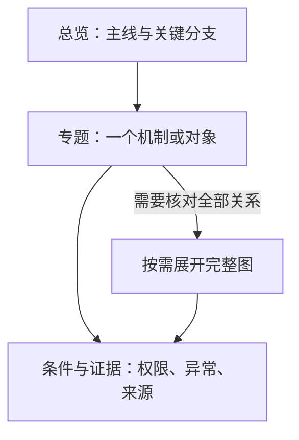

# ERP 设计依据 / ERP Design Rationale

统一界面的目标是让使用者快速识别当前对象、理解状态、完成动作，并能在失败或返回后继续工作。高保真外观、交互稿和正式实现共同服务这条操作路径；颜色或静态截图不能单独说明流程可用。

工作台默认用图解展示这些取舍：选择主题后调整边距、切换分层或操作虚构样例；详细解释在“规范原文”中按章节查阅。交互关系图与[交互设计说明](交互设计说明.md)同源，目录支持搜索与前进后退恢复。

## 空间与密度：为什么这样留白 / Spacing And Density

**12px 是当前桌面 ERP 的工程基准**：兼顾分组辨认和数据面积。它不是经过用户实验得出的最优值，也不是适用于所有页面的定律。

### 1. 同一内容，边距改变了什么

在工作台“间距与密度”中保持内容不变，只调整左右空隙：

| 页面边距 | 相对当前 12px 的变化 | 观察重点 |
| --- | --- | --- |
| 4px | 两侧合计多出 16px 内容宽度 | 内容是否紧贴边界，分组是否难辨认 |
| 12px | 当前基准 | 组间可区分，宽表仍有空间 |
| 24px | 两侧合计少 24px 内容宽度 | 临界宽度上是否更早换行或出现横向滚动 |

### 2. 各处留白解决什么问题

| 尺寸与位置 | 设计原因 | 调整时核对 |
| --- | --- | --- |
| 页面外围 12px | 分开屏幕边缘、导航和内容 | 容器边界、窄桌面、长字段、整页溢出 |
| 操作区上下 10px、左右 12px | 控件有间隔，搜索、筛选、标题共用阅读边缘 | 父子 padding 不重复；焦点与错误不被裁切 |
| 操作区与数据区间隔 9px | 职责可辨，条件与结果仍相邻 | 是否被误认为两个无关模块 |
| 侧栏展开 206px、收起 64px | 在扫描名称和扩大业务宽度之间切换 | 收起后仍有名称提示、选中态和全部入口 |
| 顶栏 48px、常用控件 34px | 全局操作稳定，保留业务首屏 | 内容、焦点和命中范围；手机触控另行核对 |
| 表格标准 / 紧凑行高 52 / 42px | 适应阅读习惯，主要调整单元格留白 | 长文本可撑高，输入与校验仍完整 |

### 3. 调整尺寸的顺序

1. **先分组**：关联内容更近，独立组更远。
2. **再对齐**：相邻区域共享阅读边缘，不重复叠加内边距。
3. **按任务选密度**：文档需要受控行宽和段落间隔；业务列表需要可比较的数据面积。
4. **回到实际页面核对**：以上数值不构成强制 8px 网格，机械取整可能破坏控件与卡片的配合。

## 平面与层次：为什么不用更多装饰 / Flat And Hierarchy

平面风格靠**排版、留白、底色和细线**组织内容。减少普通容器的强阴影、大渐变与立体装饰，同时保留边界、选中、焦点、悬停和错误反馈。

| 视觉层 | 当前用法 | 设计原因 |
| --- | --- | --- |
| 页面底色与内容面 | 浅色页面底与白色内容面分开；暗色用不同黑阶 | 用明度说明归属，卡片间隙不再垫一层背景 |
| 中性底轨与选中块 | 底轨聚合同组视图，主题浅色标明当前项 | 无需记住上次点击，也无需每个页签都加重边框 |
| 主题色 | 主动作、选中、键盘焦点 | 少量强调，避免高饱和区块争夺注意力 |
| 状态色与文字 | 状态、错误、待处理均有可读名称 | 颜色不单独表达意义，主题色不代表审批成功 |
| 1px 边线、10px 容器圆角、8px 控件圆角 | 区分包裹层级，约束内容边缘 | 圆角服务容器关系，不任意放大占用空间 |
| 浮层与固定栏 | 不透明底色、分隔、克制阴影 | 表达覆盖和固定关系，防止内容穿透 |
| 普通分组 | 较轻的底色、排版和边界 | 不与浮层、固定操作争夺层级 |

核对顺序：

1. 暂时去掉分层，观察区块和可点击对象是否难以辨认。
2. 恢复后检查当前项、键盘焦点和错误是否仍清楚。
3. 用共享变量和组件实现正式外观；“去掉分层作对照”只是讲解，不是另一套主题或业务状态。

## 排版与阅读路径 / Type And Alignment

阅读顺序应当是：**识别工作对象 → 查看条件与状态 → 比较记录或执行动作**。

| 元素 | 排列方式 | 原因 |
| --- | --- | --- |
| 主标题 | 只出现一次 | 避免重复定位，腾出首屏空间 |
| 同级分区 | 相同层级与样式 | 扫读时知道哪些内容可以并列比较 |
| 辅助说明 | 靠近对应字段，以字重、位置和色阶区分 | 降低干扰，同时保持可读字号 |
| 文字 | 左对齐 | 形成稳定的阅读起点 |
| 日期、状态 | 同类列保持一致位置 | 便于横向与纵向核对 |
| 数量、金额 | 右对齐，必要时用等宽数字 | 按位比较大小 |
| 长名称、币种、单位 | 保留完整阅读入口 | 不能为整齐隐去业务含义 |
| 图标与按钮 | 图标辅助识别，按钮有名称 | 无需猜测图形的含义 |

### 按信息关系选择表达

| 信息关系 | 优先形式 | 读者得到什么 |
| --- | --- | --- |
| 相同对象、同组维度 | 表格 | 逐列比较 |
| 连续办理 | 编号步骤 | 清楚的先后顺序 |
| 依赖、分支、交接 | 关系图 | 看见关联和异常去向 |
| 单一结论或条件 | 短段落 | 快速获得必要说明 |

卡片只在分组有用时使用，不作为所有信息的默认容器。

### 怎样判断调整有效

1. 保持数据相同，比较可用面积、行宽、对齐和分组。
2. 在真实浏览器核对默认、长文字、错误、返回和关键操作。
3. 将机制说明与使用效果分开：对照图不能单独证明“更快”或“更少误操作”，这类结论需要同任务的使用证据。

## 信息与动作 / Information And Actions

每个常驻元素应帮助使用者**判断对象、选择下一步或核对结果**。具体尺寸和操作条件见[交互设计说明](交互设计说明.md)，这里解释取舍。

### 1. 入口与标题：减少重复查找

| 设计选择 | 原因 | 核对标准 |
| --- | --- | --- |
| 全部业务模块同级直达 | 当前入口规模适合直接扫描 | 每模块一个入口；单页直达，多页内部切换 |
| 工作中心、常用工作优先 | 高频入口应容易找到 | 分组职责清楚；超高只在侧栏内滚动 |
| 默认页显式配置 | 数组顺序不应改变用户落点 | 仅实际入口规模影响查找时，再评估折叠 |
| 出货入口合并 | 出货单、放行和预留服务同一交付过程 | 模块内按权限切换；预留、放行不等于实际出库 |
| 财务同级独立 | 同时处理销售、采购与委外结算 | 不被误读为出货子功能 |
| 主标题只出现一次 | 顶栏与正文同名不会增加定位信息 | 有内容标题时由其承载对象、帮助、视图与摘要；否则顶栏显示位置 |
| 常驻说明精简 | 重复用途、排除清单、样例标签会挤占首屏 | 同类业务页、表单和交互稿标题结构一致；风险在相关判断处可见 |

### 2. 列表与筛选：让条件紧邻结果

菜单数字只用于发现需处理事项，具体交互见[电脑版菜单数字提醒](交互设计说明.md#电脑版菜单数字提醒--desktop-navigation-counts)。

| 数字提醒选择 | 原因 | 核对标准 |
| --- | --- | --- |
| 首批只在任务看板显示 | 已有统一待办真源；模块总数不能说明当前用户需做什么 | 数字与“待我处理”的完整数量一致 |
| 普通待办低强调，明确风险才红色 | 保留风险色的识别价值，避免菜单处处告警 | 看数量与看风险能清楚区分 |
| 0 隐藏、99+ 收敛宽度 | 减少无效标记，折叠菜单仍放得下 | 完整数可通过悬停和读屏获取 |
| 失败保留旧数并明确待更新 | 网络异常不能制造“没有待办”的假象 | 初次失败、重试、账号权限切换均核对 |

| 设计选择 | 原因 | 核对标准 |
| --- | --- | --- |
| 紧凑筛选与业务列表 | 查找、比较、处理需要数据面积 | 首屏看见对象、状态和下一步；统计点击有明确结果 |
| 顶部切换共用底轨和滑块 | 同类选择保持可识别的视觉语言 | 页面与视角差别由标签、路由、键盘行为表达 |
| 操作区使用完整内容面 | 将切换、搜索与筛选归为一组 | 页面底 → 内容面 → 底轨 → 选中块四层清楚；内部不重复套卡片 |
| 同类控件跨模块共享 | 避免财务、生产、进度、权限与工作台各自造型 | 浅色白底、暗色随主题；结果条件仍使用筛选按钮 |
| 数据表可选淡网格 | 宽表核对日期、数量和金额时，部分用户需要列边界 | 默认横线；淡竖线偏好与密度独立，固定列、长文、合计可读 |
| 手机卡片和打印独立 | 桌面列线不能直接套到其他媒介 | 保留各自版式 |
| 列设置包含可用业务列 | 税务、地址等低频字段仍需按任务查看 | 遵守字段权限；默认列支持常用判断，新增列不覆盖账号选择 |
| 待办与风险优先 | 当前工作比通用说明更需要注意力 | 说明按需展开；默认只保留能帮助判断或操作的信息 |
| 空状态统一 | 无记录不应被黄色警告框暗示为风险 | 电脑、手机、工作台的图标、文案和间距一致；失败有独立重试 |

宽表的两种滚动入口分别服务发现与连续操作：

| 部位或状态 | 选择理由 | 必须保留 |
| --- | --- | --- |
| 顶部两个方向按钮 | 容易发现后续列 | 复用工具栏；有数据且溢出时出现，边界禁用 |
| 底部细拖动条 | 快速跨越多列 | 不重复方向按钮和文字；避开分页 |
| 纵向滚动中 | 减少遮挡 | 暂时隐藏，停稳后重新定位 |
| 横向拖动或悬停 | 保持连续操作 | 拖动中可见；悬停加粗不改变外层高度 |
| 翻页与加载 | 防止页面回跳 | 控件保持挂载，加载保留表格高度，响应后按行数恢复 |
| 表格周围 | 提供可辨边界 | 卡片边距和列设置入口仍在 |

### 3. 表单与详情：保留录入和核对上下文

| 设计选择 | 原因 | 核对标准 |
| --- | --- | --- |
| 主表单整页，局部操作弹窗 | 完整单据要连续输入；选择、确认、预览要保持上下文 | 明细内部横向滚动，主动作始终可达 |
| 控件设计放在主内容区 | 多类控件需要持续浏览、比较和操作；长抽屉会压缩示例宽度并遮住导航 | 与页面预览同级切换，按用途只展示当前示例；真实弹窗与抽屉仍作为局部交互演示 |
| 主数据只要求岗位可判断的资料 | 系统排序、提示和参考信息不应变成伪业务操作 | 加工环节顺序由系统追加；质检提示不触发质检，BOM 参考期不控制启用 |
| 详情支持精确来源和返回 | 跨单据核对后需要接着工作 | 对象正确，筛选、选择、滚动等上下文恢复 |
| 手机进度明细按判断路径分组 | 身份、生产执行、协同任务各有用途 | 只显示有记录的“产品信息 / 生产执行 / 关联任务” |
| 生产执行组内连续核对 | 生产单、批次、领料属于同一判断过程 | 生产和任务用手机原生下钻；电脑版原单从工作入口主动进入 |
| 材料汇总用紧凑产品摘要与宽明细 | 工程、审批需同时核对用量、库存和备注 | 多产品按宽度并排；部位与计算按需展开，关闭返回原任务 |
| 库存作为参考 | 材料申请和实际采购有不同口径 | 摘要不暗示自动抵扣 |

### 4. 任务：先辨对象，再决定办理

| 设计选择 | 原因 | 核对标准 |
| --- | --- | --- |
| 产品或物料为主标题，任务名次要 | 避免重复强调挤占单据与异常信息 | 工作台、看板和手机一致；无关联内容仍有标题，长文自然换行 |
| 状态、风险、时间独立可读 | 这些信息决定优先级 | 键盘打开、图片独立预览和返回恢复可用 |
| 进度卡片显示具体任务摘要 | 负责人和待办总数不足以判断要办什么 | 名称、责任与首要事项来自现有进度投影 |
| 按待办数量决定下钻 | 单项可直达，多项需选择 | 一项开详情，多项看关联任务；零项无假入口，查看不扩大办理权限 |

“新建跟进任务”用于当前单据的资料补充、交期沟通和异常核实，最小闭环是：

1. 绑定来源单据，明确要补充或核实的事项。
2. 选择合格接收人和截止时间。
3. 在相关任务中跟踪办理与完成反馈。

名称与“提交订单 / 提交合同”区分；已有审批、入库和出货继续走各自流程。

### 5. 工作台：工具、原理与证据分别展开

| 设计选择 | 原因 | 核对标准 |
| --- | --- | --- |
| 分组侧栏与工具表 | 开发入口需要快速扫描、搜索、进入 | 同一登记生成；全部工具、常用工具、使用指南按需切换 |
| 产品工程直接呈现五个工具 | 再加问题分类或图模型分类会增加选择成本 | 名称与侧栏一致，每项一句用途和打开动作 |
| 来源与帮助就近展开 | 固定教程会占用工具首屏 | 风险确认在实际操作处，状态来自真实结果 |
| 规则与图回到所属入口 | 各工具应回答自己的问题 | 改动规则在开发文档，关系图在对应工具，页面说明检查在质量验证 |
| CI/CD 原理按需查看 | Job、Runner 槽位、内部并发和资源锁不同 | 质量门禁复用说明抽屉，四组图按需渲染 |
| CI 性能使用实际起止时间 | 机制图不能证明当前配置或实际结果 | 时间重叠可见，缺值、排队单列，领域明细可收起 |
| 版本中心复用发布说明 | 发布原理与实际回执各有来源 | 交互稿只演示机制 |

表达方式按问题选择：操作主线用编号；工具、检查、环境、演练用表格；发布、耗时、记录用稳定 Tab；权限与业务链用关系图。详情按需打开，真实阻断与未结束操作始终可见。

### 6. 权限：横向比较操作，逐页核对访问

| 设计选择 | 原因 | 核对标准 |
| --- | --- | --- |
| 单岗位使用“对象 × 操作”表 | 查看、新建、编辑适合并排核对 | 每权限只有一个勾选控件；审批与专有动作名称独立 |
| 筛选与批量修改有范围 | 用户可能看不到被筛掉的权限 | 不误改隐藏权限；保存前可核对新增与撤销 |
| 导航按模块排列 | 同模块多页不应占满常用入口 | 默认页、模块顺序保存后可读回 |
| 页面访问逐页核对 | 岗位授权与公司启用范围可能不同 | 分类与业务导航一致；授权、访问结果分开，受限原因有检查方向 |

### 7. 登录：只保留进入系统所需判断

| 设计选择 | 原因 | 核对标准 |
| --- | --- | --- |
| 紧凑登录卡片 | 进入前只需辨公司、选电脑或手机、验证账号 | 工作方式与验证方式分层；装饰和表格密度不抢注意力 |
| 主题与失败反馈连续 | 用户应能就地修正 | 长名称不挤外观按钮，失败可改，提交不可重复 |
| 手机账号卡显示姓名和账号 | 长岗位名单重复已有切换功能 | 身份可核对，岗位和工作入口仍能直接切换 |

## 视觉与可达性 / Visual And Accessible Behavior

可达性同时包含**看得清、点得到、用键盘可操作、失败后能继续**。视觉调整要与数据含义和恢复路径一起核对。

### 1. 动作怎样排序

| 动作 | 作用 | 边界 |
| --- | --- | --- |
| 完成 | 正常办理闭环 | 不替代事实入账 |
| 阻塞 / 解除阻塞 | 说明卡点，恢复继续办理 | 结果和原因可读 |
| 通过 / 退回 | 已有审批 | 沿用真实权限与状态 |
| 转交 / 催办 | 已有协作能力 | 不为补齐按钮扩展调度或消息系统 |

当前动作较少，电脑和手机直接展示全部可用项；键盘能选择、选中结果明确。权限变化后，不得用已失效的选择提交。

### 2. 先明确数据含义

| 容易混淆的内容 | 必须区分 |
| --- | --- |
| 工程申请与采购执行 | 申请不充当采购执行台账 |
| 委外合同与发回货 | 合同不证明已发货或回货 |
| 缺值、待处理、异常 | 各自表达，不能用同一种警告或零值 |
| 来源下钻与导出 | 同一记录身份、同一筛选口径；窄屏仍能读取后续记录 |
| 主题与状态 | 换主题不改变业务含义；打印沿用独立纸面合同 |

### 3. 外观与个人偏好

| 部位或选择 | 原因与实现边界 |
| --- | --- |
| 浅色主题 | 沿用最新 HTML 的蓝色重点、柔和灰绿页面底与白色内容面 |
| 暗色主题 | 接近纯黑底色；壳层、内容面、卡片、浮层依次抬高，避免挤成同一块黑 |
| 暗色中性层 | 不带绿或蓝色偏色；强调色留给选中、焦点、主动作 |
| 侧栏 206 / 64px | 展开扫描名称，收起释放宽度；品牌栏切换、选中态和全部入口保留 |
| 顶栏 48px、控件 34px | 将首屏留给业务；表格密度只调留白，不改变控件和卡片目标大小 |
| 密度范围 | 共享于业务、权限、效能工作台数据表；编辑明细仍保留输入与校验空间 |
| 手机设置 | 卡片统一布局，只显示有直接效果的明暗与主题色；不改变桌面密度 |
| 样式职责 | 页面负责布局；共享变量、Ant Design 配置及样式负责外观与页签动效 |

个人设置按以下顺序恢复：

1. 未登录时使用设备外观。
2. 登录后读取账号偏好；没有设置时使用统一默认值。
3. “跟系统”保留当前设备的系统适配。
4. 设置即时预览；保存失败在原处提供重试，不能把预览当作保存成功。

### 4. 长表单与展开内容

| 选择 | 设计原因 | 核对重点 |
| --- | --- | --- |
| 关键资料 → 明细 → 补充资料 → 附件 | 尽早进入主要录入 | 目录只定位，不拆多次保存，不隐藏必填项 |
| 宽屏目录、窄屏跳转框 | 节省窄屏横向空间 | 字段和明细优先 |
| 短字段并排，长说明按内容增高 | 控制展开态高度 | 空备注不预留多行；必填原因直接可见 |
| 产品预览紧邻选择字段 | 避免下方重复展示 | 生产路线、客户验货保持原填写与校验 |
| 说明按需打开 | 不常驻占空间 | 入口可键盘访问 |
| 附件收紧默认占位 | 给正文留空间 | 待处理文件和错误仍可见 |

固定栏的层次另行核对：

| 部位 | 表达什么 | 外观与内容 |
| --- | --- | --- |
| 标题栏 | 当前编辑对象 | 单行标题与必要状态徽标 |
| 底部操作栏 | 保存与离开 | 比标题栏略强，保存是最突出的主动作 |
| 两个固定栏背景 | 当前外观主题 | 低比例主题色纵向渐变：靠正文浅，靠屏幕外缘深 |
| 固定栏边界 | 与滚动正文分开 | 分隔线与浅阴影，不额外加高或增加左侧色条 |
| 未保存提示 | 业务编辑状态 | 独立语义色的文字和圆点，不靠背景主题色表达 |
| 说明与普通分组 | 填写规则、定位 | 规则就近放正文；分组与目录保持较轻层次 |

### 5. 列表、数量与图片

| 对象 | 选择理由 | 核对重点 |
| --- | --- | --- |
| 状态、搜索 | 高频判断放第一层 | 其他条件按需展开；单条动作与整表动作分行 |
| 状态数量 | 帮助选择工作队列 | 覆盖查询全部记录，保留权限与其他筛选，不冒充当前页计数 |
| 协同进度 | 反映任务办理 | 不改写单据生命周期 |
| 手机列表 | 扫描来源和产品 | 减少重复标题、逐字段复制；完整信息与复制放详情 |
| 产品图片 | 辨认正在判断的产品 | 紧凑 48px、标准 56px、关键摘要 64px；各入口真实图可放大 |
| 行与图片点击 | 两个不同动作 | 行命中层在内容下方，图片按钮在上方；不嵌套按钮，点图不触发行操作 |
| 多产品或无产品身份 | 不猜测图像归属 | 多产品显示代表图和数量；物料、财务等无权威身份时不配产品图 |
| 长名称、金额、币种 | 支持精确核对 | 名称可看全，数字对齐，币种逐行标记；宽内容仅在数据区滚动 |

### 6. 状态、键盘与关闭保护

| 情况 | 设计要求 | 原因 |
| --- | --- | --- |
| 状态、禁用、读取 | 文字与视觉差异并存 | 不能只靠颜色辨认 |
| 图标按钮 | 有可访问名称 | 用户不必猜图标 |
| 浮层 | 进入焦点、Tab 边界、Escape、关闭后焦点恢复 | 键盘能完成同一任务 |
| 普通上下文弹窗 | 允许点击遮罩退出 | 降低看完或取消的退出成本 |
| 有未保存内容 | 先确认；点击确认层遮罩只返回继续编辑 | 保留输入，避免意外丢失 |
| 保存、上传或执行中 | 保持阻断 | 结果尚未明确 |
| 法务确认、断连恢复 | 保持强制门禁 | 前置条件未满足，不能误回业务页面 |

效能工作台使用同一视觉语言，同时保留工具职责、验证证据与交付边界。

### 7. 为什么手动指引使用决策图

| 指引 | 需要看见的关系 | 保留的边界 |
| --- | --- | --- |
| Git `index.lock` Mermaid 判定图 | 活动 owner、现场稳定性、候选内容、恢复读回；区分继续、隔离、停止 | 只用编号易误导为“所有锁都应删除”；命令与候选内容留在 Skill 和回执 |
| 非空锁候选 | 非空候选先保全再复核 | 既不永久阻塞，也不丢失可能唯一的暂存证据 |
| 自动续办交接图 | 等待型心跳与主执行共用聊天，需避免重复触发 | 不让工作台成为新的任务调度真源 |

自动续办图解释的顺序是：

1. 先删除并读回当前等待心跳。
2. 删除成功才在同一次续办中进入执行；删除失败保持未开始。
3. 执行期间不重建同目的心跳。

这些图只解释决策，不执行 Git、创建调度或维护第二套状态。

### 8. 动效与验证各自证明什么

| 观察项 | 要证明的行为 | 所需证据 |
| --- | --- | --- |
| 页签指示条 | 连续移动，框架稳定；快速反向不闪烁、不重置 | 实际动画中间帧与 DOM 位置 |
| 减少动态效果 | 直接呈现最终状态 | 对应系统偏好下的操作 |
| 窄屏 | 先重排，保留日期、数量、主动作 | 不靠隐藏关键内容或固定大高度腾空间 |
| 截图 | 遮挡、空白、层次 | 页面实际渲染 |
| DOM 测量 | 盒模型与点击范围 | 尺寸、位置、溢出 |
| 浏览器操作 | 返回、重试、焦点恢复 | 走完具体路径 |
| 对比度 | 文字与状态可辨认 | 单独测量，不能只凭观感 |

单张截图或测试数量不能代替具体路径的核对。

## 可视化选择 / Visualization Choices

先确定读者要判断什么，再选择图形；每个业务视图都应能回到原始对象核对。

### 1. 业务问题与视图对应

| 要回答的问题 | 视图 | 数据边界 |
| --- | --- | --- |
| 已出货与订购相差多少 | 交付进度 | 使用实际出货和订购数量 |
| 哪天安排采购到货 | 到货计划 | 日期上的采购安排 |
| 哪些订单需要关注 | 生产总览 | 订单层面的关注项 |
| 某产品停在哪道工序 | 四道真实工序的生产矩阵 | 质检、入库保持独立结果；任务完成不等于入账 |
| 哪些未结账款应先处理 | 财务时间顺序 | 未结款项的时间优先级 |
| 从异常回查哪张单据 | 可选择的进度卡片与来源下钻 | 整卡可选，分页复用工作台控件 |

电脑弹窗与手机整页详情使用同一订单身份、阶段事实和当前关注结构，避免同一订单出现两套进度。

### 2. 经营统计为什么放在进度看板

阅读主线是：**发现交付问题 → 筛选或切换维度 → 核对来源订单 → 返回原结果**。

| 设计选择 | 依据 | 边界 |
| --- | --- | --- |
| 同一查询、同一结果区 | 图表与表格应支持同条件比较 | 维度切换不另造统计口径 |
| 图表 / 透视切换 | 参考 [Odoo Reporting](https://www.odoo.com/documentation/19.0/applications/essentials/reporting.html) | 采用适合本项目的维度与筛选 |
| 分组与明细核对 | 参考 [Business Central Analysis Mode](https://learn.microsoft.com/en-us/dynamics365/business-central/analysis-mode) | 来源下钻可返回 |
| 共享视觉 | 白色操作区、蓝色重点、滑动分段、紧凑表格 | 不复制另一套产品皮肤 |
| 指标独立溯源 | 交付、货品金额、出货金额、未结应收各有来源 | 默认图和数字均可回到单据核对 |

| 数据情况 | 展示原则 |
| --- | --- |
| 未知值、缺日期、尚未形成事实 | 直接说明，不用零值或模拟百分比填满 |
| 库存比例 | 先说明记录数还是同单位数量 |
| 财务多币种 | 不跨币种汇总 |
| 无可靠来源或无后续业务动作 | 不进入默认页面 |

### 3. 帮助图解为什么按办事场景组织

| 阅读层 | 要解决的问题 | 表达方式 |
| --- | --- | --- |
| 选场景 | 我要办哪件事 | 岗位与场景导航 |
| 办理概览 | 顺序、责任、结果、异常回到哪里 | 固定位置显示；交接用业务链，连续操作用编号，简单查询用短路径 |
| 当前步骤 | 现在看哪一步 | 数字表顺序，字母标操作位置；步数依场景，不补满五步 |
| 详细规则 | 字段、状态、计算、来源与异常 | 可复制、可搜索的独立参考正文，按需打开 |
| 页内求助 | 当前字段或页面怎么用 | “这页怎么用”和字段问号直达对应内容 |

1. 图解和参考手册共用词条、搜索、目录与稳定地址。
2. 默认收起目录，只展开当前步骤；完整说明和关联术语按需查看，避免首屏重复长列表。
3. 桌面显示关系，窄屏从同一定义生成纵向步骤，保持可读字号。
4. 点节点联动操作或结果说明；教学高亮不代表真实进度，帮助不提交业务表单。
5. 概览、编号、当前说明共用场景数据；异常只补充起点、责任和恢复去向，不建立另一套业务引擎。

工程用料样板保留真实边界：**库存不自动抵扣；财务批准形成采购承诺；收货、库存与应付另行办理**。内容快照检查用于提示同步，再由维护者复核图形语义，不能自动发现全部后端逻辑变化。

### 4. 数量怎样保持可核对

| 内容 | 选择理由 | 规则 |
| --- | --- | --- |
| 件数类单位 | 对应离散数量 | 保持整数 |
| 长度与重量 | 对应实际计量 | 保留单位允许的有效小数 |
| BOM 单件耗用 | 与实际办理数量用途不同 | 精度规则分开 |
| 数字展示 | 避免制造精度或丢值 | 不补满小数位，不截掉有效值 |
| 单位切换 | 防止用户未察觉的数量改写 | 保留原输入，说明精度问题 |

### 5. 明细为什么保留行内编辑

| 设计选择 | 原因 | 核对重点 |
| --- | --- | --- |
| 共享表头、行内编辑 | 逐行弹窗割裂比较，逐行大卡增加高度 | 仅长说明和低频资料按需展开 |
| 参照联系人编辑调整密度 | 主字段需要连续比较 | 补充信息有真实摘要，已有紧凑模块保留结构 |
| 销售、采购收紧占位 | 同时减少纵向和横向成本 | 到货卷包、库存多行共享表头，差异、来源和数量关系可见 |
| 沿用主题、控件、骨架、字号 | 避免每页另造外观 | 独立草稿仅作交互输入；原表可核对，错误自动展开 |
| 数量、单位、日期用相对稳定宽度 | 输入长度较稳定 | 余量分给产品、材料和来源等长内容 |
| 系统维护默认列宽和窄屏重排 | 不将调宽、保存、恢复成本转交用户 | 不增加逐页列宽偏好 |
| 窄序号列或窄屏行首标记 | 低成本定位重复明细 | 不变成编号卡片或持久化业务身份 |
| 标题与底部同名新增入口 | 分别服务首次发现和连续录入 | 新增后滚动、聚焦、短暂反馈，明确新行位置 |

## 设计资产维护 / Design Maintenance

只维护一份最新可交互 HTML、设计说明和设计依据；工作台直接读取，分别提供交互、规则、原因和真实共享控件四个视角。

| 资产或证据 | 能说明什么 | 不能据此推定 |
| --- | --- | --- |
| 虚构样例与交互稿 | 常见、异常和边界状态怎样呈现 | 已有真实业务结果 |
| 正式代码、API、状态、权限与测试 | 当前实现与检查范围 | 已上线或已验收 |
| Git 历史 | 设计修订 | 需要额外版本画廊、图片目录或生命周期标签 |

后续修改按以下顺序：

1. 说明要改善哪项判断或动作。
2. 同步设计、实现及受影响的测试。
3. 分别记录设计、实现、运行和验收证据。

### 待评审的反向建议 / Runtime Proposals

以下仍是提案，**尚未进入正式实现**；不影响已实现行为同步到设计稿。

| 提案 | 价值 | 当前建议 |
| --- | --- | --- |
| 系统操作记录：跨页风险筛选 | 全部匹配记录使用同一查询与导出口径 | 有跨页追查需求时优先评审；当前明确显示“本页”范围 |
| 系统操作记录：登录安全、成功 / 失败、网络地址 | 定位异常登录及失败操作的时间、来源、结果 | 暂缓；有明确排障或安全需求后单独评审 |

| 提案 | 复杂度与依赖 |
| --- | --- |
| 跨页风险筛选 | 中：服务端统一风险分类、查询、导出条件；补齐权限和分页回归 |
| 登录安全等事件 | 较高：先定义采集、脱敏、保留期限、查询权限，再设计界面；样例不证明已有审计能力 |

## 复杂关系的阅读层级 / Diagram Hierarchy

默认只展示主线或当前对象，按问题逐层展开：

| 层次 | 展示原则 | 核对边界 |
| --- | --- | --- |
| 总览 | 控制节点数量，保留主线 | 不将所有细节缩成小字 |
| 专题 | 一次回答一个关系问题 | 筛选同时作用于图和清单 |
| 聚合或完整图 | 保留当前范围计数与明细入口 | 不静默截断关系 |
| 条件与证据 | 说明依赖、分支、权限和来源 | 静态说明与运行结果分开，不能把着色当作执行成功 |

图的规模、同源维护和检查方式沿用[可视化表达规范](../../engineering/可视化表达规范.md)。

## 弹窗布局的取舍 / Dialog Layout Tradeoffs

[结构标注与留白对比](/__dev/ui-design?view=rationale&topic=dialogs) · [使用规范](交互设计说明.md#弹窗结构与尺寸--dialog-anatomy)

| 决策 | 原因 / 收益 | 代价与边界 |
| --- | --- | --- |
| 整页、弹窗、抽屉按任务选择 | 连续录入获得空间，局部动作保留来源上下文 | 不按是否有明细机械选择，已有详情路径继续沿用 |
| 按档位设置宽度 | 同类任务有稳定阅读范围，宽明细可以比较 | 宽度不能替代分组，也不要求填满视口 |
| 固定标题和操作区 | 长内容中仍可识别对象并执行动作，减少上下往返 | 正文少一部分高度，小屏需核对滚动与按钮换行 |
| 桌面左右 24px、窄屏 16px | 分开边界与内容，同时保留字段宽度 | 来自现有样式，不是普适最佳值 |
| 次动作在前、主动作在后 | 阅读后自然到达本组主要动作 | 危险操作仍须明确文案，不能仅依靠位置与颜色 |

图解可把正文留白从 8px 调到 40px，观察同一任务的内容空间和分组边界。24px 为当前桌面值，其余只用于讲解；不改变组件配置，不写账号偏好。宽度直接读取 `modalSizes.mjs`，间距和高度核对共享样式。调整正式数值时同步说明、图解与浏览器证据。

## 反馈持续时间的取舍 / Feedback Lifetime

[反馈位置对比](/__dev/ui-design?view=rationale&topic=feedback) · [选择规范](交互设计说明.md#反馈选择--feedback-selection)

| 信息 | 为什么这样持续 | 另一种方式的代价 |
| --- | --- | --- |
| 已完成的轻量动作 | 结果留在页面，短提示读完即可消失 | 持续通知重复占用注意力 |
| 必填字段错误 | 用户需在准确位置修正，与字段一起保留 | Toast 消失后难定位，还会重复打断 |
| 保存失败、结果未知 | 输入、错误和恢复动作需要同时可见 | 自动消失可能使用户错过说明或误操作 |
| 需稍后处理的长说明 | 稍后阅读并主动关闭 | 通知不能承担业务状态存储，结果仍留在所属页面 |

3 秒、480px 和顶部 64px 是当前配置，用于短反馈阅读、避免铺满宽屏并与顶栏错开，不是外部研究结论。最多 3 条限制堆叠，同一操作通过 key 更新。重要状态仍留在页面。

文字、图标与语义色共同表达状态；成功 / 信息温和播报，警告 / 错误使用警报语义，Toast 不抢焦点。取消和过期读取不等于失败，同一错误避免在字段、区域、Toast 三处重复出现。

## 保留上下文与确认结果 / Context And Results

[提交与恢复操作](/__dev/ui-design?view=rationale&topic=submission) · [行为规范](交互设计说明.md#提交与恢复--submission-and-recovery)

| 情况 | 取舍 | 业务前提 |
| --- | --- | --- |
| 刷新、失败和返回 | 保留输入、筛选、选择及位置，减少重填 | 沿用已有列表状态与表单快照 |
| 正在保存 | 只禁用相关动作，避免连点与误离开 | 回调返回完整 Promise，业务仍守事务和幂等 |
| 响应不确定 | 先查询结果，再决定下一步 | 使用正式查询或幂等恢复，组件不推测是否执行 |
| 上传、预览、导出 | 分清已选择、处理中、已生成和失败 | 本地文件不能证明上传，也不能宣称浏览器已落盘 |

样例可以让首次保存失败或结果未知，观察输入保留和查询入口。它不新增业务状态、后台协调器或通用重试，正式业务继续使用自身主路径。

## 关闭保护与危险确认 / Dismissal And Risk

[关闭路径与焦点](/__dev/ui-design?view=rationale&topic=closing) · [行为规范](交互设计说明.md#关闭与焦点--dismissal-and-focus)

| 决策 | 原因 | 限制 |
| --- | --- | --- |
| 普通查看允许 Escape / 遮罩关闭 | 降低看完、取消后的退出成本 | 不机械增加“确定关闭吗” |
| 未保存表单才询问放弃 | 丢失输入需要主动决定 | 已有保护不再叠一层，确认层遮罩只返回编辑 |
| 提交中暂时禁止离开 | 防止结果未定时退出并重复办理 | 只持续到本次有结果，失败后恢复纠正入口 |
| 危险操作说明对象、影响和可逆性 | 用户需要判断具体后果 | 不仅写“确定吗”，普通保存不都视为危险动作 |
| 默认焦点停在保留动作 | 减少刚打开确认层便误按 Enter 的风险 | 正式场景可明确指定其他焦点 |
| 内层先处理 Escape，关闭回入口 | 键盘顺序与视觉层级一致 | 不全局拦截所有按键，不关闭无关浮层 |

`AlertDialog` 是单步说明，危险确认使用双动作语义。两者共享焦点与提交保护，保留各自任务结构；法务与断连恢复沿用既有门禁。
