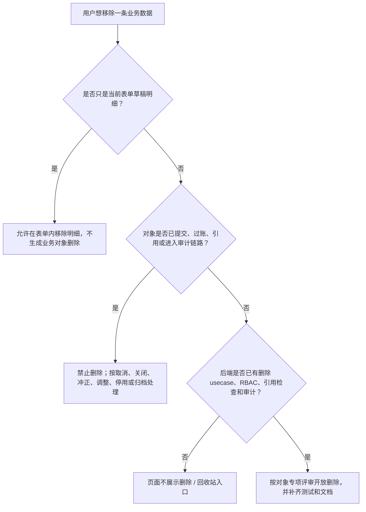

# 业务数据生命周期与页面动作规则 / Business Data Lifecycle UI Policy

本文把 `docs/reference/第二次20260611/ERP 数据生命周期与删除策略规范.md` 中可落地的删除策略，收口成当前产品页面、原型和实现应遵循的动作口径。

## 结论

当前业务页面不提供通用删除、批量删除、回收站或还原删除入口。页面动作必须表达真实业务生命周期：主数据走启用 / 停用，源单据走提交 / 取消 / 关闭 / 归档，事实和台账走取消 / 冲正 / 调整或只读，Workflow 只走任务状态和事件。

本文是页面设计和实现规则，不替代 `AGENTS.md`、`docs/当前真源与交接顺序.md`、Ent schema、后端 usecase、RBAC、测试或运行时代码。reference 文档只作为输入资料，未在本文列出的冻结、合并、替代、通用删除权限和通用软删除字段，都不能直接进入当前 runtime。

## 读者路径

| 你要做什么 | 先看本文哪里 | 再核对 |
| --- | --- | --- |
| 设计或评审一个列表页动作区 | [页面动作矩阵](#页面动作矩阵) | 对应 API / usecase / RBAC 和页面测试 |
| 判断能不能出现删除 / 回收站 | [删除进入条件](#删除进入条件) | `AGENTS.md`、`docs/当前真源与交接顺序.md` |
| 更新原型或标准样板 | [原型吸收规则](#原型吸收规则) | `docs/product/prototypes/README.md` 和对应原型 README |
| 补测试或浏览器回归 | [验收清单](#验收清单) | `web/README.md`、`docs/product/自动化测试策略.md` |

## 页面动作矩阵

| 对象类型 | 页面默认动作 | 禁止默认出现 | 说明 |
| --- | --- | --- | --- |
| MasterData 主数据 | 新建、编辑、启用、停用、查看引用或历史 | 通用删除、回收站、还原删除 | 例如客户、供应商、产品、SKU、材料、仓库、工序。停用后不再进入新业务选择，历史单据仍可回显。 |
| Source Document 源单据 | 保存草稿、提交、审批、关闭、取消、归档 | 提交后删除、回收站 | 例如销售订单、采购订单、委外订单。草稿明细行可以在表单内移除，但不等同于列表级删除。 |
| Fact / Ledger 事实与台账 | 过账、取消、冲正、调整、只读查询 | 删除事实、清空流水、回收站 | 例如入库、出库、库存流水、出货、应收、应付、发票、对账。事实纠错必须保留可追溯反向记录或调整记录。 |
| Workflow 协同任务 | 完成、阻塞、驳回、催办、记录原因 | 把任务完成写成事实过账、删除业务对象 | Workflow task done 只代表协同任务状态变化，不代表库存、出货、财务、开票或收付款事实完成。 |
| Audit / Evidence 审计与证据 | 筛选、查看详情、导出受控证据 | 普通业务删除、静默清理 | 审计数据用于追责、排障和交付证据，不能被业务页动作绕过。 |
| 临时草稿 / 表单明细 | 添加、移除、清空当前草稿明细 | 把明细删除包装成业务对象删除 | 只在尚未形成正式业务事实前可移除；提交、过账或被引用后按所属对象生命周期处理。 |

BOM 这类版本型工程资料在页面上使用“历史版本 / 设为历史版本”表达，底层状态仍为 `ARCHIVED`。历史版本可重新激活，但不直接编辑；需要改版时应复制新草稿后修改。

## 删除进入条件

只有同时满足以下条件，某个对象才可以单独评审删除或恢复：

1. 对象仍是草稿、误建或临时数据，尚未进入正式业务链路。
2. 后端 usecase 已实现状态检查、引用检查、权限检查和审计记录。
3. 已完成 RBAC、API、前端提示、错误码或错误提示、测试和浏览器回归。
4. 已被引用、已提交、已过账、已发货、已产生财务事实、已进入 Workflow 或审计链路时，删除必须拒绝，并给出可读原因和替代动作。

页面不能为了视觉完整性补本地删除、软删除假状态、回收站空态或禁用按钮。尚未满足条件时，直接不展示删除 / 回收站入口。

## 决策路径

## 原型吸收规则

- 标准业务页原型只表达筛选、列顺序、当前记录动作、分页和协同入口，不再内置通用回收站。
- 局部动作弹窗样板承接来源选择器、列顺序、危险动作确认和生命周期动作说明；只有完成真实软删除 / 恢复 usecase 的对象，才能在对象专项原型里单独设计回收站。
- 业务表单样板里的“删除”只允许表达草稿明细行移除，应在说明里明确它不是业务对象列表级删除。
- 原型中的静态按钮不能反推 API、RBAC、schema、migration 或事实写入能力；进入运行时前必须回到当前代码和测试复核。

## 验收清单

| 检查项 | 通过标准 |
| --- | --- |
| 列表页工具条 | 不出现通用批量删除、回收站或还原删除；只保留真实共享动作，例如导出当前筛选和列顺序。 |
| 当前操作区 | 只展示该对象真实支持的主动作、状态动作和生命周期动作；未接后端能力的动作不占位。 |
| 表单明细 | 删除文案限定为“移除明细行”或等价语义，不误导成业务对象删除。 |
| 原型登记 | To Implement 样板不承诺通用回收站，说明进入对象专项前必须先有后端闭环。 |
| 文档口径 | `docs/reference/**` 只能作输入资料；正式结论回到本文、当前真源、代码和测试。 |
| 测试守卫 | 前端测试至少覆盖业务列表工具条不暴露通用删除 / 回收站，以及原型登记不把回收站写成通用样板。 |

## 本轮不做

- 不新增 `deleted_at / archived_at / frozen_at` 通用字段。
- 不新增通用删除、恢复、回收站 API。
- 不新增 RBAC 权限码。
- 不改变现有 WorkflowUsecase、Fact usecase、schema、migration 或正式菜单。
- 不把 reference 文档中的冻结、合并、替代、通用软删除策略直接落到当前 runtime。
