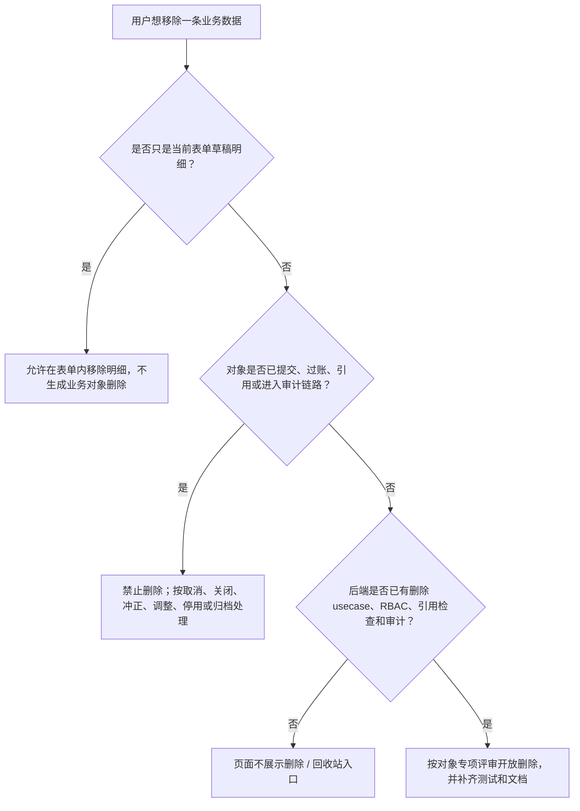

# 业务数据生命周期与页面动作规则 / Business Data Lifecycle UI Policy

本文定义当前产品页面、原型和实现必须共同遵守的业务对象生命周期与动作口径。

## 结论

当前业务页面不提供通用删除、批量删除、回收站或还原删除入口。页面动作必须表达真实业务生命周期：主数据走启用 / 停用，源单据走提交 / 取消 / 关闭 / 归档，事实和台账走取消 / 冲正 / 调整或只读，Workflow 只走任务状态和事件。

正式主数据、销售订单、采购订单、委外订单、生产订单和 BOM 列表统一提供“当前记录 / 历史记录 / 全部记录”只读范围筛选。`当前记录` 是页面默认值；`历史记录` 复用对象已有的停用、关闭、取消或归档状态；`全部记录` 只取消范围约束，不改变对象状态。系统另提供只读“历史记录中心”，按当前账号已有菜单和读取权限汇总这些对象，负责筛选、查看摘要、查看详情和跳回所属模块，不提供跨对象归档、恢复、删除或状态流转。

正式业务列表页还必须遵守统一的动作可用性合同：账号真正无权、所选对象或来源不适用、动作已经完成或记录进入终态时隐藏；账号具备能力但未选择记录、尚待满足可继续推进的前置条件、正在加载 / 保存或运行态暂不可办理时保留入口并置灰，以岗位语言说明原因。动作集合可以随所选对象、来源和生命周期合法变化，但不能因短暂 loading、重复请求或局部读回无理由闪烁、重排或左右跳动。

本文是页面设计和实现规则，不替代 `AGENTS.md`、`docs/当前真源与交接顺序.md`、Ent schema、后端 usecase、RBAC、测试或运行时代码。reference 文档只作为输入资料，未在本文列出的冻结、合并、替代、通用删除权限和通用软删除字段，都不能直接进入当前 runtime。

## 读者路径

| 你要做什么                  | 先看本文哪里                  | 再核对                                                |
| --------------------------- | ----------------------------- | ----------------------------------------------------- |
| 设计或评审一个列表页动作区  | [页面动作矩阵](#页面动作矩阵) | 对应 API / usecase / RBAC 和页面测试                  |
| 判断能不能出现删除 / 回收站 | [删除进入条件](#删除进入条件) | `AGENTS.md`、`docs/当前真源与交接顺序.md`             |
| 查询已关闭、取消或停用记录  | [历史记录查询合同](#历史记录查询合同) | 对应对象列表 API、菜单和读取权限                     |
| 更新原型或标准样板          | [原型吸收规则](#原型吸收规则) | `docs/product/prototypes/README.md` 和对应原型 README |
| 补测试或浏览器回归          | [验收清单](#验收清单)         | `web/README.md`、`docs/product/自动化测试策略.md`     |

## 页面动作矩阵

| 对象类型                    | 页面默认动作                           | 禁止默认出现                         | 说明                                                                                               |
| --------------------------- | -------------------------------------- | ------------------------------------ | -------------------------------------------------------------------------------------------------- |
| MasterData 主数据           | 新建、编辑、启用、停用、查看引用或历史 | 通用删除、回收站、还原删除           | 例如客户、供应商、产品、SKU、材料、仓库、工序。停用后不再进入新业务选择，历史单据仍可回显。        |
| Source Document 源单据      | 保存草稿、提交、审批、关闭、取消、归档 | 提交后删除、回收站                   | 例如销售订单、采购订单、委外订单。草稿明细行可以在表单内移除，但不等同于列表级删除。               |
| Fact / Ledger 事实与台账    | 过账、取消、冲正、调整、只读查询       | 删除事实、清空流水、回收站           | 例如入库、出库、库存流水、出货、应收、应付、发票、对账。事实纠错必须保留可追溯反向记录或调整记录。 |
| Workflow 协同任务           | 完成、阻塞、驳回、催办、记录原因       | 把任务完成写成事实过账、删除业务对象 | Workflow task done 只代表协同任务状态变化，不代表库存、出货、财务、开票或收付款事实完成。          |
| Audit / Evidence 审计与证据 | 筛选、查看详情、导出受控证据           | 普通业务删除、静默清理               | 审计数据用于追责、排障和交付证据，不能被业务页动作绕过。                                           |
| 临时草稿 / 表单明细         | 添加、移除、清空当前草稿明细           | 把明细删除包装成业务对象删除         | 只在尚未形成正式业务事实前可移除；提交、过账或被引用后按所属对象生命周期处理。                     |

BOM 这类版本型工程资料在页面上使用“历史版本 / 设为历史版本”表达，底层状态仍为 `ARCHIVED`。历史版本可重新激活，但不直接编辑；需要改版时应复制新草稿后修改。

## 历史记录查询合同

| 查询入口 | 范围 | 允许动作 | 明确不做 |
| -------- | ---- | -------- | -------- |
| 模块内“当前 / 历史 / 全部”筛选 | 当前模块和对象自己的分页列表 | 筛选、导出当前筛选结果、查看详情、按对象既有 usecase 办理合法动作 | 不新增统一 `archived_at`，不把“历史”解释成软删除 |
| 历史记录中心 | 当前账号已有菜单且具备读取权限的客户、供应商、材料、产品、SKU、加工环节、销售订单、采购订单、委外订单、生产订单和 BOM | 按一种对象类型筛选、查看只读摘要与详情、跳回所属模块 | 不跨对象一键归档或恢复，不绕过所属模块的状态、RBAC 和引用检查 |
| Fact / Ledger 与审计记录 | 继续留在各自事实台账、库存流水、财务记录和系统操作记录 | 使用原页面查询、追溯、冲正或调整 | 不因历史中心而隐藏、复制或迁移事实与审计真源 |

列表 API 的 `lifecycle_scope` 只接受 `current / history / all`。未传该参数时保留原 API 读取合同，避免影响既有引用选择器和内部读取；正式业务列表页面会显式发送范围。显式状态筛选必须与范围兼容，例如“当前记录 + 已关闭”应拒绝或由页面清空冲突状态，不能静默返回误导数据。

历史中心不是新的数据台账。每次只读取当前选中的一个对象来源，沿用该来源原有分页、关键字、状态字段、读取权限和菜单可见性，避免在前端拼接不准确的跨对象总数。是否能重新启用、重新激活或重开，仍由所属对象自己的 usecase 和页面动作决定。

## 选择记录后的动作可用性合同

| 条件                                                           | 页面处理                                       | 原因                                                                           |
| -------------------------------------------------------------- | ---------------------------------------------- | ------------------------------------------------------------------------------ |
| 当前账号没有动作权限                                           | 隐藏动作入口                                   | 不泄露无权能力；后端 RBAC 仍是安全边界。                                       |
| 客户配置未开放、模块关闭或当前产品没有该能力                   | 隐藏动作入口                                   | 不用禁用占位伪装未实现能力。                                                   |
| 有能力但尚未选择记录                                           | 保留固定动作槽并置灰                           | 用户在选择前即可理解本页能做什么，选择后相邻动作不跳位。                       |
| 所选记录的对象类型、来源类型或事实类型不适用                   | 隐藏动作入口                                   | 结构上不属于当前对象的动作不占位，不用永久灰色按钮制造误导。                   |
| 当前动作已经完成，或记录已进入不能再办理该动作的终态           | 隐藏动作入口，由状态列、详情或关联记录表达结果 | 例如已提交后隐藏“提交”、已关闭后隐藏流转动作、已生成退货后由关联退货记录表达。 |
| 有能力且动作仍可能继续推进，但当前状态、前置资料或版本尚未满足 | 保留动作入口并置灰                             | 用岗位语言提示需要先完成的步骤；满足条件后在原位置启用。                       |
| 有能力但正在加载、保存或办理                                   | 保留固定动作槽并置灰；完成后按最新读回恢复     | 防止重复提交或并发编辑，不因短暂等待改变布局。                                 |
| 当前状态允许办理                                               | 启用对应动作                                   | 点击后仍由后端 usecase、状态机、版本、幂等和 RBAC 再校验。                     |
| 当前状态没有合法主生命周期动作                                 | 隐藏主状态动作                                 | 终态不保留没有业务含义的“状态办理”灰色占位。                                   |
| 当前状态没有合法次级生命周期动作                               | 隐藏“更多操作”                                 | 禁止空菜单和没有提示价值的灰色“更多操作”。                                     |

`BusinessActionTooltip` 是临时不可用原因的共享入口；鼠标悬停和键盘聚焦都应能读取原因。桌面按当前合法动作的固定优先级排列；平板和手机保留一至两个主动作，其余进入“更多操作” Drawer。仅启用态变化不能参与窄屏排序，Drawer 内当前合法动作的次序也不能因 loading 改变。切换业务对象类型、来源类型、事实类型、正式页签或生命周期阶段时，动作集合可以按当前对象合同变化；读权限只能展示“查看”入口，不能借只读权限展示“返工、过账、取消”等写操作文案。

## 正式页面覆盖矩阵

下表记录当前选择行操作条的覆盖面。它是交互合同清单，不替代各页面的后端状态机和权限真源。

| 页面 / 对象         | 稳定动作族                                                    | 仍由状态或服务端严格门禁                                                                                        |
| ------------------- | ------------------------------------------------------------- | --------------------------------------------------------------------------------------------------------------- |
| 主数据              | 清空、查看 / 编辑、启用 / 停用                                | 只允许已授权对象编辑；启停继续检查当前状态和引用边界。                                                          |
| BOM 版本            | 清空、查看 / 编辑、复制、打印、激活、设为历史版本             | 草稿、已激活、历史版本各自按版本生命周期办理。                                                                  |
| 销售订单            | 清空、关联单据、查看、编辑、预留库存、当前合法状态动作        | 草稿提交、已生效关闭 / 取消、终态隐藏已完成动作；预留只在生效订单可用。                                         |
| 采购订单            | 清空、编辑、关联单据、生成入库、打印合同、主状态、更多操作    | 草稿提交、审核后生成入库、关闭 / 取消继续按来源单生命周期。                                                     |
| 采购入库            | 清空、关联 / 查看、退货、调整、应付、过账、取消               | 草稿过账、已过账生成应付或取消；终态不得重复办理。                                                              |
| 生产订单            | 清空、编辑、完工 / WIP / 事实入口、下达、关闭、取消           | 源单状态、生产执行状态和 Fact 写入继续分层校验。                                                                |
| 委外订单            | 清空、编辑、事实 / 回货 / 打印入口、主状态、更多操作          | 合同确认不等于发料、回货、质检或应付；各事实仍走独立 usecase。                                                  |
| 质量检验            | 清空、关联 / 查看、提交、判定、不合格处置、取消               | 不合格处置按来料、委外回货或生产在制来源路由；只读账号只看到匹配来源的查看入口。                                |
| 库存台账            | 清空、关联 / 查看、盘点、调拨、人工调整                       | 仅库存余额页提供受控作业入口；草稿不直接改库存。                                                                |
| 出货单              | 清空、查看 / 关联、出货前检验、放行、确认出货、取消、财务来源 | 草稿放行与确认出货、已出货取消、应收 / 开票来源继续按质量、财务和库存门禁。                                     |
| 返工回厂与补发      | 清空、查看、回厂收货、建立生产返工、建立补发、取消、冲正       | 回厂收货写 `HOLD` 批次与库存 `IN`；生产返工沿既有工序质检 / 完工；补发不产生新应收或开票。                    |
| 运营事实 / 财务事实 | 清空、关联 / 查看、过账、取消、返工、对账、结清、打印         | 只允许先创建 `DRAFT`；过账、结清和取消必须走对应领域 action，不能由直接 create 预填终态或审计字段。             |
| 收付款与红冲        | 清空、核销过账、冲销、重读；红冲撤销、重读                    | 只对当前选中记录和合法状态启用，不直接改写总账或税控事实。                                                      |
| Workflow 任务       | 清空、查看、完成、阻塞 / 恢复、催办、批准、退回               | 是否可办及原因以服务端 action explain、owner / assignee、任务状态和动作权限为准；task done 不等于 Fact posted。 |

## 删除进入条件

只有同时满足以下条件，某个对象才可以单独评审删除或恢复：

1. 对象仍是草稿、误建或临时数据，尚未进入正式业务链路。
2. 后端 usecase 已实现状态检查、引用检查、权限检查和审计记录。
3. 已完成 RBAC、API、前端提示、错误码或错误提示、测试和浏览器回归。
4. 已被引用、已提交、已过账、已发货、已产生财务事实、已进入 Workflow 或审计链路时，删除必须拒绝，并给出可读原因和替代动作。

页面不能为了视觉完整性补本地删除、软删除假状态、回收站空态或禁用按钮。尚未满足条件时，直接不展示删除 / 回收站入口。

## 决策路径

```mermaid
flowchart TD
  A["用户想移除一条业务数据"] --> B{"是否只是当前表单草稿明细？"}
  B -->|是| C["允许在表单内移除明细，不生成业务对象删除"]
  B -->|否| D{"对象是否已提交、过账、引用或进入审计链路？"}
  D -->|是| E["禁止删除；按取消、关闭、冲正、调整、停用或归档处理"]
  D -->|否| F{"后端是否已有删除 usecase、RBAC、引用检查和审计？"}
  F -->|否| G["页面不展示删除 / 回收站入口"]
  F -->|是| H["按对象专项评审开放删除，并补齐测试和文档"]
```

## 原型吸收规则

- 标准业务页原型只表达筛选、列顺序、当前记录动作、分页和协同入口，不再内置通用回收站。
- 局部动作弹窗样板承接来源选择器、列顺序、危险动作确认和生命周期动作说明；只有完成真实软删除 / 恢复 usecase 的对象，才能在对象专项原型里单独设计回收站。
- 业务表单样板里的“删除”只允许表达草稿明细行移除，应在说明里明确它不是业务对象列表级删除。
- 原型中的静态按钮不能反推 API、RBAC、schema、migration 或事实写入能力；进入运行时前必须回到当前代码和测试复核。

## 验收清单

| 检查项       | 通过标准                                                                                                                                                                                                                  |
| ------------ | ------------------------------------------------------------------------------------------------------------------------------------------------------------------------------------------------------------------------- |
| 列表页工具条 | 不出现通用批量删除、回收站或还原删除；只保留真实共享动作，例如导出当前筛选和列顺序。                                                                                                                                      |
| 历史范围筛选 | 默认显示当前记录；切换范围会清空不兼容的状态筛选；历史深链刷新后仍保持范围；全部记录不改变任何对象状态。                                                                                                                    |
| 历史记录中心 | 只显示当前账号有菜单且有读取权限的来源；无可读来源时不发业务读取请求；详情和跳转不展示原始内部 ID，也不提供归档、恢复、删除或跨对象状态动作。                                                                              |
| 当前操作区   | 无权限、结构不适用、动作已完成或终态动作不占位；有能力但未选择、可继续推进的前置条件不足或忙碌时置灰并显示统一原因；空“更多操作”隐藏。                                                                                    |
| 表单明细     | 删除文案限定为“移除明细行”或等价语义，不误导成业务对象删除。                                                                                                                                                              |
| 原型登记     | To Implement 样板不承诺通用回收站，说明进入对象专项前必须先有后端闭环。                                                                                                                                                   |
| 文档口径     | 规则必须直接由本文、当前真源、代码和测试承接；外部材料原文不进入仓库，也不作为实现依据。                                                                                                                                 |
| 测试守卫     | 前端测试至少覆盖无权限隐藏、有权限未选择置灰、结构不适用隐藏、可继续推进的前置条件置灰、可用启用、动作完成 / 终态隐藏、加载 / 保存和空“更多操作”隐藏；浏览器回归验证桌面 / 窄屏 / 暗色的 DOM 顺序、相对边界框和横向溢出。 |

## 本轮不做

- 不新增 `deleted_at / archived_at / frozen_at` 通用字段。
- 不新增通用删除、恢复、回收站 API。
- 不新增 RBAC 权限码。
- 不改变现有 WorkflowUsecase、Fact usecase、schema、migration 或业务菜单权限真源；历史记录中心作为已登录工具入口，仅复用现有菜单可见性和读取权限决定其可查来源。
- 不把 reference 文档中的冻结、合并、替代、通用软删除策略直接落到当前 runtime。
