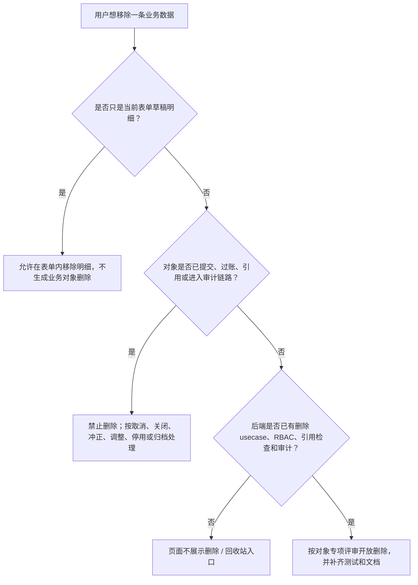

# 业务数据生命周期与页面动作规则 / Business Data Lifecycle UI Policy

本文定义当前产品页面、原型和实现必须共同遵守的业务对象生命周期与动作口径。

## 结论

当前业务页面不提供通用删除、批量删除、回收站或还原删除入口。页面动作必须表达真实业务生命周期：主数据走启用 / 停用，源单据走提交 / 取消 / 关闭 / 归档，事实和台账走取消 / 冲正 / 调整或只读，Workflow 只走任务状态和事件。

正式主数据、销售订单、采购订单、委外订单、生产订单和 BOM 列表统一提供“当前记录 / 历史记录 / 全部记录”只读范围筛选。`当前记录` 是页面默认值；`历史记录` 复用对象已有的停用、关闭、取消或归档状态；`全部记录` 只取消范围约束，不改变对象状态。系统另提供只读“历史记录中心”，按当前账号已有菜单和读取权限汇总这些对象，负责筛选、查看摘要、查看详情和跳回所属模块，不提供跨对象归档、恢复、删除或状态流转。

正式业务列表页还必须遵守统一的动作可用性合同：账号真正无权、所选对象或来源不适用、动作已经完成或记录进入终态时隐藏；未选择记录时保留有权限的常用动作并置灰，提示先选择记录；选中后，尚待满足可继续推进的前置条件、正在加载 / 保存或运行态暂不可办理时保留入口并置灰，以岗位语言说明原因。动作集合可以随所选对象、来源和生命周期合法变化，但不能因短暂 loading、重复请求或局部读回无理由闪烁、重排或左右跳动。

本文是页面设计和实现规则，不替代 `AGENTS.md`、`docs/当前真源与交接顺序.md`、Ent schema、后端 usecase、RBAC、测试或运行时代码。reference 文档只作为输入资料，未在本文列出的冻结、合并、替代、通用删除权限和通用软删除字段，都不能直接进入当前 runtime。

## 读者路径

| 你要做什么 | 先看本文哪里 | 再核对 |
| --- | --- | --- |
| 设计或评审一个列表页动作区 | [页面动作矩阵](#页面动作矩阵) | 对应 API / usecase / RBAC 和页面测试 |
| 安排业务列表的默认列顺序 | [列表信息顺序](#business-table-column-priority) | 对应领域列定义、账号列偏好和真实窗口宽度 |
| 判断能不能出现删除 / 回收站 | [删除进入条件](#删除进入条件) | `AGENTS.md`、`docs/当前真源与交接顺序.md` |
| 查询已关闭、取消或停用记录 | [历史记录查询合同](#历史记录查询合同) | 对应对象列表 API、菜单和读取权限 |
| 更新原型或标准样板 | [原型吸收规则](#原型吸收规则) | `docs/product/prototypes/README.md` 和对应原型 README |
| 补测试或浏览器回归 | [验收清单](#验收清单) | `web/README.md`、`docs/product/自动化测试策略.md` |

## 列表信息顺序

默认列顺序按岗位判断的重要性、查看频率和字段关联安排。常用桌面窗口不横向滚动时，应能识别业务对象、看懂主状态，并看到该页最关键的交期、数量或金额；按实际列宽验收，不以固定列数代替可见性。

| 信息 | 默认安排 | 页面差异 |
| --- | --- | --- |
| 单号、编号 / 名称、客户 / 供应商 | 最前面的识别信息 | 库存余额优先材料 / 产品、规格和仓库；变动记录优先发生时间和存货对象 |
| 主生命周期状态 | 紧邻识别信息，通常在前 2–4 个业务列 | 工序可委外 / 可内制等能力标记不是主状态；质检判定、异常审批和执行结果按本页任务保持清楚、相邻 |
| 关键交期、到期日期 | 在付款条款、地址、追溯说明之前 | 采购到货、委外回货、销售交付和出货日期优先；工程版本的生效区间相邻 |
| 关键数量、金额、责任人 | 在详细条款和审计信息之前 | 库存先看可用量；金额与币种、数量与单位保持邻近；只展示已有真实字段 |
| 备注、详细地址、税费拆分、创建 / 更新时间 | 通常靠后 | 审计、历史查询或专门核对页面按其任务安排，不机械套用订单顺序 |

前置解决默认打开时的信息可见性；固定列只用于横向对照时仍需保留的识别信息。固定区域应保持窄，不因前置状态而自动固定所有状态或整组字段。窄屏保留表内横向滚动，不挤压成不可读的文本，也不让整个页面横向溢出。

业务列定义用可选 `defaultPriority` 显式声明默认优先级，数值小的靠前，同优先级和未声明列保持原始相对顺序。共享 `moduleTableColumns.mjs` 先按原始列定义确定标识，再编排默认顺序；不通过字段名猜测优先级，不为换默认顺序搬动展示列的原始标识。

选填不等于无用。简称、报关资料、税号、详细条款等字段应先核对搜索、带值、打印和业务核对用途；没有证据时不能删除真源或改动必填规则。名称与简称相同时，客户和供应商选项只显示一次名称；独立简称继续参与识别和搜索。

仅在详情、编辑或导出时需要的辅助列，用列定义的 `listHidden: true` 退出主列表和列顺序面板，仍保留原字段及完整导出。该标记不保存新的账号偏好，不改变客户字段策略；权限策略隐藏的字段仍不得进入详情或导出。销售列表的完整收货信息可下沉，但出货列表仍保留用于核对送达对象的收货信息；各页按实际岗位任务选择，不按字段名或当前空值比例全局隐藏。列表列的展示标识、剩余个人顺序和恢复默认行为保持稳定。

账号主动保存的列顺序优先于默认优先级；新增可见列按默认优先级追加。没有个人设置或点击“恢复默认”后使用当前推荐顺序。列顺序只表达展示偏好，不改变事实、权限、明细业务顺序、打印模板或服务端记录排序。

## 页面动作矩阵

| 对象类型 | 页面默认动作 | 禁止默认出现 | 说明 |
| --- | --- | --- | --- |
| MasterData 主数据 | 新建、编辑、启用、停用、查看引用或历史 | 通用删除、回收站、还原删除 | 例如客户、供应商、产品、SKU、材料、仓库、工序。停用后不再进入新业务选择，历史单据仍可回显。 |
| Source Document 源单据 | 保存草稿、提交、审批、关闭、取消、归档 | 提交后删除、回收站 | 例如销售订单、采购订单、委外订单。草稿明细行可以在表单内移除，但不等同于列表级删除。 |
| Fact / Ledger 事实与台账 | 过账、取消、冲正、调整、只读查询 | 删除事实、清空流水、回收站 | 例如入库、出库、库存流水、出货、应收、应付、发票、对账。事实纠错必须保留可追溯反向记录或调整记录。 |
| Workflow 协同任务 | 完成、阻塞、驳回、催办、记录原因 | 把任务完成写成事实过账、删除业务对象 | Workflow task done 只代表协同任务状态变化，不代表库存、出货、财务、开票或收付款事实完成。 |
| Audit / Evidence 审计与证据 | 筛选、查看详情、导出受控证据 | 普通业务删除、静默清理 | 审计数据用于追责、排障和交付证据，不能被业务页动作绕过。 |
| 临时草稿 / 表单明细 | 添加、移除、清空当前草稿明细 | 把明细删除包装成业务对象删除 | 只在尚未形成正式业务事实前可移除；提交、过账或被引用后按所属对象生命周期处理。 |

BOM 这类版本型工程资料在页面上使用“历史版本 / 设为历史版本”表达，底层状态仍为 `ARCHIVED`。历史版本可重新激活，但不直接编辑；需要改版时应复制新草稿后修改。

## 历史记录查询合同

| 查询入口 | 范围 | 允许动作 | 明确不做 |
| --- | --- | --- | --- |
| 模块内“当前 / 历史 / 全部”筛选 | 当前模块和对象自己的分页列表 | 筛选、导出当前筛选结果、查看详情、按对象既有 usecase 办理合法动作 | 不新增统一 `archived_at`，不把“历史”解释成软删除 |
| 历史记录中心 | 当前账号已有菜单且具备读取权限的客户、供应商、材料、产品、SKU、加工环节、销售订单、采购订单、委外订单、生产订单和 BOM | 按一种对象类型筛选、查看只读摘要与详情、跳回所属模块 | 不跨对象一键归档或恢复，不绕过所属模块的状态、RBAC 和引用检查 |
| Fact / Ledger 与审计记录 | 继续留在各自事实台账、库存流水、财务记录和系统操作记录 | 使用原页面查询、追溯、冲正或调整 | 不因历史中心而隐藏、复制或迁移事实与审计真源 |

列表 API 的 `lifecycle_scope` 只接受 `current / history / all`。未传该参数时保留原 API 读取合同，避免影响既有引用选择器和内部读取；正式业务列表页面会显式发送范围。显式状态筛选必须与范围兼容，例如“当前记录 + 已关闭”应拒绝或由页面清空冲突状态，不能静默返回误导数据。

历史中心不是新的数据台账。每次只读取当前选中的一个对象来源，沿用该来源原有分页、关键字、状态字段、读取权限和菜单可见性，避免在前端拼接不准确的跨对象总数。是否能重新启用、重新激活或重开，仍由所属对象自己的 usecase 和页面动作决定。

## 选择记录后的动作可用性合同

| 条件 | 页面处理 | 原因 |
| --- | --- | --- |
| 当前账号没有动作权限 | 隐藏动作入口 | 不泄露无权能力；后端 RBAC 仍是安全边界。 |
| 客户配置未开放、模块关闭或当前产品没有该能力 | 隐藏动作入口 | 不用禁用占位伪装未实现能力。 |
| 有能力但尚未选择记录 | 显示有权限的常用动作并置灰，提示“请先选择一条记录”；不显示清空已选 | 保留岗位操作入口，便于先了解能办理什么；按桌面 / 窄屏动作上限收纳，避免按钮铺满工作区。新建、筛选、导入、导出和列顺序仍在列表工具条。 |
| 所选记录的对象类型、来源类型或事实类型不适用 | 隐藏动作入口 | 结构上不属于当前对象的动作不占位，不用永久灰色按钮制造误导。 |
| 当前动作已经完成，或记录已进入不能再办理该动作的终态 | 隐藏动作入口，由状态列、详情或关联记录表达结果 | 例如已提交后隐藏“提交”、已关闭后隐藏流转动作、已生成退货后由关联退货记录表达。 |
| 有能力且动作仍可能继续推进，但当前状态、前置资料或版本尚未满足 | 保留动作入口并置灰 | 用岗位语言提示需要先完成的步骤；满足条件后在原位置启用。 |
| 有能力但正在加载、保存或办理 | 保留固定动作槽并置灰；完成后按最新读回恢复 | 防止重复提交或并发编辑，不因短暂等待改变布局。 |
| 当前状态允许办理 | 启用对应动作 | 点击后仍由后端 usecase、状态机、版本、幂等和 RBAC 再校验。 |
| 当前状态没有合法主生命周期动作 | 隐藏主状态动作 | 终态不保留没有业务含义的“状态办理”灰色占位。 |
| 当前状态没有合法次级生命周期动作 | 不展示对应状态动作 | 状态动作按各自权限与状态判断，不保留空的分类入口。 |

`BusinessActionTooltip` 是临时不可用原因的共享入口；鼠标悬停和键盘聚焦都应能读取原因。桌面最多常驻四个动作，平板两个，手机一个；按固定优先级选择，其他合法动作进入按钮旁的“更多操作”下拉菜单，沿用同一处理函数及确认弹窗。主动作跟随阶段：质检草稿先提交、待判定再判定，收付款先核对审批、批准后再核销，生产草稿先下达。清空已选放在当前记录标识旁，不挤占业务动作名额；明细、材料、加工明细顺序属于本单辅助动作，随选中记录显示，已知仅一行或无明细时不展示排序。源单的正常关闭、提前关闭、取消等次级状态动作直接与其他辅助动作同级排列，不再增加“其他状态操作”分类下拉；沿用原确认弹窗和原因必填规则。仅启用态变化不能参与窄屏排序，下拉菜单内当前合法动作的次序也不能因 loading 改变。切换业务对象类型、来源类型、事实类型、正式页签或生命周期阶段时，动作集合可以按当前对象合同变化；读权限只能展示“查看”入口，不能借只读权限展示“返工、过账、取消”等写操作文案。

## 正式页面覆盖矩阵

下表记录当前选择行操作条的覆盖面。它是交互合同清单，不替代各页面的后端状态机和权限真源。

岗位是当前默认分工的说明；实际入口由后端权限、客户有效配置、任务责任与当前记录共同决定。财务兼采购通过同时分配两个角色获得合同经办能力，不扩大纯财务权限。具体步骤见[业务与协同流程地图](../workflow/业务与协同流程地图.md)。

| 页面 / 对象 | 保留或补齐的按钮 | 默认办理岗位及条件 | 移除、隐藏或修正 |
| --- | --- | --- | --- |
| 主数据：客户、供应商、材料、产品、规格、仓库、工序 | 新建、编辑 / 查看、启用 / 停用、联系人和相关资料 | 各档案对应维护权限；读权限仅查看 | 不增加通用删除；停用不会抹除历史引用 |
| BOM 版本 | 新建、查看、编辑、复制、打印、激活、设为历史版本 | 工程；只编辑草稿，历史版本可按既有权限激活 | 已激活不再显示激活；不可编辑版本隐藏编辑；复制仍用于改版 |
| 销售订单 | 新建 / 导入、查看、编辑、明细顺序、工程与打样、用料汇总、预留库存、状态操作 | 业务建单；工程建档及提交用料；管理 / 财务办理用料审批；业务对生效订单预留 | 草稿显示提交，已生效显示合法关闭动作；终态隐藏流转和编辑。用料入口按能力称为“提交 / 审核 / 查看用料汇总” |
| 采购订单 | 查看详情、编辑、材料顺序、关联单据、登记到货、打印合同、状态操作 | 采购制单及合同办理；仓库按已批准订单登记实际到货；财务可按读权限核对 | 补上独立详情按钮；“生成入库”改为“登记到货”，生成待检记录，不代表库存入账；提交后隐藏编辑 |
| 采购入库 | 查看、关联单据、确认材料入库、退货、调整、生成 / 查看应付、取消 | 仓库 IQC 登记来料并可取消未入库错误登记；仓库在检验通过后确认入库；采购处理商务退货；财务登记应付 | IQC 的取消草稿权限不能冲正已入库单据；“确认材料入库”仍须仓库入库权限；已过账隐藏重复入库；退货和调整只在已过账记录出现 |
| 加工合同 / 委外订单 | 查看详情、编辑、加工明细顺序、关联事实、打印、状态操作 | 生产提出加工要求，财务兼采购补价和确认合同；仓库处理对应发料 / 回仓 | 补上独立详情按钮；已确认隐藏编辑和再次确认；合同确认不直接写库存、质检或应付 |
| 生产订单 | 查看、编辑、下达、工序办理 / 查看、完工申报、关联事实、关闭、取消 | PMC 建单与下达，生产申报；相关岗位查看路线；仓库确认完工入库 | 已下达隐藏编辑和再次下达；已关闭原批次只读，合法成品返工仍保留入口 |
| 生产工序弹窗 | 安排加工、拆分、开始工序、本厂完工、外发回仓、转下道、包材确认、返工 | 生产安排、开工、完工与转序；仓库登记外发回仓；业务确认包材；返工另受权限控制 | 按动作分别核对岗位；本厂与外发不互相展示完工按钮；已办理步骤、已拆分 / 取消批次隐藏对应动作；转序仍需质量通过 |
| 质量检验 | 查看、提交检验、判定合格 / 不合格、取消、不合格处置 / 查看 | 品质提交和判定；采购办理来料处置；生产处理在制异常；委外处置按专门权限 | 已判定隐藏提交和再次判定；不合格处置按来料、委外、在制来源和权限路由，完成后改由关联记录追溯 |
| 库存台账与作业 | 关联查询、盘点、调拨、人工调整、作业详情与合法确认 / 取消 | 仓库具备对应库存作业权限；人工调整按有效审批办理 | 余额 / 流水不提供直接编辑或删除；只有库存余额页保留作业入口 |
| 出货单 | 查看 / 关联、草稿编辑、出货前检验、核对放行、确认出货、作废 / 撤销、应收 / 开票来源 | 品质发起出货检验；财务审批；仓库出货；财务登记后续事实 | 进入财务流程的草稿隐藏编辑，双击也改为查看；已放行隐藏重复放行，已出货隐藏重复出货，审批驳回隐藏无法继续的动作 |
| 生产 / 委外 / 库存运营事实 | 查看、编辑草稿、确认作业、取消、返工、关联单据 | 按事实类型拆分生产申报、仓库过账及异常权限；成品入库由仓库确认 | 不按“能读事实”展示写动作；完成 / 取消后隐藏重复动作；合法返工与冲正保留 |
| 应收、应付、开票、对账 | 查看、确认、取消、关联来源、单笔对账、结清、打印 | 财务；只创建草稿，再由对应领域动作确认 | 非对账来源不显示单笔对账；已结清或取消隐藏重复办理；不由任务完成替代财务事实 |
| 收付款与红冲 | 核销过账、核对审批 / 取消、冲销、重新读取、红冲撤销、异常流程恢复 | 财务办理；异常恢复仅向具备专门权限的岗位开放 | 已批准隐藏重复审批；已冲销 / 取消不再保留无效按钮；隐藏无权恢复组件，避免空“更多操作” |
| 协同任务、排产 / 进度 / 异常 / 放行任务页 | 查看任务、来源办理、完成 / 批准、阻塞 / 恢复、退回、催办、列顺序 | 以服务端 action explain、owner / assignee 和动作权限为准 | 移除未实现的导出占位；终态不显示流转；到货、入库、工程等来源任务只能进入对应业务办理，不能泛化“完成任务”替代事实 |
| 工作台与经营看板 | 岗位任务、审批、查看进展和来源跳转 | 任务操作继续使用统一任务权限与状态合同；指标只读 | 不增加修改指标、跳过审批或一键完成业务链的入口 |
| 历史记录、审计、帮助 | 筛选、详情、返回业务页、受控导出 / 帮助导航 | 已有读取和菜单权限 | 保持只读，不增加删除、恢复或跨模块状态操作 |
| 打印中心与各打印工作台 | 选择来源、编辑打印草稿、预览、打印 / 导出、清空打印草稿 | 对应单据与模板读取 / 编辑权限 | 保留打印动作，不将打印保存解释为订单修改、合同确认或事实过账 |
| 权限与审批责任设置 | 查看配置、授权范围内调整、检查、保存生效 | 管理配置权限；生效前检查责任人有效性 | 普通岗位不展示管理写入口；配置不替代业务审批 |

“生成应付 / 应收 / 开票”等可重放来源动作仍由后端幂等和来源余量控制，不能仅凭单据进入下一状态就推断已经完成。重新读取用于不确定结果恢复，不执行第二次过账。多次到货、分批出货、返工和冲正继续保留各自合法入口。

## 删除进入条件

只有同时满足以下条件，某个对象才可以单独评审删除或恢复：

1. 对象仍是草稿、误建或临时数据，尚未进入正式业务链路。
2. 后端 usecase 已实现状态检查、引用检查、权限检查和审计记录。
3. 已完成 RBAC、API、前端提示、错误码或错误提示、测试和浏览器回归。
4. 已被引用、已提交、已过账、已发货、已产生财务事实、已进入 Workflow 或审计链路时，删除必须拒绝，并给出可读原因和替代动作。

页面不能为了视觉完整性补本地删除、软删除假状态、回收站空态或禁用按钮。尚未满足条件时，直接不展示删除 / 回收站入口。

## 决策路径

```mermaid
flowchart TD
  A["用户想移除一条业务数据"] --> B{"是否只是当前表单草稿明细？"}
  B -->|是| C["允许在表单内移除明细，不生成业务对象删除"]
  B -->|否| D{"对象是否已提交、过账、引用或进入审计链路？"}
  D -->|是| E["禁止删除；按取消、关闭、冲正、调整、停用或归档处理"]
  D -->|否| F{"后端是否已有删除 usecase、RBAC、引用检查和审计？"}
  F -->|否| G["页面不展示删除 / 回收站入口"]
  F -->|是| H["按对象专项评审开放删除，并补齐测试和文档"]
```

## 原型吸收规则

- 标准业务页原型只表达筛选、列顺序、当前记录动作、分页和协同入口，不再内置通用回收站。
- 局部动作弹窗样板承接来源选择器、列顺序、危险动作确认和生命周期动作说明；只有完成真实软删除 / 恢复 usecase 的对象，才能在对象专项原型里单独设计回收站。
- 业务表单样板里的“删除”只允许表达草稿明细行移除，应在说明里明确它不是业务对象列表级删除。
- 原型中的静态按钮不能反推 API、RBAC、schema、migration 或事实写入能力；进入运行时前必须回到当前代码和测试复核。

## 验收清单

| 检查项 | 通过标准 |
| --- | --- |
| 列表页工具条 | 不出现通用批量删除、回收站或还原删除；只保留真实共享动作，例如导出当前筛选和列顺序。 |
| 历史范围筛选 | 默认显示当前记录；切换范围会清空不兼容的状态筛选；历史深链刷新后仍保持范围；全部记录不改变任何对象状态。 |
| 历史记录中心 | 只显示当前账号有菜单且有读取权限的来源；无可读来源时不发业务读取请求；详情和跳转不展示原始内部 ID，也不提供归档、恢复、删除或跨对象状态动作。 |
| 当前操作区 | 无权限、结构不适用、动作已完成或终态动作不占位；未选择时保留有权限的禁用入口并提示选择；可继续推进的前置条件不足或忙碌时置灰并显示统一原因；空“更多操作”隐藏。 |
| 表单明细 | 删除文案限定为“移除明细行”或等价语义，不误导成业务对象删除。 |
| 原型登记 | To Implement 样板不承诺通用回收站，说明进入对象专项前必须先有后端闭环。 |
| 文档口径 | 规则必须直接由本文、当前真源、代码和测试承接；外部材料原文不进入仓库，也不作为实现依据。 |
| 测试守卫 | 前端测试至少覆盖无权限隐藏、未选择和清空选择后仍展示有权限的禁用入口、结构不适用隐藏、可继续推进的前置条件置灰、可用启用、动作完成 / 终态隐藏、加载 / 保存和空“更多操作”隐藏；浏览器回归验证桌面 / 窄屏 / 暗色的 DOM 顺序、相对边界框和横向溢出。 |

## 本轮不做

- 不新增 `deleted_at / archived_at / frozen_at` 通用字段。
- 不新增通用删除、恢复、回收站 API。
- 不新增 RBAC 权限码。
- 不改变现有 WorkflowUsecase、Fact usecase、schema、migration 或业务菜单权限真源；历史记录中心作为已登录工具入口，仅复用现有菜单可见性和读取权限决定其可查来源。
- 不把 reference 文档中的冻结、合并、替代、通用软删除策略直接落到当前 runtime。

## 主题模式 / Theme mode

桌面后台、统一登录页、岗位任务端和开发工作台支持「跟系统 / 浅色 / 暗色」三种主题模式，默认跟随系统偏好。开发工作台在共享侧栏操作区提供主题入口，所有 `/__dev/**` 页面复用同一运行时状态；用户手动选择会写入浏览器 `localStorage` 的 `plush_erp_theme_mode`，刷新后保持。`跟系统` 只决定视觉主题，不影响入口选择、权限判断或最终路由。

当前登录态 token 仍保存在浏览器侧认证存储中，并通过 `Authorization: Bearer` 发送，主要风险面是 XSS 后的 token 读取或泄露；不得把 token 写入 trace、日志、文档、截图或 QA 报告。生产侧已补基础 HTTP 安全响应头降低误嵌入、MIME sniff 和宽泛 referrer 风险，但这不等同于 HttpOnly Cookie 方案。当前内部系统不把 CSRF 作为近期安全待办；只有后续明确迁到浏览器自动携带的 Cookie 登录态时，才需要把 SameSite / CSRF、登录态刷新和前端 API client 改造放到同一轮专项评审。

主题主路径：

- 运行时状态由 `src/common/theme/erpTheme.jsx` 和 `src/common/theme/erpThemeMode.mjs` 维护。
- Ant Design 组件通过根 `ConfigProvider` 在 `defaultAlgorithm / darkAlgorithm` 间切换。
- 项目自定义壳层、岗位任务卡片和局部硬编码样式通过 `data-erp-theme` 与 `src/erp/styles/app.css` 入口及 `src/erp/styles/app/` 分区文件中的 ERP theme 变量覆盖。
- 新增状态类组件时必须同步覆盖暗色主题，包括 loading / empty / alert / message / notification / tooltip / popover / tag / badge / progress / pagination / drawer / table placeholder；优先复用全局 token 和页面级浏览器回归断言（Style L1），避免组件只在浅色模式可读。
- 打印、PDF、采购合同 / 加工合同纸面预览默认固定浅色，不跟随暗色主题，避免污染导出物。

## 共享控件样式边界 / Shared control style boundary

文字按钮的水平内边距由 `src/App.jsx` 的 Ant Design `Button` token 统一提供：普通和小号按钮均为 12px，大号按钮为 16px。工具栏、当前操作区、弹窗和浮层沿用这套基线；同一规格的主按钮、次按钮、禁用和 loading 状态不另设 padding。普通业务动作与状态动作统一按内容定宽，长文案自然伸展。嵌入列表的当前操作区在桌面统一使用 30px 按钮高度；窄屏允许长文案换行，保留内边距和至少 44px 触控高度。纯图标、行内文字链接和手机整行按钮按各自用途保留紧凑外形或触控布局，不用固定宽度修补普通按钮的留白。

`src/erp/styles/app.css` 的最后三层是输入框、选择器、日期框、数字框和 Ant Design portal 浮层控件的共享治理层。它们只处理控件基线，不承接单页布局、字段语义、业务状态或客户差异。

| 文件 | 职责 | 不应放入 |
| --- | --- | --- |
| `app/control-foundation.css` | ERP runtime 可见控件 token、圆角、wrapper 裁剪、portal 控件基线和嵌套原生输入透明化。 | 单页间距、业务字段宽度、表格布局、具体弹窗内容排列。 |
| `app/business-control-rhythm.css` | 业务表单、业务 action modal、业务筛选和业务记录弹窗的控件高度、真实 input / placeholder / search input 的 line-height、textarea 最小高度。 | focus 颜色、hover 状态、页面级 grid / flex 布局、业务保存逻辑。 |
| `app/control-focus.css` | 应用根与 portal 控件的 focus / focus-within ring、组合控件内层焦点清理、checkbox focus ring。 | 控件高度、圆角、字段语义、可见文案、权限或菜单规则。 |

维护规则：

- 改 caret、placeholder 垂直居中、input 高度时，优先改 `business-control-rhythm.css`，并确认真实 `input.ant-input`、Select placeholder/search input 和 wrapper 作为一个控件合同一起生效。
- AntD 输入控件的圆角只由 `control-foundation.css` 绘制；组合控件内侧接缝通过局部 `--erp-control-radius: 0` 表达，外层保持统一圆角。页面负责布局与尺寸规格，不重新声明同一控件的圆角。
- focus ring 只由 `control-focus.css` 绘制，颜色由 `--erp-control-focus-border / --erp-control-focus-ring` 提供；主题切换调整变量。使用 inset ring，避免被圆角容器或滚动区域裁掉。Select outlined 变体按 AntD 的 disabled / customize / pagination 条件覆盖，不通过重复类名提权。
- 不在业务页面 CSS 里重复写单字段 caret、line-height 或 focus ring 补丁；确有新控件类型时先补 `style:l1` 浏览器断言，再扩展共享层。
- 新增规则不能使用 `!important`，除非正在对抗不可控的第三方内联样式，并且必须在交付说明中写明原因。

Tailwind Forms 只生成显式 `form-*` 类，供原生表单控件按需使用，不对 AntD 内层 input 做全局重置。表头共享规则归 `common/components/table/app-table.css` 的 `.app-table` 作用域；业务页面 CSS 不定义全站 AntD 表头。模块打印使用命名 `@page`，对 body 的隔离仅在该模块打印根节点存在时生效。

`pnpm css` 通过 `scripts/stylelint/styleBoundaries.mjs` 检查模块作用域、重复类名、控件圆角与焦点归属、打印页作用域；全局基线文件的允许清单也由该规则维护。`!important` 例外只在必要声明附近附理由，现有 SVG 内联尺寸覆盖和 reduced-motion 无障碍覆盖保持局部范围。规则测试使用 CSS 输入验证允许与拒绝行为，避免绑定整份源码文本或行号。

浏览器回归复用 `style-l1/inputControlAssertions.mjs` 的内外层合同与 `styleIsolationAssertions.mjs` 的外观采集；访问其他模块后比较同一控件的默认、hover、focus 样式，保留已加载 CSS，不用刷新页面消除污染。业务场景只编排真实交互与状态，不重复实现颜色、圆角和几何判断；DEV 打印隔离留在 DEV 场景中，普通业务回归不依赖 DEV 路由。

## 表格对齐 / Table alignment

业务列表、弹窗明细和研发工作台的 Ant Design 表格统一使用 `common/components/table/AppTable.jsx`。表头和单元格默认上下居中；表头文字水平居中，排序、筛选和列设置控件保留操作空间。序号、编号、单位、日期、状态、短分类和操作列默认水平居中；品名、厂商、地址、备注和复合说明列通过 `align: 'left'` 保持扫读；数量、重量、单价和金额列通过 `align: 'right'` 方便核算。列定义明确语义，不按运行时文字长度或字段名称猜测对齐方式。

序号有逐行核对用途时独立成列，不拼入品名。可复制字段的按钮不挤偏居中文字；原生单据编辑表与 BOM 明细沿用相同表头、垂直对齐和数值输入规则。文档表格的正文保留长文本阅读方式，打印纸面按各模板正式版式单独维护。

## 前端实现与读取边界

- 桌面后台继续只保留一个入口
- 桌面后台不再保留角色切换、角色首页或角色入口菜单；统一登录页和 `/entry` 只做后台 / 岗位任务端入口选择
- 桌面后台管理员已接入 RBAC 权限中心；普通管理员通过 `roles` 获得 `permissions`，后端返回 `menus`，桌面菜单、岗位任务端入口和后端接口统一消费 permission code。权限清单按后端 `module_name` 展示“物料清单（BOM）/ 库存管理 / 生产执行 / 敏感字段”等业务分类，不在前端重复维护模块翻译；仅对未知或缺失分类合并显示一个“未分类功能”，避免多个技术模块同时冒充“其他功能”。分类导航只负责页内定位，不改变勾选结果或权限真源
- 桌面后台主业务菜单按当前产品设计保留看板中心、主数据、销售管理、产品工程、采购管理、质检管理、库存管理、委外管理、生产管理、出货管理、财务业务、运营工具和系统管理；系统管理当前包含权限管理和审计日志。客户档案 / 供应商与加工厂走正式 MasterData V1 API，销售订单走正式 SalesOrder V1 API，采购订单走正式 PurchaseOrder V1 API。正式业务列表统一为单击行选中、双击行进入整页编辑或当前主操作；详情抽屉只由显式详情入口打开。
- 正式业务主表只在显式白名单内的业务编号、名称、联系人、批次和可直接转交的短引用值上提供快捷复制。电脑端悬停单元格或用键盘聚焦时显示复制按钮，触屏端直接显示；鼠标复制后移出单元格即隐藏，键盘操作保留焦点。复制按钮只复制当前字段，不触发行选择或双击打开；空值、日期、金额、数量、状态、备注和内部 ID 不显示按钮，弹窗及明细子表继续使用系统文字选择能力。
- 采购订单页面支持列表、关键词 / 状态 / 采购日期或预计到货日期范围筛选、详情、订单头与明细保存、提交、审批、关闭和取消，但只表达采购承诺，不写库存、批次或财务事实。入库、来料质检、库存台账、委外订单、出货单、生产记录、排产确认、异常处理、出货放行、出库管理和财务业务已分别接入正式 V1、Workflow V1 或收窄 Operational Fact V1 页面。
- 销售订单、采购订单和委外订单的草稿表单提供显式明细顺序面板：在面板内上移、下移、移到最前或最后，点击“应用顺序”后只更新当前表单，仍需保存单据才正式生效。重排只改变展示和后续来源选择顺序，不改写已保存明细的稳定行号，也不影响已经形成的库存、出货或财务事实。
- 出货单页面支持状态 / 计划出货或实际出货日期范围筛选、事务内聚合新建草稿、只读查看明细、启动财务审批、确认出货和已出货取消冲正。品质岗位可在启动前从 `DRAFT` 出货单按产品规格、仓库和批次发起出货前成品检验；一旦存在检验，未完成合格 / 让步判定时后端会阻止启动，启动成功后也不再允许补建检验。前端必须校验返回的 ProcessInstance、财务 approval 节点和来源锚点，结构不可信时不冒充成功。没有发起检验仍按当前可选策略启动；创建检验不会启动 Workflow。财务审批通过后只写 Shipment 版本化放行门禁，仓库仍须显式确认出货；`SHIPPED + inventory OUT` 才是真实出货事实。草稿逐行追加已退出，避免重复提交和多行半保存。
- 审计日志页面只读展示启动初始化和账号 / 角色 / 权限等系统控制面事件，不替代业务事实流水。排产确认与历史出货放行由 Workflow V1 协同页只读或按现有任务合同办理；排产确认待办由生产订单下达产生，新的 Shipment 财务 approval 由 `finished_goods_delivery` 产生，历史 `shipment_release` 不再有公开 producer。异常处理的待审批任务由正式处置申请启动的 `production_exception_approval` 生成；返工事实过账产生的 `production_exception` 来源提醒不进入该页待审批任务表。这些页面都不提供通用新建入口，保留任务组和确定性编号不能由普通任务创建或客户配置占用。任务终态只更新协同投影；来源随后关闭、取消或真实出货时可以继续投影 `closed / cancelled / shipped`，但不改写任务处理结论。相关页面只读取对应的 Source Document、Workflow 或 Fact 投影，也不提供删除、回收站、业务数据导出或跨领域事实旁路。
- 生产管理侧栏只展示“生产订单”和“生产记录”。“排产确认”从已发布生产订单的明确动作或任务链接进入；“异常处理 / 待审批”从生产记录内切换或任务链接进入。两个内页仍保留正式路由、RBAC 和来源精确筛选，只是不再占用独立侧栏叶子。
- `异常处理` 是上述 Workflow V1 页面中的正式复合变体：`异常处理` 页签读取 ProductionExceptionDecision 并承接审批后的执行 / 冲正，`待审批` 页签只读取 `production_exception_decision_approval` 任务。两个页签分别维护统计、刷新和操作区，每次只挂载当前页签；任务完成仍不代替报废 / 在制让步执行或超领额度消费。
- 正式业务页的“相关单据”支持连续往返。每一跳都以目标页拥有的数值 ID 或来源类型 + 来源 ID 重新建立精确筛选，业务单号只用于筛选框回显，不参与精确请求。目标关系只有一条可确定记录时自动选中并回显目标单号，用户编辑或清空筛选后退出关联上下文；存在多条取消历史且无法唯一确定时不臆选。
- 生产订单页的“工序办理”已接固定 `PLUSH_SEW_HAND_V1` v1：布料加工正常流整单外发且首道不可拆，只有裁片检验 `PASS` 转入车缝后才可按产品数量拆批；车缝和手工按“先车缝、后手工”分别选择本厂或外发。内部完成使用“车间移交 / WIP 转移”，外发完成返回才使用“外发回仓”。首道外发只允许选择逐条精确覆盖显式 `FABRIC_PROCESSING` 冻结材料需求的 MATERIAL 合同行，并在开始前核对已过账委外发料；FABRIC 返工再次外发改用新的 PRODUCT 合同行。生产、品质、业务和 PMC 分别按 WIP 执行、分段质检、包材业务确认和只读跟进权限进入对应入口，业务岗位可凭 `production.wip.read` 打开生产订单页，但新建、编辑、发布、关闭、取消和引用选项仍只认 PMC 计划权限。
- 质量检验页已把生产 WIP 纳入独立读模型，按裁片、皮套、成品、针检、抽检和订单条件性客户验货逐关口展示；每张单只代表当前批次当前关口，生产路线当前只有 `PASS` 可推进，`CONCESSION` fail closed。包材版面 / 包装版本由业务独立确认，不替代正式品质检验；路线订单的完工入库入口会重新核对已验收包装 WIP 数量。
- 上述生产路线、WIP、分段质检和岗位投影当前只证明本地源码与定向合同已经接入；完整 Atlas 迁移链已在一次性 PostgreSQL 18 隔离库 apply 并读回，登记的个人开发库仍有 `20260718110227` pending，目标客户数据库没有本轮 apply、部署、health / smoke 或客户 UAT 证据。
- 首批高优先级业务页已接入共享业务附件面板：销售订单、采购订单、委外订单、采购入库、来料质检、出货单、收窄财务 / 生产 / 委外事实、SKU、BOM、Workflow V1 桌面页和岗位任务端详情可上传、下载附件。待上传文件仍可在保存前“移除”；普通已保存证据不提供物理删除，只允许有所属对象写权限的账号填写原因后“撤销附件”。撤销后列表继续显示文件名、上传人 / 时间和撤销人 / 时间 / 原因，预览与下载动作退出且撤销动作保持置灰；正确文件需另行上传，不恢复或改写已撤销记录。产品基础信息页另提供 `产品图 1（主图）/ 产品图 2（辅图）` 两个可替换媒体槽，只允许 PNG / JPEG / WEBP；源图选择不设文件大小上限，超过打印快照预算时浏览器会自动优化为不超过 1MiB、长边不超过 2560px、总像素不超过 400 万的 WEBP。服务端仍对最终快照执行 5MB、单边 8192px 和总像素 2000 万的纵深门禁；同槽替换 / 清空是产品媒体的窄例外，不进入普通证据撤销。普通证据附件上限仍为 5MB，允许格式覆盖常见图片、HEIC / HEIF、PDF、Word、Excel、CSV、文本、ZIP、邮件证据和 WPS 文件；PNG / JPG / WEBP / GIF / PDF 支持轻量预览，其他格式下载后查看。单据编辑弹窗中的附件默认作为备注 / 交付 / 合同资料 / 凭证附近的紧凑证据行放在明细区之前，页面级选中记录附件仍可保留独立区块。附件必须挂到已保存业务记录，上传、预览、下载或撤销都不改变 Source Document、Fact、Workflow、库存、质检或财务状态。
- 委外订单附件另提供“选择合同附图”，只接收 PNG / JPEG / WEBP / GIF 并标记为 `print_appendix`。未撤销的合同附图在打开加工合同打印时冻结带入末尾；普通归档附件不会自动进入纸面，打印窗口内调序、移除或新增也不回写业务附件。
- 桌面后台已恢复 `使用帮助 / 岗位使用帮助` 分组，不恢复旧 `帮助中心`、`开发与验收` 或 `高级文档` 信息架构；前端仍不承接 Markdown 文档页、业务链路调试页或协同任务调试页
- 岗位任务端本地和生产环境统一走 `5175` 的 `/m/<role>/tasks`；不再保留按角色拆端口入口，也不拆第二个仓库
- 岗位任务端只保留任务页，不展示角色说明、端口说明、技术字段、状态字典或帮助文案；根路径和未知路径统一进入任务页
- 岗位任务页读取真实 workflow API，采用有意组合的移动主路径：保留 v1 的待办 / 已办 / 风险 / 我的四项主导航、服务端游标分页 / 分批展开和任务卡片。首次无游标 `list_role_tasks` 在同一读快照返回 `ready / blocked / todo / done / rejected / withdrawn / history / total / approval / risk / overdue`、`risk_scope` 和 `server_time`；`todo=ready+blocked`、`history=done+rejected+withdrawn`、`total=todo+history`、`overdue<=risk`，响应字段或公式不可信时失败关闭。待办筛选“全部”读取 `todo`，已办读取 `history`；审批、风险、超时可重叠，不与岗位 `total` 相加。有效 `workflow.task.supervise` 把风险扩为 `risk_scope=supervised` 并显示“跨岗风险”，不扩大当前岗位状态数量或任务办理权限。每个 `todo / approval / risk / history` 查询槽位分别保存数量和服务端时间，后续游标页不重复总数；任务处理成功后使全部槽位失效、重读首屏并恢复原已加载深度。筛选数字不再取本地数组长度，尚未读到可信总数时显示“—”而不是 0。无审批权限时待办筛选为“全部 / 风险 / 超时”，有任一有效审批能力时为“全部 / 审批 / 风险 / 超时”，不增加第五个底部导航；原“我负责”近似筛选已移除。选中任务后进入 v2 独立全屏查看、处理和可信结果回执，结束后恢复原列表的筛选、分页、滚动位置和焦点。完成 / 阻塞 / 退回分别走 `complete_task_action` / `block_task_action` / `reject_task_action`，均由服务端按当前管理员和任务责任推导角色；`withdrawn` 只由来源取消或受控恢复内部写入，不开放为岗位动作。桌面任务看板、Workflow V1 页面、业务协同 Drawer 和岗位任务端提交前预检已消费 `explainWorkflowActionAccess` / `explainWorkflowTaskAssignment` 的后端只读原因；移动端只提交 Workflow task action，附件上传和 Workflow done 都不代表业务 Fact 已生效
- 看板中心和岗位任务端共用 `WorkflowTaskIdentity` 展示产品 / 物料名称、产品编号、款号和关联订单。任务名称保持主标题；列表只显示首项和总项数，详情可展开其余产品 / 物料。优先读取服务端 `display_context`，它按已授权任务的正式来源绑定批量读取单据名称 / 编号快照和材料档案的 `supplier_item_no` 完整款号；系统物料编号与产品档案的内部 `style_no` 只在详情及完整信息复制中按各自名称保留，缺值不互相代填。没有正式来源绑定的任务只使用自己的已有展示快照；明确空投影或来源失效不回填旧 payload。手机保留现有主题、四项导航、游标续取、附件、处理流程及返回恢复，不套用整张示意图的视觉样式。
- 桌面任务抽屉与岗位任务详情统一把 `get_task_process_context` 展示为“业务轨迹”，把 `list_task_events` 展示为“本任务处理记录”。业务轨迹回答来源流程走到哪里；任务记录按最新在前显示当前任务的进度、异常 / 恢复、责任流转、处理岗位与意见。单条任务事件不是完整审批链，失败也不隐藏另一条读链；两者都不代替 Source Document 或领域 Fact。
- 桌面 `/erp/task-board` 的任务详情抽屉通过 `get_task_assignment_options` 获取服务端筛选后的接收人，并以 `reassign_task` 提交接收人或岗位池、当前 version、幂等键和必填原因；前端不从管理员列表自行拼候选人。当前默认只有老板角色和 super admin 能看到转交动作，但 super admin 不会因全权限自动成为业务岗位接收人；PMC 仍只读监督。转交成功后抽屉关闭并刷新服务端任务投影，只改变个人归属，不改变任务状态或业务事实。`/m/<role>/tasks` 当前仍只提供既有完成 / 阻塞 / 退回 / 催办动作，不把桌面转交入口误写成岗位任务端已接能力
- 正式完成 / 阻塞 / 退回 / 催办入口为一次用户 intent 冻结业务参数、`expected_version` 和安全 UUID `idempotency_key`；HTTPS 优先使用 `crypto.randomUUID()`，内网 HTTP 浏览器使用 `crypto.getRandomValues()` 生成 RFC 4122 v4 key，不允许退回 `Math.random()`。只有新 intent 执行 explain 预检；HTTP 408、网络中断、5xx 或结构不合法的 success response 都保留原 attempt、抽屉、原因、证据和同一 key，原样读取 / 重放 receipt，不刷新列表也不把未知结果误报为失败。后端在每次请求仍重新校验登录、RBAC、客户 scope、任务可见性和 receipt，前端跳过重复 explain 不构成授权绕过
- Dashboard、Workflow V1 页面、岗位任务端、采购订单与委外订单协同入口共用 task 级同步 in-flight guard：同一 task 的首个动作在任何 await 前取得 lease，完成 / 阻塞 / 退回 / 催办跨动作双击不会发出第二个请求，`finally` 只释放本次持有的 lease。Go 与 JS 已共同消费 `scripts/qa/workflow-task-mutation-intent-v1.vectors.json`，锁住 mixed evidence 类型 / 顺序、raw whitespace key、mobile 精确重复 key 和 changed-intent relations；Node 24.14 定向 util + mobile + purchase / outsourcing guard 为 33/33，联合 Workflow API / caller 为 62/62，受影响 ESLint 0 error。该结果不代表 final full/strict、页面级浏览器回归（Style L1）或目标环境证据已经完成。
- 岗位任务端复用管理员登录态，登录页固定提供密码登录，并在后端启用短信能力时提供短信登录；账号未授权当前角色、手机号未绑定或未授权当前角色、登录失效时进入 `/admin-login`，登录后回到任务页，并提供退出登录按钮
- 登录页公开提供 `/legal/privacy` 与 `/legal/system-rules`，短信模式在手机号旁说明登录验证用途；登录后的电脑账号菜单和手机“我的 / 入口与安全”保留同一规则入口。`LegalNoticeGate` 按当前账号、客户 `legalNotice` 版本和规范化内容指纹查询后端追加式知悉审计；未命中时要求“已阅读并知悉”，规则或客户处理方配置变化后重新提示。该回执不是概括授权同意，不存手机号、密码、token 或业务原文；状态核对失败时显示可重试警告，不阻断全部 ERP。
- 模板打印当前由对应业务页选中记录后带值打开；产品页维护的 0–2 张产品图会在 BOM 生成物料明细 / 作业指导书时冻结到右上角，委外订单仅在全部有效产品行归属同一产品时自动带图。打印中心保留默认样例，并已按原型复核后的轻量两栏承接左侧模板导航、右侧纸面预览和打印窗口入口；字段和当前草稿图片编辑在独立打印窗口内完成。
- 扩展硬件链路、PDA、条码枪、图片识别继续 deferred
- `docs/product/prototypes/admin-command-center-v1/` 仍按 `待实现 / To Implement` 登记。当前运行时已吸收主要运行时骨架：`/erp/dashboard` 是后台首页 / 工作台，并承接待我处理、按有效审批能力显示的待我审批与阻塞 / 逾期风险队列；`/erp/task-board` 是任务看板，`/erp/business-dashboard` 是业务看板，`/erp/print-center` 是模板打印中心。工作台和业务看板保留后台运营中枢导航；不再提供重复的通用异常总控页。未获用户明确确认前，不能把该资产改成 Current。
- `docs/product/prototypes/print-template-center-v1/` 按 `待实现 / To Implement` 登记，补齐模板打印中心独立样板；当前运行时已按原型复核后的轻量两栏保留模板导航 / 预览和打印窗口入口，字段编辑回到独立打印窗口。该原型不新增样品确认单、字段映射配置、后端 API、RBAC、schema、migration 或 Fact 写入。
- 工作台任务队列使用全宽表格，移除常驻“当前选中任务”侧栏与选中状态；单击整行进入共享抽屉，任务标题与小箭头提示入口，标题支持 Enter / Space，关闭后焦点回到原任务，拖选文字不误开任务。保留待我处理 / 审批 / 阻塞逾期筛选和 8 项分页；任务与产品放在首列，直接显示问题原因，普通截止时间不使用成功色标签。工作台和完整分类列表均移除独立“查看任务”操作列；完整分类列表合并为任务产品、单据截止、状态原因与负责三列。
- 业务看板按“需要关注 → 业务数据”排列：任务预览直接展示产品、单据、原因、负责岗位与截止，有权限时使用明确的“查看单据”；删除重复汇总卡和常驻侧栏，保留各对象独立数量、0 / 不可用区分与按需展开的统计说明。
- 任务识别组件展示来源投影绑定的产品主图：桌面 64px、手机 52px，保持轮廓，缺图、物料或无有效 `product.read` 时显示同尺寸图标占位，加载失败也保留图片区域。列表延迟读取 160px 缩略图并按当前账号权限范围去重；看板中心、移动端列表和详情均可点图查看原图，点任务其余区域仍进入任务。预览复用 Ant Design Image，支持滚轮 / 双指缩放、拖动、适应屏幕、关闭与 Esc，关闭后保留筛选、滚动位置和触发按钮焦点；占位不打开预览。原图只在打开时读取，关闭后释放，加载失败可重试，关闭或来源 / 权限变化后丢弃迟到响应。主图清空、来源切换和解除关联不回填旧引用；物料项不借用产品图片。
- 手机列表不再展示独立岗位状态统计卡；保留可点击筛选数量与当前列表范围。顶部搜索通过 `list_role_tasks(keyword)` 在服务端分页前匹配订单 / 产品 / 款号 / 物料，关键词进入查询范围和返回状态，搜索变化时重置游标；保留现有主题、四项导航、全屏详情及底部操作。列表使用独立任务卡、产品名称与款号及整卡查看入口；未设置截止不显示占位符。详情首先展示任务、产品、责任和阻塞原因，再展示附件与补充信息；仅有催办权限时主按钮明确标为“催办任务”。结果回执采用紧凑状态提示，保留本次方式、状态、来源与反馈。
- `/erp/task-board` 任务看板的关键词、状态、角色、到期、来源、泳道和页码使用 URL query 保存，支持复制链接、刷新恢复和一键清空。页面读取服务端 `get_task_board` 全量投影，“常规待办 / 阻塞 / 到期提醒 / 已结束”四个互斥分类的数量直接展示在栏标题中，不再重复渲染顶部大指标。四项之和等于当前筛选的真实总数。首次进入看板才使用整卡加载；分类或翻页切换会保留同一筛选范围的分类数量，只让下方任务显示局部加载并在请求完成后替换结果。总览按内容区宽度显示四列（至少 1200px）、两列（至少 600px）或单列，每栏最多预览 2 项；任务卡单击或按 Enter / Space 直接打开共享详情抽屉，不保留“当前选中任务”侧栏。关闭抽屉保留筛选、滚动位置并将焦点返回原任务卡；通过“查看全部 N 项”进入该分类的完整任务列表；列表顶部使用带数量的紧凑分类标签，标题旁的返回箭头回到概览，不再提供重复的分类下拉框或通用说明句。完整列表采用三列宽表格，默认按 8 项分页，可切换为每页 20 / 50 项，单击任务行或在任务标题按 Enter / Space 进入共享抽屉，返回看板继续保留筛选；不再把 `list_tasks(limit: 200)` 的当前页长度冒充全量统计，也不在前端循环拉取全部任务。这些筛选和投影只影响看板展示，不写用户偏好、Workflow 任务状态或 Fact 表。

任务看板的“全部任务 / 待我审批”范围切换与标题同行。搜索和负责岗位常显，任务状态、截止时间和业务来源通过“筛选”展开；已选的收起条件仍显示为可逐项清除的标签。状态与日期选项按当前分类收窄，切换分类时清除不适用的组合，URL 读取和请求构造使用同一规范化规则。仅有筛选时显示“清空筛选”，清空保留当前分类、审批范围、排序和每页条数，页码回到第一页。

工作台、任务看板和岗位任务端的业务单据编号、产品编号、款号使用常显的行内复制图标；复制只取编号原值，不触发进入任务或改变筛选。详情提供“复制产品信息 / 物料信息”和“复制任务信息”，后者包含当前产品、单据、状态原因、已知责任及完整日期时间。共享展示投影已明确缺失或不可用时，不复制旧快照；空值和内部引用不提供复制入口。任务卡的打开按钮与复制按钮独立，手机复制点击范围至少 44px，支持键盘操作、成功提示及失败后的手动复制。剪贴板操作复用共享 helper，不写业务数据。

工作台和任务看板分类列表共用底部吸附分页栏：上一页 / 下一页配文字和方向图标，桌面点击区域至少 36px，窄屏至少 44px；显示当前范围与当前分类总数，可切换每页 8 / 20 / 50 项，默认 8 项。桌面超过 7 页时提供跳页输入，窄屏以可输入的当前页代替密集页码。改变每页条数回到第一页，任务看板将条数写入 URL，刷新及筛选后保留；翻页成功后定位列表首项，读取中禁用分页，失败可重新加载。移动岗位端继续使用原有分批展开。

- 桌面业务页标题区保留标题、已有按需帮助和必要的状态 / 数量，不常驻介绍页面用途或操作顺序。业务看板、系统操作记录和打印中心沿用同一原则；业务规则留在对应操作、表单或现有帮助中，数据范围、权限受限和失败反馈继续明确展示。共享 `PageHeaderCard` 不接收介绍文案，也不保留空段落及其间距。
- 正式业务列表页的 `PageHeaderCard.stats` 只接受非负安全整数计数，`0` 表示已成功读取且确实为零；数字字符串、视图名、模式名、文字状态、负数和不可用占位不会渲染为页头指标。当前视图和状态文字放在页签、标签或说明中；请求失败 / 尚未读取等 unavailable 语义继续由看板自己的 `— / 暂不可用` 状态承接，不伪装成 `0`。
- `docs/product/prototypes/business-module-page-standard-v1/` 仍按 `待实现 / To Implement` 登记。当前运行时已经由客户、供应商、产品、材料、SKU、BOM、销售订单、采购订单、采购入库、来料质检、委外订单和出货单等正式 V1 页面复用业务页骨架，收窄 Fact / Workflow 页面继续遵守各自事实边界。`/__dev/prototypes` 仍保留待实现队列，未获用户明确确认前不清空队列、不晋级 Current。
- 当前业务页、岗位任务端页面、桌面工作台、任务看板、异常闭环、业务看板和模板预览已经齐入口；业务数据分别落在领域专表、Source Document、Workflow 与 Fact 真源。采购合同 / 加工合同已支持业务页带值打开，桌面任务看板只处理 Workflow 协同任务，不直接写库存、出货、应收、开票、付款或其他事实表；真实客户数据批量导入、打印留档回写和尚未接入的细分领域专表继续 deferred

## 桌面业务编辑与弹窗约定

- 项目弹窗默认上下左右居中：JSX 版 `antd Modal` 由根 `ConfigProvider` 统一启用 `centered`，命令式 `modal.confirm/info/success/warning/error` 由 `AntdAppBridge` 的消费层统一补齐居中配置；`AppModal` 复用 Ant Design 的遮罩、键盘、焦点圈定和触发点恢复，并只补充业务面板外观与可访问名称。
- 菜单主列表的新增 / 编辑统一使用 `BusinessFormPage`，在当前模块路由内切换主内容区，保留列表筛选、选择与滚动位置。正文独立滚动，底部固定“返回列表 / 保存”；已支持的只读查看复用此骨架。内容、待上传附件或产品图片有修改时，返回、切换菜单、浏览器后退和刷新前提示；保存中阻止离开。适用客户、供应商、材料、产品、产品规格、加工环节、BOM、销售 / 采购 / 生产订单、加工合同、出货单、质检补建、收付款 / 红冲登记、生产事实草稿及员工账号创建 / 资料修改。编辑过程中的快捷新建、来源选择、预览，以及审批、核销、冲销、岗位分配等专项动作继续使用弹窗。详情抽屉只用于显式只读核对。排产确认和出货放行页只读取并处理来源生成的 Workflow 协同任务；生产记录内的异常处理以独立页签分开处置申请和待审批任务。三者都不提供通用任务创建弹窗，也不能把协同结果写成生产订单、生产异常执行、出货单、库存、财务或发票事实；来源、打印、删除等未接入真实 usecase 的动作不能写成真实业务动作。
- 整页业务表单的标题区和固定操作栏使用独立底色及清晰分隔线，正文保持独立内容底色，分组线弱于区域边界；底部操作栏带轻微上阴影。浅色采用灰绿底与白色正文，暗色复用主题表面色与边框色，统一由 `business-form-page.css` 管理。
- 桌面端业务录入表单默认按紧凑自适应栅格排布：文本字段在可用宽度内多列展示，数量类短字段进一步收口，备注、边界说明和明细区保留整行。
- BOM 使用连续表格：同一物料和单位的名称、厂商料号、规格及单位只展示一次，下面直接维护多个部位；支持同料增行、复制、移除与从 Excel 粘贴部位数据。损耗输入为百分比，总用量沿用精确十进制计算，片数不重复乘入单位用量。
- 其他明细条目按共享列宽预算展示，长文本字段保留较宽输入，数量 / 单价 / 金额等短数字字段收窄；数量后缀读取当前行已填单位，金额类字段默认显示 `CNY` 后缀，但不把空单位强行保存成 `pcs`。
- 可连续录入的明细在末行下方提供新增入口，销售订单、采购、加工合同、出货、联系人、生产订单及采购退货 / 调整共用新增后的定位与聚焦。复制行在原行后插入；光标进入新行首个可编辑控件，BOM 已指定的物料 / 部位焦点继续保留。新增按钮位于明细横向滚动区之外，随正文滚动。
- 单据级附件属于主对象证据字段，放在备注、交付、合同资料或凭证语义附近，并位于订单行、BOM 明细、出货明细等 item 区之前；未保存状态可先选择附件并在保存成功后自动上传绑定，单个附件上限 5MB，PNG / JPG / WEBP / GIF / PDF 可轻量预览，HEIC / HEIF、Office、ZIP、邮件证据和 WPS 文件下载后查看，无附件状态使用紧凑空态，不在明细末尾放置独立大区块，避免明细增多后必须滚到最后才看见上传入口。
- 产品图不是普通证据附件：产品表单内固定显示两个紧凑图片位，选择、替换或清空先留在当前表单会话，产品保存成功后才调用产品媒体接口；取消或产品保存失败不写图片，已打开打印草稿也不随主档后续替换而变化。
- 产品档案与产品规格、选款、工程 / BOM、生产和委外产品明细、成品库存、出货明细及产品 / 在制品质检复用 `ProductIdentity`：名称旁显示 48px 主图，选款候选使用 40px 静态缩略图，选中后再提供放大入口。只在可见区域按当前产品读权限批量读取主图引用（每批最多 80 款），随后懒加载缩略图；点击图片才读大图，关闭返回原位置和焦点，不触发行选择或编辑。无主图保留占位，读取失败支持重试 / 页面刷新；切换或清空产品、保存产品图片和手动刷新时更新展示。图片不增加导出列、不替代款号或质检证据，也不为材料、财务或汇总行推测产品。
- 弹窗壳层按主题区分：浅色主题保持 Ant Design 轻量基线；暗色主题必须提供可辨认的遮罩、独立边框、浮层阴影以及 header / body / footer 分隔，避免业务页背景和弹窗融成一片。
- 弹窗 body 内部接管纵向滚动，避免长表单溢出视口；明细横向滚动只允许收口在明细容器内，不外溢到整组 Modal。
- 输入控件的共享外层圆角由 `control-foundation.css` 的 `--erp-control-radius` 管理（12px）；普通弹窗使用 Ant Design 的 32px 高度，业务表单和搜索使用共享的 36px 高度，登录使用 56px 高度，尺寸与文字节奏由 `business-control-rhythm.css` 管理。组合输入框（密码、搜索、前后缀与清空按钮）只由外层绘制圆角、背景、边框和焦点环，内部原生 input 保持零圆角、零边框、零内边距、透明背景和无焦点阴影，并继承外层字体。页面及主题的外观选择器排除内层 input，避免依赖样式加载顺序或高优先级覆盖；登录样式集中在 `login.css`，不由打印样式文件提供。
- 下拉选项、标准操作菜单和“更多操作”共用基础控件样式：12px 浮层圆角、8px 项目圆角、轻分隔线、完整文字和长名称自动换行。悬停与键盘焦点清晰可见，选择型菜单保留当前选中态，命令型菜单保留危险操作颜色及禁用原因；手机项目至少 44px 高，任务端沿用更大的触控尺寸。表头图标入口、带搜索的选择器和既有业务分组按任务保留，不强制改成相同控件。
- 浅色焦点态保留 ERP 绿色，暗色普通 hover / focus 使用 slate / blue 交互色，绿色仅保留给品牌主按钮和状态强调。浏览器回归须在弹窗仍打开时检查默认、空值聚焦、明文切换、填写、校验错误、禁用和重新打开状态；公共焦点扫描同时检查内外层，不能仅凭外层圆角与焦点环通过判断输入完整。
