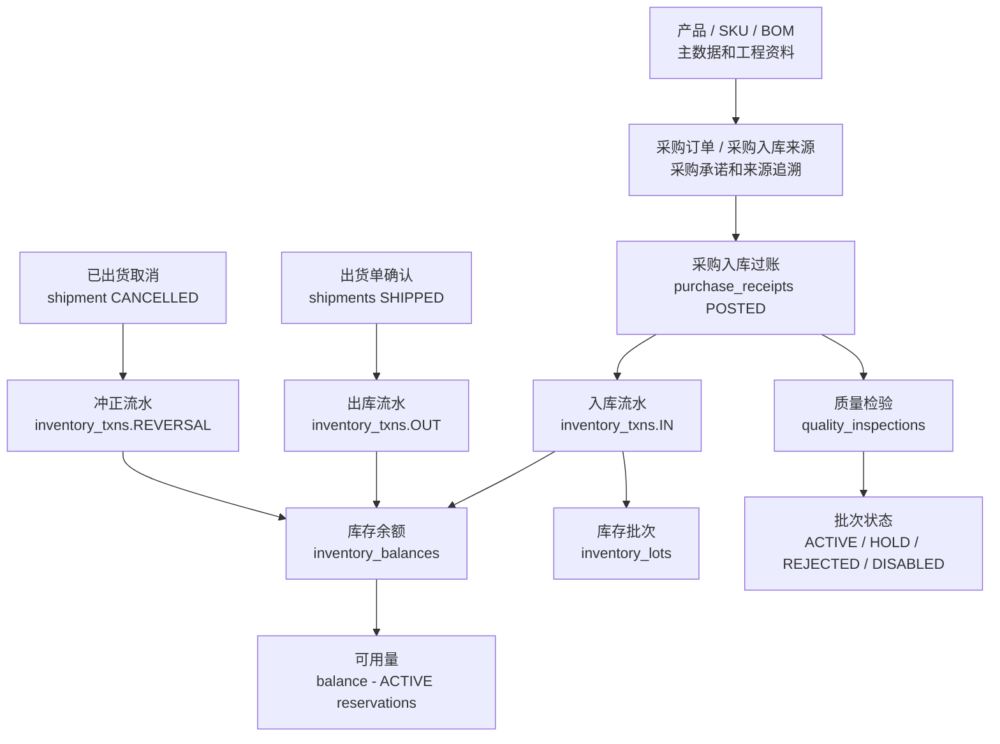

# 产品能力证据详情 / Product Capability Evidence Details

本文保存产品能力的证据、边界和风险详情。日常查阅先看 `docs/product/产品能力进度台账.md` 的快速表；只有需要核对证据、当前不包含和风险时再进入本文。

本文不使用内部编号做可见索引，能力标题就是查阅入口。

### 产品化架构骨架

- 所属层 / 业务域：Product Core / Architecture
- 当前成熟度：L7
- 当前结果：已建立产品原则、分层边界、永绅 yoyoosun 客户边界和实施任务治理
- 当前不包含：不代表业务闭环完成
- 证据：`docs/product/*`、`docs/architecture/*`
- 下一步：持续维护 `docs/当前真源与交接顺序.md`
- 风险：文档多，需防信息差
- 客户试用 / 交付承诺：是 / 否

### Workflow / Fact 边界

- 所属层 / 业务域：Product Core / Architecture / Workflow
- 当前成熟度：L7
- 当前结果：已明确 `workflow done != fact posted`、`shipping_released != shipped`；协同页面只更新任务和业务进度投影。普通 `workflow_tasks` 已接严格 `version / expected_version` CAS 和稳定 `workflow.task-mutation-result/v1` receipt，正式完成、阻塞、退回和催办要求顶层 `idempotency_key`，服务端以 actor、命令和业务 intent 计算 SHA-256 hash；V1 writer / reader 严格校验 canonical key、command、任务状态及正式状态字典，损坏 receipt fail closed。精确重放返回首次任务快照，同 key 改 intent 返回 `40920`，新 key 不绕过终态。公开 `create_task` 只接受正式创建字段并拒绝 receipt / CAS、`customer_key` 和未知字段，不实现 create replay。状态、事件、催办计数、业务投影、派生任务和成功 break-glass 审计同事务提交。前端对 HTTP 408、网络 / 5xx 与结构不合法的 success response 保留同一冻结 attempt 和 key，并以 task 级同步 in-flight lease 阻止同一 task 跨动作双发；Go / JS 共同消费共享 intent vectors。`20260711063237 / 20260711075355` 已作为不可变 revision 执行，`20260711104729` 增加 portable receipt bundle CHECK；本项目迁移前且无法证明版本的事件保留 `task_version=NULL`，不伪造回填。ProcessRuntime domain command 已接只读 preflight、SHA-256 intent fingerprint、durable result / effect ref / compensation、同 intent 并发终态对账和 `linked_business_refs` CAS；重复启动只做 linked task、completed end 和 durable result 的有界恢复，active domain command / wait event 不自动重放；节点与 ProcessInstance 阻塞在同一 PostgreSQL 事务内提交。protocol v1 的写 handler 在领域事务内同时落业务副作用与结果证据，两个无写 gate 在锁定短事务内记录 none，结果重放不再次执行 handler。销售取消、入库冲正、出货冲正和财务取消会标记 compensation
- 当前不包含：公开 `create_task` 不在普通任务网络 replay 合同内；Workflow 任务完成不自动写 shipment、库存或财务事实；本项目迁移前的 protocol 0 与迁移前无法精确证明的 result-missing 仍人工核对；完整应收、开票、收付款和核销闭环仍不能仅凭协同状态判定
- 证据：`docs/architecture/状态工作流事实边界.md`、`server/internal/biz/workflow.go`、`server/internal/biz/workflow_idempotency.go`、`server/internal/biz/workflow_idempotency_test.go`、`server/internal/data/workflow_repo.go`、`server/internal/data/workflow_repo_postgres_concurrency_test.go`、`server/internal/data/workflow_repo_idempotency_test.go`、`server/internal/data/model/migrate/20260711063237_migrate.sql`、`server/internal/data/model/migrate/20260711075355_migrate.sql`、`server/internal/data/model/migrate/20260711104729_migrate.sql`、`scripts/qa/workflow-task-mutation-intent-v1.vectors.json`、`web/src/erp/utils/workflowTaskMutation.mjs`、`web/src/erp/utils/workflowTaskMutation.test.mjs`、`web/src/erp/api/workflowApi.test.mjs`、`server/internal/biz/process_runtime.go`、`server/internal/data/process_runtime_repo.go`、`server/internal/data/process_domain_command_atomic_postgres_test.go`、`server/internal/data/process_runtime_postgres_concurrency_test.go`、`server/internal/data/model/migrate/20260710150000_migrate.sql`、`server/internal/data/model/migrate/20260710150001_migrate.sql`、各领域 ProcessCommand tests
- 下一步：将当前未发布 migration 部署目标环境后补 authenticated replay / migration / release evidence；不扩大 Workflow payload 语义
- 风险：UI 的协同文案、`workflow_business_states` 或本项目迁移前 protocol 0 可能被误当成事实 / 自动恢复证据；任一本地 fresh / upgrade 证据都不能替代目标环境发布证据
- 客户试用 / 交付承诺：是 / 否

### 永绅 yoyoosun 客户资料治理

- 所属层 / 业务域：Customer Config / Productization
- 当前成熟度：L6
- 当前结果：已建立永绅客户资料、导入来源、字段分类、source freeze 和 dry-run evidence；仓库不提供真实导入执行器
- 当前不包含：当前不可执行真实导入
- 证据：`docs/customers/yoyoosun/*import*.md`、`docs/customers/yoyoosun/*freeze*.md`
- 下一步：simulated data trial rehearsal
- 风险：永绅 yoyoosun 字段污染 Product Core
- 客户试用 / 交付承诺：有限 / 否

### customers 主数据

- 所属层 / 业务域：Product Core / MasterData
- 当前成熟度：L7
- 当前结果：schema / migration / repo/usecase / API/RBAC / UI 已完成；UI 使用“付款方式”和“付款周期(天)”维护客户默认付款条件，作为销售订单新建时的默认建议
- 当前不包含：地址、信用额度、客户级价格规则未做；客户默认付款条件不等于财务事实
- 证据：`customer.go`、`masterdata.go`、`jsonrpc_masterdata.go`、V1 UI
- 下一步：模拟数据试用 / 菜单入口评审
- 风险：当前不可导入真实客户数据
- 客户试用 / 交付承诺：是 / 否

### suppliers 主数据

- 所属层 / 业务域：Product Core / MasterData
- 当前成熟度：L7
- 当前结果：schema / migration / repo/usecase / API/RBAC / UI 已完成
- 当前不包含：供应商物料档案、结算资料未做
- 证据：`supplier.go`、`masterdata.go`、V1 UI
- 下一步：菜单入口评审 / 数据导入
- 风险：supplier_type 后续可能细化
- 客户试用 / 交付承诺：是 / 否

### contacts 联系人

- 所属层 / 业务域：Product Core / MasterData
- 当前成熟度：L7
- 当前结果：支持 customer / supplier owner，usecase guard 已完成，UI 区块已完成
- 当前不包含：DB 无跨表强 FK，依赖 usecase guard
- 证据：`contact.go`、`masterdata.go`、V1 UI
- 下一步：导入 dry-run / API smoke
- 风险：直接 SQL 可能绕过 guard
- 客户试用 / 交付承诺：是 / 否

### sales_orders 销售订单源单据

- 所属层 / 业务域：Product Core / Order
- 当前成熟度：L7
- 当前结果：schema / migration / repo/usecase / API/RBAC / UI 已完成；已支持本单“付款方式”“付款周期(天)”和报价备注（`price_condition_note`），客户默认付款条件可在新建订单时带出但可编辑。草稿聚合更新要求正整数 `expected_version` 并先做单头 CAS；页面在保存请求结果未知时保留表单且不执行附件 / 刷新，完整保存结果会先绑定真实 `id / version`，后置失败不再误报源单保存未知
- 当前不包含：不含出货事实、库存扣减、应收、发票、收款或付款事实；不按付款周期自动重算订单行单价，不自动回写客户默认值
- 证据：`sales_order.go`、`sales_order.go usecase`、`masterDataOrderApi.mjs`、`V1SalesOrdersPage.jsx`、`sourceDocumentMutation.mjs`、`sourceDocumentMutation.test.mjs`、`sourceDocumentMutationIntegration.test.mjs`
- 下一步：菜单入口 / 真实试用
- 风险：甲方可能误认为已出货闭环
- 客户试用 / 交付承诺：有限，需标边界 / 否

### sales_order_items 销售订单明细

- 所属层 / 业务域：Product Core / Order
- 当前成熟度：L7
- 当前结果：支持新增、编辑、取消/移除、列表；销售订单行 UI/API 已支持选择 SKU 带出 `product_id / unit_id`、产品编号 / 名称 / 颜色快照并保存 `product_sku_id`；显式 SKU 已在销售订单行、出货行、库存预留、库存批次 / 流水 / 余额和生产 / 委外事实之间按 exact inventory grain 贯通，出货确认与预留创建会校验 SKU 和来源订单行一致；`product_sku_id=NULL` 保留为独立未分规格库存，不自动回填或跨池兜底
- 当前不包含：不含 `shipped_quantity`；销售订单行完成、SKU 选择或颜色快照不自动创建 SKU，也不等同于库存已过账、应收、发票或收付款事实
- 证据：`sales_order_item.go`、`sales_order_repo.go`、`jsonrpc_sales_order.go`、`V1SalesOrdersPage.jsx`、V1 UI
- 下一步：BOM SKU grain / import controlled SKU / old unallocated stock reclassification review
- 风险：库存只认显式 `product_sku_id`；旧 `NULL` 库存不会自动归入或兜底任一 SKU，也不能当财务事实
- 客户试用 / 交付承诺：有限 / 否

### 永绅 yoyoosun 客户导入 tooling / evidence / execution gate

- 所属层 / 业务域：Delivery / Data Import
- 当前成熟度：L5（仅准备工具）
- 当前结果：已具备 source inventory、field classification、unresolved queue、acceptance checklist、Excel source extract、只读 dry-run CLI、source freeze/evidence preparation 和 tracked 导入配置草案；试用数据全部显式 simulated
- 当前不包含：仓库没有真实客户导入执行器，不连接客户数据库，不写 `business_records`，模拟数据和 `importConfig.mjs` 都不转成真实导入结论
- 证据：`docs/customers/yoyoosun/导入策略.md`、`docs/customers/yoyoosun/导入验收清单.md`、`docs/customers/yoyoosun/来源快照冻结.md`、`docs/customers/yoyoosun/真实试跑证据.md`、`docs/archive/customer-evidence/yoyoosun/simulated-trial-acceptance.md`、`config/customers/yoyoosun/importConfig.mjs`、`scripts/import/customerSourceExtract.mjs`、`scripts/import/customerImportDryRun.mjs`、`scripts/import/customerSourceSnapshotFreezeCheck.mjs`、`scripts/seed-trial-sim-masterdata.sh`、`scripts/qa/trial-simulated-data.mjs`
- 下一步：existing V1 snapshot review；真实数据到位并获授权后另行评审通用导入批次 usecase
- 风险：字段语义、敏感字段和 owner 匹配仍需人工确认，模拟数据和配置草案不能被误读成真实导入
- 客户试用 / 交付承诺：否 / 否

### V1 前端页面

- 所属层 / 业务域：Product Core / UI
- 当前成熟度：L7
- 当前结果：customers / suppliers / contacts / materials / sales_orders 页面、路由、桌面正式菜单、dashboard 入口和前后端菜单权限选项已完成；旧重叠路径不再保留产品内路由、重定向或权限别名；正式客户构建从后端 active revision effective session 读取页面、动作、字段和打印投影，普通账号菜单按后端 RBAC 与客户页面投影取交集，字段策略只作用于已登记 surface；本地试用模拟浏览器入口 smoke 已通过；`生产排程`、`生产异常` 和 `出货放行` 已接 Workflow V1 协同任务读取 / 处理
- 当前不包含：产品内 docs registry 已下线；前端隐藏仍不替代后端 RBAC / usecase；本地 smoke 不等于目标客户环境验收；三页仍不提供无来源创建协同任务入口、生产 source document、生产异常事实、shipment source document / fact 写入
- 证据：`V1MasterDataPage.jsx`、`V1SalesOrdersPage.jsx`、`businessModules.mjs`、`router.jsx`、`rbac.go`、`customer_config.go`、`adminProfileSync.mjs`、`adminProfileSync.test.mjs`、`试用培训说明.md`、`试用账号角色菜单核对清单.md`、`试用环境执行手册.md`、`docs/archive/customer-evidence/yoyoosun/simulated-trial-acceptance.md`
- 下一步：target trial browser rerun / trial feedback
- 风险：旧书签、正式入口和账号权限仍需目标环境确认
- 客户试用 / 交付承诺：有限，需标边界 / 否

### V1 API/RBAC

- 所属层 / 业务域：Product Core / API / RBAC
- 当前成熟度：L7
- 当前结果：JSON-RPC API + 动作权限已完成；active customer revision 已接 `role_profiles / access_entitlements / work_pools / work_pool_memberships`，按角色计算页面、动作、字段与责任池投影，并始终受后端 RBAC、模块状态和角色 revoke 上限约束；试用账号角色菜单核对清单已明确普通试用账号不使用 super admin、不分配 debug_operator，岗位任务端只认 `mobile.<role>.access`；本地 9 个 `demo_*` 账号已通过 RBAC 核对
- 当前不包含：目标客户环境真实账号、active revision 和回滚 readback 未完成；客户配置不能新增后端权限、绕过 usecase 或变成字段级万能权限系统
- 证据：`server/internal/service/jsonrpc_masterdata.go`、`server/internal/service/jsonrpc_customer_config.go`、`server/internal/biz/customer_config.go`、`server/internal/biz/customer_config_permissions.go`、`server/internal/data/customer_config_repo.go`、`rbac.go`、`adminProfileSync.test.mjs`、`试用账号角色菜单核对清单.md`、`试用环境执行手册.md`
- 下一步：target trial account setup / RBAC rerun
- 风险：权限模板还需目标环境核对；JSON-RPC handler 已迁入 `server/internal/service`
- 客户试用 / 交付承诺：有限，需标边界 / 否

### 产品 / materials / units / warehouses 既有主数据

- 所属层 / 业务域：Product Core / MasterData
- 当前成熟度：L5-L7
- 当前结果：已有既有 schema / runtime 能力；产品档案可选维护 `numeric(20,6)` 的产品单重（净重），按产品默认单位以 kg 保存，空值为未知、非空必须大于 0；SKU 同样可选维护 `unit_net_weight_kg`，但填写时必须同时有显式 SKU `default_unit_id`，SKU 未填单重时才允许下游回退产品单重。产品 / SKU JSON-RPC 均使用十进制字符串 / NULL，表单、列表和 CSV 同步；材料档案已补最小 repo/usecase/API/RBAC/UI 和正式菜单，可维护 code、name、category、spec、color、default_unit、is_active；核心产品模拟基础资料 seed 已新增，可写入带 `SIM-PLUSH-CORE` 前缀的单位、材料、产品、仓库、工序和 BOM。其业务事实参数当前只供旧 report-only 计划审查，不能用于已退役的通用 apply
- 当前不包含：不回填产品 / SKU 历史单重，不做单位换算、毛重、装箱 / 物流 / 打印带值；产品 / 单位 / 仓库仍未重新评审全部 UI/API；材料默认单位暂用 ID；core demo seed 不写客户、供应商、联系人、销售订单、`business_records`、库存流水、生产、出货或财务事实
- 证据：`product.go`、`product_sku.go`、对应单重 Atlas migrations、`masterdata.go`、`masterdata_repo.go`、`jsonrpc_masterdata_product.go`、`MasterDataForm.jsx`、`masterDataColumns.jsx`、`masterDataOrderView.mjs`、对应 Go / Node / PostgreSQL 合同测试、`server/internal/data/core_demo_seed.go`、`server/cmd/seed-core-demo-data`、`scripts/seed-core-demo-data.sh`
- 下一步：导入受控带值 / 客户试用确认 / 单位换算专项评审
- 风险：产品或 SKU 默认单位变更时必须重新确认对应单重；不能把当前主档值即时推导成历史出货 / 打印事实；删除前旧样本或归档 evidence 不能被误读为仍可查询的 `business_records` 兼容层，模拟基础资料也不能被误读成真实客户数据
- 客户试用 / 交付承诺：有限 / 否

### processes 加工环节 / 工序主数据

- 所属层 / 业务域：Product Core / MasterData / Engineering Data
- 当前成熟度：L7
- 当前结果：已新增 `processes` schema / migration / generated code，并接入 MasterData repo/usecase、`masterdata` JSON-RPC、`process.*` RBAC、后端内置菜单、桌面正式菜单、yoyoosun 客户菜单、毛绒行业模板和 `/erp/engineering/processes` V1 页面；页面可维护工序编号、名称、自由文本类别、可委外 / 可内制 / 需质检标记、排序、备注和启停状态；工序名称和类别输入支持行业默认候选并允许自由新增；核心演示 seed 可写入 `查货 / 手工 / 车缝 / 包装` 这组毛绒玩具行业默认候选，并保留制作刀模、裁片IQC、机裁、丝印、贴合等可扩展委外候选工序；`查货` 在这里仅表示工序候选，不登记合格 / 不合格 / 让步 / 返工结果
- 当前不包含：不含生产工艺路线、工序报价、工序质检联动、委外结算、发料 / 回货自动带值、质检判定或库存 / 财务事实写入
- 证据：`process.go`、`20260617085305_migrate.sql`、`masterdata.go`、`masterdata_repo.go`、`jsonrpc_masterdata.go`、`rbac.go`、`V1MasterDataPage.jsx`、`businessModules.mjs`、`core_demo_seed.go`
- 下一步：委外发料 / 回货带值、生产路线 / 工序质检联动 review
- 风险：可委外 / 可内制 / 需质检标记容易被误读为完整委外、生产或质检流程；默认候选只降低录入成本，工序类别仍必须保持自由文本或配置化，不写死为少数枚举；`查货` 不能被当作质检事实或查货结果
- 客户试用 / 交付承诺：有限 / 否

### product_skus

- 所属层 / 业务域：Product Core / Product / SKU
- 当前成熟度：L7
- 当前结果：已落 Ent schema / Atlas migration / generated code；`product_skus` 表包含 `sku_code`、`barcode`、`customer_sku`、颜色、色号、尺寸、包装版本和可选默认单位；已接入 masterdata JSON-RPC、`product_sku.*` RBAC 和 `/erp/master/products` SKU 最小维护页面，可创建、编辑、列表、详情和启停 SKU；销售订单行 UI/API 已接 SKU 选择带值和 `product_sku_id` 保存；显式 SKU 已贯通 `inventory_lots / inventory_txns / inventory_balances`、生产 / 委外事实、出货和预留，库存查询、锁、幂等、可用量、扣减与冲正都保持同一 SKU grain
- 当前不包含：BOM SKU 粒度、导入受控创建 SKU、订单颜色自动建 SKU 和旧未分规格库存人工重分类；导入工具仍不得自动创建 SKU
- 证据：`product_sku.go`、`inventory_lot.go`、`inventory_txn.go`、`inventory_balance.go`、`20260710150001_migrate.sql`、`inventory_sku_grain_test.go`、`inventory_sku_postgres_test.go`、`jsonrpc_sku_grain_test.go`、`sales_order_repo.go`、`operational_fact_repo.go`、`V1SalesOrdersPage.jsx`、`V1InventoryLedgerPage.jsx`、`docs/architecture/产品款号物料清单边界评审.md`
- 下一步：BOM SKU grain / import controlled SKU / old unallocated stock reclassification review
- 风险：不能因订单颜色或客户 Excel 字段自动建 SKU；`product_sku_id=NULL` 是未分规格独立库存，不自动回填、不跨 SKU 共池
- 客户试用 / 交付承诺：有限 / 否

### BOM 版本能力

- 所属层 / 业务域：Product Core / BOM
- 当前成熟度：L7
- 当前结果：已接入 `bom` JSON-RPC、`bom.*` RBAC 和 `/erp/purchase/material-bom` V1 页面；支持 BOM 版本列表 / 明细、草稿创建、草稿头信息维护、明细新增 / 编辑 / 删除、复制新版本、激活和设为历史版本；激活新版本会把同产品旧 `ACTIVE` 设为历史版本（底层状态 `ARCHIVED`），已激活 BOM 不允许直接改头或明细
- 当前不包含：不含 `product_sku_id` BOM 粒度、采购需求生成、MRP、替代料、成本核算、订单 / 采购需求版本快照或目标客户真实数据验收
- 证据：`inventory.go`、`inventory_repo.go`、`jsonrpc_bom.go`、`jsonrpc_bom_test.go`、`BOMVersionsPage.jsx`、`bomApi.mjs`、`docs/architecture/产品款号物料清单边界评审.md`
- 下一步：BOM SKU grain / purchase demand snapshot review
- 风险：不能把 BOM 改版当库存、采购、生产或成本事实；激活只改变工程资料当前版本
- 客户试用 / 交付承诺：有限 / 否

### purchase_orders 采购承诺

- 所属层 / 业务域：Product Core / Purchase
- 当前成熟度：L7
- 当前结果：已有 schema / migration / repo / usecase / JSON-RPC / RBAC / 测试和 V1 页面最小闭环；`purchase_order` 域支持订单头与明细保存、读取、列表、提交、审批、关闭和取消；草稿聚合更新要求正整数 `expected_version` 并先做单头 CAS，页面把保存请求与附件、明细读取、列表刷新分阶段处理；列表可按关键词、状态、采购日期 / 预计到货日期范围和排序查询；采购订单行可被采购入库行可选追溯引用
- 当前不包含：未做采购需求、BOM 生成、采购订单余额 / 在途统计、供应商报价、采购合同审批、应付 / 发票自动生成、目标环境 migration 或客户真实数据验收
- 证据：`purchase_order.go`、`purchase_order_item.go`、`purchase_order.go usecase`、`purchase_order_repo.go`、`jsonrpc_purchase_order.go`、`masterDataOrderApi.mjs`、`V1PurchaseOrdersPage.jsx`、`sourceDocumentMutation.mjs`、`sourceDocumentMutation.test.mjs`、`sourceDocumentMutationIntegration.test.mjs`、`20260615133823_migrate.sql`、`purchase_order_test.go`、`purchase_order_repo_test.go`
- 下一步：purchase order balance / purchase demand review
- 风险：不能替代 purchase_receipts，不写库存或财务事实
- 客户试用 / 交付承诺：有限 / 否

### purchase_receipts 采购入库事实

- 所属层 / 业务域：Product Core / Purchase / Inventory
- 当前成熟度：L7
- 当前结果：已有 schema / migration / repo / usecase / JSON-RPC / RBAC / 测试和 V1 页面闭环；`purchase` 域支持创建草稿、加行、过账、取消、读取和列表，过账写 `inventory_txns.IN`，取消写 `REVERSAL`。采购来源行在过账前锁定对应采购行，并按 `POSTED 入库 + 已过账数量增加 - 已过账数量减少` 计算有效已收量；取消的入库 / 调整退出统计，分次收货、超收拒绝和并发竞争由 PostgreSQL 事务守住。公开收货草稿创建 / 加行使用稳定幂等 key 与服务端规范化 SHA-256 intent hash，Process Runtime 的 `purchase_receipt.create` 也持久化首次结果。当前本地工作树还把采购退货和入库调整的正式聚合命令接入同一 `purchase` 域与采购入库页：调用方只选已过账入库行、数量和允许的更正方向，材料、单位、原仓库 / 批次和价格由后端派生；创建、过账、取消 / 冲正、列表、详情、幂等 replay 和并发防超量保持在正式领域事务中。`purchase_receipts.supplier_id` 只从唯一可确定的采购来源回填，是已过账入库生成应付的稳定供应商引用。
- 当前不包含：未做采购剩余量 / 在途的独立页面 read model，采购退货不会自动重开可收数量；应付需由已过账入库页显式发起，不是入库或 Workflow 完成时自动过账；历史供应商不可唯一确定的入库不具备自动生成应付资格；当前新 migration 未发布到目标客户环境。
- 证据：`purchase_receipt.go`、`purchase_receipt_process_command.go`、`purchase_receipt_repo.go`、`purchase_return.go`、`purchase_return_repo.go`、`purchase_receipt_adjustment.go`、`purchase_receipt_adjustment_repo.go`、`jsonrpc_purchase.go`、`jsonrpc_purchase_return.go`、`jsonrpc_purchase_receipt_adjustment.go`、`purchase_correction_api_test.go`、`purchase_return_quality_source_postgres_test.go`、`inventory_postgres_purchase_return_receipt_concurrency_test.go`、`purchaseApi.mjs`、`V1PurchaseReceiptsPage.jsx`、`PurchaseReceiptExceptionModal.jsx`
- 下一步：purchase remaining quantity read model / customer receipt and correction acceptance
- 风险：采购退货后是否允许补收属于产品策略，未明确前不能把退货量直接回补可收量；协同 `warehouse_inbound done` 仍不等于库存入账
- 客户试用 / 交付承诺：有限 / 否

### quality_inspections 质检事实

- 所属层 / 业务域：Product Core / Quality
- 当前成熟度：L7
- 当前结果：已有 schema / migration / repo / usecase / JSON-RPC / RBAC / 测试和 V1 页面闭环；`quality` 域支持创建草稿、提交质检、判定合格 / 让步接收、判定不合格、取消、读取和列表。`/erp/production/quality-inspections` 已收口为通用“质量检验”读模型，按采购来料、委外回货和成品检验展示业务来源、对象与批次。采购来料从已过账入库行派生材料 / 仓库 / 批次，委外检验从已过账 `RETURN_RECEIPT` 派生产品 / 仓库 / 批次 / 数量；同一有效委外回货不能重复生成质检。提交会把批次置为 `HOLD`，合格 / 让步恢复 `ACTIVE`，不合格置为 `REJECTED`；不合格采购检验可以用专用动作生成来源锁定的退供应商记录。
- 当前不包含：未做 `quality_inspection_items`、缺陷字典、抽检方案、质检任务与 Workflow 自动闭环、委外不合格的退回加工厂 / 返工处置、客户真实数据导入；采购退货需要用户显式发起和过账，不由不合格判定自动写库存。
- 证据：`quality_inspection.go`、`quality_inspection_source_repo.go`、`quality_inspection_outsourcing_source_postgres_test.go`、`purchase_return_quality_source_repo.go`、`purchase_return_quality_source_postgres_test.go`、`jsonrpc_quality.go`、`jsonrpc_quality_test.go`、`qualityApi.mjs`、`V1QualityInspectionsPage.jsx`、`OutsourcingReturnQualityInspectionModal.jsx`、`QualityInspectionPurchaseReturnModal.jsx`
- 下一步：quality workflow / defect detail / customer inspection-spec acceptance
- 风险：不能把 workflow task done 当成 quality passed，也不能把不合格判定直接等同为采购退货事实
- 客户试用 / 交付承诺：有限 / 否

### inventory_txns / balances / lots

- 所属层 / 业务域：Product Core / Inventory
- 当前成熟度：L7
- 当前结果：已有 schema / migration / repo / usecase / JSON-RPC / RBAC / 测试和只读 V1 页面闭环；`inventory` 域支持 `list_inventory_balances / list_inventory_lots / list_inventory_txns`，`/erp/warehouse/inventory` 继续只展示余额、批次和流水。余额视图按同一成品、仓库、单位和批次 grain 聚合 ACTIVE `stock_reservations`，返回 `active_reserved_quantity` 与 `available_quantity`。库存写入仍由采购入库 / 退货 / 入库调整、出货、生产领料 / 完工 / 返工和委外发料 / 回货领域 usecase 驱动。完工入库和委外回货的新批次在来源事务内创建，与既有批次选择互斥；出库型事实只允许既有批次。
- 当前不包含：库存台账不提供任意写入，也未建设通用盘点、调拨、人工调整、冻结量聚合 read model、预留明细专项页或单条预留部分消费；客户真实数据导入 / backfill 仍未开放。
- 证据：`inventory.go`、`inventory_repo.go`、`operational_fact_repo.go`、`inventory_postgres_purchase_return_test.go`、`inventory_postgres_purchase_adjustment_test.go`、`operational_fact_source_inbound_lot_test.go`、`jsonrpc_inventory.go`、`inventoryApi.mjs`、`V1InventoryLedgerPage.jsx`
- 下一步：general stocktake / transfer review only after a formal business sample
- 风险：不可从 sales_order、Workflow task 或前端页面直接扣库存；库存页只能读事实，不替代出库、调整或质检判定
- 客户试用 / 交付承诺：有限 / 否

#### 库存闭环验收口径 / Inventory Closure Acceptance

本节回答“库存闭环是否打通”应该看什么。库存闭环不能只看页面是否存在，也不能把采购需求、Workflow 任务完成或出货放行写成库存事实；必须看到真实库存流水、余额、批次 / 质检状态和来源单据引用。

最小验收字段：

- 流水：`inventory_txns.type` 至少能区分 `IN / OUT / REVERSAL`，并能回看数量、单位、仓库、产品、SKU 和批次；显式 SKU 在批次、流水、余额、生产 / 委外、出货和预留间保持同一 grain，`NULL` 规格库存仍是独立未分规格池。
- 余额：`inventory_balances.quantity`、`active_reserved_quantity`、`available_quantity` 同 grain 可解释，不能由前端临时计算冒充事实。
- 批次筛选：批次按仓库筛选表示“该仓库当前数量大于 0 的批次”；若要查该批次是否曾在某仓库发生过流水，应进入流水视图按仓库 / 批次 / 来源追溯。
- 批次与质检：`inventory_lots.status` 和 `quality_inspections` 判定可追溯；质检只改批次状态，不额外写库存增加流水。
- 来源：`source_type / source_id / source_line_id` 能追到采购入库、出货单或对应事实行；采购订单只是采购承诺和来源追溯，不是库存落账。
- 操作与审计：创建 / 更新时间、操作人或事件记录能支持追责；已过账单据通过取消 / 冲正表达更正，不直接改历史流水。

当前仍不算完整库存闭环的部分：

- 采购需求、BOM 自动生成采购需求、采购订单余额和在途统计仍待评审。
- 出货放行只是 Workflow / Shipment Release，`shipping_released != shipped`；只有出货单 `SHIPPED` 才能写库存 `OUT`。
- 库存台账当前只读，不提供盘点调整、批次状态变更、出库确认或预留明细维护。
- 客户真实数据导入、装箱 / 物流 / 签收 / 退货和完整报表仍不在当前闭环承诺内。

### stock_reservations

- 所属层 / 业务域：Product Core / Inventory / Shipment
- 当前成熟度：L7
- 当前结果：`stock_reservations` schema / usecase / JSON-RPC / UI 和测试已落；销售订单页通过 `create_stock_reservation_from_sales_order` 选择源订单行、仓库、批次和数量，产品、SKU、单位和来源锚点由后端锁定派生。PostgreSQL 中按库存 grain 锁定后计算 `inventory_balances - active reservations`，不得超过订单行剩余履约量；出货在同一事务内消费同来源行和同库存 grain 的完整 ACTIVE 预留，库存台账继续从 ACTIVE 预留聚合可用量。
- 当前不包含：不在订单生效时自动预留，不支持单条预留部分消费；预留明细专项页、冻结量 read model、BOM SKU 粒度、旧库存重分类、客户使用确认和目标环境发布仍未完成。
- 证据：`stock_reservation.go`、`operational_fact.go`、`operational_fact_repo.go`、`operational_fact_reservation_source_test.go`、`operational_fact_reservation_source_postgres_test.go`、`jsonrpc_operational_fact_reservation.go`、`V1SalesOrdersPage.jsx`、`SalesOrderReservationModal.jsx`、`V1OperationalFactPage.jsx`
- 下一步：reservation detail read model / customer usage feedback
- 风险：预留和出库易混
- 客户试用 / 交付承诺：有限，需标边界 / 否

### shipments / shipment_items

- 所属层 / 业务域：Product Core / Shipment
- 当前成熟度：L7
- 当前结果：客户侧 `出货单` V1 页面 `/erp/warehouse/shipments` 复用 `shipments / shipment_items`、`operational_fact` JSON-RPC、`shipment.*` RBAC 和库存 OUT / REVERSAL 主路径；确认 `SHIPPED` 时，后端在事务内锁定销售订单来源行，校验订单 active、客户、产品 / SKU、单位和累计出货量，并发确认不得超过订单行数量。同一确认事务会优先解析 SKU 单重与其显式默认单位，SKU 未填单重时再回退产品单重与产品默认单位，并冻结 `shipment_items.unit_net_weight_kg_snapshot`；全部有效行可解析时由后端按 decimal 累加并写入 `shipments.total_net_weight_kg`，任一行不可解析时不做部分合计，可保留可空的人工实际总净重且第一版不阻断出货。已出货记录不随主档修改、不历史回填，取消出货保留原快照和总净重。出货草稿只通过严格幂等的 `create_shipment_with_items` 在一个事务内创建头和全部明细；公开头单创建 / 逐行追加拆分写入口已退出，既有明细只读。关键并发 / 原子测试已进入 `full / strict` 的不可跳过 PostgreSQL 门禁；目标环境仍需绑定新 revision 重新发布和验证
- 当前不包含：草稿不占用销售订单剩余量，最终强阻断发生在确认出货时；净重第一版不做单位换算，不含毛重；客户使用确认、拣货、装箱、物流追踪、签收、退货和打印仍未完成；应收 / 开票需要用户从已出货单显式发起，不随出货自动过账
- 证据：`shipment.go`、`shipment_item.go`、`operational_fact.go`、`operational_fact_repo.go`、`jsonrpc_operational_fact_shipment.go`、`rbac.go`、`ShipmentsPage.jsx`、`ShipmentBusinessModal.jsx`、`shipmentColumns.jsx`、`businessModules.mjs`、`router.jsx`、`operational_fact_repo_test.go`、`jsonrpc_operational_fact_test.go`、净重对应 Go / Node / PostgreSQL 合同测试；旧 `operational-fact-simulated-closure --apply` 已退役，不作为当前来源闭环证据
- 下一步：shipment usage feedback / packing-logistics-return review
- 风险：`shipping_released != shipped`；单重缺失时的空总净重或人工实际总净重不得被展示成“系统已部分自动计算”
- 客户试用 / 交付承诺：有限，需标边界 / 否

### business_attachments 业务附件证据

- 所属层 / 业务域：Reporting / Audit / Integration / Evidence
- 当前成熟度：L6
- 当前结果：已落地 `business_attachments` schema / migration / repo / usecase、canonical `attachment` JSON-RPC 和共享前端面板，并接入销售订单、采购订单、委外订单、采购入库、来料质检、出货单、财务事实、生产 / 委外事实、SKU、BOM、Workflow 桌面页和岗位任务端详情；单个附件上限 5MB，HTTP 编码请求体和业务解码双门禁已接入。Workflow owner 读取 / 上传复用 active revision 行级责任范围，终态拒绝上传；普通已上传附件物理删除已退出
- 当前不包含：不含对象存储、流式大文件、缩略图、Office / HEIC 在线转换、OCR、病毒扫描、电子签章、受控证据撤销或客户外链共享；附件上传、下载或预览都不改变 Source Document、Fact、Workflow、库存、质检或财务状态
- 证据：`docs/architecture/业务附件证据边界评审.md`、`business_attachment.go`、`business_attachment_repo.go`、`jsonrpc_attachment.go`、`BusinessAttachmentPanel.jsx`
- 下一步：customer feedback / object-storage-preview review
- 风险：把附件证据误读为业务事实、质检判定、财务凭证已入账或任务已完成
- 客户试用 / 交付承诺：有限 / 否

### shipment outbound inventory fact

- 所属层 / 业务域：Product Core / Shipment / Inventory
- 当前成熟度：L7
- 当前结果：发货按出货行写 `inventory_txns.OUT`，取消已发货出货单写 `inventory_txns.REVERSAL`；产品出库共用 ACTIVE 预留可用量守卫，出货可原子消费匹配的完整预留；本地 PostgreSQL 并发测试已覆盖预留与出库争抢、并发预留和同销售订单行并发出货。`/erp/warehouse/outbound` 继续作为收窄 V1 页面复用出货单和库存预留 facts；新并发证据尚未重新发布到目标环境
- 当前不包含：客户使用确认、退货链路、单条预留部分消费、BOM SKU 粒度或旧库存重分类
- 证据：`operational_fact_repo.go`、`operational_fact_repo_test.go`、`inventory_txns`、库存 / 预留 / 出货 PostgreSQL 并发测试；旧 `operational-fact-simulated-closure --apply` 已退役，不作为当前来源闭环证据
- 下一步：inventory regression / usage feedback
- 风险：高风险，必须继续按实现门禁控制
- 客户试用 / 交付承诺：有限，需标边界 / 否

### AR/AP/invoice/payment/reconciliation

- 所属层 / 业务域：Product Core / Finance
- 当前成熟度：L7
- 当前结果：`finance_facts` schema / migration、usecase、JSON-RPC、RBAC 和按类型收窄的 V1 页面已落，支持 draft / posted / settled / cancelled，币种限制为 `USD / CNY / HKD`。正式创建入口已收口到业务来源：已出货出货单可生成一笔有效应收和一笔有效发票，客户、币种和金额从销售订单行的出货金额快照派生；已过账采购入库可生成一笔有效应付，供应商只使用稳定 `supplier_id`，金额计入已过账退货和数量调整；已过账委外回货只在正式质检已 `PASSED` 且结果为 `PASS / CONCESSION` 时才能生成应付，缺质检、进行中或不合格都 fail closed。已过账应收、应付或发票可生成一笔同往来方、同币种和同金额的单笔核对记录。部分唯一索引和事务级来源复核防止通过更换幂等键重复生成；存在有效财务或质检下游依赖时，出货、采购入库、委外回货和源财务事实的取消会拒绝。委外质检应付硬门禁的冻结工作树最终门禁证据仍待本轮汇总。
- 当前不包含：`PAYMENT` 保持只读历史类型，没有银行账户、收付款申请、银行流水、支付凭证或核销行时不开放真实收付款录入；单笔核对不是多单据对账 / 核销平台。未做发票明细、税控、总账、会计凭证、红冲或客户财务验收；当前实现和新 migration 未发布到目标环境。
- 证据：`finance_fact.go`、`operational_fact_finance_source.go`、`operational_fact_finance_business_source_repo.go`、`operational_fact_finance_source_test.go`、`operational_fact_finance_business_source_test.go`、`jsonrpc_operational_fact_finance.go`、`jsonrpc_operational_fact_finance_business_source_test.go`、`ShipmentFinanceSourceModal.jsx`、`FinanceBusinessSourceModal.jsx`、`OperationalFactsPage.jsx`、`financeBusinessSourceScenarios.mjs`
- 下一步：target-environment evidence / customer finance acceptance / payment model review only with formal inputs
- 风险：不能从放行、Workflow task done、未过账源单或不合格委外回货生成财务事实
- 客户试用 / 交付承诺：有限，需标边界 / 否

### production_orders 生产订单源单

- 所属层 / 业务域：Product Core / 生产源单 Production Source Document
- 当前成熟度：L7
- 当前结果：本地已完成 `production_orders / production_order_items / production_order_events` schema、Atlas migration、聚合 repo/usecase、canonical API/RBAC、Product Core 独立页面和通用菜单。DRAFT 可整单编辑，发布、关闭、取消使用 expected_version CAS 与 V1 receipt；RELEASED 订单只有在同一订单锁域内确认无有效 POSTED production fact 时才能取消。生产订单发布会按每条订单行锁定的 active BOM 版本冻结 `production_order_material_requirements`，保存单位用量、损耗率、计划需求、物料 / 单位快照和 BOM 头 / 行引用；后续 BOM 修改不改写已发布订单。已发布历史订单只在 BOM 头、版本、明细、物料和单位都可确定时回填；其余投影为 `NEEDS_REVIEW` 并拒绝领料，不猜测历史需求。页面已在订单行与物料需求行上提供来源完工、领料和关联记录入口；Close 仍按有效完工量判定正常关闭或要求短关闭原因。
- 当前不包含：yoyoosun 当前预览配置包只同步来源办理所需的最小菜单和岗位能力投影，客户私有资料、流程 manifest、seed、active revision、目标环境部署和客户验收未因本轮闭环得到证明；物料需求快照不是自动 MRP，不生成采购计划，也不包含工艺路线、WIP、工时、成本或完整 MES。
- 证据：`production_order.go`、`production_order_item.go`、`production_order_material_requirement.go`、`production_order_repo.go`、`operational_fact.go`、`operational_fact_repo.go`、`20260714122346_migrate.sql`、`20260714124000_backfill_production_material_requirements.sql`、`production_order_postgres_concurrency_test.go`、`production_order_material_issue_test.go`、`V1ProductionOrdersPage.jsx`、`ProductionMaterialIssueModal.jsx`、`ProductionCompletionModal.jsx`
- 下一步：target-environment evidence / customer projection and seed review / operator acceptance
- 风险：只能把本地测试证明的层级写成已完成；不得把 Workflow 当 Fact，或把本地能力写成已部署 / 客户可用
- 客户试用 / 交付承诺：否 / 否

### production facts

- 所属层 / 业务域：Product Core / Production
- 当前成熟度：L7
- 当前结果：`production_facts` schema / migration、usecase、JSON-RPC、RBAC、V1 列表与源单专用动作已落；通用事实页不再提供需要业务用户手填来源、对象、幂等键或数字 ID 的无来源登记。`MATERIAL_ISSUE` 从发布时冻结的物料需求行派生材料 / 单位，只能选既有批次，累计已过账量不超计划需求；`FINISHED_GOODS_RECEIPT` 从 RELEASED 订单行派生产品 / SKU / 单位，可选既有批次或在事务内新建批次，累计已过账量不超计划量；`REWORK` 只从已过账完工事实发起，复用原产品 / SKU / 仓库 / 单位 / 批次领出，累计已过账返工不超原完工量。三类事实过账写 IN / OUT，取消写 REVERSAL；存在有效返工时不允许取消原完工。
- 当前不包含：返工完成仍应使用新的完工入库事实，当前 `REWORK` 只表达已过账完工批次的返工领出；未建设质量不合格自动返工、替代料 / 超领审批、工时、成本归集、完整报工或客户验收。
- 证据：`production_fact.go`、`operational_fact.go`、`operational_fact_repo.go`、`production_order_material_issue_test.go`、`production_rework_source_test.go`、`production_rework_source_postgres_test.go`、`jsonrpc_operational_fact_production.go`、`jsonrpc_operational_fact_rework_source_test.go`、`V1ProductionOrdersPage.jsx`、`OperationalFactsPage.jsx`、`ProductionReworkModal.jsx`
- 下一步：usage feedback / customer operator acceptance / target release evidence
- 风险：不能只靠任务状态
- 客户试用 / 交付承诺：有限，需标边界 / 否

### outsourcing_orders 加工合同源单

- 所属层 / 业务域：Product Core / Outsourcing Source Document
- 当前成熟度：L7
- 当前结果：`outsourcing_orders / outsourcing_order_items` 已接入 schema / migration / repo / usecase / JSON-RPC / RBAC 和 `/erp/purchase/processing-contracts` 页面；加工明细以 `subject_type=PRODUCT|MATERIAL` 明确产品或材料二选一，页面和打印共用同一源单映射。只有 `draft` 可编辑，聚合更新要求正整数 `expected_version` 并先做单头 CAS；数量与单价由后端计算金额，提交后只能走确认 / 关闭 / 取消。已确认且行仍开放的加工合同现在可在专用动作中生成发料或回货：产品行只能回货，材料行只能发料，供应商、主体、单位和源单锚点由后端派生，累计已过账量不得超委外数量。已过账回货记录可从加工合同详情发起质检；只有正式质检已通过且结果为合格或让步接收时，才显示并允许执行生成应付动作，质检 / 财务 usecase 仍分别写独立事实。
- 当前不包含：加工合同确认不会自动写发料、回货、质检、应付、库存流水或 Workflow 完成；不登记查货结果、工序报价、完整工序质检 / 委外结算、合同审批流、电子签章或真实客户 Excel 导入。
- 证据：`outsourcing_order.go`、`outsourcing_order_item.go`、`outsourcing_order_repo.go`、`operational_fact_repo.go`、`jsonrpc_outsourcing_order_document.go`、`jsonrpc_operational_fact_outsourcing.go`、`V1OutsourcingOrdersPage.jsx`、`OutsourcingOrderSourceFactModal.jsx`、`OutsourcingReturnRecordsModal.jsx`、`outsourcingOrderFactAction.test.mjs`
- 下一步：customer processing-contract acceptance / target release evidence / usage feedback
- 风险：加工合同确认容易被误读为库存、质检或应付已过账；必须继续保持 Source Document / Fact 边界
- 客户试用 / 交付承诺：有限，需标边界 / 否

### outsourcing facts

- 所属层 / 业务域：Product Core / Outsourcing
- 当前成熟度：L7
- 当前结果：`outsourcing_facts` schema / migration、usecase、JSON-RPC、RBAC、来源动作和列表已落。委外发料只从已确认的材料主体加工合同行生成，只选既有批次并在过账时写 OUT；委外回货只从产品主体行生成，可选既有批次或事务内新建批次，过账写 IN；取消写 REVERSAL。已过账回货可生成唯一有效质检，只有 `PASSED + PASS / CONCESSION` 才能生成应付；存在有效质检或应付依赖时禁止取消回货。
- 当前不包含：委外订单行目前按自身材料 / 产品主体解释发料 / 回货，尚未建设委外材料需求快照或多材料发料；不合格委外回货的退回加工厂 / 返工处置、完整委外结算、付款核销、客户验收和目标发布仍未完成。
- 证据：`outsourcing_fact.go`、`operational_fact.go`、`operational_fact_repo.go`、`operational_fact_outsourcing_source_test.go`、`operational_fact_outsourcing_source_postgres_test.go`、`quality_inspection_outsourcing_source_postgres_test.go`、`operational_fact_finance_business_source_repo.go`、`jsonrpc_operational_fact_outsourcing.go`、`V1OutsourcingOrdersPage.jsx`
- 下一步：outsourcing material-requirement review / customer acceptance / target release evidence
- 风险：委外发料/回货/结算要分开
- 客户试用 / 交付承诺：有限，需标边界 / 否

### mobile task entry

- 所属层 / 业务域：Industry Template / UI / Mobile
- 当前成熟度：L7
- 当前结果：当前本地运行时已在任务详情接入 `workflow_task` 业务附件上传 / 下载，普通已上传附件删除已退出；工程岗位已补 `/m/engineering/tasks` 入口、`mobile.engineering.access` 前端权限映射和 `demo_engineering` 试用账号核对；customer package runtime manifest 已覆盖 9 个责任池 / role profile，并只给 engineering 角色授予 `mobile.engineering.access`。2026-06-09 归档 evidence 只证明当时版本的岗位任务端现场留痕、最近动作、保存 evidence、异常报告展示、guide 跳转、路由 smoke、试用账号 RBAC 和模拟 workflow 闭环；该版本 evidence 不含后来接入的附件服务，当前也未 live refresh 或重新发布本轮前端加固
- 当前不包含：不等于客户已签收；不等于扫码已交付；不从任务端自动写库存、出货、预留或财务事实；附件不代表任务完成
- 证据：`appRegistry.mjs`、`mobileRolePermissions.mjs`、`MobileTaskDetailScreen.jsx`、`BusinessAttachmentPanel.jsx`、`mobileTaskView.js`、`mobileTaskView.test.mjs`、`jsonrpc_workflow_test.go`、`mobile-workflow-simulated-closure.mjs`、`docs/archive/customer-evidence/yoyoosun/mobile-workflow-target-release-evidence-2026-06-09.md`
- 下一步：scan review only after feedback
- 风险：把 workflow evidence 或附件当事实
- 客户试用 / 交付承诺：有限，需标边界 / 否

### 永绅 yoyoosun 私有化部署包

- 所属层 / 业务域：Delivery / Deployment
- 当前成熟度：L4-L5
- 当前结果：`deployments/yoyoosun/README.md` 已有；2026-06-08 归档 evidence 证明对应旧版本曾执行目标环境发布、migration、健康检查、镜像加载、试用账号 RBAC、登录态只读 API smoke 和内部模拟事实写入闭环。本轮并发、幂等、fail-closed、预留消费、附件和页面加固未重新发布，当前目标运行态未 live refresh
- 当前不包含：缺首次目标发布前 pre-migration 备份 evidence；已补 post-deploy 逻辑备份；客户使用确认属于交付后业务确认
- 证据：`deployments/yoyoosun/README.md`、`docs/archive/customer-evidence/yoyoosun/operational-fact-target-release-acceptance.md`、`docs/archive/customer-evidence/yoyoosun/operational-fact-target-release-evidence-2026-06-08.md`
- 下一步：post-delivery usage confirmation
- 风险：后续发布必须先补 pre-migration 备份 evidence
- 客户试用 / 交付承诺：有限 / 否

### 客户使用确认体系

- 所属层 / 业务域：Delivery / Acceptance
- 当前成熟度：L3-L4
- 当前结果：已有导入验收、阶段验收口径；2026-06-08 业务事实扩展目标环境发布、页面路由、未登录鉴权、试用账号 RBAC、登录态只读 API smoke 和内部模拟事实写入闭环已有归档 evidence，但只证明当时版本，不证明当前运行态或本轮代码已发布
- 当前不包含：不把客户使用确认作为业务事实完成阻塞；不可把内部模拟闭环写成客户签收或真实导入
- 证据：`docs/archive/customer-evidence/yoyoosun/simulated-trial-acceptance.md`、`docs/archive/customer-evidence/yoyoosun/operational-fact-target-release-acceptance.md`、`docs/archive/customer-evidence/yoyoosun/operational-fact-target-release-evidence-2026-06-08.md`
- 下一步：post-delivery usage confirmation
- 风险：验收口径要业务化，且不能扩大到打印、报表、核销和真实导入
- 客户试用 / 交付承诺：否 / 否

### 行业默认模板清单

- 所属层 / 业务域：Industry Template / Productization / Menu
- 当前成熟度：L3
- 当前结果：行业模板已新增 `config/industry-templates/plush/templateConfig.mjs`，把默认角色、桌面菜单、岗位任务模式、字段显示、编号规则、导入模板、培训验收清单和 deferred 项沉淀为 `candidate` 配置；默认角色已覆盖 boss / sales / purchase / warehouse / quality / finance / pmc / engineering / production 9 个岗位，工程岗位只承接产品资料、工序和 BOM 资料补齐协同；已新增行业模板边界守卫和模拟闭环报告脚本，并从客户默认菜单 / 后端内置菜单移除 `业务事实扩展` / `事实闭环` 内部工程入口
- 当前不包含：仍不是 runtime loader；不代表 yoyoosun 单客户样本已成为行业默认；不含 Print Template Core、真实导入、扫码、报表或 SaaS 能力
- 证据：`config/industry-templates/plush/templateConfig.mjs`、`scripts/qa/industry-template-boundaries.mjs`、`scripts/qa/industry-template-closure.mjs`、`docs/archive/customer-evidence/yoyoosun/industry-template-target-release-evidence-2026-06-09.md`
- 下一步：multi-customer industry review / 私有化客户包模板 readiness
- 风险：单客户样本或打印格式被误读为行业标准；candidate 被误接 runtime loader
- 客户试用 / 交付承诺：有限 / 否

### Customer Config 配置形态

- 所属层 / 业务域：Customer Config / Productization
- 当前成熟度：L3-L7（运行时投影 L7；编号 / 导入 / 非 runtime 流程预览 L3）
- 当前结果：客户配置已具备 validate / publish / activate / rollback 版本控制，active revision 持久化模块状态、角色 profile、entitlement、责任池和成员；同一 `customer_key` 的 revision 切换会在事务内按稳定顺序锁定该客户全部既有 revision，数据库 partial unique index 同时保证最多一条 `status=active`，并发 activate / rollback 不会形成双 active。`get_effective_session` 按当前账号返回页面、动作、3 个已登记列表 / CSV 字段可见 surface、采购 / 委外打印甲方默认值和责任池投影，正式 Web / 岗位任务端消费该投影，固定真实 customer key 缺 active revision 时 fail closed。配置 revision 不可覆盖，模块启用校验依赖闭包，publish / activate 写脱敏审计；`/__dev/customer-config` 只对已登记包做预检、Dry Run 证据、测试应用和受 release-readiness 门禁的配置发布，不接 raw 上传或真实业务数据导入
- 当前不包含：不新增 `tenant_id`，不上传或执行任意客户代码 / SQL / JS，不提供动态插件、通用规则引擎、真实客户数据导入或 SaaS 多租户；field policy 不支持 label / required / editable / form layout，编号、导入、businessFlows / stateMachines / processPolicies 仍是 draft / preview；打印默认值不覆盖供应商或业务快照；配置 rollback 不回滚业务事实；目标环境 authenticated readback、客户签收和真实第二客户证据未完成
- 证据：`server/internal/biz/customer_config.go`、`server/internal/biz/customer_config_permissions.go`、`server/internal/data/customer_config_repo.go`、`server/internal/data/customer_config_repo_postgres_concurrency_test.go`、`server/internal/data/model/schema/customer_config_revision.go`、`server/internal/data/model/migrate/20260712055412_migrate.sql`、`server/internal/service/jsonrpc_customer_config.go`、`customer_config_*_test.go`、`adminProfileSync.mjs`、`adminProfileSync.test.mjs`、`config/catalog/customerPackageCatalog.mjs`、`config/schemas/customerPackageSchema.mjs`、`scripts/qa/customer-config-boundaries.mjs`、`scripts/qa/customer-package-lint.mjs`
- 下一步：target authenticated effective-session readback / release evidence / customer confirmation
- 风险：开发态 preview 项被误读为 runtime；客户配置被误读成租户隔离、动态插件或可以提升后端权限
- 客户试用 / 交付承诺：有限 / 否

### Customer Extension 边界

- 所属层 / 业务域：Customer Extension / Productization
- 当前成熟度：L1
- 当前结果：已有原则：极端客户专属逻辑才进入 extension，并记录原因、范围、退出条件和维护责任
- 当前不包含：目前没有清晰 runtime extension 层，也没有真实专属逻辑落地
- 证据：`docs/product/产品完成路线图.md`、`docs/product/产品台账索引.md`
- 下一步：real-customer-extension-review-only
- 风险：核心 schema / 库存 / 财务规则被客户长期分叉
- 客户试用 / 交付承诺：否 / 否

### 业务帮助 / 开发验收 / 客户交付说明分离

- 所属层 / 业务域：Help / Delivery / Help / QA
- 当前成熟度：L2
- 当前结果：前端产品内文档中心、帮助中心、高级文档和开发与验收页已移除；仓库正式文档和测试策略保留；yoyoosun 已新增试用培训说明、账号角色菜单核对清单、目标试用环境执行手册和 业务事实扩展 发布验收手册，明确正式入口、旧入口退出、菜单配置、销售订单边界、普通试用账号、岗位任务端、目标环境执行和内部事实验收边界；客户侧栏不展示 `业务事实扩展` 或 `事实闭环` 这类内部工程入口
- 当前不包含：普通业务用户版产品内帮助若要恢复，需单独设计产品内入口、菜单、权限和测试；当前清单和执行手册不创建真实账号或记录密码，也不代表目标环境已验收
- 证据：`docs/当前真源与交接顺序.md`、`web/README.md`、`docs/product/自动化测试策略.md`、`docs/customers/yoyoosun/试用培训说明.md`、`docs/customers/yoyoosun/试用账号角色菜单核对清单.md`、`docs/customers/yoyoosun/试用环境执行手册.md`、`docs/archive/customer-evidence/yoyoosun/operational-fact-target-release-acceptance.md`
- 下一步：business-help-entry-redesign-if-needed / trial feedback
- 风险：开发术语暴露给业务用户、账号权限误配或敏感信息被写进文档
- 客户试用 / 交付承诺：有限 / 否

### Reporting / Audit / Integration 增强层

- 所属层 / 业务域：Reporting / Reporting / Integration
- 当前成熟度：L0-L2
- 当前结果：已有结构化日志、request id、运行审计和审计日志页面的基础口径；业务附件证据已单列为独立能力，避免用附件成熟度抬高整个报表 / 集成层
- 当前不包含：不含完整经营报表、导入导出平台、扫码、外部系统集成、统一数据仓库或跨模块业务审计闭环
- 证据：`docs/observability/日志链路追踪审计第一版.md`、`docs/architecture/业务附件证据边界评审.md`、`AuditLogsPage.jsx`
- 下一步：wait-for-fact-layer-stability
- 风险：报表反向定义事实模型，或把局部审计 / 附件能力误读为整层已经可交付
- 客户试用 / 交付承诺：否 / 否

### 多客户私有化复制包

- 所属层 / 业务域：Delivery / Customer Config / Productization / Deployment
- 当前成熟度：L3-L4
- 当前结果：私有化客户包模板已新增 `config/private-deployment-template/templateConfig.mjs`，把 `docs/customers/<customer-key>/`、`config/customers/<customer-key>/`、`deployments/<customer-key>/`、导入 dry-run、差异台账、部署 runbook、备份恢复和验收清单沉淀为私有化客户包模板候选；边界守卫和模拟闭环脚本已接入 fast / full / strict
- 当前不包含：不代表真实第二客户已创建、真实导入已批准、多客户 runtime 已生效、SaaS、tenant、license、billing 或客户已签收
- 证据：`config/private-deployment-template/templateConfig.mjs`、`docs/product/多客户私有化复制包评审.md`、`scripts/qa/private-deployment-boundaries.mjs`、`scripts/qa/private-deployment-package-closure.mjs`、`docs/archive/customer-evidence/yoyoosun/private-deployment-target-release-evidence-2026-06-09.md`
- 下一步：real customer package only after customer-key review
- 风险：模拟 key、客户包模板或行业候选被误读为正式客户 / runtime loader
- 客户试用 / 交付承诺：有限 / 否

### SaaS 进入门禁评审

- 所属层 / 业务域：Productization / SaaS / Multi-tenant
- 当前成熟度：L1
- 当前结果：SaaS 进入门禁已新增 `docs/product/软件即服务进入门禁评审.md` 作为 docs-only 评审入口，明确当前不进入 SaaS 实现；继续优先验证私有化客户包和真实新增客户闭环
- 当前不包含：不新增 `tenant_id`、runtime tenant、license、billing、套餐权限、客户工单系统或 SaaS 运营后台；不改 schema / migration / RBAC / Workflow / Fact
- 证据：`docs/product/软件即服务进入门禁评审.md`、`docs/product/产品完成路线图.md`、`docs/当前真源与交接顺序.md`
- 下一步：real multi-customer private deployment evidence
- 风险：过早把客户配置包、customer key 或行业模板候选误接成多租户 runtime
- 客户试用 / 交付承诺：否 / 否

---
