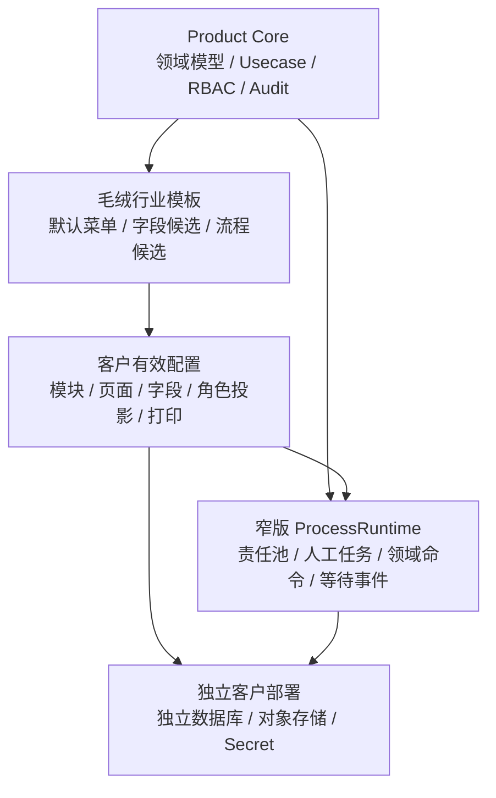

# 多甲方角色能力与流程编排 / Multi-customer Role and Workflow Design

Status / 状态：Current Design Contract，必须以当前代码、migration 和测试复核实现层级。

## 结论

本产品采用一套 Product Core、统一数据库模型、统一领域规则和多个独立客户部署。客户差异通过模块状态、人员多角色、责任池、页面/字段投影、打印模板和少量已登记流程变体表达，不 fork 代码，不做动态插件平台、通用 BPMN 或低代码表单系统。

最重要的效率规则是：

- 正常业务走领域 usecase 自动校验、自动计算和自动生成必要的下一协同任务。
- 只有跨岗位交接、异常、退回和高风险审批才进入 Workflow。
- 同一岗位连续完成的动作不拆成多个点击；能从真实事实推导的状态不要求人工重复填写。
- `task done` 只表示协同完成；库存、质检、出货、收付款等事实必须由各自领域 usecase 过账。

## 顶层结构



Product Core 决定业务底线；客户配置只能在底线之内组合和收窄。库存可否为负、质检不合格能否进入可用库存、出货是否扣减库存、财务事实来源和审计是否开启，不能由客户配置覆盖。

## 业务分层与唯一真源

| 层 | 负责什么 | 当前主要真源 | 禁止 |
| --- | --- | --- | --- |
| MasterData | 客户、供应商、产品、材料、单位、仓库、工序、BOM | 对应正式表和 MasterData/BOM usecase | 在客户配置里复制业务记录 |
| Source Document | 销售订单、采购订单、加工合同等业务承诺 | `sales_orders`、`purchase_orders`、`outsourcing_orders` | 把提交/审批当成事实过账 |
| Fact | 入库、退货、调整、质检、库存流水、出货、业务财务事实 | 各领域事实表和 usecase | Workflow 直接写 Fact |
| Workflow | 责任交接、任务、提醒、退回、流程实例和节点 | `workflow_tasks`、ProcessRuntime 表 | 把 payload 当业务事实真源 |
| Read Model | 看板、余额、统计、搜索索引 | 从正式事实派生 | 反向覆盖事实表 |
| Customer Config | 品牌、模块、页面、字段、角色投影、打印、编号和流程 manifest | 有版本的 customer config revision | 改 schema、提升后端权限、写客户业务数据 |

### Source Document 冻结规则

销售订单、采购订单和加工合同只有 `draft` 可修改头和明细。提交后只能走批准、取消、关闭、退回重开或新版本等明确动作，不能继续无痕覆盖金额、数量、供应商、产品/材料和快照。

行金额由后端按 `数量 × 单价` 计算；客户端给出的金额只可作为一致性校验，不能成为金额真源。

## 目录设计与目的

| 目录 | 目的 | 不能放什么 |
| --- | --- | --- |
| `server/internal/core/` | 纯状态、金额、数量和领域不变量；无数据库依赖 | 客户名、JSON-RPC、Ent、文件读取 |
| `server/internal/biz/` | 业务 usecase、事务边界、RBAC、ProcessRuntime、客户配置编译 | HTTP 参数拼装、客户硬编码 |
| `server/internal/data/model/schema/` | Ent schema 单一结构真源 | 客户可选 schema、手写运行时分叉 |
| `server/internal/data/model/migrate/` | Atlas 版本化迁移；所有客户共用 | 按客户复制 migration |
| `server/internal/data/` | Repository、事务和 Ent 映射 | 页面规则、角色文案 |
| `server/internal/service/` | JSON-RPC 鉴权、参数转换和调用 usecase | 业务事务、状态机判断、金额计算 |
| `web/src/erp/pages/` | 页面壳、用户任务和业务反馈 | 后端事实推导、客户 raw 配置直读 |
| `web/src/erp/components/` | 可复用表格、表单、详情和状态组件 | 单一页面的大段私有流程逻辑 |
| `web/src/erp/hooks/`、`utils/` | 数据请求、动作、字段投影和纯函数 | 新业务真源或客户秘密 |
| `web/src/erp/config/` | Product Core 的导航、页面和展示目录 | 永绅专属字段、员工姓名和原始文件 |
| `config/catalog/` | 可登记的模块、页面、字段、能力和责任池词典 | URL 路由真源、业务数据 |
| `config/industry-templates/plush/` | 毛绒行业可复用默认候选 | 单客户名称和特殊事实规则 |
| `config/customers/<key>/` | 客户声明式配置、差异、打印和模拟 fixture | Secret、真实业务行、动态代码插件 |
| `config/customers/<key>/public-assets/` | 唯一可发布到前端的客户公开静态资源 | 工程图、原始 Excel/PDF、员工 PII |
| `config/private-deployment-template/` | 新客户私有化配置包的候选模板与边界 | 第二套部署主路径、真实 env、真实备份 |
| `server/deploy/compose/prod/` | 当前唯一 Compose 部署真源 | 客户专属核心分叉、服务器端构建流程 |
| `deployments/<key>/` | 单客户部署参数模板、runbook 和脱敏 evidence | Product Core 规则、源码 fork |
| `scripts/import/` | manifest、只读提取、freeze、dry-run | 隐藏 `--execute`、直写数据库 |
| `scripts/qa/` | 小而明确的合同、边界和回归门禁 | 数千行的第二套需求/实现真源 |
| `docs/product/` | 产品边界、能力和实施治理 | 客户原始资料 |
| `docs/architecture/` | 跨模块真源、事务和状态设计 | 页面操作手册 |
| `docs/customers/<key>/` | 客户差异、来源、验收和交付资料 | 自动晋级 Product Core 的结论 |
| `docs/reference/` | 外部/GPT/老板资料的只读参考 | 当前实现状态声明 |
| `docs/archive/` | 历史证据 | 当前入口和当前真源 |

目录的核心目标是让维护者只看路径就能判断“这是产品规则、客户配置、客户资料、运行时事实还是历史证据”。

## 模块组合，不做动态插件

每个客户 revision 只允许三种模块状态：

| 状态 | 页面 | 查询 | 写动作 | 历史数据 |
| --- | --- | --- | --- | --- |
| `enabled` | 可按 RBAC/页面投影显示 | 允许 | 仍需后端 permission + usecase 校验 | 保留 |
| `read_only` | 可显示 | 允许 | 后端必须拒绝 | 保留 |
| `disabled` | 普通账号隐藏 | 历史/管理员查询按正式策略处理 | 后端必须拒绝 | 不删除 |

模块关闭不删除表、不卸载 migration、不改变历史事实。依赖在激活或回滚配置前按后端 catalog 校验闭包，例如：采购入库依赖采购订单、来料质检与库存；出货过账依赖销售订单与库存；加工合同依赖供应商、工序，并按明细主体动态依赖产品或材料。业务 API 的模块门禁复用同一依赖闭包，不能只检查当前模块名。

新增模块必须先登记 catalog、后端模块门禁、页面、RBAC 和测试；不能通过客户包上传 JS/Go 代码实现。

## 角色、能力和责任池

```text
用户 = 一个或多个后端角色
角色 = 后端权限码集合
客户角色投影 = 页面/动作/责任池的收窄配置
流程节点 = 所需能力 + 责任池，不直接绑定员工
责任池成员 = 当前客户中可接任务的用户/角色
```

客户配置有效动作必须取交集：

```text
实际动作 = 后端 RBAC ∩ enabled 模块 ∩ active revision action entitlement - 当前角色 revoke
```

`access_entitlements` 是客户配置唯一的动作加法真源；`role_profiles` 只保留角色启停、能力包标记和 revoke，没有第二套加权字段。客户配置可以撤销/隐藏权限，不能凭空提升后端权限；发布时会拒绝超过对应 Product Core 内置角色 RBAC 上限的 entitlement。多角色账号先分别计算每个角色的 entitlement 与 revoke，再取角色并集，某一角色的 revoke 不会误删另一角色正式拥有的能力。

页面投影与动作投影分开：`rolePageProjections` 控制岗位可见页面，页面引用到的客户、供应商、联系人、产品、材料、库存批次或来源单只授予窄版只读能力。页面与所需只读权限由 Product Core 页面 catalog 的合同测试校验；引用读取权限不会因此把对应主数据或库存页面额外开放给岗位。客户岗位与标准角色不一致时，先给同一用户分配多个标准角色；只有职责组合长期稳定、多人复用且审计需要独立命名时，才创建受控客户角色模板。不要为每个员工、字段或普通按钮创建权限码。

业务 JSON-RPC 会在服务端执行上述交集，不能只靠前端隐藏。`system.* / customer_config.* / debug.*` 控制面权限不受客户业务 entitlement 收窄，仍由后端 RBAC、环境门禁和审计控制，避免错误配置把管理员锁在修复与回滚入口之外；模块 `read_only / disabled` 仍由独立模块门禁拒绝并给出模块状态原因。

### Product Core 角色模板与永绅投影

| 核心角色 | 永绅岗位 | 主要菜单/页面 | 可写能力 | 主要状态/任务 | 业务与协同边界 |
| --- | --- | --- | --- | --- | --- |
| `sales` | 业务 | 客户、销售订单、出货查询、任务看板 | 客户/联系人、销售订单草稿与提交 | 订单 `draft/submitted`；销售提交、交期/资料确认 | 不写库存、质检、出货或应收事实 |
| `boss` | 老板/管理审批 | 全局看板、任务、采购审批 | 审批/退回协同任务，审批采购订单 | 审批任务 `ready/blocked/done/rejected` | 审批不绕过领域 usecase；不直接改明细 |
| `engineering` | 工程 | 产品、材料查询、工序、BOM、工程打印、任务 | 产品/SKU/工序/BOM 草稿与激活 | BOM `DRAFT/ACTIVE/ARCHIVED`；工程资料齐套 | 不生成采购、生产、库存事实 |
| `pmc` | PMC | 产品/BOM查询、生产进度、风险、任务 | 计划与风险处理 | 待排产、生产中、缺料/延期阻塞 | 计划完成不等于生产完工/入库 |
| `purchase` | 采购；永绅可由财务人员兼任 | 供应商、材料、采购订单、采购入库查询、任务、采购合同打印 | 供应商、采购订单草稿/提交、采购到货准备 | 采购单 `draft/submitted/approved/closed/canceled` | 入库和应付由对应事实 usecase 产生 |
| `production` | 生产/委外 | 加工合同、生产进度、任务 | 加工合同草稿/提交/确认、进度协同 | 加工合同草稿/确认/关闭；回货跟踪 | 不直接写回货质检、入库、结算事实 |
| `quality` | 品质 | 质检、入库来源查询、任务 | 质检草稿、提交、通过、拒绝、异常处理 | `DRAFT/SUBMITTED/PASSED/REJECTED/CANCELLED` | 质检结论不直接增减库存 |
| `warehouse` | 主料仓/成品仓/其他仓岗位 | 入库、库存、出库、出货、任务 | 入库/出库/出货确认，库存调整按权限 | 入库 `DRAFT/POSTED/CANCELLED`；出货 `DRAFT/SHIPPED/CANCELLED` | 必须走库存/出货事务；任务完成不代替过账 |
| `finance` | 财务 | 对账、应付、应收、发票线索、出货查询、任务 | 业务应收/应付确认、放行协同 | 对账中/已结算，付款/出货放行任务 | 当前不是总账/税控；要下采购合同则同时授予 `purchase` 角色 |
| `admin` | 系统管理员 | 用户、角色、权限、客户配置、审计 | 账号、RBAC、配置 revision | 配置 draft/published/active/rolled-back | 不天然拥有业务事实处理权 |

永绅“财务根据工程表下合同”应实现为：该人员同时持有 `finance + purchase`，采购合同仍由采购订单/BOM需求链产生；不能把采购权限塞进所有客户的 `finance` 核心角色。

### 业务数据范围

当前是一客户一套数据库的私有化部署，`access_entitlements.scope_type` 只支持全局 / 当前客户的能力范围，不能写成已经具备通用行级数据权限。主料仓、成品仓和其他仓目前是仓库主数据与业务筛选，不会仅凭岗位名称自动限制某个用户只能操作某几个仓库。

真实客户若要求分仓、按业务员或按部门隔离，采用小而固定的数据范围 catalog（例如 `all`、`warehouse_set`、`owner_only`），并由每个领域 usecase / repo 在查询和写入时同时校验；客户配置只引用已登记 scope 和 ID，不上传 SQL、表达式或任意过滤代码。未完成后端约束前只能做页面默认筛选，不能宣传成安全边界。

## 字段表面与读写边界

这里必须区分“客户配置运行时字段策略”和“正式业务字段合同”。字段出现在表单、列表或打印中，不等于它已经可以由客户配置控制。

当前 active `field_policies` 只允许以下三个 surface，前端只消费列表和 CSV 导出列的 boolean `visible`。后端 validate / publish 会拒绝 label、editable、required、空策略和非布尔值；字段策略不改字段名称，也不改变表单或领域校验。当前 demo 与 yoyoosun manifest 都从 Product Core catalog 生成相同的 `visible=true` 默认值，尚未声明永绅专属字段隐藏。

| Runtime surface | 当前字段 | 消费位置 | 边界 |
| --- | --- | --- | --- |
| `customers.default` | customer_code / display_name | 客户列表与 CSV 导出 | 只控制列可见性；表单字段和主数据真源不变 |
| `suppliers.default` | supplier_code / supplier_type | 供应商列表与 CSV 导出 | 只控制列可见性；加工厂仍是供应商类别 |
| `sales_orders.default` | order_no / source_no / expected_ship_date | 销售订单列表与 CSV 导出 | 只控制列可见性；提交后冻结和保存校验仍由后端负责 |

其余对象是正式业务字段合同，由页面、usecase、schema 和映射 helper 维护；当前不能写进 active `field_policies`。如果以后确有客户差异，必须先登记 surface / field key、补后端 allowlist、前端消费者和测试，再开放声明式配置。

| 正式字段合同（非 runtime field policy） | 字段 | 写入角色 | 真源/规则 |
| --- | --- | --- | --- |
| `sales_order_items.default` | 产品号、产品名、SKU、数量、单价、金额 | sales | 产品/单位真源 + 保存快照；金额后端计算 |
| `bom_versions.default` | 产品、版本、来源订单、数量说明、损耗说明、日期、制表/审核、毛向、状态 | engineering | BOM 版本真源；激活版本不可无痕修改 |
| `bom_items.default` | 材料、用量、单位、损耗率、部位、片数、总用量快照、工艺和备注 | engineering | 材料/单位真源；供采购需求计算 |
| `purchase_orders.default` | 采购单号、供应商、预计到货、状态 | purchase | 采购承诺；批准后冻结 |
| `purchase_order_items.default` | 客户订单号、产品号、材料、规格、单位、数量、单价、金额 | purchase | 材料/单位/BOM需求来源；金额后端计算 |
| `outsourcing_orders.default` | 加工单号、加工商、预计回货、状态 | production | 加工承诺；提交后冻结 |
| `outsourcing_order_items.default` | 主体类型、产品或材料、工序类别、单位、数量、单价、金额、回货说明 | production | `PRODUCT/MATERIAL` 二选一；车缝/手工用产品，布料加工用材料 |
| `purchase_receipts.default` | 入库单、采购单、仓库、状态 | warehouse | 采购入库事实；过账后只能取消/调整 |
| `quality_inspections.default` | 检验单、来源单、结果、处理意见 | quality | 质检事实；结果必须有来源与审计 |
| `inventory_lots.default` | 批次、仓库、材料/产品、数量、状态 | warehouse read | 库存批次事实/read model |
| `inventory_txns.default` | 流水号、类型、仓库、物料、数量 | warehouse read | 不可直接编辑的库存流水 |
| `shipments.default` | 出货单、销售订单、仓库、状态、出货时间 | sales/warehouse | 出货事实；SHIPPED 后形成库存扣减依据 |
| `finance_facts.default` | 财务业务单号、来源单、类型、金额、状态 | finance | 业务应收/应付/对账事实，不等于总账 |

`fieldNumberingConfig.mjs` 中的产品、款式、颜色 / 尺寸等条目仍是客户评审候选，不进入 active field policy，也不自动创建 SKU。

来源切换或清空时，依赖快照必须同步替换或清空；旧快照缺失时只按正式回补口径读取真源，不能伪造值。列表、详情、搜索、打印和导出必须共用映射 helper。

## 状态分层概览

状态按 Source Document、Workflow task、Workflow business projection、Process instance / node、Fact / Ledger 和 MasterData lifecycle 的所有者分层，不建立一个万能 `business_status` 覆盖所有领域。

状态顶层设计和中文 / English 双树只表达正式目标模型；当前实现证据与 `Planned / Deferred` 未来方向在树外分别登记。各对象的 canonical key、流转规则、数据库约束、中文显示映射和测试入口统一见 [`../architecture/状态字典与生命周期索引.md`](../architecture/状态字典与生命周期索引.md)；Workflow / Fact 的事务与推进边界见 [`../architecture/状态工作流事实边界.md`](../architecture/状态工作流事实边界.md)。本文只保留角色、菜单、字段和流程投影口径，不再复制易漂移的状态枚举。

`rejected` 等同名状态必须结合所属对象解释。任务退回后如需重做，ProcessRuntime 创建新的节点 attempt 或回到明确节点；不能把同一已结算任务重新打开。Workflow task `done`、节点完成和业务进度投影都不等于领域 Fact 已过账。

## 业务流与协同流

### 订单到交付


协同任务只放在真实交接点：订单提交审批、工程资料缺失、采购/加工责任接单、质检异常、入库阻塞、出货放行和对账差异。正常保存、自动计算金额、库存过账后的余额更新、流程节点推进不再要求人工重复确认。

### 永绅加工合同

- 车缝加工、手工加工：同一加工合同，明细主体为 `PRODUCT`，工序类别区分车缝/手工。
- 布料加工：同一加工合同，明细主体为 `MATERIAL`，记录布料、加工方式、数量、单位、单价和预计回货。
- 三者都复用供应商、工序、合同状态、打印和回货链，不拆三套表。
- 回货任务完成不等于质检通过、入库或应付结算。

### 永绅采购合同与仓库

- 主料和其他材料复用采购订单，材料分类与仓库决定展示/收货去向，不拆合同表。
- 财务人员下合同时持有 `purchase` 角色；合同必须可追溯到工程/BOM需求或人工批准的采购来源。
- 仓库主数据使用主料仓、成品仓、其他仓；质检待检区可独立保留。仓库类型是通用主数据，不是永绅 schema 字段。

## 流程自动流转与效率约束

自动流转只允许以下动作：

1. 节点完成后按已发布 manifest 激活下一节点或 fan-out。
2. 激活人工节点时创建一条带 process/node 锚点的任务，并按幂等键防重复。
3. `domain_command` 节点调用白名单 usecase；成功后记录 outcome，失败保持可恢复状态。
4. 等待节点只响应已登记事件；超时可阻塞/升级，但不自动伪造业务结果。
5. 流程拒绝时结算当前任务和节点，按策略回退或阻塞流程；原因必填。

以下不自动：质检通过、库存入账、出货、应收应付确认、发票、收付款、让步接收。它们必须由有权限的责任人执行领域动作，或由明确、可审计的白名单领域命令执行。

## 客户配置合并与扩展点

有效配置按固定顺序编译：

```text
Product Core catalog
→ plush industry defaults
→ customer active revision
→ backend RBAC / 当前用户角色交集
→ runtime module dependency validation
```

允许扩展：品牌公开资源、模块状态、菜单分组、已登记字段 surface、编号格式、打印模板、导入映射、角色页面/动作收窄、责任池成员、批准的流程 manifest 和外部系统 adapter。

不允许扩展：任意代码上传、客户 schema、客户 migration、客户专属核心 usecase 分叉、关闭审计、改变库存/财务/出货底线、从前端直接写流程锚点。

配置 revision 必须经过 validate → publish → activate；激活后新流程使用新 revision，在途流程继续绑定启动时 revision。回滚只影响新会话/新流程和配置投影，不改写历史事实或在途节点。

## Ent / SQL 设计原则

所有结构变更通过 Ent schema + Atlas migration。核心关系保持：

```text
roles --< role_permissions >-- permissions
admin_users --< admin_user_roles >-- roles

customer_config_revisions
  customer_key, revision, product_version, status,
  compiled_snapshot, config_hash,
  published_by, published_at, activated_by, activated_at

process_instances
  process_key, process_version, variant_key, config_revision,
  definition_hash, module_contract_snapshot,
  business_ref_type, business_ref_id, business_ref_no,
  correlation_key, idempotency_key, status,
  started_at, completed_at

process_node_instances
  process_instance_id, node_key, node_type, owner_pool_key,
  required_capability_key, status, outcome, attempt, version,
  due_at, started_at, completed_at

workflow_tasks
  task_code, task_group, source_type, source_id, source_no,
  owner_role_key, owner_pool_key, assignee_id,
  process_instance_id, process_node_instance_id,
  required_capability_key, config_revision, task_status_key,
  blocked_reason, payload, started_at, completed_at, closed_at
```

数据库必须用 unique/check/foreign key 锁住 exactly-one、幂等键、revision 唯一性和合法关联；并发变更使用版本/CAS 或事务行锁。前端校验只改善体验，不是数据边界。

## 审计设计

审计记录回答谁、何时、以什么角色、对哪个对象、执行了什么、从什么状态到什么状态、结果和 request_id。至少覆盖：

- 登录/禁用、角色和权限变更。
- 客户配置 validate/publish/activate/rollback。
- Source Document 创建、提交、审批、取消和关闭；敏感字段变更保存 before/after 摘要。
- Workflow 指派、接单、完成、阻塞、拒绝、催办和流程节点结算。
- Fact 过账、取消、冲正、调整和失败。
- 导入批次（未来实现）逐批次摘要与逐行结果引用。

审计不保存密码、token、完整 DSN、原始客户文件和无必要的个人信息；用户可见错误使用中文业务说明，服务端日志保留错误码、request_id 和脱敏技术原因。

## 测试与部署门禁

| 层 | 必测内容 |
| --- | --- |
| Core 单元 | 状态迁移、金额/数量、exactly-one、终态和原因必填 |
| Usecase | 正常、非法状态、幂等、事务失败、并发、取消/冲正、已提交不可编辑 |
| Repo / Migration | constraint、索引、新鲜库完整建库、升级前后 schema 与数据一致性 |
| Service / RBAC | 未登录、disabled、无权限、多角色、客户 key 不匹配、模块 read_only/disabled |
| Customer Config | schema、依赖、revision、角色/责任池悬空引用、effective session 交集 |
| Frontend | 菜单、字段、按钮、默认/交互/恢复/错误/无权限/长文本状态 |
| Browser | 真实页面主链、box model、移动岗位端、打印预览和截图复核 |
| Data | 中性 demo 完整链；永绅 fixture 明确 simulated；dry-run 不具备写入能力 |
| Release | Node/Go/pnpm 版本、secrets、固定镜像、migration 整段锁、备份恢复、smoke、回滚 evidence |

`fast` 保留高频小合同；`full` 是提交前完整门禁；`strict` 是发版前 warning-as-error。发布在本地/CI 构建固定 tag 镜像，低配服务器只 load/pull、migration、启动、健康检查和 smoke。

## 当前实现边界

- Product Core 的 RBAC、客户配置 revision/effective session、ProcessRuntime、Workflow tasks 和主要领域 usecase 已存在，但 `config/customers/yoyoosun/customerPackage.mjs` 中多条 workflow 仍标记 `preview_only`，不能写成已在生产自动运行。
- 永绅公开前端配置只发布品牌、菜单与 `public-assets`；工程图、来源表和员工信息保留在受控客户资料边界。
- 当前只有模拟试用数据，真实客户导入执行器不存在；以后按通用批次能力另行评审。
- 财务目前是业务应收/应付/对账，不是完整总账、税控或成本会计。
- 生产页面目前以协同、进度和委外合同为主，不包装成完整 MES。
- 当前 runtime audit 已覆盖配置控制面、账号 / 角色 / 权限及部分流程事件，但不是每个 Source Document / Fact 动作都已有完整 before/after 业务审计；能力台账仍按“部分”登记，不能只凭审计页存在就承诺完整追溯。

## 变更检查

修改角色、流程、模块或字段时，必须按顺序核对：领域真源 → 权限码 → usecase → customer config → 页面/字段投影 → 测试 → 文档。若文档与代码冲突，以当前代码、migration、测试和 `docs/当前真源与交接顺序.md` 收敛，并在同一轮修正文档，不再增加平行审计文档。
