# 模块实施治理 / Implementation Governance

- 文档类型：施工治理文档 / Implementation Governance
- 状态：当前治理规则 / Active Governance
- 作用域：约束模块进入实现前的评审、门禁、拆分和范围确认
- 不代表：runtime、schema、migration、API、UI、测试或客户导入已经实现
- 不替代：`docs/product/产品完成路线图.md`、`docs/当前真源与交接顺序.md`、代码、测试或本轮具体任务说明

## 0. 文档目的 / Purpose

本文用于固化 `plush-toy-erp` 重新做项目后的施工规则：模块不是按聊天里的临时顺序直接进入实现，而是先确认实施顺序、Architecture Layer、模块类型、当前门禁和允许修改范围。

本文负责实施治理。涉及当前行为、表结构、权限、API、UI、测试结果或客户真实数据导入时，正式判断回到当前代码、Ent schema、Atlas migration、测试、`docs/当前真源与交接顺序.md` 和本轮具体任务说明交叉确认。

本文也不是 roadmap。Roadmap 回答“产品按什么能力路线推进”，本文回答“某个能力闭环进入实现前要满足什么治理条件”。

## 1. 实施顺序与 Architecture Layer / Implementation Order And Architecture Layer

实施顺序负责先后安排，Architecture Layer 负责职责边界。两者必须同时判断，不能互相替代。

| 概念 | 回答的问题 | 不回答的问题 |
| --- | --- | --- |
| 实施顺序 / 能力里程碑 | 先做什么、后做什么、当前阶段产出什么结果 | 某个字段、状态或事实应该归哪个层负责 |
| Architecture Layer / 架构层 | 谁是真源、谁能写事实、谁负责权限和展示边界 | 当前阶段是否应该立即实现 |

一个能力里程碑可以涉及多个 Architecture Layer。例如一个采购模块里程碑可能同时触达 MasterData、Source Document、Fact、Workflow、RBAC、API、UI 和测试。里程碑只是施工批次，不是放宽边界的理由。

任何里程碑交付都不能破坏 Workflow / Fact / MasterData / RBAC 边界：

- Workflow 只负责协同任务、业务状态推进和必要的下游协同任务派生。
- Fact 负责采购、库存、质检、生产、出货、财务等真实业务事实。
- MasterData 负责客户、供应商、联系人、材料、产品、单位、仓库、BOM 等稳定基础资料。
- RBAC 是后端动作权限和职责边界，不由菜单隐藏替代。

如果某个里程碑需要跨层推进，必须先在 docs-only review 或正式设计文档中写清每一层的职责、真源、禁止项和测试层级，再拆后续实现任务。

## 2. 标准模块开发闭环 / Standard Module Delivery Loop

标准模块进入实现前，默认按下面闭环拆分。不是每个模块都需要每一步，但跳过任一步必须在评审文档或任务文件中说明原因。

1. docs-only review：先评审模块定义、职责边界、当前真源、非真源、禁止项、测试层级和停止条件。
2. schema / migration：只有评审确认需要新的持久化真源时，才进入 Ent schema 和 Atlas migration；禁止为已存在真源重复造表。
3. repo / usecase：先落后端主路径和事务边界，明确状态变化、事实写入、只读查询和错误处理。
4. 状态机 / State Machine：定义允许状态、非法状态、终态、回退边界和旧原因清理规则。
5. 幂等 / Idempotency：定义重复提交、重试、并发保护和 source tracing 规则。
6. 取消 / 作废 / 冲正 / Cancel Void Reversal：Fact 类模块必须优先评审冲正或反向事实；Source Document 和 Workflow 按生命周期选择取消或作废边界。
7. RBAC：后端动作权限、角色职责、owner_role_key、assignee_id 和业务守卫必须同时评审。
8. API：只有 usecase 与权限边界稳定后才接 API；API 不应补造 usecase 缺失的事实逻辑。
9. UI：UI 只展示和提交已评审能力，不在前端本地派生库存、出货、财务或权限事实。
10. 测试 / Tests：按 `docs/product/自动化测试策略.md` 选择测试层级，并覆盖正常路径、异常路径、边界条件和回归风险。
11. 文档边界 / Docs Boundary：同步 current-source、roadmap、产品台账、架构评审、帮助或交付文档中实际需要更新的入口和状态。

### 2.1 标准闭环图 / Standard Delivery Gate Diagram

```mermaid
flowchart LR
  intake["任务输入<br/>roadmap / current-source / 用户本轮目标"]
  review["docs-only review<br/>模块定义 / 真源 / 禁止项 / 停止条件"]
  scope["任务边界<br/>允许路径 / 禁止路径 / 验收命令"]
  schemaGate["schema gate<br/>确认需要新持久化真源"]
  schema["schema / migration<br/>Ent + Atlas"]
  usecase["repo / usecase<br/>事务 / 状态机 / 幂等 / 冲正"]
  rbacApi["RBAC / API<br/>动作权限 / JSON-RPC / 鉴权边界"]
  ui["UI<br/>只展示和提交已评审能力"]
  tests["tests / regression<br/>正常 / 异常 / 边界 / 回归"]
  docs["docs update<br/>current-source / roadmap / ledger / help / progress"]
  deliver["delivery / trial<br/>部署 / 试用 / 客户验收"]
  stop["停止或拆下一轮<br/>不扩大当前任务"]

  intake --> review
  review --> scope
  scope --> schemaGate
  schemaGate -->|需要新真源| schema
  schemaGate -->|复用既有真源| usecase
  schema --> usecase
  usecase --> rbacApi
  rbacApi --> ui
  ui --> tests
  tests --> docs
  docs --> deliver

  review -. docs-only 不能直接进入 runtime .-> stop
  scope -. 触达禁止路径或范围不清 .-> stop
  ui -. 不在前端补造后端事实 .-> usecase
  deliver -. 客户反馈或真实导入需求 .-> review
```

上图只表达实施门禁，不代表任一模块已经完成 runtime、schema、migration、API、UI、测试或客户导入。遇到禁止路径、真源不清、Workflow / Fact 混用、客户资料升级 Product Core、或 dry-run 想进入 real import 时，应回到 docs-only review 或拆下一轮，而不是在当前任务里继续扩大实现范围。

### 2.2 业务列表筛选治理 / Business List Filter Governance

业务页筛选必须按真实业务字段和后端查询能力接入，不按页面数量机械复制控件。

| 筛选类型 | 适用条件 | 默认不适用 |
| --- | --- | --- |
| 关键词 | 有稳定编号、名称、客户 / 供应商单号或可搜索快照字段 | 没有后端或共享 helper 支持的临时拼接字段 |
| 状态 / 类型 | 有明确状态机、启停用、生命周期或业务分类 | 仅为页面视觉分组而临时造的状态 |
| 日期范围 | 有明确业务时间真源，例如订单日期、计划交付、采购日期、预计到货、到期日、过账日、出货日 | 客户、供应商、材料、BOM 等主数据页默认不按创建 / 更新时间作为首要筛选 |
| 排序 | 后端白名单已支持且不会改变事实写入顺序 | 前端本地猜测排序或影响事实语义的排序 |

日期范围控件在桌面端应作为一个整体控件展示：日期类型、开始日期和结束日期可以整体换行，但不能把开始 / 结束日期拆成相互分离的两行或被其他筛选插开。移动端如空间不足，可改为弹窗、抽屉或整体纵向布局，但仍要保持“一个日期范围条件”的语义。

新增筛选时必须同时确认：

1. 字段是真源字段、快照字段还是派生字段。
2. 后端 API / repo 是否真正按该字段过滤。
3. 空值、清空、切换字段和起止日期反向输入的行为。
4. 默认态、交互态、恢复态和相邻筛选控件不会溢出或错位。

## 3. 模块类型适用强度 / Module Strictness

不同模块进入闭环的强度不同。强度越高，越不能用局部兜底、前端派生或临时兼容绕过主路径。

| 模块类型 | 治理重点 | 最低门禁 |
| --- | --- | --- |
| MasterData | 唯一真源、启停用、引用保护、历史数据兼容 | docs-only review 后再决定 schema / repo / API / UI |
| Source Document | 业务承诺、单据生命周期、行项目、取消或关闭边界 | 明确不直接写库存、出货、财务事实 |
| Fact | 事实流水、余额或查询加速表、冲正、幂等、事务一致性 | schema / usecase / 测试门禁最严，必须评审取消或冲正 |
| Workflow | 协同任务、状态推进、下游协同任务派生、原因必填 | 明确不写库存、出货、财务、应收、应付、发票或收付款事实 |
| API / UI | 后端权限、用户入口、交互态、错误提示、展示回显 | usecase 和 RBAC 未稳定前不接页面主路径 |
| Delivery / Import | dry-run evidence、freeze、manual review、真实导入批准、回滚 | dry-run / freeze 不等于 real import approval |
| Customer Config | 客户配置包、菜单开关、字段显示、编号规则、初始化模板 | 不把单客户资料直接提升为 Product Core |

当前 yoyoosun 只有模拟数据试用目标：不拆 A/B/C/D 或任何字母子阶段，不执行真实客户数据导入。试用模拟必须一次性用 seed、fixture 或手工构造的模拟客户、供应商、联系人和销售订单数据完成试用环境、账号、RBAC、菜单、V1 页面、岗位任务端和培训验收；真实导入不作为隐藏目标、后续半阶段或完成条件。

业务事实扩展已完成本地统一实现闭环。`docs/architecture/业务事实扩展总评审.md` 已一次性覆盖生产事实、委外事实、出货事实、库存预留和财务事实五条事实链；当前代码已落 schema / migration、repo / usecase、API / RBAC、最小 UI 和测试。后续继续扩展打印、报表、核销、客户配置、目标环境发布或客户验收时，仍必须按具体实现闭环控制允许路径、禁止路径和验收命令。

## 4. 进入下一阶段的门禁 / Stage Gates

### 4.1 docs-only review -> schema

只有同时满足以下条件，才允许从评审进入 schema：

- 已说明现有真源不可复用，确实需要新的持久化对象或字段。
- 已确认不重复设计 `units`、`materials`、`products`、`warehouses`、`inventory_txns`、`inventory_balances`、`inventory_lots`、采购、质检或 RBAC 既有真源。
- 已写清状态、外键、删除保护、历史数据兼容和 migration 验收方式。
- 已确认本轮允许修改 schema / migration；docs-only 任务不能顺手进入 schema。

### 4.2 schema -> repo/usecase

schema 和 migration 进入 repo / usecase 前，必须确认：

- migration 已生成并通过项目指定检查。
- usecase 的真源、事务边界、错误码、幂等键和回滚策略已经评审。
- 不通过 repo 或 usecase 外的脚本临时写业务事实。

### 4.3 usecase -> API/RBAC

usecase 接 API / RBAC 前，必须确认：

- usecase 测试覆盖核心状态、非法状态、重复提交和错误路径。
- RBAC 动作权限和业务职责边界已定义。
- 前端隐藏入口不会被当成安全边界。

### 4.4 API/RBAC -> UI

API / RBAC 接 UI 前，必须确认：

- 后端接口和权限守卫已经覆盖未登录、禁用管理员、非管理员、无权限、角色不匹配和 super_admin 边界。
- UI 只消费 API 返回的事实和状态，不在本地补造后端事实。
- 页面文案不会把协同状态写成事实状态，例如不能把 `shipping_released` 写成 `shipped`。

### 4.5 UI -> customer trial

UI 进入客户试用前，必须确认：

- 默认态、交互态、恢复态、异常态和相邻区域已经回归。
- 帮助、验收、产品台账或客户交付说明中的状态没有夸大。
- 客户配置、客户资料和 Product Core 边界清楚。

### 4.6 dry-run -> real import

dry-run 或 freeze evidence 进入真实导入前，必须确认：

- 已完成 source inventory、field classification、unresolved queue、manual review checklist 和导入批准。
- dry-run 输出仍然只是 evidence，不是真实导入命令。
- `canExecuteRealImport=false` 或等价保护没有被绕过。
- real import loader、DB 写入、回滚、审计和验收属于单独评审和单独实现任务。

当前 yoyoosun 不进入真实导入门禁：没有可执行客户真实数据时，只能按模拟数据试用演练完成验收。不得为了“补齐阶段”绕过 `canExecuteRealImport=false`、执行 import loader 写库、把模拟数据当真实客户数据，或把真实导入拆成隐藏子阶段。

## 5. 明确禁止项 / Prohibitions

- 不把任一客户资料、字段习惯、打印样式、Excel 样本或流程偏好直接写成 Product Core。
- 不让 `WorkflowUsecase` 写库存、出货、财务、应收、应付、发票或收付款事实。
- 不把 `shipping_released` 当成 `shipped`，也不把 workflow task `done` 当成 fact posted。
- 不把菜单隐藏、前端路由隐藏或按钮不可见当成 RBAC。
- 不从 dry-run / freeze evidence 直接执行真实导入。
- 不把试用模拟拆成 A/B/C/D 等字母子阶段；当前 yoyoosun 不执行真实客户数据导入，只能用模拟数据一次性完成试用环境演练和验收。
- 不把业务事实本地实现写成目标客户环境已 migration / 已上线 / 已完成客户交付。
- 不为某个能力里程碑交付而重复设计已存在的事实真源、权限真源或客户配置边界；后续默认看能力、测试、evidence 和真源边界。
- 不把 docs-only 评审、roadmap、产品台账或聊天结论当成 runtime 实现证据。

### 5.1 Runtime 命名主路径 / Runtime Naming Main Path

本项目后续按能力闭环和真实业务领域组织开发、交付和测试。运行时代码、API、菜单、路由、测试、部署主路径和客户可见文档统一使用业务领域命名；历史阶段编号只作为归档检索标签存在。

推荐命名主路径：

- 领域：`shipment`、`inventory`、`purchase`、`quality`、`production`、`outsourcing`、`finance`、`bom`、`masterdata`、`workflow`。
- 任务：能力里程碑、功能闭环、测试用例、验收标准、交付资料。
- API / 测试：围绕业务动作和事实源命名，例如出货确认、库存预留、采购入库、质检判定和财务事实。

`scripts/qa/phase-label-boundaries.mjs` 负责拦截新增阶段编号命名，避免后续 AI 或维护者把历史阶段误读成正式领域、API domain、页面模块或测试结构。

当前仍存在的 `phase2*` PostgreSQL 本地验收脚本、测试环境变量、测试数据库名和兼容 Make target，只作为历史兼容边界保留；文档推荐入口已经改用 `inventory-*`、`bom_lot-*`、`purchase_receipt-*` 和 `purchase_return-*`。如后续要彻底删除这些兼容入口，必须单独评审命令替换、CI / 本地脚本影响、历史 evidence 可追溯性和回滚风险，不在普通功能任务中顺手清理。

## 6. 实施任务拆分规则 / Implementation Task Split Rules

每轮实施任务只做一个可验证闭环。闭环大小按可验证边界定义，不按“感觉相关”合并。

默认拆分规则：

- docs-only review、schema / migration、repo / usecase、API / RBAC、UI、delivery / import 应拆成不同实现任务。
- 如果当前任务中发现必须跨层，先停止扩大实现范围，补评审文档或任务说明，明确新边界后再拆下一轮。
- 如果任务需要改动禁止路径，先回到任务说明调整允许范围和验收命令，不顺手实现。
- 如果一个模块同时涉及 Workflow 和 Fact，先把二者的真源、写入边界和测试边界分开写清。
- 如果一个模块涉及客户资料，先确认它属于 Customer Config、Customer Extension、Industry Template 还是 Product Core。
- 每个非平凡任务必须写清允许修改文件、禁止修改文件、明确不做的内容、验收命令、停止条件和最终回复要求。

拆分不是为了制造流程负担，而是为了避免一次性把 schema、runtime、权限、页面、导入和客户差异混在一起，导致无法判断真源、测试和回滚边界。

## 7. 如何使用本治理文档 / Usage

拆新实现任务前，必须先把本文和下面文件一起作为入口检查：

- `docs/当前真源与交接顺序.md`
- `docs/product/产品完成路线图.md`
- `docs/product/产品台账索引.md`
- `docs/product/自动化测试策略.md`
- `docs/product/发布门禁.md`
- `docs/architecture/状态工作流事实边界.md`

每次拆分前至少回答：

1. 当前属于哪个能力里程碑或功能闭环？
2. 触达哪些 Architecture Layer？
3. 模块类型是什么，适用强度到哪一级？
4. 当前从哪个门禁进入哪个门禁？
5. 本轮允许和禁止修改哪些路径？
6. 需要跑哪些测试层级？
7. 是否触发 Workflow / Fact、客户资料、RBAC 或 dry-run / real import 禁止项？

如果这些问题无法回答，先做 docs-only review，不进入 schema、runtime、API、RBAC、UI 或真实导入。
