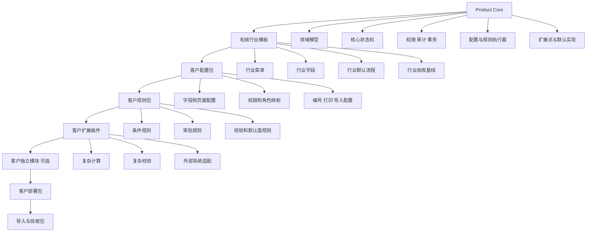

# ERP Product Core、行业模板、客户差异与可变流程参考实现

> 适用场景：同一套 ERP Product Core，叠加行业模板、客户配置、客户扩展和独立部署，实现多客户交付，同时避免为每个客户复制一套代码。

---

## 目录

1. [文档目标](#1-文档目标)
2. [总体架构](#2-总体架构)
3. [关键概念与边界](#3-关键概念与边界)
4. [各层职责](#4-各层职责)
5. [客户需求落点决策](#5-客户需求落点决策)
6. [Product Core 实现](#6-product-core-实现)
7. [客户配置实现](#7-客户配置实现)
8. [规则引擎实现](#8-规则引擎实现)
9. [扩展点与客户插件实现](#9-扩展点与客户插件实现)
10. [客户独立模块实现](#10-客户独立模块实现)
11. [前端页面扩展实现](#11-前端页面扩展实现)
12. [可变流程与闭环设计](#12-可变流程与闭环设计)
13. [角色、岗位与职责分离](#13-角色岗位与职责分离)
14. [字段和流程裁剪](#14-字段和流程裁剪)
15. [边界情况与异常场景](#15-边界情况与异常场景)
16. [事务、异步、幂等与补偿](#16-事务异步幂等与补偿)
17. [版本、迁移与在途实例](#17-版本迁移与在途实例)
18. [推荐目录结构](#18-推荐目录结构)
19. [测试体系](#19-测试体系)
20. [CI/CD、部署与验收](#20-cicd部署与验收)
21. [销售订单完整示例](#21-销售订单完整示例)
22. [反模式与禁止事项](#22-反模式与禁止事项)
23. [实施顺序](#23-实施顺序)
24. [项目验收清单](#24-项目验收清单)

---

## 1. 文档目标

本设计解决以下问题：

- 多个客户共用同一套 Product Core。
- 毛绒行业能力可以复用，而不是写死为某一个客户。
- 客户可以有不同字段、菜单、权限、审批、导入和打印要求。
- 客户流程可以多一环、少一环、并行或合并。
- 同一角色在不同客户中可以由一人、多人与多个岗位承担。
- 客户差异不能污染核心代码，也不能绕过核心业务不变量。
- Product Core 不加载任何客户包时，仍然可以运行和测试。
- 客户配置发布前，可以静态判断流程是否闭环。
- 每个客户部署都具备可重复导入、验收和升级能力。

核心目标：

```text
稳定 Product Core
+ 行业默认模板
+ 客户配置与规则
+ 受控扩展点
+ 必要的客户独立模块
+ 独立部署包
+ 标准导入和验收包
```

---

## 2. 总体架构



推荐依赖方向：

```text
客户模块 -> 客户扩展 -> 行业模板 -> Product Core

Product Core 不允许反向依赖任何具体客户。
```

---

## 3. 关键概念与边界

### 3.1 Product Core 不等于“当前客户的标准实现”

Product Core 应只包含：

- 稳定业务对象。
- 核心业务不变量。
- 核心生命周期和状态边界。
- 权限、审计、事务和一致性保障。
- 配置、规则和扩展机制。
- 默认可运行实现。

当前客户正在使用的全部字段和流程，不应直接被认为是 Product Core。

### 3.2 核心业务状态与客户流程节点必须分离

核心状态描述业务事实：

```text
DRAFT
SUBMITTED
EFFECTIVE
FULFILLING
COMPLETED
CANCELLED
```

客户流程节点描述“如何到达这些状态”：

```text
业务审核
财务审核
生产交期确认
总经理审批
自动风控
法务复核
```

客户可以改变任务节点数量，但不能直接跳过核心领域命令。

### 3.3 业务事实比节点名称更稳定

例如销售订单生效需要：

```text
order_validated
commercial_terms_confirmed
delivery_commitment_confirmed
risk_decided
```

不同客户可用不同步骤产生这些事实：

| 必要业务事实 | 客户 A | 客户 B |
|---|---|---|
| `order_validated` | 系统自动校验 | 业务专员审核 |
| `commercial_terms_confirmed` | 提交人确认 | 业务主管确认 |
| `delivery_commitment_confirmed` | 默认交期规则 | 生产计划员确认 |
| `risk_decided` | 小额自动通过 | 财务及总经理审批 |

因此判断流程是否闭环，应检查事实是否齐全，而不是比较节点数量。

### 3.4 默认实现必须存在

每个扩展点都必须有默认行为：

```text
额外字段：空
额外按钮：空
额外校验：通过
额外后置动作：无
打印：默认模板
导入：默认映射
审批：默认标准流程
```

Product Core 不能成为必须加载某个客户插件才能启动的空壳。

---

## 4. 各层职责

| 层级 | 主要职责 | 典型内容 | 禁止内容 |
|---|---|---|---|
| Product Core | 稳定业务能力 | 订单、物料、库存、权限、状态机、审计、事务 | 某客户专属判断 |
| 毛绒行业模板 | 行业默认实践 | 毛绒字段、菜单、状态流、导入模板 | 单客户名称和专属规则 |
| 客户配置包 | 参数化差异 | 字段开关、菜单、角色映射、编号、打印 | 复杂代码算法 |
| 客户规则包 | 条件化差异 | `when/then` 校验、审批和默认值 | 任意脚本、任意 SQL |
| 客户扩展插件 | 复杂代码差异 | 复杂计算、复杂校验、API 对接 | 直接修改核心状态 |
| 客户独立模块 | 完整客户业务 | 独立单据、页面、表、流程 | 反向污染 Product Core |
| 部署包 | 环境差异 | 域名、数据库、密钥、镜像参数 | 业务主逻辑 |
| 导入验收包 | 交付证明 | 样例数据、导入映射、验收用例 | 临时不可复现脚本 |

---

## 5. 客户需求落点决策

收到客户需求时，按以下顺序判断：

```text
1. 是否是所有 ERP 客户都必须遵守的核心不变量？
   是 -> Product Core

2. 是否是毛绒行业普遍适用的默认实践？
   是 -> 毛绒行业模板

3. 是否只是字段、菜单、权限、编号、打印、导入差异？
   是 -> 客户配置包

4. 是否可以表达为 when/then 条件？
   是 -> 客户规则包

5. 是否需要复杂计算、查多表、调用外部 API？
   是 -> 客户扩展插件

6. 是否需要完整独立页面、单据、表和业务流程？
   是 -> 客户独立模块

7. 是否与核心业务不变量冲突？
   是 -> 重新抽象核心或明确拒绝直接绕过
```

简化记忆：

```text
能配置，不写规则。
能写规则，不写插件。
扩展点能承载，不做独立模块。
独立模块不能污染 Product Core。
```

---

## 6. Product Core 实现

### 6.1 Product Core 应实现什么

以销售订单为例，核心至少实现：

- 创建、保存、提交、生效、关闭、取消。
- 标准字段和标准明细。
- 标准校验。
- 核心状态机。
- 核心权限检查。
- 审计日志。
- 业务版本和并发控制。
- 默认打印和导入。
- 扩展点调用与错误处理。
- 事务、幂等和事件发布。

### 6.2 核心领域命令

流程、规则和插件都不能直接执行：

```go
order.Status = StatusEffective
repository.Save(order)
```

必须调用核心领域命令：

```go
type SalesOrderService interface {
    Create(ctx context.Context, cmd CreateSalesOrderCommand) (*SalesOrder, error)
    Submit(ctx context.Context, cmd SubmitSalesOrderCommand) error
    Activate(ctx context.Context, cmd ActivateSalesOrderCommand) error
    Cancel(ctx context.Context, cmd CancelSalesOrderCommand) error
    Close(ctx context.Context, cmd CloseSalesOrderCommand) error
}
```

`Activate` 统一验证：

```go
func (s *salesOrderService) Activate(
    ctx context.Context,
    cmd ActivateSalesOrderCommand,
) error {
    order, err := s.repo.GetForUpdate(ctx, cmd.OrderID)
    if err != nil {
        return err
    }

    if order.Status != StatusSubmitted {
        return ErrInvalidStateTransition
    }

    facts, err := s.factStore.GetFacts(ctx, order.ID, order.Revision)
    if err != nil {
        return err
    }

    required := []string{
        "order_validated",
        "commercial_terms_confirmed",
        "delivery_commitment_confirmed",
        "risk_decided",
    }

    if err := RequireFacts(facts, required); err != nil {
        return err
    }

    order.Activate(cmd.ActorID, cmd.Reason)
    return s.repo.Save(ctx, order)
}
```

### 6.3 扩展点接口

```go
type SalesOrderExtension interface {
    ExtraFields(ctx context.Context) ([]FieldConfig, error)
    ExtraActions(ctx context.Context) ([]ActionConfig, error)

    BeforeCreate(ctx context.Context, order *SalesOrder) error
    BeforeSubmit(ctx context.Context, order *SalesOrder) error
    AfterSubmit(ctx context.Context, order *SalesOrder) error

    BeforeActivate(ctx context.Context, order *SalesOrder) error
    AfterActivated(ctx context.Context, order *SalesOrder) error

    BuildPrintData(
        ctx context.Context,
        order *SalesOrder,
    ) (map[string]any, error)

    NormalizeImportRow(
        ctx context.Context,
        row map[string]any,
    ) (map[string]any, error)
}
```

### 6.4 默认扩展实现

```go
type DefaultSalesOrderExtension struct{}

func (DefaultSalesOrderExtension) ExtraFields(context.Context) ([]FieldConfig, error) {
    return nil, nil
}

func (DefaultSalesOrderExtension) ExtraActions(context.Context) ([]ActionConfig, error) {
    return nil, nil
}

func (DefaultSalesOrderExtension) BeforeCreate(context.Context, *SalesOrder) error {
    return nil
}

func (DefaultSalesOrderExtension) BeforeSubmit(context.Context, *SalesOrder) error {
    return nil
}

func (DefaultSalesOrderExtension) AfterSubmit(context.Context, *SalesOrder) error {
    return nil
}

func (DefaultSalesOrderExtension) BeforeActivate(context.Context, *SalesOrder) error {
    return nil
}

func (DefaultSalesOrderExtension) AfterActivated(context.Context, *SalesOrder) error {
    return nil
}
```

### 6.5 扩展注册表

```go
type SalesOrderExtensionRegistry struct {
    defaultExtension SalesOrderExtension
    extensions       map[string]SalesOrderExtension
}

func (r *SalesOrderExtensionRegistry) Resolve(customerCode string) SalesOrderExtension {
    if ext, ok := r.extensions[customerCode]; ok {
        return ext
    }
    return r.defaultExtension
}
```

业务代码只能：

```go
ext := registry.Resolve(tenant.CustomerCode)
```

禁止散落：

```go
if tenant.CustomerCode == "yongshen" {
    // 客户特殊逻辑
}
```

---

## 7. 客户配置实现

### 7.1 配置适用范围

适合配置化的差异：

- 字段显示、隐藏、只读和必填。
- 页面 Tab 和列表列。
- 菜单和功能开关。
- 编号规则。
- 打印模板。
- 导入字段映射。
- 权限和角色映射。
- 简单审批策略。
- 自动节点和人工节点开关。

### 7.2 配置示例

```yaml
schema_version: 1
customer: yongshen
industry_template: plush

features:
  sample_order: true
  material_approval: true
  purchase_order: true
  export_review: false

sales_order:
  number_rule: "YS-{yyyyMMdd}-{seq:5}"

  fields:
    order_no:
      visible: true
      editable: false
      generated: true

    export_country:
      visible: false
      required: false
      importable: false
      printable: false

    channel_owner:
      visible: true
      required_on:
        - submit

  list_columns:
    - order_no
    - customer_name
    - amount
    - channel_owner
    - status

  print_template: "customers/yongshen/print/sales_order.html"
  import_profile: "customers/yongshen/import/sales_order.yaml"
```

### 7.3 配置合并顺序

```text
Product Core 默认配置
  < 行业模板配置
  < 客户配置
  < 部署环境覆盖
```

后层只能覆盖允许覆盖的键。

安全相关配置不得被任意客户覆盖，例如：

```text
审计关闭
跨租户访问
绕过核心状态机
执行任意 SQL
禁用全部权限校验
```

### 7.4 配置加载接口

```go
type TenantConfigService interface {
    Get(ctx context.Context, tenantID string) (*TenantConfig, error)
    Validate(ctx context.Context, cfg *TenantConfig) error
    Publish(ctx context.Context, cfg *TenantConfig) (version string, err error)
}
```

运行中的业务实例应绑定配置版本：

```text
customer_config_version = cfg-2026-06-001
```

---

## 8. 规则引擎实现

### 8.1 规则适用范围

适合规则化的需求：

```text
如果金额大于 5 万，则需要财务审批。
如果订单类型是外贸，则出口国家必填。
如果客户信用等级为高风险，则禁止自动生效。
如果交期少于 7 天，则标记急单。
```

### 8.2 规则定义

```yaml
rules:
  - id: require_export_country
    version: 3
    event: sales_order.before_submit
    enabled: true
    priority: 100
    when:
      all:
        - field: order.type
          op: eq
          value: export
    then:
      - action: require_field
        field: order.export_country

  - id: large_order_finance_review
    version: 2
    event: sales_order.workflow_plan
    enabled: true
    priority: 200
    when:
      all:
        - field: order.amount
          op: gte
          value: 50000
    then:
      - action: enable_step
        step: finance_review
```

### 8.3 规则执行接口

```go
type RuleEngine interface {
    Evaluate(
        ctx context.Context,
        event string,
        facts map[string]any,
    ) ([]RuleAction, error)
}

type RuleAction struct {
    Type   string
    Params map[string]any
}
```

### 8.4 动作白名单

允许：

```text
require_field
set_default_value
show_warning
reject_action
enable_step
disable_step
require_approval
assign_logical_role
produce_fact
```

禁止：

```text
执行任意代码
执行任意 SQL
直接写数据库
关闭审计
绕过状态机
访问其他租户数据
```

---

## 9. 扩展点与客户插件实现

### 9.1 何时使用扩展插件

当需求需要：

- 查多个业务对象。
- 复杂价格或用料算法。
- 调用客户外部系统。
- 特殊导入清洗。
- 生成复杂关联单据。
- 规则 DSL 难以清晰表达。

### 9.2 客户扩展示例

```go
type YongshenSalesOrderExtension struct {
    trackingService TrackingService
}

func (e YongshenSalesOrderExtension) BeforeSubmit(
    ctx context.Context,
    order *SalesOrder,
) error {
    if order.Amount <= 0 {
        return errors.New("订单金额必须大于 0")
    }

    return validateYongshenMaterialCombination(ctx, order)
}

func (e YongshenSalesOrderExtension) AfterActivated(
    ctx context.Context,
    order *SalesOrder,
) error {
    return e.trackingService.EnqueueCreateTrackingSheet(ctx, order.ID)
}
```

### 9.3 扩展点合同

每个扩展点必须写清楚：

| 属性 | 示例 |
|---|---|
| 输入 | 订单只读快照、租户、操作者 |
| 输出 | 错误、业务事实、待发布事件 |
| 是否在事务内 | `BeforeSubmit` 是 |
| 是否允许调用外部系统 | 事务内禁止 |
| 是否允许修改核心对象 | 仅通过受控命令 |
| 失败语义 | 阻止提交、进入重试或记录异常 |
| 超时 | 例如 2 秒 |
| 审计 | 必须记录插件名和版本 |

### 9.4 插件兼容性

插件应声明：

```yaml
extension:
  name: yongshen-sales-order
  version: 1.4.0
  compatible_core: ">=2.3.0 <3.0.0"
  implements:
    - sales_order.extension.v2
```

部署前验证插件是否存在、接口版本是否兼容。

---

## 10. 客户独立模块实现

当客户需要完整独立业务对象时，使用客户模块，而不是把所有逻辑塞进 hook。

### 10.1 模块接口

```go
type CustomerModule interface {
    Code() string
    Version() string
    RegisterRoutes(router Router)
    RegisterMenus(registry MenuRegistry)
    RegisterPermissions(registry PermissionRegistry)
    RegisterMigrations(registry MigrationRegistry)
    RegisterExtensions(registry ExtensionRegistry)
    HealthCheck(ctx context.Context) error
}
```

### 10.2 依赖方向

```text
customers/yongshen -> internal/core
internal/core -X-> customers/yongshen
```

### 10.3 适合独立模块的内容

- 客户专属生产跟踪单。
- 专属排产看板。
- 专属对账中心。
- 大型外部系统同步中心。
- 专属报表和操作台。

---

## 11. 前端页面扩展实现

### 11.1 页面由 Core 负责

Product Core 页面必须包含：

- 标准表单、列表和详情结构。
- 标准字段和按钮。
- 核心权限判断。
- 核心状态展示。
- 扩展字段插槽。
- 扩展按钮插槽。
- 扩展 Tab 和明细列插槽。

### 11.2 元数据接口

```http
GET /api/v1/sales-orders/page-metadata
```

```json
{
  "configVersion": "cfg-2026-06-001",
  "fields": [
    {
      "name": "order_no",
      "label": "订单号",
      "type": "text",
      "required": true,
      "editable": false
    },
    {
      "name": "channel_owner",
      "label": "渠道负责人",
      "type": "text",
      "requiredOn": ["submit"]
    }
  ],
  "actions": [
    {
      "key": "submit",
      "label": "提交",
      "permission": "sales_order:submit"
    },
    {
      "key": "generate_tracking_sheet",
      "label": "生成生产跟踪单",
      "permission": "sales_order:tracking:create"
    }
  ]
}
```

### 11.3 前端原则

```text
前端隐藏不等于后端无权限校验。
页面配置不等于业务规则。
客户自定义组件必须通过受控 registry 加载。
客户组件不得直接访问内部数据库。
```

### 11.4 TypeScript 插槽示例

```ts
export interface SalesOrderPageExtension {
  fields?: FieldMeta[];
  actions?: ActionMeta[];
  tabs?: TabMeta[];
  detailColumns?: ColumnMeta[];
}

export const extensionRegistry = new Map<string, SalesOrderPageExtension>();
```

---

## 12. 可变流程与闭环设计

### 12.1 闭环定义

```text
流程闭环 =
  所有有效路径能到达明确终态
  + 核心里程碑所需事实齐全
  + 没有悬挂任务和分支
  + 每个任务有责任人和超时策略
  + 外部副作用成功、可重试或可补偿
  + 全过程可审计
```

闭环包含：

| 类型 | 判定标准 |
|---|---|
| 控制流闭环 | 可达到完成、取消、拒绝、终止或失败终态 |
| 业务闭环 | 核心业务事实满足 |
| 数据闭环 | 下游必需数据都有生产者 |
| 责任闭环 | 所有任务都有责任人和兜底 |
| 副作用闭环 | 外部动作可确认、重试或补偿 |
| 审计闭环 | 操作者、原因、版本、结果完整 |

### 12.2 客户流程多或少的本质

客户 A：

```text
草稿 -> 提交 -> 自动校验 -> 自动生效
```

客户 B：

```text
草稿
-> 业务审核
-> 财务审核
-> 生产交期确认
-> 总经理审批
-> 生效
```

两者最终都执行：

```text
Core.ActivateSalesOrder()
```

### 12.3 流程节点统一合同

```yaml
steps:
  - key: finance_review
    type: human_task

    enabled_when: "order.amount >= 50000"

    required_inputs:
      - order.amount
      - order.currency
      - customer.credit_level

    produces:
      - risk_decided

    assignment:
      logical_role: finance_approver
      fallback_role: process_admin
      empty_assignee_policy: error

    completion:
      policy: all
      minimum_approvers: 1

    separation_of_duties:
      not_same_as_creator: true
      not_same_as:
        - sales_reviewer

    timeout:
      remind_after: P1D
      escalate_after: P2D
      fail_after: P5D

    on_reject:
      transition_to: REWORKING
      invalidate_facts:
        - risk_decided
        - final_approval

    on_skip:
      status: SKIPPED
      produce:
        risk_decided: AUTO_APPROVED
      reason: amount_below_threshold
```

核心生效节点：

```yaml
  - key: activate_order
    type: core_command
    command: ActivateSalesOrder
    required_facts:
      - order_validated
      - commercial_terms_confirmed
      - delivery_commitment_confirmed
      - risk_decided
```

### 12.4 少一环时的处理

| 被移除环节原本负责 | 替代方式 |
|---|---|
| 人工确认 | 系统自动确认并记录规则版本 |
| 产生字段 | 默认值、计算规则或其他节点生成 |
| 风险控制 | 阈值自动决策或明确豁免 |
| 外部调用 | 转移到其他节点或异步任务 |
| 审批证据 | `AUTO_APPROVED` 或 `WAIVED` 审计记录 |
| 法规控制 | 不允许移除 |

禁止静默跳过。必须记录：

```text
SKIPPED
AUTO_APPROVED
WAIVED
```

并保存：

```text
reason
rule_version
actor 或 system_identity
timestamp
business_revision
```

### 12.5 多一环时的处理

多一环只应增加“达到里程碑的方式”，不能改变核心状态语义。

```text
业务审核 -> 财务审核 -> 法务审核 -> Core.ActivateOrder
```

新增节点必须声明：

- 输入是什么。
- 产生什么事实。
- 谁负责。
- 拒绝后去哪里。
- 超时怎么处理。
- 是否可跳过。

### 12.6 并行和汇合

支持：

```text
ALL          全部通过
ANY          任意一个通过
QUORUM       达到人数或比例
MAJORITY     多数通过
FIRST_REJECT 任一拒绝即结束
```

示例：

```yaml
parallel_review:
  branches:
    - finance_review
    - production_review
    - legal_review
  join:
    policy: all
    reject_policy: first_reject
```

可选分支不要配固定等待全部入口的错误汇合逻辑。应先计算本次实例实际启用的分支集合：

```text
required_branches
completed_branches
rejected_branches
```

### 12.7 流程静态校验

发布客户流程前执行 `WorkflowValidator`：

#### 图结构

- 有合法开始节点。
- 所有启用节点可达。
- 所有路径有明确终态。
- 不存在无出口死循环。
- 所有条件网关有默认路径。
- 并行分支可汇合或取消。
- 不存在孤立任务。

#### 业务事实

- 每个核心里程碑的必需事实，在每条有效路径上都有生产者。
- 跳过节点有替代输出。
- 隐藏字段不能仍为下游必需输入。
- 关闭模块不能仍被其他模块强依赖。

#### 角色

- 每个人工任务有逻辑角色。
- 角色解析为空时有明确策略。
- 职责分离规则在客户组织结构中可满足。
- 存在兜底处理组。

#### 异常

- 外部等待有超时。
- 自动任务有重试。
- 外部副作用有幂等键。
- 已执行副作用有补偿或人工修复入口。

### 12.8 静态校验伪代码

```go
func ValidateWorkflow(def WorkflowDefinition) error {
    if err := ValidateGraph(def); err != nil {
        return err
    }
    if err := ValidateGateways(def); err != nil {
        return err
    }
    if err := ValidateFactCoverage(def); err != nil {
        return err
    }
    if err := ValidateAssignments(def); err != nil {
        return err
    }
    if err := ValidateTimeoutsAndRetries(def); err != nil {
        return err
    }
    return nil
}
```

---

## 13. 角色、岗位与职责分离

### 13.1 四层映射

```text
流程逻辑责任
-> 客户组织角色
-> 候选用户或用户组
-> 实际处理人
```

示例：

```text
逻辑角色 finance_approver

客户 A -> 老板张三
客户 B -> 财务主管组
客户 C -> 区域财务经理
```

流程定义不得直接写固定用户 ID。

### 13.2 一人身兼多职

允许时，仍应保存不同责任记录：

```text
actor = 张三
logical_role = sales_manager
decision = APPROVED

actor = 张三
logical_role = finance_approver
decision = APPROVED
```

前端可以合并成一个“综合审核”页面，但后台应产生独立业务事实：

```text
commercial_terms_confirmed
risk_decided
```

### 13.3 职责分离

可配置：

```yaml
separation_of_duties:
  not_same_as_creator: true
  not_same_as_previous_approvers: true
  distinct_roles:
    - sales_reviewer
    - finance_approver
```

客户规模太小无法满足时，必须采用显式方案：

- 外部审批人。
- 上级或总部审批。
- 书面豁免。
- 增强审计和事后复核。

不能静默取消职责分离。

### 13.4 多人审批

| 场景 | 策略 |
|---|---|
| 所有人必须通过 | `all` |
| 任意一人通过 | `any` |
| 至少两人通过 | `quorum: 2` |
| 至少 2/3 通过 | `quorum_ratio: 0.67` |
| 任一拒绝立即失败 | `first_reject` |
| 多数通过 | `majority` |

### 13.5 零审批人

动态解析结果为空时，默认必须报错：

```yaml
empty_assignee_policy: error
```

可选策略：

```text
error
fallback_to_manager
fallback_to_admin_queue
auto_reject
auto_approve
```

`auto_approve` 只能显式配置，不能作为系统默认值。

### 13.6 组织变动

任务进入节点时保存责任人快照：

```text
resolved_candidate_users
resolved_candidate_groups
organization_version
resolved_at
```

组织架构后来变化，不自动修改在途任务。需要显式转签或重新解析。

---

## 14. 字段和流程裁剪

### 14.1 字段分级

#### A. 核心技术字段

通常不能删除：

```text
id
tenant_id
business_no
status
revision
created_at
updated_at
created_by
audit_reference
```

客户不需要展示时，可以隐藏、自动生成或只读，但后端仍保留。

#### B. 核心业务字段

例如：

```text
交易对象
订单明细
数量
交付对象
业务日期
```

可根据状态或动作决定是否必填：

```yaml
required_rules:
  - action: submit
    fields:
      - customer_id
      - order_lines

  - action: activate
    fields:
      - amount
      - delivery_date
```

#### C. 行业和客户字段

例如：

```text
渠道负责人
出口国家
客户款号
包装说明
特殊工艺说明
```

可以配置关闭。

### 14.2 流程分级

#### A. 核心生命周期

不能消失：

- 业务对象创建。
- 业务事实生效边界。
- 关闭、取消或归档边界。
- 状态和审计。

#### B. 行业默认流程

可以按客户启用或关闭：

- 样品确认。
- 报价确认。
- 物料核算。
- 生产排期。
- 质检。
- 对账。

#### C. 客户专属流程

放客户包、扩展或独立模块。

### 14.3 判断是否破坏核心模型

关闭字段或流程后，检查：

```text
1. 业务事实是否还能成立？
2. 后续单据是否还能关联？
3. 状态流转是否还能判断？
4. 审计是否仍完整？
5. 库存、生产、财务统计是否可信？
6. 下游必需数据是否仍有来源？
7. 其他模块是否强依赖该字段或节点？
```

任一答案为“否”，就不能直接关闭，必须提供替代机制。

---

## 15. 边界情况与异常场景

### 15.1 无条件分支命中

所有排他分支都不匹配时：

- 进入明确默认分支。
- 默认分支建议为配置错误。
- 不得静默自动通过。

### 15.2 可选分支导致汇合永久等待

应维护本次实例实际启用的分支集合，而不是等待流程定义中所有可能分支。

### 15.3 重复提交和双击

使用幂等键：

```text
tenant_id
business_id
business_revision
action_type
request_id
```

数据库增加唯一约束。

### 15.4 审批过程中业务数据变化

审批决定绑定：

```text
business_revision
snapshot_hash
approved_amount
approved_fields
```

关键字段变化时：

- 使旧审批失效。
- 重新计算流程路径。
- 必要时取消后续任务。

### 15.5 驳回与返工

应区分：

```text
REJECTED
REWORKING
RESUBMITTED
```

并明确：

- 驳回到哪个节点。
- 哪些事实失效。
- 哪些审批仍有效。
- 修改哪些字段需要重新审批。

### 15.6 撤回

定义：

- 谁可撤回。
- 在哪些节点前可撤回。
- 已生成副作用如何处理。
- 当前审批任务如何取消。
- 撤回后状态是什么。

### 15.7 取消、终止和失败

区分：

```text
CANCELLED  正常业务取消
TERMINATED 管理员或异常强制终止
FAILED     技术或配置错误导致无法继续
```

### 15.8 超时、催办和升级

每个人工任务应支持：

```text
due_at
remind_at
escalate_at
timeout_at
```

超时策略可为：

- 提醒。
- 转交上级。
- 进入异常队列。
- 自动拒绝。
- 终止流程。

默认不应自动通过。

### 15.9 外部系统无回调

必须有：

```text
correlation_id
timeout
retry_policy
manual_reconcile
dead_letter_queue
compensation
```

### 15.10 回调重复和乱序

使用：

```text
event_id
event_version
sequence_no
occurred_at
current_external_state
```

旧事件不得覆盖新状态。

### 15.11 部分成功

例如：

```text
审批完成
生产单生成成功
库存预留失败
外部推送失败
```

不要只用一个 `status`。建议拆分：

```text
business_status
activation_status
fulfillment_status
integration_status
```

### 15.12 并行任务修改同一数据

每个分支写自己的局部结果：

```text
finance_result
legal_result
production_result
```

最终由聚合节点产生 `final_decision`。

### 15.13 两人同时领取同一任务

领取任务使用原子条件更新：

```sql
UPDATE workflow_task
SET assignee_id = :user_id,
    status = 'CLAIMED',
    version = version + 1
WHERE id = :task_id
  AND status = 'OPEN'
  AND assignee_id IS NULL;
```

### 15.14 加签、减签、转签和委托

分别记录：

```text
operation_type
requested_by
original_assignee
new_assignee
reason
performed_at
```

不可豁免节点不能被任意减签。

### 15.15 流程阶段结束后再加签

阶段未关闭时可以加签；阶段已完成时，应创建补充审批子流程或回退，不要直接修改历史决定。

### 15.16 审批人数动态变化

建议在节点激活时解析并快照候选人。不要让组织变化隐式改变已开始的任务。

### 15.17 隐藏字段仍被下游依赖

配置发布时直接报错，除非声明替代来源。

### 15.18 跳过报价但金额来自报价

必须改为：

- 价目表计算。
- 合同导入。
- 人工录入。
- 外部系统同步。

### 15.19 一个节点承担多个责任

拆成业务事实：

```text
risk_decided
price_confirmed
delivery_confirmed
```

再由客户配置决定这些事实由一个任务还是多个任务产生。

### 15.20 多个节点实际由同一人完成

可以合并 UI，但后台保留独立责任、事实和审计记录。

### 15.21 客户扩展未部署

配置引用不存在的插件时，部署和启动检查必须失败。

### 15.22 客户关闭模块但存在在途实例

可选择：

- 禁止关闭直到实例清零。
- 旧实例按旧版本完成。
- 批量取消并补偿。
- 迁移到替代流程。

不得直接删除模块和历史数据。

---

## 16. 事务、异步、幂等与补偿

### 16.1 事务内扩展

适合：

- 输入校验。
- 核心数据派生。
- 同库关联数据写入。

要求：

- 短耗时。
- 不调用不可控外部 API。
- 失败则整体回滚。

### 16.2 事务后异步任务

适合：

- 外部系统推送。
- 生成较大报表。
- 发送通知。
- 大型派生数据计算。

建议使用 Outbox：

```text
核心事务：
  更新订单
  写审计
  写 outbox_event

异步消费者：
  读取 outbox_event
  执行外部调用
  标记成功或重试
```

### 16.3 幂等设计

每个异步动作定义业务幂等键：

```text
tenant_id + aggregate_id + revision + event_type
```

### 16.4 补偿

跨系统操作无法用数据库事务保证原子性，应定义：

```text
正向操作
幂等检查
失败重试
反向补偿
人工修复入口
```

示例：

```text
预留库存成功
外部排产失败
-> 取消库存预留或进入人工处理队列
```

---

## 17. 版本、迁移与在途实例

每个业务流程实例必须绑定：

```text
workflow_definition_id
workflow_version
customer_config_version
rule_set_version
extension_version
industry_template_version
```

### 17.1 新配置的生效规则

默认：

```text
新流程版本只影响新实例。
旧实例继续按旧版本运行。
```

### 17.2 在途实例迁移

迁移必须显式声明：

- 旧节点到新节点映射。
- 旧事实到新事实映射。
- 新增必需数据如何生成。
- 已完成任务是否保留。
- 旧副作用是否需要补偿。

### 17.3 配置发布流程

```text
草稿
-> Schema 校验
-> 静态流程校验
-> 兼容性检查
-> 自动测试
-> 审批
-> 发布不可变版本
```

禁止直接在线修改已发布版本。

---

## 18. 推荐目录结构

```text
erp/
├── cmd/
│   └── server/
│
├── internal/
│   ├── core/
│   │   ├── customer/
│   │   ├── product/
│   │   ├── material/
│   │   ├── sales_order/
│   │   ├── purchase_order/
│   │   ├── inventory/
│   │   ├── workflow/
│   │   ├── rule_engine/
│   │   ├── extension/
│   │   ├── import_export/
│   │   ├── print/
│   │   ├── rbac/
│   │   ├── audit/
│   │   └── outbox/
│   │
│   ├── templates/
│   │   └── plush/
│   │       ├── template.yaml
│   │       ├── fields.yaml
│   │       ├── workflows.yaml
│   │       ├── rules.yaml
│   │       ├── menus.yaml
│   │       ├── import_profiles/
│   │       ├── print_templates/
│   │       └── acceptance_cases/
│   │
│   └── customers/
│       ├── yongshen/
│       │   ├── config.yaml
│       │   ├── rules.yaml
│       │   ├── module.go
│       │   ├── extensions/
│       │   ├── migrations/
│       │   ├── import_profiles/
│       │   ├── print_templates/
│       │   └── acceptance_cases/
│       │
│       └── customer_b/
│           └── ...
│
├── web/
│   ├── src/core/
│   ├── src/extensions/
│   ├── src/templates/plush/
│   └── src/customers/
│       ├── yongshen/
│       └── customer_b/
│
├── deployments/
│   ├── yongshen/
│   │   ├── values.yaml
│   │   ├── secrets.example.yaml
│   │   ├── seed_data/
│   │   ├── import_samples/
│   │   └── acceptance-manifest.yaml
│   └── customer_b/
│
└── tests/
    ├── core/
    ├── contracts/
    ├── templates/
    ├── customers/
    ├── workflows/
    └── e2e/
```

---

## 19. 测试体系

### 19.1 测试分层

```text
1. Product Core 单元测试
2. 默认扩展测试
3. 扩展点合同测试
4. 规则引擎测试
5. 工作流静态校验测试
6. 行业模板测试
7. 客户配置和插件测试
8. 部署包集成测试
9. 客户验收测试
```

### 19.2 Core 测试

验证不加载客户包时：

- 标准页面可用。
- 标准订单可创建、提交、生效、关闭。
- 默认导入和打印可用。
- 默认扩展正常返回。
- 权限和审计完整。

### 19.3 扩展点合同测试

使用 `TestExtension` 故意实现：

- 一个额外字段。
- 一个额外按钮。
- 一个阻止提交的校验。
- 一个审批后事件。

断言：

- 调用顺序正确。
- 前置失败时状态不变。
- 后置异步失败不破坏已提交事务。
- 扩展动作不能绕过权限和状态机。

### 19.4 工作流测试矩阵

| 场景 | 断言 |
|---|---|
| 无人工审批 | 自动事实产生并正常生效 |
| 单人审批 | 正常提交和生效 |
| 多级顺序审批 | 顺序正确，不能越级 |
| 并行全部通过 | 全部完成才汇合 |
| 一人拒绝 | 剩余任务正确取消或失效 |
| Quorum | 达到阈值后正确结束 |
| 同人身兼多职且允许 | 两条责任审计完整 |
| 同人身兼多职但禁止 | 被职责分离规则阻止 |
| 审批人为空 | 进入异常，不静默通过 |
| 无分支命中 | 进入默认错误路径 |
| 审批中修改数据 | 旧审批失效或重新计算 |
| 驳回返工 | 相关事实正确失效 |
| 撤回 | 任务和副作用处理正确 |
| 超时 | 催办或升级触发 |
| 重复回调 | 副作用仅一次 |
| 乱序回调 | 旧状态不能覆盖新状态 |
| 外部永久失败 | 可重试、补偿或人工关闭 |
| 流程升级 | 旧实例继续或正确迁移 |
| 关闭模块 | 在途实例有明确处理 |
| 插件缺失 | 部署检查失败 |

每个流程测试统一断言：

```text
核心状态正确
必要事实齐全
没有悬挂任务
没有悬挂分支
副作用次数正确
审计记录完整
角色和权限正确
```

### 19.5 页面测试

- Core 页面无客户包时没有客户字段。
- 加载客户配置后正确显示字段、列、按钮和 Tab。
- 无权限用户看不到按钮，直接调用 API 也被拒绝。
- 隐藏字段不能被恶意请求绕过服务端规则。
- 页面元数据版本与后端配置版本一致。

### 19.6 数据导入测试

- 正常数据。
- 空值、错误类型、重复数据。
- 旧模板版本。
- 客户列名差异。
- 部分成功和错误报告。
- 重复导入幂等性。

---

## 20. CI/CD、部署与验收

### 20.1 构建矩阵

```text
Core only
Core + Default Extension
Core + Test Extension
Core + Plush Template
Core + Plush + Demo Customer
Core + Plush + Yongshen
Core + Plush + Customer B
```

### 20.2 发布前门禁

每次客户发布必须通过：

```text
配置 Schema 校验
工作流闭环校验
角色解析校验
规则语法校验
插件兼容性校验
数据库迁移校验
自动化测试
导入样例测试
部署健康检查
客户验收用例
```

### 20.3 独立部署包

```yaml
customer: yongshen
image:
  tag: "erp-core-2.4.1"

industry_template:
  name: plush
  version: "1.3.0"

customer_pack:
  version: "2026.06.1"

extensions:
  - name: yongshen-sales-order
    version: "1.4.0"

database:
  isolation: dedicated

features:
  purchase_order: true
  export_review: false
```

### 20.4 验收包内容

```text
初始化数据
导入模板
导入样例
权限矩阵
角色映射表
标准业务用例
异常业务用例
验收结果模板
版本清单
回滚说明
```

---

## 21. 销售订单完整示例

### 21.1 Core 里程碑

```text
DRAFT -> SUBMITTED -> EFFECTIVE -> FULFILLING -> COMPLETED
                    \-> CANCELLED
```

### 21.2 核心必要事实

```yaml
milestones:
  effective:
    required_facts:
      - order_validated
      - commercial_terms_confirmed
      - delivery_commitment_confirmed
      - risk_decided
```

### 21.3 客户 A：小团队

```yaml
workflow:
  sales_order:
    steps:
      - key: auto_validate
        type: system_task
        produces:
          order_validated: true

      - key: submitter_confirm
        type: human_task
        assignment:
          logical_role: order_owner
        produces:
          commercial_terms_confirmed: true

      - key: auto_delivery_commitment
        type: system_task
        produces:
          delivery_commitment_confirmed: true

      - key: auto_risk
        type: system_task
        produces:
          risk_decided: AUTO_APPROVED

      - key: activate
        type: core_command
        command: ActivateSalesOrder
```

### 21.4 客户 B：细分组织

```yaml
workflow:
  sales_order:
    steps:
      - key: sales_review
        type: human_task
        assignment:
          logical_role: sales_reviewer
        produces:
          - order_validated
          - commercial_terms_confirmed

      - key: parallel_review
        type: parallel
        branches:
          - key: finance_review
            assignment:
              logical_role: finance_approver
            produces:
              - risk_decided

          - key: production_review
            assignment:
              logical_role: production_planner
            produces:
              - delivery_commitment_confirmed

        join:
          policy: all
          reject_policy: first_reject

      - key: manager_approval
        type: human_task
        enabled_when: "order.amount >= 200000"
        assignment:
          logical_role: general_manager
        on_skip:
          status: SKIPPED
          reason: amount_below_threshold

      - key: activate
        type: core_command
        command: ActivateSalesOrder
```

### 21.5 同一人身兼多职

客户 A 可以映射：

```yaml
role_mapping:
  order_owner:
    users:
      - user-zhangsan

  finance_approver:
    users:
      - user-zhangsan

  production_planner:
    users:
      - user-zhangsan
```

但职责分离规则仍可限制：

```yaml
separation_of_duties:
  sales_order_over_50000:
    when: "order.amount >= 50000"
    distinct_roles:
      - order_owner
      - finance_approver
```

此时系统应在流程启动或配置发布时发现客户 A 没有第二个可用处理人，并要求：

- 指定外部审批人。
- 指定上级审批组。
- 配置明确豁免。

不得静默让张三自批。

---

## 22. 反模式与禁止事项

### 22.1 到处判断客户

禁止：

```go
if customerCode == "yongshen" {
    // ...
}
```

客户识别只允许存在于：

- 配置加载层。
- 扩展注册层。
- 模块装配层。
- 部署绑定层。

### 22.2 为每个客户复制仓库

禁止：

```text
erp-yongshen
erp-customer-b
erp-customer-c
```

### 22.3 客户插件直接改核心状态

禁止：

```go
order.Status = StatusEffective
```

必须调用核心命令。

### 22.4 把隐藏当删除

隐藏字段仍可能是系统内部字段；后端必须继续维护不变量。

### 22.5 把跳过当通过

`SKIPPED`、`AUTO_APPROVED` 和人工 `APPROVED` 的语义不同，审计中必须区分。

### 22.6 无审批人自动通过

除非客户显式配置并通过风险审核，否则无审批人必须进入异常。

### 22.7 工作流直接调用外部 API 并长期占事务

外部调用应进入异步任务、重试和补偿机制。

### 22.8 在线修改已发布流程

已发布版本不可变。新配置创建新版本。

### 22.9 关闭节点但不处理其输出

任何节点下线前，必须检查其输入、输出和下游依赖。

---

## 23. 实施顺序

推荐分阶段落地：

### 阶段一：稳定 Core

- 明确核心领域对象。
- 明确核心状态和不变量。
- 实现权限、审计和默认行为。
- 禁止客户特例进入核心 use case。

### 阶段二：配置化

- 字段、菜单、按钮和权限配置。
- 编号、打印和导入配置。
- 配置 Schema 和版本发布。

### 阶段三：规则化

- `when/then` 规则 DSL。
- 动作白名单。
- 规则版本和测试工具。

### 阶段四：工作流产品化

- 核心里程碑与流程节点分离。
- 业务事实模型。
- 角色映射和职责分离。
- 静态闭环校验。

### 阶段五：扩展点

- 默认扩展实现。
- 扩展合同测试。
- 插件兼容性和装配检查。

### 阶段六：客户模块

仅对完整独立业务提供模块机制。

### 阶段七：标准交付

- 独立部署包。
- 导入包。
- 验收包。
- 自动化升级和回滚。

---

## 24. 项目验收清单

### 架构

- [ ] Product Core 不依赖具体客户代码。
- [ ] 不加载客户包时，Core 可以独立运行。
- [ ] 行业模板与客户配置分离。
- [ ] 客户判断没有散落在业务代码中。

### 配置与规则

- [ ] 配置有 Schema 和不可变版本。
- [ ] 规则动作使用白名单。
- [ ] 客户不能通过配置关闭核心安全能力。
- [ ] 配置发布前经过静态校验。

### 流程

- [ ] 核心状态与客户流程节点分离。
- [ ] 每个里程碑定义必要业务事实。
- [ ] 每条有效路径都能产生必要事实。
- [ ] 跳过节点有明确语义和审计。
- [ ] 并行分支有正确汇合策略。
- [ ] 每个任务有责任人、兜底和超时。
- [ ] 在途实例绑定流程和配置版本。

### 角色

- [ ] 流程绑定逻辑角色，不绑定固定用户。
- [ ] 一人身兼多职时保留独立责任记录。
- [ ] 职责分离规则可配置并可验证。
- [ ] 零审批人不会静默通过。

### 扩展

- [ ] 每个扩展点有默认实现。
- [ ] 扩展点有输入、输出、事务和失败合同。
- [ ] 插件不能直接改核心状态。
- [ ] 插件版本与 Core 版本兼容。

### 一致性

- [ ] 核心动作有幂等设计。
- [ ] 外部调用有重试、超时和补偿。
- [ ] 审批绑定业务版本和数据快照。
- [ ] 并行任务不存在共享变量覆盖。

### 测试与交付

- [ ] Core-only 测试通过。
- [ ] Test Extension 合同测试通过。
- [ ] 行业模板测试通过。
- [ ] 客户配置与插件测试通过。
- [ ] 工作流边界测试矩阵通过。
- [ ] 导入样例和验收用例通过。
- [ ] 部署包可重复部署和回滚。

---

## 结论

本项目应采用：

```text
最小稳定 Product Core
+ 可复用行业模板
+ 客户配置与规则
+ 受控扩展插件
+ 必要时的客户独立模块
+ 版本化流程
+ 标准部署、导入和验收
```

判断流程是否合理，不看客户比标准流程多几个节点或少几个节点，而看：

```text
核心业务事实是否齐全
所有路径是否可结束
所有责任是否有承接
所有外部副作用是否可确认或补偿
所有决策是否可审计
```

客户流程可以简单，也可以复杂；一个人可以身兼多职，也可以由多人细分承担。Product Core 需要稳定的是业务不变量、核心里程碑、权限、审计和一致性，而不是固定某一套客户组织结构和流程节点。
