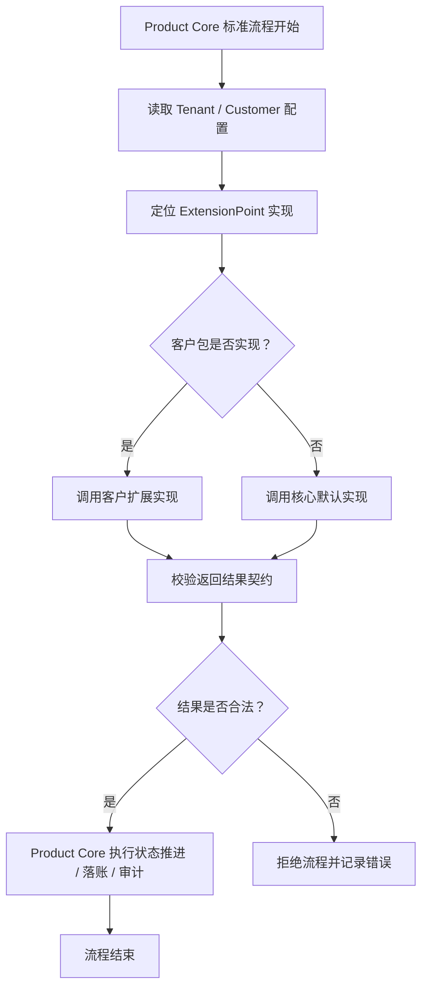

# ERP 客户扩展点设计规范：受控 Hook，而不是随意插代码

## 1. 结论

ERP 的客户扩展点，本质上可以理解为 **Hook 点**。

但是在产品化 ERP 中，不能把它设计成普通技术 Hook，而应该设计成：

> 被产品核心正式承认、受业务语义约束、可测试、可版本化、可治理的产品级扩展点。

也就是说：

```text
客户扩展点 = 受控 Hook + 业务语义 + 契约约束 + 默认实现 + 测试保障 + 版本治理
```

普通 Hook 关注的是：

> 核心代码运行到某个位置，允许外部代码插入逻辑。

ERP 客户扩展点关注的是：

> 产品核心明确声明：这里允许客户存在差异，但差异必须在核心业务模型允许的范围内实现。

---

## 2. 为什么不能直接叫 Hook

如果在 ERP 项目里直接大量使用 `beforeSave`、`afterUpdate`、`beforeSubmit` 这类 Hook，很容易让开发误解成：

> 客户代码可以在这里随便改数据、改状态、改流程、写库存、写财务、绕过权限。

这会导致几个严重问题：

1. 产品核心被客户逻辑打穿。
2. 状态机失控。
3. 数据追溯链路不可信。
4. 标准流程不可测试。
5. 客户包之间互相不可迁移。
6. 后续升级核心版本非常困难。
7. 项目退化成“每个客户一套定制代码”。

所以在代码和文档中，不建议强调 `Hook`，而建议使用这些命名：

```text
ExtensionPoint
Policy
Strategy
Rule
WorkflowConfig
TemplateConfig
FieldConfig
CustomerPackage
```

---

## 3. 普通 Hook 与 ERP 扩展点的区别

| 对比项  | 普通 Hook  | ERP 客户扩展点   |
| ---- | -------- | ----------- |
| 核心目的 | 插入代码     | 表达客户差异      |
| 语义   | 技术语义     | 业务语义        |
| 输入输出 | 可能不稳定    | 必须明确契约      |
| 副作用  | 容易失控     | 必须限制范围      |
| 默认实现 | 不一定有     | 必须有标准实现     |
| 测试方式 | 经常靠人工    | 必须有契约测试     |
| 版本治理 | 容易随代码变化  | 需要版本化       |
| 风险   | 容易破坏核心流程 | 只能影响允许变化的部分 |

---

## 4. 推荐总体架构

```text
Product Core
  ├── 标准主数据模型
  ├── 标准业务单据模型
  ├── 标准状态机
  ├── 标准权限模型
  ├── 标准业务事实
  ├── 标准页面与菜单
  ├── 标准导入导出
  ├── 标准测试用例
  └── Extension Points
        ├── 字段扩展点
        ├── 校验扩展点
        ├── 价格策略扩展点
        ├── 物料需求扩展点
        ├── 流程策略扩展点
        ├── 权限策略扩展点
        ├── 单据打印扩展点
        └── 外部系统集成扩展点

Industry Template
  └── 毛绒行业默认配置、默认流程、默认字段、默认规则

Customer Package A
  ├── 客户 A 配置
  ├── 客户 A 字段开关
  ├── 客户 A 流程配置
  ├── 客户 A 策略实现
  └── 客户 A 模板实现

Customer Package B
  ├── 客户 B 配置
  ├── 客户 B 字段开关
  ├── 客户 B 流程配置
  ├── 客户 B 策略实现
  └── 客户 B 模板实现
```

产品核心仍然应该承担 80% 到 90% 的标准业务能力。
客户差异只应该占 10% 到 20%，并且必须被限制在扩展点、配置包、规则包、模板包内。

---

## 5. 核心原则

### 5.1 配置优先，代码扩展最后

客户差异的处理优先级应该是：

```text
字段配置
  ↓
页面配置
  ↓
流程配置
  ↓
规则配置
  ↓
策略接口
  ↓
客户代码扩展
```

不要一遇到客户差异就写代码扩展。

能配置的不要写代码。
能通过规则表达的不要写策略类。
必须写策略类时，也要通过稳定接口接入。
最后才考虑真正的代码级扩展点。

---

### 5.2 扩展点必须有业务语义

不推荐：

```text
beforeSave(order)
afterSave(order)
beforeUpdate(order)
afterUpdate(order)
beforeSubmit(order)
afterSubmit(order)
```

推荐：

```text
OrderSubmitValidationPolicy.validate(order, actor) -> ValidationResult

PricingPolicy.calculatePrice(context) -> PriceResult

MaterialRequirementPolicy.calculate(order) -> RequirementResult

WorkflowActionPolicy.getAvailableActions(context) -> ActionList

ApprovalAssigneePolicy.resolveApprovers(context) -> ApproverList

DocumentRenderPolicy.render(context) -> DocumentFile
```

核心不是问客户包：

> 你要不要在保存前做点什么？

而是问客户包：

> 请根据当前订单上下文，返回价格结果。
> 请根据当前用户和单据状态，返回允许的流程动作。
> 请根据当前单据，返回审批人列表。
> 请根据当前订单，返回物料需求结果。

---

### 5.3 核心负责推进流程，扩展点只提供决策

错误方式：

```text
客户扩展点直接修改订单状态
客户扩展点直接写库存
客户扩展点直接生成财务应收
客户扩展点直接绕过审批
```

正确方式：

```text
扩展点返回判断结果
扩展点返回候选动作
扩展点返回计算结果
扩展点返回校验错误
扩展点返回审批人建议

然后由 Product Core 统一执行状态推进、库存写入、业务事实落账、审计记录。
```

也就是说：

> 客户扩展点可以参与决策，但不能随意接管核心业务闭环。

---

## 6. 推荐扩展点类型

### 6.1 字段扩展点

适用于不同客户字段不同的情况。

例如：

```text
客户 A 需要：客户款号、客户颜色、包装方式
客户 B 需要：外贸合同号、验厂编号、尾箱要求
```

建议做法：

```text
核心表保留稳定字段
客户字段进入扩展字段模型
页面通过字段配置展示
导入模板通过字段配置生成
字段校验通过配置或字段规则处理
```

不要因为某个客户不需要字段，就删除核心字段。
核心字段如果属于标准业务闭环，应该保留，只是在该客户页面中隐藏、默认、跳过或标记不适用。

---

### 6.2 校验扩展点

适用于不同客户在提交、审核、下单、出货前有不同校验规则。

示例：

```text
订单提交前校验
打样确认前校验
采购下单前校验
生产排期前校验
出货前校验
```

推荐接口：

```text
ValidationPolicy.validate(context) -> ValidationResult
```

返回结果应该是结构化的：

```text
是否通过
错误级别
错误字段
错误信息
是否允许强制通过
审计说明
```

不建议客户扩展点直接抛异常中断流程，除非是系统级错误。

---

### 6.3 价格策略扩展点

适用于不同客户有不同报价、折扣、税率、币种、阶梯价逻辑。

推荐接口：

```text
PricingPolicy.calculate(context) -> PriceResult
```

核心负责：

```text
保存价格结果
记录价格来源
记录计算过程摘要
控制是否允许人工改价
进入后续订单流程
```

客户包负责：

```text
根据客户规则计算价格
返回价格明细
返回折扣依据
返回税率和币种
```

---

### 6.4 物料需求扩展点

适用于毛绒行业中，不同客户对 BOM、损耗率、包装料、辅料、替代料的处理不同。

推荐接口：

```text
MaterialRequirementPolicy.calculate(context) -> RequirementResult
```

注意：

客户扩展点只能返回物料需求计算结果。
真正写入采购需求、库存占用、生产领料的动作，应该由 Product Core 统一完成。

---

### 6.5 流程扩展点

适用于客户流程多一步、少一步、角色合并、审批层级不同等情况。

不要把流程差异做成任意 Hook。
应该抽象成流程配置和动作策略。

示例：

```text
标准流程：
报价 -> 订单确认 -> 打样 -> 采购 -> 生产 -> 质检 -> 出货 -> 结案

客户 A：
报价 -> 订单确认 -> 采购 -> 生产 -> 出货 -> 结案

客户 B：
报价 -> 内部评审 -> 客户确认 -> 打样 -> 采购 -> 生产 -> 客检 -> 出货 -> 结案
```

推荐做法：

```text
状态机核心稳定
流程节点可以配置启用/停用
流程动作必须受状态机约束
缺失节点必须有跳过原因
新增节点必须定义输入、输出、责任人、完成条件
```

不能简单粗暴删除流程节点。
如果某客户少一环，应该表达为：

```text
该节点不适用
该节点自动通过
该节点合并到上一节点
该节点由同一角色完成
该节点被客户配置禁用
```

并且必须保证后续流程需要的数据仍然闭环。

---

### 6.6 权限与角色扩展点

不同客户可能角色不同：

```text
客户 A：业务员同时负责报价和跟单
客户 B：报价员、跟单员、生产计划员、采购员全部细分
客户 C：老板可以跨部门审批
```

推荐做法：

```text
核心定义权限点
客户包定义角色
角色绑定权限点
流程动作绑定权限点
审批策略决定具体责任人
```

不要把权限写死在代码里。

推荐结构：

```text
Permission Point:
  order.create
  order.submit
  order.approve
  order.price.adjust
  production.schedule
  shipment.confirm

Customer Role:
  sales
  merchandiser
  production_planner
  purchaser
  boss
```

客户角色可以合并，但权限点不能乱。
也就是说：

> 人可以身兼多职，但业务动作必须仍然可追溯。

---

### 6.7 单据模板扩展点

适用于不同客户打印单、报价单、采购单、出货单格式不同。

推荐做法：

```text
核心提供标准模板数据模型
客户包提供模板样式
核心负责生成、归档、审计
客户包只负责渲染差异
```

不要让客户模板直接查数据库。
模板应该只消费核心传入的 `TemplateContext`。

---

### 6.8 外部系统集成扩展点

适用于客户有财务系统、仓储系统、电商系统、OA 系统、MES 系统集成。

推荐接口：

```text
ExternalSyncPolicy.sync(context) -> SyncResult
```

注意：

外部系统同步不能直接影响核心事务完整性。
应该通过：

```text
Outbox
异步任务
重试机制
幂等键
同步状态
失败告警
```

来保证可靠性。

---

## 7. 扩展点调用方式

推荐核心调用方式：

```text
Product Core 执行标准流程
  ↓
读取当前客户配置
  ↓
定位客户包实现
  ↓
如果客户包有实现，调用客户实现
  ↓
如果客户包没有实现，调用默认实现
  ↓
校验扩展点返回值
  ↓
由 Product Core 执行核心状态变更和业务事实落账
```

示意：



---

## 8. 默认实现要求

每一个扩展点都必须有默认实现。

默认实现的作用：

1. 保证 Product Core 可以独立运行。
2. 保证标准流程可以独立测试。
3. 保证新客户未配置扩展点时不会崩溃。
4. 给客户包实现提供参考。
5. 防止核心页面变成空壳。

示例：

```text
PricingPolicy
  ├── DefaultPricingPolicy
  ├── CustomerAPricingPolicy
  └── CustomerBPricingPolicy
```

如果没有客户实现，则自动使用：

```text
DefaultPricingPolicy
```

禁止出现：

```text
核心页面必须依赖客户包才能运行
核心流程没有客户包就无法测试
核心业务逻辑全部散落在客户包
```

---

## 9. 核心页面如何测试

即使 Product Core 只调用扩展点，核心页面也不是没有实现。

核心页面应该使用：

```text
默认字段配置
默认流程配置
默认策略实现
默认模板实现
默认权限模型
标准测试租户
```

进行测试。

至少要有三类测试客户：

```text
standard-demo-customer
  使用全部默认实现，验证产品核心标准能力

minimal-customer
  关闭部分可选字段和可选流程，验证少流程场景是否闭环

custom-demo-customer
  覆盖部分策略实现，验证客户扩展点契约是否稳定
```

测试重点：

```text
核心页面能独立运行
默认实现能跑通完整业务链路
客户扩展实现不能破坏状态机
字段隐藏后导入、导出、详情、列表仍然一致
流程少一步后业务结果仍然闭环
角色合并后审计责任仍然清楚
```

---

## 10. 客户不需要某个字段怎么办

客户不需要某个字段，不等于可以破坏核心业务模型。

应该按字段性质处理。

### 10.1 核心必需字段

例如：

```text
订单号
客户
产品
数量
状态
创建人
创建时间
业务日期
```

这些字段不能删除。

客户不关心时，可以：

```text
页面隐藏
系统默认
导入时自动填充
后台只读
标记为不适用
```

但是不能从核心模型中移除。

---

### 10.2 行业常用字段

例如：

```text
客户款号
颜色
尺寸
包装方式
面料
辅料
损耗率
验货要求
```

这些字段可以通过行业模板启用。

客户不需要时：

```text
字段隐藏
导入模板不出现
校验规则关闭
打印模板不展示
```

但历史数据仍然要能保存和查看。

---

### 10.3 客户专属字段

例如：

```text
某客户内部编码
某客户验厂编号
某客户特殊标签要求
某客户外部系统 ID
```

这些字段应该进入客户扩展字段，不要污染 Product Core 主表。

---

## 11. 客户流程少一环怎么办

客户流程少一环，不代表可以直接删除核心闭环。

要先判断这个环节在标准流程中的作用：

```text
它是否产生后续流程必需的数据？
它是否承担审批责任？
它是否产生业务事实？
它是否影响库存、采购、生产、出货、财务？
它是否需要审计追溯？
```

如果只是管理动作，可以配置为跳过。
如果会产生后续必需数据，就必须提供替代来源。

推荐表达方式：

```text
节点禁用
节点自动通过
节点合并到上一节点
节点合并到下一节点
节点由系统默认完成
节点由同一角色兼任完成
```

禁止：

```text
直接删除节点
直接绕过状态机
直接跳到后续状态
后续数据缺失但流程继续走
```

---

## 12. 客户流程多一环怎么办

客户流程多一环时，不能随便插入任意状态。

必须定义清楚：

```text
新增节点名称
新增节点位置
进入条件
完成条件
责任角色
允许动作
是否阻塞后续流程
是否产生业务事实
是否需要审计
失败或退回规则
```

例如客户 B 需要增加“内部评审”：

```text
报价 -> 内部评审 -> 客户确认 -> 打样
```

则必须定义：

```text
内部评审由谁处理
评审通过后进入哪个状态
评审不通过退回哪里
评审意见是否归档
是否影响报价版本
是否影响客户确认
```

---

## 13. 客户角色身兼多职怎么办

角色身兼多职是允许的。
但是业务动作和责任不能混乱。

例如：

```text
客户 A：
业务员同时负责报价、跟单、客户确认

客户 B：
报价员、跟单员、审核员分开
```

正确做法：

```text
权限点不变
流程动作不变
审计记录不变
只是角色到权限点的绑定不同
```

也就是说：

```text
同一个人可以拥有多个角色
同一个角色可以拥有多个权限点
同一个流程节点可以配置不同责任角色
```

但系统仍然要记录：

```text
谁执行了动作
以什么角色执行
执行前状态是什么
执行后状态是什么
执行时间是什么
执行原因是什么
```

---

## 14. 扩展点允许做什么，不允许做什么

### 14.1 允许做

```text
返回校验结果
返回价格计算结果
返回物料需求计算结果
返回可选流程动作
返回审批人列表
返回字段展示配置
返回模板渲染结果
返回外部系统同步请求
```

### 14.2 不允许做

```text
直接修改核心状态
直接写库存事实
直接写财务事实
直接删除核心数据
直接绕过权限校验
直接跳过审计
直接修改其他客户数据
直接依赖页面临时字段
直接访问不属于当前租户的数据
```

原则：

> 扩展点可以给答案，但最终动作必须由 Product Core 执行。

---

## 15. 扩展点契约规范

每个扩展点都必须有契约文档。

至少包括：

```text
扩展点名称
业务语义
调用时机
输入参数
输出结果
允许副作用
禁止副作用
默认实现
错误处理
审计要求
版本号
测试用例
```

示例：

```text
扩展点名称：
PricingPolicy.calculate

业务语义：
计算销售订单报价结果。

调用时机：
订单创建、订单修改、报价刷新、订单提交前。

输入：
客户、产品、数量、币种、交期、物料成本、客户配置。

输出：
价格、币种、税率、折扣、价格明细、计算说明。

允许副作用：
无。只能返回计算结果。

禁止副作用：
不得修改订单状态。
不得写库存。
不得写财务。
不得直接保存订单。
不得跨租户读取数据。

默认实现：
DefaultPricingPolicy。

测试要求：
标准价格测试。
折扣价格测试。
异常输入测试。
客户覆盖实现测试。
契约兼容测试。
```

---

## 16. 扩展点版本治理

扩展点接口一旦被客户包使用，就不能随便改。

推荐版本方式：

```text
PricingPolicyV1
PricingPolicyV2
WorkflowPolicyV1
WorkflowPolicyV2
```

升级原则：

```text
新增字段优先保持兼容
删除字段必须发新版本
改变语义必须发新版本
改变返回结构必须发新版本
客户包必须声明兼容的扩展点版本
```

客户包声明示例：

```text
customer: yongshen
compatibleCoreVersion: 1.3.x
extensionPoints:
  PricingPolicy: v1
  MaterialRequirementPolicy: v1
  WorkflowActionPolicy: v2
```

---

## 17. 推荐目录结构

```text
server/
  internal/
    core/
      order/
      product/
      material/
      workflow/
      permission/
      document/

    extension/
      contract/
        pricing_policy.go
        validation_policy.go
        workflow_policy.go
        material_requirement_policy.go
        document_render_policy.go

      defaultimpl/
        default_pricing_policy.go
        default_validation_policy.go
        default_workflow_policy.go
        default_material_requirement_policy.go

      registry/
        extension_registry.go

    customer/
      yongshen/
        config/
        policies/
        templates/
        imports/

      demo_standard/
        config/
        policies/
        templates/

      demo_minimal/
        config/
        policies/
        templates/
```

前端可以类似：

```text
web/
  src/
    core/
      pages/
      components/
      permissions/
      workflow/

    extension/
      fieldConfig/
      menuConfig/
      pageConfig/
      templateConfig/

    customers/
      yongshen/
        fieldConfig/
        pageConfig/
        templates/
```

---

## 18. 反模式清单

以下情况要避免：

```text
到处都是 beforeSave / afterSave
客户包直接改核心数据库表
客户包直接控制状态流转
客户包直接写库存、财务、业务事实
核心页面没有默认实现
没有客户包就跑不通产品
每个客户复制一份页面再改
每个客户复制一份后端接口再改
字段差异直接改主表结构
流程差异直接 if customer == xxx
权限差异写死在代码里
打印模板直接查数据库
外部系统同步影响核心事务提交
扩展点没有契约测试
扩展点接口随便改
```

特别禁止：

```text
if customer == "A" {
    // 客户 A 特殊逻辑
}

if customer == "B" {
    // 客户 B 特殊逻辑
}
```

这类代码短期快，长期会把产品核心变成定制项目集合。

---

## 19. 推荐判断标准

遇到客户差异时，先问下面几个问题：

```text
这个差异是不是多个客户都可能不同？
这个差异是否属于核心业务闭环？
这个差异能不能通过配置解决？
这个差异能不能通过规则解决？
这个差异是否需要代码策略？
这个差异是否会影响状态机？
这个差异是否会影响库存、财务、追溯？
这个差异是否能定义清楚输入输出？
这个差异是否能提供默认实现？
这个差异是否能做契约测试？
```

如果不能定义清楚输入输出，不要开扩展点。
如果会破坏核心闭环，不要交给客户包直接处理。
如果只是显示差异，优先做字段配置和页面配置。
如果是流程差异，优先做流程配置和状态机约束。
如果是计算差异，再做策略接口。

---

## 20. 项目落地建议

### 20.1 第一阶段先固定核心模型

先明确：

```text
主数据模型
单据模型
状态机
业务事实
权限点
审计模型
导入导出模型
```

核心模型稳定后，再设计扩展点。

不要一开始就为了适配所有客户，把核心做成空壳。

---

### 20.2 第二阶段建立默认客户

至少准备：

```text
标准客户 demo_standard
最小客户 demo_minimal
当前参考客户 yongshen
```

用途：

```text
demo_standard 验证产品核心完整性
demo_minimal 验证字段少、流程少时仍然闭环
yongshen 验证真实客户差异
```

---

### 20.3 第三阶段再沉淀扩展点

不要预设大量扩展点。
应该从真实差异中沉淀。

推荐方式：

```text
先做核心标准实现
再对永绅客户差异分类
能配置的进入配置
能规则化的进入规则
确实无法配置的沉淀为策略接口
最后才形成正式扩展点契约
```

---

## 21. 最终原则

可以把 ERP 客户扩展点理解为 Hook，但实现时必须遵守以下原则：

```text
不是技术 Hook，而是业务语义扩展点。
不是随便插代码，而是受控策略接口。
不是客户代码接管核心，而是客户包返回决策结果。
不是每个客户复制一套，而是 Product Core + Customer Package。
不是破坏核心模型，而是在核心允许的边界内表达差异。
```

最终目标：

```text
Product Core 保持稳定、可测试、可升级。
Industry Template 提供行业默认能力。
Customer Package 表达客户差异。
Extension Point 控制差异边界。
Deployment Package 完成交付隔离。
```

一句话总结：

> ERP 客户扩展点可以看作受控 Hook，但不能做成普通 Hook；它必须是有业务语义、有默认实现、有契约测试、有版本治理、有边界限制的产品级扩展点。
