# 多甲方角色能力、模块组合、业务流程与协同编排设计（效率优先完备版）

版本：2026-06-27  
适用项目：`plush-toy-erp`  
文档性质：架构约束、实现参考、客户差异治理、测试部署基线与客户配置包导入规范  
替代文档：`多甲方角色能力模块组合流程编排设计-效率优先完备版-20260626.md`

> 目标不是做一套“万能低代码或动态插件平台”，而是采用静态模块化单体、部署时模块组合、运行时严格门禁，以及有限、稳定、能测试的角色与流程配置，让同一套产品核心适配多个甲方的模块、岗位、流程和字段差异，同时不允许客户配置破坏库存、质检、出货、财务和审计等业务底线。

---

## 0. 本轮复查结论：方向正确，但必须加上“效率优先”的硬约束

上一版设计的总体方向是对的：

```text
客户差异不能靠 fork 代码解决；
岗位差异不能靠复制流程解决；
模块差异不能靠动态插件解决；
流程差异不能靠前端自行串任务解决。
```

但上一版还缺一个很重要的约束：**ERP 最大价值不是让所有事都走流程，而是让正常业务更快、更准，让异常业务有迹可循。**

因此本版新增一条最高原则：

```text
业务事实优先，协同流程只服务提效和控风险。
凡是系统可以自动判断、自动推进、自动生成待办的，不让人手工点流程。
凡是没有跨岗位交接、风险放行、异常责任或审计价值的，不建流程节点。
凡是只是页面展示差异的，不进入流程配置。
```

### 0.1 是否过于复杂

当前设计中**必须保留**的复杂度：

| 设计 | 是否保留 | 原因 |
| --- | --- | --- |
| 能力 capability | 保留 | 菜单权限太粗，无法控制“可看、可改、可审批、可过账、可放行” |
| 数据范围 entitlement | 保留 | 同一个角色在不同客户、仓库、订单范围下权限不同，不做会越权 |
| 责任池 work pool | 保留 | A 客户包材检查归业务，B 客户归品质；流程节点不能写死角色 |
| 配置 revision | 保留 | 流程和权限改了以后，在途单据必须知道自己按哪版规则运行 |
| 流程实例 / 节点实例 / 任务实例 | 保留，但窄版 | 只靠一个 `business_status_key` 无法表达并行采购、质量、库存、财务状态 |
| 审计 append-only | 保留 | 多甲方交付、责任追溯、越权排查、事故恢复都依赖它 |
| 受控模块组合 | 保留 | 不同甲方模块组合不同，但不能搞动态插件市场 |

当前设计中**不能做**或要继续压住的复杂度：

| 不做 | 原因 | 替代方案 |
| --- | --- | --- |
| 通用 BPMN 设计器 | 实施成本、测试成本、客户误操作风险过高 | 受限流程 DSL + 白名单节点 |
| 低代码表单平台 | 字段校验、联动、权限、审计会爆炸 | 编码页面 + 字段策略 |
| 动态插件、上传 JS/SQL | 安全和升级不可控 | 静态模块 + 命名策略扩展点 |
| 运行时热插拔模块 | 在途流程、数据库、权限、菜单和报表会失控 | 部署时启用/只读/关闭 |
| 每个客户复制一套流程代码 | 第二、第三客户后不可维护 | 流程族 + 受控变体 |
| 每个岗位一个移动应用 | 角色一多直接爆炸 | 一个移动任务工作台 + 角色视图 |
| 自由 deep merge 配置 | 很难解释最终配置来源 | 显式 overlay + 编译后有效配置 |
| 每个字段都可客户自定义 | 会变成低代码 ERP | 只允许已登记字段显隐、必填、只读、标签和分组 |

结论：**上一版不是过度设计，真正危险的是如果没有这些边界，项目会退回“客户定制 + 前端串流程 + 角色硬编码”。但实现时必须做窄，不要一次实现完整平台。**

### 0.2 是否过于简单

不能退化成下面这些“看起来简单，后面一定失控”的方案：

| 过于简单的做法 | 后果 |
| --- | --- |
| 只用菜单权限控制角色 | 用户能进页面后仍可能改不该改的字段、状态和事实 |
| 流程节点直接绑定角色 key | A/B 甲方岗位差异会导致复制流程或改核心代码 |
| 一个单据只存一个状态字段 | 并行采购、质检、库存、出货、财务会互相覆盖 |
| 前端创建下游任务 | 不同前端版本导致流程不同，审计和幂等不可控 |
| 客户配置直接 deep merge | 很难知道最终权限来自哪里，排错困难 |
| 只在 UI 隐藏字段 | API 仍可提交隐藏字段，安全边界无效 |
| 不存配置 revision | 在途单据按新旧规则混跑，后续无法解释 |
| 不做 append-only 审计 | 出问题后无法证明谁在什么时候按什么权限做了什么 |

结论：**不能再简化到“菜单 + 角色 + 状态字符串”。最小可维护模型至少要有能力、责任池、流程定义、流程实例、任务实例、审计和配置版本。**

### 0.3 提效优先规则

ERP 的流程设计必须遵守下面 12 条规则：

| 规则 | 说明 |
| --- | --- |
| 1. 正常路径自动走 | 订单提交后自动生成下一责任池任务；入库过账后自动触发待检或财务线索；不要让人手工选下一步 |
| 2. 异常才拉长流程 | 合格、无差异、无超期时少审批；不合格、差异、超额、超期时进入异常闭环 |
| 3. 审批是稀缺资源 | 老板/财务/质量放行只放在高风险节点，不要每步都审批 |
| 4. 一线只看自己的待办 | 移动端默认只展示“今天该我做什么、扫什么、填什么、异常什么” |
| 5. 表单只收必要字段 | 能从来源单据、BOM、SKU、供应商、客户带出的字段不要让人重复填 |
| 6. 能校验就前置校验 | 提交前显示缺客户、缺 BOM、缺库存、缺质检、缺财务放行，不要到最后才失败 |
| 7. 任务不替代事实 | 完成任务不等于出库、入库、质检、应收；事实必须走领域 usecase |
| 8. 状态由命令推进 | 用户提交业务命令，后端根据状态机推进；不要让用户直接改状态字段 |
| 9. 看板是投影不是主表 | 看板服务效率，但不能成为真实业务来源 |
| 10. 批量导入必须 dry-run | 先报错、匹配和预览，再提交；导入不能绕过权限和领域规则 |
| 11. 催办要少而准 | 超时、关键路径、阻塞才催办；不要把催办变成噪音 |
| 12. 配置要能解释 | 一个页面为什么看得见、字段为什么只读、任务为什么分给他，系统要能解释 |

### 0.4 最终收敛模型

建议实现模型进一步收敛成：

```text
事实命令 Command
  -> 后端校验权限、状态、数据范围和幂等
  -> 写领域事实
  -> 写审计事件
  -> 自动推进流程实例/节点/任务
  -> 更新看板投影

人工任务 Task
  -> 只处理跨岗位交接、审批、异常、补资料、确认、放行
  -> 完成任务时仍调用领域命令或流程动作
  -> 不直接伪造库存、质检、出货、财务事实
```

图示：

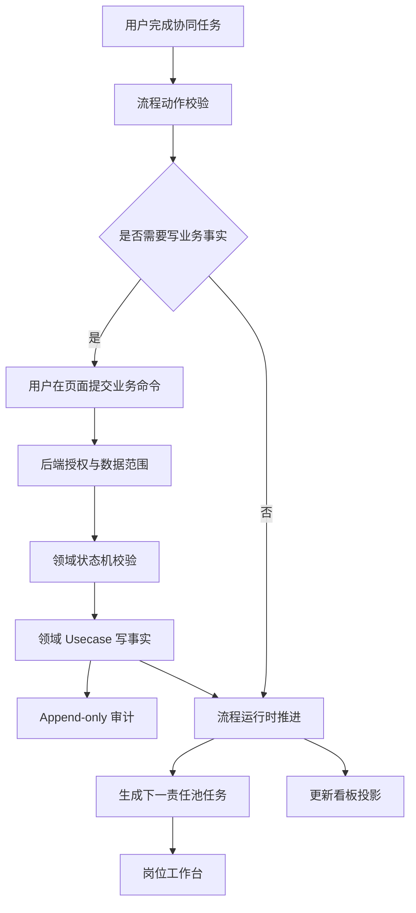

### 0.5 实施时要避免的“审批地狱”

不要把流程设计成这样：

```text
业务录单 -> PMC 审 -> 老板审 -> 工程审 -> PMC 审 -> 采购审 -> 仓库审 -> 品质审 -> 财务审 -> 老板审
```

这会让 ERP 变成障碍。正确做法：

```text
业务录单
  -> 系统自动校验客户/BOM/交期/库存风险
  -> 有风险才审批/确认
  -> 无风险自动进入下一责任池
  -> 异常时进入阻塞/退回/让步接收/升级
```

### 0.6 本版新增内容

本版在上一版基础上补齐：

```text
1. 提效原则和不过度设计检查；
2. 不过度简单检查；
3. 目录总图和每个目录存在的原因、作用、不能放什么；
4. 核心领域设计与边界；
5. 每个角色的菜单、字段、可处理状态、业务流程、协同流程、能力；
6. 永绅角色状态/动作矩阵；
7. SQL/Ent 落地设计草案；
8. 审计设计；
9. 实现过程重点版；
10. 容易被忽略但会导致项目不可控的问题清单。
```

---

## 1. 最终结论

项目应采用下面这套模型：

```text
有效客户产品
  = 产品核心内核
  + 本产品版本内可用的业务模块
  + 毛绒行业模板
  + 客户启用/只读/关闭的模块组合
  + 客户角色、责任池、流程变体和页面字段配置

用户
  -> 可拥有多个客户角色

客户角色
  = 若干能力包
  + 本角色额外能力 grants
  - 本角色撤销能力 revokes
  + 与能力绑定的数据范围 entitlement scopes
  + 责任池成员关系
  + 页面/字段展示策略

流程节点
  -> 只能引用已启用模块提供的命令、能力和表单
  -> 绑定稳定责任池 owner_pool_key
  -> 要求明确能力 required_capability
  -> 调用白名单业务命令 command_key
  -> 使用固定表单配置 form_profile_key

甲方差异
  -> 整个业务域是否需要：模块组合
  -> 同一工作由谁负责：角色与责任池映射
  -> 节点先后、可选审批和并行差异：批准的流程变体
  -> 页面和字段差异：表单与 UI 配置
  -> 不通过修改核心状态机、动态加载客户代码、前端自行串任务、客户分支或任意脚本实现
```

最重要的六条边界：

1. **流程不直接绑定客户角色，绑定责任池。** 角色回答“这个客户有哪些岗位”，责任池回答“这件事由哪类责任承担”。
2. **能力和数据范围必须成对授权。** 不能先把多个角色的能力求并集，再把多个角色的数据范围求并集，否则会发生跨角色拼接越权。
3. **后端是业务事实、流程推进和授权判断的唯一真源。** 前端只能发出命名明确的业务命令或任务动作，不能任意创建下游任务、指定责任角色或写协同状态。
4. **模块可插拔只表示“受控模块组合”，不表示运行时热插拔。** 模块随产品版本静态编译，客户只选择启用、只读或关闭；禁止上传 Go 插件、远程 JavaScript、客户自定义 SQL 和独立插件市场。
5. **角色差异、流程差异和模块差异必须使用不同机制。** 角色不同用责任池，步骤不同用流程变体，整个业务域不存在才关闭模块；不能为每个角色或每条流程复制一个模块。
6. **先做受限编排器，不做通用 BPMN、低代码表单、规则脚本平台。** 只支持项目真实需要的少量节点、分支、并行、回退和 SLA。

整体分层如下：

```mermaid
flowchart TD
  KERNEL[产品核心内核\n认证/授权/审计/配置/流程运行时/模块注册表]
  KERNEL --> MODS[静态业务模块集合\n主数据/销售/工程/采购/质量/库存/委外/生产/出货/业务财务]
  MODS --> IND[毛绒行业模板\n默认模块组合/角色/责任池/流程族/表单策略]
  IND --> A[甲方 A 配置包]
  IND --> B[甲方 B 配置包]
  IND --> Y[永绅配置包]

  A --> CA[编译后的有效清单 A\n模块+角色+流程+UI]
  B --> CB[编译后的有效清单 B\n模块+角色+流程+UI]
  Y --> CY[编译后的有效清单 永绅\n模块+角色+流程+UI]

  CA --> DA[甲方 A 独立部署/独立数据库]
  CB --> DB[甲方 B 独立部署/独立数据库]
  CY --> DY[永绅独立部署/独立数据库]
```

现阶段产品形态仍应是：

```text
一套产品版本（包含受控业务模块）+ 多个客户有效配置 + 每个客户独立私有化部署
```

暂时不要引入 `tenant_id`、共享数据库、多租户计费和 SaaS 运行时。

---

## 2. 本轮 Codex Review 与源码包复核后的处理结论

本轮把外部 review 截图里的意见和当前源码包重新核对后，结论分三类：

```text
可以采纳：Workflow / RBAC 边界、engineering 最小闭环、SQL/Ent 表述方式需要收敛。
需要修正：构建 overlay 脚本问题不能在文档中写成“已修复”或“已不存在”，必须以当前源码包 QA 结果为准。
继续坚持：效率优先、静态模块组合、客户配置包、责任池、capability + scope、Workflow / Fact 分离。
```

### 2.1 构建 overlay 脚本问题：不要写成架构阻塞，但必须纳入源码包自洽门禁

当前源码包中，以下文件仍引用：

```text
scripts/build/apply-customer-web-config.mjs
```

主要引用点包括：

```text
web/Dockerfile
server/Dockerfile
scripts/README.md
scripts/qa/customer-config-boundaries.mjs
```

但当前源码包没有 `scripts/build/apply-customer-web-config.mjs`，并且运行：

```text
node scripts/qa/customer-config-boundaries.mjs
```

会因为：

```text
customer web config overlay script must exist
```

失败。

因此本问题的结论不是“方案里把已修复问题写成 P0”，而是：

```text
文档不能把该问题作为长期架构设计的一部分；
但本轮源码包交付前，必须让源码包、Dockerfile 和 QA 对同一事实达成一致。
```

处理二选一：

```text
方案 A：恢复 scripts/build/apply-customer-web-config.mjs，并让 node --check / customer-config-boundaries / Docker build 引用检查全部通过；
方案 B：移除所有构建期 overlay 引用，改成后端 effective config + 前端运行时读取客户配置。
```

建议短期选择方案 A，因为当前 Dockerfile 和 QA 已经围绕它设计；中期再把业务、安全、流程配置全部收回后端 effective manifest，只保留品牌静态资源 overlay。

边界：

```text
overlay 脚本只能处理 favicon、logo、静态 customer-config.js 这类展示资源；
不能处理 RBAC、流程、能力、模块启停、状态机和业务规则；
客户配置真源必须在后端配置编译和发布链路中。
```

### 2.2 Workflow 普通入口风险属实，优先级高于“模块平台”

当前普通 JSON-RPC 仍暴露：

```text
create_task
upsert_business_state
update_task_status
```

而且前端仍有 `workflowApi.mjs` 和移动端/场景脚本调用这些通用入口。

风险是：

```text
前端可以创建下游任务；
前端可以传 owner_role_key / actor_role_key / business_status_key；
流程差异散落在前端；
任务状态和业务事实可能被混用；
重复点击、重试或不同版本前端可能制造重复任务或错误状态。
```

这条必须优先拆，不要等到完整模块平台做完。

第一阶段最小改法：

```text
普通 UI 只允许调用：list_my_tasks、claim_task、complete_task_action、execute_domain_command；
create_task / upsert_business_state 降为后端内部接口或 admin repair 接口；
actor_role_key 永远由服务端根据本次命中的 entitlement 推导；
下游任务由后端流程运行时根据领域事件生成；
前端不能传下一责任角色、下一节点和业务状态字符串。
```

### 2.3 SQL / Ent 设计必须收敛为 Ent + Atlas 评审输入，不写成直接执行 SQL 清单

上一版第 17A 节直接列了 `CREATE TABLE / ALTER TABLE` 草案。这对讨论有帮助，但容易被误解为“实施时直接落库”。

项目规范应改成：

```text
真正落地入口：Ent schema + Atlas migration；
每轮只做一个可验证闭环；
手写 SQL 只作为说明对象、字段、索引和约束的设计参考，不作为执行脚本；
实施任务必须拆成 schema、migration、repo/usecase、RBAC、流程运行时、测试和部署验证。
```

因此新版第 17A 节改成“Ent / Atlas 落地设计”，不再提供可复制执行的 SQL。

### 2.4 engineering 角色问题属实，但第一步只补最小闭环，不直接扩成完整角色平台

当前存在：

```text
EngineeringRoleKey = "engineering"
```

但内置角色、移动端权限和账号分配链路并没有完整支持 engineering。工作流如果派生工程任务，管理员可能无法可靠分配工程岗位。

第一阶段只做最小闭环：

```text
工程任务可分配；
工程角色可创建/同步/绑定账号；
工程角色可看到工程资料和自己的任务；
工程角色具备 product / sku / bom / process / engineering document 的必要能力；
移动端先走通用任务工作台或兼容入口，不急着做独立工程 App。
```

不要在同一轮顺手实现完整 role profile / entitlement 平台。正确顺序是：

```text
先补 engineering 最小可用；
再把 BuiltinRoles 白名单改成 effective role profiles；
再做 entitlement + scope；
最后再逐步迁移所有角色。
```

### 2.5 `BuiltinRoles()` 不能继续作为客户角色合法性的唯一来源

当前账号保存角色时会走 `NormalizeAdminRoleKeys()`，它只接受 `BuiltinRoles()`，这会把客户自定义角色过滤掉。

目标：

```text
账号可分配角色 = 当前 active config revision 中存在、已同步、未禁用的 role_profiles。
```

`BuiltinRoles()` 只能作为：

```text
开发默认种子；
demo 初始角色；
迁移兼容清单；
不是多甲方长期合法性边界。
```

### 2.6 当前 P0 不做“大平台”，只做边界修复

本轮之后，P0 必须收敛为以下事情：

```text
1. 源码包构建和 QA 自洽；
2. Workflow 普通入口收口；
3. actor role 服务端推导；
4. workflow 查询加指派人 / 责任池 / 数据范围过滤；
5. engineering 最小可用；
6. 自定义角色不再被 BuiltinRoles 过滤；
7. SQL 草案改为 Ent / Atlas 评审输入；
8. 客户配置包导入、测试和部署纳入标准门禁。
```

暂时不要在 P0 里做：

```text
完整 BPMN；
在线流程设计器；
低代码表单；
动态插件；
SaaS 多租户；
完整模块独立发布；
一次性重构全部 biz/data/service 目录。
```


## 3. 复杂度预算：明确现在不做什么

为了避免项目变成另一个难维护的平台，第一阶段必须主动拒绝以下设计。

| 暂时不做 | 原因 | 现在的替代方案 |
| --- | --- | --- |
| 通用 BPMN 2.0 引擎 | 节点、事件、补偿、部署语义过重 | 只实现 6 类节点和受控分支 |
| 在线拖拽流程设计器 | 配置治理、版本迁移、权限风险过高 | 流程定义进 Git，编译、测试、发布 |
| 任意 JavaScript/SQL/表达式脚本 | 安全、调试和升级不可控 | 只允许命名策略和白名单命令处理器 |
| 低代码动态页面/表单引擎 | 前后端校验、交互和测试复杂度爆炸 | React 编码页面 + 现有字段的受控覆盖 |
| EAV/任意客户自定义字段 | 查询、类型、报表和迁移长期失控 | 新字段进入领域评审，使用明确类型和迁移 |
| 每个甲方 fork 分支 | 无法统一升级和修漏洞 | 同一核心版本 + 客户配置包 |
| 每个岗位一个移动端构建 | 客户岗位变化会导致应用数量爆炸 | 一个移动任务工作台 |
| 一个 50 节点超级流程 | 任一环节变化会影响全链，难并行和恢复 | 6 个流程族，通过业务引用关联 |
| 通用插件市场、运行时 Go 插件或远程 JS | 接口、安全、升级、供应链和排障不可控 | 静态模块化单体 + 部署时启用 + 白名单扩展点 |
| 完整组织树/排班/最少负载分配 | 当前客户数和人员规模不值得 | 责任池领取、直接指派、来源负责人、仓库范围 |
| 完整事件溯源 | 读写模型和迁移成本过高 | 领域表为真源 + 追加审计/流程事件 |
| Kafka/复杂分布式事件总线 | 当前是单体私有部署，收益不足 | 同库事务 + 必要的 outbox |
| SaaS 多租户 | 现在会把权限、数据隔离、计费一起拖进来 | 每甲方独立部署和数据库 |
| 任意客户修改领域状态机 | 会破坏库存、财务和审计一致性 | 客户只选批准的策略变体 |
| 模块独立发布、独立版本和独立数据库迁移链 | 当前团队规模会立刻产生兼容矩阵 | 所有模块随同一产品版本发布，使用一个迁移序列 |
| 按客户条件执行不同表结构迁移 | 回滚、升级和支持成本过高 | 所有产品表结构统一迁移；关闭模块只关闭行为，不删表和历史数据 |
| 每个页面、岗位或流程节点一个模块 | 模块数量和依赖会爆炸 | 模块只代表有独立业务事实与状态机的业务域 |

第一版允许的编排能力只有：

```text
节点：start / human_task / approval / domain_command / wait_event / end
路由：顺序 / 命名条件分支 / 并行 fan-out / all 或 any 汇合
回退：显式 returnTo + 有上限的 attempt
时间：due_at + 提醒 + 升级
```

只要需求超出这个范围，先判断能否用业务命令、责任池或已有流程族解决；不要马上扩充引擎。

---


## 4. 受控模块可组合 / 可插拔设计

### 4.1 是否需要模块可插拔

需要，但应把它准确称为：

```text
受控模块组合
= 静态模块化单体
+ 产品版本内固定模块代码
+ 客户部署时选择模块状态
+ 运行时由后端模块门禁强制执行
```

不要把它做成：

```text
客户上传插件
运行时加载 .so
远程加载 JavaScript / React
客户自己写 SQL、脚本或状态机
每个模块独立发布和独立升级
```

原因很简单：项目当前是私有化单体 ERP，真正需要解决的是“某客户有没有生产、委外、业务财务等业务域”，而不是建设一个插件市场。静态模块化单体可以保留清晰边界，又不会引入分布式部署、动态代码安全和版本兼容矩阵。

### 4.2 先判断差异属于哪一类

模块不能成为解决所有客户差异的万能开关。每个差异先按下表判断：

| 甲方差异 | 正确机制 | 不应采用 |
| --- | --- | --- |
| 同一个工作由业务做，另一个客户由品质做 | 责任池到角色映射 | 复制一套模块或流程代码 |
| 同一角色比另一个客户多一个动作 | 角色 grants/revokes + entitlement scope | 新建“客户专属角色模块” |
| 某客户多一道审批或少一道非强制协同步骤 | 已批准的流程 variant / optional slot | 任意修改流程图或前端 if/else |
| 字段显示、必填、只读、名称不同 | form profile / field policy | 动态表结构或复制页面 |
| 金额阈值、是否需要财务放行等有限规则不同 | 命名 policy 及受控参数 | 自由表达式、JS 或 SQL |
| 客户完全没有委外业务 | 关闭 `outsourcing` 模块 | 在每个页面和接口散落判断 |
| 客户完全不使用生产管理，只管理采购和库存 | 关闭或只读 `production` 模块 | 删除数据库表或 fork 代码 |
| 客户要接第三方财务、短信或打印设备 | integration adapter | 把外部 SDK 写入领域核心 |
| 客户提出新的独立业务对象、状态机和业务事实 | 产品评审后新增业务模块 | 直接放进客户配置包执行代码 |

判断顺序必须是：

```text
字段配置
-> 角色/责任池
-> 命名策略
-> 流程变体
-> 集成适配器
-> 业务模块
-> 极少数产品化代码扩展
```

越靠后成本越高，不能一有差异就创建模块。

### 4.3 模块分为四类

#### A. 平台内核：始终启用

```text
identity_access      用户、角色、授权项和数据范围
configuration        客户有效配置、revision、编译和发布
module_runtime       模块注册、依赖校验和启用门禁
process_runtime      流程实例、节点实例、任务和编排
business_audit       业务审计、授权解释和操作留痕
outbox_event         同库事件与外部副作用投递
```

平台内核不能被客户关闭，也不包含永绅岗位或毛绒业务规则。

#### B. 业务模块：按客户组合

| module key | 主要业务真源 | 典型页面 | 典型流程族 | 是否允许客户关闭 |
| --- | --- | --- | --- | --- |
| `masterdata` | 客户、供应商、产品、SKU、材料、单位、仓库 | P02-P05 | 各流程引用基础资料 | 毛绒模板建议必选 |
| `sales` | 销售订单及订单版本 | P06 | `sales_order_acceptance` | 可选，但销售型 ERP 通常启用 |
| `engineering` | BOM、加工环节、工程资料版本 | P04/P07 | `engineering_release` | 可选 |
| `procurement` | 采购订单、采购执行事实 | P08 | `material_supply` 采购分支 | 可选 |
| `quality` | 质检单、判定、缺陷和批次质量状态 | P10 | 来料/过程/成品质检 | 可选，但不能伪造“已质检” |
| `inventory` | 收发存流水、余额、预留、批次、仓库操作 | P09/P11、P14 出库部分 | 入库、备料、成品入库、出库 | 有库存业务时必选 |
| `outsourcing` | 委外订单、发料、回货、返工事实 | P12 | 生产执行外发分支 | 可选 |
| `production` | 生产计划、报工、完工、返工事实 | P13 | `production_execution` | 可选 |
| `shipping` | 出货单、放行事实、实际出货和冲正 | P14 | `finished_goods_delivery` | 可选 |
| `finance_ops` | 应收、应付、发票、收付款和对账业务事实 | P15 | `financial_settlement` | 可选；不是完整总账 |
| `document_ops` | 打印模板、导入导出作业和生成记录 | P16 | 通常不独立驱动业务流程 | 可选支持模块 |

模块边界按“谁拥有业务事实和状态机”划分，不按菜单、页面或角色划分。一个模块可以贡献多个页面，一个页面也可以读取多个模块的投影，但任何业务事实只能有一个写入所有者。

#### C. 集成适配器：按部署启用

```text
sms_adapter
email_adapter
webhook_adapter
object_storage_adapter
printer_adapter
accounting_export_adapter
```

适配器只能实现稳定端口，不决定业务状态。短信发送失败不能回滚已经合法完成的库存过账；应使用 outbox、重试和告警。

#### D. 客户配置包：不是代码模块

客户包只引用产品已登记的 module、capability、process、page、field、policy 和 adapter key。客户包不能携带可执行 Go/JavaScript/SQL，也不能声明新的数据库表。

### 4.4 模块、角色、责任池和流程之间的关系

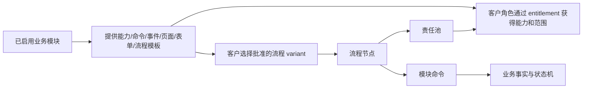

必须保持以下边界：

1. 模块提供“能做什么”，不定义永绅哪个岗位去做。
2. 角色获得“某范围内能做什么”，不拥有整条流程。
3. 责任池定义“当前节点由哪类责任承担”，不自动授予能力。
4. 流程只编排已启用模块的白名单命令，不直接写任何模块的数据表。
5. 同一个角色可以跨多个模块获得能力，例如永绅财务可以拥有有限采购录单能力，但不会因此拥有整个采购模块。
6. 模块关闭后，相关能力、页面和新流程节点都不可用；已有历史数据仍然保留。

### 4.5 模块清单 Manifest

每个业务模块必须有稳定 manifest。第一版建议至少包含：

```yaml
moduleKey: shipping
contractVersion: 1
maturity: pilot
hardDependencies:
  - masterdata
  - sales
  - inventory
optionalIntegrations:
  - quality
  - finance_ops
owns:
  entities:
    - shipment
    - shipment_line
  statusMachines:
    - shipment_status
provides:
  capabilities:
    - shipment.read
    - shipment.prepare
    - shipment.finance_release
    - shipment.ship
    - shipment.reverse
  commands:
    - shipping.create_draft
    - shipping.preconfirm
    - shipping.finance_release
    - shipping.ship
    - shipping.reverse
  events:
    - shipping.shipped
    - shipping.reversed
  pages:
    - shipments
    - outbound
  formProfiles:
    - shipping.prepare.v1
    - shipping.execute.v1
  processTemplates:
    - finished_goods_delivery.standard
```

manifest 不包含：

```text
客户名称
客户角色名称
具体员工
客户菜单顺序
任意 SQL
React 组件路径
直接数据库回调
```

第一阶段所有模块随同一个产品版本发布。`contractVersion` 用于检查接口兼容，不代表模块可以脱离产品独立升级。

### 4.6 模块成熟度与客户启用状态必须分开

产品侧成熟度：

```text
stable   已有完整事实、权限、测试、部署和验收证据，可正式销售
pilot    可在指定客户试点，边界和限制必须明确
preview  仅演示或内部评审，不允许生产承诺
blocked  已知存在事实、安全或迁移缺口，禁止启用
```

客户部署状态：

```text
enabled    允许新建、修改和进入新流程
read_only  允许查询历史；只允许批准的在途收尾动作，不接收新业务
disabled   普通用户不可见、不可调用、不可进入新流程；数据仍保留
```

这两类状态不能混用。例如模块是 `preview`，客户不能仅靠配置把它变成正式 `enabled`。生产发布编译器必须阻止这种组合。

`read_only` 不能简单理解为“所有写接口仍可调用”。只有 manifest 中明确标记为 `drain_safe` 的收尾动作，例如取消未生效草稿、完成既有任务、合法冲正或关闭单据，才允许执行；普通 create/update/submit 命令全部拒绝。第一版也可以更保守：除查询外全部拒绝，再通过一次性迁移处理在途数据。

`hiddenItemKeys` 只是菜单显示，不是模块状态；隐藏页面之后，后端 API、能力、任务和数据仍可能存在，所以不能把当前菜单隐藏机制当作可插拔实现。

### 4.7 有效模块配置的编译顺序

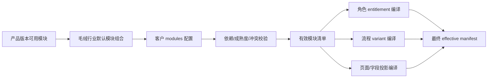

执行顺序不能反过来。角色、页面和流程只能引用最终有效模块提供的 key。

后端处理写请求时至少按以下顺序校验：

```text
1. 模块是否 enabled
2. 命令是否由该模块注册
3. 用户是否拥有 capability + scope entitlement
4. 是否满足任务责任池和职责分离
5. 领域对象当前状态是否允许
6. 幂等、并发版本和业务数据是否合法
```

模块关闭必须返回稳定错误码，例如 `MODULE_DISABLED`，不能表现为 404、空数据或前端静默失败。

### 4.8 模块依赖要少，并区分硬依赖与可选集成

硬依赖表示“没有它，本模块不能合法工作”。可选集成表示“两个模块都启用时，额外连接流程或事件”。

示例：

```text
shipping
  hard: masterdata + sales + inventory
  optional: quality + finance_ops
```

如果客户不启用 `finance_ops`，可以选择不带财务放行节点的批准流程 variant；不能为了省事在 shipping 代码中写大量 `if customer == ...`。

规则：

- 硬依赖必须形成有向无环图；禁止循环依赖。
- 模块不能直接写另一个模块的数据表。
- 跨模块读取优先使用 query contract 或只读 projection。
- 跨模块修改必须调用对方公开 command/usecase。
- 单体内确实要求原子一致时，可由上层 application service 在同一事务调用两个模块的公开接口；不要为了“模块化”强行把所有动作改成最终一致。
- 邮件、短信、Webhook 等外部副作用使用 outbox；不引入 Kafka。

### 4.9 模块与流程变体如何配合

流程定义必须声明：

```text
required_modules
optional_module_slots
使用的 command/capability/form key
```

示例：

```yaml
processKey: finished_goods_delivery
variantKey: plush.standard.finance_release
requiredModules:
  - quality
  - inventory
  - shipping
optionalModules:
  - finance_ops
nodes:
  - finished_goods_qc
  - finished_goods_inbound
  - packaging_execution
  - customer_inspection
  - finance_release
  - shipment_execution
```

另一个客户不需要业务财务模块时，选择经过测试的：

```text
plush.standard.no_finance_release
```

而不是在运行中的流程里临时跳过节点。

流程实例创建时固定：

```text
process_key
process_version
variant_key
module_contract_versions
config_revision
```

模块升级或流程变更只影响新实例。存在引用该模块的运行中流程、未完成任务或未结清业务单据时，禁止直接把模块从 `enabled` 改为 `disabled`；应先进入 `read_only`，完成或迁移在途业务，再关闭。

### 4.10 模块停用、数据和数据库迁移

为了控制复杂度，第一阶段采用统一数据库结构：

```text
所有产品版本迁移在所有客户部署执行
模块关闭只关闭行为和入口
模块表可以存在但为空或只保存历史
不按客户动态创建/删除表
不为每个模块维护独立迁移链
```

模块停用规则：

1. 不删除表、历史记录、审计、附件引用和流程事件。
2. 禁止新建业务和启动新流程。
3. 历史查询通过明确的只读入口保留。
4. 若存在在途流程，先转 `read_only`，再完成、取消或执行受审计迁移。
5. 重新启用时必须重新校验配置、角色、责任池、流程和数据兼容性。
6. 不支持用户在页面上“一键卸载模块”。

这种做法会让少量关闭模块的表仍存在，但能大幅减少升级、回滚和客户支持复杂度，当前阶段值得接受。

### 4.11 前端模块边界

前端模块可以静态拆分和懒加载，但必须在产品构建时进入受信任产物：

```text
manifest.mjs
routes.jsx
pages/
forms/
actions.mjs
api.mjs
```

客户配置只能引用 `page_key`、`form_profile_key` 和菜单 key，不能写组件路径，更不能提供远程 JS。

前端模块负责：

```text
页面和路由贡献
表单组件和字段呈现
调用后端公开命令
展示后端返回的允许动作和模块状态
```

前端模块不负责：

```text
最终授权
决定领域状态迁移
创建下游任务
跨模块写业务事实
判断模块真正是否启用
```

当前 `web/src/erp/config/businessModules.mjs` 可以保留为过渡期聚合目录，但最终应由各前端模块 manifest 聚合或通过契约测试生成；不能继续成为与后端完全独立的第二套模块真源。

### 4.12 后端模块边界

后端不要使用 Go 的动态 `plugin` 机制。使用静态注册：

```go
type Module interface {
    Manifest() Manifest
    Register(registry Registry) error
}
```

产品启动时：

```text
注册本版本所有受信任模块
-> 加载客户 effective manifest
-> 校验依赖和成熟度
-> 激活 enabled/read_only module gate
-> 注册该客户可用命令、查询和流程贡献
```

模块内部拥有自己的状态机和 usecase；流程层只能通过公开 command handler 调用。客户扩展、JSON-RPC handler 和前端不能直接 import/调用模块 data 实现。

为了避免大爆炸重构，现有 `server/internal/biz`、`data`、`service` 可以过渡保留。先建立 manifest、registry、module gate 和依赖测试；新功能以及被迁移的核心闭环再逐步归入模块目录。

### 4.13 永绅建议模块组合

下面是建议状态，不等于未经验收即可对外承诺：

| 模块 | 永绅建议状态 | 当前交付边界 | 主要角色/责任池 |
| --- | --- | --- | --- |
| 平台内核 | `enabled` | 必须稳定 | 所有角色；admin 管理，boss/audit 只读监督 |
| `masterdata` | `enabled` | 客户、供应商、产品、材料等基础真源 | sales、purchase、engineering |
| `sales` | `enabled` | 销售订单事务保存和审批闭环 | sales、boss、pmc |
| `engineering` | `enabled/pilot` | 产品、BOM、加工环节和资料发布；补齐 engineering 分配链 | engineering、boss、pmc |
| `procurement` | `enabled/pilot` | 采购订单与执行；财务录单仅为有限 entitlement | finance、purchase、pmc |
| `quality` | `enabled/pilot` | 来料质检已有基础；扩展裁片、皮壳、成品、验针类型 | quality、purchase、warehouse |
| `inventory` | `enabled` | 流水、余额、入库、出库、预留、冲正 | warehouse、pmc 只读 |
| `outsourcing` | `enabled/pilot` | 委外订单、发料回货和返工需要继续事实化 | purchase、production、outsource_coordinator |
| `production` | `pilot/read_only` | 先交付进度协同；排程和异常壳页未成熟前不正式承诺 | pmc、production |
| `shipping` | `enabled/pilot` | 出货单、出库和冲正；财务放行流程迁移完成前隐藏 release 壳页 | sales、quality、finance、warehouse |
| `finance_ops` | `enabled/pilot` | 业务应收应付、发票、对账，不是总账 | finance |
| `document_ops` | `enabled/limited` | 只交付已验证打印和 dry-run 导入 | 各业务角色按权限使用 |

永绅角色与页面、字段、能力、业务流程和协同责任池的完整清单仍在后续“产品核心角色原型”和“永绅目标角色”章节；模块只决定这些能力是否存在，不替代角色配置。

### 4.14 A/B 甲方差异示例

#### 例一：包材检查岗位不同

```text
A 甲方：quality 模块启用
packaging_material_qc -> sales
sales 获得 packaging.material.inspect

B 甲方：quality 模块启用
packaging_material_qc -> quality
quality 获得 packaging.material.inspect
```

不需要复制 quality 模块，也不需要新流程。

#### 例二：A 有独立外发，B 完全不做委外

```text
A：outsourcing = enabled
external_sewing -> outsource_coordinator
选择 production_execution.with_outsourcing

B：outsourcing = disabled
选择 production_execution.inhouse_only
配置编译器拒绝任何 outsourcing 页面、能力和节点引用
```

#### 例三：A 需要财务放行，B 不维护业务财务

```text
A：finance_ops = enabled
选择 finished_goods_delivery.finance_release
finance_release -> finance

B：finance_ops = disabled
选择经过批准的 finished_goods_delivery.no_finance_release
shipping 仍需满足库存、质量和订单状态底线
```

#### 例四：同一客户岗位合并

```text
采购角色同时承担 outsource_coordination 责任池
```

这是角色和责任池配置，不是把 procurement 与 outsourcing 两个模块合并成一个模块。

### 4.15 什么时候才允许新增业务模块

同时满足以下多数条件，才考虑新增模块：

1. 有独立且稳定的业务名词、业务事实和生命周期。
2. 有自己的状态机或明确的写入不变量。
3. 可以说明数据所有权，其他模块不会直接写它的表。
4. 可以整体启用或关闭，而不是只为了一个字段、页面、岗位或流程节点。
5. 有至少一个公开 command、query 或 event contract。
6. 有清晰依赖，不制造循环。
7. 有迁移、权限、审计、测试、文档和停用方案。
8. 不是只来自一个客户的一次性表述；若只来自单客户，先进入 candidate 或客户配置。

明确禁止：

```text
一个角色一个模块
一个页面一个模块
一个审批节点一个模块
一个客户一个模块
一个打印模板一个模块
```

### 4.16 第一阶段明确不做的模块能力

```text
运行时安装/卸载可执行插件
模块市场
模块独立部署或微服务化
模块独立版本发布
客户自定义数据库 schema
客户上传后端代码或前端组件
模块间任意 hook 链
模块级独立 RBAC 引擎
模块级独立工作流引擎
按模块条件执行不同数据库迁移
```

所有业务模块共享：

```text
同一个授权引擎
同一个流程运行时
同一个任务模型
同一个审计模型
同一个配置 revision
同一个产品发布版本
```

这正是控制复杂度的关键。

### 4.17 模块设计验收标准

第一版只有同时满足以下条件，才算真正实现“模块可组合”：

1. 后端有 module registry 和 module gate，而不是只隐藏菜单。
2. 客户 effective manifest 明确记录模块状态、产品版本和 manifest hash。
3. 关闭模块后，其写 API、能力授予、新流程和页面投影都被阻止。
4. 任一角色、流程、表单或页面不能引用关闭模块提供的 key。
5. 模块依赖无环，依赖关闭时配置编译失败。
6. 模块不能直接写另一个模块拥有的数据。
7. 在途流程和历史数据不会因模块关闭丢失或变成无法解释。
8. A/B 客户可使用不同模块组合通过各自黄金闭环，无需 fork 核心代码。
9. 所有模块仍随同一产品版本发布，没有独立兼容矩阵。
10. 当前菜单配置、前端模块目录和后端 manifest 有契约测试，不会各自漂移。

---

## 5. 核心概念和边界

### 5.1 原子能力 Capability

能力表示后端可执行动作，例如：

```text
sales_order.create
sales_order.submit
sales_order.approve
product.update
bom.release
purchase.order.create
quality.inspection.decide
warehouse.inbound.confirm
inventory.adjust
shipment.ship
finance.receivable.post
workflow.task.claim
workflow.task.complete
```

边界：

- 能力由产品核心登记；
- 客户包只能引用，不得发明后端不存在的能力；
- 每个写能力必须由后端 usecase/command handler 校验；
- 页面隐藏、按钮隐藏不是安全控制；
- 不要为每一个普通字段创建一个能力，只有成本、银行、税务等敏感字段才单独控制。

### 5.2 能力包 Capability Bundle

能力包是可复用的能力组合，不是最终客户角色。

建议第一批能力包：

| bundle key | 目的 | 典型能力 |
| --- | --- | --- |
| `global_viewer` | 管理层全局只读 | 各业务模块 read |
| `customer_manager` | 客户档案维护 | customer read/create/update |
| `sales_operator` | 销售订单处理 | order create/update/submit/activate |
| `engineering_author` | 产品与工程资料维护 | product/SKU/document update |
| `bom_maintainer` | BOM 维护与发布 | bom create/update/release |
| `process_maintainer` | 工艺路线维护 | process route update/release |
| `pmc_planner` | 计划和交期评审 | plan/readiness/risk update |
| `supplier_manager` | 供应商维护 | supplier create/update |
| `procurement_buyer` | 采购订单执行 | purchase create/update/submit |
| `warehouse_receiver` | 收货、入库、退货 | receipt/inbound/return |
| `inventory_operator` | 库存操作 | reserve/release/consume/adjust |
| `quality_inspector` | 质检记录和判定 | inspection create/submit/decide |
| `quality_exception_handler` | 质量异常处理 | reinspection/waiver/return proposal |
| `production_manager` | 生产路线和调度 | route/plan/exception |
| `production_fact_operator` | 报工和返工事实 | report/complete/rework |
| `outsourcing_order_operator` | 委外订单 | outsource order create/update |
| `outsourcing_coordinator` | 委外执行协同 | dispatch/return/follow-up |
| `packaging_operator` | 包装协同 | package/box/complete |
| `shipment_preparer` | 出货草稿和业务确认 | shipment draft/preconfirm |
| `shipment_executor` | 实际出库和出货 | outbound/ship/reverse |
| `finance_controller` | 应收应付和对账 | AR/AP/invoice/reconcile |
| `shipment_finance_releaser` | 出货财务放行 | finance release/revoke |
| `workflow_worker` | 普通任务动作 | list/claim/start/complete own/pool task |
| `workflow_approver` | 审批任务 | approve/reject/return |
| `workflow_supervisor` | 流程监督 | read scoped flow/urge/escalate |
| `system_rbac_admin` | 账号和角色管理 | user/role/entitlement management |
| `audit_viewer` | 审计查看 | audit read/explain |

能力包只组合能力，不包含：

```text
客户名称
具体员工
责任池成员
页面中文文案
任意数据范围
流程节点 ID
```

### 5.3 客户角色 Role Profile

角色是给客户真实人员分配的岗位身份。

```text
角色 = 能力包
     + 本角色 grants
     - 本角色 revokes
     + 每项能力的数据范围
     + 责任池成员关系
     + 页面策略
     + 字段策略
```

角色不拥有“整条流程”。流程节点只要求责任池和能力。

角色 key 必须是客户部署内的稳定本地 key：

```text
sales
engineering
purchase
outsource_coordinator
```

不要写成：

```text
yoyoosun.sales
customer_b.sales
```

客户身份已经由配置包和部署实例表达，不需要污染所有数据库 key。显示名称可配置，key 不随中文岗位名变化。

### 5.4 授权项 Entitlement

授权项是运行时最重要的数据结构：

```text
entitlement = role + capability + scope
```

示例：

```text
角色 warehouse_a
能力 shipment.ship
范围 WAREHOUSE:WH_A
```

第一版只支持有限范围类型：

| scope type | 含义 |
| --- | --- |
| `ALL` | 当前独立部署内全部资源 |
| `OWNED` | 本人创建、负责或明确归属的记录 |
| `CUSTOMER` | 指定客户集合 |
| `SUPPLIER` | 指定供应商/加工厂集合 |
| `WAREHOUSE` | 指定仓库集合 |
| `WORK_POOL` | 指定责任池中的任务 |

暂时不做通用 ABAC 表达式、任意字段条件、组织树 DSL。

### 5.5 责任池 Work Pool

责任池表达稳定业务责任，不表达组织岗位名称。

示例：

```text
order_intake
order_approval
engineering_data
material_requirement
procurement_execution
incoming_qc
warehouse_receiving
production_scheduling
outsource_coordination
finished_goods_qc
packaging_execution
finance_release
shipment_execution
reconciliation
```

流程节点配置：

```yaml
ownerPool: incoming_qc
requiredCapability: quality.inspection.decide
```

客户映射：

```text
永绅：incoming_qc -> quality
甲方 B：incoming_qc -> quality_lead + quality_operator
```

责任池只决定候选责任人，不自动授予能力；能力也不会让用户自动得到某个任务。

### 5.6 页面目录、字段目录和表单配置

页面和字段策略只负责用户体验投影：

```text
能否看到页面
能否看到字段
字段是否只读/必填/脱敏
当前节点使用哪组现有字段
```

后端仍要重新校验命令、字段、状态和范围。

第一阶段不做动态表单设计器。所有业务页面仍由 React 编码；配置只能覆盖已经登记的字段：

```text
visible
editable
required
masked
label
defaultValue
readonlyReason
```

### 5.7 领域状态、流程状态、任务状态和结果

这四类概念必须分开：

```text
领域状态：订单、采购单、质检单、库存批次、出货单本身的事实状态
流程状态：一个流程实例是否运行、阻塞、完成
节点/任务状态：当前工作是否可领取、进行中、完成
结果 outcome：通过、不通过、退回、让步接收等处理结论
```

### 5.8 策略 Policy

策略是产品核心登记的命名判断，不是任意表达式。

示例：

```text
order_approval.required_by_amount
purchase_entry.owner_finance_or_purchase
shipment_release.require_finance
qc_failure.route_return_or_rework
```

客户只能选择产品已实现的变体，例如：

```yaml
policies:
  purchase_entry_owner: finance
  shipment_finance_release: required
```

不允许在客户配置中写 JavaScript、SQL 或自由表达式。

---


---

## 5A. 领域设计：先把业务事实分清楚，再谈流程

流程提效的前提是领域边界清晰。否则流程会变成一个“万能任务表”，最后库存、质检、财务、出货都被 payload 混在一起，系统一定不可维护。

### 5A.1 核心领域和真源

| 领域 | 真源 | 可以做什么 | 不能做什么 |
| --- | --- | --- | --- |
| MasterData | 客户、供应商、联系人、产品、SKU、材料、单位、仓库 | 维护基础资料和启停状态 | 不表达订单、库存、财务、质检事实 |
| Sales | 销售订单、订单行 | 客户承诺、交期、数量、价格、订单生命周期 | 不扣库存、不生成应收、不代表出货 |
| Engineering | BOM、工艺、工程资料版本 | 产品结构、用料、工艺、包装要求 | 不生成采购订单、不写库存 |
| Purchase | 采购订单、采购退货、采购收货源单 | 供应商采购承诺、到货来源、退补货来源 | 不等于库存入账、不等于应付确认 |
| Quality | 质检单、缺陷、判定、复检、让步接收 | 质量结论和批次质量状态 | 不直接写库存流水，不替代仓库入库 |
| Inventory | 库存流水、余额、批次、预留、冲正 | 收发存事实、可用量、冻结、冲正 | 不由前端直接改余额，不从任务完成伪造 |
| Outsourcing | 委外订单、发料、回货、返工 | 加工厂承诺和委外执行事实 | 不自动生成财务凭证，不替质量判定 |
| Production | 生产计划、生产事实、完工、返工、异常 | 内制生产执行和进度事实 | 不直接改库存余额，成品入库仍需库存 usecase |
| Shipment | 出货单、出货行、出库、发货、取消冲正 | 真实出货、库存 OUT、出货状态 | 出货放行不等于发货；任务完成不等于扣库存 |
| FinanceFact | 应收、应付、发票、对账业务事实 | 业务对账和收付款线索 | 不是总账、凭证、税控和完整财务系统 |
| Workflow | 流程实例、节点、任务、协同状态 | 交接、审批、异常、催办、补资料 | 不作为库存/财务/质检/出货事实真源 |
| Audit | 审计事件 | 记录谁、何时、以什么权限、做了什么 | 不允许普通更新删除，不当作业务备注 |

### 5A.2 领域命令命名

所有真实写入都应该变成明确业务命令，不允许普通页面调用“随便写状态/任务”的通用接口。

| 领域 | 推荐命令示例 | 说明 |
| --- | --- | --- |
| Sales | `sales_order.submit`、`sales_order.activate`、`sales_order.cancel` | 销售订单生命周期命令 |
| Engineering | `bom.release`、`engineering_package.publish` | 工程资料发布命令 |
| Purchase | `purchase_order.submit`、`purchase_receipt.create`、`purchase_return.create` | 采购承诺和收货来源命令 |
| Quality | `quality_inspection.decide`、`quality_inspection.reinspect`、`quality_inspection.concession_accept` | 质检判定和让步接收 |
| Inventory | `inventory.post_inbound`、`inventory.post_outbound`、`inventory.adjust`、`inventory.reverse`、`stock.reserve` | 库存必须幂等和可冲正 |
| Production | `production.complete_step`、`production.report_rework`、`production.finish_goods` | 生产事实命令 |
| Shipment | `shipment.create`、`shipment.ship`、`shipment.cancel_shipped` | 只有 `ship` 才是真实发货 |
| Finance | `finance_fact.post_receivable`、`finance_fact.post_payable`、`finance_fact.settle`、`finance_fact.cancel` | 业务财务事实 |
| Workflow | `task.complete`、`task.block`、`task.reject`、`task.reassign` | 协同动作，不能直接写领域事实 |

### 5A.3 流程和领域的连接方式

```text
领域命令成功
  -> 领域事件 domain_event
  -> 流程运行时根据流程定义推进
  -> 生成下一责任池任务或关闭节点
```

不要让流程直接写领域表。正确方式：

```text
任务动作 task.complete
  -> 如果只是确认/审批：推进流程
  -> 如果会产生事实：转成领域命令
  -> 领域命令成功后再推进流程
```

示例：

```text
仓库完成“采购入库确认”任务
  -> 调用 inventory.post_inbound
  -> 写 inventory_txns / inventory_balances / inventory_lots
  -> 写 audit_events
  -> 流程推进到 quality 或 finance 责任池
```

而不是：

```text
update_task_status(done)
  -> payload 写 inbound_done
  -> 页面上显示库存增加
```

### 5A.4 不要把 Workflow 表当万能表

Workflow 表只允许保存：

```text
任务标题
任务来源
责任池
处理人
截止时间
阻塞原因
处理结果
任务表单快照
下一步提示
```

Workflow 表不允许保存为唯一真源：

```text
库存余额
质检结论真源
应收应付金额真源
出货数量真源
BOM 用量真源
采购价格真源
```

### 5A.5 领域服务边界

每个模块应至少有：

```text
command.go       # 对外命令输入，字段少而明确
usecase.go       # 事务、状态机、业务校验
status.go        # 领域状态机
validator.go     # 领域校验
repo.go          # 数据访问接口
projection.go    # 看板/列表投影，不当真源
handler.go       # JSON-RPC/HTTP 适配，薄层
```

如果一个模块只有 page，没有 usecase 和状态机，就不能包装成正式可卖模块。

## 6. 角色能力的“加、减、分配”算法

### 6.1 角色内的能力计算

每个角色单独计算：

```text
RoleCapabilities =
  bundles 中的能力
  ∪ role.grants
  - role.revokes
  - 未启用模块的能力
```

注意：`revokes` 只作用于当前角色配置。用户拥有另一个明确授予该能力的角色时，另一个角色仍可形成自己的授权项。

不要实现“某角色的 revoke 全局否定用户其他所有角色”的隐式规则，否则多角色用户会出现难以解释的行为。

真正的高风险禁止由以下机制处理：

```text
职责分离 SoD
用户禁用
角色禁用
受控 break-glass
```

### 6.2 运行时授权算法

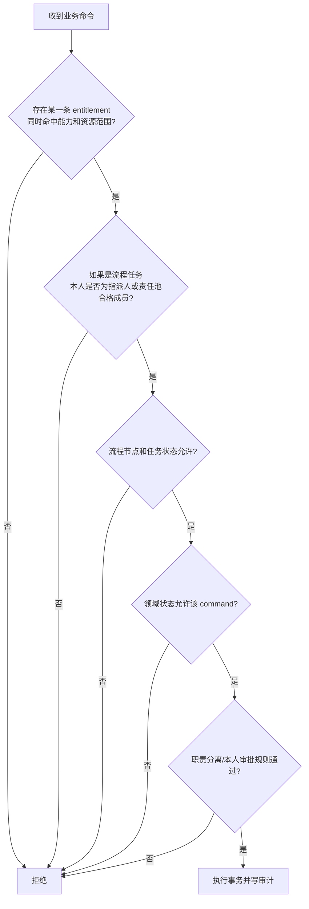

伪代码：

```text
for entitlement in currentUser.activeRoleEntitlements:
    if entitlement.capability == requiredCapability
       and scopeMatches(entitlement.scope, resource):
        matched = entitlement
        break

if matched is nil: deny
if task exists and !isEligibleTaskActor(user, task): deny
if !processAllows(task, action): deny
if !domainAllows(resource, command): deny
if !sodAllows(user, resource, command): deny
execute(command, matched)
```

### 6.3 责任池分配

第一版只支持四种分配策略：

| strategy | 说明 |
| --- | --- |
| `POOL_CLAIM` | 任务进入责任池，合格成员自行领取 |
| `DIRECT_USER` | 明确指派给一个用户 |
| `SOURCE_OWNER` | 指派给业务来源记录负责人 |
| `WAREHOUSE_SCOPE` | 根据仓库范围选出责任池成员 |

暂时不实现：

```text
轮询
最少负载
复杂班次
组织树上溯
动态技能评分
自动代理链
```

若没有合格候选人：

- 配置发布时能发现的，直接禁止发布；
- 运行时才出现的，节点进入 `BLOCKED`；
- 生成明确告警，不能静默把任务给管理员。

### 6.4 多角色、离职和临时代理

- 用户可以拥有多个角色；每次动作记录实际命中的授权项。
- 禁用用户或撤销高风险能力应立即生效，不受流程版本固定影响。
- 用户离职后，已领取未完成任务必须通过系统命令退回责任池或重新指派，并写原因。
- 第一版不做复杂代理规则；只提供管理员“带原因、带有效期”的显式重新指派。
- 角色、用户、责任池一旦被历史流程引用，不做硬删除，只禁用或废弃。

### 6.5 职责分离 SoD

第一批只实现真正需要的规则：

```text
制单人不能审批本人单据（客户可选择是否启用，但高风险场景可设为产品强制）
质检判定与库存入库是不同 command
财务放行与实际出货不能由同一授权项隐式完成
库存调整需要独立高风险能力和原因
超级管理员不自动拥有业务岗位能力
```

判断应以用户 ID、记录创建人、任务执行人和命令类型为准，不以中文岗位名硬编码。

---

## 7. 业务流程与协同流程的关系

### 7.1 业务流程

业务流程改变可审计业务事实，例如：

```text
销售订单提交/审批/激活
工程版本发布
采购订单提交/审批
质检判定
采购入库过账
库存预留/扣减/冲正
出货执行
应收应付过账
```

业务动作必须通过命名明确的后端 command handler，在事务中完成状态校验、幂等、审计和必要的流程推进。

### 7.2 协同流程

协同流程负责“谁接下来做什么”，例如：

```text
补资料
确认交期
催采购
客户验货沟通
异常升级
等待外部回复
提醒财务放行
```

协同任务可以记录表单和证据，但不能直接伪造业务事实。

### 7.3 两者如何连接

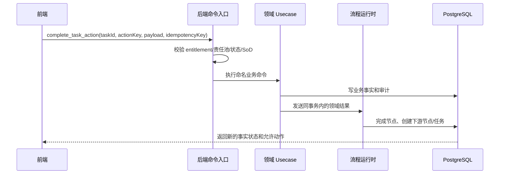

规则：

- 如果任务只属于协同确认，可直接记录任务结果；
- 如果任务代表业务动作，业务命令成功后才能将任务标记完成；
- 业务命令失败时任务保持未完成，不能先完成任务再补业务数据；
- 流程取消不能逆转已经过账的库存、出货或财务事实，必须使用领域冲正/撤销命令。

### 7.4 后端唯一真源

前端允许调用的接口应逐步收敛成：

```text
get_effective_session
list_my_tasks
get_task_detail
claim_task
start_task
complete_task_action
urge_task
execute_domain_command
```

以下接口不得作为普通前端入口：

```text
create_arbitrary_task
set_owner_role
upsert_business_state
force_process_node
write_actor_role_key
```

---

## 8. 状态机设计

### 8.1 领域状态机

领域对象继续由各自 usecase 和 `server/internal/core/status` 管理。示例：

```text
SalesOrder: draft -> submitted -> approved -> active -> closed/cancelled
PurchaseOrder: draft -> submitted -> approved -> receiving -> completed/cancelled
Inspection: draft -> submitted -> decided -> reversed
Shipment: draft -> ready -> finance_released -> shipped -> reversed
```

具体合法迁移必须是后端白名单。客户配置不能新增或删除领域状态。

### 8.2 流程实例状态

第一版只保留：

```text
RUNNING
BLOCKED
COMPLETED
CANCELLED
FAILED
```

### 8.3 节点实例状态

```text
WAITING
READY
ACTIVE
COMPLETED
SKIPPED
BLOCKED
FAILED
CANCELLED
```

`WAITING` 表示前置条件未满足；`READY` 表示可创建或领取工作。

### 8.4 人工任务状态

```text
READY
CLAIMED
IN_PROGRESS
BLOCKED
COMPLETED
CANCELLED
```

不再把 `rejected` 放在任务生命周期中。

### 8.5 处理结果 Outcome

```text
APPROVED
REJECTED
RETURNED
PASSED
FAILED
WAIVED
CONFIRMED
```

例如：

```text
task_status = COMPLETED
outcome = FAILED
```

表示质检已经做完，结果不合格。

### 8.6 并行、汇合和返工

- 正常流程图尽量保持 DAG；
- 并行分支明确指定 `join=ALL` 或 `join=ANY`；
- 返工不做任意循环，而是新建一个 `attempt` 节点实例；
- 每个返工路径必须有 `maxAttempts`；
- 超过上限进入人工异常处理，不自动无限循环。

### 8.7 并发和幂等

所有高风险动作至少支持：

```text
idempotency_key
record_version / optimistic lock
原子 task claim
重复事件去重
```

防止：

- 双人同时领取任务；
- 重复点击生成两次入库或出货；
- 网络重试重复创建下游任务；
- 旧页面覆盖新状态。

---

## 9. 流程编排设计：小而受控

### 9.1 支持的节点

| node type | 目的 | 允许内容 |
| --- | --- | --- |
| `start` | 流程起点 | 业务事件/命令触发 |
| `human_task` | 协同或人工录入 | 责任池、能力、表单、动作 |
| `approval` | 受控审批 | approve/reject/return |
| `domain_command` | 系统执行命名业务命令 | 白名单 handler key |
| `wait_event` | 等待另一个流程或外部事实 | 命名事件 key + 超时 |
| `end` | 流程结束 | 结果和投影 |

### 9.2 支持的路由

```text
sequence
named-policy condition
fan-out
join-all
join-any
explicit returnTo
```

分支条件只引用产品注册的 policy key，不嵌入任意表达式。

### 9.3 节点示例

```yaml
processKey: purchase_inbound
version: 2
nodes:
  - key: incoming_qc
    type: human_task
    ownerPool: incoming_qc
    requiredCapability: quality.inspection.decide
    formProfile: qc.incoming.v1
    actions:
      - key: pass
        command: quality.decide_pass
        outcome: PASSED
      - key: fail
        command: quality.decide_fail
        outcome: FAILED
    duePolicy: qc.incoming.24h

  - key: warehouse_inbound
    type: human_task
    ownerPool: warehouse_receiving
    requiredCapability: warehouse.inbound.confirm
    formProfile: warehouse.inbound.v1
```

### 9.4 流程族而不是超级流程

永绅的完整订单链应拆为：

```text
sales_order_acceptance
engineering_release
material_supply
production_execution
finished_goods_delivery
financial_settlement
```

通过以下信息关联：

```text
business_ref_type
business_ref_id
sales_order_id
correlation_key
```

看板可以聚合这些流程，但运行时不做一个 50 节点大实例。

好处：

- 采购流程变化不需要升级整条订单流程；
- 生产和包材可以并行；
- 某一流程失败可以独立恢复；
- 第二个客户可以只替换某个流程族的批准变体。

### 9.5 自动节点和外部副作用

当前单体系统内：

- 业务事实与流程推进尽量在同一个数据库事务完成；
- 邮件、短信、Webhook 等外部副作用通过 outbox；
- 不引入 Kafka；
- 自动节点失败只做有限重试，超过上限进入 `BLOCKED` 并告警。

---

## 10. 配置策略、版本治理和扩展点

### 10.1 配置层级

```text
产品版本可用模块与核心目录
  < 毛绒行业模板默认模块/角色/流程
  < 客户模块状态与差异配置
  < 部署参数（只放非业务结构参数）
  -> 编译生成不可手改的 effective manifest
```

Secret、密码、Token 不进入客户业务配置，单独由部署环境管理。

### 10.2 客户配置允许修改的内容

```text
品牌、名称和菜单显示
从产品允许列表中选择模块 enabled/read_only/disabled
默认角色及显示名
角色能力包、grants、revokes
capability-scope 授权项
责任池和角色映射
可选协同节点启用/关闭
批准的策略变体
SLA、提醒和升级参数
现有字段的显示、只读、必填、脱敏和 label
导入映射
打印模板选择
```

### 10.3 客户配置禁止修改的内容

```text
领域状态机
库存记账和负库存底线
质检决定可用库存的约束
出货扣库存和冲正规则
财务事实的过账与撤销规则
审计写入
幂等和事务
任意 SQL/JavaScript/命令
动态后端插件、远程前端组件或客户数据库迁移
修改模块 hard dependency、owned entity 或 manifest
未注册 module/capability/page/field/node/handler
```

### 10.4 不做通用 deep merge

不同配置类型使用明确合并规则：

```text
角色 map：按稳定 key 覆盖明确字段
bundles/grants：集合合并
revokes：只从当前角色结果中扣除
workPools：列表整体替换或显式 add/remove
字段策略：按 field key 覆盖允许属性
流程节点：只能在 extension slot 添加、关闭 optional 节点或选择 variant
modules：按 module key 读取显式状态，不允许递归合并 manifest
未知 key：立即报错
```

不要让一个通用递归 merge 决定业务语义。

### 10.5 配置生命周期

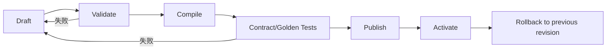

每个有效配置必须记录：

```text
customer_key
product_version
industry_template_version
customer_package_version
config_revision
manifest_hash
process_definition_hashes
published_at
published_by
```

### 10.6 在途流程与配置更新

必须区分两类配置：

**结构配置固定：**

```text
流程图版本
节点动作
表单 profile
命名策略版本
```

流程实例创建时固定，后续发布新版本只影响新实例。

**安全与人员配置实时：**

```text
用户是否启用
角色是否启用
当前 entitlement
责任池当前成员
```

撤权必须立即生效；人员离职不能因为流程固定而继续操作。现有未完成任务可重新解析候选人或显式退回责任池，并写审计。

绝不能直接把所有在途实例偷偷迁到新流程版本。需要迁移时，使用一次性、可审计、可回滚的迁移命令。

### 10.7 配置发布必须阻止的问题

至少校验：

```text
引用不存在的能力、页面、字段、责任池、节点、策略或 handler
责任池没有任何可用角色/人员
流程节点要求的能力没有任何责任池成员具备
关闭的模块仍被角色、流程、页面、字段或打印/导入配置引用
模块 hard dependency 缺失、存在循环或成熟度不允许生产启用
模块仍有在途流程/未完成任务却直接从 enabled 切到 disabled
字段被隐藏但下游业务命令必填
分支没有默认路径
节点不可达或 end 不可达
循环无 maxAttempts
并行分支无法汇合
客户启用了未达到可交付级别的模块
前后端配置 revision 不一致
```

### 10.8 扩展点边界

扩展按成本从低到高只允许五类：

1. **配置扩展：** 模块状态、角色、责任池、字段、菜单和已登记模板选择；优先使用。
2. **流程变体：** 从产品批准的 variant 或 optional slot 中选择；不能任意改图。
3. **命名策略扩展：** 实现固定接口并随产品版本注册，例如交期判断；不能执行 SQL 或直接改表。
4. **集成适配器：** 实现短信、打印、对象存储、Webhook、第三方财务导出等稳定端口；不拥有业务状态。
5. **产品业务模块：** 仅当存在独立业务事实、状态机和数据所有权时，由产品团队实现并随产品发布。

第一阶段不允许客户配置包携带可执行 command handler。极少数客户特例确实需要代码时，也必须进入产品仓库、经过代码评审、测试和统一发布，只能通过稳定 `extension_key` 启用；它不是客户可自行上传的插件。

任何代码扩展必须有：

```text
extension_key
owner
客户差异原因
影响模块
依赖的核心/module contract 版本
数据和状态所有权
测试和回滚方案
复审日期
是否应晋升行业模板或正式模块
```

禁止扩展：

```text
直接 import data 层并改表
绕过 usecase 写库存/财务
修改核心状态常量
替换认证授权或流程运行时
加载远程 JS/Go 插件
写前端脚本生成业务事实
按 customer_key 散落业务 if/else
```

---

## 11. 推荐目录及其具体目的


### 11.0 总体目录树：每个目录的目的、作用和边界

目录设计的目的不是“看起来分层”，而是让以后接第二、第三个甲方时，团队知道：

```text
改客户配置去哪里；
改行业模板去哪里；
改产品内核去哪里；
改流程定义去哪里；
改字段策略去哪里；
改客户私有部署去哪里；
什么东西绝对不能混在一起。
```

建议目标目录如下：

```text
repo/
  config/
    catalog/                         # 产品级目录：模块、页面、字段、能力、责任池、状态、命令的稳定 key 真源
    schemas/                         # 配置 schema：校验客户包、行业模板、流程定义、字段策略是否合法
    industry-templates/
      plush/                         # 毛绒行业模板：行业默认模块组合、角色模板、流程族、字段策略、demo 规则
    customers/
      _schema/                       # 客户包示例和说明，不放任何真实客户资料
      demo/                          # 中性演示客户，用于售前、测试和自动化验收
      yoyoosun/                      # 永绅客户配置包，只放配置、标签、菜单、映射、模板引用，不放原始私密资料
    compiled/                        # 编译后的有效配置快照，运行时只读，可由 CI 生成，不手工编辑

  server/
    internal/
      platform/
        module/                      # 模块注册表和启停解释，不放业务规则
        access/                      # 授权、能力、数据范围、职责分离，不放 UI 逻辑
        customerconfig/              # 配置加载、编译、校验、revision，不放客户业务事实
        process/
          definition/                # 流程定义解析和校验，不写数据库实例
          runtime/                   # 流程实例、节点实例、任务推进，不关心页面展示
          assignment/                # 责任池到角色/人员的分配，不写领域事实
          handlers/                  # 白名单节点处理器和命令桥接，不允许任意脚本
          projection/                # 看板和任务投影，不作为事实真源
        audit/                       # 审计写入、脱敏、查询，不允许修改删除审计
        outbox/                      # 同库事务后的异步事件，不引入复杂消息系统
      modules/
        masterdata/                  # 客户、供应商、产品、材料、单位、仓库等主数据领域
        sales/                       # 销售订单领域命令、状态机、repo、校验
        engineering/                 # BOM、工艺、工程资料版本
        purchase/                    # 采购订单、采购退货、采购收货源单
        quality/                     # 质检事实、缺陷、让步接收、复检
        inventory/                   # 库存流水、余额、批次、预留、冲正
        outsourcing/                 # 委外订单、发料、回货、加工异常
        production/                  # 生产事实、完工、返工、异常
        shipment/                    # 出货单、出库、发货、冲正
        finance/                     # 业务财务事实：应收、应付、对账、发票线索
      data/                          # Ent schema、迁移、底层 repo 过渡层；不放跨领域流程编排
      service/                       # JSON-RPC/HTTP handler；只接请求，不写复杂业务事务

  web/
    src/erp/
      platform/
        module/                      # 前端模块注册和客户有效配置消费
        access/                      # 菜单、按钮、字段可见/只读解释；不是安全真源
        process/                     # 任务 UI 组件和流程投影展示；不创建任意下游任务
        shell/                       # 桌面壳、移动壳、导航、布局
      modules/
        masterdata/                  # 主数据页面、表格、表单、hooks
        sales/                       # 销售订单页面和组件
        engineering/                 # BOM/工艺页面和组件
        purchase/                    # 采购页面和组件
        quality/                     # 质检页面和组件
        inventory/                   # 库存页面和组件
        outsourcing/                 # 委外页面和组件
        production/                  # 生产页面和组件
        shipment/                    # 出货页面和组件
        finance/                     # 业务财务页面和组件
      mobile/                        # 一个移动任务工作台，多角色视图，不按客户复制 app

  deployments/
    _template/                       # 私有化部署模板：env.example、preflight、备份、回滚、验收报告模板
    demo/                            # 演示部署包
    yoyoosun/                        # 永绅部署包；不进入产品核心默认配置

  scripts/
    qa/                              # 配置、目录、权限、流程、secret、边界测试
    build/                           # 构建期客户品牌 overlay，只处理静态资源，不处理业务规则
    migrate/                         # 数据迁移和配置 revision 迁移脚本
    import/                          # 导入 dry-run 和正式提交工具，不能绕过后端领域规则
    deploy/                          # 部署、备份、恢复、健康检查脚本

  docs/
    architecture/                    # 核心架构和边界，面向开发团队
    product/modules/                 # 模块成熟度、可卖范围、验收标准，面向产品和售前
    implementation/                  # 实施手册、客户调研表、上线步骤
    customers/
      demo/                          # 演示客户说明
      yoyoosun/                      # 永绅交付文档；客户原始文件应另放私有资料库
```

#### 目录存在的原因和不能放的东西

| 目录 | 为什么需要 | 主要放什么 | 不能放什么 |
| --- | --- | --- | --- |
| `config/catalog/` | 稳定 key 真源，防止各处硬编码 | module/page/field/capability/pool/status/command catalog | 客户私有名称、客户原始数据、可执行脚本 |
| `config/schemas/` | 客户配置发布前先校验 | JSON Schema、lint 规则、示例 | 业务事实、客户数据 |
| `config/industry-templates/plush/` | 把毛绒行业共性与客户差异分开 | 行业默认角色、流程族、字段策略 | 永绅专属流程、客户真实资料 |
| `config/customers/<customer>/` | 每个甲方只改配置，不 fork 代码 | 品牌、菜单、角色、责任池、流程变体、导入映射、打印模板引用 | Go/JS/SQL 代码、数据库表定义、原始私密文件 |
| `config/compiled/` | 运行时使用可解释的有效配置 | 编译后的 json、hash、revision | 人工编辑文件、客户原始配置草稿 |
| `server/internal/platform/access/` | 统一授权，避免散落在 handler/page | capability、entitlement、SoD、授权解释 | 页面显示逻辑、客户硬编码 |
| `server/internal/platform/process/` | 协同流程唯一真源 | 流程定义、实例推进、任务生成、责任池分配 | 库存/财务等领域事实直接写表逻辑 |
| `server/internal/modules/<module>/` | 领域内聚，降低大文件风险 | command、usecase、status、repo、validator | 跨客户配置解析、前端路由、任意流程 DSL |
| `web/src/erp/platform/access/` | 前端统一解释菜单、按钮、字段 | UI 权限投影、字段策略投影 | 安全决策真源、后端授权替代品 |
| `web/src/erp/modules/<module>/` | 前端按业务域拆页面和组件 | 页面、表单、表格、hooks、api wrapper | 其他模块业务规则、客户配置编译逻辑 |
| `deployments/<customer>/` | 私有化部署差异收口 | env、preflight、备份、回滚、验收报告 | 产品核心源码、客户原始需求表 |
| `scripts/qa/` | 防止配置漂移和边界破坏 | lint、schema check、secret scan、flow check | 生产业务修复脚本 |
| `scripts/import/` | 导入要可回放、可预检 | dry-run、映射校验、提交工具 | 绕过 API 直接写核心事实表 |
| `docs/product/modules/` | 售前边界和可卖范围 | 模块状态、验收标准、客户承诺 | 未验证功能的销售承诺 |

#### 目录设计的关键边界

```text
客户能改的，必须在 config/customers/<customer>/；
行业共性，必须在 config/industry-templates/plush/；
产品真源 key，必须在 config/catalog/；
运行时解释，必须在 server/internal/platform/；
业务事实，必须在 server/internal/modules/<module>/；
页面组件，必须在 web/src/erp/modules/<module>/；
部署差异，必须在 deployments/<customer>/；
客户原始资料，不进入产品核心仓库。
```

目录要直接表达“平台内核、业务模块、行业模板、客户差异和部署”的边界。不要为了架构感一次性搬家；先建立目标位置和依赖规则，再逐模块迁移。

```text
config/
  catalog/
    capabilities.yaml
    pages.yaml
    fields.yaml
    work-pools.yaml
    policies.yaml
  industry-templates/
    plush/
      modules.yaml
      roles.yaml
      processes/
      forms/
      ui.yaml
  customers/
    demo/
    yoyoosun/
      customer.yaml
      modules.yaml
      roles.yaml
      work-pools.yaml
      processes.yaml
      ui.yaml
      import/
      print/
  schemas/
  compiled/

server/internal/
  platform/
    module/
    access/
    process/
      definition/
      runtime/
      assignment/
      handlers/
      projection/
    customerconfig/
    audit/
    outbox/
  modules/
    masterdata/
    sales/
    engineering/
    procurement/
    quality/
    inventory/
    outsourcing/
    production/
    shipping/
    finance_ops/
    document_ops/
  data/       # 过渡期基础设施与旧 repo
  service/    # JSON-RPC/HTTP 传输层

web/src/erp/
  platform/
    module/
    access/
    process/
    shell/
  modules/
    masterdata/
    sales/
    engineering/
    procurement/
    quality/
    inventory/
    outsourcing/
    production/
    shipping/
    finance_ops/
    document_ops/
  mobile/

scripts/
  build/
  qa/
  migrate/

docs/
  architecture/
  product/
    modules/
  customers/
    yoyoosun/
```

### 11.1 `config/catalog/`

目的：保存产品核心可识别的稳定 key 目录。

放：

```text
能力、页面、字段、责任池、策略的 key 和说明
每个 key 的 owning module
成熟度/是否可交付
废弃 alias 和版本信息
```

不放：

```text
客户显示名
客户人员
客户具体责任映射
业务运行数据
secret
```

模块 manifest 是可执行注册真源；catalog 是供配置编译、前后端契约和文档使用的稳定词典。两者必须由 QA 校验一致，避免手工维护两套互相漂移的真源。

### 11.2 `config/industry-templates/plush/`

目的：保存毛绒行业默认组合，而不是永绅默认值。

放：

```text
建议启用的模块和最低成熟度
默认角色原型
默认能力包组合
行业责任池
行业流程族和批准 variants
行业表单配置
默认菜单投影
```

不放永绅名称、永绅 Excel 原始列名、永绅岗位合并习惯或永绅专属打印格式。

### 11.3 `config/customers/<customer>/`

目的：只表达“该客户相对行业模板有什么差异”。

放：

```text
modules.yaml：enabled/read_only/disabled
角色显示名、能力增减和 entitlement scope
责任池映射
批准的流程 variant 选择
UI/字段覆盖
导入映射和打印选择
```

不放：

```text
Go/React 源码副本
可执行客户插件
数据库迁移
核心状态常量
客户原始机密文件
环境密码
```

客户角色 key 在部署内保持本地稳定，例如 `sales`；不要把客户 key 拼进每个角色 key。

### 11.4 `config/schemas/`

目的：定义客户配置、模块选择、角色、流程选择和 UI 覆盖的结构及允许值，供编译器、IDE 和 QA 使用。

不承担业务运行，不写自由表达式，不定义数据库结构。

### 11.5 `config/compiled/`

目的：存放不可手改的 effective manifest。

至少包含：

```text
product_version
customer_key
module states 和 module contract versions
role entitlements
work-pool bindings
process variants 和 definition hashes
UI projection
config_revision
manifest_hash
```

server 启动时校验 hash；frontend 只读取裁剪后的 UI/session projection。

### 11.6 `server/internal/platform/module/`

目的：模块注册、manifest、依赖 DAG、成熟度校验、启用状态和运行时 module gate。

不放任何销售、库存、质检或永绅规则；不负责角色责任映射。

建议最少文件：

```text
manifest.go
registry.go
gate.go
compiler.go
errors.go
```

不要在这里建设通用插件加载器。

### 11.7 `server/internal/platform/access/`

目的：统一处理 capability-scope entitlement、模块状态、任务资格、SoD 和授权解释。

所有写 usecase 最终都调用这里；不允许每个 JSON-RPC handler 自己判断角色字符串。

### 11.8 `server/internal/platform/process/definition/`

目的：解析和校验已编译流程定义，检查 required modules、命令、能力、表单和责任池引用。

不执行任意脚本，也不直接运行客户原始 YAML。

### 11.9 `server/internal/platform/process/runtime/`

目的：管理流程实例、节点实例、状态迁移、并行汇合、返工 attempt、版本固定和幂等。

不负责具体库存、采购或财务规则。

### 11.10 `server/internal/platform/process/assignment/`

目的：根据责任池、指派策略、当前人员和 entitlement 计算合格候选人。

不授予能力，只筛选已有资格的人。

### 11.11 `server/internal/platform/process/handlers/`

目的：保存流程运行时到业务模块 command 的白名单适配器。

handler 只能调用模块公开 usecase/command；不能直接写 repo 或跨模块改表。

### 11.12 `server/internal/platform/process/projection/`

目的：生成任务看板、订单里程碑、风险和流程摘要。

这些是可重建读模型，不是业务真源。

### 11.13 `server/internal/platform/customerconfig/`

目的：加载和校验 effective manifest，提供 revision、模块状态、角色 profile、责任池、流程选择和 UI projection。

不在运行时执行通用 deep merge，不下载客户代码，不修改流程定义。

### 11.14 `server/internal/platform/audit/` 与 `outbox/`

```text
audit：记录用户、授权角色、能力、模块、命令、业务对象、前后状态和 config revision
outbox：提交事务后可靠发送邮件、短信、Webhook、集成事件
```

两者属于平台能力，业务模块只调用稳定接口。

### 11.15 `server/internal/modules/<module>/`

目的：让每个业务域拥有自己的事实、状态、usecase 和公开契约。

建议最小结构，不强制每个小模块建十层目录：

```text
manifest.go          模块提供的 key、依赖和成熟度
status.go            本模块领域状态与迁移
usecase.go           业务命令和不变量
repository.go        repo 接口
contracts.go         对其他模块公开的 command/query/event
process_handlers.go  流程节点到公开命令的适配
*_test.go            状态、权限、幂等和闭环测试
```

文件变大后再按 `domain/application/infrastructure` 拆分。不要先创建空目录和无意义 wrapper。

模块禁止：

```text
import 另一个模块的 data 实现
根据 customer_key 写业务 if/else
自行实现授权和工作流
直接改另一个模块的状态字段
```

### 11.16 `server/internal/data/` 与 `service/` 的过渡定位

当前项目已有大量 `biz/data/service` 代码，不应一次性重写。

```text
data：暂时保留 Ent、repo 实现和事务基础设施，按 owning module 标注和测试边界
service：只负责 JSON-RPC/HTTP 参数、认证上下文和响应转换
```

迁移顺序：先加 module manifest/gate，再迁移三条黄金闭环；只有被实际修改的代码才逐步搬入 `modules/`。

### 11.17 `web/src/erp/platform/module/`

目的：读取后端 effective session/module projection，组装静态已构建的路由、菜单和页面贡献。

不决定真正启用状态，不解析客户可执行代码，不做最终授权。

### 11.18 `web/src/erp/platform/access/`

目的：统一消费后端返回的页面、字段和允许动作投影，提供 UI 级 `canShow/canEdit`。

按钮隐藏只是体验，写请求仍由后端检查。

### 11.19 `web/src/erp/platform/process/`

目的：任务列表、详情、时间线、动作组件和表单装配。

不得创建任意下游任务、指定下一角色或决定流程下一节点。

### 11.20 `web/src/erp/platform/shell/`

目的：桌面布局、导航、错误边界、登录会话和通用页面框架。

不放业务状态机和客户专属页面。

### 11.21 `web/src/erp/modules/<module>/`

目的：保存该模块受信任的前端贡献。

建议：

```text
manifest.mjs
routes.jsx
pages/
forms/
actions.mjs
api.mjs
```

客户配置只能引用 manifest 中登记的 key。不同角色通过权限和表单策略看到不同动作，不复制角色专属页面。当前 `businessModules.mjs` 最终应成为这些 manifest 的聚合结果。

### 11.22 `web/src/erp/mobile/`

目的：一个通用移动任务工作台，根据任务类型、模块、允许动作和 form profile 显示工作卡片。

不要为每个新客户角色再增加独立 app、端口和构建命令；现有角色端入口逐步降为过滤视图或兼容路由。

### 11.23 `scripts/build/`

目的：编译客户配置、校验模块组合、生成 effective manifest/UI projection、打包客户品牌资源。

当前缺失的 `apply-customer-web-config.mjs` 必须恢复或整体移除引用；构建不能依赖不存在文件。

### 11.24 `scripts/qa/`

目的：执行以下门禁：

```text
module manifest 唯一性和依赖无环
模块成熟度与客户状态合法
关闭模块无角色/流程/页面/字段引用
模块命令和能力前后端目录一致
模块边界无直接跨 data 写入
责任池和 entitlement 覆盖
流程图可达和在途停用约束
源码包自洽、secret 和部署检查
```

QA 必须能在源码 zip 解压目录运行，不能隐含依赖 `.git`。

### 11.25 `scripts/migrate/`

目的：一次性、可审计地迁移角色、任务、模块状态和在途流程。

不作为常驻运行时代码，不允许客户自己上传迁移脚本。

### 11.26 `docs/architecture/`、`docs/product/modules/`、`docs/customers/`

```text
architecture：长期边界、模块依赖和 ADR
product/modules：每个模块的事实所有权、命令、状态机、成熟度、限制和验收证据
customers：客户模块组合、岗位差异、流程选择、验收、部署和原始资料索引
```

客户原始文件应位于严格受控的私有资料库，不进入可销售的产品核心源码包。

---

## 12. 页面与表单字段目录

下面先建立统一字段组，后续角色矩阵引用这些字段组。

### P01 工作台 / 任务看板

当前字段：

```text
task_code
任务组、任务名称
来源类型、来源 ID、来源单号
任务状态、业务状态投影
owner_role_key、assignee_id
优先级
阻塞原因
到期、开始、完成、关闭时间
payload 展示快照
```

目标补充：

```text
process_key、process_version
node_key、owner_pool_key
required_capability_key
form_profile_key
outcome_key
处理意见、证据、附件引用
```

### P02 客户档案 / 联系人

```text
客户编号
名称
简称
默认付款方式
默认付款周期
税号
备注
联系人姓名、职位、手机、电话、邮箱、主联系人、备注
```

### P03 供应商 / 加工厂档案

```text
供应商编号
名称
简称
供应商类型
默认付款方式
默认付款周期
税号
备注
联系人姓名、职位、手机、电话、邮箱、主联系人、备注
```

### P04 产品 / SKU

产品：

```text
产品编号
产品名称
内部款号
客户款号
默认单位
状态
```

SKU：

```text
所属产品
SKU 编号
SKU 名称
条码
客户 SKU
颜色
色号
尺码
包装版本
默认单位
状态
```

### P05 材料档案

```text
材料编号
材料名称
分类
规格
颜色
默认单位
状态
备注
```

### P06 销售订单

订单头：

```text
订单号
客户
客户订单号
付款方式
付款周期
价格条件说明
订单日期
计划交付日期
备注
生命周期状态
```

订单行：

```text
SKU / 产品来源
产品 ID、SKU ID
产品编码/名称/颜色快照
单位
订购数量
单价
金额
计划交付日期
备注
```

### P07 BOM / 加工环节

BOM：

```text
产品
版本
生效起止日期
状态
备注
材料
用量
单位
损耗率
使用部位
行备注
```

加工环节：

```text
环节编号
环节名称
环节类别
排序
可委外
可内制
需质检
备注
状态
```

目标工程资料补充：

```text
材料厂家
颜色确认 / 色卡
工艺要求
包装要求
资料版本
附件引用
发布人和发布时间
```

### P08 采购订单

订单头：

```text
采购单号
供应商
供应商快照
供应商订单号
采购日期
预计到货日期
备注
生命周期状态
```

订单行：

```text
材料
单位
材料编码快照
材料名称快照
颜色快照
采购数量
单价
金额
预计到货日期
备注
```

### P09 入库 / 退货 / 调整

当前主要字段：

```text
入库单号
采购订单/采购行来源
材料
仓库
单位
收货数量
批次/批次号
来源行号
单价
金额
备注
单据状态
```

退货和调整需要保留：

```text
原单引用
原因
数量
批次
冲正/调整幂等键
```

### P10 质检

当前字段：

```text
质检单号
采购入库单
采购入库行
库存批次
材料
仓库
判定结果
检验日期
判定备注
状态
```

毛绒行业建议补充：

```text
检验类型：来料 / 裁片 / 皮壳 / 成品 / 验针 / 抽样 / 客户验货
送检数量
抽检数量
合格数量
不合格数量
缺陷代码和缺陷等级
处理结论：返工 / 退货 / 补做 / 让步接收
复检来源
照片/附件引用
```

### P11 库存台账

```text
产品 / SKU / 材料
仓库
批次
库存余额
已预留
可用量
批次状态
库存流水类型
来源单据
数量变化
过账时间
操作人
幂等键
```

### P12 委外订单

订单头：

```text
加工合同号
加工厂
来源订单号
来源销售订单
下单日期
预计回货日期
备注
生命周期状态
```

订单行：

```text
产品
工序
单位
产品/工序/单位快照
加工数量
单价
金额
预计回货日期
备注
```

目标补充：

```text
发料来源和数量
实际回货数量
损耗/差异
外发负责人
返工轮次
```

### P13 生产计划 / 进度 / 异常

当前：

```text
生产协同任务
生产事实列表
来源单据
事实编号/类型
数量
状态
备注
```

目标补充：

```text
生产路线决策：内制 / 外发
车缝执行方
手工执行方
计划开始/结束
实际开始/结束
计划数量
完成数量
在制数量
返工数量
异常类型和原因
责任池
```

### P14 出库 / 出货

出货单：

```text
出货单号
销售订单
客户
客户快照
幂等键
计划出货时间
备注
状态
```

出货行：

```text
销售订单行
产品
SKU
仓库
批次
单位
数量
备注
```

目标协同字段：

```text
业务出货前确认
装箱信息
库存检查结果
质量检查结果
财务放行结果和原因
出库单号
实际出货时间
承运信息
```

### P15 财务业务事实

当前表单方向：

```text
事实编号
事实类型
对方单位
来源类型和来源 ID
金额
币种
收款类型
付款条件和天数
发票类别
计划日期
过账/结清/取消状态
备注
```

目标补充：

```text
放行决策
税率和税额
含税/不含税金额
对账差异
发票号
收付款日期
附件引用
```

### P16 打印中心

```text
模板选择
来源单据
打印快照
客户/供应商/产品/金额等模板字段
```

打印配置不能改变事实，只读取已经存在的数据快照。

### P17 权限与审计

```text
管理员
角色
能力
角色能力
账号角色
配置 revision
操作前后值
事件键
操作人
时间
来源 IP / 设备信息
```

---

## 13. 产品核心角色原型设计

下面是产品默认角色模板；客户可以组合、改名或不使用某个模板。“页面”引用第 12 节编号。模板不是硬编码岗位。

### 13.1 管理层 `boss`

| 项目 | 目标 |
| --- | --- |
| 页面 | P01；P02-P15 只读；P16 |
| 可编辑字段 | 审批结果、审批意见、退回原因、阻塞原因、升级意见；不编辑库存/质检/财务事实字段 |
| 业务流程 | 原则上不直接写业务事实；只执行明确审批 command |
| 协同流程 | 订单审批、工程资料审批、重大异常升级、超时催办 |
| 能力包 | `global_viewer`、`workflow_approver`、`risk_supervisor` |
| 边界 | 看全局不等于能替岗位完成任务；不默认拥有 debug、库存调整、出货、财务过账 |

### 13.2 业务 `sales`

| 项目 | 目标 |
| --- | --- |
| 页面 | P01、P02、P04 只读、P06、P14 出货草稿/查询、P16 |
| 可编辑字段 | 客户和联系人；销售订单头和订单行；业务出货前确认字段 |
| 业务流程 | 客户主数据；销售订单创建、修改、提交、激活、关闭、取消；可创建出货草稿但不能实际出货 |
| 协同流程 | 接单、订单补充、交期沟通、客户验货协调、出货前确认 |
| 能力包 | `customer_manager`、`sales_operator`、`shipment_preparer`、`workflow_worker` |
| 边界 | 不维护 BOM 真源；不做质检事实；不扣库存；不做财务放行 |

当前实现差异：当前 `sales` 还拥有产品/SKU 创建更新权限。产品化后建议迁给工程角色，业务只读产品资料。

### 13.3 工程 `engineering`

| 项目 | 目标 |
| --- | --- |
| 页面 | P01、P04、P05、P07、P06 只读、P16 |
| 可编辑字段 | 产品/SKU；BOM；加工环节；材料厂家、色卡、工艺、包装要求、资料版本和附件 |
| 业务流程 | 产品/SKU、BOM、工艺主数据维护和版本发布 |
| 协同流程 | 工程资料准备、资料补充、资料发布、工程变更、老板退回修订 |
| 能力包 | `engineering_author`、`bom_maintainer`、`process_maintainer`、`workflow_worker` |
| 边界 | 工程发布资料不等于采购下单、库存过账或生产完工 |

当前实现差异：角色 key 已存在，但没有进入完整可分配角色链路；应由有效客户配置同步角色，而不是继续扩大 `BuiltinRoles()` 白名单。

### 13.4 PMC `pmc`

| 项目 | 目标 |
| --- | --- |
| 页面 | P01；P04-P14 大部分只读；P13 计划/风险编辑 |
| 可编辑字段 | 交期评审、计划日期、齐套结果、缺料清单、风险、优先级、催办和升级字段 |
| 业务流程 | 若后续建立正式生产计划单，只能写计划事实；当前不写库存/质检/出货事实 |
| 协同流程 | 订单评审、物料需求确认、齐套检查、生产排程、全链路跟踪、异常升级 |
| 能力包 | `pmc_planner`、`material_readiness_supervisor`、`workflow_supervisor` |
| 边界 | 可以催办和升级，但不能代替采购、品质、仓库、生产、财务完成事实 |

### 13.5 采购 `purchase`

| 项目 | 目标 |
| --- | --- |
| 页面 | P01、P03、P05、P07 只读、P08、P09 查询/创建收货来源、P12、P16 |
| 可编辑字段 | 供应商；采购订单；委外订单；供应商交期；采购异常和退补货说明 |
| 业务流程 | 采购订单、委外订单；采购收货/退货源单创建；不负责仓库过账 |
| 协同流程 | 采购执行、供应商跟进、来料不合格处理、补货、委外跟踪 |
| 能力包 | `supplier_manager`、`procurement_buyer`、`outsourcing_order_operator`、`workflow_worker` |
| 边界 | 采购承诺不等于收货、库存或应付事实；审批能力按客户职责分离配置 |

### 13.6 仓库 `warehouse`

| 项目 | 目标 |
| --- | --- |
| 页面 | P01、P09、P10 只读、P11、P14、P04/P05 只读 |
| 可编辑字段 | 收货数量、仓库、批次、库位、退货/调整原因、库存操作、出货行和实际出货字段 |
| 业务流程 | 入库过账、退货/调整、库存预留/释放/消耗、出货和冲正 |
| 协同流程 | 收货、入库确认、备料齐套、包装备料、成品入库、出库执行 |
| 能力包 | `warehouse_receiver`、`inventory_operator`、`shipment_executor`、`workflow_worker` |
| 边界 | 不能代替品质做检验；没有财务放行时不能出货；库存动作必须走幂等领域 usecase |

### 13.7 品质 `quality`

| 项目 | 目标 |
| --- | --- |
| 页面 | P01、P09 查询、P10、P13 异常查询、P14 放行检查查询 |
| 可编辑字段 | 检验类型、数量、结果、缺陷、处理结论、复检来源、附件和判定意见 |
| 业务流程 | 创建/提交/判定质检，更新批次质量状态 |
| 协同流程 | 来料、裁片、皮壳、成品、验针、抽样、客户验货和返工复检 |
| 能力包 | `quality_inspector`、`quality_exception_handler`、`workflow_worker` |
| 边界 | 质检完成不等于入库；不能直接写库存流水；让步接收必须使用明确能力和审计 |

### 13.8 生产经理 `production`

| 项目 | 目标 |
| --- | --- |
| 页面 | P01、P07 只读、P12、P13、P10 查询 |
| 可编辑字段 | 内制/外发路线、执行方、计划日期、数量、完工、返工、异常处理 |
| 业务流程 | 生产事实、返工事实；按职责决定是否维护委外执行信息 |
| 协同流程 | 生产排程、车缝/手工路线、完工、返工决策、生产异常 |
| 能力包 | `production_manager`、`production_fact_operator`、`workflow_worker` |
| 边界 | 不直接修改库存余额；成品入库仍由仓库过账；质量结论仍由品质决定 |

### 13.9 财务 `finance`

| 项目 | 目标 |
| --- | --- |
| 页面 | P01、P08/P12/P14 查询、P15、P16 |
| 可编辑字段 | 应收/应付、金额、税率、发票、账期、对账差异、收付款状态、财务放行 |
| 业务流程 | 财务事实创建、过账、结清、取消；出货财务放行 |
| 协同流程 | 应收、应付、开票、对账、付款、出货放行、异常退回 |
| 能力包 | `finance_controller`、`shipment_finance_releaser`、`workflow_worker` |
| 边界 | 当前模块是业务财务事实，不是完整总账；不能从协同任务直接生成未经校验的财务事实 |

### 13.10 系统管理员 `admin`

| 项目 | 目标 |
| --- | --- |
| 页面 | P17 |
| 可编辑字段 | 账号、角色、能力、账号角色、配置同步状态 |
| 业务流程 | 无业务事实流程 |
| 协同流程 | 无默认业务任务 |
| 能力包 | `system_rbac_admin`、`audit_viewer` |
| 边界 | 系统管理员不天然拥有业务处理权；超级管理员应只用于受控运维 |

### 13.11 调试操作员 `debug_operator`

只允许 local/dev/test；客户生产配置必须禁止分配。

### 13.12 外发和包装应先作为责任池，而不是强制核心角色

不同客户组织差异很大：

- 有的客户采购兼外发；
- 有的生产经理兼外发；
- 有的有独立外发部；
- 有的仓库兼包装；
- 有的有独立包装班组。

因此核心先提供：

```text
outsource_coordination
packaging_execution
```

两个责任池和能力包。客户需要独立账号时，再创建 `outsource_coordinator`、`packaging_operator` 角色。

---

## 14. 永绅目标角色、页面、字段、业务流程、协同流程和能力

> 以下是永绅有效角色 profile，不是产品核心硬编码。永绅岗位显示名可以变化，但 role key、page key、field key、pool key 和 capability key 一经上线不得随意改名。客户 key 只存在于客户包元数据和部署身份中，不拼进运行时角色 key。

以下根据当前永绅流程图和代码能力形成。需在实施访谈中确认“财务建采购单”“包装部是否独立账号”等细节。

### 14.1 永绅老板

| 项目 | 配置 |
| --- | --- |
| 角色 key | `boss`（永绅客户包内的本地稳定 key） |
| 页面 | P01；P02-P15 只读；P16 |
| 可编辑字段 | 订单审批结果/原因；生产资料与工艺审批结果/原因；重大异常意见 |
| 业务流程 | 不写业务事实，只调用订单审批、资料审批 command |
| 协同责任池 | `order_approval`、`engineering_release_approval`、`major_risk_escalation` |
| 能力包 | `global_viewer`、`workflow_approver`、`risk_supervisor` |
| 禁止 | 库存过账、质检判定、出货执行、财务事实过账、debug |

### 14.2 永绅业务

| 项目 | 配置 |
| --- | --- |
| 角色 key | `sales`（永绅客户包内的本地稳定 key） |
| 页面 | P01、P02、P04 只读、P06、P14 出货前协同、P16 |
| 可编辑字段 | 客户/联系人；销售订单；客户交期；包材订购协同；包材检查结果；客户验货结果；出货前确认 |
| 业务流程 | 客户和销售订单；可创建出货草稿，不实际出货 |
| 协同责任池 | `order_intake`、`order_revision`、`packaging_material_order`、`packaging_material_qc`、`customer_inspection`、`shipment_preconfirm` |
| 能力包 | `sales_operator`、`customer_manager`、`shipment_preparer` |
| 额外 grants | `packaging.material.inspect`、`shipment.preconfirm` |
| revokes | `shipment.ship`、`quality.incoming.decide`、`shipment.finance_release` |
| 当前缺口 | 包材检查尚无专用表单/事实模型，应先作为任务表单与证据，验证后再决定是否进入质量事实 |

### 14.3 永绅工程部

| 项目 | 配置 |
| --- | --- |
| 角色 key | `engineering`（永绅客户包内的本地稳定 key） |
| 页面 | P01、P04、P05、P07、P06 只读、P16 |
| 可编辑字段 | 产品/SKU、BOM、材料厂家、颜色/色号、用量、工艺要求、包装要求、资料版本、附件 |
| 业务流程 | 产品、SKU、BOM、加工环节、工程资料版本 |
| 协同责任池 | `engineering_data`、`engineering_revision` |
| 能力包 | `engineering_author`、`bom_maintainer`、`process_maintainer` |
| 当前缺口 | 当前工程任务会被创建，但没有可分配工程角色；工程资料表单字段也未完全落地 |

### 14.4 永绅 PMC

| 项目 | 配置 |
| --- | --- |
| 角色 key | `pmc`（永绅客户包内的本地稳定 key） |
| 页面 | P01；P04-P14 大部分只读；P13 计划/风险编辑 |
| 可编辑字段 | 订单评审、承诺交期、物料需求、齐套结果、缺料、生产计划、风险和催办 |
| 业务流程 | 计划事实成熟后写正式计划；当前以协同为主 |
| 协同责任池 | `order_review`、`material_requirement`、`material_readiness`、`production_scheduling`、`cross_chain_followup`、`risk_escalation` |
| 能力包 | `pmc_planner`、`material_readiness_supervisor`、`workflow_supervisor` |
| 禁止 | 代替采购下单、品质判定、仓库过账、生产完工、财务放行 |

### 14.5 永绅财务

| 项目 | 配置 |
| --- | --- |
| 角色 key | `finance`（永绅客户包内的本地稳定 key） |
| 页面 | P01、P08 有限入口、P12/P14 查询、P15、P16 |
| 可编辑字段 | 财务事实、财务放行、应收应付、发票、对账；若确认由财务建采购单，只开放采购订单头和明细必要字段 |
| 业务流程 | 应收、应付、开票、对账、结清、财务放行；可选“采购单录入” |
| 协同责任池 | `purchase_order_entry`、`finance_release`、`ar_registration`、`ap_registration`、`invoice_registration`、`reconciliation` |
| 能力包 | `finance_controller`、`shipment_finance_releaser` |
| 条件 grants | 经客户确认后授予 `purchase.order.create`、`purchase.order.update` |
| revokes | `purchase.order.approve`、`warehouse.inbound.confirm`、`shipment.ship` |
| 当前缺口 | 当前 finance 角色没有采购单创建权限；必须确认流程图中的“财务建立采购单”是真实岗位职责还是系统动作描述 |

### 14.6 永绅采购

| 项目 | 配置 |
| --- | --- |
| 角色 key | `purchase`（永绅客户包内的本地稳定 key） |
| 页面 | P01、P03、P05、P07 查询、P08、P09 查询/收货来源、P12、P16 |
| 可编辑字段 | 供应商、采购订单执行字段、交期、补货/退货/换货、委外合同和跟进字段 |
| 业务流程 | 采购订单执行、委外订单、退补货源单 |
| 协同责任池 | `procurement_execution`、`supplier_followup`、`purchase_quality_exception`、`replenishment`、`outsource_ordering` |
| 能力包 | `procurement_buyer`、`supplier_manager`、`outsourcing_order_operator` |
| 边界 | 若财务负责录单，采购仍负责供应商下单和跟进；两者通过责任池区分，不需要复制流程 |

### 14.7 永绅仓库

| 项目 | 配置 |
| --- | --- |
| 角色 key | `warehouse`（永绅客户包内的本地稳定 key） |
| 页面 | P01、P09、P10 查询、P11、P14、P04/P05 查询 |
| 可编辑字段 | 主料/辅料/包材收货、仓库、批次、数量、加工裁片回仓、齐套备料、成品入库、出库和实际出货 |
| 业务流程 | 采购入库、退货/调整、库存、预留、出库、出货和冲正 |
| 协同责任池 | `main_material_receiving`、`accessory_receiving`、`packaging_material_receiving`、`processed_piece_receiving`、`kit_preparation`、`packaging_material_issue`、`finished_goods_inbound`、`outbound_order`、`shipment_execution` |
| 能力包 | `warehouse_receiver`、`inventory_operator`、`shipment_executor` |
| 边界 | 包装执行可先映射给仓库，但要用独立责任池，未来可以无痛拆成包装部角色 |

### 14.8 永绅品质

| 项目 | 配置 |
| --- | --- |
| 角色 key | `quality`（永绅客户包内的本地稳定 key） |
| 页面 | P01、P09 查询、P10、P13 异常、P14 检查查询 |
| 可编辑字段 | 检验类型、数量、结果、缺陷、返工/退货/让步、复检、附件 |
| 业务流程 | 来料、裁片、皮壳、成品、验针、抽样和客户验货相关质量事实 |
| 协同责任池 | `incoming_qc`、`cut_piece_qc`、`external_sewing_patrol`、`shell_qc`、`external_handwork_patrol`、`finished_goods_qc`、`needle_inspection`、`sample_inspection`、`customer_inspection_support`、`reinspection` |
| 能力包 | `quality_inspector`、`quality_exception_handler` |
| 当前缺口 | 当前质检表单主要面向采购来料，无法完整表达裁片/皮壳/成品/验针/抽样；需要新增 inspection_type 与数量/缺陷字段，但仍保持同一质量事实模型 |

### 14.9 永绅生产经理

| 项目 | 配置 |
| --- | --- |
| 角色 key | `production`（永绅客户包内的本地稳定 key） |
| 页面 | P01、P07 查询、P12、P13、P10 查询 |
| 可编辑字段 | 车缝/手工内制或外发决策、执行方、计划、完成数量、返工决策、异常 |
| 业务流程 | 生产事实、返工事实；按配置调用委外订单/执行能力 |
| 协同责任池 | `sewing_route_decision`、`inhouse_sewing`、`handwork_route_decision`、`inhouse_handwork`、`rework_decision`、`production_scheduling` |
| 能力包 | `production_manager`、`production_fact_operator` |
| 边界 | 外发协调可由独立角色承担；生产经理不做质量判定和库存过账 |

### 14.10 永绅外发部

| 项目 | 配置 |
| --- | --- |
| 角色 key | `outsource_coordinator`（永绅客户包内的本地稳定 key） |
| 页面 | P01、P03 查询、P12、P13 委外进度、P16 |
| 可编辑字段 | 加工厂、工序、外发数量、计划回货、实际回货、外发跟进、异常和返工轮次 |
| 业务流程 | 委外订单执行、外发/回货相关事实必须走正式 usecase |
| 协同责任池 | `external_sewing`、`external_handwork`、`outsource_followup`、`outsource_rework` |
| 能力包 | `outsourcing_coordinator`、`workflow_worker` |
| 当前缺口 | 当前没有独立外发岗位端，任务临时由 production 承接；应通过责任池先解耦，再决定是否增加独立移动端入口 |

### 14.11 永绅包装部

| 项目 | 配置 |
| --- | --- |
| 角色 key | `packaging_operator`；若无独立账号则不创建该角色，只把责任池映射给仓库 |
| 页面 | P01、P04 包装版本查询、P11 包材可用量查询、P14 包装/装箱协同 |
| 可编辑字段 | 包装版本、包装数量、箱数、箱号、包材使用、完成时间、异常原因 |
| 业务流程 | 第一阶段只做协同记录；验证需要后再决定是否建立包装事实表 |
| 协同责任池 | `packaging_execution`、`carton_packing` |
| 能力包 | `packaging_operator`、`workflow_worker` |
| 当前映射 | 永绅流程图标注“包装部 / 仓库”，可以先把责任池映射给 warehouse，而不是直接把包装逻辑写进仓库流程 |

### 14.12 永绅系统管理员

与核心 `admin` 一致，只管理账号、角色、能力和审计，不默认处理业务。

---


---

## 14A. 角色状态、菜单、字段和流程矩阵（核心系统 + 永绅落地口径）

本节用于防止“角色只是菜单集合”。每个角色必须同时定义：

```text
能看哪些菜单；
能编辑哪些字段组；
能处理哪些状态；
能把状态推进到哪里；
参与哪些业务流程；
参与哪些协同流程；
有哪些能力包和不可越过的边界。
```

### 14A.1 状态分层速查

| 状态层 | 示例 | 谁维护 | 说明 |
| --- | --- | --- | --- |
| 领域状态 | `sales_order.submitted`、`purchase_order.approved`、`lot.active`、`shipment.shipped`、`finance_fact.posted` | 领域 usecase | 真实业务状态，不能由前端直接改 |
| 流程状态 | `process.running`、`process.blocked`、`process.completed`、`process.cancelled` | 流程运行时 | 整条流程是否在跑 |
| 节点状态 | `node.waiting`、`node.active`、`node.completed`、`node.skipped`、`node.failed` | 流程运行时 | 某个流程节点状态 |
| 任务状态 | `task.ready`、`task.doing`、`task.blocked`、`task.done`、`task.cancelled` | 流程运行时 | 某个人工任务状态 |
| 处理结果 | `approved`、`rejected`、`pass`、`fail`、`return`、`concession_accept` | 任务动作/领域命令 | 不能混进 task status；结果是任务完成后的业务结论 |

### 14A.2 产品核心角色矩阵

| 角色 | 默认菜单 | 可编辑字段组 | 可处理状态/结果 | 可发起业务命令 | 协同流程职责 | 禁止边界 |
| --- | --- | --- | --- | --- | --- | --- |
| `boss` 管理层 | P01、P02-P15 只读、P16、风险看板 | 审批意见、退回原因、重大异常意见 | `task.ready/blocked -> done`，结果 `approved/rejected/escalated`；仅限审批池 | `order.approve`、`engineering_release.approve`、`risk.escalate_decide` | 订单审批、工程资料审批、重大异常升级 | 不做库存、质检、出货、财务过账；不等于全业务操作员 |
| `sales` 业务 | P01、P02、P04 只读、P06、P14 协同、P16 | 客户、联系人、订单头、订单行、客户交期、出货前确认 | 订单草稿/退回补资料/客户确认/出货前确认 | `customer.upsert`、`sales_order.submit/update/cancel`、`shipment.prepare` | 接单、补资料、客户验货、交期沟通 | 不改 BOM 真源、不判质检、不扣库存、不财务放行 |
| `engineering` 工程 | P01、P04、P05、P07、P06 只读、P16 | 产品/SKU、BOM、工艺、材料用量、包装要求、工程附件 | 工程资料待准备/退回修订/发布 | `product.upsert`、`bom.release`、`process.upsert`、`engineering_package.publish` | 工程资料准备、BOM 发布、资料变更 | 不自动生成采购、不库存过账 |
| `pmc` 计划 | P01、P04-P14 多数只读、P13 计划风险 | 计划日期、齐套、缺料、风险、优先级、催办 | `node.active` 中的计划/齐套/风险节点；结果 `ready/risk/block` | `plan.create/update`、`risk.escalate`、`task.urge` | 订单评审、齐套、排程、全链路跟踪 | 可催办但不能替采购/仓库/品质/财务完成事实 |
| `purchase` 采购 | P01、P03、P05/P07 查询、P08、P09 来源、P12、P16 | 供应商、采购订单、委外订单、交期、退补货说明 | 采购待下单/待回签/到货异常/补货 | `purchase_order.create/update/submit`、`outsourcing_order.create/update`、`purchase_return.request` | 供应商跟进、来料异常、委外跟踪 | 采购承诺不等于收货、库存、应付 |
| `warehouse` 仓库 | P01、P09、P10 查询、P11、P14、P04/P05 查询 | 收货数量、仓库、批次、库位、库存动作、出货行 | 待收货/待入库/待出库/待发货；结果 `posted/reversed/blocked` | `inventory.post_inbound`、`inventory.post_outbound`、`stock.reserve/release`、`shipment.ship` | 收货、备料、成品入库、出库执行 | 不做质检判定；无放行不得发货；不能直接改余额 |
| `quality` 品质 | P01、P09 查询、P10、P13 异常、P14 检查 | 检验类型、抽检/合格/不良数量、缺陷、判定、复检、附件 | 待检/复检/异常；结果 `pass/fail/return/rework/concession_accept` | `quality_inspection.decide`、`quality_inspection.reinspect` | IQC、过程检、成品检、验针、客户验货支持 | 质检不等于入库，不写库存流水 |
| `production` 生产 | P01、P07 查询、P12、P13、P10 查询 | 生产路线、计划、完工、返工、异常 | 待排产/生产中/返工中/完工待检 | `production.plan/update`、`production.report_finish`、`production.report_rework` | 排产、内制/外发决策、返工处理 | 不质检判定、不库存过账、不出货 |
| `finance` 财务 | P01、P08/P12/P14 查询、P15、P16 | 应收应付、金额、税率、发票、对账、放行 | 待应收/待应付/待开票/待对账/财务放行 | `finance_fact.post/settle/cancel`、`shipment.finance_release` | 出货财务放行、应收、应付、对账、开票 | 不是总账；不直接改采购/库存/出货事实 |
| `admin` 系统管理员 | P17 | 账号、角色、能力、配置发布 | 配置待发布/回滚/账号启停 | `rbac.sync`、`config.publish`、`config.rollback` | 无默认业务流程 | 不天然拥有业务处理权 |
| `debug_operator` 调试 | dev/test 调试页 | 调试 seed/cleanup | 仅 local/dev/test | `debug.seed`、`debug.cleanup` | 无 | 生产禁用 |

### 14A.3 永绅角色落地矩阵

| 永绅角色 | 菜单 | 字段重点 | 可处理状态/结果 | 业务流程 | 协同流程/责任池 | 特别说明 |
| --- | --- | --- | --- | --- | --- | --- |
| 老板 `boss` | P01；P02-P15 只读；P16 | 审批意见、重大异常意见 | 订单/工程/重大异常审批：`approved/rejected/escalated` | 不写业务事实 | `order_approval`、`engineering_release_approval`、`major_risk_escalation` | 看全局不等于替岗位操作 |
| 业务 `sales` | P01、P02、P04 只读、P06、P14 协同、P16 | 客户、订单、交期、包材检查、客户验货、出货前确认 | 订单草稿/提交/退回补资料；包材检查 `pass/fail`；出货前 `confirmed/blocked` | 客户、销售订单、出货草稿 | `order_intake`、`order_revision`、`packaging_material_order`、`packaging_material_qc`、`customer_inspection`、`shipment_preconfirm` | 永绅包材检查可先配置给业务，不进核心硬编码 |
| 工程 `engineering` | P01、P04、P05、P07、P06 只读、P16 | 产品、SKU、BOM、工艺、色卡、包装要求、工程附件 | 工程资料 `preparing/revision/released` | 产品、SKU、BOM、工程资料 | `engineering_data`、`engineering_revision` | 当前源码需补完整可分配链路 |
| PMC `pmc` | P01；P04-P14 多数只读；P13 | 齐套、计划、缺料、风险、催办 | 齐套 `ready/not_ready`，计划 `scheduled/blocked`，风险 `escalated` | 计划事实成熟前以协同为主 | `order_review`、`material_requirement`、`material_readiness`、`production_scheduling`、`cross_chain_followup` | 催办不等于代办 |
| 财务 `finance` | P01、P08 有限、P12/P14 查询、P15、P16 | 应收应付、发票、对账、财务放行；可选采购单录入字段 | 财务放行 `released/held`，应收应付 `posted/settled/cancelled` | 财务事实；可选采购单录入 | `purchase_order_entry`、`finance_release`、`ar_registration`、`ap_registration`、`invoice_registration`、`reconciliation` | 若永绅确认财务录采购单，只授予 create/update，不授予采购审批/仓库入库 |
| 采购 `purchase` | P01、P03、P05/P07 查询、P08、P09 来源、P12、P16 | 供应商、采购订单执行、交期、补货、委外合同 | 采购 `submitted/confirmed/blocked`，来料异常 `replenish/return` | 采购订单、委外订单、退补货源单 | `procurement_execution`、`supplier_followup`、`purchase_quality_exception`、`replenishment`、`outsource_ordering` | 若财务录单，采购负责执行和跟进 |
| 仓库 `warehouse` | P01、P09、P10 查询、P11、P14、P04/P05 查询 | 收货、批次、库位、库存动作、出货 | 入库 `posted/blocked/reversed`，出货 `picked/shipped/cancelled` | 库存、入库、出库、出货 | `main_material_receiving`、`accessory_receiving`、`packaging_material_receiving`、`processed_piece_receiving`、`kit_preparation`、`finished_goods_inbound`、`outbound_order`、`shipment_execution` | 包装可先映射给仓库责任池，未来拆角色 |
| 品质 `quality` | P01、P09 查询、P10、P13 异常、P14 检查 | 检验类型、数量、缺陷、判定、复检 | `pass/fail/rework/return/concession_accept` | 质检事实 | `incoming_qc`、`cut_piece_qc`、`external_sewing_patrol`、`shell_qc`、`external_handwork_patrol`、`finished_goods_qc`、`needle_inspection`、`sample_inspection`、`reinspection` | 需要扩展 inspection_type，但保持同一质量事实模型 |
| 生产经理 `production` | P01、P07 查询、P12、P13、P10 查询 | 路线、计划、完成、返工、异常 | 生产 `scheduled/started/finished/rework/blocked` | 生产事实、返工事实 | `sewing_route_decision`、`inhouse_sewing`、`handwork_route_decision`、`inhouse_handwork`、`rework_decision` | 外发可拆给外发部责任池 |
| 外发 `outsource_coordinator` | P01、P03 查询、P12、P13 委外进度、P16 | 加工厂、外发数量、回货、返工轮次 | 委外 `issued/returned/blocked/rework` | 委外执行 | `external_sewing`、`external_handwork`、`outsource_followup`、`outsource_rework` | 若无独立账号，由 production 或 purchase 映射责任池 |
| 包装 `packaging_operator` | P01、P04 包装查询、P11 包材查询、P14 包装/装箱 | 包装数量、箱数、箱号、包材使用、异常 | 包装 `ready/packed/blocked` | 第一阶段只做协同记录 | `packaging_execution`、`carton_packing` | 第一阶段不建包装事实表，验证后再决定 |
| 系统管理员 `admin` | P17 | 账号、角色、权限、配置 | 配置发布/回滚/账号启停 | 无业务事实 | 无默认业务任务 | 不默认拥有业务角色 |

### 14A.4 状态推进责任表

| 状态变化 | 允许角色/责任池 | 必须调用 | 审计要求 |
| --- | --- | --- | --- |
| 销售订单草稿 -> 提交 | `sales` / `order_intake` | `sales_order.submit` | 订单头/行摘要、配置 revision、actor entitlement |
| 销售订单提交 -> 通过/退回 | `boss` / `order_approval` | `order.approve` | 审批意见、结果、原因 |
| 工程资料准备 -> 发布 | `engineering` / `engineering_data` | `engineering_package.publish` | BOM/资料版本、附件 hash |
| 采购订单草稿 -> 提交/确认 | `purchase` 或永绅条件下 `finance` | `purchase_order.submit/update` | 供应商、金额、角色来源 |
| 到货 -> 入库过账 | `warehouse` / receiving pools | `inventory.post_inbound` | 批次、数量、来源单据、幂等键 |
| 待检 -> 合格/不合格 | `quality` / qc pools | `quality_inspection.decide` | 检验数据、缺陷、结果、让步原因 |
| 齐套 -> 排产 | `pmc` / `production_scheduling` | `plan.create/update` | 计划日期、风险、版本 |
| 生产完成 -> 成品待检 | `production` | `production.report_finish` | 完成数量、工序、异常 |
| 成品待检 -> 放行/返工 | `quality` | `quality_inspection.decide/reinspect` | 检验结果、缺陷、复检来源 |
| 成品入库 | `warehouse` | `inventory.post_inbound` | 成品批次、数量、来源 |
| 出货放行 | `finance` + `quality` + `sales` 按流程策略 | `shipment.release_check` / `finance_release` | 放行条件、阻塞原因 |
| 确认发货 | `warehouse` / `shipment_execution` | `shipment.ship` | 出货行、库存 OUT、承运信息 |
| 应收登记/应付登记 | `finance` | `finance_fact.post_receivable/payable` | 金额、币种、来源、税率 |
| 对账/结清 | `finance` | `finance_fact.settle` | 差异、附件、结论 |

### 14A.5 字段权限不要无限细化

第一阶段字段策略只做到字段组级别，避免过度设计。

| 字段组 | 示例字段 | 读写控制粒度 |
| --- | --- | --- |
| `customer_basic` | 客户名称、简称、税号、账期 | 客户/业务/财务 |
| `sales_order_header` | 订单号、客户、交期、付款条件 | 销售主写，PMC/财务只读或有限编辑 |
| `sales_order_items` | SKU、数量、单价、交期 | 销售主写，财务可看金额 |
| `engineering_spec` | BOM、色卡、包装要求、工艺附件 | 工程主写 |
| `purchase_commercial` | 供应商、单价、金额、预计到货 | 采购主写；永绅可配置财务录单 |
| `warehouse_posting` | 仓库、批次、数量、库位 | 仓库主写 |
| `quality_decision` | 检验数量、缺陷、判定、复检 | 品质主写 |
| `production_plan` | 计划、路线、完成、返工 | PMC/生产按职责拆 |
| `shipment_execution` | 出货数量、批次、实际发货 | 仓库主写 |
| `finance_settlement` | 金额、税率、发票、对账、结清 | 财务主写 |
| `audit_readonly` | 操作人、时间、before/after | 只读，不允许表单编辑 |

字段策略只负责 UI 和 API 输入约束；敏感字段和越权校验仍以后端授权为准。

## 15. 永绅流程不应做成一条超级流程

### 15.1 流程族总览

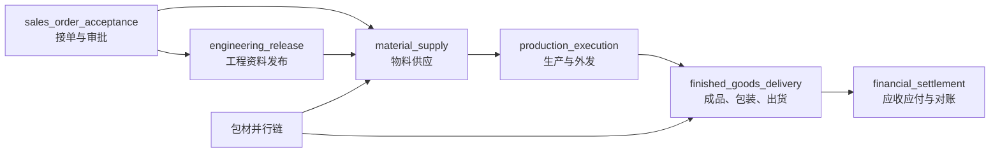

这些流程通过 `sales_order_id`、`business_ref_id` 和 `correlation_key` 关联。订单看板聚合它们的里程碑和风险，但它们各自版本化、失败和恢复。

### 15.2 `sales_order_acceptance`

| 顺序 | 节点 | 类型 | 责任池 | 需要能力/动作 |
| --- | --- | --- | --- | --- |
| 1 | 业务接单 | 领域命令 + 人工任务 | `order_intake` | `sales_order.create/update/submit` |
| 2 | 老板审批 | approval | `order_approval` | `sales_order.approve/reject` |
| 3 | PMC 订单评审 | human_task | `order_review` | `planning.order_review.confirm` |
| 4 | 完成 | end | - | 发布订单已接受事件 |

退回只回到“订单补充”节点，不直接把已经生效的订单改回草稿。若订单已激活，后续变更走订单变更命令和版本，而不是复用审批退回。

### 15.3 `engineering_release`

| 顺序 | 节点 | 类型 | 责任池 | 需要能力/动作 |
| --- | --- | --- | --- | --- |
| 1 | 工程资料准备 | human_task | `engineering_data` | `engineering.document.edit` |
| 2 | BOM/工艺发布 | domain_command | `engineering_data` | `bom.release` / `process.release` |
| 3 | 资料审批 | approval | `engineering_release_approval` | `engineering.document.approve` |
| 4 | 退回修订 | human_task | `engineering_revision` | `engineering.document.edit` |
| 5 | 完成 | end | - | 发布工程版本已释放事件 |

边界：工程审批只批准某一明确版本；已经进入采购或生产的版本不能被静默覆盖。

### 15.4 `material_supply`

主料、辅料和包材可并行：

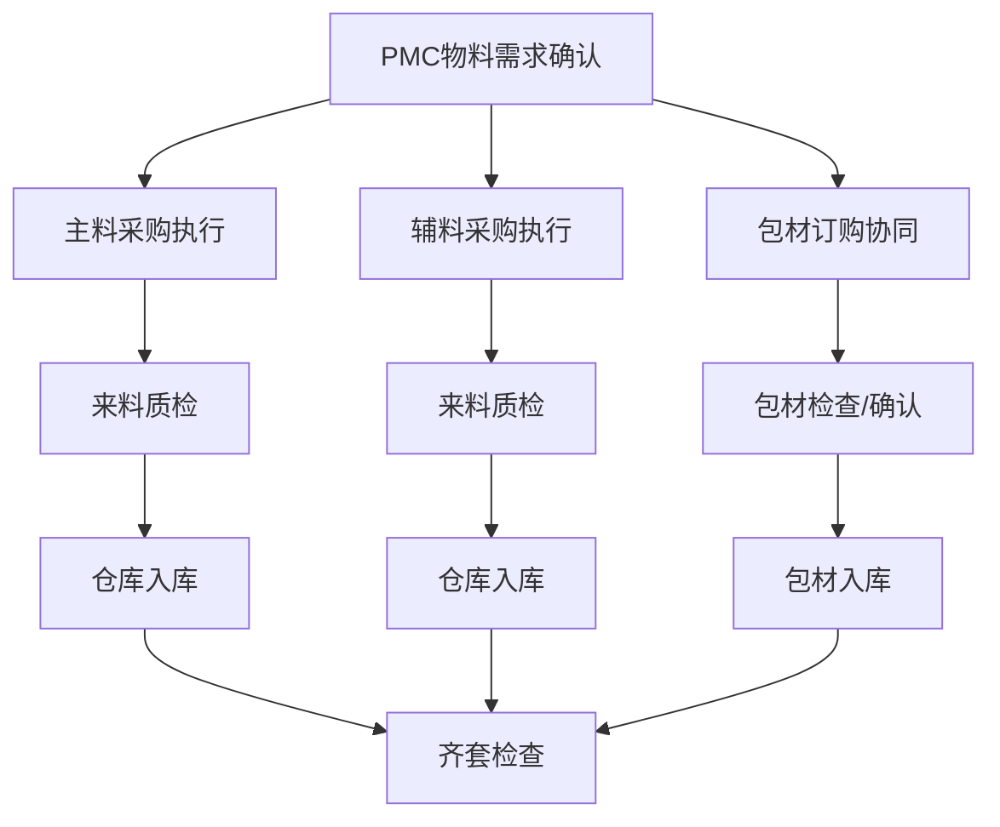

永绅默认责任映射：

| 责任池 | 永绅角色 |
| --- | --- |
| `material_requirement` | `pmc` |
| `purchase_order_entry` | `finance`，需业务确认后启用 |
| `procurement_execution` | `purchase` |
| `supplier_followup` | `purchase` |
| `packaging_material_order` | `sales` |
| `packaging_material_qc` | `sales`，第一阶段作为受控协同检查 |
| `incoming_qc` | `quality` |
| `warehouse_receiving` | `warehouse` |
| `material_readiness` | `pmc` |
| `purchase_quality_exception` | `purchase` + `quality` 分别处理自己的动作 |

“财务录采购单”与“采购执行”必须是两个节点和两组能力，不能因为财务录单就让财务拥有供应商跟进、采购审批、入库或应付过账的全部能力。

### 15.5 `production_execution`

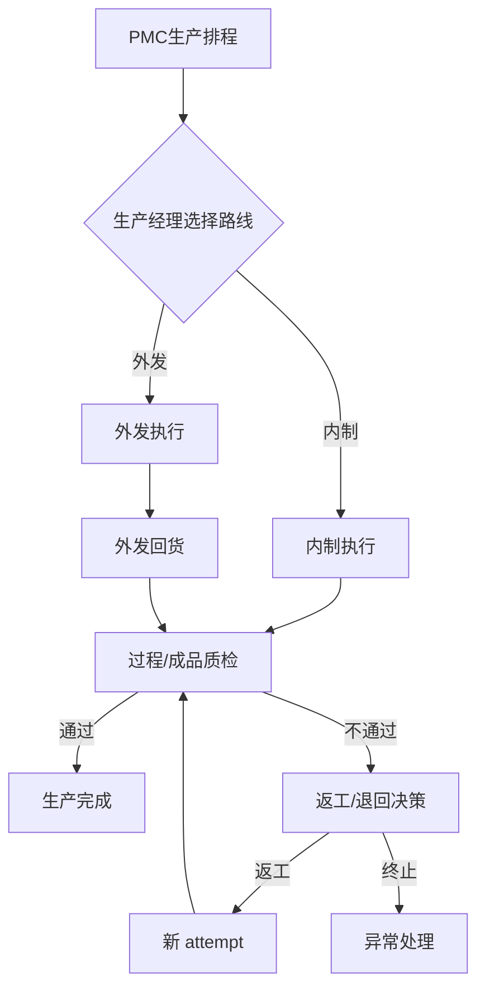

永绅默认责任映射：

| 责任池 | 永绅角色 |
| --- | --- |
| `production_scheduling` | `pmc` + `production` 各自承担不同动作 |
| `sewing_route_decision` | `production` |
| `handwork_route_decision` | `production` |
| `inhouse_sewing` | `production` |
| `inhouse_handwork` | `production` |
| `external_sewing` | `outsource_coordinator`；未设独立账号时临时映射 `production` |
| `external_handwork` | 同上 |
| `outsource_followup` | `outsource_coordinator` |
| `cut_piece_qc` | `quality` |
| `shell_qc` | `quality` |
| `finished_goods_qc` | `quality` |
| `rework_decision` | `production`，质量只提交判定和缺陷事实 |

返工必须创建新的 attempt，并保留原检验和原任务记录。不要覆盖上一次结果。

### 15.6 `finished_goods_delivery`

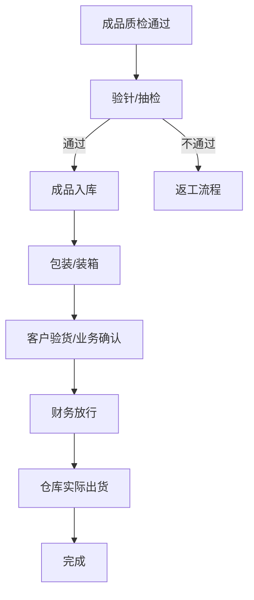

永绅默认责任映射：

| 责任池 | 永绅角色 |
| --- | --- |
| `finished_goods_qc` | `quality` |
| `needle_inspection` | `quality` |
| `sample_inspection` | `quality` |
| `finished_goods_inbound` | `warehouse` |
| `packaging_execution` | 第一阶段 `warehouse`；有独立包装账号后映射 `packaging_operator` |
| `carton_packing` | 同上 |
| `customer_inspection` | `sales`，质量提供检查事实支持 |
| `shipment_preconfirm` | `sales` |
| `finance_release` | `finance` |
| `shipment_execution` | `warehouse` |

财务放行和实际出货必须是两个 command。财务只能改变放行事实，仓库只能在放行有效、库存和出货单状态都满足时执行出货。

### 15.7 `financial_settlement`

| 节点 | 责任池 | 业务事实 |
| --- | --- | --- |
| 应收登记 | `ar_registration` | 应收来源和金额 |
| 应付登记 | `ap_registration` | 应付来源和金额 |
| 发票登记 | `invoice_registration` | 发票及来源关系 |
| 收付款确认 | `cash_confirmation` | 业务收付款状态 |
| 对账 | `reconciliation` | 对账差异和处理结果 |

当前模块应继续定位为“业务财务事实和对账”，不扩展成总账、凭证、税控和完整成本核算。

### 15.8 看板只做投影

订单看板可以显示：

```text
工程已发布
主料缺 2 项
包材待确认
外发车缝进行中
成品质检阻塞
财务未放行
计划交期风险高
```

这些信息来自各流程实例和领域事实的投影，不回写成一个万能 `business_status_key`。

---

## 16. A 甲方和 B 甲方岗位不同，如何不改核心流程

假设同一个行业流程模板包含以下责任池：

```text
purchase_order_entry
packaging_material_qc
packaging_execution
outsource_coordination
finance_release
```

不同客户只改映射：

| 责任池 | 永绅/A 甲方 | B 甲方 |
| --- | --- | --- |
| `purchase_order_entry` | `finance` | `purchase` |
| `packaging_material_qc` | `sales` | `quality` |
| `packaging_execution` | `warehouse` | `packaging_operator` |
| `outsource_coordination` | `outsource_coordinator` | `purchase` |
| `finance_release` | `finance` | `finance_manager` |

配置示例：

```yaml
#### A 甲方
roles:
  sales:
    bundles: [sales_operator, workflow_worker]
    grants: [packaging.material.inspect]
    workPools: [order_intake, packaging_material_qc]

  finance:
    bundles: [finance_controller, workflow_worker]
    grants: [purchase.order.create, purchase.order.update]
    revokes: [purchase.order.approve, warehouse.inbound.confirm, shipment.ship]
    workPools: [purchase_order_entry, finance_release, reconciliation]

workPools:
  packaging_execution:
    roles: [warehouse]
```

```yaml
#### B 甲方
roles:
  quality:
    bundles: [quality_inspector, workflow_worker]
    grants: [packaging.material.inspect]
    workPools: [incoming_qc, packaging_material_qc, finished_goods_qc]

  purchase:
    bundles: [procurement_buyer, workflow_worker]
    workPools: [purchase_order_entry, procurement_execution, outsource_coordination]

  packaging_operator:
    bundles: [packaging_operator, workflow_worker]
    workPools: [packaging_execution, carton_packing]
```

流程定义仍然是：

```yaml
- key: package_material_check
  ownerPool: packaging_material_qc
  requiredCapability: packaging.material.inspect
```

无需出现：

```text
if customer == yoyoosun then sales
else if customer == B then quality
```

也无需复制两份流程。

### 16.1 什么时候允许做客户流程变体

只有当岗位映射不能表达差异时，才选择批准的流程变体。例如：

```text
A 甲方：出货必须财务放行
B 甲方：低于某信用风险等级可自动放行
```

核心可以提供：

```text
shipment_release.required
shipment_release.policy_based
```

B 甲方选择第二种命名策略；不能在配置里写任意金额表达式。

### 16.2 什么时候应该新增行业能力

一个需求满足以下任一条件时，可以进入行业候选：

- 第二个真实客户也需要；
- 属于毛绒行业稳定事实，例如验针；
- 已有领域模型可以自然表达；
- 能被测试且不会破坏既有客户。

只有永绅需要的岗位称呼、打印样式、Excel 列和内部交接习惯，留在永绅配置包。

---

## 17. 最小运行时数据结构和 API

不要一次性重做全部 RBAC 和 workflow 表。建议兼容迁移。

### 17.1 定义存文件，实例存数据库

```text
Git/配置文件：能力目录、页面字段目录、角色模板、客户 profile、流程定义、表单 profile
数据库：用户角色、有效授权项、责任池成员、流程实例、节点实例、任务、事件和配置 revision
```

第一阶段不要把任意流程定义 JSON 存进数据库并在线修改。

### 17.2 模块有效清单

模块定义和依赖保存在产品代码/manifest 中；客户只保存编译后的有效状态。不要提供通用“上传、安装、卸载插件”数据表。

编译后的 manifest 至少包含：

```text
effective_modules
  module_key
  state                 # enabled / read_only / disabled
  contract_version
  maturity
  manifest_hash
  enabled_features      # 仅允许登记过的有限 feature key
  config_revision
```

运行时可把它加载到内存，并在 `config_revisions` 中保存完整快照或 hash。若管理员需要 SQL 查询，可物化为只读 `deployment_module_states` 表，但该表不能绕过配置发布流程手工编辑。

模块状态变化必须写审计：

```text
before_state
after_state
operator
reason
active_process_count
open_task_count
config_revision
```

### 17.3 角色和授权

保留现有：

```text
roles
permissions
admin_user_roles
```

新增或演进为：

```text
role_entitlements
  id
  role_id
  capability_key
  scope_type
  scope_ref             # ALL 时为空；其他类型为仓库/客户/供应商/责任池 key
  config_revision
  enabled
```

迁移期间，现有 `role_permissions` 可编译成 `scope_type=ALL` 的授权项，但必须审查高风险写权限，不能无脑全部转为 ALL。

不建议第一版支持运行时 deny 行。客户 profile 中的 revokes 在编译期消解，运行时只保存最终正向 entitlement，减少解释复杂度。

### 17.4 责任池

```text
work_pools
  key
  label
  enabled
  config_revision

work_pool_role_bindings
  work_pool_key
  role_id
  enabled
```

若需要仓库等范围，仍通过角色 entitlement 判断；责任池绑定本身不附带能力。

### 17.5 流程实例

```text
process_instances
  id
  process_key
  process_version
  variant_key
  config_revision
  definition_hash
  module_contract_snapshot
  business_ref_type
  business_ref_id
  correlation_key
  status
  started_at
  completed_at
  created_by
```

### 17.6 节点实例

```text
process_node_instances
  id
  process_instance_id
  node_key
  node_type
  attempt
  status
  owner_pool_key
  required_capability
  form_profile_key
  policy_snapshot
  due_at
  started_at
  completed_at
  outcome
  version
```

### 17.7 任务表演进

现有 `workflow_tasks` 逐步增加：

```text
process_instance_id
node_instance_id
owner_pool_key
required_capability
form_profile_key
action_set_key
outcome
claimed_by
claimed_at
idempotency_key
config_revision
version
```

`owner_role_key` 可暂时保留用于旧任务和展示，但新任务以 `owner_pool_key` 为主；最终不再由流程逻辑写死角色。

### 17.8 事件和审计

```text
process_events
  process_instance_id
  node_instance_id
  task_id
  event_key
  actor_user_id
  authorization_role_id
  entitlement_id
  capability_key
  before_state
  after_state
  outcome
  reason
  payload_summary
  config_revision
  created_at
```

只存必要的审计摘要和业务引用，不把整份敏感表单无限复制进事件表。

### 17.9 配置 revision

```text
config_revisions
  revision
  customer_key
  product_version
  industry_version
  customer_package_version
  module_manifest_hash
  manifest_hash
  status
  published_by
  published_at
```

### 17.10 Outbox

仅用于通知、Webhook 等外部副作用：

```text
domain_outbox
  event_id
  event_key
  aggregate_type
  aggregate_id
  payload
  attempts
  available_at
  processed_at
```

同一数据库内的业务事实和流程推进优先放同一事务，不为了“事件驱动”强行全部异步化。

### 17.11 前端会话投影

`get_effective_session` 建议返回：

```json
{
  "configRevision": "2026.06.25.1",
  "customer": { "key": "yoyoosun", "name": "永绅" },
  "modules": {
    "sales": "enabled",
    "shipping": "enabled",
    "production": "read_only"
  },
  "roles": ["sales"],
  "pages": ["sales.orders", "workflow.tasks"],
  "actions": ["sales_order.create", "sales_order.submit"],
  "workPools": ["order_intake", "packaging_material_qc"],
  "fieldPolicies": {
    "sales_order.form": {
      "customer_id": { "visible": true, "editable": true },
      "cost_price": { "visible": false, "editable": false }
    }
  }
}
```

这个返回值用于 UI 投影，不替代后端逐请求授权。

### 17.12 任务 API

建议目标接口：

```text
list_my_tasks(filters, cursor)
get_task(task_id)
claim_task(task_id, expected_version)
start_task(task_id, expected_version)
complete_task_action(task_id, action_key, payload, idempotency_key, expected_version)
return_task_to_pool(task_id, reason)
reassign_task(task_id, user_id, reason, expires_at)
urge_task(task_id, message)
```

服务器根据 `action_key` 查节点定义和命令 handler；客户端不能传下一节点、下一角色或下一状态。

### 17.13 授权解释接口

至少为管理员和支持人员提供：

```text
explain_page_access(user, page)
explain_action_access(user, capability, resource)
explain_task_assignment(task)
```

返回：

```text
是否允许
命中的角色和 entitlement
范围匹配原因
责任池资格
流程/节点/配置版本
拒绝在哪一层发生
```

这不是锦上添花。多甲方上线后，没有解释能力，支持团队会把大量时间浪费在猜权限和猜配置上。


### 17.14 模块状态与解释 API

只需要少量只读/发布接口：

```text
get_effective_modules()
explain_module_status(module_key)
validate_customer_config(candidate_revision)
publish_customer_config(candidate_revision)
rollback_customer_config(target_revision)
```

`explain_module_status` 至少返回：

```text
产品是否包含该模块
产品成熟度
客户部署状态
依赖是否满足
当前角色/流程/页面引用
在途流程和未完成任务数量
为什么不能启用或关闭
```

不要提供普通运行时 `install_module`、`uninstall_module`、`upload_plugin` API。模块状态只能通过受审计的配置发布改变。

---


---

## 17A. Ent / Atlas 落地设计：保留对象设计，不把手写 SQL 当实施入口

本节替代上一版的 `CREATE TABLE / ALTER TABLE` 草案。

原则：

```text
真正落地走 Ent schema + Atlas migration；
手写 SQL 不进入实施清单；
每轮只做一个可验证闭环；
领域事实表仍由各模块 usecase 负责；
Workflow / 配置 / 审计表只负责协同、解释和追责，不替代库存、质检、出货、财务事实。
```

### 17A.1 当前阶段不大改已有事实表

已有事实表先继续作为真源，例如：

```text
customers / suppliers / contacts
products / product_skus / materials / units / warehouses
bom_headers / bom_items / processes
sales_orders / sales_order_items
purchase_orders / purchase_order_items / purchase_receipts / purchase_returns
quality_inspections
inventory_txns / inventory_balances / inventory_lots / stock_reservations
outsourcing_orders / outsourcing_order_items / outsourcing_facts
production_facts
shipments / shipment_items
finance_facts
workflow_tasks / workflow_task_events / workflow_business_states
roles / permissions / role_permissions / admin_user_roles
runtime_audit_events / runtime_markers
```

第一阶段新增或演进的对象只围绕：

```text
配置 revision；
模块状态；
角色 profile；
entitlement；
责任池；
流程实例；
节点实例；
任务实例增强字段；
业务审计；
outbox。
```

不要顺手重建库存、采购、质检、财务整套 schema。

### 17A.2 Ent schema 对象清单

| Ent schema | 目的 | 第一阶段字段重点 | 边界 |
| --- | --- | --- | --- |
| `CustomerConfigRevision` | 记录客户有效配置版本 | customer_key、revision、product_version、config_hash、compiled_snapshot、status、published_by、published_at | 不保存 secret；不让人工编辑 compiled snapshot |
| `DeploymentModuleState` | 记录模块 enabled/read_only/disabled | customer_key、config_revision、module_key、contract_version、state、reason | 菜单隐藏不等于模块关闭 |
| `RoleProfile` | 当前配置版本下可分配角色 | customer_key、config_revision、role_key、display_name、disabled、bundle_keys、grants、revokes | 不作为业务岗位硬编码入口 |
| `AccessEntitlement` | capability + scope 授权项 | role_key、capability_key、scope_type、scope_value、constraints、enabled | 不能跨角色拼能力和范围 |
| `WorkPool` | 稳定业务责任池 | pool_key、module_key、display_name、description | 不自动授予能力 |
| `WorkPoolMembership` | 责任池到角色/人员映射 | pool_key、role_key、user_id、strategy、priority、enabled | 不写流程图，不写领域事实 |
| `ProcessInstance` | 流程实例 | process_key、process_version、variant_key、config_revision、business_ref、correlation_key、status、definition_hash | 创建后固定结构版本 |
| `ProcessNodeInstance` | 节点实例 | node_key、node_type、attempt、status、owner_pool_key、required_capability、form_profile_key、due_at、outcome、version | 不保存库存/财务事实 |
| `WorkflowTask` 增强 | 人工任务 | process_instance_id、node_instance_id、owner_pool_key、required_capability、form_profile_key、action_set_key、outcome、claimed_by、config_revision、version、idempotency_key | `owner_role_key` 仅兼容旧任务 |
| `BusinessAuditEvent` | 业务动作审计 | module_key、command_key、source_type/id/no、actor_user_id、authorization_role_key、entitlement_id、capability_key、before/after/diff、request_id、idempotency_key | append-only；脱敏；不存 token 和大文件 |
| `OutboxEvent` | 外部副作用投递 | event_type、aggregate_type/id、payload、status、retry_count、next_retry_at | 不替代同库事务内的业务事实 |

### 17A.3 字段设计规则

```text
金额使用 decimal / numeric 类型，不用 float；
时间统一 timestamptz，UI 按部署时区展示；
业务对象必须有 version 或 updated_at 支撑并发控制；
高风险命令必须有 idempotency_key；
config_revision 必须能追到当时的角色、流程、模块和字段策略；
JSONB 只放快照、配置、审计摘要和非核心查询字段，不替代关键字段；
历史 key 不硬删除，只 disabled/deprecated；
客户配置不创建表、不删表、不改迁移。
```

### 17A.4 索引和唯一约束设计重点

不要在 MD 中写可直接复制的 SQL，但 Ent/Atlas migration 必须体现下面约束：

| 对象 | 必要约束/索引 |
| --- | --- |
| `CustomerConfigRevision` | `(customer_key, revision)` 唯一；active revision 快速查询 |
| `DeploymentModuleState` | `(customer_key, config_revision, module_key)` 唯一 |
| `RoleProfile` | `(customer_key, config_revision, role_key)` 唯一 |
| `AccessEntitlement` | `(customer_key, config_revision, role_key, capability_key, scope_type, scope_value)` 唯一；授权 lookup 索引 |
| `WorkPool` | `(customer_key, config_revision, pool_key)` 唯一 |
| `WorkPoolMembership` | `(customer_key, config_revision, pool_key, role_key, user_id)` 去重 |
| `ProcessInstance` | business_ref + process_key + idempotency_key 去重 |
| `ProcessNodeInstance` | process_instance + node_key + attempt 唯一 |
| `WorkflowTask` | source + node + owner_pool + idempotency_key 去重；active task 查询索引 |
| `BusinessAuditEvent` | event_key 唯一；source、actor、time 查询索引 |
| `OutboxEvent` | pending + next_retry_at 查询索引 |

### 17A.5 Atlas migration 流程

每次 schema 改动必须走：

```text
1. 修改 Ent schema；
2. 生成 Atlas migration；
3. 本地空库 migrate；
4. 本地带 demo seed migrate；
5. 永绅样例库 migrate dry-run；
6. 回滚/前滚说明；
7. repo/usecase 测试；
8. 黄金闭环测试；
9. 部署 preflight 引用该 migration 版本。
```

一轮只做一个闭环。不要一轮把所有表、所有角色、所有流程都加完。

### 17A.6 迁移分段

建议分三步：

```text
M1：配置与角色最小闭环
CustomerConfigRevision / RoleProfile / AccessEntitlement / WorkPool / WorkPoolMembership

M2：Workflow 新实例闭环
ProcessInstance / ProcessNodeInstance / WorkflowTask 增强字段 / ProcessEvent

M3：审计与 outbox
BusinessAuditEvent / OutboxEvent / 审计查询页面 / 导入批次审计
```

每个 migration 都必须有：

```text
为什么需要；
影响哪些现有表；
旧数据如何填默认值；
失败如何前滚；
是否影响在途任务；
是否需要停机窗口。
```

### 17A.7 旧表兼容策略

```text
workflow_tasks.owner_role_key：保留读兼容，新任务以 owner_pool_key 为主；
workflow_business_states：保留旧看板读模型，不再作为新流程真源；
role_permissions：迁移期可编译为 scope=global 的 entitlement，但高风险写权限必须人工审查；
BuiltinRoles：保留 seed/兼容，不作为客户角色唯一合法性；
runtime_audit_events：保留系统控制面审计，业务动作逐步进入 BusinessAuditEvent。
```

### 17A.8 不允许的落地方式

```text
不把本 MD 里的对象说明转成手写 SQL 直接上线；
不让客户配置包携带 migration；
不按客户条件执行不同数据库迁移；
不为了关闭模块删除表；
不把 JSONB 当万能字段承载库存、财务、质检真源；
不允许脚本绕过领域 usecase 直接修事实表。
```


## 17B. 审计设计：不是日志，是责任链

### 17B.1 审计必须回答的问题

任何关键动作都要能回答：

```text
谁做的？
他当时用的是哪个角色/授权项？
他有什么能力和数据范围？
按哪版客户配置？
对哪个业务对象做了什么命令？
动作前是什么？动作后是什么？
成功还是失败？失败原因是什么？
是否由导入、系统自动节点、管理员代理或 break-glass 触发？
```

### 17B.2 审计分类

| 审计类型 | 表 | 示例 |
| --- | --- | --- |
| 系统控制面审计 | `runtime_audit_events` 或 `system_audit_events` | 创建账号、分配角色、发布配置、回滚配置、启停模块 |
| 业务命令审计 | `business_audit_events` | 提交订单、发布 BOM、采购入库、质检判定、确认出货、财务过账 |
| 流程任务审计 | `workflow_task_events` | 任务创建、指派、完成、阻塞、退回、催办、升级 |
| 导入审计 | `business_audit_events` + import batch | dry-run、正式导入、失败行、操作者 |
| 打印/导出审计 | `business_audit_events` 或专项 export_events | 打印模板、导出范围、字段脱敏 |
| 运维审计 | runtime/system audit | 备份、恢复、数据修复、break-glass |

### 17B.3 必审动作

| 模块 | 必须审计 |
| --- | --- |
| 权限 | 账号创建、启停、重置密码、角色绑定、权限变更、配置发布、配置回滚 |
| 销售 | 订单创建、提交、激活、关闭、取消、订单行变更 |
| 工程 | 产品/SKU 变更、BOM 发布/作废、工程资料版本发布 |
| 采购 | 采购订单提交/确认/取消、供应商变更、价格变更 |
| 质检 | 判定、复检、让步接收、不合格处理、附件上传 |
| 库存 | 入库、出库、调整、冲正、预留、释放、批次状态变化 |
| 生产 | 完工、返工、异常关闭、生产路线变更 |
| 出货 | 放行、确认发货、取消已发货、出货行变更 |
| 财务 | 应收/应付过账、结清、取消、发票登记、对账差异 |
| 流程 | 任务创建、完成、退回、阻塞、催办、升级、改派 |
| 导入 | dry-run、正式提交、失败行、跳过行、覆盖行为 |
| 打印导出 | 带值打印、敏感导出、大批量导出 |

### 17B.4 审计字段要求

```text
actor_user_id             # 操作者
authorization_role_key    # 服务端授权命中的角色，不由前端传
entitlement_id            # 命中的授权项
capability_key            # 使用的能力
config_revision           # 配置版本
command_key               # 命令
source_type/source_id     # 业务对象
before_json/after_json    # 脱敏后的前后摘要
idempotency_key           # 幂等键
request_id                # 链路排查
result/reason             # 成功/失败和原因
```

### 17B.5 脱敏和存储边界

审计不保存：

```text
密码
token
完整密钥
完整身份证/银行卡等敏感信息
大文件内容
原始 Excel 全量内容
```

审计可以保存：

```text
业务 ID
单号
字段变更摘要
脱敏后的手机号/邮箱
附件 hash 和引用 ID
导入批次号
```

### 17B.6 审计与日志的区别

```text
日志：给开发排查系统问题，可以采样、轮转、清理；
审计：给业务追责和合规，不允许普通修改删除，必须可按业务对象查询。
```

### 17B.7 Break-glass 超级权限

生产必须允许紧急修复，但要强审计：

```text
1. 普通 admin 不自动拥有业务权限；
2. break-glass 必须显式启用、填写原因、设置有效期；
3. 每个动作写审计；
4. 到期自动失效；
5. 事后出报告。
```

### 17B.8 审计查询页面

P17 审计页面至少支持：

```text
按单号查；
按来源类型和 ID 查；
按操作者查；
按角色/能力查；
按命令查；
按配置 revision 查；
按时间范围查；
查看 before/after 摘要；
导出审计报告，但导出本身也要审计。
```

## 18. 还必须考虑、但很容易被忽略的问题

下面这些问题不是要做成大型平台，而是用最小控制避免以后失控。

### 18.1 稳定 key 和历史引用

必须长期稳定的 key：

```text
capability
page
field
role（客户部署内）
work_pool
process
node
form_profile
policy
command
```

显示名称可改，key 不随中文改名。上线后若要废弃：

```text
保留旧 key
标记 deprecated
提供 alias/迁移
历史记录继续可解释
```

不要直接改数据库历史 key。

### 18.2 配置版本不一致

前端品牌/菜单 overlay 与后端有效业务配置可能来自不同版本。启动时必须校验：

```text
customer_key 一致
config_revision 一致
product_version 兼容
```

不一致时，至少禁止写业务动作并明确告警；不能让旧前端按旧流程提交新后端。

### 18.3 角色数量爆炸

不要为每个任务创建一个角色：

```text
来料检验员
裁片检验员
成品检验员
验针员
```

如果是同一批人，只保留 `quality` 角色，加入多个责任池。只有人员、能力或数据范围真正不同，才拆角色。

### 18.4 能力数量爆炸

不要为所有字段和按钮创建权限。能力围绕后端业务 command 设计：

```text
quality.inspection.decide
warehouse.inbound.confirm
shipment.ship
```

成本价、银行信息、税务信息等少数敏感读取可单独能力；普通字段由表单策略和领域状态控制。

### 18.5 流程定义数量爆炸

不要为每个客户复制完整流程。优先顺序：

```text
责任池映射
-> 能力增减
-> 字段/表单覆盖
-> 命名策略变体
-> extension slot
-> 最后才是客户代码扩展
```

每出现一份客户流程副本，都要说明为什么前四种机制不能表达。

### 18.6 配置组合造成测试爆炸

客户配置不能提供几十个任意布尔开关。应提供少量经过认证的 profile/variant，例如：

```text
shipment_release: required | policy_based
purchase_entry_owner: purchase | finance
packaging_operator: warehouse | independent_role
```

每个客户维护几条黄金闭环测试，不穷举所有理论组合。

### 18.7 人员离职和孤儿任务

必须有定时检查：

```text
已领取任务的 assignee 已禁用
责任池没有合格成员
任务超过 due_at
自动节点失败超过重试次数
流程长时间没有推进
```

这些情况进入运维看板，不能默默卡住。

### 18.8 手工改数据库

客户上线后一定会出现“帮我把状态改一下”。禁止直接更新业务表或流程表。

应提供少量受控纠正命令：

```text
cancel/reopen（满足领域规则时）
reverse inventory transaction
reverse shipment
return task to pool
admin reassign task
repair projection
```

每个命令要求原因、权限和审计。读模型可重建，领域事实只能通过纠正/冲正。

### 18.9 批量导入不能绕过业务规则

Excel 导入、批量操作和脚本常常成为权限旁路。

规则：

```text
dry-run 只校验
commit 阶段逐条或批次调用同一领域 usecase
使用操作人的 entitlement
记录导入批次和错误
不直接 repo.Save 绕过状态和审计
```

### 18.10 打印和导出也有数据权限

页面不可见的成本、银行、税务字段，导出和打印也不能泄漏。打印模板必须声明需要的字段和能力，后端生成前再次过滤。

### 18.11 超级管理员越权

系统管理员不应自动成为业务全能角色。

必须处理紧急问题时，使用 break-glass：

```text
明确原因
限时
可选二次确认
完整审计
动作后通知
```

不要在 workflow 中不断增加 `if superadmin then allow` 的特殊分支。

### 18.12 隐私和敏感字段

第一阶段只做简单分级：

```text
普通业务字段
内部敏感：成本、利润、供应商价格
个人/财务敏感：银行、税号、联系方式
```

使用字段脱敏、导出控制和审计即可；不需要建设通用 DLP 平台。

### 18.13 模块成熟度与销售承诺

每个模块/流程 profile 必须标记：

```text
prototype
internal
pilot
production_ready
```

客户配置不能启用未达到允许级别的模块。生产排程、生产异常、shipping-release 等尚未形成完整业务闭环的页面，不得因为菜单存在就被售前承诺为正式能力。

### 18.14 业务规则与展示规则混淆

例如“包材检查由业务负责”是组织分工；“未检查的包材不能进入可用状态”才是业务规则。

前者放责任池映射，后者放领域/流程控制。不要把客户岗位名称写进领域规则。

### 18.15 流程取消与业务撤销

```text
取消协同流程 != 撤销采购入库
关闭任务 != 冲正库存
流程退回 != 删除财务事实
```

所有已过账事实必须走相应领域撤销命令。流程只反映和协调，不拥有事实。

### 18.16 报表和搜索不能成为新的真源

Dashboard、里程碑和统计可以重建。任何业务后续动作都应根据领域表和流程实例判断，不能根据某个前端统计字符串判断。

### 18.17 备份、恢复和升级兼容

每个客户独立部署仍要有：

```text
数据库备份和恢复演练
配置 manifest 备份
升级前 preflight
数据库迁移回滚或前滚方案
客户配置与产品版本兼容矩阵
```

这不需要建设发布平台，但必须进入标准部署包和验收清单。

### 18.18 源码包和构建产物可复现

每次交付至少验证：

```text
从源码 zip 可运行 QA
前后端 Dockerfile 引用文件全部存在
Node/pnpm/Go 版本固定
客户配置编译可重复
生成 manifest hash 一致
无客户 A 私有资料进入客户 B 包
```

当前缺失 overlay 脚本就是该门禁应拦住的问题。

### 18.19 菜单隐藏与模块关闭混淆

菜单隐藏只影响显示。真正模块关闭必须同时阻止：

```text
后端命令
角色能力授予
新流程节点
任务创建
页面投影
导入/打印入口
定时任务和外部事件订阅
```

否则会出现“看不见但仍能调用”的安全和数据一致性问题。

### 18.20 模块依赖循环和共享表

如果 sales 直接写 inventory 表、inventory 又直接改 shipping 表，目录看起来模块化，实际仍是耦合单体。必须明确 owning module，并用公开 command/query contract 交互。CI 应检查禁止的 import 路径和循环依赖。

### 18.21 模块关闭导致历史数据和在途任务失联

关闭模块前必须列出：

```text
运行中流程
未完成任务
未结清业务单据
外部订阅
报表和打印引用
角色 entitlement
```

存在这些引用时先进入 `read_only`，不能直接卸载、删表或删页面。

### 18.22 模块版本和配置版本混淆

```text
产品/模块代码版本：随软件发布
配置 revision：客户角色、流程选择和模块状态发布
流程 definition version：流程结构版本
业务对象 version：并发控制
```

四者必须分开记录。不要用一个 `version` 字段表达所有含义。

### 18.23 模块数量和商业套餐绑死

商业报价可以按模块形成套餐，但技术模块状态、用户角色权限和合同授权必须分开：

```text
合同决定客户买了什么
模块配置决定部署启用什么
RBAC 决定某个用户能做什么
```

不能因为客户购买了 shipping 模块，就让所有用户自动拥有出货权限。

### 18.24 独立模块发布造成兼容矩阵

当前团队不应让每个模块有独立版本、独立发布节奏和独立数据库迁移。否则十个模块很快形成大量组合。第一阶段所有模块随同一产品 release，只有 manifest contract version 用于校验。


---


---

## 18A. 本轮额外补充：容易疏忽但会造成大问题的点

### 18A.1 流程噪音

问题：流程节点太多，用户每天都在点“完成”，业务效率反而下降。

控制：

```text
无风险自动流转；
有跨岗位交接才建任务；
有异常/超时/差异才升级；
同一岗位连续动作合并成一个任务；
移动端只给一线展示当天待办。
```

### 18A.2 看板红点泛滥

问题：所有事都提醒，最后没人看。

控制：

```text
普通待办不推送，只进任务列表；
临期、超期、阻塞、关键路径才高亮；
老板只看重大异常和关键交期风险；
PMC 看全链路卡点，但不能被所有普通待办淹没。
```

### 18A.3 角色越来越多

问题：客户每提一个岗位就新建角色，最终几十个角色无法维护。

控制：

```text
先建责任池，不急着建角色；
岗位合并用 role -> pools；
岗位拆分用新增角色 profile；
不要为每个岗位复制菜单和移动端。
```

### 18A.4 字段越来越多

问题：每个客户都加字段，表单变成大杂烩。

控制：

```text
先判断是行业字段、客户 label、导入映射、打印字段还是备注；
只有影响业务事实和查询的字段才进领域表；
展示差异优先走字段策略；
证据类信息优先走附件/备注/扩展证据，不直接扩核心表。
```

### 18A.5 报表成为事实源

问题：报表为了方便拼字段，后来被业务拿来当真源。

控制：

```text
报表和看板只读；
字段必须标注来源表和更新时间；
报表不能被其他业务命令引用为事实来源。
```

### 18A.6 导入绕过权限

问题：Excel 导入直接写库，绕过状态机、审计和权限。

控制：

```text
dry-run 不写事实；
正式导入逐行调用领域命令；
每行带操作者、授权项、幂等键和审计；
失败行可重试但不能重复过账。
```

### 18A.7 打印和导出泄密

问题：页面不能看，但通过导出拿到敏感字段。

控制：

```text
导出字段也走字段策略和数据范围；
大批量导出写审计；
财务金额、供应商价格、客户价格可按角色脱敏。
```

### 18A.8 配置发布导致在途流程断裂

问题：流程定义改了，老单据卡在不存在的节点。

控制：

```text
流程实例绑定 process_version + config_revision；
老实例按老版本跑完；
只允许显式迁移；
删除节点前检查是否存在 active node/task。
```

### 18A.9 模块关闭导致历史数据消失

问题：客户关闭委外模块后，历史委外应付、库存、出货追溯断了。

控制：

```text
disabled = 不允许新建和推进；
readonly = 可查历史；
历史引用和审计永远可查；
关闭模块前必须检查在途流程。
```

### 18A.10 超级管理员变成后门

问题：admin 能做所有业务动作，职责分离失效。

控制：

```text
admin 管系统，不管业务；
break-glass 单独机制；
生产环境默认不分配 debug_operator；
高危动作必须双重确认和强审计。
```

### 18A.11 性能问题被流程放大

问题：任务看板、权限解释、字段策略每次实时计算，数据量上来后卡顿。

控制：

```text
有效配置编译成 snapshot；
用户 session 投影缓存；
任务看板读 projection；
复杂统计异步刷新；
列表分页和索引先设计。
```

### 18A.12 外部通知失控

问题：微信/短信/邮件推送一多就变成噪音，还可能泄露客户信息。

控制：

```text
第一阶段站内任务为主；
外部推送只推超时/阻塞/重大异常；
推送内容不带敏感明细；
通知模板版本化，发送留审计。
```

### 18A.13 客户二开无法回收

问题：客户专属逻辑越堆越多，产品核心无法升级。

控制：

```text
客户差异先进入 candidate；
第二客户也要再进 industry template；
第三客户也要再进 product core；
客户 extension 必须有 reason、affected_modules、review_date。
```

### 18A.14 测试组合爆炸

问题：模块组合、角色组合、流程变体太多，测试跑不完。

控制：

```text
只测试标准 demo、永绅、一个 A/B 差异客户；
能力和责任池做契约测试；
核心领域状态机做单测；
黄金闭环做端到端；
不穷举所有配置。
```

## 19. 建议的分阶段实现方案

原则：

```text
先堵边界，再建目录；
先三条黄金闭环，再全量迁移；
先 Ent/Atlas schema，再 runtime；
先客户配置包编译和导入门禁，再接第二客户；
不要一开始造完整 BPMN、插件市场、低代码或 SaaS 多租户。
```

### 阶段 P0：源码包自洽 + Workflow/RBAC 边界修复

目标：现有系统先不要继续扩大失控入口。

必须完成：

```text
1. 让 customer-config-boundaries QA 与 Dockerfile 对 overlay 脚本达成一致：恢复脚本或移除引用；
2. 普通 UI 不再调用 create_task / upsert_business_state；
3. actor_role_key 不再由客户端传，服务端按 entitlement 推导；
4. workflow list/detail 查询增加指派人、责任池和数据范围过滤；
5. update_task_status 收敛为 complete_task_action，服务端按节点 action_set 判断；
6. engineering 最小闭环：角色可分配、可登录、可看任务、可维护工程资料；
7. NormalizeAdminRoleKeys 不再只认 BuiltinRoles；
8. 建立最小业务审计字段：actor、role、capability、config_revision、command、source、before/after；
9. node --check / customer-config-boundaries / Docker build context / secret scan 纳入 release gate。
```

本阶段不做：

```text
完整 entitlement UI；
完整流程运行时；
完整模块注册平台；
移动端角色重做；
所有旧流程一次性迁移。
```

### 阶段 P1：目录、配置编译、客户配置包导入

目标：客户差异不再散在前后端代码和 README 中。

必须完成：

```text
1. 建 config/catalog：module、capability、page、field、work_pool、policy、command 稳定 key；
2. 建 config/schemas：customer package、module state、role profile、work pool、process variant、field policy；
3. 建 config/customers/demo：中性演示客户，不使用永绅数据；
4. 把 yoyoosun 从产品默认配置拆成客户配置包；
5. 实现 customer package validate -> compile -> preview -> publish -> activate -> rollback；
6. 生成 compiled effective manifest，并写入 CustomerConfigRevision；
7. 前端只消费 get_effective_session 的页面/字段/动作投影；
8. 客户配置包导入不能携带 JS/Go/SQL/secret/原始私密资料；
9. 导入报告、配置差异报告、失败原因和回滚目标必须可下载/可审计。
```

### 阶段 P2：Entitlement + 责任池最小运行时

目标：同一流程节点可以在 A/B 甲方分配给不同角色，同一角色能力可加减并带数据范围。

必须完成：

```text
1. RoleProfile 编译为 AccessEntitlement；
2. WorkPool / WorkPoolMembership 生效；
3. 授权算法使用同一 entitlement 同时匹配 capability + scope；
4. 任务候选人 = 责任池成员 + 具备 required_capability + 数据范围匹配；
5. 授权解释接口 explain_action_access / explain_task_assignment；
6. admin 不天然拥有业务能力；break-glass 单独审计。
```

### 阶段 P3：窄版流程运行时

只支持：

```text
human_task；
approval；
domain_command；
wait_event；
顺序；
命名策略分支；
fan-out / join；
returnTo；
blocked；
due_at；
idempotency_key；
expected_version。
```

必须完成：

```text
1. ProcessInstance / ProcessNodeInstance / WorkflowTask 增强字段；
2. 流程实例创建时固定 process_version、variant、config_revision、definition_hash；
3. 安全和人员配置实时生效；
4. 领域命令成功后推进流程；
5. 任务完成需要调用 action_set 中的白名单 command；
6. 旧 workflow_business_states 降级为看板投影，不再作为流程真源。
```

### 阶段 P4：只迁移三条黄金闭环

优先迁移：

```text
1. 销售订单提交 -> 老板审批 -> PMC 评审；
2. 采购收货 -> 来料质检 -> 仓库入库；
3. 成品质检 -> 财务放行 -> 仓库出货 -> 应收线索。
```

每迁移一条，必须删除对应前端串任务代码，避免永久双轨。

### 阶段 P5：测试部署和第二客户验证

目标：证明不是永绅定制项目。

必须做到：

```text
1. demo 与 yoyoosun 两个配置包可分别导入、编译、发布、回滚；
2. 第二客户只新增 customer package 和 deployment package，不 fork 代码；
3. A/B 客户同一责任池映射不同岗位，通过相同黄金闭环；
4. 模块关闭后 API、能力、流程、菜单、导入、打印、定时任务都被一致阻止；
5. 部署包包含 env.example、preflight、backup、restore、rollback、smoke test、验收报告；
6. 源码 zip 解压后 QA 可运行，Dockerfile 引用文件全部存在。
```

### 19.1 兼容迁移原则

```text
旧任务继续读 owner_role_key；新任务写 owner_pool_key；
旧 business_status_key 继续用于旧看板；新流程不依赖它；
旧 permission key 建 alias 和废弃计划；
旧 BuiltinRoles 保留 seed/兼容；新账号角色来自 effective role_profiles；
不一次性拆完 server/internal/biz；先把新流程放到 platform/process；
被迁移的领域命令逐步进入 modules/<module>/usecase；
每迁移一个闭环，就补一条黄金测试和一条回滚说明。
```


## 20. 测试、部署与客户配置包导入策略

ERP 产品化的测试目标不是穷举所有组合，而是保证：

```text
边界不会破；
配置能解释；
部署能复现；
导入不绕过规则；
三条黄金业务闭环稳定；
第二客户不 fork 代码。
```

### 20.1 测试分层

| 层级 | 测什么 | 触发时机 |
| --- | --- | --- |
| 静态目录测试 | module/capability/page/field/work_pool/policy/command key 是否唯一、是否被关闭模块引用 | 每次提交 |
| 客户包 schema 测试 | customer package 是否符合 schema、无未知 key、无 JS/Go/SQL/secret | 每次客户包变更 |
| 配置编译测试 | industry template + customer overlay 能否生成 effective manifest、hash、revision | 每次客户包变更 |
| 模块依赖测试 | 依赖无环、disabled/read_only/enabled 合法、成熟度允许 | 每次客户包变更 |
| RBAC 测试 | capability + scope 不跨角色拼接；责任池 + 能力 + 范围都满足才可处理 | 每次授权改动 |
| Workflow 测试 | claim/complete/idempotency/expected_version/return/block/join 正确 | 每次流程改动 |
| 领域状态机测试 | 订单、质检、库存、出货、财务状态合法迁移 | 每次领域改动 |
| 导入测试 | dry-run、错误行、匹配、重复导入、commit 幂等、审计 | 每次导入映射变更 |
| 部署测试 | env、secret、Docker build context、migration、health、smoke、rollback | 每次发布 |
| 黄金闭环测试 | demo、yoyoosun、A/B 差异客户完整业务链 | 每次 release candidate |

### 20.2 必跑 QA 清单

```text
node --check scripts/qa/customer-config-boundaries.mjs
node scripts/qa/customer-config-boundaries.mjs
node --check scripts/build/apply-customer-web-config.mjs    # 若选择保留 overlay
node scripts/qa/customer-package-lint.mjs --customer demo
node scripts/qa/customer-package-lint.mjs --customer yoyoosun
node scripts/qa/module-manifest-contract.mjs
node scripts/qa/workflow-definition-contract.mjs
node scripts/qa/frontend-backend-catalog-contract.mjs
node scripts/qa/no-customer-leakage.mjs --from demo --against yoyoosun
node scripts/qa/secrets.sh
```

Go / Ent / Atlas：

```text
go test ./...
atlas migrate lint / migrate diff / migrate apply dry-run
空库 migrate + demo seed
永绅样例库 migrate dry-run
```

前端：

```text
pnpm test
pnpm build:all
客户 effective session 下的菜单/字段/动作投影快照测试
```

Docker / 部署：

```text
docker build -f web/Dockerfile ...
docker build -f server/Dockerfile ...
preflight.sh
smoke.sh
backup.sh --dry-run
restore.sh --dry-run 或演练环境恢复
```

### 20.3 授权测试必须覆盖

```text
有能力但范围不匹配：拒绝；
范围匹配但没有能力：拒绝；
两个角色不能把能力和范围交叉拼接；
在责任池但无 required_capability：拒绝；
有 required_capability 但不在责任池：拒绝；
用户禁用后立即失去操作权；
制单人不能审批本人单据；
admin 不自动拥有库存调整、出货、财务过账；
模块 disabled 时，即使残留旧 entitlement 也拒绝写命令；
菜单隐藏不能作为后端安全边界。
```

### 20.4 状态、并发和幂等测试必须覆盖

```text
非法领域迁移拒绝；
重复 idempotency_key 不产生重复入库/出货/任务；
双人 claim 只有一人成功；
旧 expected_version 不能覆盖新状态；
业务命令失败时任务不能完成；
返工 attempt 有上限；
join ALL/ANY 正确；
流程取消不撤销已过账领域事实；
出货、库存、财务必须通过冲正/取消命令修正。
```

### 20.5 黄金闭环测试

每个客户至少维护这些闭环：

```text
订单审批通过与退回；
工程资料发布；
采购来料合格入库；
来料不合格退补货；
成品质检、财务放行、仓库出货；
外发回货与返工；
应收/应付登记与对账；
客户配置发布和回滚；
模块 read_only / disabled 历史查询。
```

每条闭环必须检查：

```text
领域事实；
任务责任池；
允许动作；
审计事件；
配置 revision；
流程 version；
看板投影；
导出/打印字段权限。
```

### 20.6 客户配置包导入设计

客户配置包不是代码包。它只允许声明产品已登记的 key。

推荐目录：

```text
config/customers/<customer>/
  customer.yaml              # 客户 key、显示名、品牌引用、配置包版本
  modules.yaml               # 模块 enabled/read_only/disabled
  roles.yaml                 # 角色 profile、bundles、grants、revokes、entitlement scopes
  work-pools.yaml            # pool -> role/user 映射
  processes.yaml             # 选择批准的流程 variant、SLA、optional slot
  fields.yaml                # 已登记字段的 label/visible/editable/required/masked
  menus.yaml                 # 菜单顺序和隐藏项，只控制 UI 投影
  imports/
    masterdata.mapping.yaml  # Excel 列到领域字段映射
    order.mapping.yaml
  prints/
    templates.yaml           # 打印模板选择和字段需求
  assets/
    logo.svg
    favicon.svg
  README.md
```

禁止包含：

```text
Go / JavaScript / SQL；
数据库迁移；
secret / token / 密码；
另一个客户名称和资料；
客户原始 Excel/PDF/图片；
可执行脚本；
未登记 module/capability/page/field/policy/command。
```

导入流程：


导入报告必须包含：

```text
新增/删除/禁用的角色；
新增/删除/禁用的责任池映射；
模块状态变化；
流程 variant 变化；
字段策略变化；
菜单变化；
导入映射变化；
可能影响的在途流程数量；
未完成任务数量；
发布人、发布时间、revision、hash；
回滚目标 revision。
```

### 20.7 客户业务数据导入设计

配置导入和业务数据导入必须分开。

业务数据导入分四类：

| 类型 | 示例 | 是否允许直接写库 | 规则 |
| --- | --- | --- | --- |
| 主数据导入 | 客户、供应商、材料、产品、SKU、BOM | 不允许直接写核心表 | dry-run 后调用主数据 usecase |
| 期初数据导入 | 期初库存、未结订单、未结应收应付 | 只能走专用期初 usecase | 必须锁定上线日期和批次 |
| 历史数据导入 | 旧订单、旧出货、旧对账 | 可作为只读历史，不能伪造成当前事实 | 标记 historical/imported，不参与新流程 |
| 交易数据导入 | 入库、出货、财务过账 | 高风险，默认不开放 | 必须逐条调用领域命令并审计 |

业务数据导入流程：

```text
1. 上传文件；
2. 读取映射；
3. dry-run：格式、必填、字典匹配、重复、权限、模块状态、字段策略；
4. 生成错误行、待确认匹配、风险提示；
5. 用户确认；
6. 生成 import_batch 和每行 idempotency_key；
7. commit：逐条或分批调用领域 usecase；
8. 记录业务审计和导入审计；
9. 失败行可修正后重试；
10. 导入完成生成报告。
```

关键边界：

```text
dry-run 不写事实；
commit 不绕过权限和领域状态机；
导入不能传 actor_role_key；
导入不能改配置 revision；
导入不能绕过模块 disabled/read_only；
期初库存必须有上线冻结窗口；
历史数据不能触发新流程和库存/财务当前余额。
```

### 20.8 部署包设计

每个客户部署包至少有：

```text
deployments/<customer>/
  env/.env.example
  env/README.md
  scripts/preflight.sh
  scripts/deploy.sh
  scripts/smoke.sh
  scripts/backup.sh
  scripts/restore.sh
  scripts/rollback.sh
  reports/deployment-report.template.md
  reports/acceptance-report.template.md
  reports/rollback-report.template.md
  README.md
```

部署前检查：

```text
Node / pnpm / Go / Docker / Compose 版本；
镜像 tag 不为 latest；
JWT secret 和数据库密码非默认；
SMS/mock/debug/seed 在生产关闭；
数据库可连接；
migration 版本匹配；
客户配置 revision 可编译；
Dockerfile 引用文件存在；
客户配置包不含 secret 和其他客户资料；
备份目录可写；
回滚目标存在。
```

部署后 smoke：

```text
登录；
get_effective_session；
模块状态解释；
菜单/字段投影；
创建 demo 任务或读取我的任务；
一条只读查询；
一条低风险写命令；
审计事件出现；
outbox worker 健康；
打印/导出权限过滤；
备份脚本 dry-run。
```

### 20.9 Release Gate

发布前必须同时满足：

```text
源码 zip 解压后 QA 能运行；
Dockerfile 引用文件都存在；
Ent/Atlas migration dry-run 通过；
demo 黄金闭环通过；
yoyoosun 黄金闭环通过；
至少一个 A/B 差异配置测试通过；
客户配置包导入和回滚通过；
模块 disabled/read_only 测试通过；
敏感字段导出/打印权限测试通过；
部署 preflight/smoke/backup/rollback 报告齐全。
```


## 21. 交付和维护边界

### 产品核心负责

```text
平台内核和静态模块运行时
业务模块 manifest、依赖和 module gate
能力目录
领域模型和状态机
命令处理器
授权算法
流程运行时
审计、幂等、事务
页面/字段稳定 key
配置编译和校验
```

### 毛绒行业模板负责

```text
行业默认模块组合
行业默认角色模板
责任池目录
流程族
质检类型
BOM/工艺/包材等行业字段 profile
行业黄金闭环
```

### 永绅配置包负责

```text
永绅模块 enabled/read_only/disabled 选择
永绅角色显示名和能力增减
责任池到角色映射
财务录采购单等确认后的职责差异
包材检查、包装和外发的岗位映射
永绅菜单/字段 label
导入映射和打印选择
```

### 永绅部署包负责

```text
环境参数
域名
数据库和备份
启用的 product release、customer package、module states 和 revision
部署、验收、回滚报告
```

### 客户原始资料负责

```text
原始 Excel/PDF/图片
访谈记录
客户个人信息
会议材料
验收证据
```

这些资料不进入可复制的产品核心源码包。

---

## 22. 本设计的验收标准

满足以下条件，才可以认为“多甲方角色、模块组合与流程编排”第一版成立：

1. 新客户不 fork 核心代码，只新增客户模块组合、profile 和部署包。
2. 后端存在真正的 module registry 和 module gate；隐藏菜单不再被当成模块关闭。
3. A/B 甲方可以把同一责任池映射给不同岗位，不改流程定义。
4. 普通前端无法任意创建任务、指定下游角色或写业务协同状态。
5. 每个任务都能解释：属于哪个流程/节点、需要什么能力、由哪个责任池负责、为什么该用户可处理。
6. 能力和数据范围以同一 entitlement 校验，不发生跨角色拼接越权。
7. 领域状态、流程状态、任务状态和 outcome 已分离。
8. 新配置只影响新流程结构；撤权和人员禁用立即生效；在途实例不会被静默迁移。
9. 角色和流程 key 稳定，历史记录可解释；角色不硬删除。
10. 一个通用移动工作台可服务工程、外发、包装等客户角色。
11. 客户配置不能启用未交付模块、隐藏后端必填字段或删除领域控制节点。
12. 三条优先闭环全部由后端推进，前端对应串任务代码已删除。
13. 配置有 revision/hash，可发布、回滚，并与前端运行时版本校验。
14. 离职用户、空责任池、超时任务和失败自动节点都有可见告警和处理办法。
15. 源码 zip 可通过客户配置 QA 和 Docker 构建引用检查。
16. 第二客户可以通过同一组黄金闭环测试。
17. A/B 客户可以使用不同模块组合和不同责任池映射，不修改核心代码。
18. 模块停用保留历史和审计；存在在途流程时不能直接切换为 disabled。
19. 所有模块随同一产品版本发布，不产生独立模块兼容矩阵。
20. 关闭模块后，其 API、能力、新任务、流程、定时作业和 UI projection 均被一致阻止。

---


---

## 22A. 完整性自检清单

这份设计用于指导实现时，必须逐项满足下面清单。

| 类别 | 是否覆盖 | 落点 |
| --- | --- | --- |
| 是否过度设计检查 | 已覆盖 | 第 0、3、4、19A 节 |
| 是否过于简单检查 | 已覆盖 | 第 0、2、5、6、17A 节 |
| ERP 提效原则 | 已覆盖 | 第 0、7、8、9、18A 节 |
| 模块组合/可插拔边界 | 已覆盖 | 第 4 节 |
| 角色能力加减分配 | 已覆盖 | 第 5、6、13、14、14A 节 |
| A/B 甲方职责差异 | 已覆盖 | 第 16 节 |
| 责任池设计 | 已覆盖 | 第 5、6、14、14A、17A 节 |
| 状态机设计 | 已覆盖 | 第 8、14A、17A 节 |
| 流程编排设计 | 已覆盖 | 第 7、9、15、17、17A 节 |
| 配置策略和扩展点 | 已覆盖 | 第 10、11、18 节 |
| 目录目的和边界 | 已覆盖 | 第 11 节，尤其 11.0 |
| 每个角色菜单 | 已覆盖 | 第 13、14、14A 节 |
| 每个角色字段 | 已覆盖 | 第 12、13、14、14A 节 |
| 每个角色可处理状态 | 已覆盖 | 第 14A 节 |
| 每个角色业务流程 | 已覆盖 | 第 13、14、14A、15 节 |
| 每个角色协同流程 | 已覆盖 | 第 13、14、14A、15 节 |
| SQL 设计 | 已覆盖 | 第 17A 节 |
| 审计设计 | 已覆盖 | 第 17B 节 |
| 领域设计 | 已覆盖 | 第 5A 节 |
| 实现过程 | 已覆盖 | 第 19、19A 节 |
| 容易忽略的大坑 | 已覆盖 | 第 18、18A 节 |
| 验收标准 | 已覆盖 | 第 22、19A 节 |

### 22A.1 本设计的最终判断

```text
不建议继续加重成 BPMN/低代码/动态插件平台；
也不能退化成菜单权限 + 角色 + 状态字符串；
最合理的复杂度是：静态模块 + 客户有效配置 + 能力/责任池 + 窄版流程运行时 + 领域状态机 + 审计。
```

### 22A.2 最小实现闭环

最小闭环不是“所有模块都可配”，而是：

```text
一个客户配置包能编译；
一个用户能根据角色看到不同菜单和字段；
一个流程节点能根据责任池分配给不同甲方的不同角色；
一个任务完成能调用后端领域命令；
一个领域命令能写事实、审计和流程推进；
一个关键动作能解释权限来源和配置版本；
第二客户接入不 fork 代码。
```

## 23. 立即执行清单

下面是本轮更新后的执行清单。只做这些，不扩张成大平台。

```text
P0：源码包和边界修复
[ ] 处理 scripts/build/apply-customer-web-config.mjs：恢复并测试，或移除全部引用；让 customer-config-boundaries QA 通过
[ ] 确认 .dockerignore 保留 scripts/build/**，Docker build context 与 Dockerfile 引用一致
[ ] 禁止普通 UI 调用 create_task / upsert_business_state；保留为后端内部或 admin repair
[ ] update_task_status 收敛为 complete_task_action，服务端按 action_set 和领域命令推进
[ ] actor_role_key 由服务端根据 entitlement 推导，客户端不再提交
[ ] workflow list/detail 增加 assignee / owner_pool / entitlement scope 过滤
[ ] engineering 最小可用：角色同步、账号分配、菜单、任务入口、工程资料能力
[ ] NormalizeAdminRoleKeys 改为读取 active role_profiles；BuiltinRoles 只作为 seed/兼容
[ ] 第 17A 的对象设计走 Ent schema + Atlas migration，不手写 SQL 直接落库
[ ] 补业务审计最小字段：actor、authorization_role、entitlement、capability、config_revision、command、source、before/after

P1：客户配置包和目录
[ ] 建 config/catalog：modules/capabilities/pages/fields/work-pools/policies/commands
[ ] 建 config/schemas：customer package、roles、work-pools、modules、fields、processes、imports、prints
[ ] 建 config/customers/demo 中性演示客户
[ ] yoyoosun 改成客户配置包，不作为产品默认核心
[ ] 实现 customer package validate -> compile -> preview -> publish -> activate -> rollback
[ ] 实现 compiled effective manifest、config hash、revision
[ ] 实现 get_effective_session，前端只消费页面/字段/动作投影
[ ] QA 检查客户包不含 JS/Go/SQL/secret/其他客户资料

P2：授权和责任池
[ ] RoleProfile 编译为 AccessEntitlement（capability + scope）
[ ] WorkPool / WorkPoolMembership 生效
[ ] 授权判断禁止跨角色拼能力和范围
[ ] 任务候选人按 owner_pool + required_capability + scope 计算
[ ] explain_action_access / explain_task_assignment / explain_module_status
[ ] admin 不自动拥有业务能力；break-glass 单独机制

P3：窄版流程运行时
[ ] ProcessInstance / ProcessNodeInstance / WorkflowTask 增强字段
[ ] 实现 human_task / approval / domain_command / wait_event / end
[ ] 实现顺序、命名策略分支、fan-out/join、returnTo、blocked、due_at
[ ] 实现 idempotency_key、expected_version、原子 claim
[ ] 旧 business_status_key 降级为看板投影，不参与新流程判断

P4：三条黄金闭环
[ ] 销售订单提交 -> 老板审批 -> PMC 评审
[ ] 采购收货 -> 来料质检 -> 仓库入库
[ ] 成品质检 -> 财务放行 -> 仓库出货 -> 应收线索
[ ] 每迁移一条，删除对应前端串任务代码
[ ] 每条闭环补领域事实、权限、流程、审计、配置 revision、看板投影测试

P5：测试部署和第二客户验证
[ ] 客户配置包导入 dry-run / publish / rollback
[ ] 主数据导入 dry-run / commit / 审计 / 失败重试
[ ] 部署包 env.example / preflight / smoke / backup / restore / rollback / 报告模板
[ ] demo 与 yoyoosun release gate 全部通过
[ ] A/B 客户职责差异测试通过：同一责任池映射不同角色，不改核心代码
[ ] 模块 disabled/read_only 阻止 API、能力、新流程、定时任务、导入、打印和 UI projection
```

最终判断规则仍然只有一句：

> 整个业务域是否存在用受控模块组合，岗位差异用角色和责任池，显示差异用页面字段配置，批准的步骤差异用流程 variant 和命名策略；库存、质检、出货、财务、审计和状态不变量永远留在产品核心，绝不通过动态插件、客户脚本或前端串任务改变。

