# 业务与协同流程地图 / Business and Collaboration Flow Map

本文用业务名称连接 Source Document、协同任务和领域 Fact，不使用 T1-T8 等编号，避免与测试验证层级混淆。当前自动运行能力仍以 ProcessRuntime、WorkflowUsecase、客户 active revision 和测试为准。

## 总图

```mermaid
flowchart LR
  sales["销售订单"] --> review["管理审批/资料确认"]
  review --> engineering["工程资料与 BOM"]
  engineering --> sourcing["采购订单 / 加工合同"]
  sourcing --> arrival["到货 / 回货"]
  arrival --> qc["质检 Fact"]
  qc --> inbound["入库 Fact"]
  inbound --> inventory["库存流水与余额"]
  inventory --> productionOrder["生产订单发布"]
  productionOrder --> scheduling["PMC 排程任务"]
  scheduling --> production["生产/委外执行 Fact"]
  production --> exception["REWORK 异常任务"]
  production --> finishedQc["成品质检 Fact"]
  finishedQc --> finishedInbound["成品入库 Fact"]
  finishedInbound --> shipmentDraft["出货草稿 / 可选成品质检"]
  shipmentDraft --> release["仓库出货放行任务"]
  release --> shipment["确认出货 Fact"]
  shipment --> settlement["应收/应付/对账"]
```

箭头表示业务依赖，不表示所有步骤都会自动生成任务。领域 usecase 成功后可生成必要交接任务，但任务完成不替代下一领域 Fact。

## 订单受理与工程齐套

| 项目 | 内容 |
| --- | --- |
| Source Document | 销售订单 |
| 责任角色 | sales → boss → engineering → pmc |
| 必要协同 | 销售提交、管理审批/退回、工程资料缺失、排期风险 |
| 自动动作 | 审批通过后按已发布 manifest 激活工程/PMC节点；拒绝记录原因并回退或阻塞 |
| 领域结果 | 销售订单仍按自身状态机生效；BOM/产品资料由工程 usecase 保存 |
| 禁止 | 审批完成直接生成生产、库存、出货或应收事实 |

## 工程需求到采购合同

| 项目 | 内容 |
| --- | --- |
| 来源 | 激活 BOM、销售订单需求或经批准的人工采购来源 |
| 责任角色 | engineering/pmc → purchase；永绅可由持有 purchase 角色的财务人员执行 |
| Source Document | 采购订单；主料和其他材料复用同一模型 |
| 必要协同 | 需求缺失、供应商未确认、价格/交期审批、异常催办 |
| 领域结果 | 采购订单批准只形成采购承诺 |
| 禁止 | 采购批准直接形成入库、库存余额或应付事实 |

## 加工合同与回货

| 项目 | 内容 |
| --- | --- |
| 来源 | 产品/BOM/生产需求 |
| 责任角色 | production/purchase → 加工商；回货后 quality → warehouse |
| Source Document | 加工合同；布料加工、车缝和手工复用同一模型，车缝 / 手工明细主体为产品，布料加工主体为材料 |
| 必要协同 | 下单确认、预计回货、延期/缺料、返工/补做 |
| 当前动作 | 已过账产品回货可由来源动作显式发起通用委外回货质检；当前没有车缝到手工的生产路线 runtime，委外不合格退回加工厂 / 返工处置也未闭环 |
| 领域结果 | 质检和入库分别由 Quality/Inventory/Purchase usecase 产生 |
| 禁止 | 回货跟踪任务 done 直接写入库、应付或结算 |

## 采购到货、质检与入库

| 项目 | 内容 |
| --- | --- |
| 来源 | 已批准采购订单/明细和到货数量 |
| 责任角色 | purchase/warehouse → quality → warehouse |
| 事实顺序 | 采购入库草稿 / 到货待检 → 逐行 IQC 判定 → POSTED → 库存流水 / 余额 |
| 必要协同 | 待检交接、质检不合格、数量差异、仓库阻塞 |
| 自动动作 | `material_supply` 可从采购订单创建收货草稿和逐行待检；全部合格 / 让步后才允许仓库执行正式入库领域动作 |
| 当前缺口 | 初始 IQC 不合格会阻断入库；现有采购退货只接受已过账入库后的追加不合格检验，首次到货退厂处置尚未闭环 |
| 禁止 | `inbound_done` 协同状态替代采购入库 POSTED，或把初始 IQC 拒绝伪装成已过账后的采购退货 |

## 生产排程、异常、成品质检与入库

| 项目 | 内容 |
| --- | --- |
| 来源 | 已发布生产订单、生产领料 / 完工 / REWORK 事实和完工申报 |
| 责任角色 | PMC 排程 → production 执行 / 异常 → quality → warehouse |
| 任务顺序 | 生产订单 `DRAFT -> RELEASED` 原子生成 `production_scheduling`；REWORK `DRAFT -> POSTED` 原子生成 `production_exception` |
| 事实顺序 | 领料 / 完工 / REWORK 过账 → 成品质检判定 → 成品入库 → 库存流水 / 余额 |
| 必要协同 | 排产确认、完工待检、返工异常、入库数量 / 库位异常 |
| 关闭条件 | 生产订单关闭要求排程任务 `done`；已发布订单取消要求排程任务 `done / rejected`；已过账 REWORK 冲销要求异常任务 `done / rejected` |
| 禁止 | 排程 / 异常 task done 直接写领料、完工、返工、报废、成品库存或财务事实；来源取消也不能把任务伪造成已完成 |

yoyoosun 已确认的客户业务主线是 `布料加工 → 裁片检验 → 车缝 → 皮套检验 → 手工 → 成品检验 → 包装入库`，车缝和手工分别由生产经理决定本厂或外发。该顺序当前是客户业务基线，不是 Product Core 已实现的 route / WIP runtime；不得从 `processes.sort_order`、两张委外合同或 Workflow task 顺序反向推导生产路线。

## 出货与业务结算

| 项目 | 内容 |
| --- | --- |
| 来源 | 销售订单、成品可用库存、装箱/出货资料 |
| 责任角色 | sales/finance 放行 → warehouse 出货 → finance 对账 |
| 事实顺序 | 出货草稿 → 可选的出货前成品检验侧链 → 提交出货放行 → 放行任务 `done` → SHIPPED → 库存扣减 → 应收 / 对账线索 |
| 出货前检验侧链 | 品质岗位可从尚未提交放行的 `DRAFT` 出货单按产品 / SKU、仓库和批次发起独立质检 Fact；未发起时按可选检验策略进入放行，一旦发起则必须在提交前合格或让步接收。放行提交后不再补造检验，避免改变任务依据 |
| 放行任务 | 出货单来源页显式生成 `shipment_release`，责任岗位 warehouse；完成只写 `shipping_released`，实际出货动作仍单独校验任务 `done` 并执行库存事务 |
| 必要协同 | 业务确认、财务放行、仓库执行、出货异常、对账差异 |
| 自动动作 | 只有真实 SHIPPED 后才能激活应收/对账交接 |
| 禁止 | `shipping_released`、任务 done、创建质检草稿或页面按钮提示等于 SHIPPED；出货前检验侧链不启动 `finished_goods_delivery` ProcessRuntime |

## 任务状态与处理结果

当前 Workflow task 持久化状态只表达工作进度：`ready / blocked / done / rejected`。审批、质检等领域结论写入对应业务 Fact 或 ProcessRuntime 节点 outcome，不能塞进任务状态冒充事实。原因在 `blocked / rejected` 时必填；终态任务不重新打开，需要返工时由真实来源创建新的 attempt。当前没有 `cancelled` 任务状态，来源取消必须按终态门禁 fail closed，不能偷用 `done / rejected` 伪造撤销。

三类来源任务使用 `workflow.source-task/v1`、确定性 task code、producer 与 intent hash；公开 `workflow.create_task` 拒绝这些保留任务组，模拟验收数据只使用 `trial_*`。任务与 created event、初始业务状态在来源事务内一起提交，不能出现来源成功而任务丢失。

## 自动化准入

允许自动：计算、校验、状态推导、幂等推进、创建必要下一交接任务、提醒/超时阻塞。

必须人工或领域命令：质检决定、让步接收、库存过账、出货、应收应付确认、发票、收付款和冲正。

任何新增自动流转都要同时证明：来源对象稳定、权限明确、模块 enabled、幂等键稳定、失败可恢复、审计可追踪、重复提交和取消/冲正有测试。
