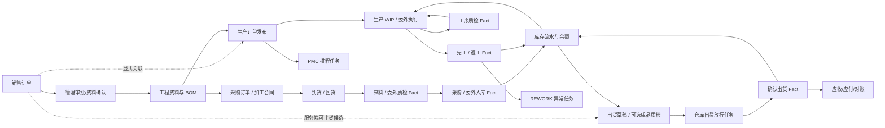

# 业务与协同流程地图 / Business and Collaboration Flow Map

本文用业务名称连接 Source Document、协同任务和领域 Fact，不使用 T1-T8 等编号，避免与测试验证层级混淆。当前自动运行能力仍以 ProcessRuntime、WorkflowUsecase、客户 active revision 和测试为准。

## 总图

箭头表示业务依赖，不表示所有步骤都会自动生成任务。领域 usecase 成功后可生成必要交接任务，但任务完成不替代下一领域 Fact。

## 订单受理与工程齐套

| 项目 | 内容 |
| --- | --- |
| Source Document | 销售订单 |
| 责任角色 | sales → boss → engineering → pmc |
| 必要协同 | 销售提交、管理审批/退回、工程资料缺失、排期风险 |
| 自动动作 | 审批通过后按已发布 manifest 激活工程/PMC节点；拒绝记录原因并回退或阻塞 |
| 领域结果 | 销售订单仍按自身状态机生效；BOM/产品资料由工程 usecase 保存 |
| 禁止 | 审批完成直接生成生产、库存、出货或应收事实 |

## 工程需求到采购合同

| 项目 | 内容 |
| --- | --- |
| 来源 | 激活 BOM、销售订单需求或经批准的人工采购来源 |
| 责任角色 | engineering/pmc → purchase；永绅可由持有 purchase 角色的财务人员执行 |
| Source Document | 采购订单；主料和其他材料复用同一模型 |
| 必要协同 | 需求缺失、供应商未确认、价格/交期审批、异常催办 |
| 领域结果 | 采购订单批准只形成采购承诺 |
| 禁止 | 采购批准直接形成入库、库存余额或应付事实 |

## 加工合同与回货

| 项目 | 内容 |
| --- | --- |
| 来源 | 产品/BOM/生产需求 |
| 责任角色 | production/purchase → 加工商；回货后 quality → warehouse |
| Source Document | 加工合同；布料加工、车缝和手工复用同一模型，车缝 / 手工明细主体为产品，布料加工主体为材料 |
| 必要协同 | 下单确认、预计回货、延期/缺料、返工/补做 |
| 当前动作 | 已确认合同行可显式生成委外发料 / 回货事实；已过账产品回货可发起委外回货质检。显式 `PLUSH_SEW_HAND_V1` WIP 可把外发批次绑定到合同行并办理回货；委外不合格可登记并确认返厂或创建返工 WIP，返厂写正式库存 OUT 且可冲正。当前新异常切片仍需目标发布与岗位 UAT |
| 领域结果 | 质检和入库分别由 Quality/Inventory/Purchase usecase 产生 |
| 来源追溯 | 页面按 `OUTSOURCING_ORDER` 返回委外订单、按 `OUTSOURCING_FACT` 返回对应订单 / 事实；导航只负责打开来源，不代替发料、回货、取消或质检动作 |
| 禁止 | 回货跟踪任务 done 或来源导航直接写入库、应付或结算 |

## 采购到货、质检与入库

| 项目 | 内容 |
| --- | --- |
| 来源 | 已批准采购订单/明细和到货数量 |
| 责任角色 | purchase/warehouse → quality → warehouse |
| 事实顺序 | 采购入库草稿 / 到货待检 → 逐行 IQC 判定 → POSTED → 库存流水 / 余额 |
| 必要协同 | 待检交接、质检不合格、数量差异、仓库阻塞 |
| 自动动作 | 直接领域命令与 `material_supply` 包装动作从采购订单创建收货草稿时，都在同一事务逐行建立待检 IQC；向收货草稿追加明细也必须绑定采购订单行并建立对应 IQC。全部合格 / 让步后才允许仓库执行正式入库领域动作 |
| 取消 / 反向 | 已过账入库取消、采购退货和采购调整分别形成反向 / 调整库存流水，保留原事实；页面和 Workflow 不直接改库存余额 |
| 异常处置 | 初始 IQC 不合格会阻断入库；品质可按精确收货行登记部分退厂或供应商补换，累计有效处置量不得超过来源行。补换确认形成新的待收草稿、HOLD 批次和待检链，原收货不因部分处置被整单取消 |
| 禁止 | `inbound_done` 协同状态替代采购入库 POSTED，把初始 IQC 拒绝伪装成已过账后的采购退货，或用整单取消掩盖部分退厂 / 补换 |

## 生产排程、异常、成品质检与入库

| 项目 | 内容 |
| --- | --- |
| 来源 | 已发布生产订单、冻结 BOM 物料需求、显式路线 WIP、生产领料 / 完工 / REWORK 事实和完工申报 |
| 责任角色 | PMC 排程 → production 执行 / 异常 → quality → warehouse |
| 任务顺序 | 生产订单 `DRAFT -> RELEASED` 原子生成 `production_scheduling`；显式路线行同时冻结 WIP 路线 / 初始批次；REWORK `DRAFT -> POSTED` 原子生成 `production_exception` |
| WIP 顺序 | `FABRIC_PROCESSING → SEWING → HANDWORK → PACKAGING`；拆批、内制 / 外发分配、开始、完成 / 回货、移交、返工和包材确认都走 `execute_production_wip_action`，不是 Workflow task 状态 |
| 质检顺序 | 工序完成或委外回货按冻结关口生成 `PRODUCTION_WIP / PRODUCTION_STAGE / WIP` 质检；`PASSED + PASS` 直接放行，`REJECTED` 进入返工或显式 WIP 让步申请；只有批准后再由独立执行动作落到 WIP 才能让步放行，未批准或只完成 Workflow 仍 fail closed |
| 事实顺序 | 领料 Fact → WIP / 分段质检 → 包装批次 `ACCEPTED` → 完工入库 Fact；完工后的 REWORK Fact 另走返工 / 异常链 |
| 必要协同 | 排产确认、工序交接、完工待检、返工异常、入库数量 / 库位异常 |
| 异常处置 | 报废、WIP 让步与超领先形成显式审批决定；批准只记录决定或额度。报废 / 让步由独立执行与冲正动作落 Fact / WIP，超领额度由正式生产领料在来源物料需求锁内消费；Workflow 完成不代替事实执行 |
| 关闭条件 | 生产订单关闭要求排程任务 `done`；已发布订单取消要求排程任务 `done / rejected`；已过账 REWORK 冲销要求异常任务 `done / rejected` |
| 禁止 | WIP / 质检 / 排程 / 异常完成直接写领料、完工、返工、报废、成品库存或财务事实；包装批次未 `ACCEPTED` 不得生成 / 过账完工入库；来源取消也不能把任务伪造成已完成 |

yoyoosun 已确认的客户业务主线是 `布料加工 → 裁片检验 → 车缝 → 皮套检验 → 手工 → 成品检验 → 包装入库`，车缝和手工分别由生产经理决定本厂或外发。Product Core 本地源码已把它收口为固定 `PLUSH_SEW_HAND_V1` v1 路线与 WIP / 分段质检合同，但相关 migrations 尚未应用到共享开发库或目标客户库，也没有目标环境 smoke / 客户验收证据；仍不得从 `processes.sort_order`、两张委外合同或 Workflow task 顺序反向推导路线。

## 出货与业务结算

| 项目 | 内容 |
| --- | --- |
| 来源 | 销售订单、成品可用库存、装箱/出货资料 |
| 责任角色 | sales/finance 放行 → warehouse 出货 → finance 对账 |
| 来源候选 | `list_shipment_source_candidates` 在服务端按关键词 / 销售订单 / 分页返回订单行、已出货、剩余量、是否可选和不可选原因；只有 `SHIPPED` 占用销售订单剩余量，普通 `DRAFT` 不预占 |
| 事实顺序 | 出货草稿 → 可选的出货前成品检验侧链 → 提交出货放行 → 放行任务 `done` → SHIPPED → 库存扣减 → 应收 / 对账线索 |
| 出货前检验侧链 | 品质岗位可从尚未提交放行的 `DRAFT` 出货单按产品 / SKU、仓库和批次发起独立质检 Fact；未发起时按可选检验策略进入放行，一旦发起则必须在提交前合格或让步接收。放行提交后不再补造检验，避免改变任务依据 |
| 放行任务 | 出货单来源页显式生成 `shipment_release`，责任岗位 warehouse；完成只写 `shipping_released`，实际出货动作仍单独校验任务 `done` 并执行库存事务 |
| 必要协同 | 业务确认、财务放行、仓库执行、出货异常、对账差异 |
| 自动动作 | 只有真实 SHIPPED 后才能激活应收/对账交接 |
| 取消 / 反向 | 已出货取消走独立取消 Fact 与库存反向流水；原出货保留审计，取消成功后才由服务端重新聚合并恢复可出货余额 |
| 禁止 | 来源候选 / 导入、`shipping_released`、任务 done、创建质检草稿或页面按钮提示等于 SHIPPED；来源导入和表单逐行选择都不能绕过同一服务端候选资格；候选余额不能代替确认出货事务内对来源、累计量、预留和库存的重验；出货前检验侧链不启动 `finished_goods_delivery` ProcessRuntime |

## ProcessRuntime 包装动作边界

客户激活流程中的 `start_* / execute_*` 入口只负责编排，不能作为独立业务真源。血缘按最终领域效果登记：创建采购收货或 IQC 属于来源单据 / 质检生成，采购入库和出货确认属于库存过账，成品质检决定属于质量事实及批次状态联动，真实 SHIPPED 后生成应收线索属于财务事实生成；只有不写领域事实的资料确认、质量门禁、财务放行和流程启动归为纯流程编排。自动化守卫必须同时扫描 JSON-RPC、领域 usecase 与客户 `ProcessRuntime` 动作，避免包装入口漏登记或被误算成事实。

## 任务起点、当前位置与终点

| 用户问题 | 当前真源与交互 |
| --- | --- |
| 从哪里发起 | 业务人员在来源单据页执行“提交 / 启动审批”等受控动作；服务端从真实来源创建并启动 ProcessInstance。普通 `workflow.create_task` 不构成业务流程起点。 |
| 现在走到哪里 | 在桌面任务看板打开任务详情，或在手机岗位任务端打开任务详情；有流程锚点时，“流程位置”展示业务流程、来源单据、发起时间、当前节点和已完成节点。 |
| 什么时候结束 | 最后一个业务节点结算后，ProcessRuntime 完成 `end` 节点并把 ProcessInstance 标为 `completed`；界面“最终状态”显示“已结束”。任务 `done / rejected` 本身不等于流程或 Fact 已结束。 |
| 模拟长列表怎么算 | 九岗位 180 条试用任务只验证列表、筛选、状态和办理交互，固定标记为“模拟展示数据”；同批另用 5 张模拟销售订单走正式 ProcessRuntime 路径验证已启动、待办、阻塞、退回和完成。两者都不是客户真实数据或 UAT。 |

## 任务状态与处理结果

当前 Workflow task 持久化状态只表达工作进度：`ready / blocked / done / rejected`。审批、质检等领域结论写入对应业务 Fact 或 ProcessRuntime 节点 outcome，不能塞进任务状态冒充事实。原因在 `blocked / rejected` 时必填；终态任务不重新打开，需要返工时由真实来源创建新的 attempt。当前没有 `cancelled` 任务状态，来源取消必须按终态门禁 fail closed，不能偷用 `done / rejected` 伪造撤销。

三类来源任务使用 `workflow.source-task/v1`、确定性 task code、producer 与 intent hash；公开 `workflow.create_task` 拒绝这些保留任务组，模拟验收数据只使用 `trial_*`。任务与 created event、初始业务状态在来源事务内一起提交，不能出现来源成功而任务丢失。

## 自动化准入

允许自动：计算、校验、状态推导、幂等推进、创建必要下一交接任务、提醒/超时阻塞。

必须人工或领域命令：质检决定、让步接收、库存过账、出货、应收应付确认、发票、收付款和冲正。

任何新增自动流转都要同时证明：来源对象稳定、权限明确、模块 enabled、幂等键稳定、失败可恢复、审计可追踪、重复提交和取消/冲正有测试。
