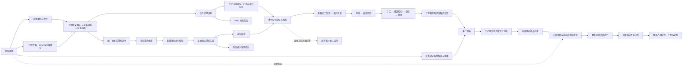

# 业务与协同流程地图 / Business and Collaboration Flow Map

本文是从销售接单、工程打样、用料审批、采购到料到生产入仓、出货结算的岗位流程校对入口。每段说明谁发起、谁办理、完成后交给谁，以及退回和异常如何处理；业务单据、协同待办和实际库存 / 质量 / 财务结果分别记录。

当前实现以文末列出的代码、权限配置与测试为依据；客户实际可用范围还须核对有效配置和目标环境。本文的“已实现”只描述源码能力，不代表已发布或已通过客户验收。“流程设计”和“真实运行链”的区别见[业务链与运行轨迹边界](../architecture/业务链与运行轨迹边界.md)。

来料清点职责已由项目负责人向甲方核实：IQC 在组织上归属仓库，负责到货清点和检验；系统仍以品质角色承接 IQC 登记与判定，仓库入库权限单独确认库存。生产提出加工要求、财务兼采购补价确认加工合同的分工继续按负责人暂定的 MVP 执行；本地实现不代表目标发布或客户签收。

## 阅读与同步维护 / Reading and Maintenance

业务校对依次阅读“订单受理与工程齐套”“工程需求到采购合同”“采购到货、质检与入库”“加工合同与回货”“生产排程、异常、成品质检与入库”。排程、工程准备和包材确认可按前置条件并行，章节顺序不构成新的系统门禁。开发核对再读[代码与测试依据](#代码与测试依据--implementation-evidence)和后面的运行边界。

| 表中口径 | 含义 |
| --- | --- |
| 自动待办 | 来源事务或正式流程节点已生成可追溯的 Workflow 任务；仍按负责岗位、个人归属和权限办理。 |
| 自动记录 | 自动生成收货关联质检、生产批次或下一检验关口等领域记录；不据此认定另有岗位待办。 |
| 显式办理 | 经办人在对应业务入口操作；权限校验、真实业务结果和必要任务结算由服务端负责。 |
| 暂定 MVP | 项目负责人已授权先实现的岗位安排，实际人员和细节由客户试用后校对。 |

涉及业务前置、角色责任、审批、状态、来源生成、待办派发、完成结果或异常出口的代码变更，必须在同一轮更新本地图对应章节及代码 / 测试引用，再完成相关验证。只改变实现细节或样式且业务口径未变时，无需机械改写流程。调整客户人员组合时同步客户角色配置和岗位指南；具体人名与私密资料不进入本地图。

维护时同时核对正常通过、退回重提、取消 / 冲正及已有下游依赖。当前代码、暂定安排和未实现自动衔接应分别表述；不得通过改文档掩盖实现缺口，也不把代码现状自动升级为客户决定。文档链接、清单和 Mermaid 可自动检查，业务语义仍须结合实现人工复核。

## 总图

```mermaid
flowchart LR
  sales["销售接单"] --> review["订单审批与生效"]
  sales --> engineering["工程资料、BOM 与打样确认"]
  review --> materialReview["工程提交用料 → 老板审核 → 财务审核"]
  engineering --> materialReview
  materialReview --> sourcing["按厂商生成采购订单"]
  sourcing --> arrival["登记采购到货"]
  arrival --> iqc["品质逐行来料检验"]
  iqc --> inbound["正式确认采购入库"]
  inbound --> inventory["材料库存"]
  materialReview --> productionOrder["生产订单发布"]
  productionOrder --> scheduling["PMC 排程任务"]
  productionOrder --> assignment["生产安排材料、厂商与加工批次"]
  assignment --> outsource["委外合同确认与发料"]
  inventory --> outsource
  outsource --> fabric["布料加工回货 → 裁片检验"]
  fabric --> sewing["车缝 → 皮套检验"]
  sewing --> handwork["手工 → 成品检验 → 针检 → 抽检"]
  handwork --> customerQc["订单要求时完成客户验货"]
  sales --> packagingApproval["业务确认包材版面与版本"]
  customerQc --> packaging["本厂包装"]
  packagingApproval --> packaging
  packaging --> completion["生产提交待入库完工报告"]
  completion --> finished["仓库确认成品入库"]
  finished --> shipmentDraft["出货草稿与可选出货前检验"]
  sales -. "来源候选" .-> shipmentDraft
  shipmentDraft --> financeGate["财务审批出货放行"]
  financeGate --> shipment["仓库确认真实出货"]
  shipment --> receivable["财务办理应收、开票与对账"]
  inbound --> payable["财务核对采购应付"]
  outsource -. "合格且已过账回货" .-> processingPayable["财务核对加工应付"]
```

箭头表示业务依赖，不表示所有步骤都会自动生成任务。领域 usecase 成功后可生成必要交接任务，但任务完成不替代下一领域 Fact。

## 如何读单据流

单据流是本地图必须包含的视角，但不另建一套引擎：

| 读法       | 回答的问题                                           | 当前真源                                                        |
| ---------- | ---------------------------------------------------- | --------------------------------------------------------------- |
| 单据内状态 | 这张 Source Document 当前能从什么状态进入什么状态    | 对应领域状态机、usecase、数据库约束与版本 / CAS                 |
| 来源到下游 | 哪个受控动作可以从当前来源创建另一张单据或 Fact 草稿 | 服务端候选、显式领域命令、来源 ID / 行 ID 与受控快照            |
| 协同门禁   | 哪个审批、任务、质检或责任条件不通过时必须停止       | ProcessRuntime / Workflow、RBAC、active revision 与领域前置校验 |
| 事实结果   | 哪个独立动作真正写库存、出货、生产、核销或财务       | 所属 Fact / Ledger usecase 与权威读回                           |

例如 Shipment 单据流包含草稿、财务放行门禁、真实出货和取消，但财务 approval 只决定门禁；仓库显式确认出货才写 `SHIPPED` 和库存 `OUT`。同理，采购订单批准只形成采购承诺，收货、IQC 和入库各自有独立 Source / Fact 边界。

## 订单受理与工程齐套

销售先记录客户需求、数量、船头样、交期和预付款条件，尚无产品时允许先接单。工程关联产品图片和 BOM，打样确认后确定量产版本。订单生效、工程确认与用料审批分别记录，实际预付款到账仍以财务收款单为准。

| 环节 / 前置条件 | 谁发起 | 谁处理什么 | 完成后交接 | 当前办理方式与异常 |
| --- | --- | --- | --- | --- |
| 客户需求、数量与交期已明确 | 销售 | 销售建立订单，记录客户需求、参考附件、船头样和商务条件 | 可提交审批，并交工程准备资料 | 显式保存；无产品可先接单，资料不完整时继续补齐 |
| 销售订单可以提交 | 销售 | 有效配置指定的审批人审核或退回 | 通过后订单生效，按选定流程进入工程 / PMC 节点 | 正式流程生成审批待办；拒绝原子取消已提交源单，保留决定与原因 |
| 订单草稿已有可识别需求 | 销售提供资料 | 工程关联产品、产品图片、图样和 BOM | 形成可打样的工程资料 | 显式办理，可与订单审批并行；工程权限不包含修改销售价格 |
| 工程资料可打样 | 工程 | 工程记录打样、样品说明和确认；返单可显式引用同客户同产品规格的已确认样品 | 冻结量产样品与 BOM 依据 | `PREPARING → SAMPLING → CONFIRMED`；改样先写原因退回，来源不一致不能复用旧确认 |
| 订单已生效、样品已确认、BOM 已启用 | 工程 | 工程核对并提交本订单用料汇总 | 交老板审核工程用料 | 提交后锁定对应工程来源；进入下一节的独立用料审批，不用工程任务完成代替用料提交 |

工程与打样记录已经有独立领域入口；它们是否同时对应流程待办取决于所选销售流程版本，不能按本表为每一行推定自动派单。预付款条件属于订单约定，实际到账由财务收款记录证明。

| 项目            | 内容                                                                                                                                                                                      |
| --------------- | ----------------------------------------------------------------------------------------------------------------------------------------------------------------------------------------- |
| Source Document | 销售订单                                                                                                                                                                                  |
| 责任角色        | sales → 当前 active revision 的销售审批责任 → engineering → pmc                                                                                                                           |
| 必要协同        | 销售提交、管理审批/退回、工程资料缺失、排期风险                                                                                                                                           |
| 自动动作        | 审批通过后由绑定领域命令激活销售订单，再按所选 Product Core variant 进入工程 / PMC 节点；审批拒绝先执行 `sales_order.reject_after_workflow`，原子取消仍为 `SUBMITTED` 的源单和 open 行，再进入 `sales_order_rejected_end` |
| 领域结果        | 销售订单仍按自身状态机生效；BOM/产品资料由工程 usecase 保存                                                                                                                               |
| 禁止            | 审批完成直接生成生产、库存、出货或应收事实                                                                                                                                                |

## 工程需求到采购合同

| 环节 / 前置条件 | 谁发起 | 谁处理什么 | 完成后交接 | 当前办理方式与异常 |
| --- | --- | --- | --- | --- |
| 订单、样品和 BOM 满足用料提交条件 | 工程 | 提交按材料和单位归并的用料，保留产品、部位、工艺、厂商及数量依据 | 老板收到“审核工程用料” | 自动待办；用料与任务在来源事务中保存，重复请求不得重复生成 |
| 用料已提交 | 工程提交触发 | 老板审核数量和来源，可通过或填写原因退回 | 通过交财务“审核并批准采购用料”；退回交工程“修改用料并重新提交” | 自动待办；使用用料审核入口，普通任务完成按钮不能替代审核 |
| 老板已审核通过 | 老板通过触发 | 另一位财务人员核对产品、BOM、部位和工艺来源 | 通过后按厂商生成已批准采购订单；退回交工程修订 | 自动待办与领域动作同事务；本步不补单价、不调整采购数量 |
| 用料被退回 | 老板或财务 | 工程核对退回原因，修改资料后重新提交 | 新审批轮次交老板 | 保留原审批、退回原因与任务历史；来源变化必须重新审核 |
| 用料审批生成采购订单 | 财务批准触发 | 采购经办人核对供应商、采购数量、合同与到货安排 | 供应商下单与到货跟进 | 采购数量取冻结用料；单价、金额和预计到货日期可缺值，不把空值当零；不重复提交同一采购审批 |
| 独立人工采购需求 | 采购 | 建立采购订单并显式提交，由有效配置的采购审批人办理 | 批准后形成采购承诺，交采购跟催 | 与工程自动生成入口分开；`material_supply` 到批准即结束，不自动创建收货、库存或应付 |

财务用料审核与合同经办是两种责任。客户采用“财务兼采购”时，由同一账号分别持有财务与采购角色承接；不能因此给纯财务角色推导采购写权限。采购审批生成单据与收到实物也是两个事件。

| 项目            | 内容                                                                                       |
| --------------- | ------------------------------------------------------------------------------------------ |
| 来源            | 工程提交订单的已确认样品及启用 BOM 用料汇总；也保留独立人工采购入口 |
| 责任角色        | engineering → boss → finance；财务审核批准后按厂商生成采购单                       |
| Source Document | 采购订单；主料和其他材料复用同一模型                                                       |
| 必要协同        | 需求缺失、供应商未确认、价格/交期审批、异常催办                                            |
| 领域结果        | 采购订单批准只形成采购承诺                                                                 |
| 禁止            | 采购批准直接形成入库、库存余额或应付事实                                                   |

## 采购到货、质检与入库

| 环节 / 前置条件 | 谁发起 | 谁处理什么 | 完成后交接 | 当前办理方式与异常 |
| --- | --- | --- | --- | --- |
| 已批准采购订单对应材料实际到货 | 采购提供到货来源，仓库 IQC 清点 | IQC 按采购行登记本次实点、送货标示数量、仓库与卷包批次，可分批或同一采购行拆卷登记 | IQC 取得逐条待检记录 | 采购批准生成 IQC 到货待办；未填实际数量的行不登记，登记后自动建立零余额待检批次、已提交 IQC 和品质待办 |
| 收货行已建立待检记录 | 收货登记触发 | IQC 按材料保留、移除或补充检查项，记录要求、实际情况、符合 / 异常 / 不适用、全检 / 抽检范围与原因 | 全部合格或允许的让步后交仓库；不合格交采购处置 | 自动质检待办；正式判定须显式办理，尚未检验或不合格均阻断入库 |
| 所有收货行通过质量门禁 | 品质给出正式结论 | 仓库核对实收及批次并确认采购入库 | 库存正式增加，材料可供后续发料 | 仓库办理入库待办；确认只接受仓库入库权限，采购收货创建权限不能代替 |
| 首次来料检验不合格 | 品质报告来源行和原因 | 采购联系供应商选择退厂或补换，仓库配合隔离与实物交接 | 退厂范围或补换数量、交期明确 | 自动交采购处理异常；采购按来源行登记退厂或补换，仓库配合实物隔离与交接，未处置量保留 |
| 补换材料再次到货 | 采购 / 仓库 | 按原处置引用登记新到货，由品质重新检验 | 合格后重新走正式入库 | 补换确认自动建立新收货 / 待检来源，不覆盖原拒收结论 |
| 已入库后发现数量或质量问题 | 仓库 / 品质 | 采购、仓库分别按正式来源办理退货或入库调整 | 库存形成可追溯的反向 / 调整流水，财务核对影响 | 显式办理；与首次到料拒收分开，保留原入库事实 |

送货标示与实点数量使用同一采购单位，差值只表示本次清点差异；采购订单尚未到货部分不视为短码。短码、色差、破损等只是检查项示例，可增加克重、幅宽、异味等项目。未检不得判合格或让步；不适用须写原因，抽检须记录范围，异常让步须写判定说明，不良比例不换算退货数量。IQC 可取消尚未入库的错误登记后重建；正式结论纠错保留原证据并重新待检。

收货、检验和入库的岗位待办由来源事务自动创建、阻塞或结算。所有行检验通过后才解除仓库入库阻塞；不合格会另交采购处置。累计拒收量处置完成后关闭采购异常待办并撤回原单入库待办，原单继续保留拒收事实；撤销处置会重新待办。部分处置不会整单取消，也不会自动过账。

| 项目        | 内容                                                                                                                                                                                                                                 |
| ----------- | ------------------------------------------------------------------------------------------------------------------------------------------------------------------------------------------------------------------------------------ |
| 来源        | 已批准采购订单/明细和到货数量                                                                                                                                                                                                        |
| 责任角色    | quality（仓库 IQC 到货与检验）→ warehouse（入库）；异常交 purchase                                                                                                                                                                                             |
| 事实顺序    | 采购入库草稿 / 到货待检 → 逐行 IQC 判定 → POSTED → 库存流水 / 余额                                                                                                                                                                   |
| 必要协同    | 待检交接、质检不合格、数量差异、仓库阻塞                                                                                                                                                                                             |
| 自动动作    | 当前 `material_supply` 只完成采购订单提交、审批和批准，不创建收货。业务人员从已批准采购订单显式创建收货草稿时，领域事务逐行建立待检 IQC；追加明细也必须绑定采购订单行并建立对应 IQC。全部合格 / 让步后才允许仓库执行正式入库领域动作 |
| 取消 / 反向 | 已过账入库取消、采购退货和采购调整分别形成反向 / 调整库存流水，保留原事实；页面和 Workflow 不直接改库存余额                                                                                                                          |
| 异常处置    | 初始 IQC 不合格会阻断入库；采购可按精确收货行登记部分退厂或供应商补换，累计有效处置量不得超过来源行。补换确认形成新的待收草稿、HOLD 批次和待检链，原收货不因部分处置被整单取消                                                       |
| 禁止        | `inbound_done` 协同状态替代采购入库 POSTED，把初始 IQC 拒绝伪装成已过账后的采购退货，或用整单取消掩盖部分退厂 / 补换                                                                                                                 |

## 加工合同与回货

| 环节 / 前置条件 | 谁发起 | 谁处理什么 | 完成后交接 | 当前办理方式与异常 |
| --- | --- | --- | --- | --- |
| 生产订单已发布、路线和材料需求已冻结 | 生产经理 | 选择本次加工材料、厂商、回货日期和执行方式；按批次生成委外草稿 | 合同经办人补全商务条件 | 显式办理；首道布料加工只允许整单数量外发，车缝 / 手工分别选择本厂或外发 |
| 委外草稿的材料、数量、厂商已明确 | 生产 | 财务兼采购经办人补加工价格、合同双方资料并确认合同 | 生产绑定精确工序 / 批次，交仓库准备发料 | 自动交财务责任池办理；账号须同时具备采购合同权限，纯财务保持只读，生产只提加工要求 |
| 合同已确认、批次已绑定、有足量可用材料 | 生产提出发料需求 | 仓库核对批次、数量并显式登记和确认发料 | 实物交加工厂，生产跟进加工及回货 | 确认合同生成仓库发料待办；实际发料过账后更新数量，生产据此开始外发 |
| 加工厂交货 | 生产 / 委外跟进 | 仓库清点实物并核对合同、工序、批次和回货量 | 交品质做对应回货 / 分段检验 | 外发开始生成仓库工序回货待办；生产不能代录回货，通用委外事实与路线回货分别办理 |
| 来源回货满足检验条件 | 生产 / 委外 | 品质按来源判定合格、不合格或规则允许的让步 | 合格后允许对应下游；不合格交生产处理返工 / 补做 | 通用已过账产品回货显式发起检验；路线回货自动建立本工序首个质检草稿及品质待办，两者不能互相冒充 |
| 回货已过账且质量合格 | 生产 / 仓库提供来源 | 财务核对加工厂、数量、加工费和税额，生成并确认应付 | 后续对账与付款 | 应付草稿和正式确认分开；合同确认、回货或质检完成都不自动等于应付过账 |

本厂工序之间办理车间移交；外发才办理发出和回货。通用委外回货的库存事实及路线 WIP 回货必须分别核对来源，不把所有回货统一描述成“质检后自动入库”。生产经理与生产人员是业务职责区分，当前主要由生产 / 委外岗位承接，不据此增加一个新系统角色。

| 项目            | 内容                                                                                                                                                                                                                                                      |
| --------------- | --------------------------------------------------------------------------------------------------------------------------------------------------------------------------------------------------------------------------------------------------------- |
| 来源            | 产品/BOM/生产需求                                                                                                                                                                                                                                         |
| 责任角色        | production 提要求 → finance + purchase 确认合同 → warehouse 收发 → quality 检验                                                                                                                                                                                                  |
| Source Document | 加工合同；布料加工、车缝和手工复用同一模型，车缝 / 手工明细主体为产品，布料加工主体为材料                                                                                                                                                                 |
| 必要协同        | 下单确认、预计回货、延期/缺料、返工/补做                                                                                                                                                                                                                  |
| 当前动作        | 已确认合同行可显式生成委外发料 / 回货事实；已过账产品回货可发起委外回货质检。显式 `PLUSH_SEW_HAND_V1` WIP 可把外发批次绑定到合同行并办理回货；委外不合格可登记并确认返厂或创建返工 WIP，返厂写正式库存 OUT 且可冲正。当前新异常切片仍需目标发布与岗位 UAT |
| 领域结果        | 质检和入库分别由 Quality/Inventory/Purchase usecase 产生                                                                                                                                                                                                  |
| 来源追溯        | 页面按 `OUTSOURCING_ORDER` 返回委外订单、按 `OUTSOURCING_FACT` 返回对应订单 / 事实；导航只负责打开来源，不代替发料、回货、取消或质检动作                                                                                                                  |
| 禁止            | 回货跟踪任务 done 或来源导航直接写入库、应付或结算                                                                                                                                                                                                        |

## 生产排程、异常、成品质检与入库

| 环节 / 前置条件 | 谁发起 | 谁处理什么 | 完成后交接 | 当前办理方式与异常 |
| --- | --- | --- | --- | --- |
| 销售来源、确认样品、量产 BOM 与用料审批满足发布条件 | 生产订单经办人发布 | PMC 确认开完工日期、责任产线与先后顺序 | 生产经理安排执行 | 发布事务自动生成排程待办；排程完成不代表已经开工或领料 |
| 首道材料已入库，布料加工合同与发料满足条件 | 生产经理 | 按选定材料整单外发布料加工，仓库登记回货 | 品质办理裁片检验 | 显式 WIP 办理，回货自动生成裁片质检草稿和品质待办；检验不通过阻断车缝 |
| 裁片检验通过 | 生产经理 | 决定车缝本厂 / 外发；允许范围内拆批，各子批独立执行 | 车缝完成或回货后交品质 | 工序完成 / 回货自动生成皮套质检草稿和品质待办；内部移交不增加原料或成品库存 |
| 皮套检验通过 | 生产经理 | 再次独立决定手工本厂 / 外发并安排执行 | 手工完成或回货后交品质 | 不能沿用车缝选择替代本步安排；自动建立成品检验草稿和品质待办 |
| 手工产出已待检 | 生产交批次 | 品质依次办理成品检验、针检、抽检 | 全部通过后进入客户验货或包装 | 每关独立质量记录和品质待办，上一关通过才能推进下一关；不合格进入返工或显式异常审批 |
| 订单明确要求客户验货 | 业务提供订单要求，生产提供批次 | 品质记录该关口结果，业务协调客户；现场组织暂由业务协调 | 通过后允许包装 | 条件性质量关口；订单不要求时为不适用，不伪造通过记录 |
| 包材版面 / 版本可核对，可提前并行 | 业务依据客户要求 | 业务 / 销售确认文字、颜色和包装版本，品质另行检验包材质量 | 确认结果交生产 | 两类结果互不代替；专用包材领用 / 耗用的完整自动链未在此认定 |
| 本批必需质量关口通过，包材业务确认完成 | 生产 | 本厂包装人员执行包装并记录完成数量 | 生产提交待入库完工报告 | 包装 WIP 合格形成允许完工入库数量的上限，尚未增加库存 |
| 完工报告已提交、实物可清点 | 生产 | 仓库核对实收、仓库和批次，显式确认成品入库 | 形成成品库存，供出货来源选择 | 完工报告是待入库草稿；仓库确认才写库存，生产不能代替仓库确认 |

生产分段质检由 WIP 及质量领域推进，所需关口的品质待办随质检草稿自动生成，最后一关通过后交生产移交下一工序或登记完工。直判放行要求合格；WIP 让步须另走异常审批与执行。返工建立新执行记录并保留原质量证据，不能重开已结算工序掩盖历史。

| 项目     | 内容                                                                                                                                                                                                                                       |
| -------- | ------------------------------------------------------------------------------------------------------------------------------------------------------------------------------------------------------------------------------------------ |
| 来源     | 已发布生产订单、冻结 BOM 物料需求、显式路线 WIP、生产领料 / 完工 / REWORK 事实和完工申报                                                                                                                                                   |
| 责任角色 | PMC 排程 → production 执行 / 异常 → quality → warehouse                                                                                                                                                                                    |
| 任务顺序 | 生产订单 `DRAFT -> RELEASED` 原子生成 `production_scheduling`；显式路线行同时冻结 WIP 路线 / 初始批次；REWORK `DRAFT -> POSTED` 原子生成 `production_exception`                                                                            |
| WIP 顺序 | `FABRIC_PROCESSING → SEWING → HANDWORK → PACKAGING`；拆批、内制 / 外发分配、开始、完成 / 回货、移交、返工和包材确认都走 `execute_production_wip_action`，不是 Workflow task 状态                                                           |
| 质检顺序 | 工序完成或委外回货按冻结关口生成 `PRODUCTION_WIP / PRODUCTION_STAGE / WIP` 质检；`PASSED + PASS` 直接放行，`REJECTED` 进入返工或显式 WIP 让步申请；只有批准后再由独立执行动作落到 WIP 才能让步放行，未批准或只完成 Workflow 仍 fail closed |
| 事实顺序 | 领料 Fact → WIP / 分段质检 → 包装批次 `ACCEPTED` → 完工入库 Fact；完工后的 REWORK Fact 另走返工 / 异常链                                                                                                                                   |
| 必要协同 | 排产确认、工序交接、完工待检、返工异常、入库数量 / 库位异常                                                                                                                                                                                |
| 异常处置 | 报废、WIP 让步与超领先形成显式审批决定；批准只记录决定或额度。报废 / 让步由独立执行与冲正动作落 Fact / WIP，超领额度由正式生产领料在来源物料需求锁内消费；Workflow 完成不代替事实执行                                                      |
| 关闭条件 | 生产订单关闭要求排程任务 `done`；已发布订单取消要求排程任务 `done / rejected`；已过账 REWORK 冲销要求异常任务 `done / rejected`                                                                                                            |
| 禁止     | WIP / 质检 / 排程 / 异常完成直接写领料、完工、返工、报废、成品库存或财务事实；包装批次未 `ACCEPTED` 不得生成 / 过账完工入库；来源取消也不能把任务伪造成已完成                                                                              |

固定 `PLUSH_SEW_HAND_V1` 路线、WIP 和分段质量关口已在 Product Core 源码实现；当前目标环境是否包含对应版本、迁移及岗位配置，以实际交付证据为准，本地图不缓存部署状态。完整路线、数量及内外发合同见[生产工艺路线与在制品边界评审](../architecture/生产工艺路线与在制品边界评审.md)。

## 出货与业务结算

| 项目           | 内容                                                                                                                                                                                                                                                   |
| -------------- | ------------------------------------------------------------------------------------------------------------------------------------------------------------------------------------------------------------------------------------------------------ |
| 来源           | 销售订单、成品可用库存、装箱/出货资料                                                                                                                                                                                                                  |
| 责任角色       | sales/finance 放行 → warehouse 出货 → finance 对账                                                                                                                                                                                                     |
| 来源候选       | `list_shipment_source_candidates` 在服务端按关键词 / 销售订单 / 分页返回订单行、已出货、剩余量、是否可选和不可选原因；只有 `SHIPPED` 占用销售订单剩余量，普通 `DRAFT` 不预占                                                                           |
| 事实顺序       | 出货草稿 → 可选的出货前成品检验侧链 → Shipment 财务审批 → 版本化放行门禁 `APPROVED` → 仓库显式确认出货 → `SHIPPED` + 库存 `OUT` → 应收 / 对账来源                                                                                                      |
| 出货前检验侧链 | 品质岗位可从尚未提交放行的 `DRAFT` 出货单按产品 / SKU、仓库和批次发起独立质检 Fact；未发起时按可选检验策略进入放行，一旦发起则必须在提交前合格或让步接收。放行提交后不再补造检验，避免改变任务依据                                                     |
| 财务放行       | 出货单来源页启动 `finished_goods_delivery`，首节点为 `shipment_finance_approval`；责任由 active revision 的 Shipment 财务审批设置解析。审批通过后绑定领域命令只写 Shipment 版本化财务门禁并结束流程，不生成仓库放行任务                                |
| 必要协同       | 业务确认、财务放行、仓库执行、出货异常、对账差异                                                                                                                                                                                                       |
| 仓库执行       | `ship_shipment` 是独立领域动作，事务内重验 `APPROVED` 门禁、质检、销售来源累计量、预留和库存；只有真实 `SHIPPED` 后才能生成应收 / 发票来源或对账交接                                                                                                   |
| 取消 / 反向    | 已出货取消走独立取消 Fact 与库存反向流水；原出货保留审计，取消成功后才由服务端重新聚合并恢复可出货余额                                                                                                                                                 |
| 禁止           | 来源候选 / 导入、财务审批任务 done、放行门禁、历史 `shipping_released`、创建质检草稿或页面按钮提示等于 `SHIPPED`；来源导入和表单逐行选择不能绕过服务端候选资格；候选余额不能代替确认出货事务内重验；出货前检验侧链本身不启动 `finished_goods_delivery` |

## 异常与并行交接 / Exceptions and Parallel Work

| 触发情况 | 谁发起 → 谁处理 | 要办理的事项 | 结束或恢复条件 |
| --- | --- | --- | --- |
| 工程资料不全、样品或 BOM 来源变化 | 发现问题的岗位 → 工程 | 核对资料并按来源规则退回修订；需要时重提用料 | 新来源通过所需确认与审批，保留原轮次 |
| 缺料、延期、实物数量差异 | 采购 / 仓库 / 品质 / 生产 → PMC 协调责任岗 | 补料、跟催、核数或调整排程 | 真实阻塞原因解决；任务恢复不伪造到货或完工 |
| 首次 IQC 不合格 | 品质 → 采购，仓库配合 | 按明细处置退厂或供应商补换 | 采购登记处置，仓库核对实物；补换材料有独立来源和重新检验 |
| 裁片、皮套、成品或委外回货不合格 | 品质 → 生产经理 / 委外 | 指明来源批次、返工目标、数量与原因，安排返工或补做 | 新执行完成并通过所需复检；不覆盖原不合格记录 |
| 生产让步、报废、超领 | 生产 / 品质提出 → 有效流程配置中的审批责任人 | 分别审批让步 / 报废决定或超领额度 | 审批通过后由独立执行动作落结果；拒绝不写库存或改变 WIP |
| 采购收货或合格委外回货进入结算 | 采购 / 生产 / 仓库提供来源 → 财务 | 核对价格、数量和税额，确认应付、对账及付款 | 各自正式财务单据完成；供应商承诺、合同金额或任务完成不替代财务结果 |
| 异常需要跨岗协调或升级 | 当前责任岗 → PMC / 管理审批 | 催办、协调、按现有规则升级或转交 | 留下任务事件和处理人；监督、转交权限不等于替其他岗位办理领域事实 |

## 本版岗位分工与表单习惯 / MVP Responsibilities and Forms

仓库负责到货、加工发料、回货和最终入库；生产负责加工要求、工序安排、完工申报和返工；品质负责检验；业务负责包装版本及客户验货协调；财务兼采购办理加工合同和来料异常的商务处理。管理审批继续读取有效流程设置，不统一猜成老板。以上按项目负责人授权暂定，客户试用反馈再修改。

加工合同填写沿用已核对的原工作簿习惯：双方信息左右成组；明细按产品订单、加工品类及对象、加工项目、工序名称与类别、单位、单价、数量、金额、备注和回货日期排列。金额沿用统一计算，清空单价时清空金额；产品与材料仍从已有主数据选择。沿用 BOM / 销售订单的整页表格式录入、连续加行与未保存提醒。原始合同的打印布局由现有打印模板负责；屏幕表单保留选择和校验控件，不把原件图片当作可填写表格。

原件只从客户私有仓的 manifest 定位和只读核对；本仓保存通用表格结构与业务规则，不复制原件、联系人或订单数据。后续改列顺序、字段来源或打印布局时重新核对对应原文件及输入、保存和打印链路。

## 来源待办登记 / Source Handoff Tasks

这些待办使用已有 Workflow 表，在所属单据事务内同步；任务页打开对应来源办理，没有通用“完成”按钮。重复请求保持同一任务和事件版本；来源撤销、拒收处置撤销或完工草稿取消后，尚需办理的来源步骤重新待办并留下事件。此恢复只更新协作状态，不恢复或改写已完成的质量、库存或生产事实。

| 自动待办 | 负责岗位 | 出现及结束条件 |
| --- | --- | --- |
| 登记采购到货 | 仓库 | 采购批准后出现；按有效收货草稿和已入库数量计算剩余，全部登记后结束，取消收货后重新待收 |
| 办理来料检验 | 品质 | 收货行生成质检时出现，正式判定后结束 |
| 确认材料入库 | 仓库 | 到货后等待检验，全部通过才可入库；正式过账后结束 |
| 处理来料不合格 | 采购 | 拒收后出现，按来源行办理退厂或补换；全部拒收量处置后结束，取消处置后恢复 |
| 补价并确认加工合同 | 财务兼采购 | 生产生成或人工保存加工草稿后出现，确认合同后结束 |
| 办理加工发料 | 仓库 | 材料加工合同确认后出现，已过账发料达到合同数量后结束 |
| 登记加工回货 | 仓库 | 通用委外合同确认后出现，已过账回货达到合同数量后结束；生产来源合同走工序回货 |
| 确认加工回货入库 | 仓库 | 通用委外回货草稿创建后出现，正式过账后结束 |
| 办理加工回货检验 | 品质 | 通用已过账产品回货显式发起质检后出现，正式判定后结束 |
| 安排并办理本工序 | 生产 | 发布生产路线或创建下一批次后出现，工序完工或外发开始后结束 |
| 登记工序回货 | 仓库 | 外发开始后出现，登记回货后结束并交品质；回货此时只更新 WIP |
| 办理工序检验 | 品质 | 每个必需关口的质检草稿出现时派发，正式判定后结束，下一关顺序派发 |
| 移交下一工序 | 生产 | 本工序全部质检通过后出现，允许数量全部移交后结束 |
| 处理工序不合格 | 生产 | 不合格后出现，返工数量全部安排或正式异常执行处置后结束 |
| 确认包装版本 | 业务 / 销售 | 生产发布后可提前办理，记录包装版本后结束 |
| 登记成品完工 | 生产 | 包装完成后出现，可完工量全部生成待入库草稿后结束；取消草稿后恢复 |
| 确认成品入库 | 仓库 | 完工草稿创建后出现，仓库正式入库后结束 |

自动交接覆盖新业务写入和受控变更；不扫描或补造既有模拟任务。旧来源没有下一次业务变更时不会凭空出现待办。通用委外事实的产品回货检验仍由品质显式发起；固定生产路线的各个质量关口自动生成。供应商催货、完整包材耗用、应付及付款仍沿用各自显式业务入口，不新增后台调度。

生产订单关闭后，原生产批次的未完待办撤回；正式成品返工建立的补制批次仍继续生成工序、检验和完工入库交接，沿用现有返工数量和来源门禁。

岗位默认权限由 `20260916090000_fulfillment_role_handoffs.sql` 迁移调整；客户包同步仓库、生产、采购及业务菜单。目标数据库应用迁移与客户配置生效是独立交付动作，本地图不声称已执行。现有自定义角色不被迁移改写。

## 代码与测试依据 / Implementation Evidence

下表用于变更时定位同一条主路径。列出测试表示有可执行验证入口，不表示本次、目标环境或当前提交已经运行通过。运行结果应随具体变更交付说明，本文不缓存整仓绿色计数。

| 流程范围 | 实现与权限依据 | 对应验证入口 |
| --- | --- | --- |
| 接单、工程资料与样品 | [工程领域](../../server/internal/biz/sales_order_engineering.go)、[销售工程 API](../../server/internal/service/jsonrpc_sales_order_engineering.go) | [工程权限与字段合同](../../server/internal/service/jsonrpc_sales_order_engineering_test.go)、[样品复用与来源门禁](../../server/internal/data/engineering_material_request_repo_test.go) |
| 用料提交、两级审核与采购生成 | [用料领域](../../server/internal/biz/engineering_material_request.go)、[真实用料任务](../../server/internal/biz/engineering_material_workflow.go)、[审批事务](../../server/internal/data/engineering_material_request_repo.go) | [用料与采购生成](../../server/internal/data/engineering_material_request_repo_test.go)、[任务交接、重放与回滚](../../server/internal/data/engineering_material_workflow_test.go) |
| 到货、逐行 IQC 与正式入库 | [收货事务](../../server/internal/data/purchase_receipt_repo.go)、[检验和入库门禁](../../server/internal/data/quality_inspection_repo.go)、[收货 API 权限](../../server/internal/service/jsonrpc_purchase_receipt.go) | [采购收货](../../server/internal/data/inventory_repo_purchase_receipt_test.go)、[质检与入库门禁](../../server/internal/data/inventory_repo_quality_inspection_test.go)、[收货 API](../../server/internal/service/jsonrpc_purchase_test.go) |
| 拒收、补换与已入库纠正 | [拒收处置](../../server/internal/data/purchase_rejection_disposition_repo.go)、[采购退货](../../server/internal/data/purchase_return_repo.go)、[入库调整](../../server/internal/data/purchase_receipt_adjustment_repo.go) | [拒收与补换](../../server/internal/data/purchase_rejection_disposition_repo_test.go)、[退货](../../server/internal/data/inventory_repo_purchase_return_test.go)、[调整](../../server/internal/data/inventory_repo_purchase_receipt_adjustment_test.go) |
| 委外合同、发料与回货 | [加工合同](../../server/internal/biz/outsourcing_order.go)、[委外事实事务](../../server/internal/data/operational_fact_outsourcing_repo.go) | [委外来源](../../server/internal/service/jsonrpc_operational_fact_outsourcing_source_test.go)、[合同与 WIP 依赖](../../server/internal/data/outsourcing_order_wip_dependency_test.go) |
| 生产排程、WIP、包材确认与各质量关口 | [来源排程任务](../../server/internal/biz/workflow_source_tasks.go)、[固定路线与角色动作](../../server/internal/biz/production_wip.go)、[WIP 事务](../../server/internal/data/production_wip_repo.go) | [WIP 路线与完工门禁](../../server/internal/data/production_wip_repo_test.go)、[分段质量顺序](../../server/internal/data/production_wip_quality_inspection_repo_test.go)、[生产 API](../../server/internal/service/jsonrpc_production_wip_test.go) |
| 成品入库、出货与财务 | [生产事实](../../server/internal/data/operational_fact_production_repo.go)、[出货事实](../../server/internal/data/operational_fact_shipment_repo.go)、[财务事实](../../server/internal/data/operational_fact_finance_repo.go) | [自动化测试策略](../product/自动化测试策略.md)按具体触达面选择仓库、出货与财务的同名专项；不复用其他版本结果 |
| 到料至成品入库交接 | [待办合同](../../server/internal/biz/fulfillment_tasks.go)、[来源事务同步](../../server/internal/data/fulfillment_tasks.go)、[来源导航](../../web/src/erp/utils/fulfillmentTask.mjs) | [完整主链](../../server/internal/data/fulfillment_chain_test.go)、[重复、异常与回滚](../../server/internal/data/fulfillment_tasks_test.go)、[导航与文档同步](../../web/src/erp/utils/fulfillmentTask.test.mjs) |
| 角色、来源待办与受控完成 | [默认权限](../../server/internal/biz/rbac.go)、[来源任务命名空间](../../server/internal/biz/workflow_source_task_namespace.go)、[任务事务](../../server/internal/data/workflow_source_task_repo.go) | [角色权限](../../server/internal/biz/rbac_test.go)、[来源任务保护](../../server/internal/biz/workflow_source_task_namespace_test.go)、[工程待办受控办理](../../server/internal/biz/engineering_material_workflow_test.go) |

流程口径或引用变化后运行 `GIT_OPTIONAL_LOCKS=0 node --test scripts/qa/docs-inventory.test.mjs` 并检查修改的 Mermaid；代码变化按上表选择相关测试，再做 scoped `git diff --check`。新增 / 改名长期文档时另外同步文档清单和目录入口；本地图仅更新正文时不机械修改能力台账或客户验收状态。

## 六个正式 ProcessRuntime key / 七个 variant

Product Core 当前登记 6 个 process key、7 个 variant；`sales_order_acceptance` 有 `approval_pmc` 与 `approval_engineering_pmc` 两个 variant，其余 process key 各一个。

| Process key                     | 当前正式节点主线                                                                                    | 领域边界                                            |
| ------------------------------- | --------------------------------------------------------------------------------------------------- | --------------------------------------------------- |
| `sales_order_acceptance`        | 提交销售订单 → 审批；同意后激活并进入所选工程 / 复核节点 → `end`，拒绝先取消 Source 再到 `sales_order_rejected_end` | 只推进销售 Source 和协同节点；拒绝不执行激活        |
| `material_supply`               | 提交采购订单 → 审批；同意后批准生效 → `end`，拒绝先取消 Source 再到 `purchase_order_rejected_end`                   | 不创建收货、IQC、入库或应付；拒绝不执行批准         |
| `finished_goods_delivery`       | Shipment 财务审批；同意后版本化放行 → `end`，拒绝写拒绝结果并到 `shipment_finance_rejected_end`     | 两种 end 都不执行真实出货、库存 `OUT`、应收或发票   |
| `finance_payment_approval`      | 审批决定 → 财务执行任务 → 显式 post；拒绝走 `rejected_end`                                          | 审批只改 Source；post 才写分配 / 结清，reverse 独立 |
| `inventory_adjustment_approval` | 提交 → 审批决定 → 仓库执行任务 → 显式 post；拒绝走 `rejected_end`                                   | submit / approval 不写库存；post 才写库存交易       |
| `production_exception_approval` | 审批决定 → 报废 / 让步显式执行；超领走 `over_issue_end`；拒绝走 `rejected_end`                      | 审批只写决定 / 额度，事实执行和额度消费独立         |

## 六个正式流程 key 的异常出口

异常流属于流的一部分，但“拒绝、退回、阻塞、恢复、取消、冲正、返工、补偿”不能合并成同一个出口：

| 流程范围                      | 当前异常出口                                                                                                                                                                             | 不通过后的业务结果                                                                    |
| ----------------------------- | ---------------------------------------------------------------------------------------------------------------------------------------------------------------------------------------- | ------------------------------------------------------------------------------------- |
| 销售、采购、Shipment 财务放行 | canonical 图均有显式拒绝分支；销售 / 采购先通过命名领域命令原子取消已提交 Source 与 open 行，Shipment 记录 `REJECTED` 放行结果，再分别进入 `sales_order_rejected_end`、`purchase_order_rejected_end`、`shipment_finance_rejected_end` | 不执行销售激活、采购批准或 Shipment 财务放行；更不会写真实出货、库存、入库或财务 Fact |
| 收付款                        | approval 分支调用正式拒绝 Source 命令并到 `rejected_end`                                                                                                                                 | 不创建财务执行任务，不写 allocation / settlement                                      |
| 人工库存调整                  | approval 分支调用正式拒绝 Source 命令并到 `rejected_end`                                                                                                                                 | 不创建仓库执行任务，不写库存交易或余额                                                |
| 生产异常                      | approval 拒绝到 `rejected_end`；批准后超领到 `over_issue_end`，报废 / 让步进入生产执行分支                                                                                               | 拒绝不写 SCRAP / WIP / 库存；超领批准只形成额度，仍由正常领料消费                     |
| 任一 linked task              | `ready → blocked → ready` 只表示同一任务暂停 / 恢复；`ready → rejected` 是人工退回终态；来源取消或受控恢复可内部写 `withdrawn`                                                                                                        | 普通任务动作不能伪造系统撤回；撤回不自动冲正 Fact，也不把旧 completed 节点重新打开    |

取消属于 Source 生命周期，冲正属于 Fact / Ledger 反向记录，返工产生新的领域轮次或 ProcessRuntime attempt，补偿记录已完成效果的撤销 / 替代证据。它们必须继续调用各自领域动作；页面不能用一个“异常处理完成”按钮代替。

## 开发业务链地图

`/__dev/status-flows?view=chains` 以 11 条 Product Core 设计链连接主链、支撑链、异常链和纠正链，覆盖当前 27 个业务状态对象与全部 7 个 ProcessRuntime variant。每个节点仍保留 Source Document、MasterData、ProcessRuntime、Workflow task、Fact / Ledger 或派生结果的所属层，并能下钻到对应状态机或流程编排图。

页面按真实 `task_id` 读取 `workflow.get_task_process_context` 时，只高亮该任务所属的一个 ProcessRuntime 链段和当前节点摘要；它不会把未查询的上下游 Source / Fact 标为已完成。该地图是开发设计投影和导航，不是新的流程引擎、跨域运行历史或业务真源。

## ProcessRuntime 包装动作边界

客户激活流程中的 `start_* / execute_*` 入口只是受控入口，不能作为独立业务真源。血缘必须按最终调用的领域 usecase 登记：销售 / 采购 submit、activate / approve、三条固定流程 Source 决定和 Shipment 财务门禁属于对应 Source Document；收付款 post、库存调整 post 与生产异常 execute 分别属于其领域 Fact / Ledger 或 WIP 效果。ProcessRuntime 保存运行、节点、路由、重试和 durable result，不得因此成为第二套 Source 或 Fact。

## 流程起点、业务轨迹与终点

| 用户问题           | 当前真源与交互                                                                                                                                                                                         |
| ------------------ | ------------------------------------------------------------------------------------------------------------------------------------------------------------------------------------------------------ |
| 从哪里发起         | 业务人员在来源单据页执行“提交 / 启动审批”等受控动作；服务端从真实来源创建并启动 ProcessInstance。普通 `workflow.create_task` 不构成业务流程起点。                                                      |
| 来源流程走到哪里   | 在桌面任务看板或手机岗位任务端打开任务详情；有流程锚点时，“业务轨迹”通过 `get_task_process_context` 展示来源、实例、已执行 / 当前 / 受阻节点和本任务锚点。无锚点或证据不一致时失败关闭，不猜未来分支。 |
| 当前任务发生过什么 | “本任务处理记录”通过 `list_task_events` 最新在前展示这一条任务的状态、责任和意见；它不跨任务，不是完整审批链。                                                                                         |
| 什么时候结束       | 最后一个业务节点结算并持久化路由回执后，ProcessRuntime 完成 `end` 节点并把 ProcessInstance 标为 `completed`；界面“最终状态”显示“已结束”。任务 `done / rejected / withdrawn` 本身不等于流程或 Fact 已结束。 |
| 模拟长列表怎么算   | 九岗位 180 条试用任务只验证列表、筛选、状态和办理交互，固定标记为“模拟展示数据”；同批另用 5 张模拟销售订单走正式 ProcessRuntime 路径验证已启动、待办、阻塞、退回和完成。两者都不是客户真实数据或 UAT。 |

## 任务状态与处理结果

当前 Workflow task 持久化状态只表达工作进度：公开动作使用 `ready / blocked / done / rejected`，来源取消或受控恢复可由内部事务写终态 `withdrawn`。审批、质检等领域结论写入对应业务 Fact 或 ProcessRuntime 节点 outcome，不能塞进任务状态冒充事实。原因在 `blocked / rejected / withdrawn` 时保留；普通任务终态不重新打开，需要返工时由真实来源创建新的 attempt；本章来源交接待办按源单剩余量及撤销结果受控恢复，不改变事实终态。系统不提供公开“撤回任务”动作，也不使用 `done / rejected` 伪造来源取消。

工程用料审批、生产排程及到料至成品入库交接等正式来源任务使用 `workflow.source-task/v1`、确定性 task code、producer 与 intent hash；公开 `workflow.create_task` 拒绝这些保留任务组，模拟验收数据只使用 `trial_*`。任务、创建事件及该来源所需状态在同一来源事务内提交；已有独立状态的用料审批不另建第二套业务状态，不能出现来源成功而任务丢失。

## 自动化准入

允许自动：计算、校验、状态推导、幂等推进、创建必要下一交接任务、提醒/超时阻塞。

必须人工或领域命令：质检决定、让步接收、库存过账、出货、应收应付确认、发票、收付款和冲正。

任何新增自动流转都要同时证明：来源对象稳定、权限明确、模块 enabled、幂等键稳定、失败可恢复、审计可追踪、重复提交和取消/冲正有测试。
