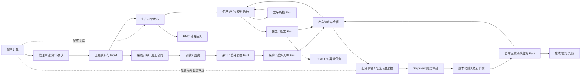

# 业务与协同流程地图 / Business and Collaboration Flow Map

本文用业务名称连接 Source Document、协同任务和领域 Fact，不使用测试验证内部键（T1-T8）代替业务流程名称。当前自动运行能力仍以 Product Core ProcessRuntime、WorkflowUsecase、客户 active revision 和测试为准；“流程设计”和“真实运行链”必须按 [业务链与运行轨迹边界](../architecture/业务链与运行轨迹边界.md) 分开。

## 总图

```mermaid
flowchart LR
  sales["销售订单"] --> review["管理审批/资料确认"]
  review --> engineering["工程资料与 BOM"]
  sales -. "显式关联" .-> productionOrder["生产订单发布"]
  engineering --> productionOrder
  engineering --> sourcing["采购订单 / 加工合同"]
  sourcing --> arrival["到货 / 回货"]
  arrival --> qc["来料 / 委外质检 Fact"]
  qc --> inbound["采购 / 委外入库 Fact"]
  inbound --> inventory["库存流水与余额"]
  productionOrder --> scheduling["PMC 排程任务"]
  productionOrder --> wip["生产 WIP / 委外执行"]
  inventory --> wip
  wip --> stageQc["工序质检 Fact"]
  stageQc --> wip
  wip --> production["完工 / 返工 Fact"]
  production --> exception["REWORK 异常任务"]
  production --> inventory
  sales -. "服务端可出货候选" .-> shipmentDraft["出货草稿 / 可选成品质检"]
  inventory --> shipmentDraft
  shipmentDraft --> financeApproval["Shipment 财务审批"]
  financeApproval --> financeGate["版本化财务放行门禁"]
  financeGate --> shipment["仓库显式确认出货 Fact"]
  shipment --> inventory
  shipment --> settlement["应收/应付/对账"]
```

箭头表示业务依赖，不表示所有步骤都会自动生成任务。领域 usecase 成功后可生成必要交接任务，但任务完成不替代下一领域 Fact。

## 如何读单据流

单据流是本地图必须包含的视角，但不另建一套引擎：

| 读法       | 回答的问题                                           | 当前真源                                                        |
| ---------- | ---------------------------------------------------- | --------------------------------------------------------------- |
| 单据内状态 | 这张 Source Document 当前能从什么状态进入什么状态    | 对应领域状态机、usecase、数据库约束与版本 / CAS                 |
| 来源到下游 | 哪个受控动作可以从当前来源创建另一张单据或 Fact 草稿 | 服务端候选、显式领域命令、来源 ID / 行 ID 与受控快照            |
| 协同门禁   | 哪个审批、任务、质检或责任条件不通过时必须停止       | ProcessRuntime / Workflow、RBAC、active revision 与领域前置校验 |
| 事实结果   | 哪个独立动作真正写库存、出货、生产、核销或财务       | 所属 Fact / Ledger usecase 与权威读回                           |

例如 Shipment 单据流包含草稿、财务放行门禁、真实出货和取消，但财务 approval 只决定门禁；仓库显式确认出货才写 `SHIPPED` 和库存 `OUT`。同理，采购订单批准只形成采购承诺，收货、IQC 和入库各自有独立 Source / Fact 边界。

## 订单受理与工程齐套

| 项目            | 内容                                                                                                                                                                                      |
| --------------- | ----------------------------------------------------------------------------------------------------------------------------------------------------------------------------------------- |
| Source Document | 销售订单                                                                                                                                                                                  |
| 责任角色        | sales → 当前 active revision 的销售审批责任 → engineering → pmc                                                                                                                           |
| 必要协同        | 销售提交、管理审批/退回、工程资料缺失、排期风险                                                                                                                                           |
| 自动动作        | 审批通过后由绑定领域命令激活销售订单，再按所选 Product Core variant 进入工程 / PMC 节点；审批拒绝走 `sales_order_rejected_end`，不执行激活，也不自动修改或取消仍为 `SUBMITTED` 的销售订单 |
| 领域结果        | 销售订单仍按自身状态机生效；BOM/产品资料由工程 usecase 保存                                                                                                                               |
| 禁止            | 审批完成直接生成生产、库存、出货或应收事实                                                                                                                                                |

## 工程需求到采购合同

| 项目            | 内容                                                                                       |
| --------------- | ------------------------------------------------------------------------------------------ |
| 来源            | 当前由业务人员维护的采购订单或经批准的人工采购来源；BOM / 销售订单自动需求仍缺正式计算合同 |
| 责任角色        | engineering/pmc → purchase；永绅可由持有 purchase 角色的财务人员执行                       |
| Source Document | 采购订单；主料和其他材料复用同一模型                                                       |
| 必要协同        | 需求缺失、供应商未确认、价格/交期审批、异常催办                                            |
| 领域结果        | 采购订单批准只形成采购承诺                                                                 |
| 禁止            | 采购批准直接形成入库、库存余额或应付事实                                                   |

## 加工合同与回货

| 项目            | 内容                                                                                                                                                                                                                                                      |
| --------------- | --------------------------------------------------------------------------------------------------------------------------------------------------------------------------------------------------------------------------------------------------------- |
| 来源            | 产品/BOM/生产需求                                                                                                                                                                                                                                         |
| 责任角色        | production/purchase → 加工商；回货后 quality → warehouse                                                                                                                                                                                                  |
| Source Document | 加工合同；布料加工、车缝和手工复用同一模型，车缝 / 手工明细主体为产品，布料加工主体为材料                                                                                                                                                                 |
| 必要协同        | 下单确认、预计回货、延期/缺料、返工/补做                                                                                                                                                                                                                  |
| 当前动作        | 已确认合同行可显式生成委外发料 / 回货事实；已过账产品回货可发起委外回货质检。显式 `PLUSH_SEW_HAND_V1` WIP 可把外发批次绑定到合同行并办理回货；委外不合格可登记并确认返厂或创建返工 WIP，返厂写正式库存 OUT 且可冲正。当前新异常切片仍需目标发布与岗位 UAT |
| 领域结果        | 质检和入库分别由 Quality/Inventory/Purchase usecase 产生                                                                                                                                                                                                  |
| 来源追溯        | 页面按 `OUTSOURCING_ORDER` 返回委外订单、按 `OUTSOURCING_FACT` 返回对应订单 / 事实；导航只负责打开来源，不代替发料、回货、取消或质检动作                                                                                                                  |
| 禁止            | 回货跟踪任务 done 或来源导航直接写入库、应付或结算                                                                                                                                                                                                        |

## 采购到货、质检与入库

| 项目        | 内容                                                                                                                                                                                                                                 |
| ----------- | ------------------------------------------------------------------------------------------------------------------------------------------------------------------------------------------------------------------------------------ |
| 来源        | 已批准采购订单/明细和到货数量                                                                                                                                                                                                        |
| 责任角色    | purchase/warehouse → quality → warehouse                                                                                                                                                                                             |
| 事实顺序    | 采购入库草稿 / 到货待检 → 逐行 IQC 判定 → POSTED → 库存流水 / 余额                                                                                                                                                                   |
| 必要协同    | 待检交接、质检不合格、数量差异、仓库阻塞                                                                                                                                                                                             |
| 自动动作    | 当前 `material_supply` 只完成采购订单提交、审批和批准，不创建收货。业务人员从已批准采购订单显式创建收货草稿时，领域事务逐行建立待检 IQC；追加明细也必须绑定采购订单行并建立对应 IQC。全部合格 / 让步后才允许仓库执行正式入库领域动作 |
| 取消 / 反向 | 已过账入库取消、采购退货和采购调整分别形成反向 / 调整库存流水，保留原事实；页面和 Workflow 不直接改库存余额                                                                                                                          |
| 异常处置    | 初始 IQC 不合格会阻断入库；品质可按精确收货行登记部分退厂或供应商补换，累计有效处置量不得超过来源行。补换确认形成新的待收草稿、HOLD 批次和待检链，原收货不因部分处置被整单取消                                                       |
| 禁止        | `inbound_done` 协同状态替代采购入库 POSTED，把初始 IQC 拒绝伪装成已过账后的采购退货，或用整单取消掩盖部分退厂 / 补换                                                                                                                 |

## 生产排程、异常、成品质检与入库

| 项目     | 内容                                                                                                                                                                                                                                       |
| -------- | ------------------------------------------------------------------------------------------------------------------------------------------------------------------------------------------------------------------------------------------ |
| 来源     | 已发布生产订单、冻结 BOM 物料需求、显式路线 WIP、生产领料 / 完工 / REWORK 事实和完工申报                                                                                                                                                   |
| 责任角色 | PMC 排程 → production 执行 / 异常 → quality → warehouse                                                                                                                                                                                    |
| 任务顺序 | 生产订单 `DRAFT -> RELEASED` 原子生成 `production_scheduling`；显式路线行同时冻结 WIP 路线 / 初始批次；REWORK `DRAFT -> POSTED` 原子生成 `production_exception`                                                                            |
| WIP 顺序 | `FABRIC_PROCESSING → SEWING → HANDWORK → PACKAGING`；拆批、内制 / 外发分配、开始、完成 / 回货、移交、返工和包材确认都走 `execute_production_wip_action`，不是 Workflow task 状态                                                           |
| 质检顺序 | 工序完成或委外回货按冻结关口生成 `PRODUCTION_WIP / PRODUCTION_STAGE / WIP` 质检；`PASSED + PASS` 直接放行，`REJECTED` 进入返工或显式 WIP 让步申请；只有批准后再由独立执行动作落到 WIP 才能让步放行，未批准或只完成 Workflow 仍 fail closed |
| 事实顺序 | 领料 Fact → WIP / 分段质检 → 包装批次 `ACCEPTED` → 完工入库 Fact；完工后的 REWORK Fact 另走返工 / 异常链                                                                                                                                   |
| 必要协同 | 排产确认、工序交接、完工待检、返工异常、入库数量 / 库位异常                                                                                                                                                                                |
| 异常处置 | 报废、WIP 让步与超领先形成显式审批决定；批准只记录决定或额度。报废 / 让步由独立执行与冲正动作落 Fact / WIP，超领额度由正式生产领料在来源物料需求锁内消费；Workflow 完成不代替事实执行                                                      |
| 关闭条件 | 生产订单关闭要求排程任务 `done`；已发布订单取消要求排程任务 `done / rejected`；已过账 REWORK 冲销要求异常任务 `done / rejected`                                                                                                            |
| 禁止     | WIP / 质检 / 排程 / 异常完成直接写领料、完工、返工、报废、成品库存或财务事实；包装批次未 `ACCEPTED` 不得生成 / 过账完工入库；来源取消也不能把任务伪造成已完成                                                                              |

yoyoosun 已确认的客户业务主线是 `布料加工 → 裁片检验 → 车缝 → 皮套检验 → 手工 → 成品检验 → 包装入库`，车缝和手工分别由生产经理决定本厂或外发。Product Core 本地源码已把它收口为固定 `PLUSH_SEW_HAND_V1` v1 路线与 WIP / 分段质检合同，但相关 migrations 尚未应用到共享开发库或目标客户库，也没有目标环境 smoke / 客户验收证据；仍不得从 `processes.sort_order`、两张委外合同或 Workflow task 顺序反向推导路线。

## 出货与业务结算

| 项目           | 内容                                                                                                                                                                                                                                                   |
| -------------- | ------------------------------------------------------------------------------------------------------------------------------------------------------------------------------------------------------------------------------------------------------ |
| 来源           | 销售订单、成品可用库存、装箱/出货资料                                                                                                                                                                                                                  |
| 责任角色       | sales/finance 放行 → warehouse 出货 → finance 对账                                                                                                                                                                                                     |
| 来源候选       | `list_shipment_source_candidates` 在服务端按关键词 / 销售订单 / 分页返回订单行、已出货、剩余量、是否可选和不可选原因；只有 `SHIPPED` 占用销售订单剩余量，普通 `DRAFT` 不预占                                                                           |
| 事实顺序       | 出货草稿 → 可选的出货前成品检验侧链 → Shipment 财务审批 → 版本化放行门禁 `APPROVED` → 仓库显式确认出货 → `SHIPPED` + 库存 `OUT` → 应收 / 对账来源                                                                                                      |
| 出货前检验侧链 | 品质岗位可从尚未提交放行的 `DRAFT` 出货单按产品 / SKU、仓库和批次发起独立质检 Fact；未发起时按可选检验策略进入放行，一旦发起则必须在提交前合格或让步接收。放行提交后不再补造检验，避免改变任务依据                                                     |
| 财务放行       | 出货单来源页启动 `finished_goods_delivery`，首节点为 `shipment_finance_approval`；责任由 active revision 的 Shipment 财务审批设置解析。审批通过后绑定领域命令只写 Shipment 版本化财务门禁并结束流程，不生成仓库放行任务                                |
| 必要协同       | 业务确认、财务放行、仓库执行、出货异常、对账差异                                                                                                                                                                                                       |
| 仓库执行       | `ship_shipment` 是独立领域动作，事务内重验 `APPROVED` 门禁、质检、销售来源累计量、预留和库存；只有真实 `SHIPPED` 后才能生成应收 / 发票来源或对账交接                                                                                                   |
| 取消 / 反向    | 已出货取消走独立取消 Fact 与库存反向流水；原出货保留审计，取消成功后才由服务端重新聚合并恢复可出货余额                                                                                                                                                 |
| 禁止           | 来源候选 / 导入、财务审批任务 done、放行门禁、历史 `shipping_released`、创建质检草稿或页面按钮提示等于 `SHIPPED`；来源导入和表单逐行选择不能绕过服务端候选资格；候选余额不能代替确认出货事务内重验；出货前检验侧链本身不启动 `finished_goods_delivery` |

## 六个正式 ProcessRuntime key / 七个 variant

Product Core 当前登记 6 个 process key、7 个 variant；`sales_order_acceptance` 有 `approval_pmc` 与 `approval_engineering_pmc` 两个 variant，其余 process key 各一个。

| Process key                     | 当前正式节点主线                                                                                    | 领域边界                                            |
| ------------------------------- | --------------------------------------------------------------------------------------------------- | --------------------------------------------------- |
| `sales_order_acceptance`        | 提交销售订单 → 审批；同意后激活并进入所选工程 / 复核节点 → `end`，拒绝到 `sales_order_rejected_end` | 只推进销售 Source 和协同节点；拒绝不执行激活        |
| `material_supply`               | 提交采购订单 → 审批；同意后批准生效 → `end`，拒绝到 `purchase_order_rejected_end`                   | 不创建收货、IQC、入库或应付；拒绝不执行批准         |
| `finished_goods_delivery`       | Shipment 财务审批；同意后版本化放行 → `end`，拒绝写拒绝结果并到 `shipment_finance_rejected_end`     | 两种 end 都不执行真实出货、库存 `OUT`、应收或发票   |
| `finance_payment_approval`      | 审批决定 → 财务执行任务 → 显式 post；拒绝走 `rejected_end`                                          | 审批只改 Source；post 才写分配 / 结清，reverse 独立 |
| `inventory_adjustment_approval` | 提交 → 审批决定 → 仓库执行任务 → 显式 post；拒绝走 `rejected_end`                                   | submit / approval 不写库存；post 才写库存交易       |
| `production_exception_approval` | 审批决定 → 报废 / 让步显式执行；超领走 `over_issue_end`；拒绝走 `rejected_end`                      | 审批只写决定 / 额度，事实执行和额度消费独立         |

## 六个正式流程 key 的异常出口

异常流属于流的一部分，但“拒绝、退回、阻塞、恢复、取消、冲正、返工、补偿”不能合并成同一个出口：

| 流程范围                      | 当前异常出口                                                                                                                                                                             | 不通过后的业务结果                                                                    |
| ----------------------------- | ---------------------------------------------------------------------------------------------------------------------------------------------------------------------------------------- | ------------------------------------------------------------------------------------- |
| 销售、采购、Shipment 财务放行 | canonical 图均有显式拒绝分支，分别进入 `sales_order_rejected_end`、`purchase_order_rejected_end`、`shipment_finance_rejected_end`；Shipment 拒绝通过命名领域命令记录 `REJECTED` 放行结果 | 不执行销售激活、采购批准或 Shipment 财务放行；更不会写真实出货、库存、入库或财务 Fact |
| 收付款                        | approval 分支调用正式拒绝 Source 命令并到 `rejected_end`                                                                                                                                 | 不创建财务执行任务，不写 allocation / settlement                                      |
| 人工库存调整                  | approval 分支调用正式拒绝 Source 命令并到 `rejected_end`                                                                                                                                 | 不创建仓库执行任务，不写库存交易或余额                                                |
| 生产异常                      | approval 拒绝到 `rejected_end`；批准后超领到 `over_issue_end`，报废 / 让步进入生产执行分支                                                                                               | 拒绝不写 SCRAP / WIP / 库存；超领批准只形成额度，仍由正常领料消费                     |
| 任一 linked task              | `ready → blocked → ready` 只表示同一任务暂停 / 恢复；`ready → rejected` 是任务终态                                                                                                       | 不自动取消 Source，不自动冲正 Fact，也不把旧 completed 节点重新打开                   |

取消属于 Source 生命周期，冲正属于 Fact / Ledger 反向记录，返工产生新的领域轮次或 ProcessRuntime attempt，补偿记录已完成效果的撤销 / 替代证据。它们必须继续调用各自领域动作；页面不能用一个“异常处理完成”按钮代替。

## 开发业务链地图

`/__dev/status-flows?view=chains` 以 11 条 Product Core 设计链连接主链、支撑链、异常链和纠正链，覆盖当前 27 个业务状态对象与全部 7 个 ProcessRuntime variant。每个节点仍保留 Source Document、MasterData、ProcessRuntime、Workflow task、Fact / Ledger 或派生结果的所属层，并能下钻到对应状态机或流程编排图。

页面按真实 `task_id` 读取 `workflow.get_task_process_context` 时，只高亮该任务所属的一个 ProcessRuntime 链段和当前节点摘要；它不会把未查询的上下游 Source / Fact 标为已完成。该地图是开发设计投影和导航，不是新的流程引擎、跨域运行历史或业务真源。

## ProcessRuntime 包装动作边界

客户激活流程中的 `start_* / execute_*` 入口只是受控入口，不能作为独立业务真源。血缘必须按最终调用的领域 usecase 登记：销售 / 采购 submit、activate / approve、三条固定流程 Source 决定和 Shipment 财务门禁属于对应 Source Document；收付款 post、库存调整 post 与生产异常 execute 分别属于其领域 Fact / Ledger 或 WIP 效果。ProcessRuntime 保存运行、节点、路由、重试和 durable result，不得因此成为第二套 Source 或 Fact。

## 流程起点、业务轨迹与终点

| 用户问题           | 当前真源与交互                                                                                                                                                                                         |
| ------------------ | ------------------------------------------------------------------------------------------------------------------------------------------------------------------------------------------------------ |
| 从哪里发起         | 业务人员在来源单据页执行“提交 / 启动审批”等受控动作；服务端从真实来源创建并启动 ProcessInstance。普通 `workflow.create_task` 不构成业务流程起点。                                                      |
| 来源流程走到哪里   | 在桌面任务看板或手机岗位任务端打开任务详情；有流程锚点时，“业务轨迹”通过 `get_task_process_context` 展示来源、实例、已执行 / 当前 / 受阻节点和本任务锚点。无锚点或证据不一致时失败关闭，不猜未来分支。 |
| 当前任务发生过什么 | “本任务处理记录”通过 `list_task_events` 最新在前展示这一条任务的状态、责任和意见；它不跨任务，不是完整审批链。                                                                                         |
| 什么时候结束       | 最后一个业务节点结算后，ProcessRuntime 完成 `end` 节点并把 ProcessInstance 标为 `completed`；界面“最终状态”显示“已结束”。任务 `done / rejected` 本身不等于流程或 Fact 已结束。                         |
| 模拟长列表怎么算   | 九岗位 180 条试用任务只验证列表、筛选、状态和办理交互，固定标记为“模拟展示数据”；同批另用 5 张模拟销售订单走正式 ProcessRuntime 路径验证已启动、待办、阻塞、退回和完成。两者都不是客户真实数据或 UAT。 |

## 任务状态与处理结果

当前 Workflow task 持久化状态只表达工作进度：`ready / blocked / done / rejected`。审批、质检等领域结论写入对应业务 Fact 或 ProcessRuntime 节点 outcome，不能塞进任务状态冒充事实。原因在 `blocked / rejected` 时必填；终态任务不重新打开，需要返工时由真实来源创建新的 attempt。当前没有 `cancelled` 任务状态，来源取消必须按终态门禁 fail closed，不能偷用 `done / rejected` 伪造撤销。

三类来源任务使用 `workflow.source-task/v1`、确定性 task code、producer 与 intent hash；公开 `workflow.create_task` 拒绝这些保留任务组，模拟验收数据只使用 `trial_*`。任务与 created event、初始业务状态在来源事务内一起提交，不能出现来源成功而任务丢失。

## 自动化准入

允许自动：计算、校验、状态推导、幂等推进、创建必要下一交接任务、提醒/超时阻塞。

必须人工或领域命令：质检决定、让步接收、库存过账、出货、应收应付确认、发票、收付款和冲正。

任何新增自动流转都要同时证明：来源对象稳定、权限明确、模块 enabled、幂等键稳定、失败可恢复、审计可追踪、重复提交和取消/冲正有测试。
