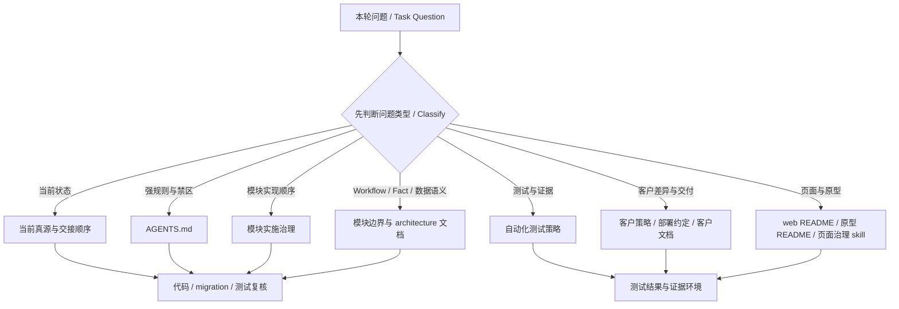

# 项目治理地图 / Project Governance Map

本文回答：遇到项目治理判断时，先分清是哪类治理维度与口径，再跳到对应真源。它不是规则全集、roadmap、能力台账、测试报告或运行时真源；强规则回 [AGENTS.md](../AGENTS.md)，当前状态回 [当前真源与交接顺序](当前真源与交接顺序.md)，真实行为回代码、migration 和测试。

本地开发态可用 [治理地图 / Governance Map（`/__dev/governance`）](../web/README.md#前端文档入口边界) 可视化浏览本文的治理维度与口径、任务分流和文档跳转；该页面只读派生本文，不新增第二套治理规则。

## 读者路径 / Reader Paths

| 你要判断 | 先看本文 | 再跳到 |
| --- | --- | --- |
| “这是架构分层、验证分层，还是测试类型？” | [治理维度与口径速查](#治理维度与口径速查-governance-axes-quick-reference) | [自动化测试策略：证据维度](product/自动化测试策略.md#证据维度)、[模块实施治理：Architecture Layer](product/模块实施治理.md#1-实施顺序与-architecture-layer-implementation-order-and-architecture-layer) |
| “本轮改动要同步哪些文档和测试？” | [常见任务分流](#常见任务分流-common-task-routing) | [AGENTS.md：系统分层与 Workflow / Fact](../AGENTS.md#系统分层与-workflow-fact)、[自动化测试策略](product/自动化测试策略.md) |
| “页面、原型和 docs 哪个代表当前实现？” | [治理维度与口径速查](#治理维度与口径速查-governance-axes-quick-reference) | [产品原型资产：Lifecycle](product/prototypes/README.md#阶段分类-lifecycle)、[当前真源：前端入口](当前真源与交接顺序.md#前端入口) |
| “客户资料、产品核心和部署包怎么区分？” | [治理维度与口径速查](#治理维度与口径速查-governance-axes-quick-reference) | [客户实例策略](product/客户实例策略.md)、[客户差异策略](product/客户差异策略.md)、[部署约定](部署约定.md) |
| “新增文档该放哪里、要不要更新索引？” | [维护规则](#维护规则-maintenance-rules) | [docs Guide：索引同步](README.md#索引同步-index-sync)、[文档清单](文档清单.md) |

## 项目治理分流图 / Governance Routing

这张图只说明阅读分流。任何文档结论都必须回到当前代码、migration、测试和本轮任务范围复核。

## 治理维度与口径速查 / Governance Axes Quick Reference

| 治理维度与口径 | 回答什么 | 先看哪里 | 不要混成 |
| --- | --- | --- | --- |
| 当前真源与交接 | 现在先读哪里，哪些历史材料不能当真源 | [当前真源与交接顺序](当前真源与交接顺序.md) | 不替代能力台账、roadmap 或代码 |
| 架构责任层级 / Architecture layer | 责任属于 Workflow、MasterData、Fact、RBAC、API / UI、Help / QA、Productization 等哪一层 | [AGENTS.md：系统分层与 Workflow / Fact](../AGENTS.md#系统分层与-workflow-fact)、[模块边界](product/模块边界.md)、[模块实施治理](product/模块实施治理.md) | 不等于测试覆盖层级 |
| 数据语义层级 / Data semantic layer | 对象是 Source Document、Workflow、Fact、Ledger / Read Model、Report / Audit 中哪一种 | [模块边界](product/模块边界.md)、[主数据 / 源单据 / 事实边界评审](architecture/主数据源单据事实边界评审.md)、[状态 / Workflow / Fact 边界](architecture/状态工作流事实边界.md) | 不把 Workflow done 写成 Fact posted |
| 模块实施治理 | 新模块从 docs-only review 到 schema、repo/usecase、API/RBAC、UI、客户试用怎么过门禁 | [模块实施治理](product/模块实施治理.md) | 不替代具体领域 architecture 评审 |
| 验证层级 T0-T8 | 本轮影响面需要验证到哪里 | [自动化测试策略：验证层级 T0-T8](product/自动化测试策略.md#验证层级-t0-t8) | 不叫项目架构分层，也不等同于 unit / E2E |
| 测试形态 | 某个测试证明了什么 | [自动化测试策略：证据维度](product/自动化测试策略.md#证据维度)、[$plush-test-governance](../.agents/skills/plush-test-governance/SKILL.md) | 不用 smoke 代替回归，不用 UI regression 证明后端事实 |
| 证据环境 | 证据发生在 static scan、local mock、real DB、browser runtime、dev/test env 还是目标部署 | [自动化测试策略](product/自动化测试策略.md)、[web/README.md](../web/README.md)、[scripts/README.md](../scripts/README.md)、[部署约定](部署约定.md) | 不把本地 mock 当目标环境验收 |
| 文档真源层级 | 哪些文档是正式口径，哪些只是参考、归档或过程记录 | [docs Guide](README.md)、[文档清单](文档清单.md)、[当前真源与交接顺序](当前真源与交接顺序.md) | 不让 `docs/reference/**`、`docs/archive/**`、`progress.md` 覆盖当前代码 |
| 原型状态 | 页面资产是 Draft、To Implement 还是 Current | [产品原型资产](product/prototypes/README.md)、[web/README.md](../web/README.md) | 原型晋级不等于 runtime 自动改变 |
| 页面设计治理 | 页面是否简洁易用、信息密度是否合理、模块和动作是否一眼可懂 | [$plush-page-design-governance](../.agents/skills/plush-page-design-governance/SKILL.md)、[产品原型资产：设计简化原则](product/prototypes/README.md#设计简化原则-simplification-principles) | 不把视觉优化混成后端事实或权限变更 |
| 产品化与客户差异 | 内容属于 Product Core、客户配置、客户资料、私有化部署包还是未来 SaaS | [客户实例策略](product/客户实例策略.md)、[客户差异策略](product/客户差异策略.md)、[多客户私有化复制包评审](product/多客户私有化复制包评审.md)、[SaaS 进入门禁评审](product/软件即服务进入门禁评审.md) | 不把当前客户资料硬编码进核心 usecase |
| 交付运行层级 | 能力是在本地开发、dev-only 工具、试用 / 测试环境、目标部署还是发布回滚证据中成立 | [部署约定](部署约定.md)、[server/deploy/README.md](../server/deploy/README.md)、[deployments](../deployments/README.md) | 不用 dev-only 页面证明生产可用 |

## 常见任务分流 / Common Task Routing

| 如果本轮要做 | 第一跳 | 必须同步检查 |
| --- | --- | --- |
| 改 schema、migration、repo、usecase、API、RBAC | [AGENTS.md](../AGENTS.md)、[模块实施治理](product/模块实施治理.md) | 当前代码、测试、[当前真源与交接顺序](当前真源与交接顺序.md)、能力台账、相关 architecture 文档 |
| 改 Workflow、状态或事实边界 | [状态 / Workflow / Fact 边界](architecture/状态工作流事实边界.md) | Workflow / Fact usecase、schema、测试、模块边界、当前真源摘要 |
| 改页面、菜单、原型或信息密度 | [web/README.md](../web/README.md)、[产品原型资产](product/prototypes/README.md)、[$plush-page-design-governance](../.agents/skills/plush-page-design-governance/SKILL.md) | 真实页面、DOM / box 回归、菜单 / RBAC 代码、正式产品入口计划、当前真源入口 |
| 改测试策略、测试命令或验收口径 | [自动化测试策略](product/自动化测试策略.md)、[$plush-test-governance](../.agents/skills/plush-test-governance/SKILL.md) | T0-T8、测试形态、证据环境、相关 README / scripts / CI 入口 |
| 改客户资料、导入、客户配置或交付资料 | [customers README](customers/README.md)、[客户实例策略](product/客户实例策略.md)、[客户差异策略](product/客户差异策略.md) | 客户交付矩阵、客户差异台账、source manifest、配置包、导入脚本和证据环境 |
| 改部署、发布或低配运行口径 | [部署约定](部署约定.md)、[server/deploy/README.md](../server/deploy/README.md) | Compose 真源、migration runbook、健康检查、低配构建边界、发布证据 |
| 新增、重命名或重分类正式 Markdown | [docs Guide：索引同步](README.md#索引同步-index-sync) | [文档清单](文档清单.md)、最近目录 README、正文引用、dev-only viewer、测试断言 |
| 吸收外部 GPT、截图、参考材料或历史归档 | [当前真源与交接顺序](当前真源与交接顺序.md)、[文档清单](文档清单.md) | 当前代码、正式 docs、测试、参考资料边界；不要把外部输入直接升真源 |

## 维护规则 / Maintenance Rules

- 本文只维护治理维度与口径和分流路径；完整规则继续留在 `AGENTS.md`、专题文档、skill、hook、QA 脚本或测试策略中。
- 新增“层级 / 状态 / 形态”口径时，先判断是否已有专题真源；若只是已有真源的别名，更新本文链接，不新增第二套定义。
- 新增长期维护 Markdown、重命名文档或改变文档职责时，同步检查 [docs Guide](README.md)、[文档清单](文档清单.md)、最近目录 README、正文引用和 `web/src/erp/config/devDocs.mjs`。
- 文档中可以使用表格、Mermaid 和指定章节链接来降低阅读成本；不要为了形式整齐把长规则、复杂流程或完整测试策略强行塞进表格。
- 本文发生实质改动时，按项目约定更新 `progress.md`；仅讨论、不改文件时不用追加过程记录。
