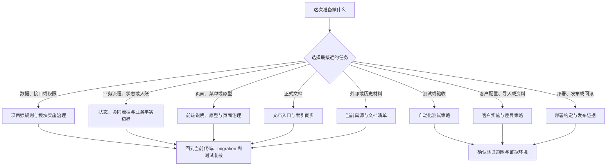

# 项目治理地图 / Project Governance Map

遇到改动时，先从“常见任务分流”选择最接近的一项，直接确认先看什么、同时检查什么、最容易误判什么。只有需要解释内部层级和完整关系时，再看后面的治理维度与关系图。

本文不是规则全集、roadmap、能力台账、测试报告或运行时真源；强规则回 [AGENTS.md](../AGENTS.md)，当前状态回 [当前真源与交接顺序](当前真源与交接顺序.md)，真实行为回当前代码、migration 和测试。本地开发态可用 [改动规则助手（`/__dev/governance`）](../web/README.md#前端文档入口边界) 只读浏览本文，不新增第二套治理规则。

## 常见任务分流 / Common Task Routing

| 页面键（内部）        | 你这次准备做什么             | 内部范围                                                                                              | 先看                                                                                                                                                | 同时检查                                                                                                                                              | 不要误判                                                                                           |
| --------------------- | ---------------------------- | ----------------------------------------------------------------------------------------------------- | --------------------------------------------------------------------------------------------------------------------------------------------------- | ----------------------------------------------------------------------------------------------------------------------------------------------------- | -------------------------------------------------------------------------------------------------- |
| product-core-boundary | 判断需求是否进入产品内核     | Product Core、Industry Template、Customer Config、Customer Extension、Import Adapter、Print Candidate | [客户差异策略](product/客户差异策略.md)、[模块边界](product/模块边界.md)、[产品能力进度台账](product/产品能力进度台账.md)                           | 回到当前代码、schema、usecase、API、UI 和测试核对归属；涉及客户资料时同步核对私有仓和正式客户差异边界。                                               | Product Core 不等于 `server/internal/core`；客户资料、部署差异或单次验收结果不会自动进入产品内核。 |
| data-contract         | 调整数据、接口或权限         | schema、migration、repository、usecase、API、RBAC                                                     | [项目强规则](../AGENTS.md)、[模块实施治理](product/模块实施治理.md)                                                                                 | 先核对当前代码、受影响测试、[当前真源与交接顺序](当前真源与交接顺序.md)和相关架构文档；只有产品能力边界、状态或关键阻塞发生实质变化时才更新能力台账。 | 改文档或改页面不能代替真实实现；权限不能只靠前端隐藏。                                             |
| workflow-fact         | 调整业务流程、状态或入账结果 | Source Document、Workflow、ProcessRuntime、Fact、Ledger                                               | [状态、协同流程与业务事实边界](architecture/状态工作流事实边界.md)                                                                                  | 核对协同任务、流程处理器、领域 usecase、schema、测试、模块边界和当前真源摘要。                                                                        | 协同任务完成不等于库存、出货或财务事实已经生效。                                                   |
| page-menu             | 调整页面、菜单或原型         | 页面结构、交互、菜单、原型、信息密度                                                                  | [前端说明](../web/README.md)、[产品原型资产](product/prototypes/README.md)、[页面设计治理](../.agents/skills/plush-page-design-governance/SKILL.md) | 核对真实页面、DOM 与盒模型回归、菜单与权限代码、正式产品入口计划和当前真源入口。                                                                      | 原型不代表已经实现；页面隐藏不等于权限控制；视觉变化不应改写后端事实。                             |
| test-acceptance       | 调整测试或验收标准           | 内部验证键 T0-T8、静态检查、单元、集成、浏览器、目标环境                                              | [自动化测试策略](product/自动化测试策略.md)、[测试治理](../.agents/skills/plush-test-governance/SKILL.md)                                           | 核对本轮影响范围、测试形态、证据环境以及相关 README、脚本和 CI 入口。                                                                                 | 一项检查通过只证明对应范围和环境，不代表已经发布或完成客户验收。                                   |
| customer-delivery     | 准备客户配置、导入或交付资料 | 客户配置、客户私有资料、seed、fixture、导入、交付资料                                                 | [新增甲方客户实施流程](product/新增甲方客户实施流程.md)、[客户实例策略](product/客户实例策略.md)、[客户差异策略](product/客户差异策略.md)           | 核对受控客户交付矩阵、差异决策、source manifest、配置包、导入脚本和证据环境。                                                                         | 客户原件和私有资料不能进入 Product Core；模拟数据不能冒充真实客户数据。                            |
| release-runtime       | 准备部署、发布或回滚         | Compose、migration、制品、health、ready、smoke、rollback                                              | [部署约定](部署约定.md)、[服务端部署说明](../server/deploy/README.md)                                                                               | 核对 Compose 真源、migration runbook、不可变制品、目标配置、健康检查、业务 smoke、发布证据和回滚点。                                                  | 本地绿色、开发辅助页面或部署完成都不等于客户验收。                                                 |
| docs                  | 新增或整理正式文档           | docs、README、文档清单、开发文档查看器                                                                | [文档入口与索引同步](README.md#索引同步-index-sync)                                                                                                 | 核对[文档清单](文档清单.md)、最近目录 README、正文引用、开发文档查看器和相关测试断言。                                                                | 文档被登记只说明能够找到，不证明内容正确或功能已经实现。                                           |
| external-input        | 吸收截图、外部建议或历史材料 | GPT、截图、外部参考、archive、progress                                                                | [当前真源与交接顺序](当前真源与交接顺序.md)、[文档清单](文档清单.md)                                                                                | 回到当前代码、正式文档、测试和参考资料边界逐项复核。                                                                                                  | 外部材料只能作为输入，不能直接成为项目真源或完成证据。                                             |

## 个人 ToB 交付循环 / Personal ToB Delivery Loop

甲方只确认业务目标、关键选择和实际使用结果，不跟随代码实现、内部层级或测试内部键逐级签认；项目负责人和 Codex 负责把输入补成最小充分闭环。详细边界见 [AGENTS.md：个人开发方式与工作区](../AGENTS.md#个人开发方式与工作区) 和 [模块实施治理：当前开发模式](product/模块实施治理.md#1-当前开发模式)。

| 步骤                     | 谁负责                    | 本步完成标志                                                                       |
| ------------------------ | ------------------------- | ---------------------------------------------------------------------------------- |
| 甲方提出目标或痛点       | 甲方                      | 说明业务目标、痛点或使用反馈；无需提供代码方案。                                   |
| 负责人带回 Codex         | 项目负责人                | 标明甲方输入和必要材料，界定本轮可验证业务切片。                                   |
| Codex 补齐并实现最小闭环 | Codex                     | 补齐必要真源、状态、权限、异常、恢复、测试和基础易用性，只采用当前需求所需复杂度。 |
| 明确授权后发布固定版本   | 项目负责人 + Codex        | 确认版本、目标环境、回滚点和发布证据；未获授权不部署。                             |
| 甲方使用反馈后再迭代     | 甲方 + 项目负责人 + Codex | 按实际使用结果归类为缺陷、细化或新需求，进入下一轮。                               |

## 治理维度与口径速查 / Governance Axes Quick Reference

下面是维护规则时使用的内部分类。日常改动先使用“常见任务分流”，不要求先理解这些术语。

| 治理维度与口径                     | 回答什么                                                                                | 先看哪里                                                                                                                                                                                              | 不要混成                                                                       |
| ---------------------------------- | --------------------------------------------------------------------------------------- | ----------------------------------------------------------------------------------------------------------------------------------------------------------------------------------------------------- | ------------------------------------------------------------------------------ |
| 当前真源与交接                     | 现在先读哪里，哪些历史材料不能当真源                                                    | [当前真源与交接顺序](当前真源与交接顺序.md)                                                                                                                                                           | 不替代能力台账、roadmap 或代码                                                 |
| 架构责任层级 / Architecture layer  | 责任属于 Workflow、MasterData、Fact、RBAC、API / UI、Help / QA、Productization 等哪一层 | [AGENTS.md：系统分层与 Workflow / Fact](../AGENTS.md#系统分层与-workflow-fact)、[模块边界](product/模块边界.md)、[模块实施治理](product/模块实施治理.md)                                              | 不等于测试覆盖层级                                                             |
| 数据语义层级 / Data semantic layer | 对象是 Source Document、Workflow、Fact、Ledger / Read Model、Report / Audit 中哪一种    | [模块边界](product/模块边界.md)、[主数据 / 源单据 / 事实边界评审](architecture/主数据源单据事实边界评审.md)、[状态 / Workflow / Fact 边界](architecture/状态工作流事实边界.md)                        | 不把 Workflow done 写成 Fact posted                                            |
| 模块实施治理                       | 个人需求如何补成最小业务闭环，何时才启用 schema、权限、发布等专项治理                   | [模块实施治理](product/模块实施治理.md)                                                                                                                                                               | 不把普通改动机械扩成全层级门禁，也不替代具体领域 architecture 评审             |
| 验证范围（内部键 T0-T8）           | 本轮影响面需要验证到哪里                                                                | [自动化测试策略：验证层级 T0-T8](product/自动化测试策略.md#验证层级-t0-t8)                                                                                                                            | 不叫项目架构分层，也不等同于 unit / E2E                                        |
| 测试形态                           | 某个测试证明了什么                                                                      | [自动化测试策略：证据怎么表达](product/自动化测试策略.md#证据怎么表达)、[$plush-test-governance](../.agents/skills/plush-test-governance/SKILL.md)                                                    | 不用 smoke 代替回归，不用 UI regression 证明后端事实                           |
| 证据环境                           | 证据发生在 static scan、local mock、real DB、browser runtime、dev/test env 还是目标部署 | [自动化测试策略](product/自动化测试策略.md)、[web/README.md](../web/README.md)、[scripts/README.md](../scripts/README.md)、[部署约定](部署约定.md)                                                    | 不把本地 mock 当目标环境验收                                                   |
| 文档真源层级                       | 哪些文档是正式口径，哪些只是归档或过程记录                                              | [docs Guide](README.md)、[文档清单](文档清单.md)、[当前真源与交接顺序](当前真源与交接顺序.md)                                                                                                         | 外部输入先转化为本项目合同；不让 `docs/archive/**`、`progress.md` 覆盖当前代码 |
| 原型状态                           | 页面资产是 Draft、To Implement 还是 Current                                             | [产品原型资产](product/prototypes/README.md)、[web/README.md](../web/README.md)                                                                                                                       | 原型晋级不等于 runtime 自动改变                                                |
| 页面设计治理                       | 页面是否简洁易用、信息密度是否合理、模块和动作是否一眼可懂                              | [$plush-page-design-governance](../.agents/skills/plush-page-design-governance/SKILL.md)、[产品原型资产：设计简化原则](product/prototypes/README.md#设计简化原则-simplification-principles)           | 不把视觉优化混成后端事实或权限变更                                             |
| 产品化与客户差异                   | 内容属于 Product Core、客户配置、客户资料、私有化部署包还是未来 SaaS                    | [客户实例策略](product/客户实例策略.md)、[客户差异策略](product/客户差异策略.md)、[多客户私有化复制包评审](product/多客户私有化复制包评审.md)、[SaaS 进入门禁评审](product/软件即服务进入门禁评审.md) | 不把当前客户资料硬编码进核心 usecase                                           |
| 交付运行层级                       | 能力是在本地开发、dev-only 工具、试用 / 测试环境、目标部署还是发布回滚证据中成立        | [部署约定](部署约定.md)、[server/deploy/README.md](../server/deploy/README.md)、[deployments](../deployments/README.md)                                                                               | 不用 dev-only 页面证明生产可用                                                 |

## 项目治理分流图 / Governance Routing

```mermaid
flowchart TD
  Q["这次准备做什么"] --> C{"选择最接近的任务"}
  C -->|数据、接口或权限| A["项目强规则与模块实施治理"]
  C -->|业务流程、状态或入账| B["状态、协同流程与业务事实边界"]
  C -->|页面、菜单或原型| P["前端说明、原型与页面治理"]
  C -->|测试或验收| T["自动化测试策略"]
  C -->|客户配置、导入或资料| D["客户实施与差异策略"]
  C -->|部署、发布或回滚| O["部署约定与发布证据"]
  C -->|正式文档| M["文档入口与索引同步"]
  C -->|外部或历史材料| X["当前真源与文档清单"]
  A --> R["回到当前代码、migration 和测试复核"]
  B --> R
  P --> R
  T --> E["确认验证范围与证据环境"]
  D --> E
  O --> E
  M --> R
  X --> R
```

这张图只说明阅读分流。任何文档结论都必须回到当前代码、migration、测试和本轮任务范围复核。

## 维护规则 / Maintenance Rules

- 本文只维护任务分流、治理维度与口径；完整规则继续留在 `AGENTS.md`、专题文档、skill、hook、QA 脚本或测试策略中。
- 页面默认只展示任务分流中的“你这次准备做什么、先看、同时检查、不要误判”；内部范围、治理维度、交付循环和完整关系图按需展开。
- 新增任务行时必须提供唯一“页面键（内部）”，并写清先看、同时检查和不要误判；页面不得再用关键词或共享路径猜测任务关系。
- 新增“层级 / 状态 / 形态”口径时，先判断是否已有专题真源；若只是已有真源的别名，更新本文链接，不新增第二套定义。
- 新增长期维护 Markdown、重命名文档或改变文档职责时，同步检查 [docs Guide](README.md)、[文档清单](文档清单.md)、最近目录 README、正文引用和 `web/src/dev-workbench/config/devDocs.mjs`。
- 文档中可以使用表格、Mermaid 和指定章节链接降低阅读成本；不要为了形式整齐把长规则、复杂流程或完整测试策略强行塞进表格。
- 只有命中 `AGENTS.md` 的过程记录条件时才更新 `progress.md`；普通且已闭环的小改动不重复留痕。
